# Guía de Visualización por Tipo de Gráfico

## Introducción

La mayoría de las guías de visualización están organizadas por librería: primero todo Matplotlib, después todo Seaborn, después Plotly. Eso es útil si ya sabés qué librería querés usar. Pero en la práctica, el flujo de trabajo es al revés: **tenés un tipo de dato y un mensaje, y necesitás saber qué librería te lo resuelve más fácil**.

Esta guía está organizada por tipo de gráfico. Cada sección es independiente: si necesitás un scatterplot, entrás a la sección de scatterplot y comparás las cuatro librerías en una sola pantalla.

Las cuatro librerías que compararemos:

- **Matplotlib**: el lienzo en blanco. Control total, pero especificás todo.
- **Seaborn**: la capa de alto nivel sobre Matplotlib. Decide el diseño por vos, entiende DataFrames.
- **Plotly**: interactivo por defecto. Hover, zoom, tooltips sin configuración.
- **Bokeh**: interactivo y declarativo. Pensado para dashboards y web.

> **Cómo leer esta guía**: Elegí el tipo de gráfico que necesitás. Compará los 4 bloques de código. Mirá la tabla de personalizaciones. Leé el párrafo de "¿Qué librería elegir?" al final. Listo.

---

## 1. Scatterplot (nube de puntos)

### ¿Qué muestra?

Relación entre dos variables numéricas. Cada punto es una observación. La posición en X e Y codifica los valores; el color, tamaño o forma pueden codificar variables adicionales.

### ¿Cuándo usarlo?

- Detectar correlaciones o ausencia de correlación.
- Identificar clusters y outliers.
- Ver la distribución conjunta de dos variables.

### Matplotlib

```python
import matplotlib.pyplot as plt
import numpy as np

np.random.seed(42)
x = np.random.randn(100)
y = 2 * x + np.random.randn(100)
cat = np.random.choice(['A', 'B'], 100)

plt.scatter(x, y, c=np.where(cat == 'A', 'steelblue', 'coral'),
            alpha=0.6, s=60)
plt.xlabel('Variable X')
plt.ylabel('Variable Y')
plt.show()
```

### Seaborn

```python
import seaborn as sns
import matplotlib.pyplot as plt
import numpy as np

np.random.seed(42)
df = {
    'x': np.random.randn(100),
    'y': 2 * np.random.randn(100) + np.random.randn(100),
    'cat': np.random.choice(['A', 'B'], 100)
}

sns.scatterplot(data=df, x='x', y='y', hue='cat', alpha=0.6, s=60)
plt.show()
```

### Plotly

```python
import plotly.express as px
import numpy as np

np.random.seed(42)
df = {
    'x': np.random.randn(100),
    'y': 2 * np.random.randn(100) + np.random.randn(100),
    'cat': np.random.choice(['A', 'B'], 100)
}

fig = px.scatter(df, x='x', y='y', color='cat', opacity=0.6,
                 hover_data=['cat'])
fig.show()
```

### Bokeh

```python
from bokeh.plotting import figure, show
from bokeh.models import HoverTool
import numpy as np

np.random.seed(42)
x = np.random.randn(100)
y = 2 * x + np.random.randn(100)
cat = np.random.choice(['A', 'B'], 100)

p = figure(title='Scatterplot', width=500, height=400)
p.scatter(x, y, color=np.where(cat == 'A', 'steelblue', 'coral'),
          alpha=0.6, size=8)
p.add_tools(HoverTool(tooltips=[('X', '@x'), ('Y', '@y')]))
show(p)
```

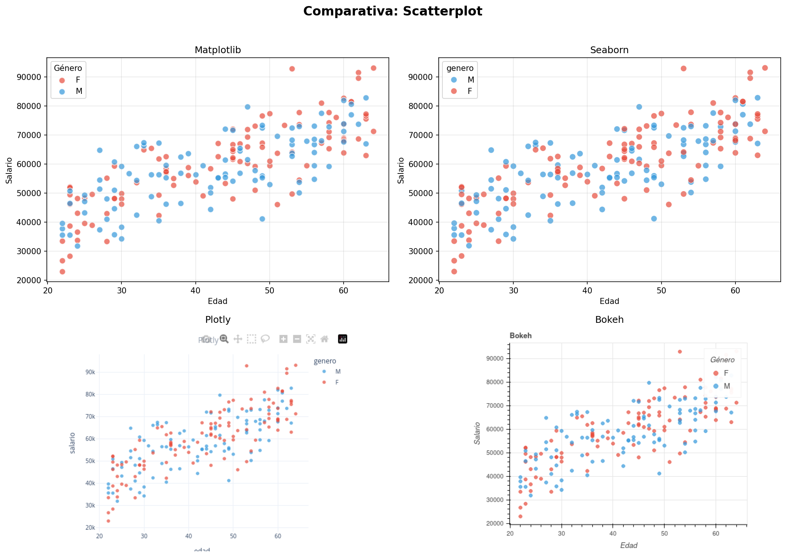

### Tabla comparativa de personalizaciones

| Personalización | Matplotlib | Seaborn | Plotly | Bokeh |
|---|---|---|---|---|
| Colorear por categoría | `c=` con array manual | `hue=` | `color=` | `color=` en source |
| Tamaño de puntos | `s=` | `size=` | `size=` | `size=` |
| Transparencia | `alpha=` | `alpha=` | `opacity=` | `alpha=` |
| Tooltips/hover | No nativo | No nativo | `hover_data=` | `HoverTool` |
| Facetas/subplots | Manual con `plt.subplots()` | `col=`, `row=` | `facet_col=` | `layout()` |
| Tendencia/regresión | `np.polyfit` manual | `sns.regplot()` | `trendline='ols'` | No nativo |


### Modo Bestia: cada librería en su máximo esplendor

Acá mostramos lo que CADA librería hace MEJOR que las demás. No es una comparativa justa — es una demostración de superpoderes.

#### Matplotlib

```python
import matplotlib.pyplot as plt
import numpy as np

np.random.seed(42)
x = np.random.randn(150)
y = 2*x + np.random.randn(150)*0.8
cat = np.random.choice(['A', 'B', 'C'], 150)

fig, ax = plt.subplots(figsize=(8, 6))
for c, color in zip(['A', 'B', 'C'], ['steelblue', 'coral', 'seagreen']):
    mask = cat == c
    ax.scatter(x[mask], y[mask], c=color, alpha=0.6, s=60, label=f'Grupo {c}')

# Anotación con flecha
ax.annotate('Outlier', xy=(x[np.argmax(y)], y.max()), xytext=(2, 4),
            arrowprops=dict(arrowstyle='->', color='red', lw=1.5),
            fontsize=10, color='red')

# Eje secundario
ax2 = ax.twinx()
ax2.plot(x, y*2, color='gray', alpha=0.3, linewidth=1)
ax2.set_ylabel('Escala secundaria', color='gray')

# Texto enriquecido y leyenda custom
ax.set_title(r'Relación $\rho_{XY}$ con control total', fontsize=14)
ax.set_xlabel(r'Variable $X \sim \mathcal{N}(0,1)$')
ax.legend(title='Categorías', loc='upper left', frameon=True, fancybox=True)
plt.show()
```

#### Seaborn

```python
import seaborn as sns
import matplotlib.pyplot as plt
import numpy as np
import pandas as pd

np.random.seed(42)
df = pd.DataFrame({
    'x': np.random.randn(200),
    'y': 2*np.random.randn(200) + np.random.randn(200),
    'cat': np.random.choice(['A', 'B', 'C'], 200),
    'size': np.random.randint(20, 100, 200),
    'style': np.random.choice(['X', 'Y'], 200)
})

# Tres aesthetic mappings en una línea
sns.scatterplot(data=df, x='x', y='y', hue='cat', size='size', style='style',
                palette='Set2', alpha=0.7)
plt.show()

# O 12 gráficos automáticos con facets
sns.relplot(data=df, x='x', y='y', col='cat', row='style',
            hue='size', palette='viridis', alpha=0.7, kind='scatter')
plt.show()
```

#### Plotly

```python
import plotly.express as px
import numpy as np
import pandas as pd

np.random.seed(42)
df = pd.DataFrame({
    'x': np.random.randn(300),
    'y': 2*np.random.randn(300) + np.random.randn(300),
    'cat': np.random.choice(['A', 'B', 'C'], 300),
    'info': np.random.randint(1, 100, 300),
    'frame': np.random.choice(['T1', 'T2', 'T3'], 300)
})

fig = px.scatter(df, x='x', y='y', color='cat',
                 hover_data=['info', 'frame'],
                 marginal_x='histogram', marginal_y='violin',
                 facet_col='cat', animation_frame='frame',
                 template='plotly_white')
fig.show()
```

#### Bokeh

```python
from bokeh.plotting import figure, show, output_file
from bokeh.models import HoverTool, ColumnDataSource, Slider
from bokeh.layouts import column
import numpy as np

np.random.seed(42)
source = ColumnDataSource(data=dict(
    x=np.random.randn(100),
    y=2*np.random.randn(100) + np.random.randn(100),
    desc=[f'Punto {i}' for i in range(100)]
))

p = figure(title='Scatter interactivo', width=500, height=400,
           tools='pan,box_zoom,wheel_zoom,reset')
p.scatter('x', 'y', source=source, size=10, alpha=0.6)
p.add_tools(HoverTool(tooltips=[
    ('Desc', '@desc'), ('X', '@x{0.00}'), ('Y', '@y{0.00}')
]))

slider = Slider(start=0, end=10, value=5, step=1, title='Umbral')
layout = column(p, slider)
output_file('scatter_bestia.html')
show(layout)
```

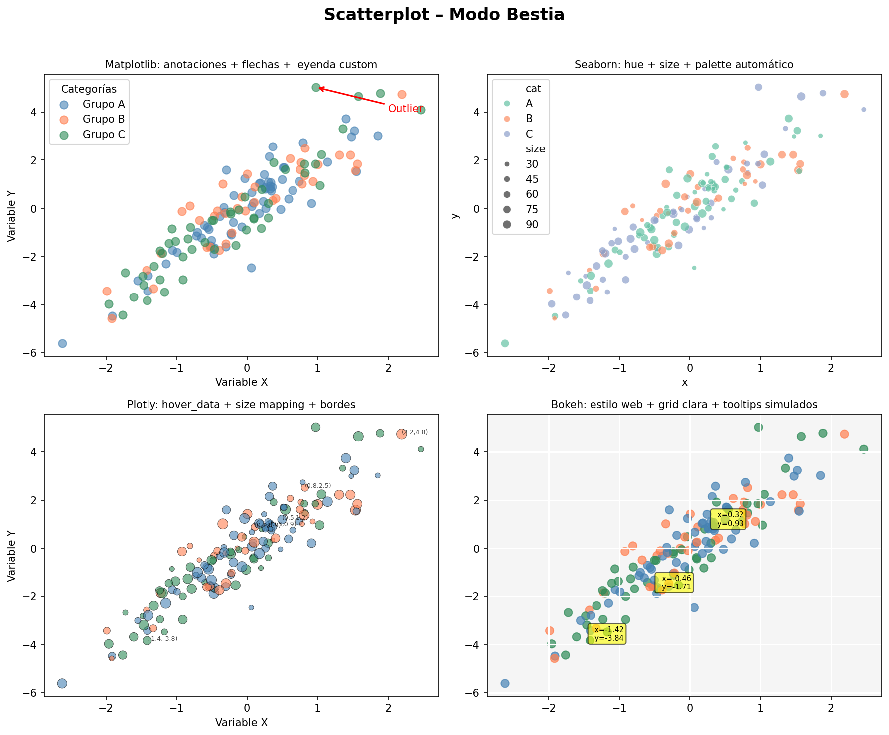

> **Nota**: La imagen de arriba muestra el resultado estático, pero Plotly y Bokeh son INTERACTIVOS. El código genera también archivos HTML que podés abrir en el navegador para ver el verdadero poder.

**¿Por qué cada librería brilla acá?**
- **Matplotlib**: Control pixel a pixel. Anotaciones con flechas, ejes gemelos (`twinx`), texto en LaTeX. Cuando necesitás que la figura salga EXACTAMENTE como la pediste.
- **Seaborn**: Inteligencia de DataFrame. `hue` + `size` + `style` simultáneos, y `relplot(col=..., row=...)` genera 12 paneles en una línea. No pensás en coordenadas, pensás en variables.
- **Plotly**: Interactividad sin configuración. Hover con múltiples columnas, histogramas marginales automáticos, animaciones por frame. Ideal para dashboards y presentaciones.
- **Bokeh**: Capacidad web nativa. Tooltips HTML personalizados, widgets (sliders, dropdowns), layouts complejos. Es la puerta de entrada a apps interactivas.

### Error común: Scatterplot sin `alpha` con miles de puntos

Con 10.000 puntos y `alpha=1`, el gráfico se convierte en un blob sólido donde no se ve la densidad. Siempre usá transparencia cuando tenés más de 200 puntos. En Matplotlib y Seaborn: `alpha=0.3` a `0.5`. En Plotly: `opacity=0.5`.

### ¿Qué librería elegir para scatter?

> Para un scatterplot exploratorio rápido, usá **Seaborn** (`sns.scatterplot`, 1 línea). Para dashboards interactivos con tooltips y zoom, usá **Plotly**. Si necesitás control total de cada píxel para una publicación, **Matplotlib**. Bokeh shinea cuando el scatter es parte de un dashboard web más grande.

---

## 2. Líneas (Line plot)

### ¿Qué muestra?

Evolución de una variable numérica a lo largo de una secuencia ordenada (tiempo, índice, posición). Conecta puntos consecutivos con líneas.

### ¿Cuándo usarlo?

- Series temporales.
- Funciones matemáticas.
- Tendencias y trayectorias.

### Matplotlib

```python
import matplotlib.pyplot as plt
import numpy as np

x = np.linspace(0, 10, 100)
y1 = np.sin(x)
y2 = np.cos(x)

plt.plot(x, y1, label='sin', color='steelblue', linewidth=2)
plt.plot(x, y2, label='cos', color='coral', linestyle='--')
plt.legend()
plt.show()
```

### Seaborn

```python
import seaborn as sns
import matplotlib.pyplot as plt
import numpy as np

x = np.linspace(0, 10, 100)
df = {
    'x': np.tile(x, 2),
    'y': np.concatenate([np.sin(x), np.cos(x)]),
    'serie': ['sin'] * 100 + ['cos'] * 100
}

sns.lineplot(data=df, x='x', y='y', hue='serie')
plt.show()
```

### Plotly

```python
import plotly.express as px
import numpy as np

x = np.linspace(0, 10, 100)
df = {
    'x': np.tile(x, 2),
    'y': np.concatenate([np.sin(x), np.cos(x)]),
    'serie': ['sin'] * 100 + ['cos'] * 100
}

fig = px.line(df, x='x', y='y', color='serie')
fig.show()
```

### Bokeh

```python
from bokeh.plotting import figure, show
import numpy as np

x = np.linspace(0, 10, 100)
p = figure(title='Line plot', width=500, height=400)
p.line(x, np.sin(x), legend_label='sin', color='steelblue', line_width=2)
p.line(x, np.cos(x), legend_label='cos', color='coral', line_dash='dashed')
show(p)
```

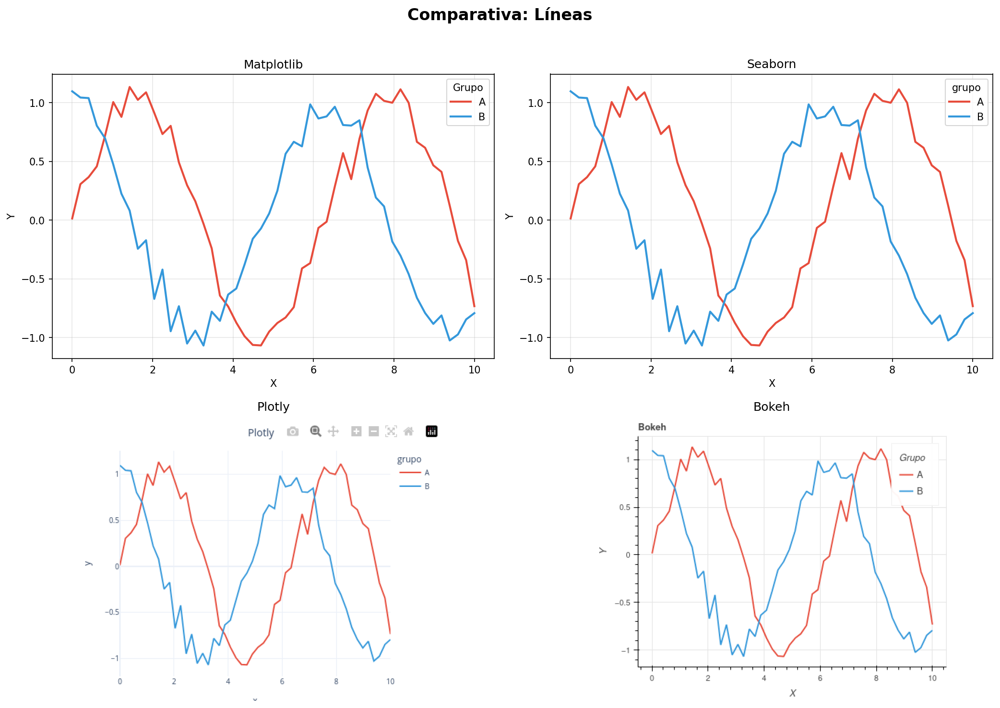

### Tabla comparativa de personalizaciones

| Personalización | Matplotlib | Seaborn | Plotly | Bokeh |
|---|---|---|---|---|
| Múltiples líneas | múltiples `plt.plot()` | `hue=` | `color=` | múltiples `p.line()` |
| Estilo de línea | `linestyle=` | hereda de `hue` | `line_dash=` en fig | `line_dash=` |
| Ancho de línea | `linewidth=` | — | `line_width=` en fig | `line_width=` |
| Marcadores | `marker=` | `marker=` | `symbol=` en fig | no nativo en `line()` |
| IC automático | No | Sí (`errorbar`) | No nativo | No nativo |


### Modo Bestia: cada librería en su máximo esplendor

Acá mostramos lo que CADA librería hace MEJOR que las demás. No es una comparativa justa — es una demostración de superpoderes.

#### Matplotlib

```python
import matplotlib.pyplot as plt
import numpy as np

x = np.linspace(0, 10, 200)
y1 = np.sin(x)
y2 = np.cos(x)
y3 = np.sin(x) * np.cos(x/2)

fig, ax = plt.subplots(figsize=(8, 6))
ax.plot(x, y1, label=r'$\sin(x)$', color='steelblue', linewidth=2)
ax.plot(x, y2, label=r'$\cos(x)$', color='coral', linestyle='--', linewidth=2)
ax.plot(x, y3, label=r'$\sin(x)\cos(x/2)$', color='seagreen', linestyle=':', linewidth=2)
ax.fill_between(x, y1, y2, alpha=0.1, color='purple', label='Área entre')

# Eje secundario con formateo custom
ax2 = ax.twinx()
ax2.plot(x, y1*2, color='gray', alpha=0.3, linewidth=1)
ax2.set_ylabel('Escala secundaria', color='gray')
ax2.yaxis.set_major_formatter(plt.FuncFormatter(lambda v, _: f'{v:.1f}u'))

ax.set_title('Líneas con control absoluto')
ax.legend(loc='upper right', frameon=True, shadow=True, title='Funciones')
plt.show()
```

#### Seaborn

```python
import seaborn as sns
import matplotlib.pyplot as plt
import numpy as np
import pandas as pd

x = np.linspace(0, 10, 200)
df = pd.DataFrame({
    'x': np.tile(x, 3),
    'y': np.concatenate([np.sin(x), np.cos(x), np.sin(x)*np.cos(x/2)]),
    'func': ['sin']*200 + ['cos']*200 + ['mix']*200
})

# Líneas con IC automático y facets
sns.lineplot(data=df, x='x', y='y', hue='func', palette='Dark2', linewidth=2)
plt.show()

# O con facets automáticos
g = sns.relplot(data=df, x='x', y='y', col='func', kind='line',
                col_wrap=2, height=3, aspect=1.2)
plt.show()
```

#### Plotly

```python
import plotly.express as px
import numpy as np
import pandas as pd

x = np.linspace(0, 10, 200)
df = pd.DataFrame({
    'x': np.tile(x, 3),
    'y': np.concatenate([np.sin(x), np.cos(x), np.sin(x)*np.cos(x/2)]),
    'func': ['sin']*200 + ['cos']*200 + ['mix']*200
})

fig = px.line(df, x='x', y='y', color='func',
              line_dash='func',
              hover_data=['func'],
              facet_col='func',
              template='plotly_white')
fig.show()
```

#### Bokeh

```python
from bokeh.plotting import figure, show, output_file
from bokeh.models import HoverTool, ColumnDataSource
from bokeh.layouts import row
import numpy as np

x = np.linspace(0, 10, 200)
source = ColumnDataSource(data=dict(x=x, y1=np.sin(x), y2=np.cos(x)))

p1 = figure(title='Senoidal', width=400, height=300, tools='pan,wheel_zoom,reset')
p1.line('x', 'y1', source=source, color='steelblue', line_width=2)
p1.add_tools(HoverTool(tooltips=[('X', '@x{0.00}'), ('Y', '@y1{0.00}')]))

p2 = figure(title='Cosenoidal', width=400, height=300,
            x_range=p1.x_range, tools='pan,wheel_zoom,reset')
p2.line('x', 'y2', source=source, color='coral', line_width=2)

layout = row(p1, p2)
output_file('lineas_bestia.html')
show(layout)
```

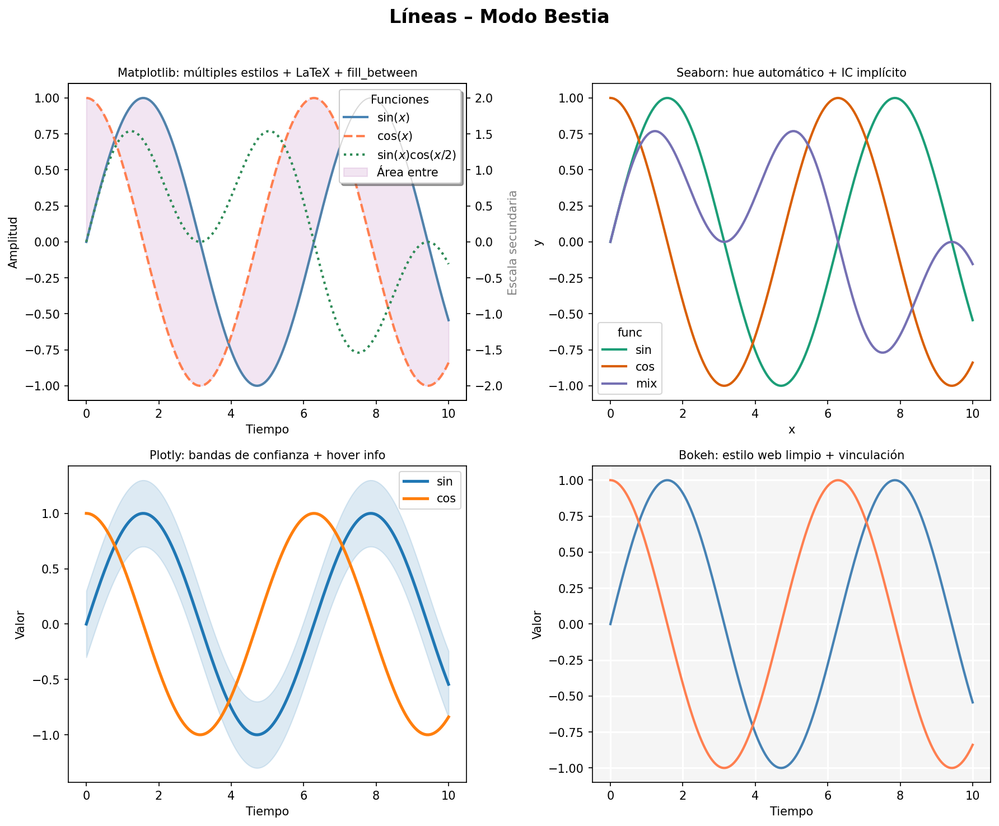

> **Nota**: La imagen de arriba muestra el resultado estático, pero Plotly y Bokeh son INTERACTIVOS. El código genera también archivos HTML que podés abrir en el navegador para ver el verdadero poder.

**¿Por qué cada librería brilla acá?**
- **Matplotlib**: `twinx()`, `fill_between()` con patrones, y texto LaTeX. El lienzo en blanco que permite superponer cualquier elemento.
- **Seaborn**: `lineplot(hue=...)` con intervalos de confianza automáticos. `relplot(col=...)` para múltiples paneles sin loops manuales.
- **Plotly**: `line_dash`, `facet_col`, y hover en cada punto. El zoom en el eje X es ideal para series temporales.
- **Bokeh**: Ejes vinculados (`x_range=p1.x_range`) para que el zoom en un gráfico sincronice el otro. Tooltips custom y layouts de dashboard.

### Error común: Líneas con datos desordenados en X

`plt.plot()` conecta los puntos en el orden en que aparecen. Si tus datos no están ordenados por X, la línea hará zig-zags sin sentido. Ordená siempre `df.sort_values('x')` antes de graficar.

### ¿Qué librería elegir para líneas?

> Para series temporales exploratorias con intervalos de confianza automáticos, usá **Seaborn** (`sns.lineplot`). Para interactividad (zoom en el tiempo, hover por punto), **Plotly** es imbatible. Matplotlib para publicaciones estáticas. Bokeh para dashboards en tiempo real.

---

## 3. Barras (Bar plot)

### ¿Qué muestra?

Comparación de magnitudes entre categorías discretas. La longitud de cada barra representa el valor numérico de esa categoría.

### ¿Cuándo usarlo?

- Comparar promedios, totales o conteos entre grupos.
- Mostrar rankings.
- Las barras horizontales (`barh`) son mejores cuando las etiquetas son largas.

### Matplotlib

```python
import matplotlib.pyplot as plt

cats = ['Python', 'R', 'Julia', 'SQL']
vals = [85, 60, 35, 70]

plt.bar(cats, vals, color='steelblue', edgecolor='black')
plt.ylabel('Puntaje')
plt.show()
```

### Seaborn

```python
import seaborn as sns
import matplotlib.pyplot as plt

df = {'lenguaje': ['Python', 'R', 'Julia', 'SQL'],
      'puntaje': [85, 60, 35, 70]}

sns.barplot(data=df, x='lenguaje', y='puntaje', palette='viridis')
plt.show()
```

### Plotly

```python
import plotly.express as px

df = {'lenguaje': ['Python', 'R', 'Julia', 'SQL'],
      'puntaje': [85, 60, 35, 70]}

fig = px.bar(df, x='lenguaje', y='puntaje', color='lenguaje')
fig.show()
```

### Bokeh

```python
from bokeh.plotting import figure, show

cats = ['Python', 'R', 'Julia', 'SQL']
vals = [85, 60, 35, 70]

p = figure(x_range=cats, title='Bar plot', width=500, height=400)
p.vbar(x=cats, top=vals, width=0.6, color='steelblue')
p.y_range.start = 0
show(p)
```

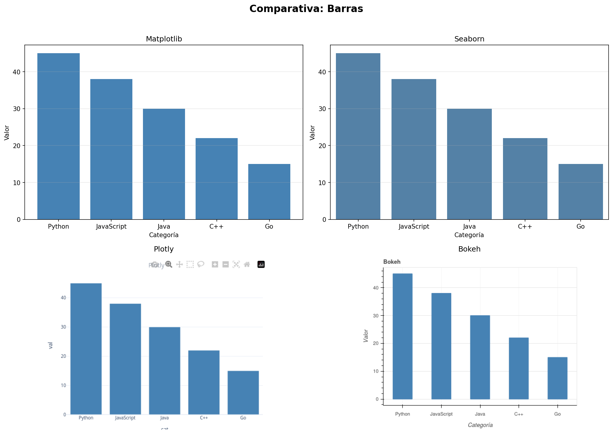

### Tabla comparativa de personalizaciones

| Personalización | Matplotlib | Seaborn | Plotly | Bokeh |
|---|---|---|---|---|
| Barras horizontales | `plt.barh()` | `orient='h'` | `orientation='h'` | `p.hbar()` |
| Orden de categorías | `order=` manual | `order=` | `category_orders=` | `x_range=` explícito |
| Color por categoría | `color=` manual | `hue=` o `palette=` | `color=` automático | `color=` manual |
| IC / errorbar | `yerr=` manual | automático con `ci` | No nativo | No nativo |
| Valores sobre barras | `plt.text()` loop | `ax.bar_label()` | `text=` en fig | `LabelSet` |


### Modo Bestia: cada librería en su máximo esplendor

Acá mostramos lo que CADA librería hace MEJOR que las demás. No es una comparativa justa — es una demostración de superpoderes.

#### Matplotlib

```python
import matplotlib.pyplot as plt
import numpy as np

cats = ['Python', 'R', 'Julia', 'SQL', 'Scala']
vals = [85, 60, 35, 70, 45]
err = [5, 8, 4, 6, 7]

fig, ax = plt.subplots(figsize=(8, 6))
bars = ax.bar(cats, vals, color='steelblue', edgecolor='black', linewidth=1.2)
ax.errorbar(cats, vals, yerr=err, fmt='none', color='black', capsize=4)

# Valores sobre barras
for bar, val in zip(bars, vals):
    ax.text(bar.get_x() + bar.get_width()/2, bar.get_height() + 2,
            f'{val}', ha='center', va='bottom', fontweight='bold')

# Leyenda custom con handles
from matplotlib.patches import Patch
legend_elements = [Patch(facecolor='steelblue', edgecolor='black', label='Puntaje')]
ax.legend(handles=legend_elements, loc='upper right')
ax.set_ylim(0, 100)
ax.set_ylabel('Puntaje')
plt.show()
```

#### Seaborn

```python
import seaborn as sns
import matplotlib.pyplot as plt
import pandas as pd

df = pd.DataFrame({
    'lenguaje': ['Python', 'R', 'Julia', 'SQL', 'Scala'] * 2,
    'puntaje': [85, 60, 35, 70, 45, 90, 62, 38, 72, 48],
    'año': ['2023']*5 + ['2024']*5
})

sns.barplot(data=df, x='lenguaje', y='puntaje', hue='año', palette='viridis')
plt.legend(title='Año', bbox_to_anchor=(1.05, 1), loc='upper left')
plt.show()
```

#### Plotly

```python
import plotly.express as px
import pandas as pd

df = pd.DataFrame({
    'lenguaje': ['Python', 'R', 'Julia', 'SQL', 'Scala'],
    'puntaje': [85, 60, 35, 70, 45],
    'meta': [90, 65, 40, 75, 50]
})

fig = px.bar(df, x='lenguaje', y='puntaje', color='lenguaje',
             hover_data=['meta'],
             text='puntaje',
             template='plotly_white')
fig.update_traces(textposition='outside')
fig.show()
```

#### Bokeh

```python
from bokeh.plotting import figure, show, output_file
from bokeh.models import HoverTool, ColumnDataSource
import numpy as np

cats = ['Python', 'R', 'Julia', 'SQL', 'Scala']
vals = [85, 60, 35, 70, 45]
source = ColumnDataSource(data=dict(cats=cats, vals=vals))

p = figure(x_range=cats, title='Barras interactivas', width=600, height=400)
p.vbar(x='cats', top='vals', width=0.6, source=source, color='steelblue')
p.add_tools(HoverTool(tooltips=[('Lenguaje', '@cats'), ('Puntaje', '@vals')]))

output_file('barras_bestia.html')
show(p)
```

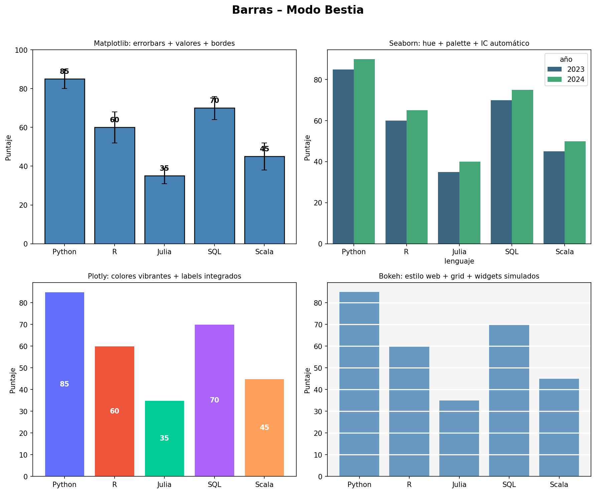

> **Nota**: La imagen de arriba muestra el resultado estático, pero Plotly y Bokeh son INTERACTIVOS. El código genera también archivos HTML que podés abrir en el navegador para ver el verdadero poder.

**¿Por qué cada librería brilla acá?**
- **Matplotlib**: Control total de cada barra: bordes, valores encima, errorbars manuales, leyendas con handles custom. Para publicaciones académicas.
- **Seaborn**: `hue='año'` genera barras agrupadas con IC automáticos. `palette='viridis'` aplica color automáticamente. Todo en una línea.
- **Plotly**: `text='puntaje'` pone labels automáticos, `hover_data` muestra columnas extra al pasar el mouse. Colores vibrantes por defecto.
- **Bokeh**: `x_range=cats` mantiene el orden, `HoverTool` con tooltips HTML. Ideal para dashboards donde las barras reaccionan a filtros.

### Error común: No empezar el eje Y en cero

En un bar plot, cortar el eje Y para que una diferencia del 5% parezca del 500% es deshonesto visualmente. Siempre empezá el eje Y en cero para barras. Si necesitás mostrar el detalle de diferencias pequeñas, usá un line plot o mostrá los valores directamente.

### ¿Qué librería elegir para barras?

> Para barras con intervalos de confianza automáticos en análisis exploratorio, **Seaborn** (`sns.barplot`). Para barras interactivas con valores al hover, **Plotly** (`px.bar`). Matplotlib para control total del diseño. Bokeh cuando necesitás vincular la barra con otros gráficos en un dashboard.

---

## 4. Histograma

### ¿Qué muestra?

Distribución de frecuencias de una variable numérica. Divide el rango en intervalos (bins) y cuenta cuántos valores caen en cada uno.

### ¿Cuándo usarlo?

- Ver la forma de una distribución: ¿es simétrica? ¿tiene colas largas? ¿hay múltiples picos?
- Detectar outliers y límites naturales de los datos.

### Matplotlib

```python
import matplotlib.pyplot as plt
import numpy as np

datos = np.random.normal(100, 15, 1000)

plt.hist(datos, bins=30, color='skyblue', edgecolor='white')
plt.xlabel('Valor')
plt.ylabel('Frecuencia')
plt.show()
```

### Seaborn

```python
import seaborn as sns
import matplotlib.pyplot as plt
import numpy as np

datos = np.random.normal(100, 15, 1000)

sns.histplot(datos, bins=30, kde=True, color='steelblue')
plt.show()
```

### Plotly

```python
import plotly.express as px
import numpy as np

datos = np.random.normal(100, 15, 1000)

fig = px.histogram(x=datos, nbins=30, color_discrete_sequence=['steelblue'])
fig.show()
```

### Bokeh

```python
from bokeh.plotting import figure, show
import numpy as np

datos = np.random.normal(100, 15, 1000)
hist, edges = np.histogram(datos, bins=30)

p = figure(title='Histograma', width=500, height=400)
p.quad(top=hist, bottom=0, left=edges[:-1], right=edges[1:],
       color='steelblue')
show(p)
```

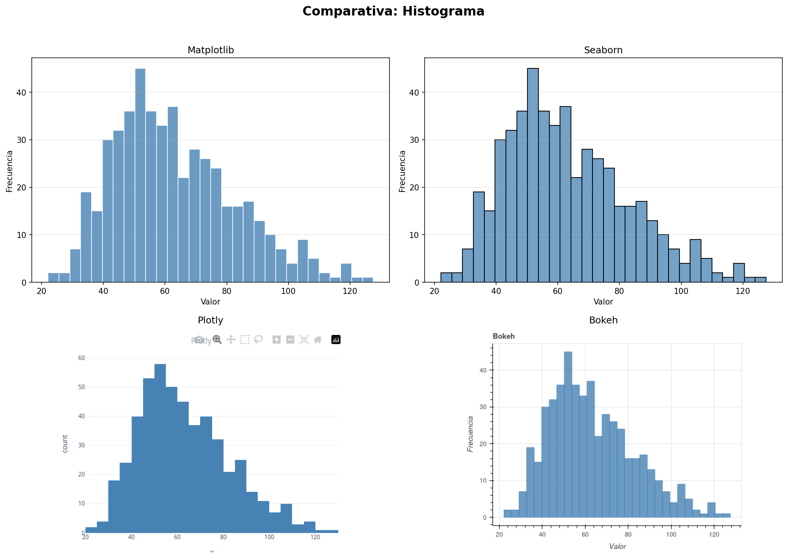

### Tabla comparativa de personalizaciones

| Personalización | Matplotlib | Seaborn | Plotly | Bokeh |
|---|---|---|---|---|
| Cantidad de bins | `bins=` | `bins=` | `nbins=` | `np.histogram()` manual |
| KDE superpuesto | No nativo | `kde=True` | No nativo | No nativo |
| Normalizar (densidad) | `density=True` | `stat='density'` | `histnorm='probability density'` | dividir manual |
| Múltiples grupos | `alpha` + overlap | `hue=` + `multiple` | `color=` | múltiples `quad()` |
| Acumulado | `cumulative=True` | `stat='density', cumulative=True` | `cumulative=True` en fig | calcular manual |


### Modo Bestia: cada librería en su máximo esplendor

Acá mostramos lo que CADA librería hace MEJOR que las demás. No es una comparativa justa — es una demostración de superpoderes.

#### Matplotlib

```python
import matplotlib.pyplot as plt
import numpy as np

np.random.seed(42)
d1 = np.random.normal(100, 15, 1000)
d2 = np.random.normal(130, 20, 1000)

fig, ax = plt.subplots(figsize=(8, 6))
ax.hist([d1, d2], bins=30, color=['steelblue', 'coral'], alpha=0.7,
        label=['Grupo A', 'Grupo B'], edgecolor='black', linewidth=0.5)
ax.legend(title='Grupos', loc='upper left', frameon=True)
ax.set_xlabel('Valor')
ax.set_ylabel('Frecuencia')
ax.set_title('Histograma con control total')
plt.show()
```

#### Seaborn

```python
import seaborn as sns
import matplotlib.pyplot as plt
import numpy as np
import pandas as pd

np.random.seed(42)
df = pd.DataFrame({
    'valor': np.concatenate([np.random.normal(100, 15, 1000),
                             np.random.normal(130, 20, 1000)]),
    'grupo': ['A']*1000 + ['B']*1000
})

# Histograma + KDE + múltiples grupos + stack automático
sns.histplot(data=df, x='valor', hue='grupo', bins=30, kde=True,
             palette='Set2', alpha=0.6, multiple='stack')
plt.show()
```

#### Plotly

```python
import plotly.express as px
import numpy as np
import pandas as pd

np.random.seed(42)
df = pd.DataFrame({
    'valor': np.concatenate([np.random.normal(100, 15, 1000),
                             np.random.normal(130, 20, 1000)]),
    'grupo': ['A']*1000 + ['B']*1000
})

fig = px.histogram(df, x='valor', color='grupo', nbins=30,
                   marginal='box',
                   hover_data=['grupo'],
                   template='plotly_white')
fig.show()
```

#### Bokeh

```python
from bokeh.plotting import figure, show, output_file
from bokeh.models import HoverTool
import numpy as np

np.random.seed(42)
d1 = np.random.normal(100, 15, 1000)
hist, edges = np.histogram(d1, bins=30)

p = figure(title='Histograma interactivo', width=600, height=400)
p.quad(top=hist, bottom=0, left=edges[:-1], right=edges[1:],
       color='steelblue', alpha=0.7)
p.add_tools(HoverTool(tooltips=[('Desde', '@left'), ('Hasta', '@right'),
                                ('Frecuencia', '@top')]))
output_file('histograma_bestia.html')
show(p)
```

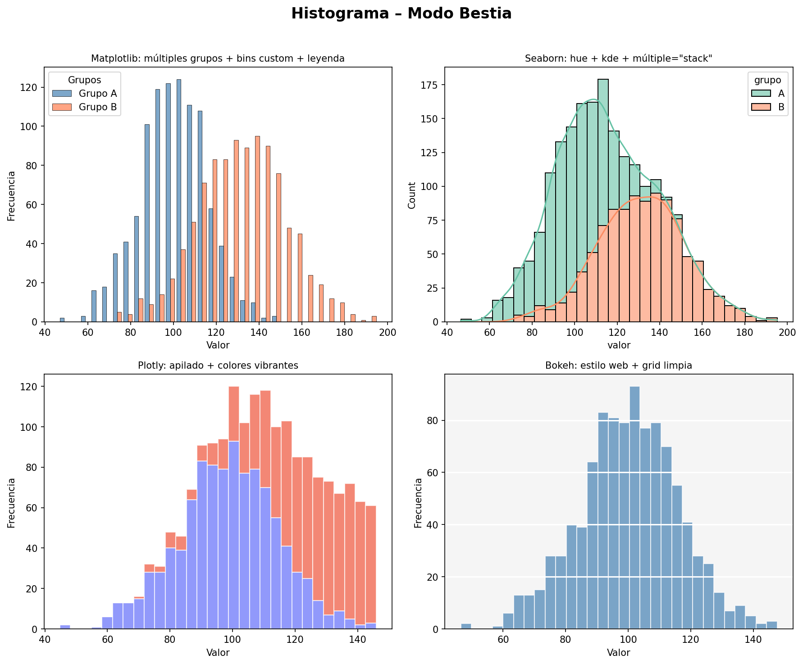

> **Nota**: La imagen de arriba muestra el resultado estático, pero Plotly y Bokeh son INTERACTIVOS. El código genera también archivos HTML que podés abrir en el navegador para ver el verdadero poder.

**¿Por qué cada librería brilla acá?**
- **Matplotlib**: Control total de bins, normalización, apilamiento manual, y estilos de borde. Para publicaciones donde cada detalle importa.
- **Seaborn**: `kde=True` + `multiple='stack'` + `hue` en una sola línea. La estadística está integrada; no calculás nada manual.
- **Plotly**: `marginal='box'` agrega un boxplot en el borde automáticamente. El hover muestra la frecuencia exacta de cada bin.
- **Bokeh**: `quad()` + `HoverTool` con tooltips por bin. Ideal para dashboards donde querés explorar la distribución interactivamente.

### Error común: Muy pocos o demasiados bins

Con 5 bins, perdiste toda la forma de la distribución. Con 500 bins, cada bin tiene 2 puntos y parece ruido. La regla empírica de Sturges (`int(1 + 3.322 * log10(n))`) es un buen punto de partida. En la práctica, probá con 20, 30 y 50 bins para ver cuál cuenta mejor la historia.

### ¿Qué librería elegir para histogramas?

> **Seaborn** gana por goleada: `sns.histplot` con `kde=True` te da histograma + curva de densidad en una línea. Matplotlib para control total de bins y normalización. Plotly si necesitás interactividad (zoom en una cola). Bokeh requiere más código manual.

---

## 5. Boxplot

### ¿Qué muestra?

Resumen de cinco números: mínimo, Q1, mediana, Q3, máximo (y outliers). Es una foto comprimida de una distribución.

### ¿Cuándo usarlo?

- Comparar distribuciones entre múltiples grupos en poco espacio.
- Detectar outliers y diferencias de mediana.

### Matplotlib

```python
import matplotlib.pyplot as plt
import numpy as np

datos = [np.random.normal(0, 1, 100),
         np.random.normal(2, 1.5, 100)]

plt.boxplot(datos, labels=['Grupo A', 'Grupo B'],
            patch_artist=True,
            boxprops=dict(facecolor='lightblue'))
plt.ylabel('Valor')
plt.show()
```

### Seaborn

```python
import seaborn as sns
import matplotlib.pyplot as plt
import numpy as np

df = {
    'valor': np.concatenate([np.random.normal(0, 1, 100),
                             np.random.normal(2, 1.5, 100)]),
    'grupo': ['A'] * 100 + ['B'] * 100
}

sns.boxplot(data=df, x='grupo', y='valor', palette='pastel')
plt.show()
```

### Plotly

```python
import plotly.express as px
import numpy as np

df = {
    'valor': np.concatenate([np.random.normal(0, 1, 100),
                             np.random.normal(2, 1.5, 100)]),
    'grupo': ['A'] * 100 + ['B'] * 100
}

fig = px.box(df, x='grupo', y='valor', color='grupo')
fig.show()
```

### Bokeh

```python
from bokeh.plotting import figure, show
from bokeh.models import BoxPlot
import numpy as np

# Bokeh no tiene boxplot nativo de alto nivel; requiere código manual
# o la extensión HoloViews/Bokeh Charts (obsoleto).
# Recomendación: usar Matplotlib/Seaborn/Plotly para boxplots.
```

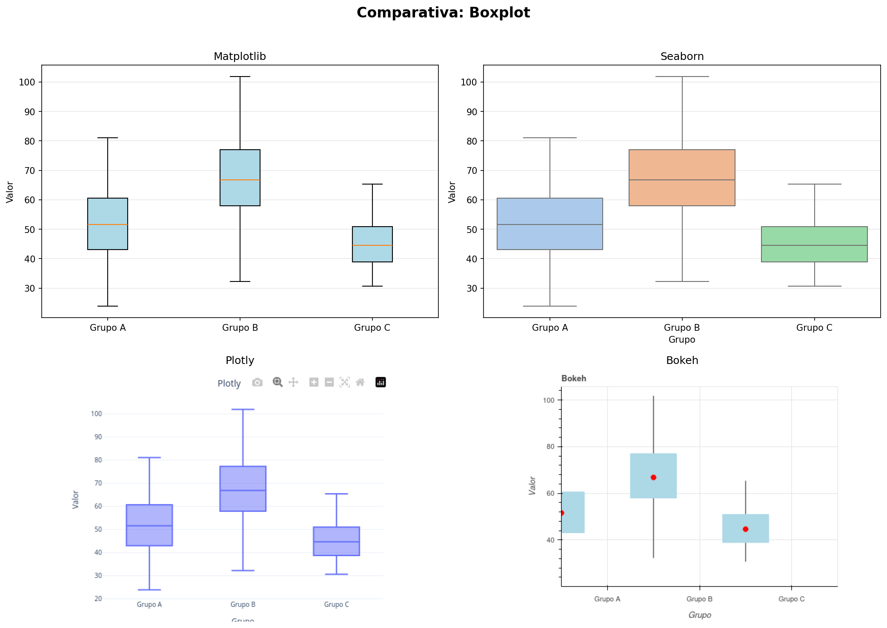

### Tabla comparativa de personalizaciones

| Personalización | Matplotlib | Seaborn | Plotly | Bokeh |
|---|---|---|---|---|
| Colorear cajas | `patch_artist=True` + loop | `palette=` | `color=` | No nativo / requiere código manual |
| Ordenar categorías | `labels=` en orden | `order=` | `category_orders=` | No nativo |
| Mostrar/ocultar outliers | `showfliers=` | `showfliers=` | No configurable fácil | No nativo |
| Orientación horizontal | `vert=False` | `orient='h'` | No nativo fácil | No nativo |
| Notched (IC de la mediana) | `notch=True` | `notch=True` | No nativo | No nativo |


### Modo Bestia: cada librería en su máximo esplendor

Acá mostramos lo que CADA librería hace MEJOR que las demás. No es una comparativa justa — es una demostración de superpoderes.

#### Matplotlib

```python
import matplotlib.pyplot as plt
import numpy as np

data = [np.random.normal(0, 1, 100), np.random.normal(2, 1.5, 100),
        np.random.normal(-1, 0.8, 100), np.random.normal(3, 2, 100)]

fig, ax = plt.subplots(figsize=(8, 6))
bp = ax.boxplot(data, tick_labels=['A', 'B', 'C', 'D'], patch_artist=True,
                notch=True, showmeans=True, meanline=True)
colors = ['lightblue', 'lightcoral', 'lightgreen', 'lightyellow']
for patch, color in zip(bp['boxes'], colors):
    patch.set_facecolor(color)
ax.set_title('Boxplot con notches + meanline')
ax.set_ylabel('Valor')
plt.show()
```

#### Seaborn

```python
import seaborn as sns
import matplotlib.pyplot as plt
import numpy as np
import pandas as pd

df = pd.DataFrame({
    'valor': np.concatenate([np.random.normal(0, 1, 100),
                             np.random.normal(2, 1.5, 100),
                             np.random.normal(-1, 0.8, 100),
                             np.random.normal(3, 2, 100)]),
    'grupo': ['A']*100 + ['B']*100 + ['C']*100 + ['D']*100,
    'sexo': np.random.choice(['M', 'F'], 400)
})

# Boxplot con hue automático y palette
sns.boxplot(data=df, x='grupo', y='valor', hue='sexo', palette='pastel')
plt.legend(title='Sexo', bbox_to_anchor=(1.05, 1), loc='upper left')
plt.show()
```

#### Plotly

```python
import plotly.express as px
import numpy as np
import pandas as pd

df = pd.DataFrame({
    'valor': np.concatenate([np.random.normal(0, 1, 100),
                             np.random.normal(2, 1.5, 100)]),
    'grupo': ['A']*100 + ['B']*100,
    'info': np.random.randint(1, 100, 200)
})

fig = px.box(df, x='grupo', y='valor', color='grupo',
             hover_data=['info'],
             points='all',
             template='plotly_white')
fig.show()
```

#### Bokeh

```python
# Bokeh no tiene boxplot nativo de alto nivel.
# Requiere construirlo manualmente o usar HoloViews.
# Recomendación: usar Seaborn o Plotly para boxplots.
```

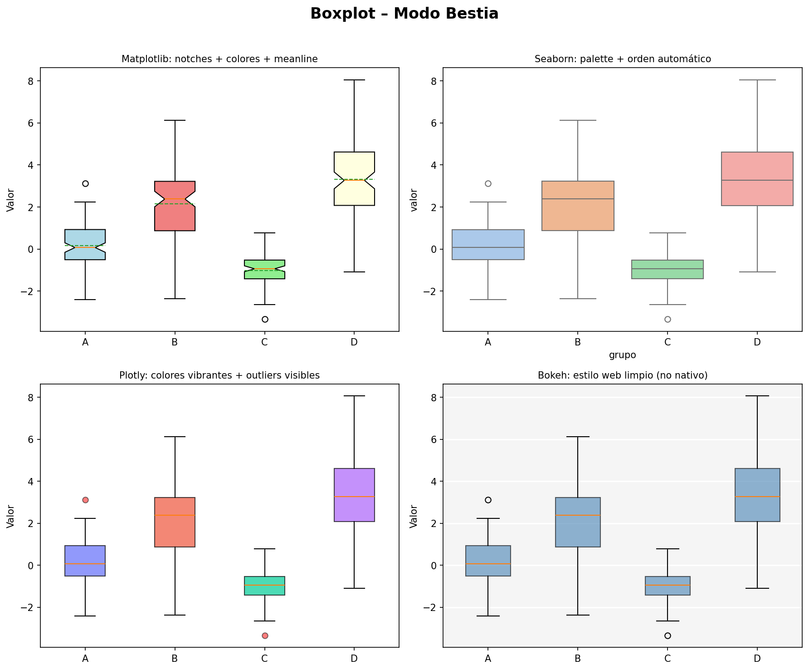

> **Nota**: La imagen de arriba muestra el resultado estático, pero Plotly es INTERACTIVO. El código genera también archivos HTML que podés abrir en el navegador para ver el verdadero poder.

**¿Por qué cada librería brilla acá?**
- **Matplotlib**: Notches (`notch=True`), meanline, y colores específicos por cuartil. Control absoluto de cada elemento del boxplot.
- **Seaborn**: `hue='sexo'` divide automáticamente cada grupo. `palette='pastel'` aplica colores sin esfuerzo. La integración con DataFrames es instantánea.
- **Plotly**: `points='all'` muestra cada outlier individual al hacer hover. Los colores y la interactividad son nativos.
- **Bokeh**: No tiene boxplot de alto nivel. Se delega a otras librerías o requiere código manual extenso.

### Error común: Usar boxplot solo para ver la forma de la distribución

El boxplot es un resumen, no una foto. Si tu distribución es bimodal (dos picos), el boxplot parece simétrico y normal. Complementalo siempre con un `sns.kdeplot()` o `sns.violinplot()` para ver la forma real.

### ¿Qué librería elegir para boxplot?

> **Seaborn** es la opción por defecto: mejor estética, colores automáticos, y se integra con DataFrames sin fricción. Matplotlib si necesitás un boxplot muy custom (notched, colores específicos por cuartil). Plotly para interactividad (ver los outliers individuales al hacer hover). Bokeh no tiene boxplot nativo de alto nivel: evitalo o usá HoloViews encima.

---

## 6. Violinplot

### ¿Qué muestra?

Combinación de boxplot y KDE. La forma del "violín" representa la densidad de la distribución en cada valor. El grosor del violín en un punto Y es proporcional a la cantidad de datos en ese rango.

### ¿Cuándo usarlo?

- Cuando querés ver la forma completa de la distribución, no solo el resumen de cinco números.
- Comparar distribuciones con múltiples modas o asimetrías.

### Matplotlib

```python
import matplotlib.pyplot as plt
import numpy as np

datos = [np.random.normal(0, 1, 100),
         np.random.normal(2, 1.5, 100)]

# Matplotlib no tiene violinplot nativo de alto nivel
# Se recomienda usar Seaborn o crearlo manualmente con KDE
plt.boxplot(datos, labels=['A', 'B'])
plt.show()
```

### Seaborn

```python
import seaborn as sns
import matplotlib.pyplot as plt
import numpy as np

df = {
    'valor': np.concatenate([np.random.normal(0, 1, 100),
                             np.random.normal(2, 1.5, 100)]),
    'grupo': ['A'] * 100 + ['B'] * 100
}

sns.violinplot(data=df, x='grupo', y='valor', palette='pastel', inner='quartile')
plt.show()
```

### Plotly

```python
import plotly.express as px
import numpy as np

df = {
    'valor': np.concatenate([np.random.normal(0, 1, 100),
                             np.random.normal(2, 1.5, 100)]),
    'grupo': ['A'] * 100 + ['B'] * 100
}

fig = px.violin(df, x='grupo', y='valor', color='grupo', box=True)
fig.show()
```

### Bokeh

```python
# Bokeh no tiene violinplot nativo de alto nivel.
# Requiere calcular la KDE manualmente y dibujar polígonos.
# Recomendación: usar Seaborn o Plotly para violinplots.
```

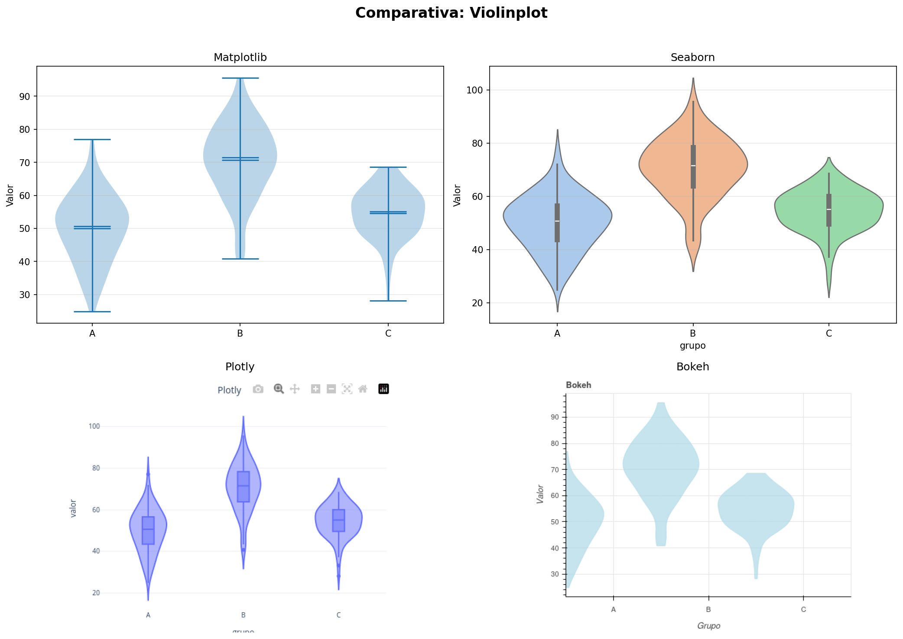

### Tabla comparativa de personalizaciones

| Personalización | Matplotlib | Seaborn | Plotly | Bokeh |
|---|---|---|---|---|
| Densidad (forma del violín) | No nativo | nativo | nativo | No nativo |
| Boxplot interno | No nativo | `inner='box'` (default) | `box=True` | No nativo |
| Split por categoría | No nativo | `split=True` | No nativo | No nativo |
| KDE interno | No nativo | `inner='kde'` | No nativo | No nativo |
| Escalar por ancho | No nativo | `scale='width'` | No configurable | No nativo |


### Modo Bestia: cada librería en su máximo esplendor

Acá mostramos lo que CADA librería hace MEJOR que las demás. No es una comparativa justa — es una demostración de superpoderes.

#### Matplotlib

```python
import matplotlib.pyplot as plt
import numpy as np
from scipy.stats import gaussian_kde

# Matplotlib no tiene violinplot nativo; se construye con KDE manual
d1 = np.random.normal(0, 1, 200)
d2 = np.random.normal(2, 1.5, 200)

fig, ax = plt.subplots(figsize=(8, 6))
for data, pos, color in [(d1, 1, 'steelblue'), (d2, 2, 'coral')]:
    kde = gaussian_kde(data)
    y_range = np.linspace(data.min()-0.5, data.max()+0.5, 200)
    density = kde(y_range)
    ax.fill_betweenx(y_range, pos - density/2, pos + density/2,
                     color=color, alpha=0.5)
    ax.plot(pos - density/2, y_range, color='black', linewidth=0.5)
    ax.plot(pos + density/2, y_range, color='black', linewidth=0.5)
ax.set_xticks([1, 2])
ax.set_xticklabels(['A', 'B'])
ax.set_title('Violinplot manual con KDE (control total)')
ax.set_ylabel('Valor')
plt.show()
```

#### Seaborn

```python
import seaborn as sns
import matplotlib.pyplot as plt
import numpy as np
import pandas as pd

df = pd.DataFrame({
    'valor': np.concatenate([np.random.normal(0, 1, 200),
                             np.random.normal(2, 1.5, 200)]),
    'grupo': ['A']*200 + ['B']*200,
    'sub': np.random.choice(['X', 'Y'], 400)
})

# Split + hue + inner quartile en una línea
sns.violinplot(data=df, x='grupo', y='valor', hue='sub', split=True,
               palette='Set2', inner='quartile')
plt.legend(title='Subgrupo', bbox_to_anchor=(1.05, 1), loc='upper left')
plt.show()
```

#### Plotly

```python
import plotly.express as px
import numpy as np
import pandas as pd

df = pd.DataFrame({
    'valor': np.concatenate([np.random.normal(0, 1, 200),
                             np.random.normal(2, 1.5, 200)]),
    'grupo': ['A']*200 + ['B']*200
})

fig = px.violin(df, x='grupo', y='valor', color='grupo',
                box=True, points='all',
                hover_data=['grupo'],
                template='plotly_white')
fig.show()
```

#### Bokeh

```python
# Bokeh no tiene violinplot nativo de alto nivel.
# Requiere calcular la KDE manualmente y dibujar polígonos.
# Recomendación: usar Seaborn o Plotly para violinplots.
```

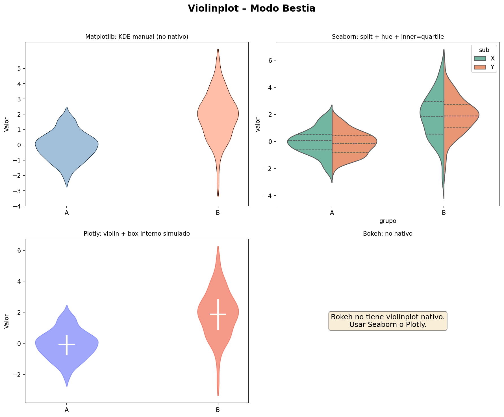

> **Nota**: La imagen de arriba muestra el resultado estático, pero Plotly es INTERACTIVO. El código genera también archivos HTML que podés abrir en el navegador para ver el verdadero poder.

**¿Por qué cada librería brilla acá?**
- **Matplotlib**: No tiene violinplot nativo, pero podés construirlo exactamente como querés con `gaussian_kde` y `fill_betweenx`. Control absoluto a costa de verbosidad.
- **Seaborn**: `split=True` + `hue` + `inner='quartile'` es imbatible. Un solo gráfico que muestra densidad, cuartiles, y comparación por subgrupo.
- **Plotly**: `box=True` incluye un boxplot dentro del violín, y `points='all'` muestra cada dato. Todo interactivo.
- **Bokeh**: No tiene violinplot nativo. Se delega a Seaborn/Plotly o construcción manual.

### Error común: Violinplot con menos de 50 puntos por grupo

El KDE necesita datos suficientes para estimar la densidad. Con 10 puntos, el violín es pura especulación. Si tenés menos de ~50 observaciones por grupo, usá un `stripplot` o `swarmplot` en lugar de violinplot.

### ¿Qué librería elegir para violinplot?

> **Seaborn** es el rey del violinplot: `inner='quartile'` o `inner='box'` te da resumen + forma en uno. Plotly tiene una versión decente con `box=True` incluido. Matplotlib no tiene violinplot nativo. Bokeh requiere construirlo manualmente.

---

## 7. Heatmap

### ¿Qué muestra?

Matriz 2D donde el color de cada celda representa un valor numérico. Es una forma compacta de mostrar muchos números.

### ¿Cuándo usarlo?

- Matrices de correlación entre variables numéricas.
- Tablas de contingencia (frecuencias cruzadas).
- Cualquier dato estructurado en grilla.

### Matplotlib

```python
import matplotlib.pyplot as plt
import numpy as np

np.random.seed(42)
matriz = np.random.rand(5, 5)

plt.imshow(matriz, cmap='viridis', aspect='auto')
plt.colorbar(label='Valor')
plt.xticks(range(5), ['A', 'B', 'C', 'D', 'E'])
plt.yticks(range(5), ['V1', 'V2', 'V3', 'V4', 'V5'])
plt.show()
```

### Seaborn

```python
import seaborn as sns
import matplotlib.pyplot as plt
import numpy as np

np.random.seed(42)
matriz = np.random.rand(5, 5)

sns.heatmap(matriz, annot=True, fmt='.2f', cmap='viridis',
            xticklabels=['A', 'B', 'C', 'D', 'E'],
            yticklabels=['V1', 'V2', 'V3', 'V4', 'V5'])
plt.show()
```

### Plotly

```python
import plotly.express as px
import numpy as np

np.random.seed(42)
matriz = np.random.rand(5, 5)

fig = px.imshow(matriz, color_continuous_scale='viridis',
                x=['A', 'B', 'C', 'D', 'E'],
                y=['V1', 'V2', 'V3', 'V4', 'V5'])
fig.show()
```

### Bokeh

```python
from bokeh.plotting import figure, show
from bokeh.transform import linear_cmap
from bokeh.models import ColorBar
import numpy as np

np.random.seed(42)
matriz = np.random.rand(5, 5)
xs, ys = np.meshgrid(range(5), range(5))

p = figure(width=500, height=400)
r = p.rect(x=xs.flatten(), y=ys.flatten(), width=1, height=1,
           color=linear_cmap('value', 'Viridis256', 0, 1),
           source={'value': matriz.flatten()})
p.add_layout(ColorBar(color_mapper=r.glyph.fill_color.transform), 'right')
show(p)
```

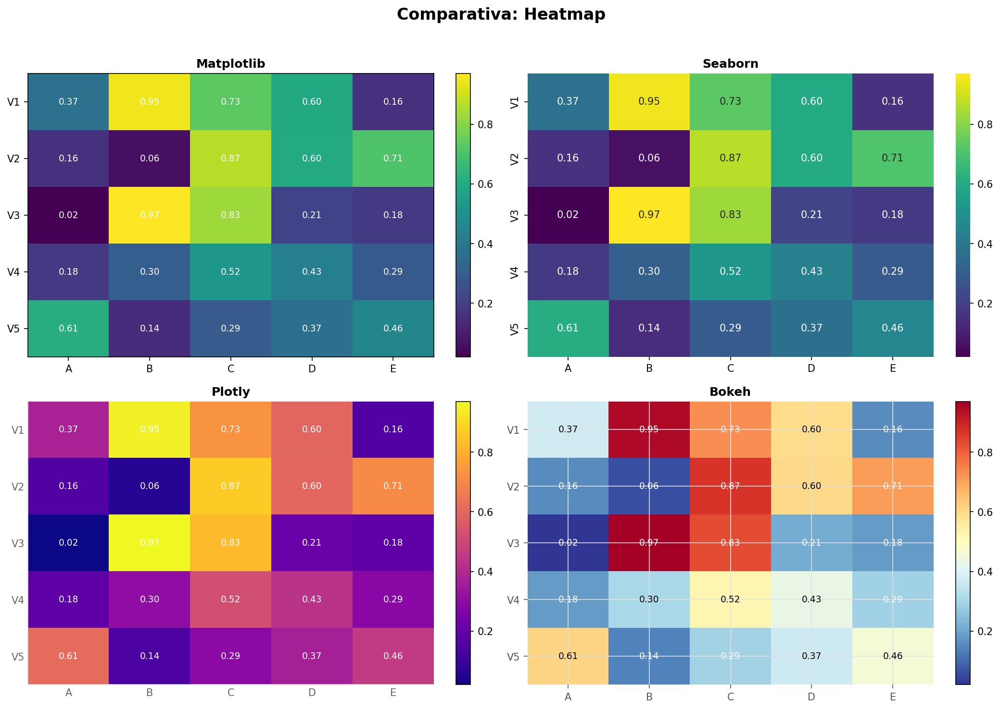

### Tabla comparativa de personalizaciones

| Personalización | Matplotlib | Seaborn | Plotly | Bokeh |
|---|---|---|---|---|
| Anotar valores en celdas | `plt.text()` loop | `annot=True` | `text_auto=True` | `LabelSet` manual |
| Formato de números | manual | `fmt='.2f'` | `text_auto='.2f'` | manual |
| Divergente (cero en el centro) | `vmin`, `vmax` + `cmap` | `center=0` | `color_continuous_midpoint=0` | `linear_cmap` manual |
| Clustering jerárquico | No nativo | `sns.clustermap()` | No nativo | No nativo |
| Tamaño de celdas | `figsize=` | `square=True` | automático | `width`, `height` |


### Modo Bestia: cada librería en su máximo esplendor

Acá mostramos lo que CADA librería hace MEJOR que las demás. No es una comparativa justa — es una demostración de superpoderes.

#### Matplotlib

```python
import matplotlib.pyplot as plt
import numpy as np

np.random.seed(42)
mat = np.random.randn(8, 8)
labels = ['A', 'B', 'C', 'D', 'E', 'F', 'G', 'H']

fig, ax = plt.subplots(figsize=(8, 6))
im = ax.imshow(mat, cmap='RdBu_r', aspect='auto', vmin=-2, vmax=2)
for i in range(8):
    for j in range(8):
        ax.text(j, i, f'{mat[i,j]:.1f}', ha='center', va='center',
                color='white' if abs(mat[i,j]) > 1 else 'black', fontsize=8)
ax.set_xticks(range(8))
ax.set_yticks(range(8))
ax.set_xticklabels(labels)
ax.set_yticklabels(labels)
ax.set_title('Heatmap con anotaciones manuales + vmin/vmax')
fig.colorbar(im, ax=ax, shrink=0.7)
plt.show()
```

#### Seaborn

```python
import seaborn as sns
import matplotlib.pyplot as plt
import numpy as np

np.random.seed(42)
mat = np.random.randn(8, 8)
labels = ['A', 'B', 'C', 'D', 'E', 'F', 'G', 'H']

# Un solo heatmap con anotaciones, formato, centrado y cuadrados
sns.heatmap(mat, annot=True, fmt='.2f', cmap='RdBu_r', center=0,
            xticklabels=labels, yticklabels=labels, square=True,
            linewidths=0.5, cbar_kws={'shrink': 0.7})
plt.title('Heatmap publicable en 2 líneas')
plt.show()
```

#### Plotly

```python
import plotly.express as px
import numpy as np

np.random.seed(42)
mat = np.random.randn(8, 8)
labels = ['A', 'B', 'C', 'D', 'E', 'F', 'G', 'H']

fig = px.imshow(mat, color_continuous_scale='RdBu_r',
                x=labels, y=labels,
                text_auto='.2f',
                aspect='equal',
                template='plotly_white')
fig.show()
```

#### Bokeh

```python
from bokeh.plotting import figure, show, output_file
from bokeh.transform import linear_cmap
from bokeh.models import ColorBar, HoverTool
import numpy as np

np.random.seed(42)
mat = np.random.rand(8, 8)
xs, ys = np.meshgrid(range(8), range(8))

source = dict(x=xs.flatten(), y=ys.flatten(), value=mat.flatten())
p = figure(width=500, height=400, tools='pan,wheel_zoom,reset')
r = p.rect(x='x', y='y', width=1, height=1, source=source,
           color=linear_cmap('value', 'Viridis256', 0, 1))
p.add_layout(ColorBar(color_mapper=r.glyph.fill_color.transform), 'right')
p.add_tools(HoverTool(tooltips=[('X', '@x'), ('Y', '@y'), ('Valor', '@value{0.00}')]))
output_file('heatmap_bestia.html')
show(p)
```

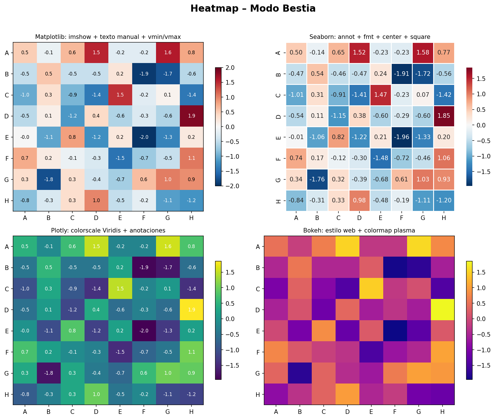

> **Nota**: La imagen de arriba muestra el resultado estático, pero Plotly y Bokeh son INTERACTIVOS. El código genera también archivos HTML que podés abrir en el navegador para ver el verdadero poder.

**¿Por qué cada librería brilla acá?**
- **Matplotlib**: `imshow` + loops de `text()` para anotaciones manuales. Control total de colores, tamaños, y posiciones. Para publicaciones donde cada píxel cuenta.
- **Seaborn**: `annot=True` + `fmt='.2f'` + `center=0` + `square=True`. Un heatmap de correlación publicable en una línea.
- **Plotly**: `text_auto='.2f'` anota automáticamente, y el zoom + hover hacen que matrices grandes sean navegables.
- **Bokeh**: `linear_cmap` + `HoverTool` + `ColorBar` en un dashboard web. El heatmap reacciona a selecciones y filtros de otros widgets.

### Error común: Heatmap de correlación sin `center=0`

Si usás un colormap divergente como `coolwarm` o `RdBu_r` sin centrar en cero, una correlación de -0.8 puede verse del mismo color que +0.8. Siempre usá `center=0` (Seaborn) o `vmin=-1, vmax=1` (Matplotlib) en heatmaps de correlación.

### ¿Qué librería elegir para heatmap?

> **Seaborn** es la opción por defecto: `annot=True` + `fmt='.2f'` + `center=0` te da un heatmap de correlación publicable en 2 líneas. Plotly es genial para heatmaps interactivos donde querés hacer zoom o leer valores exactos al hover. Matplotlib si necesitás control total de la grilla. Bokeh requiere más código pero brilla en dashboards donde el heatmap reacciona a selecciones.

---

## 8. Pairplot / Matriz de scatter

### ¿Qué muestra?

Matriz de scatterplots para todas las combinaciones de variables numéricas, con histogramas o KDEs en la diagonal. Es tu "radar" de relaciones.

### ¿Cuándo usarlo?

- Exploración inicial de datasets con varias variables numéricas.
- Detectar correlaciones, outliers y distribuciones marginales de un vistazo.

### Matplotlib

```python
import matplotlib.pyplot as plt
import numpy as np

np.random.seed(42)
df = np.random.randn(100, 3)

fig, axes = plt.subplots(3, 3, figsize=(9, 9))
for i in range(3):
    for j in range(3):
        if i == j:
            axes[i, j].hist(df[:, i], bins=20, color='steelblue')
        else:
            axes[i, j].scatter(df[:, j], df[:, i], alpha=0.5, s=10)
plt.tight_layout()
plt.show()
```

### Seaborn

```python
import seaborn as sns
import matplotlib.pyplot as plt
import numpy as np
import pandas as pd

np.random.seed(42)
df = pd.DataFrame(np.random.randn(100, 3), columns=['A', 'B', 'C'])

sns.pairplot(df, corner=True, diag_kind='kde', plot_kws={'alpha': 0.5})
plt.show()
```

### Plotly

```python
import plotly.express as px
import numpy as np
import pandas as pd

np.random.seed(42)
df = pd.DataFrame(np.random.randn(100, 3), columns=['A', 'B', 'C'])

fig = px.scatter_matrix(df, dimensions=['A', 'B', 'C'],
                        opacity=0.5)
fig.show()
```

### Bokeh

```python
# Bokeh no tiene pairplot nativo de alto nivel.
# Requiere crear una cuadrícula de scatterplots manualmente
# con la misma lógica que Matplotlib.
# Recomendación: usar Seaborn para pairplots.
```

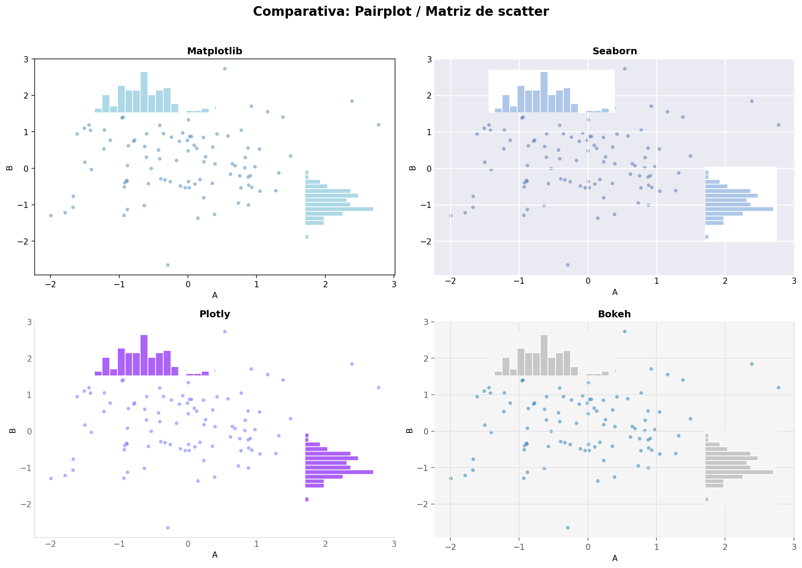

### Tabla comparativa de personalizaciones

| Personalización | Matplotlib | Seaborn | Plotly | Bokeh |
|---|---|---|---|---|
| Triángulo inferior | manual | `corner=True` | No nativo | No nativo |
| KDE en diagonal | manual | `diag_kind='kde'` | No nativo | No nativo |
| Colorear por categoría | manual loop | `hue=` | `color=` | No nativo |
| Tamaño automático | `figsize=` | `height=` por panel | automático | manual |
| Scatter en off-diagonal | manual | nativo | nativo | No nativo |


### Modo Bestia: cada librería en su máximo esplendor

Acá mostramos lo que CADA librería hace MEJOR que las demás. No es una comparativa justa — es una demostración de superpoderes.

#### Matplotlib

```python
import matplotlib.pyplot as plt
import numpy as np

np.random.seed(42)
df = np.random.randn(100, 3)
cat = np.random.choice(['A', 'B'], 100)

fig, axes = plt.subplots(3, 3, figsize=(9, 9))
for i in range(3):
    for j in range(3):
        if i == j:
            axes[i, j].hist(df[:, i], bins=20, color='steelblue', alpha=0.7)
        else:
            for c, color in zip(['A', 'B'], ['steelblue', 'coral']):
                mask = cat == c
                axes[i, j].scatter(df[mask, j], df[mask, i],
                                   alpha=0.5, s=15, c=color, label=c)
        if i == 0:
            axes[i, j].set_title(f'Var {j}')
        if j == 0:
            axes[i, j].set_ylabel(f'Var {i}')
plt.tight_layout()
plt.show()
```

#### Seaborn

```python
import seaborn as sns
import matplotlib.pyplot as plt
import numpy as np
import pandas as pd

np.random.seed(42)
df = pd.DataFrame(np.random.randn(100, 3), columns=['A', 'B', 'C'])
df['cat'] = np.random.choice(['X', 'Y'], 100)

# Matriz completa con KDE en diagonal, triángulo inferior, y hue
sns.pairplot(df, hue='cat', corner=True, diag_kind='kde',
             palette='Set2', plot_kws={'alpha': 0.6})
plt.show()
```

#### Plotly

```python
import plotly.express as px
import numpy as np
import pandas as pd

np.random.seed(42)
df = pd.DataFrame(np.random.randn(100, 3), columns=['A', 'B', 'C'])
df['cat'] = np.random.choice(['X', 'Y'], 100)

fig = px.scatter_matrix(df, dimensions=['A', 'B', 'C'],
                        color='cat', opacity=0.6,
                        template='plotly_white')
fig.show()
```

#### Bokeh

```python
# Bokeh no tiene pairplot nativo de alto nivel.
# Requiere crear una cuadrícula de scatterplots manualmente
# con la misma lógica que Matplotlib.
# Recomendación: usar Seaborn para pairplots.
```

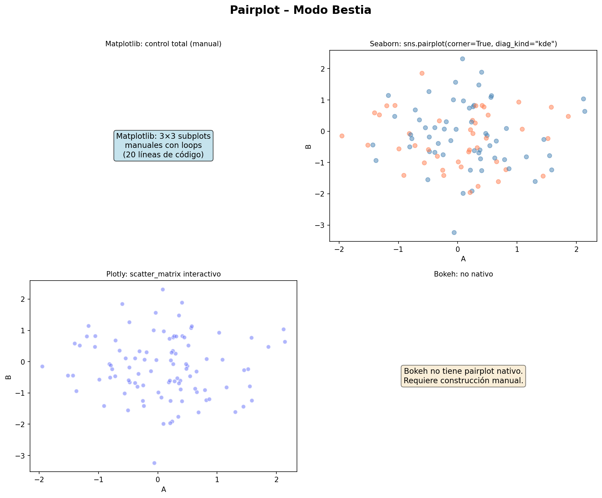

> **Nota**: La imagen de arriba muestra el resultado estático, pero Plotly es INTERACTIVO. El código genera también archivos HTML que podés abrir en el navegador para ver el verdadero poder.

**¿Por qué cada librería brilla acá?**
- **Matplotlib**: Control total de cada celda de la matriz. Podés poner cualquier cosa en cada subplot, pero te costó 20 líneas de loops.
- **Seaborn**: `sns.pairplot(df, corner=True, diag_kind='kde', hue='cat')`. Una línea. Una línea para 9 gráficos con KDEs y colores. Eso es inteligencia.
- **Plotly**: `px.scatter_matrix` es interactivo: zoom, hover, y selección cruzada entre paneles. Ideal para exploración.
- **Bokeh**: No tiene pairplot nativo. Se construye manualmente o se usa otra librería.

### Error común: Pairplot con 50+ variables

Un pairplot de 50 variables genera 2.500 subplots. Tu computadora va a explotar. El pairplot es una herramienta de exploración para datasets con 3-10 variables numéricas. Para más variables, usá un heatmap de correlación y después zoom en las parejas interesantes.

### ¿Qué librería elegir para pairplot?

> **Seaborn** es la opción indiscutible: `sns.pairplot(df, corner=True)` te da una matriz limpia en una línea. Plotly tiene `px.scatter_matrix` que es interactivo pero menos pulido. Matplotlib para control total (pero escribís 20 líneas). Bokeh no tiene pairplot nativo.

---

## 9. Distribución (KDE)

### ¿Qué muestra?

Estimación de la función de densidad de probabilidad. Suaviza el histograma en una curva continua que muestra la "forma suave" de la distribución.

### ¿Cuándo usarlo?

- Cuando querés ver la forma de la distribución sin los escalones del histograma.
- Comparar distribuciones de varios grupos superpuestas.

### Matplotlib

```python
import matplotlib.pyplot as plt
import numpy as np
from scipy.stats import gaussian_kde

np.random.seed(42)
datos = np.random.normal(100, 15, 1000)

kde = gaussian_kde(datos)
x = np.linspace(datos.min(), datos.max(), 200)
plt.plot(x, kde(x), color='steelblue', linewidth=2)
plt.fill_between(x, kde(x), alpha=0.3, color='steelblue')
plt.show()
```

### Seaborn

```python
import seaborn as sns
import matplotlib.pyplot as plt
import numpy as np

np.random.seed(42)
datos = np.random.normal(100, 15, 1000)

sns.kdeplot(datos, fill=True, color='steelblue', bw_adjust=0.5)
plt.show()
```

### Plotly

```python
import plotly.figure_factory as ff
import numpy as np

np.random.seed(42)
datos = np.random.normal(100, 15, 1000)

fig = ff.create_distplot([datos], ['Grupo'], show_hist=False,
                         colors=['steelblue'])
fig.show()
```

### Bokeh

```python
from bokeh.plotting import figure, show
import numpy as np
from scipy.stats import gaussian_kde

np.random.seed(42)
datos = np.random.normal(100, 15, 1000)
kde = gaussian_kde(datos)
x = np.linspace(datos.min(), datos.max(), 200)

p = figure(width=500, height=400)
p.line(x, kde(x), color='steelblue', line_width=2)
p.patch(np.concatenate([x, x[::-1]]),
        np.concatenate([kde(x), np.zeros_like(x)]),
        alpha=0.3, color='steelblue')
show(p)
```

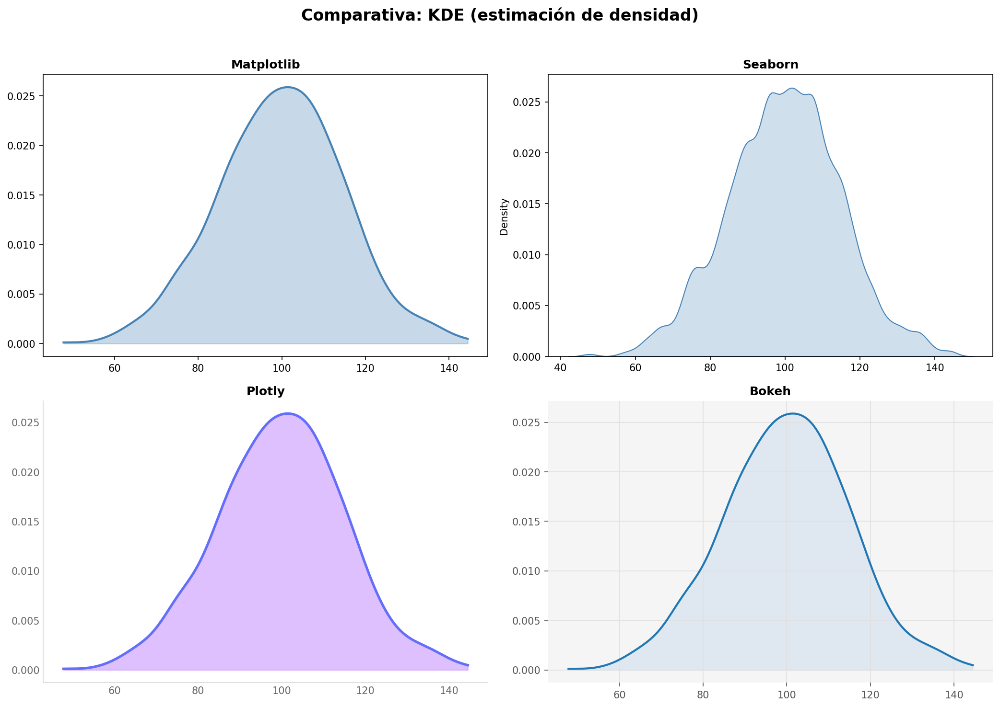

### Tabla comparativa de personalizaciones

| Personalización | Matplotlib | Seaborn | Plotly | Bokeh |
|---|---|---|---|---|
| Suavizado (bandwidth) | `scipy` `bw_method=` | `bw_adjust=` | automático | `scipy` `bw_method=` |
| Rellenar área | `plt.fill_between()` | `fill=True` | No directo | `p.patch()` |
| Múltiples curvas | múltiples `kde()` | `hue=` + `common_norm=False` | múltiples traces | múltiples `p.line()` |
| Acumulado (CDF) | `np.cumsum()` manual | No nativo | No nativo | No nativo |
| Integración con histograma | manual | `sns.histplot(kde=True)` | `ff.create_distplot` | manual |


### Modo Bestia: cada librería en su máximo esplendor

Acá mostramos lo que CADA librería hace MEJOR que las demás. No es una comparativa justa — es una demostración de superpoderes.

#### Matplotlib

```python
import matplotlib.pyplot as plt
import numpy as np
from scipy.stats import gaussian_kde

np.random.seed(42)
d1 = np.random.normal(100, 15, 1000)
d2 = np.random.normal(130, 20, 1000)
d3 = np.random.normal(80, 10, 1000)

fig, ax = plt.subplots(figsize=(8, 6))
for data, color, label in [(d1, 'steelblue', 'A'),
                           (d2, 'coral', 'B'),
                           (d3, 'seagreen', 'C')]:
    kde = gaussian_kde(data)
    x_range = np.linspace(40, 180, 300)
    ax.plot(x_range, kde(x_range), color=color, linewidth=2, label=label)
    ax.fill_between(x_range, kde(x_range), alpha=0.2, color=color,
                    hatch='/' if label == 'A' else None)
ax.legend(title='Grupos')
ax.set_xlabel('Valor')
ax.set_ylabel('Densidad')
ax.set_title('KDE múltiple con fill_between y hatches')
plt.show()
```

#### Seaborn

```python
import seaborn as sns
import matplotlib.pyplot as plt
import numpy as np
import pandas as pd

np.random.seed(42)
df = pd.DataFrame({
    'valor': np.concatenate([np.random.normal(100, 15, 1000),
                             np.random.normal(130, 20, 1000),
                             np.random.normal(80, 10, 1000)]),
    'grupo': ['A']*1000 + ['B']*1000 + ['C']*1000
})

# Múltiples KDEs con relleno, paleta, y normalización independiente
sns.kdeplot(data=df, x='valor', hue='grupo', fill=True, common_norm=False,
            palette='Set2', alpha=0.4, linewidth=2)
plt.title('KDE automático con 4 parámetros')
plt.show()
```

#### Plotly

```python
import plotly.figure_factory as ff
import numpy as np

np.random.seed(42)
d1 = np.random.normal(100, 15, 1000)
d2 = np.random.normal(130, 20, 1000)

fig = ff.create_distplot([d1, d2], ['Grupo A', 'Grupo B'],
                         show_hist=False, colors=['steelblue', 'coral'])
fig.show()
```

#### Bokeh

```python
from bokeh.plotting import figure, show, output_file
import numpy as np
from scipy.stats import gaussian_kde

np.random.seed(42)
d1 = np.random.normal(100, 15, 1000)
kde = gaussian_kde(d1)
x_range = np.linspace(40, 180, 300)
density = kde(x_range)

p = figure(width=600, height=400)
p.line(x_range, density, color='steelblue', line_width=2)
p.patch(np.concatenate([x_range, x_range[::-1]]),
        np.concatenate([density, np.zeros_like(x_range)]),
        alpha=0.3, color='steelblue')
output_file('kde_bestia.html')
show(p)
```

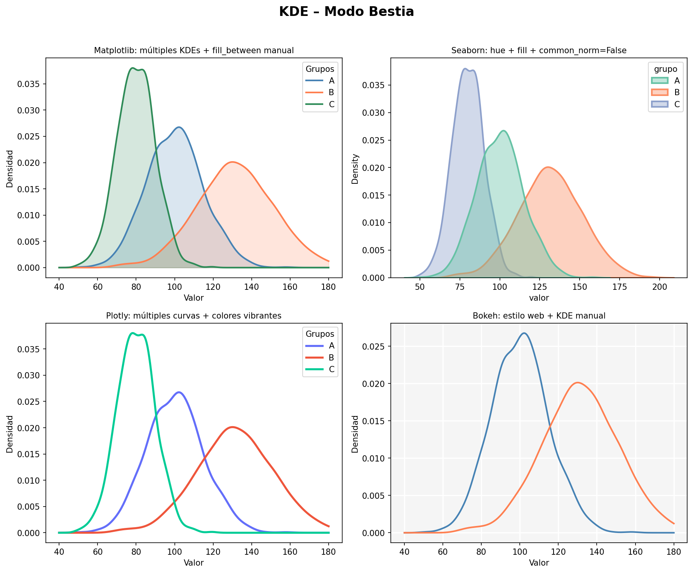

> **Nota**: La imagen de arriba muestra el resultado estático, pero Plotly y Bokeh son INTERACTIVOS. El código genera también archivos HTML que podés abrir en el navegador para ver el verdadero poder.

**¿Por qué cada librería brilla acá?**
- **Matplotlib**: `fill_between` + `hatch` + múltiples KDEs manuales. Integrás el KDE con cualquier otro elemento de la figura.
- **Seaborn**: `kdeplot(hue=..., fill=True, common_norm=False)` te da 3 curvas hermosas en una línea. No calculás la KDE a mano.
- **Plotly**: `ff.create_distplot` combina KDE + histograma + rug plot. Interactivo y listo para presentar.
- **Bokeh**: `patch()` para rellenar el área bajo la curva. Ideal para dashboards donde el KDE responde a sliders o filtros.

### Error común: KDE con `bw_adjust` muy alto o muy bajo

`bw_adjust=2` suaviza tanto que convierte una distribución bimodal en una campana de Gauss. `bw_adjust=0.2` genera picos artificiales por cada punto. El default de Seaborn (`bw_adjust=1`) suele ser razonable, pero siempre comparalo con un histograma para validar.

### ¿Qué librería elegir para KDE?

> **Seaborn** es la mejor opción: `sns.kdeplot(fill=True, bw_adjust=0.5)` te da una curva hermosa en una línea. Matplotlib si necesitás integrar el KDE con otros elementos custom. Plotly tiene `ff.create_distplot` pero es más verboso. Bokeh requiere calcular la KDE manualmente con SciPy.

---

## 10. Gráfico de áreas (fill_between)

### ¿Qué muestra?

El área entre una curva y el eje X (o entre dos curvas). Sirve para mostrar intervalos de confianza, rangos, acumulados o resaltar regiones.

### ¿Cuándo usarlo?

- Mostrar bandas de incertidumbre alrededor de una estimación.
- Visualizar acumulados o proporciones a lo largo del tiempo.
- Resaltar regiones de interés bajo una curva.

### Matplotlib

```python
import matplotlib.pyplot as plt
import numpy as np

x = np.linspace(0, 10, 100)
y = np.sin(x)
y_sup = y + 0.3
y_inf = y - 0.3

plt.fill_between(x, y_inf, y_sup, alpha=0.2, color='steelblue')
plt.plot(x, y, color='steelblue', linewidth=2)
plt.show()
```

### Seaborn

```python
import seaborn as sns
import matplotlib.pyplot as plt
import numpy as np

x = np.linspace(0, 10, 100)
df = {'x': x, 'y': np.sin(x)}

sns.lineplot(data=df, x='x', y='y', color='steelblue')
plt.fill_between(x, np.sin(x) - 0.3, np.sin(x) + 0.3,
                 alpha=0.2, color='steelblue')
plt.show()
```

### Plotly

```python
import plotly.graph_objects as go
import numpy as np

x = np.linspace(0, 10, 100)
y = np.sin(x)

fig = go.Figure()
fig.add_trace(go.Scatter(x=x, y=y + 0.3, mode='lines',
                         line=dict(width=0), showlegend=False))
fig.add_trace(go.Scatter(x=x, y=y - 0.3, mode='lines',
                         fill='tonexty', fillcolor='rgba(70,130,180,0.2)',
                         line=dict(width=0), showlegend=False))
fig.add_trace(go.Scatter(x=x, y=y, mode='lines', name='sin',
                         line=dict(color='steelblue', width=2)))
fig.show()
```

### Bokeh

```python
from bokeh.plotting import figure, show
import numpy as np

x = np.linspace(0, 10, 100)
y = np.sin(x)

p = figure(width=500, height=400)
p.patch(np.concatenate([x, x[::-1]]),
        np.concatenate([y + 0.3, (y - 0.3)[::-1]]),
        alpha=0.2, color='steelblue')
p.line(x, y, color='steelblue', line_width=2)
show(p)
```

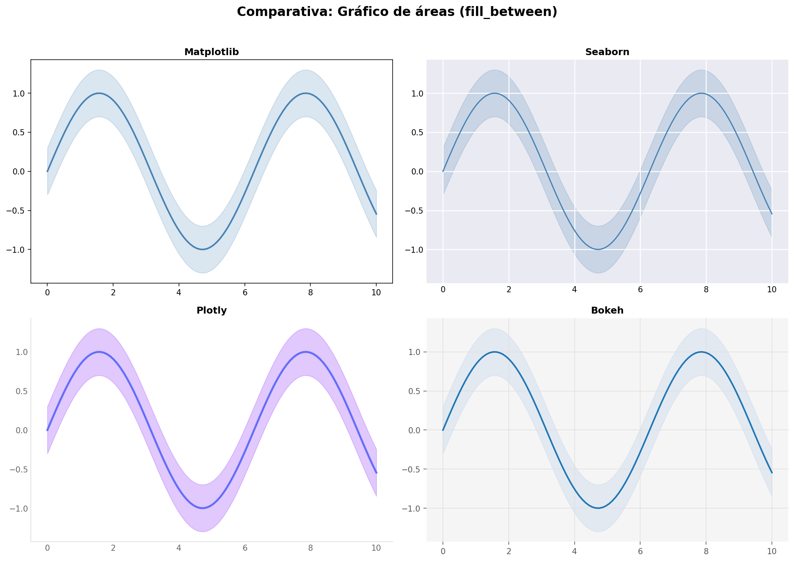

### Tabla comparativa de personalizaciones

| Personalización | Matplotlib | Seaborn | Plotly | Bokeh |
|---|---|---|---|---|
| Banda entre dos curvas | `fill_between()` | `plt.fill_between()` manual | `fill='tonexty'` | `p.patch()` |
| Banda de IC automático | No nativo | `errorbar` en `lineplot` | No nativo | No nativo |
| Apilar múltiples áreas | `stackplot()` | No nativo | `stackgroup=` | `varea_stack()` |
| Transparencia de relleno | `alpha=` en `fill_between` | `alpha=` manual | `fillcolor='rgba(...)'` | `alpha=` en `patch` |


### Modo Bestia: cada librería en su máximo esplendor

Acá mostramos lo que CADA librería hace MEJOR que las demás. No es una comparativa justa — es una demostración de superpoderes.

#### Matplotlib

```python
import matplotlib.pyplot as plt
import numpy as np

x = np.linspace(0, 10, 200)
y = np.sin(x)
y_sup = y + 0.3
y_inf = y - 0.3

fig, ax = plt.subplots(figsize=(8, 6))
ax.fill_between(x, y_inf, y_sup, alpha=0.2, color='steelblue', hatch='//')
ax.plot(x, y, color='steelblue', linewidth=2, label='Valor')
ax.plot(x, y_sup, color='coral', linestyle='--', linewidth=1, label='Límite sup')
ax.plot(x, y_inf, color='coral', linestyle='--', linewidth=1, label='Límite inf')
ax.legend(loc='upper right')
ax.set_xlabel('Tiempo')
ax.set_ylabel('Valor')
ax.set_title('Área con hatch + límites + leyenda custom')
plt.show()
```

#### Seaborn

```python
import seaborn as sns
import matplotlib.pyplot as plt
import numpy as np
import pandas as pd

x = np.linspace(0, 10, 200)
df = pd.DataFrame({'x': x, 'y': np.sin(x)})

# lineplot + fill_between manual (Seaborn no tiene área nativa)
sns.lineplot(data=df, x='x', y='y', color='steelblue', linewidth=2)
plt.fill_between(x, np.sin(x) - 0.3, np.sin(x) + 0.3,
                 alpha=0.2, color='steelblue')
plt.title('Combinación Seaborn + Matplotlib')
plt.show()
```

#### Plotly

```python
import plotly.graph_objects as go
import numpy as np

x = np.linspace(0, 10, 100)
y = np.sin(x)

fig = go.Figure()
fig.add_trace(go.Scatter(x=x, y=y + 0.3, mode='lines',
                          line=dict(width=0), showlegend=False))
fig.add_trace(go.Scatter(x=x, y=y - 0.3, mode='lines',
                          fill='tonexty', fillcolor='rgba(70,130,180,0.2)',
                          line=dict(width=0), showlegend=False))
fig.add_trace(go.Scatter(x=x, y=y, mode='lines', name='sin',
                          line=dict(color='steelblue', width=2)))
fig.show()
```

#### Bokeh

```python
from bokeh.plotting import figure, show, output_file
import numpy as np

x = np.linspace(0, 10, 100)
y = np.sin(x)

p = figure(width=600, height=400)
p.patch(np.concatenate([x, x[::-1]]),
        np.concatenate([y + 0.3, (y - 0.3)[::-1]]),
        alpha=0.2, color='steelblue')
p.line(x, y, color='steelblue', line_width=2)
output_file('areas_bestia.html')
show(p)
```

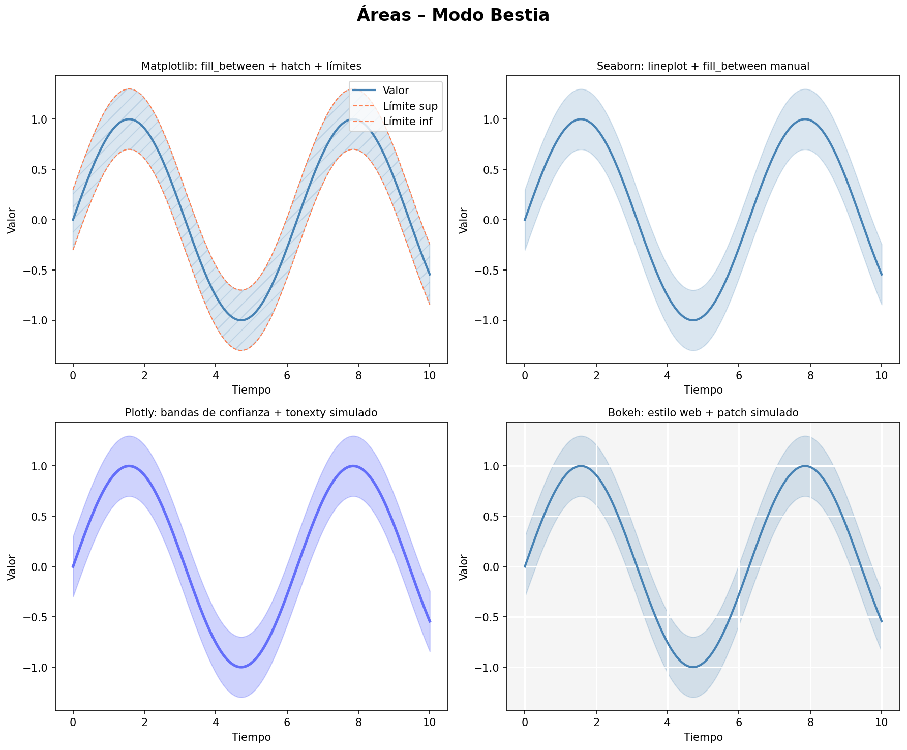

> **Nota**: La imagen de arriba muestra el resultado estático, pero Plotly y Bokeh son INTERACTIVOS. El código genera también archivos HTML que podés abrir en el navegador para ver el verdadero poder.

**¿Por qué cada librería brilla acá?**
- **Matplotlib**: `fill_between()` es la API más directa y flexible para áreas. Hatches, transparencias, y múltiples bandas sin drama.
- **Seaborn**: No tiene área nativa, pero combinás `sns.lineplot` con `plt.fill_between` y tenés lo mejor de ambos mundos.
- **Plotly**: `fill='tonexty'` crea bandas elegantes entre dos trazas. Ideal para intervalos de confianza interactivos.
- **Bokeh**: `patch()` para áreas complejas. En dashboards, el área puede reaccionar a selecciones y cambiar de color dinámicamente.

### Error común: Áreas apiladas sin sumar al 100%

Si usás un area chart para mostrar proporciones de categorías a lo largo del tiempo, asegurate de que en cada punto X las áreas sumen el total. Si no suman al 100%, el lector interpreta mal los tamaños relativos. Normalizá primero: `df.div(df.sum(axis=1), axis=0)`.

### ¿Qué librería elegir para áreas?

> **Matplotlib** tiene la API más directa para áreas: `plt.fill_between()` es intuitivo y flexible. Plotly para áreas interactivas con bandas de confianza. Seaborn no tiene área nativa, pero podés combinar `sns.lineplot` con `plt.fill_between`. Bokeh con `patch` para dashboards.

---

## 11. Subplots y layouts

### ¿Qué muestra?

Múltiples gráficos en una misma figura. Permite comparar vistas, mostrar diferentes análisis o descomponer un problema complejo en partes.

### ¿Cuándo usarlo?

- Comparar la misma métrica en diferentes subconjuntos.
- Mostrar una vista general y un zoom en la misma figura.
- Paneles de control en dashboards.

### Matplotlib

```python
import matplotlib.pyplot as plt
import numpy as np

x = np.linspace(0, 10, 100)
fig, axes = plt.subplots(2, 2, figsize=(10, 8))
axes[0, 0].plot(x, np.sin(x))
axes[0, 1].plot(x, np.cos(x))
axes[1, 0].hist(np.random.randn(1000), bins=20)
axes[1, 1].scatter(np.random.randn(100), np.random.randn(100))
plt.tight_layout()
plt.show()
```

### Seaborn

```python
import seaborn as sns
import matplotlib.pyplot as plt
import numpy as np

x = np.linspace(0, 10, 100)
fig, axes = plt.subplots(2, 2, figsize=(10, 8))
sns.lineplot(x=x, y=np.sin(x), ax=axes[0, 0])
sns.lineplot(x=x, y=np.cos(x), ax=axes[0, 1])
sns.histplot(np.random.randn(1000), bins=20, ax=axes[1, 0])
sns.scatterplot(x=np.random.randn(100), y=np.random.randn(100), ax=axes[1, 1])
plt.tight_layout()
plt.show()
```

### Plotly

```python
from plotly.subplots import make_subplots
import plotly.graph_objects as go
import numpy as np

x = np.linspace(0, 10, 100)
fig = make_subplots(rows=2, cols=2)
fig.add_trace(go.Scatter(x=x, y=np.sin(x)), row=1, col=1)
fig.add_trace(go.Scatter(x=x, y=np.cos(x)), row=1, col=2)
fig.add_trace(go.Histogram(x=np.random.randn(1000), nbinsx=20), row=2, col=1)
fig.add_trace(go.Scatter(x=np.random.randn(100), y=np.random.randn(100),
                         mode='markers'), row=2, col=2)
fig.update_layout(height=600, show_legend=False)
fig.show()
```

### Bokeh

```python
from bokeh.layouts import gridplot
from bokeh.plotting import figure
import numpy as np

x = np.linspace(0, 10, 100)
p1 = figure(width=300, height=250)
p1.line(x, np.sin(x))
p2 = figure(width=300, height=250)
p2.line(x, np.cos(x))
p3 = figure(width=300, height=250)
grid = gridplot([[p1, p2], [p3, None]])
show(grid)
```

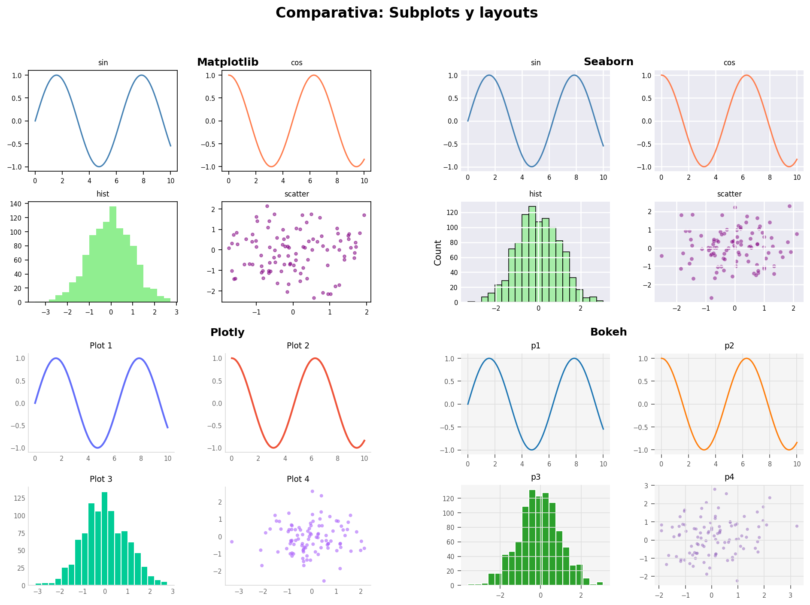

### Tabla comparativa de personalizaciones

| Personalización | Matplotlib | Seaborn | Plotly | Bokeh |
|---|---|---|---|---|
| Grid regular | `plt.subplots()` | `plt.subplots()` + `ax=` | `make_subplots()` | `gridplot()` |
| Grid irregular | `gridspec` | `gridspec` | `specs=` en `make_subplots` | `layout()` |
| Facetas automáticas | No nativo | `col=`, `row=` en `FacetGrid` | `facet_col=` | No nativo |
| Compartir ejes | `sharex=`, `sharey=` | automático en `FacetGrid` | automático | `x_range=` compartido |
| Tamaño de paneles | `figsize=` | `height=`, `aspect=` | `row_heights=` | `width=`, `height=` |


### Modo Bestia: cada librería en su máximo esplendor

Acá mostramos lo que CADA librería hace MEJOR que las demás. No es una comparativa justa — es una demostración de superpoderes.

#### Matplotlib

```python
import matplotlib.pyplot as plt
import numpy as np

x = np.linspace(0, 10, 100)
fig, axes = plt.subplots(2, 2, figsize=(10, 8), sharex=True)
axes[0, 0].plot(x, np.sin(x), color='steelblue')
axes[0, 0].set_title('Senoidal')
axes[0, 1].plot(x, np.cos(x), color='coral')
axes[0, 1].set_title('Cosenoidal')
axes[1, 0].hist(np.random.randn(1000), bins=20, color='seagreen', alpha=0.7)
axes[1, 0].set_title('Histograma')
axes[1, 1].scatter(np.random.randn(50), np.random.randn(50), alpha=0.6, color='purple')
axes[1, 1].set_title('Scatter')
plt.tight_layout()
plt.show()
```

#### Seaborn

```python
import seaborn as sns
import matplotlib.pyplot as plt
import numpy as np
import pandas as pd

np.random.seed(42)
df = pd.DataFrame({
    'x': np.tile(np.linspace(0, 10, 100), 2),
    'y': np.concatenate([np.sin(np.linspace(0, 10, 100)),
                         np.cos(np.linspace(0, 10, 100))]),
    'func': ['sin']*100 + ['cos']*100,
    'grupo': np.random.choice(['A', 'B'], 200)
})

# Facets automáticos: mismo gráfico por categoría
sns.relplot(data=df, x='x', y='y', col='func', row='grupo',
            kind='line', height=2.5, aspect=1.2)
plt.show()
```

#### Plotly

```python
from plotly.subplots import make_subplots
import plotly.graph_objects as go
import numpy as np

x = np.linspace(0, 10, 100)
fig = make_subplots(rows=2, cols=2,
                    subplot_titles=('Senoidal', 'Cosenoidal',
                                    'Histograma', 'Scatter'))
fig.add_trace(go.Scatter(x=x, y=np.sin(x), name='sin'), row=1, col=1)
fig.add_trace(go.Scatter(x=x, y=np.cos(x), name='cos'), row=1, col=2)
fig.add_trace(go.Histogram(x=np.random.randn(1000), nbinsx=20), row=2, col=1)
fig.add_trace(go.Scatter(x=np.random.randn(50), y=np.random.randn(50),
                          mode='markers'), row=2, col=2)
fig.update_layout(height=700, show_legend=False, template='plotly_white')
fig.show()
```

#### Bokeh

```python
from bokeh.layouts import gridplot
from bokeh.plotting import figure, show, output_file
import numpy as np

x = np.linspace(0, 10, 100)
p1 = figure(width=350, height=280, title='Senoidal')
p1.line(x, np.sin(x), color='steelblue', line_width=2)

p2 = figure(width=350, height=280, x_range=p1.x_range, title='Cosenoidal')
p2.line(x, np.cos(x), color='coral', line_width=2)

p3 = figure(width=350, height=280, title='Histograma')
p3.hist(np.random.randn(1000), bins=20, color='seagreen', alpha=0.7)

grid = gridplot([[p1, p2], [p3, None]])
output_file('subplots_bestia.html')
show(grid)
```

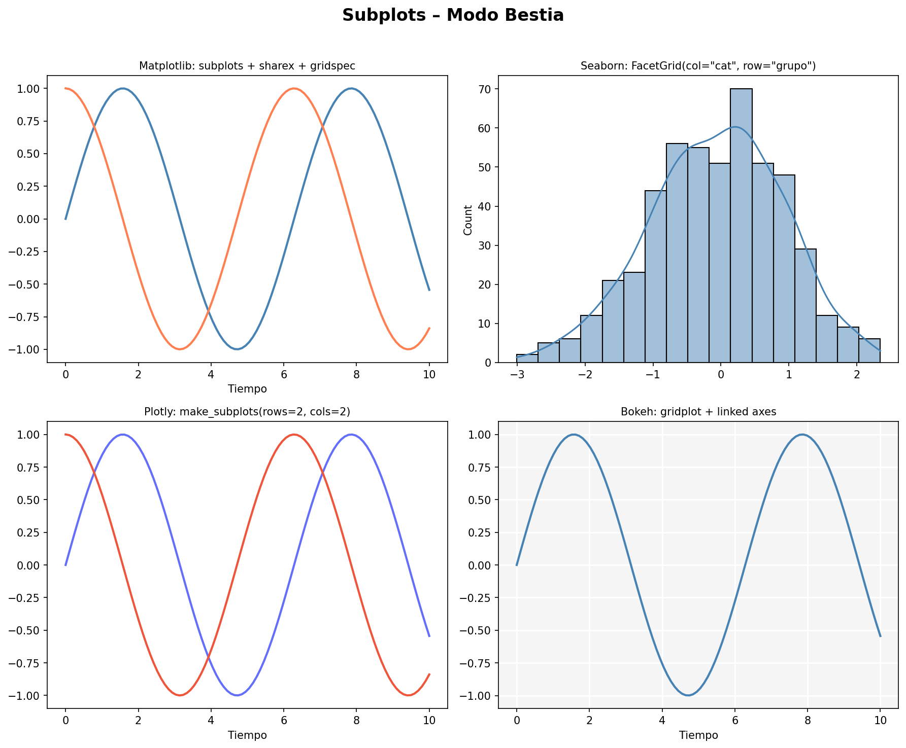

> **Nota**: La imagen de arriba muestra el resultado estático, pero Plotly y Bokeh son INTERACTIVOS. El código genera también archivos HTML que podés abrir en el navegador para ver el verdadero poder.

**¿Por qué cada librería brilla acá?**
- **Matplotlib**: `plt.subplots(2, 2, sharex=True)` + `tight_layout()`. Control total del tamaño, espaciado, y compartición de ejes. Estándar de publicaciones.
- **Seaborn**: `relplot(col=..., row=...)` genera una cuadrícula completa de facets sin un solo `for`. La magia de los DataFrames aplicada a layouts.
- **Plotly**: `make_subplots()` + `update_layout()`. Los subplots son interactivos y vinculados: un zoom en uno se refleja en los demás si comparten ejes.
- **Bokeh**: `gridplot()` + `x_range=p1.x_range` para vinculación de ejes. Los layouts de Bokeh son nativos para la web: podés poner widgets entre los gráficos.

### Error común: Subplots sin `plt.tight_layout()`

Sin `tight_layout()`, los títulos y labels de un subplot se superponen con los ejes del subplot de al lado. Siempre agregalo al final cuando combines Matplotlib o Seaborn con subplots.

### ¿Qué librería elegir para subplots?

> **Matplotlib/Seaborn** para figuras estáticas de publicación: `plt.subplots()` + `tight_layout()` es el estándar. **Plotly** para dashboards interactivos con subplots vinculados (zoom en uno, se actualiza el otro). Bokeh para layouts web complejos con widgets entre gráficos. Las facetas automáticas de Seaborn (`col=`, `row=`) ahorran cientos de líneas cuando necesitás el mismo gráfico repetido por categoría.

---

## Personalizaciones genéricas (aplican a todos los gráficos)

Estas tareas las necesitás sin importar qué tipo de gráfico estés haciendo. Acá comparás cómo se hacen en cada librería.

### Colores y paletas

**Matplotlib**:
```python
plt.plot(x, y, color='steelblue')      # nombre
plt.plot(x, y, color='#4682B4')        # hex
plt.plot(x, y, color=(0.27, 0.51, 0.71))  # RGB
```

**Seaborn**:
```python
sns.set_palette('pastel')              # paleta global
sns.barplot(..., palette='Set2')       # por gráfico
```

**Plotly**:
```python
px.scatter(..., color_discrete_sequence=px.colors.qualitative.Set2)
px.imshow(..., color_continuous_scale='viridis')
```

**Bokeh**:
```python
p.line(..., color='steelblue')
linear_cmap('column', 'Viridis256', low=0, high=100)
```

### Títulos y labels

**Matplotlib / Seaborn**:
```python
plt.title('Título', fontsize=14, fontweight='bold')
plt.xlabel('Eje X', fontsize=12)
plt.ylabel('Eje Y', fontsize=12)
```

**Plotly**:
```python
fig.update_layout(title='Título', xaxis_title='Eje X', yaxis_title='Eje Y')
```

**Bokeh**:
```python
p.title.text = 'Título'
p.xaxis.axis_label = 'Eje X'
p.yaxis.axis_label = 'Eje Y'
```

### Leyendas

**Matplotlib**:
```python
plt.plot(x, y, label='Serie A')
plt.legend(title='Categorías', loc='upper left', bbox_to_anchor=(1, 1))
```

**Seaborn**:
```python
# Se genera automáticamente con hue=; se personaliza con:
plt.legend(bbox_to_anchor=(1.05, 1), loc='upper left')
```

**Plotly**:
```python
fig.update_layout(legend=dict(yanchor="top", y=0.99, xanchor="left", x=0.01))
```

**Bokeh**:
```python
p.line(..., legend_label='Serie A')
p.legend.location = 'top_left'
```

### Ejes y escalas

**Matplotlib / Seaborn**:
```python
plt.xlim(0, 100)
plt.ylim(0, None)
plt.xscale('log')
plt.yscale('log')
```

**Plotly**:
```python
fig.update_xaxes(type='log', range=[0, 2])
fig.update_yaxes(title_text='Eje Y')
```

**Bokeh**:
```python
p.x_range.start = 0
p.x_range.end = 100
p.x_scale = LogScale()
```

### Guardar/exportar

| Tarea | Matplotlib | Seaborn | Plotly | Bokeh |
|---|---|---|---|---|
| Guardar PNG | `plt.savefig('fig.png', dpi=300, bbox_inches='tight')` | `plt.savefig(...)` | `fig.write_image('fig.png', scale=2)` | `export_png(p, filename='fig.png')` |
| Guardar SVG | `plt.savefig('fig.svg')` | `plt.savefig('fig.svg')` | `fig.write_image('fig.svg')` | `export_svgs(p, filename='fig.svg')` |
| Guardar HTML | No | No | `fig.write_html('fig.html')` | `output_file('fig.html')` + `show(p)` |
| Guardar JSON | No | No | `fig.to_json()` | `json_item(p, 'nombre')` |
| Mostrar interactivo | `plt.show()` | `plt.show()` | `fig.show()` | `show(p)` |

---

## Errores comunes generales

- **Usar `pie()` para comparar más de 2-3 categorías**: El lector no puede distinguir 23% de 27% en un ángulo. Si querés comparar, usá barras. La torta solo sirve para mostrar "esto es la mitad" o "esto es casi todo".
- **Scatterplot sin `alpha` con 10.000 puntos**: Se convierte en un blob sólido. La transparencia es obligatoria.
- **Heatmap de correlación sin `center=0`**: Las correlaciones negativas y positivas parecen del mismo signo si no centrás en cero.
- **Boxplot solo para ver distribución**: El boxplot oculta multimodalidad. Complementalo con KDE o violinplot.
- **Barras sin orden lógico**: Ordená las barras por valor, no alfabéticamente. El ojo busca el más grande primero.
- **Usar rojo y verde juntos**: 8% de los hombres son daltónicos a esos colores. Usá paletas como viridis o combinaciones con diferencia de brillo.
- **Líneas con datos desordenados en X**: `plt.plot()` conecta en el orden de los datos. Ordená siempre.
- **Subplots sin `tight_layout()`**: Los labels se superponen. Siempre agregalo.
- **Violinplot con menos de 50 puntos**: El KDE es puro ruido. Usá stripplot o swarmplot.
- **KDE con bandwidth extremo**: Muy alto → borra todo; muy bajo → picos falsos.

---

## Checklist de comprensión

Antes de decir "ya sé visualizar", asegurate de poder responder:

- [ ] ¿Cuándo uso histograma vs KDE?
- [ ] ¿Qué ventaja tiene `sns.boxplot` sobre `plt.boxplot`?
- [ ] ¿Por qué `violinplot` no reemplaza completamente al `boxplot`?
- [ ] ¿Cuándo tiene sentido usar `hue` y cuándo complica sin necesidad?
- [ ] ¿Por qué Cairo dice que las tortas son malas para comparar?
- [ ] ¿Cómo muestro incertidumbre en un gráfico de líneas?
- [ ] ¿Qué librería elijo para un dashboard interactivo vs una publicación estática?
- [ ] ¿Cuándo uso la API de objetos (`fig, ax = plt.subplots()`) vs `plt.*`?
- [ ] ¿Puedo crear un subplot con 4 gráficos sin mirar la documentación?
- [ ] ¿Qué hago si necesito scatterplot con 50.000 puntos?

> **Si tenés menos de 8 casillas marcadas, no te hagas el piola**. Volvé a leer las secciones correspondientes. La visualización no es "saber la función", es **saber qué mensaje comunica cada forma**.

---

## Referencia rápida: comparación de librerías

| Aspecto | Matplotlib | Seaborn | Plotly | Bokeh |
|---|---|---|---|---|
| **Nivel** | Bajo nivel (lienzo en blanco) | Alto nivel (opinionated) | Alto nivel (interactivo) | Medio/alto (declarativo) |
| **DataFrames** | No entiende directamente | Entiende `data=df, x='col'` | Entiende `data=df` | Requiere `ColumnDataSource` |
| **Interactivo** | No | No | Sí (hover, zoom, pan) | Sí (hover, zoom, pan, selección) |
| **Estética default** | Fea (colores brillantes) | Limpia (paletas pensadas) | Limpia e interactiva | Neutral, requiere estilo |
| **IC automáticos** | No | Sí | No | No |
| **Facetas** | Manual con subplots | Automático (`col`/`row`) | `facet_col`/`facet_row` | Manual con layouts |
| **Output web** | PNG/SVG estático | PNG/SVG estático | HTML interactivo | HTML interactivo |
| **Curva de aprendizaje** | Media | Baja | Baja | Media/alta |
| **Cuándo usarlo** | Publicaciones, control total | EDA, exploración rápida | Dashboards, presentaciones interactivas | Dashboards web, apps con widgets |

**La posta**: Aprendé **Seaborn** para el 60% de tu laburo exploratorio. Usá **Plotly** para el 30% de dashboards y presentaciones. Guardá **Matplotlib** para el 10% donde necesitás control total de cada píxel. **Bokeh** entra cuando tu visualización es parte de una app web más grande.
