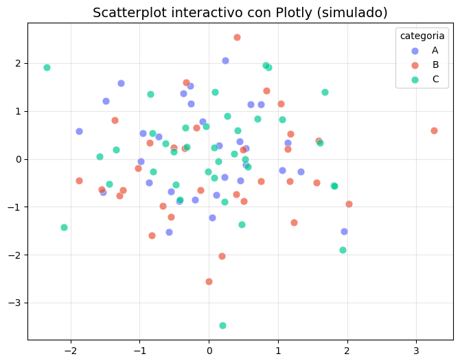
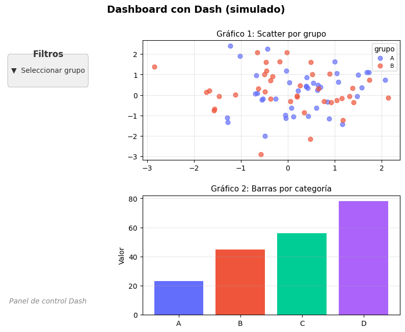
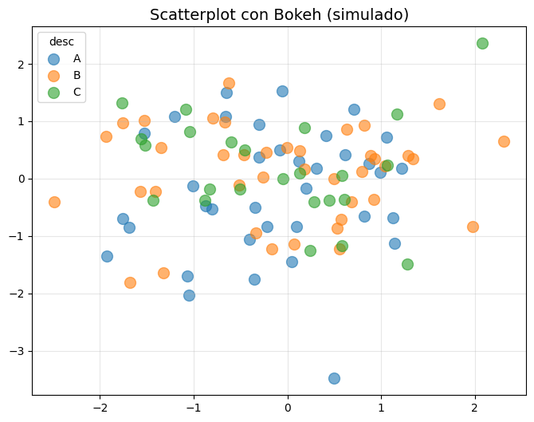
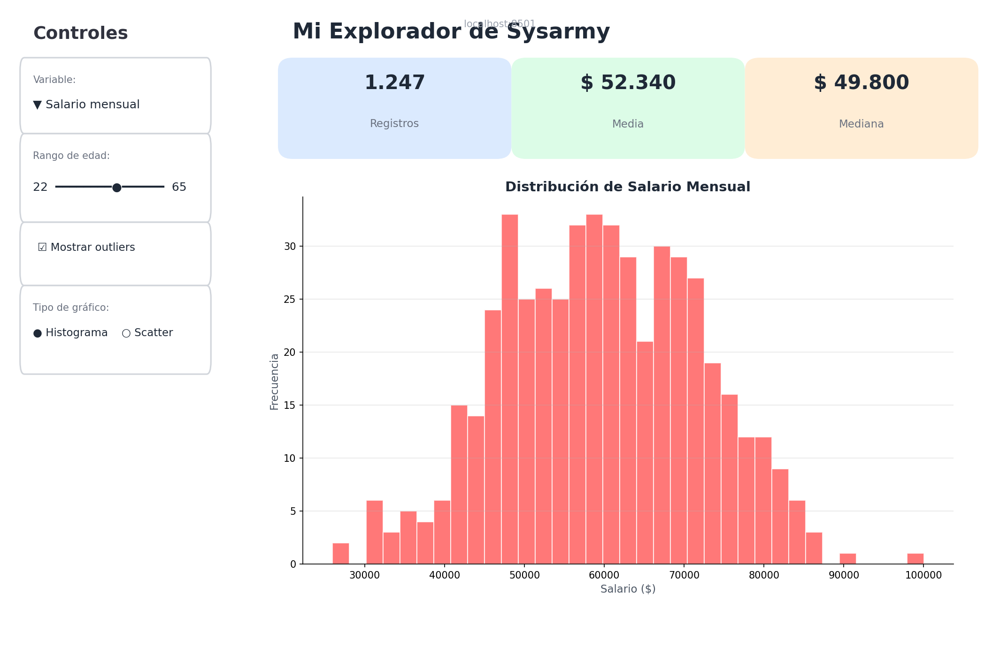
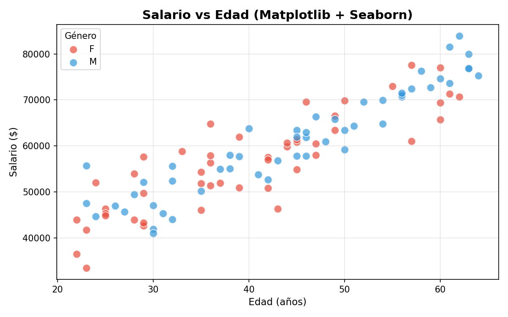
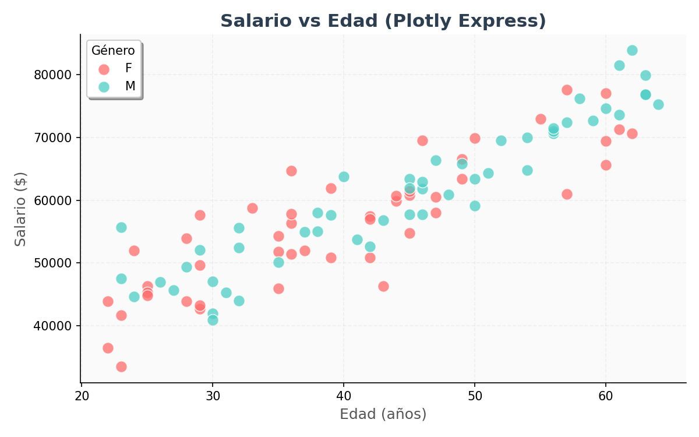
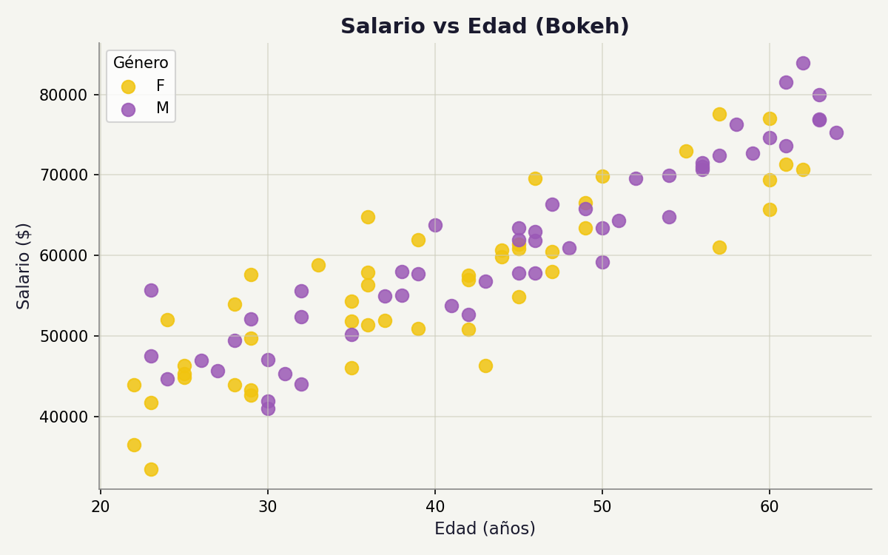
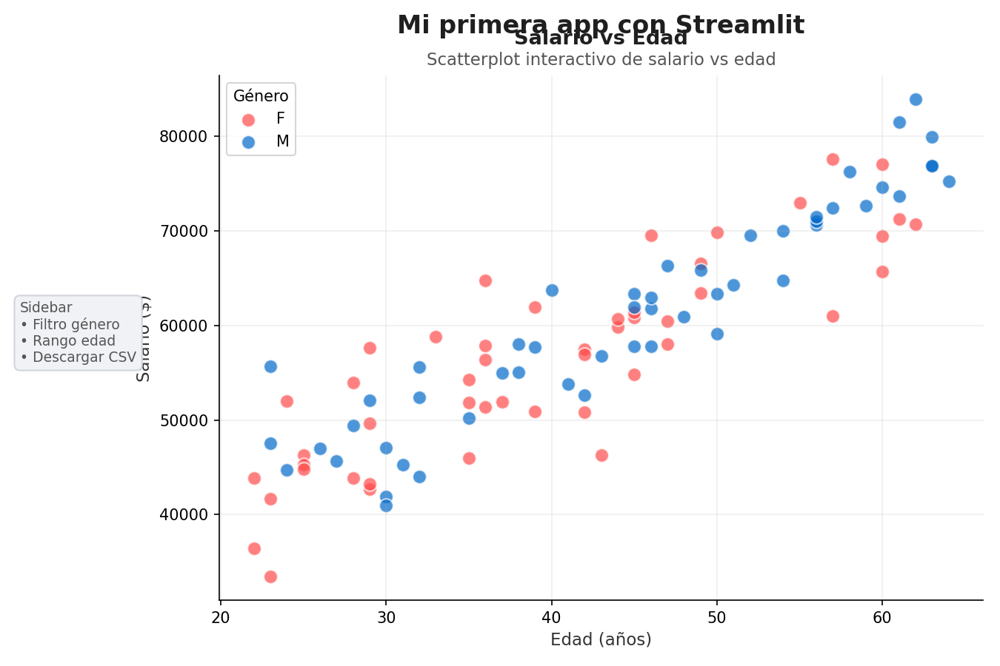

# Visualización Interactiva en Python

## Introducción

Hasta ahora vimos `matplotlib` y `seaborn`: herramientas excelentes para análisis estático, papers académicos y gráficos de alta calidad para publicación. Pero en el mundo real, muchas veces necesitás que el gráfico **reaccione** a la persona que lo mira.

La visualización interactiva permite:

- Hacer **zoom** en regiones de interés.
- Ver **valores exactos** al pasar el mouse (`hover`).
- **Filtrar** datos con sliders, dropdowns o selección.
- **Animar** series temporales o categorías.
- Exportar a **HTML** para compartir sin necesidad de Python instalado.

> **Analogía:** `matplotlib` es un destornillador: simple, confiable, universal. Las librerías interactivas como Plotly son un **taladro inalámbrico con luz LED**: más pesado, requiere batería, pero hace trabajos que el destornillador no puede ni soñar.

En esta sección cubrimos las principales herramientas del ecosistema Python para crear gráficos y aplicaciones interactivas.

---

## Plotly / Plotly Express

### Qué es y para qué sirve

**Plotly** es una librería de gráficos interactivos basada en JavaScript (usa D3.js por debajo) con una API en Python. **Plotly Express** (`px`) es una capa de alto nivel sobre Plotly que permite crear gráficos complejos en una sola línea de código, similar a cómo `seaborn` simplifica `matplotlib`.

Sirve para: dashboards, presentaciones, exploración interactiva de datos, y exportar gráficos a HTML interactivo.

### Cuándo usarla (vs matplotlib/seaborn)

| Usá Plotly cuando... | Quedate con matplotlib/seaborn cuando... |
|---|---|
| Necesitás `hover` para ver valores exactos | El gráfico va a un paper o informe PDF |
| Querés compartir un HTML interactivo | El dataset es enorme (>100k puntos) |
| Hay que hacer zoom/pan sobre los datos | Necesitás control pixel-perfect del diseño |
| Querés animaciones por categoría o tiempo | Preferís rapidez de renderizado sobre interactividad |

### Instalación

```bash
pip install plotly
```

### Ejemplo mínimo de código

```python
import plotly.express as px
import numpy as np
import pandas as pd

np.random.seed(42)
df = pd.DataFrame({
    "x": np.random.randn(50),
    "y": np.random.randn(50),
    "categoria": np.random.choice(["A", "B", "C"], 50),
    "tamaño": np.abs(np.random.randn(50)) * 50
})

fig = px.scatter(df, x="x", y="y", color="categoria", size="tamaño",
                 title="Scatter interactivo con Plotly Express")
fig.show()
```



### Personalizaciones clave

- **`hover_data`**: agrega columnas adicionales al tooltip.
  ```python
  px.scatter(df, x="x", y="y", hover_data=["tamaño"])
  ```
- **`color`**: mapea una variable categórica o continua al color.
- **`facet_col` / `facet_row`**: crea múltiples subgráficos automáticamente.
- **`animation_frame`**: genera una animación frame por frame (ideal para series temporales).
  ```python
  px.scatter(df_anim, x="x", y="y", animation_frame="año")
  ```
- **`template`**: cambia el estilo visual (`plotly_white`, `seaborn`, `simple_white`).

### Exportar a HTML

```python
fig.write_html("grafico.html")
```

Esto genera un archivo HTML autocontenido que podés abrir en cualquier navegador y compartir por email o subir a un servidor. **No requiere Python instalado para verlo.**

### Ventajas y desventajas

**Ventajas:**

- Interactivo por defecto: zoom, pan, hover, descarga como PNG.
- Muy fácil de usar con Plotly Express.
- Gran variedad de tipos de gráficos (3D, mapas, financieros).
- Exportación a HTML sin dependencias.

**Desventajas:**

- Más lento que matplotlib con datasets grandes (miles de puntos ya empiezan a pesar).
- No es la herramienta ideal para papers o publicaciones académicas (aunque se puede exportar a PNG).
- Menos control fino sobre cada píxel que matplotlib.

### Conexión con los TPs

En el **TP2, Ejercicio 3**, el reporte HTML se generó con código estático. Si hubieras usado Plotly, el reporte podría incluir gráficos interactivos donde el docente hace zoom sobre outliers o filtra por categoría directamente en el navegador. Es una mejora real de presentación para entregas digitales.

---

## Dash

### Qué es y para qué sirve

**Dash** es un framework de dashboards desarrollado por la misma gente de Plotly. Permite construir aplicaciones web interactivas **en puro Python** (sin escribir HTML, CSS o JavaScript).

Sirve para: cuando necesitás filtros, sliders, múltiples gráficos conectados entre sí, tablas interactivas, o cualquier aplicación de datos con controles de usuario.

### Cuándo usarla

Usá Dash cuando necesitás que el usuario **intervenga** en la visualización: seleccionar un rango de fechas, elegir una variable de un dropdown, o cruzar información entre varios gráficos. No tiene sentido para un único gráfico estático; ahí va Plotly puro.

### Instalación

```bash
pip install dash
```

### Ejemplo mínimo de código

```python
from dash import Dash, dcc, html, callback, Output, Input
import plotly.express as px
import numpy as np
import pandas as pd

np.random.seed(42)
df = pd.DataFrame({
    "x": np.random.randn(100),
    "y": np.random.randn(100),
    "grupo": np.random.choice(["A", "B"], 100)
})

app = Dash(__name__)

app.layout = html.Div([
    html.H1("Dashboard mínimo con Dash"),
    dcc.Dropdown(id="dropdown", options=["A", "B", "Todos"], value="Todos"),
    dcc.Graph(id="grafico")
])

@callback(Output("grafico", "figure"), Input("dropdown", "value"))
def actualizar_grafico(seleccion):
    if seleccion == "Todos":
        dff = df
    else:
        dff = df[df["grupo"] == seleccion]
    return px.scatter(dff, x="x", y="y", title=f"Grupo: {seleccion}")

if __name__ == "__main__":
    app.run(debug=True)
```



### Componentes básicos

| Componente | Descripción |
|---|---|
| `dcc.Graph` | Donde se renderiza el gráfico Plotly. |
| `dcc.Dropdown` | Menú desplegable para seleccionar opciones. |
| `dcc.Slider` | Barra deslizante para valores numéricos. |
| `dcc.DatePickerRange` | Selector de rango de fechas. |
| `html.Div` | Contenedor genérico para estructurar el layout. |

### Ventajas y desventajas

**Ventajas:**

- Dashboards profesionales sin salir de Python.
- Comunidad grande y documentación excelente.
- Integración nativa con Plotly.
- Permite desplegar en servidores web reales.

**Desventajas:**

- Overkill para un solo gráfico. Si no hay interacción entre widgets, no necesitás Dash.
- Requiere ejecutar un servidor web local (o remoto). No es un archivo estático que mandes por mail.
- Curva de aprendizaje media: hay que entender callbacks y el modelo de layouts.

### Errores comunes

1. **Olvidar el decorador `@callback`**: sin él, el dropdown no hace nada.
2. **IDs duplicados**: cada componente debe tener un `id` único en el layout.
3. **No filtrar el DataFrame dentro del callback**: si usás el df completo siempre, el dropdown es decorativo.
4. **Pensar que Dash reemplaza a Plotly**: no. Dash **contiene** Plotly. Primero aprendé Plotly, después sumá Dash.

---

## Bokeh

### Qué es y para qué sirve

**Bokeh** es una librería de visualización interactiva de **bajo a medio nivel**. A diferencia de Plotly, que es más "opinionado" y de alto nivel, Bokeh te da control casi total sobre la construcción del gráfico, los widgets y la interacción.

Sirve para: cuando necesitás control total sobre la interactividad y Plotly no te deja hacer lo que querés, o cuando integrás gráficos en aplicaciones web con Flask o Django.

### Cuándo usarla

Usá Bokeh cuando:

- Necesitás conectar la visualización con un backend web propio.
- Querés personalizar interacciones muy específicas (ej. seleccionar puntos y que se dispare una función Python).
- Plotly te resulta limitado para un caso de uso particular.

### Instalación

```bash
pip install bokeh
```

### Ejemplo mínimo de código

```python
from bokeh.plotting import figure, show, output_notebook
from bokeh.io import output_file
import numpy as np

output_notebook()  # o output_file("bokeh_grafico.html")

np.random.seed(42)
x = np.random.randn(50)
y = np.random.randn(50)

p = figure(title="Scatter interactivo con Bokeh", width=600, height=400)
p.circle(x, y, size=10, color="navy", alpha=0.5)

show(p)
```



### Personalizaciones clave

- **Tooltips**: información al pasar el mouse, definidos con `HoverTool`.
  ```python
  from bokeh.models import HoverTool
  p.add_tools(HoverTool(tooltips=[("X", "@x"), ("Y", "@y")]))
  ```
- **Widgets y layouts**: botones, sliders, tablas, organizados en filas y columnas con `column()`, `row()`.
- **Interacciones vinculadas**: seleccionar puntos en un gráfico y que se resalten en otro.
- **Servidor Bokeh**: para actualizar datos en tiempo real desde Python.

### Ventajas y desventajas

**Ventajas:**

- Muy flexible. Podés construir cosas que Plotly no permite directamente.
- Buena integración con Flask/Django para web apps custom.
- Renderizado eficiente en el navegador.

**Desventajas:**

- Más verboso que Plotly. Lo que en Plotly Express es una línea, acá son cinco.
- Curva de aprendizaje más alta. Hay que entender el modelo de "glyphs", "tools" y "layouts".
- Menos ejemplos y comunidad que Plotly.

### Errores comunes

1. **Confundir `show()` con `save()`**: `show` abre el navegador; `save` exporta a archivo. Son funciones distintas.
2. **No usar `output_notebook()` en Jupyter**: si no lo llamás, el gráfico no aparece en la celda.
3. **Pensar que Bokeh es más fácil que Plotly**: no lo es. Es más poderoso, pero con mayor costo de aprendizaje.

---

## Streamlit

### Qué es y para qué sirve

**Streamlit** no es "una librería más de gráficos". Es un **framework de aplicaciones de datos** que te permite convertir un script de Python en una app web interactiva sin escribir ni una línea de HTML, CSS o JavaScript.

Su filosofía es simple: **"Python puro"**. Agregás `st.algo()` a tu script y Streamlit se encarga de renderizar widgets, gráficos, tablas y texto en el navegador.

Sirve para:
- Prototipos rápidos para mostrarle a un cliente o compañero.
- Convertir un notebook de análisis en una app interactiva en 10 minutos.
- Crear MVPs de dashboards sin complicarte con frontend.
- Compartir análisis con gente no técnica que no quiere ver código.

### Instalación y ejecución

```bash
pip install streamlit
streamlit run app.py
```

Eso levanta un servidor local y abre tu navegador en `http://localhost:8501`. Cada vez que guardás cambios en `app.py`, la página se recarga automáticamente.

### Widgets básicos

Streamlit tiene una API de widgets extremadamente simple. Acá los más usados, cada uno con un ejemplo mínimo:

**Texto y estructura:**

```python
st.title("Título grande")
st.header("Subtítulo")
st.markdown("**Texto en negrita** con *Markdown*")
```

**Selección:**

```python
columna = st.selectbox("Elegí una columna", ["salario", "edad", "años_experiencia"])
```

**Rango numérico:**

```python
rango = st.slider("Filtrar edad", min_value=18, max_value=70, value=(25, 50))
```

**Toggle:**

```python
mostrar_outliers = st.checkbox("Mostrar outliers", value=False)
```

**Opciones mutuamente excluyentes:**

```python
tipo_grafico = st.radio("Tipo de gráfico", ["Histograma", "Scatterplot"])
```

**Sidebar (controles a la izquierda):**

```python
with st.sidebar:
    st.header("Filtros")
    provincia = st.selectbox("Provincia", ["CABA", "Buenos Aires", "Córdoba"])
```

**Layout en columnas:**

```python
col1, col2 = st.columns(2)
with col1:
    st.line_chart(df_a)
with col2:
    st.bar_chart(df_b)
```

**Métricas (KPIs tipo tarjeta):**

```python
st.metric(label="Media salarial", value="$ 52.340", delta="+3.2% vs 2023")
```

> **Dale, prestá atención:** `st.metric()` no es decorativo. Es la forma profesional de mostrar KPIs en Streamlit. Si usás `st.write()` para mostrar "La media es 52340", estás haciendo las cosas como un amateur.

### Ejemplo completo: "Mi explorador de Sysarmy"

Este script de ~25 líneas simula una app real para explorar el dataset de Sysarmy. Copialo en `app.py`, ejecutalo con `streamlit run app.py` y tocá los widgets:

```python
import streamlit as st
import numpy as np
import pandas as pd
import matplotlib.pyplot as plt

np.random.seed(42)
n = 1000
edad = np.random.randint(22, 65, n)
salario = edad * 800 + np.random.normal(0, 10000, n) + 25000
df = pd.DataFrame({"edad": edad, "salario": salario})

st.title("📊 Mi Explorador de Sysarmy")

# Sidebar
with st.sidebar:
    st.header("Controles")
    variable = st.selectbox("Variable", ["salario", "edad"])
    rango = st.slider("Rango de edad", 18, 70, (25, 50))
    mostrar_outliers = st.checkbox("Mostrar outliers")

# Filtrar
filtrado = df[(df["edad"] >= rango[0]) & (df["edad"] <= rango[1])]
if not mostrar_outliers:
    q1 = filtrado[variable].quantile(0.25)
    q3 = filtrado[variable].quantile(0.75)
    iqr = q3 - q1
    filtrado = filtrado[
        (filtrado[variable] >= q1 - 1.5 * iqr) &
        (filtrado[variable] <= q3 + 1.5 * iqr)
    ]

# Métricas
col1, col2, col3 = st.columns(3)
col1.metric("Registros", len(filtrado))
col2.metric("Media", f"${filtrado[variable].mean():,.0f}")
col3.metric("Mediana", f"${filtrado[variable].median():,.0f}")

# Gráfico
fig, ax = plt.subplots()
ax.hist(filtrado[variable], bins=30, color="#ff4b4b", alpha=0.75, edgecolor="white")
ax.set_title(f"Distribución de {variable}")
st.pyplot(fig)
```



> **Nota:** este ejemplo usa `matplotlib` para el gráfico, pero también podrías usar `st.bar_chart()` o `st.plotly_chart()` si tenés Plotly instalado. Streamlit no te obliga a una librería de visualización.

### Caching: `@st.cache_data`

Streamlit **reejecuta todo el script de arriba a abajo** cada vez que el usuario toca un widget. Si tu dataframe pesa 500MB o tu consulta a base de datos tarda 30 segundos, sin caching la app se vuelve inusable.

La solución es el decorador `@st.cache_data`:

```python
@st.cache_data
def cargar_datos():
    return pd.read_csv("https://sysarmy.com/encuesta.csv")

df = cargar_datos()
```

La primera vez que alguien abre la app, `cargar_datos()` se ejecuta y el resultado se guarda en memoria. En las siguientes interacciones, Streamlit devuelve el cache directamente sin recalcular.

> **Regla de oro:** si una función tarda más de 1 segundo o consume mucha memoria, y sus inputs no cambian entre interacciones, poné `@st.cache_data`.

### Errores comunes específicos de Streamlit

1. **Olvidar que el script se reejecuta entero en cada interacción**
   
   Si tenés una celda que tarda 5 minutos (ej. un modelo de ML pesado), cada vez que el usuario mueve un slider va a tardar 5 minutos. **Solución:** `@st.cache_data` o `@st.cache_resource`.

2. **Modificar el dataframe sin copiarlo**
   
   Como el script se reejecuta, las modificaciones in-place se acumulan o se pierden de formas impredecibles. **Solución:** usá `.copy()` siempre que transformes datos:
   ```python
   df_procesado = df_original.copy()
   df_procesado["nueva_col"] = df_procesado["col"] * 2
   ```

3. **Usar `st.write()` para todo**
   
   `st.write()` es el comodín, pero hay herramientas específicas que dan mejor UX:
   - KPIs → `st.metric()`
   - Tablas grandes → `st.dataframe()` (con scroll y sorting)
   - Tablas pequeñas → `st.table()`
   - JSON/diccionarios → `st.json()`

4. **No usar `st.sidebar`**
   
   Si ponés todos los widgets en el cuerpo principal, ocupan espacio que debería ser para el contenido. **Solución:** agrupá los controles en `st.sidebar` o usá `st.expander()` para colapsarlos.

### Conexión con los TPs

Imaginá que en vez de entregar un notebook estático para el TP1, armás una app de Streamlit donde el profesor puede:

- Elegir la métrica (media, mediana, P90) con un `selectbox`.
- Filtrar lenguajes de programación con un `multiselect`.
- Ver el gráfico actualizarse en tiempo real a medida que cambia los filtros.

No es magia: es el mismo código de pandas que ya escribiste, envuelto en widgets de Streamlit. La diferencia es que ahora el docente **explora** tu análisis en lugar de **leerlo** pasivamente.

### ¿Cuándo usar Streamlit?

| Situación | ¿Streamlit? | Alternativa |
|---|---|---|
| Prototipo rápido para un cliente | SÍ | — |
| Dashboard con 20 gráficos y filtros complejos | Quizás no | Dash |
| App que necesita autenticación de usuarios | No | Flask + React |
| Compartir un análisis con sliders interactivos | SÍ | — |
| Producción con miles de usuarios concurrentes | No | FastAPI + frontend |

> **Consejo del docente:** Streamlit es tu navaja suiza para demos y entregas interactivas. No es la herramienta para todo, pero para el 80% de los casos en los que necesitás "mostrar datos con controles", te saca de apuros en 15 minutos.

### Ventajas y desventajas

**Ventajas:**

- Increíblemente fácil. Agregás `st.something()` a tu script y listo.
- Ideal para prototipos y demos.
- Gran comunidad y muchos componentes de terceros.
- No requiere conocimiento de frontend.

**Desventajas:**

- Menos flexible que Dash o Bokeh para layouts complejos.
- No es una herramienta de "producción" para apps masivas (aunque mejora en cada versión).
- El modelo de ejecución es top-down: se reejecuta todo el script ante cualquier interacción.
- El caching requiere entender qué funciones cachear y cuáles no.

---

## Comparativa rápida

| Librería | Nivel | Interactivo | Ideal para | Curva |
|---|---|---|---|---|
| Matplotlib | Bajo | No | Papers, control total | Media |
| Seaborn | Medio | No | EDA rápido, estadística | Baja |
| Plotly | Medio-Alto | Sí | Dashboards, presentaciones | Baja |
| Dash | Alto | Sí | Apps con filtros y múltiples gráficos | Media |
| Bokeh | Alto | Sí | Web apps custom, control total | Alta |
| Streamlit | Medio | Limitado | Prototipos rápidos | Muy baja |

### ¿Cómo leer esta tabla?

- **Nivel** se refiere al nivel de abstracción: más alto = menos código para resultado estándar; más bajo = más control, más verbosidad.
- **Curva** indica cuánto tardás en ser productivo. Baja = te subís y andás; Alta = necesitás entender conceptos propios de la librería.
- Ninguna es "mejor" que otra en absoluto. Cada una optimiza para un caso de uso distinto.

---

## Decisiones de diseño

### Cómo elegir entre ellas

1. **¿Es un solo gráfico interactivo para un informe o presentación?**
   → **Plotly**. Exportá a HTML y listo.

2. **¿Necesitás filtros, dropdowns, o que varios gráficos reaccionen entre sí?**
   → **Dash**. Es el estándar para dashboards en Python.

3. **¿Es un prototipo rápido para mostrarle a un cliente o compañero?**
   → **Streamlit**. En 20 minutos tenés algo funcional.

4. **¿Necesitás integrar el gráfico en una web app propia (Flask/Django) con lógica custom?**
   → **Bokeh**. Te da el control que Dash no permite sin meterse en el frontend.

5. **¿El gráfico va a un paper, tesis o informe PDF?**
   → **Matplotlib/Seaborn**. Las librerías interactivas no aportan valor en un PDF estático.

### Errores comunes

1. **Usar una bazuca para matar una mosca**: no levantes un servidor de Dash para un gráfico de barras que se mira una vez. Plotly HTML estático alcanza.
2. **Ignorar el tamaño del dataset**: librerías interactivas basadas en JS (todas las de esta sección) sufren con datasets masivos. Si tenés millones de puntos, considerá **samplear**, **agregar**, o usar herramientas como **Datashader**.
3. **Olvidar que el público importa**: si tu audiencia va a imprimir el informe, la interactividad se pierde. Pensá en el medio antes de elegir la herramienta.
4. **Mezclar todo en un solo script**: no importes Plotly, Dash y Bokeh en el mismo archivo "por si acaso". Elegí una, justificá la elección, y mantené el código limpio.
5. **No probar la exportación**: si necesitás compartir el resultado, verificá antes que `fig.write_html()` o el servidor de Dash funcionan en la computadora de destino.

---

## Comparativa práctica: el mismo gráfico con 4 librerías

> **Objetivo de esta sección:** ver cómo se construye **exactamente el mismo scatterplot** (salario vs edad, coloreado por género) en 4 herramientas distintas. La idea es que sientas en el cuerpo las diferencias de verbosidad, control y propósito.

Los 4 ejemplos usan los **mismos datos sintéticos** para que la comparación sea justa:

```python
import numpy as np
import pandas as pd

np.random.seed(42)
n = 100
edad = np.random.randint(22, 65, n)
salario = edad * 800 + np.random.normal(0, 5000, n) + 25000
genero = np.random.choice(["F", "M"], n)
df = pd.DataFrame({"edad": edad, "salario": salario, "genero": genero})
```

---

### 1. Matplotlib + Seaborn (línea de base)

```python
import matplotlib.pyplot as plt
import seaborn as sns

plt.figure(figsize=(8, 5))
sns.scatterplot(data=df, x="edad", y="salario", hue="genero", s=80, alpha=0.8)
plt.title("Salario vs Edad por Género")
plt.xlabel("Edad (años)")
plt.ylabel("Salario ($)")
plt.legend(title="Género")
plt.tight_layout()
plt.show()
```



**Qué destaca:**

- **Control total**: podés tocar cada píxel del gráfico si querés.
- **Ideal para publicar**: el output es un PNG de alta calidad listo para papers.
- **Sin magia negra**: todo lo que pasa es código Python explícito, nada oculto.

---

### 2. Plotly Express

```python
import plotly.express as px

fig = px.scatter(df, x="edad", y="salario", color="genero",
                 title="Salario vs Edad por Género",
                 labels={"edad": "Edad (años)", "salario": "Salario ($)"})
fig.show()
```



**Qué destaca:**

- **Una línea y listo**: el mismo gráfico con ~5 líneas de código. Es ridículamente conciso.
- **Interactivo de fábrica**: zoom, pan, hover y exportar a PNG sin escribir nada extra.
- **Labels inteligentes**: el parámetro `labels` mapea nombres de columnas a textos humanos automáticamente.

---

### 3. Bokeh

```python
from bokeh.plotting import figure, show
from bokeh.models import ColumnDataSource
from bokeh.palettes import Category10

source = ColumnDataSource(df)
p = figure(title="Salario vs Edad por Género", width=700, height=400,
           x_axis_label="Edad (años)", y_axis_label="Salario ($)")
for i, g in enumerate(df["genero"].unique()):
    sub = df[df["genero"] == g]
    p.circle(sub["edad"], sub["salario"], legend_label=g,
             color=Category10[3][i], size=8, alpha=0.7)
p.legend.title = "Género"
show(p)
```



**Qué destaca:**

- **Control quirúrgico**: definís glyphs, herramientas, leyendas y ejes uno por uno.
- **Modelo de datos explícito**: `ColumnDataSource` te obliga a pensar en cómo se alimenta el gráfico.
- **Integración web nativa**: el output es un documento Bokeh que podés embeber en Flask o Django sin hacks.

> **Dale, sé honesto:** ¿te pareció más verboso? Sí. ¿Te da más poder? También. Esa es la transacción con Bokeh.

---

### 4. Streamlit

Creá un archivo `app.py`:

```python
import streamlit as st
import matplotlib.pyplot as plt

st.title("Salario vs Edad por Género")
st.write("Scatterplot interactivo de datos sintéticos")

colors = {"F": "#ff4b4b", "M": "#0068c9"}
fig, ax = plt.subplots(figsize=(8, 5))
for g in df["genero"].unique():
    sub = df[df["genero"] == g]
    ax.scatter(sub["edad"], sub["salario"], c=colors[g], label=g, alpha=0.7)
ax.set_xlabel("Edad (años)")
ax.set_ylabel("Salario ($)")
ax.legend(title="Género")
ax.grid(True, alpha=0.2)
st.pyplot(fig)
```

Y ejecutá:

```bash
streamlit run app.py
```



**Qué destaca:**

- **Es una app, no un gráfico**: en 10 minutos tenés algo que un no-técnico puede abrir en el navegador.
- **Wiring gratis**: agregar un slider o un dropdown es `st.slider()` o `st.selectbox()`, sin callbacks manuales.
- **Modelo top-down**: el script se reejecuta entero ante cualquier interacción. Simple de entender, pero ojo con el código pesado.

---

### Tabla comparativa

| Aspecto | Matplotlib+Seaborn | Plotly | Bokeh | Streamlit |
|---|---|---|---|---|
| Líneas de código | ~8 | ~5 | ~15 | ~10 |
| Interactivo | No | Sí (hover, zoom) | Sí (hover, zoom) | Limitado |
| Ideal para | Papers, EDA | Dashboards, web | Web apps custom | Prototipos rápidos |
| Curva de aprendizaje | Media | Baja | Alta | Muy baja |
| Exportar a HTML | No nativo | `write_html()` | `components()` | `streamlit run` |
| Control visual | Total | Medio | Total | Bajo |

> **Conclusión:** ninguna es "la mejor". Plotly gana en velocidad. Bokeh gana en control. Matplotlib gana en publicaciones. Streamlit gana en prototipos. Elegí según el contexto, no según la moda del momento.

---

## Checklist de comprensión

- [ ] Sé explicar con mis palabras la diferencia entre visualización estática e interactiva.
- [ ] Puedo crear un scatter plot con Plotly Express usando datos de `numpy`.
- [ ] Sé cómo exportar un gráfico de Plotly a un archivo HTML autocontenido.
- [ ] Entiendo cuándo usar Plotly puro vs. cuándo necesito Dash.
- [ ] Puedo leer un ejemplo mínimo de Dash y reconocer el layout, los componentes (`dcc`, `html`) y el callback.
- [ ] Sé en qué situación Bokeh es una mejor opción que Plotly.
- [ ] Puedo elegir la librería correcta según el contexto: paper, dashboard, prototipo o web app.
- [ ] Sé al menos un error común de cada librería y cómo evitarlo.
- [ ] Entiendo por qué ninguna librería interactiva es ideal para datasets masivos sin agregación previa.
- [ ] Sé qué hace `@st.cache_data` y cuándo usarlo.
- [ ] Puedo armar una app de Streamlit con sidebar, métricas y un gráfico que reaccione a filtros.
- [ ] Entiendo por qué Streamlit reejecuta todo el script ante cada interacción y cómo eso afecta el rendimiento.
- [ ] Sé distinguir cuándo Streamlit es la herramienta correcta y cuándo necesito Dash o un desarrollo web profesional.
