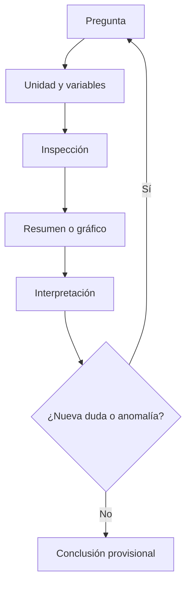

# DiploDatos–SAIJ: guía consolidada de estudio por materias

Esta guía reúne las materias de la Diplomatura en un solo libro autocontenido y usa la mentoría de jurisprudencia SAIJ como terreno de aplicación. El orden es deliberado: primero se aprende la teoría de una materia desde sus fundamentos; después se comprueba la comprensión con pausas y ejercicios; recién entonces se trasladan las decisiones al corpus y a los trabajos prácticos.

“Acotado” describe el alcance del proyecto, no la profundidad de la explicación. Por eso el libro no intenta cubrir todas las ramas posibles de ciencia de datos, pero sí desarrolla con paciencia cada concepto incluido: intuición, vocabulario, ejemplos progresivos, errores frecuentes, criterios de interpretación y decisiones que todavía requieren evidencia.

## Navegación del libro

| Materia | Pregunta central | Aplicación en SAIJ | Conexión práctica |
|---|---|---|---|
| **Materia 1 — Análisis y Visualización de Datos** | ¿Qué contienen los datos, cómo se distribuyen y qué conclusiones descriptivas admiten? | Diagnóstico del corpus, poblaciones documentales, distribuciones, sesgos, texto y comunicación de hallazgos. | TP1: comprender y justificar antes de transformar. |
| **Materia 2 — Análisis Exploratorio y Curación de Datos** | ¿Qué decisiones reproducibles convierten el diagnóstico en un dataset apto para un propósito? | Esquema, faltantes, duplicados, categorías, target, texto, features, sesgos, particiones y auditoría. | Preparación detallada para TP2 y para la futura etapa de modelado. |
| **Materia 3 — Introducción al Aprendizaje Automático** | ¿Cómo se aprende una regla a partir de ejemplos y cómo se evalúa sin engañarse? | Formulación y evaluación honesta de la clasificación de fuero sobre una base curada. | Puente detallado desde TP2 hacia representación, entrenamiento, métricas y análisis de errores. |
| **Materia 4 — Aprendizaje Supervisado** | ¿Cómo funcionan y se comparan familias concretas de modelos supervisados? | Selección responsable de clasificadores para el futuro fuero SAIJ, sin proclamar un ganador antes de medir. | Del marco experimental a modelos lineales, árboles, SVM y ensambles. |
| **Materia 5 — Aprendizaje No Supervisado** | ¿Cómo se busca estructura cuando no hay un target externo que organice el aprendizaje? | Exploración temática, similitudes, representaciones, anomalías y candidatos semánticos como apoyo a la revisión jurídica. | Del target conocido al descubrimiento y la evaluación de estructura. |
| **Optativa 1 — Ética práctica** | ¿Qué beneficios, daños, valores y responsabilidades atraviesan cada decisión del ciclo de datos? | Evaluación sociotécnica de SAIJ: privacidad, sesgo, equidad, documentación, auditoría, retrieval y RAG contestable. | Data Statement (Moodle). El Consorcio no es esa entrega. |
| **Optativa 2 — AWS ML Foundations** | ¿Cómo se implementa ML (y gen AI) en AWS sin creer de memoria las cifras de clase? | Transferencia posterior; no es un lab de Academy. | Quizzes de módulo. Leer la parte 2 (verificación) antes de repetir un número. |
| **Optativa 3 — LLMs y modelos generativos** | ¿Dónde corre el modelo (API vs pesos), con qué costo, VRAM y contrato de datos? | Transferencia posterior: fallo con PII ≠ FAQ. | 4 labs = 2 TPs (Perez). El Consorcio no es el práctico de Moodle. |
| **Optativa 4 — Grandes volúmenes (Spark)** | Si no entra en una máquina, ¿cómo se reparte el cómputo sin mover de más los datos? | 874k filas o 35 documentos del canal **no** son el cluster de esta materia. | Notebooks Zeppelin del Bitbucket FAMAF; ejercicios en el note. |
| **Proyecto integrador — búsqueda semántica y RAG** | ¿Cómo recuperar evidencia pertinente antes de generar una respuesta asistida? | Recuperación de documentos SAIJ con representaciones semánticas, filtros de metadatos y evaluación humana. | Próximo paso del proyecto; **no es una materia formal de DiploDatos**. |

## Ruta corta de estudio

En cada materia seguí la misma secuencia:

```text
teoría desde primeros principios
        ↓
checkpoints de comprensión
        ↓
ejercicios conceptuales sin código
        ↓
aplicación razonada a SAIJ
        ↓
conexión con el trabajo práctico
```

No saltees la etapa conceptual. Si una decisión no puede explicarse sin mencionar una función de Python, todavía no está suficientemente entendida. El código implementa un criterio: no lo reemplaza.

## Convención común: cinco troncales + cuatro optativas

A lo largo del libro se distingue entre **teoría general**, **ejemplos ilustrativos inventados**, **hallazgos informados por el notebook del equipo y pendientes de reproducción**, y **decisiones que Javier debe tomar y justificar personalmente**. Esta convención evita convertir resultados ajenos, hipótesis plausibles o simples ejemplos en hechos propios.

---

# Materia 1 — Análisis y Visualización de Datos

> **Idea rectora:** este capítulo es **acotado en alcance, profundo en explicación**. Desarrolla una sola materia —Análisis y Visualización de Datos— desde primeros principios y la conecta con la mentoría de jurisprudencia y su TP1. No intenta adelantar aprendizaje automático, NLP avanzado ni RAG.

Esta es la primera materia desarrollada por completo en la ruta de estudio. La podés estudiar sin abrir el notebook del grupo, los apuntes de clase ni otro archivo. Al final hay un apéndice opcional de trazabilidad para cuando quieras comparar esta explicación con los materiales de origen.

El objetivo no es que memorices una lista de gráficos. Es que aprendas a construir una cadena de razonamiento defendible:

```text
pregunta → datos adecuados → exploración → evidencia → conclusión limitada
```

En un proyecto como SAIJ, esa cadena importa más que cualquier biblioteca. Un gráfico prolijo puede estar respondiendo una pregunta mal planteada. Un promedio exacto puede resumir una población mezclada. Un pico temporal puede representar una carga administrativa y no actividad judicial. AVD te enseña a detectar esos problemas **antes** de convertirlos en conclusiones.

---

## 0. Cómo leer este capítulo

### 0.1 Propósito

Al terminar deberías poder:

1. explicar qué significa analizar datos y distinguir descripción, inferencia y predicción;
2. definir dataset, corpus, población, muestra, observación, unidad de análisis, variable, target y metadata;
3. clasificar variables por tipo y escala de medición;
4. elegir resúmenes y gráficos compatibles con cada variable;
5. conducir un EDA como un proceso iterativo de preguntas y comprobaciones;
6. reconocer problemas de calidad sin “limpiar por reflejo”;
7. interpretar centro, dispersión, cuantiles, formas de distribución y outliers;
8. distinguir análisis univariado, bivariado y multivariado;
9. hablar con precisión sobre asociación, correlación, confusión y causalidad;
10. transformar un gráfico en una afirmación con evidencia, límites y próximo paso;
11. explicar qué intenta establecer el TP1 de SAIJ antes de escribir código;
12. separar un resultado propio de un hallazgo informado por el notebook del grupo.

### 0.2 Convenciones de evidencia

Para no apropiarnos de conclusiones ajenas ni presentar supuestos como hechos, usaremos cuatro rótulos:

| Rótulo | Qué significa |
|---|---|
| **Teoría** | Concepto general de AVD que no depende del dataset SAIJ. |
| **Ejemplo ilustrativo** | Datos inventados para aprender; no describen el corpus real. |
| **Hallazgo del notebook del grupo — a reproducir** | Resultado informado por el trabajo de compañeros; Javier todavía debe volver a obtenerlo y validarlo. |
| **Hipótesis o decisión a validar** | Explicación plausible o criterio metodológico pendiente de comprobar. |

Esta separación es parte del método. En ciencia de datos, decir **cómo sabés algo** es tan importante como decir qué creés saber.

### 0.3 Método de estudio sugerido

Hacé cada bloque en cuatro pasadas:

1. **Intuición:** leé la explicación sin detenerte en fórmulas.
2. **Reconstrucción:** cerrá el texto y explicá el concepto con tus palabras.
3. **Transferencia:** inventá un ejemplo cotidiano y otro del corpus jurídico.
4. **Chequeo:** respondé las preguntas de pausa sin mirar.

No abras pandas durante la primera vuelta. Si no podés decidir qué representa una fila, qué querés medir o qué afirmación admitirían los datos, el código solamente automatiza la confusión.

> **Pausa inicial**
>
> Antes de seguir, completá oralmente: “El TP1 no busca entrenar el modelo final. Busca entender ________, detectar ________ y establecer si ________”.

### 0.4 Cursada 2026: Sysarmy, no el fuero

**Contexto de aula.** Georgina Flesia (teoría) y Karim Nemer Pelliza (notebooks; **ella**, no “el ingeniero”). Dataset de clase: encuesta de sueldos Sysarmy. Entregables grupales + una visualización. Esta guía **no** sustituye ese TP: el hilo acá es SAIJ / mentoría.

**No recites:** “60 mil programadores en Argentina” (el 60k se parece al *crecimiento* de empleo registrado del sector, no al total). “El 80% del tiempo se limpia” es un mito de encuestas distintas (CrowdFlower vs Anaconda); no es una constante de la física.

---

## 1. Mapa mental: de una pregunta a una conclusión

### 1.1 La unidad mínima de un análisis

Un análisis no empieza con un archivo. Empieza con una **pregunta**. El archivo importa porque puede —o no— contener evidencia adecuada para responderla.

Tomemos una pregunta de la mentoría:

> ¿La composición de fueros cambia a través del tiempo?

La cadena de razonamiento podría ser:

1. **Pregunta:** ¿cambia la proporción de documentos de cada fuero por año?
2. **Datos:** necesitamos una fecha que represente el evento judicial y una etiqueta de fuero confiable.
3. **Exploración:** inspeccionamos formatos de fecha, faltantes, rango, duplicados, significado de cada reloj y calidad del target.
4. **Evidencia:** calculamos cantidades y proporciones por año, y visualizamos tendencias.
5. **Conclusión:** describimos el patrón observado en el corpus analizado, señalando cobertura, artefactos posibles y límites.

Fijate en dos detalles:

- La pregunta habla de **composición**, por lo que los porcentajes pueden ser más informativos que los conteos absolutos.
- Necesitamos saber qué significa “fecha”. Una fecha de carga al sistema no responde necesariamente cuándo ocurrió la decisión judicial.

### 1.2 Una conclusión nunca es más fuerte que sus eslabones

Podemos imaginar la cadena como una serie de filtros:


Si la pregunta es ambigua, no sabés qué medir. Si la unidad de análisis está mal definida, los conteos no tienen significado. Si la fecha representa otra cosa, la serie temporal cuenta otra historia. Si el gráfico usa una escala engañosa, la evidencia se deforma. Si la interpretación exagera, la conclusión deja de estar respaldada.

### 1.3 Pregunta descriptiva bien formulada

Una buena pregunta descriptiva suele especificar:

- **qué unidad** se cuenta o resume;
- **qué variable** interesa;
- **en qué conjunto** de datos;
- **según qué grupos** se compara;
- **en qué período** o cobertura;
- **con qué propósito** se interpreta.

Ejemplo débil:

> ¿Cómo están los fueros?

Ejemplo mejor:

> Entre los sumarios con `materia` interpretable del corpus analizado, ¿qué proporción corresponde a cada fuero y cuán concentrada está la distribución?

La segunda versión ya anticipa la unidad, el subconjunto, la variable y el tipo de resumen.

> **Recapitulación 1**
>
> - Preguntar viene antes que calcular.
> - La unidad de análisis define qué significa cada conteo.
> - Un campo solo sirve si su significado coincide con la pregunta.
> - Toda conclusión debe conservar las condiciones bajo las cuales se obtuvo.

---

## 2. Qué es analizar datos

### 2.1 Análisis como reducción con sentido

Un dataset puede tener cientos de miles de filas y decenas de columnas. Nadie puede leerlo completo registro por registro. Analizar implica **reducir esa complejidad sin borrar lo que importa**.

La reducción puede adoptar distintas formas:

- un conteo resume muchas observaciones en una cantidad;
- una proporción permite comparar grupos de distinto tamaño;
- una mediana resume una posición central;
- un histograma resume la forma de miles de valores;
- una tabla cruzada resume combinaciones de categorías;
- un gráfico temporal resume cómo cambia una medida.

La palabra clave es “con sentido”. Un promedio de códigos de provincia reduce datos, pero no tiene interpretación. Un único promedio de longitud puede ocultar que conviven sumarios y fallos con estructuras diferentes. Reducir bien requiere comprender la semántica.

### 2.2 Descriptivo, inferencial y predictivo

Estas tres orientaciones responden preguntas distintas.

| Orientación | Pregunta típica | Producto | Alcance prudente |
|---|---|---|---|
| **Descriptiva** | ¿Qué observamos en estos datos? | conteos, proporciones, distribuciones, gráficos | el conjunto efectivamente analizado |
| **Inferencial** | ¿Qué podemos decir sobre una población a partir de una muestra? | estimaciones, intervalos, tests | depende del diseño de muestreo y los supuestos |
| **Predictiva** | ¿Qué valor o clase estimaremos para un caso nuevo? | modelo y evaluación fuera de muestra | casos futuros comparables al entrenamiento |

#### Descriptivo

Si contás documentos por provincia dentro del corpus disponible, estás describiendo el corpus. No demostrás que esa distribución represente toda la actividad judicial argentina.

#### Inferencial

Si quisieras inferir desde una muestra a una población, necesitarías definir esa población y justificar el mecanismo de selección. Una muestra grande no se vuelve representativa por cantidad solamente. Un millón de registros sesgados sigue siendo una gran colección sesgada.

#### Predictivo

Si más adelante querés predecir `fuero` a partir del texto, necesitás target, features y una evaluación honesta en documentos no usados para entrenar. Esa ya es otra etapa. AVD aporta el diagnóstico que permite formularla, pero no la desarrolla.

### 2.3 ¿Dónde queda el TP1?

El TP1 es principalmente **descriptivo y exploratorio**. Puede producir hipótesis para modelado futuro —por ejemplo, que el vocabulario parece variar por fuero—, pero no prueba todavía que un clasificador generalizará bien.

La formulación correcta es:

> “La exploración muestra señales que justifican probar una tarea predictiva.”

No:

> “Vimos palabras distintas, entonces el fuero ya es predecible.”

Para sostener la segunda afirmación haría falta entrenar y evaluar modelos fuera de muestra, controlar fuga de información y analizar errores.

### 2.4 Error común: mezclar verbos

Los verbos orientan el nivel de evidencia:

- **observamos, describimos, comparamos:** apropiados para AVD;
- **estimamos, inferimos:** requieren marco inferencial;
- **predijimos, generaliza:** requieren evaluación predictiva;
- **causa, produce, genera:** requieren diseño causal o evidencia adicional.

> **Pausa 2**
>
> 1. Si CABA concentra muchos registros del corpus, ¿es una descripción o una inferencia sobre la justicia argentina?
> 2. Si una nube de palabras parece distinta por fuero, ¿es evidencia exploratoria o validación predictiva?
> 3. ¿Qué dato adicional necesitarías para interpretar una caída anual como caída real de actividad judicial?

---

## 3. Las piezas del problema: población, corpus, muestra y variables

### 3.1 Dataset y corpus

Un **dataset** es una colección organizada de datos. Puede ser tabular, relacional, geográfica, temporal, textual o una mezcla.

Un **corpus** es una colección de documentos usada como material de análisis lingüístico o documental. El corpus puede estar guardado dentro de un dataset tabular: una fila por documento, columnas de texto y columnas de metadata.

En SAIJ conviven ambos sentidos:

- llamamos **dataset** a la estructura de filas y columnas;
- llamamos **corpus** al conjunto de documentos jurídicos que queremos estudiar.

### 3.2 Población

La **población** es el conjunto total sobre el cual querríamos formular una conclusión.

Posibles poblaciones, que no son equivalentes:

1. todos los registros contenidos en una versión del dataset descargado;
2. todos los documentos registrados por SAIJ en cierto período;
3. toda la jurisprudencia argentina producida en ese período;
4. todos los documentos que un futuro sistema recibirá.

El corpus disponible puede cubrir razonablemente la primera y quizá parte de la segunda. No podemos asumir que representa la tercera. La cobertura institucional, geográfica, temporal y de digitalización puede diferir.

### 3.3 Muestra

Una **muestra** es un subconjunto de una población o colección de referencia.

Muestrear puede ser necesario por memoria o tiempo. Pero hay que conservar:

- el método de selección;
- la semilla aleatoria, si corresponde;
- la fracción tomada;
- la unidad muestreada;
- las comparaciones que verifican similitud con el conjunto de referencia;
- los grupos que podrían haber quedado con pocos casos.

**Hallazgo del notebook del grupo — a reproducir:** el trabajo informa haber usado aproximadamente el 50% del archivo, tomando una fracción aleatoria dentro de bloques por una limitación de memoria. También informa que comparó distribuciones para controlar representatividad operativa. Javier debe revisar el procedimiento y reproducir los chequeos; no alcanza con copiar la justificación.

### 3.4 Observación y unidad de análisis

Una **observación** es una instancia registrada: normalmente una fila, aunque no siempre.

La **unidad de análisis** es aquello sobre lo que se calcula e interpreta una medida. Puede ser:

- documento;
- sumario;
- fallo;
- expediente;
- combinación documento–descriptor;
- provincia–año;
- fuero–año.

La observación física y la unidad analítica pueden divergir. Si una fila contiene una lista de cinco descriptores y la “explotás” en cinco filas, la nueva tabla tiene cinco observaciones descriptor–documento, pero sigue representando un solo documento. Contar filas como documentos quintuplicaría ese caso.

### 3.5 Variable y feature

Una **variable** es una característica que puede tomar valores entre observaciones: provincia, fecha, longitud, tipo de registro.

Una **feature** es una variable usada como entrada de un modelo predictivo. En AVD solemos hablar de variables. “Feature” cobra sentido cuando definimos una tarea de modelado.

No toda variable debería ser feature:

- un identificador sirve para trazabilidad, no necesariamente para aprender patrones;
- una variable que revela el target produce fuga;
- una variable con cobertura desigual puede inducir sesgo;
- una fecha administrativa puede ser irrelevante para el fenómeno jurídico.

### 3.6 Target

El **target** es la variable que un modelo futuro intentaría predecir.

En la mentoría, el candidato es `fuero`. El notebook del grupo informa que no venía como columna lista y que se derivó de `materia`. Esa decisión tiene consecuencias:

1. `materia` deja de ser una feature válida para predecir `fuero`;
2. las reglas de normalización pasan a formar parte de la definición del target;
3. errores y ambigüedades de `materia` se convierten en ruido de etiqueta;
4. categorías compuestas obligan a decidir si la tarea es multiclase o multietiqueta;
5. la distribución final depende de las reglas aplicadas.

### 3.7 Metadata

La **metadata** describe al documento sin ser necesariamente su contenido principal. Ejemplos conceptuales:

- identificador;
- fecha;
- tribunal;
- provincia;
- tipo de registro;
- etiquetas de indexación;
- descriptores;
- fuente.

Metadata no significa “inofensiva”. Provincia, tribunal o descriptores pueden estar fuertemente asociados con el fuero. Son útiles para explorar, filtrar y citar, pero podrían ser features riesgosas.

### 3.8 Ejemplo trabajado: ¿qué estamos contando?

**Ejemplo ilustrativo.** Supongamos esta tabla:

| fila | id | tipo | provincia | materia | descriptores |
|---:|---|---|---|---|---|
| 1 | SU-01 | sumario | Córdoba | LABORAL | [despido, indemnización] |
| 2 | SU-02 | sumario | Córdoba | CIVIL | [daños] |
| 3 | FA-10 | fallo | Santa Fe | — | [contrato, daños, costas] |

Preguntas:

- Si la unidad es **documento**, hay 3.
- Si la unidad es **sumario**, hay 2.
- Si la unidad es **descriptor–documento**, hay 6.
- Si analizamos `materia`, el fallo no tiene valor. Eso puede ser estructural, no una pérdida accidental.

> **Recapitulación 3**
>
> Nunca escribas “hay N casos” sin poder completar “N unidades de tipo ________, después de aplicar ________”.

---

## 4. Tipos de variables y escalas de medición

### 4.1 El tipo estadístico no es el tipo de la computadora

Una columna puede aparecer como texto en el programa y, sin embargo, representar una fecha. Un código de provincia puede estar guardado como entero y seguir siendo categórico. El tipo técnico dice cómo se almacena; el tipo estadístico dice qué operaciones tienen sentido.

### 4.2 Variables categóricas

#### Nominales

Sus categorías no tienen orden inherente.

Ejemplos:

- provincia;
- tribunal;
- tipo de registro;
- fuero, si las ramas se tratan como categorías sin jerarquía.

Operaciones válidas:

- conteos y proporciones;
- moda;
- tablas de contingencia;
- comparación de composición;
- barras, puntos o heatmaps categóricos.

Operaciones inválidas:

- promedio de provincias;
- restar PENAL menos CIVIL;
- interpretar que un código 4 es el doble de un código 2.

#### Ordinales

Tienen orden, pero las distancias entre niveles no están garantizadas.

Ejemplo genérico: prioridad `baja < media < alta`. Sabemos qué viene antes, no que la distancia entre baja y media sea idéntica a la de media y alta.

En SAIJ, muchas variables centrales son nominales; no conviene inventar jerarquías jurídicas para volverlas ordinales.

### 4.3 Variables cuantitativas

#### Discretas

Surgen de contar y suelen tomar enteros:

- cantidad de documentos por fuero;
- número de descriptores por documento;
- cantidad de palabras, si tokenizamos;
- cantidad de documentos por año.

#### Continuas

Conceptualmente pueden tomar cualquier valor en un intervalo:

- duración;
- distancia;
- una medición física.

En este corpus, muchas medidas son conteos y no verdaderamente continuas. Aun así, con muchos valores se pueden analizar con herramientas similares.

### 4.4 Escalas de medición

Otra clasificación útil se enfoca en las operaciones permitidas.

| Escala | Qué conserva | Ejemplo | Operaciones razonables |
|---|---|---|---|
| **Nominal** | igualdad/diferencia | provincia | conteos, proporciones, moda |
| **Ordinal** | orden | prioridad baja/media/alta | lo anterior + posición/mediana con cautela |
| **Intervalo** | distancias iguales, cero arbitrario | año calendario | diferencias; no razones del tipo “el doble” |
| **Razón** | distancias y cero significativo | longitud en palabras | suma, media, cocientes, dispersión |

El año 2000 no es “el doble” del año 1000; su cero no representa ausencia de tiempo. En cambio, 200 palabras sí son el doble de 100 en conteo.

### 4.5 Fechas y tiempo

Las fechas merecen categoría propia porque permiten derivar:

- año, mes o día;
- intervalos entre eventos;
- orden temporal;
- estacionalidad;
- cohortes y períodos.

Pero antes hay una pregunta semántica: **¿fecha de qué?** En un sistema documental puede haber fecha del fallo, fecha de alta, fecha de modificación y timestamp técnico. Son relojes diferentes.

### 4.6 Texto, listas e identificadores

#### Texto libre

No se resume con media o mediana directamente. Primero se deriva una variable interpretable: longitud, cantidad de términos, presencia de una expresión o vector de frecuencias.

#### Listas o estructuras anidadas

Una lista de descriptores no es una categoría simple. Puede requerir analizar:

- cuántos elementos tiene;
- qué términos aparecen;
- qué co-ocurrencias existen;
- cuál es la unidad después de expandirla.

#### Identificadores

Un ID se parece a una variable nominal, pero su función es distinguir y trazar observaciones. Que sea numérico no habilita media, mediana ni correlación.

### 4.7 Por qué el tipo determina el resumen y el gráfico

| Pregunta | Tipo de variable | Resumen | Gráfico posible |
|---|---|---|---|
| ¿Cuántos documentos hay por fuero? | categórica | conteo/proporción | barras ordenadas |
| ¿Cómo se distribuye la longitud? | cuantitativa | mediana, cuantiles, IQR | histograma + boxplot |
| ¿Cómo cambia el volumen por año? | temporal + conteo | serie por año | línea o barras |
| ¿Cómo se asocian provincia y fuero? | dos categóricas | tabla cruzada, porcentajes condicionales | heatmap o barras apiladas |
| ¿Longitud y año se mueven juntas? | dos cuantitativas | correlación y análisis por período | dispersión/transparencia |
| ¿Qué campos faltan por tipo documental? | categóricas + indicador binario | tasa de faltantes por grupo | heatmap de cobertura |

### 4.8 Errores comunes

1. Confiar en `dtype` sin leer valores.
2. Tratar un código como magnitud.
3. Ordenar alfabéticamente una variable temporal.
4. Promediar categorías codificadas con números.
5. Graficar texto crudo sin definir qué aspecto del texto se mide.
6. Convertir ausencias estructurales en ceros, como si “no aplica” significara “ninguno”.

> **Pausa 4**
>
> Clasificá: `id-infojus`, `provincia`, `fecha`, cantidad de palabras, `materia`, lista de descriptores. Para cada una, decí una operación válida y una inválida.

---

## 5. EDA: razonamiento iterativo, no checklist mecánico

### 5.1 Qué es EDA

EDA significa **Análisis Exploratorio de Datos**. Su objetivo es entender qué se midió, cómo está organizado, qué problemas contiene, qué patrones aparecen y qué nuevas preguntas conviene hacer.

No es una sala de espera antes del “análisis verdadero”. Es donde se descubren las condiciones que vuelven válido o inválido todo lo posterior.

### 5.2 El ciclo exploratorio

Un ciclo típico es:

1. formular una pregunta;
2. elegir variables y unidad;
3. inspeccionar estructura y calidad;
4. calcular un resumen o crear un gráfico;
5. interpretar qué muestra y qué no;
6. detectar una anomalía, patrón o ambigüedad;
7. reformular la pregunta;
8. repetir.



La palabra **provisional** importa. En exploración, un patrón abre una línea de investigación; no se transforma automáticamente en ley general.

### 5.3 Ejemplo iterativo con fechas

1. Graficás documentos por año y aparece un pico enorme.
2. Preguntás: ¿es actividad judicial o carga documental?
3. Descubrís dos campos temporales.
4. Comparás fecha del documento con fecha de alta.
5. Revisás qué tipos documentales dominan el pico.
6. Ajustás la interpretación.

El primer gráfico no era inútil ni definitivo: era una **máquina de generar una mejor pregunta**.

### 5.4 Del panorama general al detalle

Una progresión sana:

#### Nivel 1: estructura

- dimensiones;
- nombres y significado de columnas;
- tipos técnicos;
- ejemplo de filas;
- unidad aparente.

#### Nivel 2: calidad

- faltantes;
- duplicados;
- categorías raras;
- rangos y fechas;
- mezcla de poblaciones;
- cobertura por subgrupo.

#### Nivel 3: distribución individual

- conteos, proporciones;
- centro y dispersión;
- forma, cola, extremos;
- categorías dominantes.

#### Nivel 4: relaciones

- cruces entre variables;
- comparaciones condicionales;
- patrones temporales y geográficos;
- posibles confusores.

#### Nivel 5: comunicación

- seleccionar hallazgos;
- comprobar robustez descriptiva;
- escribir límites;
- diseñar gráficos finales.

### 5.5 EDA no significa probar todo

Producir cien gráficos sin una pregunta no es exploración; es acumulación. El criterio para decidir el próximo paso es: **¿qué incertidumbre concreta reduce este cálculo?**

Ejemplo:

- Incertidumbre: no sabemos si los nulos de `tribunal` son errores.
- Próximo paso útil: tasa de cobertura de `tribunal` por tipo de registro.
- Próximo paso poco útil: una nube de palabras global.

### 5.6 Registro de decisiones

Durante el EDA anotá:

| Elemento | Ejemplo de registro |
|---|---|
| Pregunta | ¿Los faltantes dependen del tipo documental? |
| Unidad | documento antes de expandir descriptores |
| Hallazgo | la cobertura cambia fuertemente por tipo |
| Hipótesis | la ausencia puede ser estructural |
| Verificación | cruzar presencia del campo con prefijo/tipo |
| Decisión | no imputar hasta comprender el esquema |
| Límite | el tipo derivado del ID también debe validarse |

### 5.7 Error común: concluir al primer gráfico

Un gráfico puede sugerir que una provincia tiene más documentos. Todavía falta preguntar:

- ¿más conteo o más proporción dentro de un subconjunto?
- ¿hay duplicados?
- ¿la cobertura temporal es comparable?
- ¿se mezclan fallos y sumarios?
- ¿la provincia falta de manera diferencial?
- ¿el pico proviene de una carga masiva?

> **Checkpoint antes de estadística descriptiva**
>
> - [ ] Puedo nombrar la unidad de análisis.
> - [ ] Sé qué representa cada variable clave.
> - [ ] Distingo fecha judicial de fecha administrativa.
> - [ ] Sé qué subconjunto responde mi pregunta.
> - [ ] Tengo una razón para cada resumen o gráfico que produciría.

---

## 6. Calidad de datos: diagnosticar antes de corregir

### 6.1 Calidad “para qué”

La calidad no es una propiedad absoluta. Un campo puede ser suficiente para describir cobertura y, a la vez, inadecuado para entrenar un modelo. Una fila sin `materia` puede ser inútil para construir `fuero`, pero valiosa para estudiar fallos completos.

La pregunta no es solo “¿está sucio?”, sino:

> ¿Este dato es apto para esta pregunta, bajo esta unidad y este criterio?

### 6.2 Esquema

El **esquema** describe qué columnas existen, qué tipos esperan, qué restricciones deberían cumplir y cómo se relacionan.

Chequeos básicos:

- columnas esperadas y inesperadas;
- tipos técnicos;
- campos completamente vacíos;
- estructuras anidadas;
- identificadores únicos o repetidos;
- reglas por tipo documental;
- campos obligatorios según población.

Un dataset que mezcla varios esquemas en una sola tabla produce grandes zonas de nulos. Eso no significa necesariamente pérdida; puede significar que una columna aplica a un tipo y no a otro.

### 6.3 Valores faltantes

Conviene distinguir al menos cuatro casos:

| Tipo de ausencia | Significado | Ejemplo conceptual | Acción inicial |
|---|---|---|---|
| **Accidental** | el dato debía estar pero se perdió | sumario sin fecha por error | investigar origen e impacto |
| **Estructural** | el campo no aplica | campo exclusivo de fallo en un sumario | conservar como “no aplica” o separar poblaciones |
| **Informativa** | la ausencia aporta señal | ciertos tipos rara vez tienen descriptor | medir indicador y distribución por grupo |
| **Representación técnica** | existe pero quedó codificado raro | cadena vacía, `"null"`, lista vacía | normalizar representación |

#### Por qué imputar puede inventar

Si completás una provincia faltante con la moda, fabricás más casos de la provincia dominante. Si completás un texto inexistente con una cadena vacía y luego medís longitud, mezclás “sin documento” con “documento de longitud cero”.

Primero explicá por qué falta. Después decidí si excluir, imputar, separar o mantener.

### 6.4 Duplicados

Hay varios conceptos distintos:

- fila exactamente repetida;
- mismo ID con contenido idéntico;
- mismo ID con versiones diferentes;
- mismo texto bajo IDs distintos;
- repetición legítima por relación uno-a-muchos;
- duplicación introducida por una expansión o unión.

Antes de borrar, preguntá:

1. ¿qué define identidad en el dominio?
2. ¿puede haber versiones?
3. ¿qué columna tiene prioridad?
4. ¿el duplicado existía en origen o lo generó el pipeline?
5. ¿qué conteos se inflan si lo conservo?

### 6.5 Categorías inconsistentes

Ejemplos genéricos:

```text
LABORAL
Laboral
LAABORAL
LABORAL
PENAL.
```

Normalizar puede involucrar:

- mayúsculas/minúsculas;
- tildes;
- espacios y separadores;
- errores de tipeo;
- sinónimos;
- categorías compuestas;
- etiquetas transversales que no representan la categoría buscada.

Cada regla debe quedar visible. Si `fuero` se deriva de esta limpieza, cambiar una regla modifica el target y todos sus conteos.

### 6.6 Valores imposibles e improbables

Un valor **imposible** contradice una regla firme: una fecha que no se puede parsear, un conteo negativo, un ID vacío si es obligatorio.

Un valor **improbable** es raro pero posible: un documento muy antiguo, un texto extremadamente largo o una categoría con tres casos.

No los trates igual. Lo imposible suele requerir corrección o exclusión documentada. Lo improbable requiere diagnóstico.

### 6.7 Poblaciones documentales mezcladas

**Hallazgo del notebook del grupo — a reproducir:** el trabajo identifica tres tipos de registro mediante estructura y prefijos: sumarios, fallos y novedades. Informa que novedades y filas sin identificador fueron excluidas para la tarea de clasificación, mientras que sumarios y fallos se conservaron como poblaciones pertinentes.

Lo importante para aprender no es memorizar esa decisión, sino reconstruir su lógica:

1. mirar patrones de cobertura;
2. identificar grupos de filas con esquemas distintos;
3. inspeccionar ejemplos reales de cada grupo;
4. relacionar cada grupo con la pregunta del TP1;
5. justificar inclusión o exclusión por pertenencia y contenido, no por un umbral arbitrario de nulos.

### 6.8 Perfil de calidad recomendado

Para cada variable clave, construí una ficha conceptual:

| Variable | Rol | Cobertura global | Cobertura por tipo | Validez | Consistencia | Riesgo |
|---|---|---:|---:|---|---|---|
| `id-infojus` | identificación | a reproducir | a reproducir | patrón/prefijo | unicidad | filas sin contenido |
| `materia` | fuente del target | a reproducir | a reproducir | etiquetas válidas | typos/compuestas | target ruidoso |
| `texto` | contenido candidato | a reproducir | a reproducir | no vacío/markup | formato | mezcla de poblaciones |
| `fecha` | tiempo judicial candidato | a reproducir | a reproducir | parseable/rango | semántica | extremos y cobertura |
| `provincia` | metadata geográfica | a reproducir | a reproducir | catálogo | variantes | sesgo geográfico |

### 6.9 Errores comunes

1. Borrar toda columna con muchos nulos sin segmentar por tipo.
2. Completar ausencias estructurales con la moda.
3. Deduplicar por fila cuando la identidad real depende del ID o la versión.
4. Normalizar categorías sin conservar el valor original.
5. Declarar “error” todo valor raro.
6. Aplicar una regla de limpieza porque mejora un gráfico.
7. No informar cuántas observaciones se pierden en cada filtro.

> **Recapitulación 6**
>
> Limpiar no es embellecer la tabla. Es decidir qué representa el conjunto analizado. Toda limpieza cambia el universo de la conclusión.

---

## 7. Estadística descriptiva desde la intuición

### 7.1 Conteos y proporciones

El **conteo** responde cuántas unidades cumplen una condición.

La **proporción** responde qué parte del total representan:

$$
p = \frac{k}{n}
$$

donde:

- $p$ es la proporción;
- $k$ es la cantidad de observaciones con la característica;
- $n$ es la cantidad total de observaciones consideradas.

Para expresarla como porcentaje, multiplicamos por 100.

**Ejemplo ilustrativo.** Si 60 de 200 sumarios pertenecen a LABORAL:

$$
p = \frac{60}{200} = 0{,}30 = 30\%
$$

El denominador debe acompañar siempre la interpretación. “30% laboral” no significa lo mismo si el total incluye fallos sin `materia`, si solo incluye sumarios etiquetados o si corresponde a una provincia.

### 7.2 Media

La **media aritmética** reparte el total en partes iguales:

$$
\bar{x} = \frac{1}{n}\sum_{i=1}^{n} x_i
$$

Símbolos:

- $\bar{x}$: media de la muestra;
- $n$: cantidad de observaciones;
- $x_i$: valor de la observación $i$;
- $\sum$: suma de todos los valores desde $i=1$ hasta $i=n$.

**Intuición:** es el punto de equilibrio de los valores. Usa la magnitud de todos, por eso un extremo puede moverla mucho.

**Ejemplo ilustrativo de longitud:** 40, 50, 60, 70 y 280 palabras.

$$
\bar{x} = \frac{40+50+60+70+280}{5} = 100
$$

La media es 100, aunque cuatro de cinco documentos miden 70 palabras o menos.

### 7.3 Mediana

La **mediana** es el valor central después de ordenar.

En el ejemplo:

```text
40, 50, 60, 70, 280
```

La mediana es 60. Si el último documento tuviera 2.800 palabras, seguiría siendo 60. Por eso es robusta ante extremos.

Si hay cantidad par, se toma el promedio de los dos valores centrales. La mediana describe una **posición**, no el balance de magnitudes.

### 7.4 Moda

La **moda** es el valor o categoría más frecuente. Es especialmente útil para variables nominales.

Puede haber:

- una moda;
- varias modas;
- ninguna moda clara.

Decir que PENAL es la moda solo informa que es la categoría más frecuente; no dice cuánto domina. Necesitás el conteo y la proporción.

### 7.5 Rango

$$
R = x_{\max} - x_{\min}
$$

donde:

- $R$ es el rango;
- $x_{\max}$ es el máximo;
- $x_{\min}$ es el mínimo.

Es fácil de interpretar, pero depende de solo dos valores. Un único error puede inflarlo de manera enorme.

### 7.6 Varianza

La varianza muestral resume cuánto se alejan los datos de la media:

$$
s^2 = \frac{1}{n-1}\sum_{i=1}^{n}(x_i-\bar{x})^2
$$

Símbolos:

- $s^2$: varianza muestral;
- $n$: cantidad de observaciones;
- $x_i$: valor individual;
- $\bar{x}$: media muestral;
- $x_i-\bar{x}$: desvío de cada valor respecto de la media;
- el cuadrado evita que desvíos positivos y negativos se cancelen;
- $n-1$ es el denominador usado para estimar la varianza poblacional a partir de una muestra.

La varianza queda en unidades al cuadrado. Si medimos palabras, queda en palabras², poco intuitivo.

### 7.7 Desvío estándar

$$
s = \sqrt{s^2}
$$

El desvío estándar es la raíz de la varianza y vuelve a la unidad original. Un desvío alto indica valores más dispersos alrededor de la media.

No significa que todos los datos estén a exactamente un desvío. Tampoco es robusto a outliers, porque depende de la media y de distancias al cuadrado.

### 7.8 Cuantiles, cuartiles e IQR

Un **cuantil** indica el valor debajo del cual cae cierta proporción de observaciones ordenadas.

- $Q_1$: primer cuartil, cerca del percentil 25;
- $Q_2$: percentil 50, la mediana;
- $Q_3$: tercer cuartil, cerca del percentil 75.

El rango intercuartílico es:

$$
IQR = Q_3 - Q_1
$$

Describe el ancho del 50% central. Como no depende de máximos y mínimos, suele ser más robusto ante colas largas.

**Ejemplo ilustrativo.** Si $Q_1=50$, mediana $=75$ y $Q_3=110$ palabras:

- la mitad central tiene longitudes entre 50 y 110;
- $IQR=60$ palabras;
- no sabemos todavía si la distribución tiene una o varias modas;
- tampoco sabemos cuán larga es la cola superior.

### 7.9 Qué reportar según la forma

| Situación | Centro preferible | Dispersión preferible | Complemento |
|---|---|---|---|
| Distribución aproximadamente simétrica | media | desvío estándar | histograma |
| Asimetría o cola larga | mediana | IQR/cuantiles | histograma + boxplot |
| Categórica | moda + proporciones | concentración/entropía si hiciera falta | barras |
| Grupos muy desiguales | mediana y proporciones por grupo | IQR y tamaño de cada grupo | gráficos comparables |

“Preferible” no significa ocultar lo demás. Reportar media y mediana juntas puede revelar asimetría.

### 7.10 Ejemplo trabajado completo

**Ejemplo ilustrativo.** Longitudes de ocho sumarios:

```text
20, 40, 50, 60, 70, 80, 100, 380
```

- conteo: 8;
- mínimo: 20;
- máximo: 380;
- rango: 360;
- media: 100;
- mediana: 65;
- interpretación: la media supera bastante a la mediana por la cola derecha;
- recomendación: informar mediana, cuantiles e histograma, sin borrar automáticamente el documento de 380 palabras.

### 7.11 Errores comunes

1. Informar media sin tamaño de muestra ni dispersión.
2. Usar la media para categorías.
3. Llamar “promedio” sin aclarar media o mediana.
4. Interpretar el IQR como rango total.
5. Comparar desvíos sin considerar escalas o centros.
6. Redondear antes de calcular proporciones.
7. Usar porcentajes con denominadores diferentes sin decirlo.

> **Checkpoint 7**
>
> Si media = 100 y mediana = 65 para longitud, ¿qué sospechás? ¿Qué gráfico pedirías? ¿Eliminarías el máximo? La respuesta correcta empieza con “depende de…”.

---

## 8. Distribuciones: la película detrás de un resumen

### 8.1 Qué es una distribución

Una distribución describe qué valores toma una variable y con qué frecuencia. Dos conjuntos pueden compartir media y mediana, pero diferir en dispersión, forma, colas o cantidad de picos.

Por eso una sola cifra nunca cuenta toda la historia.

### 8.2 Simetría y asimetría

En una distribución aproximadamente simétrica, las colas se parecen y media/mediana suelen estar próximas.

En una distribución con **asimetría positiva** o sesgo a la derecha:

- la mayoría de los valores se concentra abajo;
- pocos valores muy altos forman una cola larga;
- la media suele quedar por encima de la mediana.

Las longitudes documentales suelen presentar este patrón: muchos textos moderados y unos pocos muy extensos. “Suele” no reemplaza medirlo en SAIJ.

### 8.3 Colas largas

Una cola larga significa que los valores extremos son poco frecuentes, pero pueden alejarse mucho del centro.

Consecuencias:

- la media y el desvío se vuelven sensibles;
- un histograma lineal puede comprimir la masa principal;
- percentiles altos, como P90 o P99, aportan información;
- una escala logarítmica puede ayudar, si se explica;
- los extremos no son automáticamente errores.

### 8.4 Multimodalidad

Una distribución **multimodal** tiene más de un pico. Puede indicar:

- poblaciones mezcladas;
- procesos distintos;
- categorías no separadas;
- mediciones en unidades diferentes;
- cortes temporales o institucionales.

Ejemplo: si la longitud tiene dos picos, quizá uno corresponde a sumarios y otro a fallos. Calcular una única media global ocultaría la estructura.

### 8.5 Desbalance de clases

Para un target categórico, la “distribución” es la frecuencia de cada clase. Hay **desbalance** cuando algunas clases tienen muchos más casos que otras.

Describirlo requiere:

- conteo por clase;
- proporción por clase;
- cantidad de clases;
- acumulación de las clases principales;
- tamaño de la cola minoritaria;
- cobertura antes y después de normalizar etiquetas.

El desbalance puede ser real en el corpus y seguir siendo problemático para modelado. Las dos cosas no se contradicen.

**Hallazgo del notebook del grupo — a reproducir:** el trabajo informa un desbalance extremo y una fuerte concentración en pocos fueros. No uses los porcentajes o umbrales del notebook como resultado propio hasta rehacer el target y los conteos.

### 8.6 Histograma: decisiones que cambian la lectura

Un histograma agrupa valores numéricos en intervalos o *bins*. La altura muestra cuántas observaciones caen en cada intervalo.

Problemas posibles:

- pocos bins ocultan multimodalidad;
- demasiados bins producen ruido;
- intervalos de ancho desigual requieren densidad, no conteo bruto;
- comparar grupos con tamaños distintos exige normalización o paneles;
- una cola extrema puede volver ilegible el centro.

La forma que ves es una combinación de datos y decisiones gráficas. Probá resoluciones razonables y comprobá que la interpretación no dependa de una sola.

### 8.7 Boxplot: resumen, no detector de errores

El boxplot representa aproximadamente:

- caja entre $Q_1$ y $Q_3$;
- línea de mediana;
- bigotes según una convención, a menudo 1,5 IQR;
- puntos fuera de los bigotes.

Esos puntos son **candidatos estadísticos a extremos**, no “datos falsos”. Un boxplot tampoco revela bien multimodalidad ni huecos.

### 8.8 Comparar distribuciones

Para comparar longitudes por fuero:

1. informá $n$ de cada grupo;
2. usá misma escala;
3. compará mediana e IQR;
4. mirá solapamiento, no solo centros;
5. considerá histogramas facetados o boxplots;
6. evitá un violinplot con grupos diminutos;
7. no atribuyas diferencias al fuero sin revisar tipo, período u otros confusores.

> **Recapitulación 8**
>
> La distribución es la forma completa. Centro, dispersión, cola y picos contestan preguntas distintas. El desbalance es la distribución de un target categórico.

---

## 9. Outliers: primero diagnosticar, después decidir

### 9.1 Qué es un outlier

Un outlier es una observación alejada del patrón principal según algún criterio. Puede ser:

1. error de carga;
2. error de transformación;
3. valor válido y raro;
4. miembro de otra población;
5. evento excepcional relevante;
6. señal de que la distribución elegida como referencia no es adecuada.

### 9.2 Regla de 1,5 IQR

Una convención común marca candidatos fuera de:

$$
L_{inf} = Q_1 - 1{,}5\,IQR
$$

$$
L_{sup} = Q_3 + 1{,}5\,IQR
$$

donde:

- $L_{inf}$ y $L_{sup}$ son límites inferior y superior;
- $Q_1$ y $Q_3$ son los cuartiles;
- $IQR$ es el rango intercuartílico;
- 1,5 es una convención, no una ley natural.

Superar el límite dice “revisar”, no “borrar”.

### 9.3 Diagnóstico en cinco preguntas

Para cada extremo:

1. **¿Es válido técnicamente?** ¿La fecha parsea? ¿La longitud se calculó bien?
2. **¿Es posible en el dominio?** ¿Puede existir un fallo de esa fecha?
3. **¿Pertenece a la misma población?** ¿Es sumario o fallo completo?
4. **¿Cambia la conclusión?** Compará análisis con y sin el caso, sin ocultarlo.
5. **¿Es el objeto de interés?** Si estudiás documentos excepcionalmente largos, eliminarlo destruye la pregunta.

### 9.4 Ejemplo legal

Un documento con 20.000 palabras podría ser:

- un fallo completo válido;
- un campo que concatenó varios documentos;
- markup contado como texto;
- una población distinta de los sumarios breves;
- un error de parsing.

La longitud sola no alcanza. Hay que inspeccionar tipo, ID, texto inicial, estructura y campos relacionados.

### 9.5 Análisis de sensibilidad

Una práctica honesta es informar:

- resumen con todos los valores válidos;
- resumen robusto —mediana/IQR—;
- resultado después de una exclusión justificada;
- cantidad y porcentaje excluidos;
- efecto sobre la conclusión.

Si una conclusión cambia por quitar tres casos válidos, esa fragilidad es un resultado importante.

### 9.6 Error común: confundir rareza con suciedad

Las clases jurídicas minoritarias no son errores por tener pocos documentos. Una fecha histórica extrema no es inválida por ser antigua. Un valor raro se evalúa con evidencia de dominio y procedencia.

> **Pausa 9**
>
> Encontrás 55 textos de más de 1.000 palabras. ¿Qué harías antes de excluirlos? Escribí al menos cuatro verificaciones y una forma de informar la decisión.

---

## 10. Análisis univariado, bivariado y multivariado

### 10.1 Univariado: una variable

Pregunta: ¿cómo se distribuye la longitud de `texto`?

Herramientas:

- conteo de valores válidos;
- media, mediana, cuantiles e IQR;
- histograma;
- boxplot;
- inspección de extremos.

Pregunta categórica: ¿cuántos documentos hay por fuero?

- conteos;
- proporciones;
- moda;
- barras ordenadas;
- concentración acumulada.

El análisis univariado establece la gramática básica de cada variable antes de cruzarla con otra.

### 10.2 Bivariado: relación entre dos variables

Casos típicos:

| Variables | Pregunta | Resumen/gráfico |
|---|---|---|
| cuantitativa + cuantitativa | ¿se mueven juntas? | dispersión, correlación |
| categórica + cuantitativa | ¿cambia la distribución por grupo? | resumen por grupo, boxplot/histogramas |
| categórica + categórica | ¿cambia la composición? | tabla cruzada, porcentajes condicionales, heatmap |
| tiempo + cuantitativa/conteo | ¿cómo evoluciona? | serie temporal |

Ejemplos SAIJ:

- provincia y fuero;
- tipo de registro y presencia de `texto`;
- fuero y longitud;
- año y cantidad de documentos.

### 10.3 Multivariado: controlar contexto

Agregamos una tercera o más variables para evitar una lectura simplista.

Ejemplo:

> La longitud parece variar por fuero.

Preguntas multivariadas:

- ¿sigue variando al separar sumarios y fallos?
- ¿cambia según período?
- ¿la provincia altera la composición?
- ¿los grupos tienen tamaños comparables?

Herramientas accesibles:

- tablas agrupadas por dos o tres dimensiones;
- paneles o *facets*;
- color con función clara;
- normalizaciones por fila o columna;
- comparaciones estratificadas.

### 10.4 Progresión recomendada

No empieces con un gráfico de cinco dimensiones. Avanzá así:

1. entender cada variable;
2. cruzar pares con pregunta explícita;
3. detectar posible confusor;
4. condicionar por ese confusor;
5. comparar si la relación persiste.

> **Checkpoint 10**
>
> Si provincia y fuero están asociados, y año también cambia según provincia, ¿alcanza con un único gráfico fuero–año? ¿Qué estratificaciones probarías?

---

## 11. Relaciones: asociación no es causalidad

### 11.1 Asociación

Dos variables están asociadas cuando conocer una cambia lo que esperamos de la otra. La asociación puede ser:

- positiva o negativa;
- lineal o no lineal;
- fuerte o débil;
- global o solo dentro de subgrupos;
- real o producida por mezcla, selección o medición.

### 11.2 Correlación

La correlación resume, en un número, cierto tipo de asociación entre variables numéricas. La correlación de Pearson se enfoca en relación lineal y toma valores entre -1 y 1:

- cerca de 1: relación lineal positiva fuerte;
- cerca de -1: relación lineal negativa fuerte;
- cerca de 0: poca relación **lineal**.

Una correlación cero no descarta una relación curva. Un valor alto no prueba causalidad. Los outliers pueden dominarla.

### 11.3 Relaciones categóricas

Provincia y fuero no se correlacionan con Pearson porque son categorías. Se analizan con:

- tabla de contingencia;
- conteos conjuntos;
- proporciones por fila: “dentro de cada provincia, composición por fuero”;
- proporciones por columna: “dentro de cada fuero, procedencia provincial”;
- heatmap o barras apiladas, cuidando grupos pequeños.

Normalizar por fila y por columna responde preguntas distintas. Siempre declaralo.

### 11.4 Confusión

Un **confusor** es una tercera variable asociada tanto con la supuesta causa como con el resultado, capaz de producir o distorsionar una relación.

Ejemplo ilustrativo:

- observamos textos más largos en un fuero;
- ese fuero contiene una proporción mayor de fallos completos;
- el tipo documental explica gran parte de la longitud;
- atribuir la diferencia al fuero sería apresurado.

### 11.5 Correlación no implica causalidad

Que dos variables cambien juntas admite varias explicaciones:

1. A causa B;
2. B causa A;
3. C causa A y B;
4. selección o medición induce la relación;
5. coincidencia;
6. ambas son tendencias temporales sin vínculo directo.

Con datos observacionales, una visualización suele establecer asociación, no causalidad.

### 11.6 Patrones temporales

Una serie temporal requiere distinguir:

- tendencia;
- cambios de cobertura;
- estacionalidad;
- cambios de definición;
- migraciones administrativas;
- períodos incompletos;
- autocorrelación;
- eventos externos.

**Hallazgo del notebook del grupo — a reproducir:** el trabajo distingue `fecha` del documento y fecha/timestamp de carga, e interpreta ciertos picos como posibles migraciones. Esta es una lección conceptual sólida: primero identificar qué reloj responde la pregunta. Los números y la explicación concreta deben reproducirse y contrastarse.

Una caída durante 2019–2020 no debe atribuirse automáticamente a la pandemia solo porque la historia resulta plausible. Puede formularse como hipótesis, pero requiere evidencia externa y controles de cobertura.

### 11.7 Patrones geográficos

Un mapa o conteo por provincia puede reflejar:

- volumen real de actividad;
- cobertura de la fuente;
- digitalización desigual;
- diferencias de clasificación;
- concentración institucional;
- faltantes diferenciales.

“Más registros” no equivale a “más litigios” sin conocer el proceso de generación del dato.

### 11.8 Paradoja de Simpson, sin formalismo excesivo

Una relación global puede desaparecer o invertirse al separar por grupos.

Ejemplo ilustrativo:

- globalmente, los textos de CIVIL parecen más largos que los de PENAL;
- al separar por tipo documental, dentro de sumarios y dentro de fallos ocurre lo contrario;
- la diferencia global provenía de la proporción distinta de tipos.

La lección: compará relaciones **marginales** —sin condicionar— con relaciones **condicionales** —dentro de grupos relevantes—.

> **Recapitulación 11**
>
> - Pearson sirve para asociación lineal numérica, no para categorías.
> - Una tabla cruzada cambia de sentido según su denominador.
> - Temporal y geográfico suelen mezclar fenómeno con cobertura.
> - Asociación abre preguntas; causalidad exige un argumento mucho más fuerte.

---

## 12. Gramática de visualización

### 12.1 Un gráfico es una traducción

Visualizar significa traducir variables a propiedades visuales:

- posición;
- longitud;
- color;
- tamaño;
- forma;
- panel;
- conexión temporal.

Una buena traducción conserva la relación que querés comunicar. La posición sobre un eje común suele ser más precisa que área, ángulo o volumen.

### 12.2 Secuencia de diseño

Antes de elegir biblioteca o estilo:

1. **Pregunta:** ¿qué quiero que el lector compare?
2. **Unidad:** ¿cada marca representa documento, grupo, año o proporción?
3. **Variable:** ¿es categórica, numérica, temporal o geográfica?
4. **Resumen:** ¿conteo, proporción, mediana, distribución, relación?
5. **Codificación:** ¿posición, longitud, color, panel?
6. **Escala:** ¿lineal, logarítmica, cero significativo, límites comunes?
7. **Orden:** ¿por valor, tiempo o jerarquía real?
8. **Etiquetas:** ¿se entiende unidad, universo y período?
9. **Incertidumbre:** ¿hay estimación que requiera intervalo o variabilidad?
10. **Interpretación:** ¿qué frase prudente permite escribir?

### 12.3 Tabla de selección

| Pregunta | Gráfico recomendado | Qué mirar | Riesgo frecuente |
|---|---|---|---|
| Comparar categorías | barras horizontales o puntos | magnitud, orden, concentración | demasiadas categorías, eje truncado |
| Ver una distribución numérica | histograma | picos, asimetría, cola | bins engañosos |
| Resumir distribuciones por grupo | boxplot | mediana, IQR, extremos | creer que puntos son errores |
| Ver forma por pocos grupos grandes | violinplot/histogramas | densidad y solapamiento | usarlo con n pequeño |
| Relacionar dos numéricas | scatterplot | forma, densidad, outliers | sobreposición, causalidad |
| Evolución temporal | línea o barras por período | tendencia, cortes, picos | unir períodos faltantes |
| Relacionar dos categóricas | heatmap o barras apiladas | composición condicional | no aclarar normalización |
| Mostrar faltantes por grupo | heatmap de cobertura | patrones estructurales | confundir ausencia con cero |
| Mostrar co-ocurrencia | matriz/heatmap o red pequeña | pares frecuentes | doble conteo y categorías raras |
| Mostrar estimación e incertidumbre | punto + intervalo | magnitud y rango | ocultar referencia o muestra |

### 12.4 Escalas honestas

#### Barras

La longitud representa magnitud; por eso el eje cuantitativo debe comenzar en cero casi siempre. Si una barra de 101 parece el doble de una de 100 por comenzar el eje en 99, el gráfico exagera.

#### Líneas

Una línea enfatiza variación. Puede usarse un rango acotado si se declara claramente, se conserva contexto y no se presenta la altura como magnitud total.

#### Logaritmos

Una escala logarítmica puede ser útil para colas largas o clases con diferencias de órdenes de magnitud. Debe rotularse y explicarse: distancias iguales representan razones multiplicativas, no diferencias aditivas.

### 12.5 Orden

- categorías nominales: ordenar por valor suele facilitar comparación;
- tiempo: orden cronológico;
- ordinales: respetar orden semántico;
- fueros: para un gráfico principal, ordenar por frecuencia; para comparar varios gráficos, conservar el mismo orden.

Orden alfabético sirve para búsqueda, no siempre para análisis.

### 12.6 Color

Usá color con función:

- resaltar una categoría;
- distinguir pocos grupos;
- codificar intensidad en una escala secuencial;
- representar desviación alrededor de un centro con escala divergente.

Evitá:

- un color distinto para cada una de treinta categorías;
- rojo/verde como único canal;
- arcoíris para magnitudes ordenadas;
- color decorativo que compite con el mensaje.

### 12.7 Etiquetas y contexto

Un gráfico debería permitir responder:

- ¿qué se contó?
- ¿sobre qué subconjunto?
- ¿en qué unidad?
- ¿en qué período?
- ¿qué filtros se aplicaron?
- ¿qué significa el color?
- ¿los valores son conteos o porcentajes?

Título descriptivo:

> Documentos por provincia

Título orientado a hallazgo, solo después de validarlo:

> La cobertura del corpus analizado se concentra en pocas jurisdicciones

Subtítulo metodológico:

> Proporción de documentos con provincia válida; muestra y reglas de limpieza a reproducir.

### 12.8 Incertidumbre

En AVD, muchas visualizaciones son descripciones del corpus y no necesitan intervalos inferenciales. Pero sí deben mostrar variabilidad descriptiva cuando corresponde:

- distribución completa, no solo media;
- tamaño de grupo;
- rango o cuantiles;
- sensibilidad a filtros;
- cobertura y faltantes.

Si el gráfico comunica una estimación de población, la incertidumbre inferencial debe incorporarse. Eso se desarrollará en otra parte de la materia, no es el centro del TP1 SAIJ.

### 12.9 Ejemplos de interpretación

#### Barras de fuero

Lectura débil:

> Penal es el mayor.

Lectura mejor:

> Dentro de los sumarios con target interpretable, pocas categorías concentran gran parte de los registros; esto describe un target desbalanceado y anticipa desafíos de evaluación.

Límite:

> La distribución depende de las reglas usadas para derivar `fuero` y de la cobertura del corpus.

#### Heatmap provincia–fuero

Lectura débil:

> Provincia predice fuero.

Lectura mejor:

> La composición por fuero varía entre provincias dentro del corpus, lo que sugiere asociación entre metadata geográfica y target.

Límite:

> La asociación puede reflejar cobertura institucional o temporal; no demuestra una relación causal ni garantiza generalización.

#### Serie temporal

Lectura débil:

> En 2013 hubo más justicia.

Lectura mejor:

> El volumen de registros cargados alcanza un pico en cierto período; hay que contrastar fecha judicial y fecha administrativa antes de interpretarlo como actividad.

### 12.10 Errores comunes

1. Elegir gráfico por costumbre y no por pregunta.
2. Usar torta con muchas categorías.
3. Comparar áreas o 3D.
4. Cortar eje de barras.
5. Mezclar conteos y porcentajes.
6. No mostrar denominadores.
7. Usar títulos causales para evidencia descriptiva.
8. Saturar con leyendas, colores y etiquetas.
9. Comunicar un hallazgo sin su filtro.
10. Mostrar todos los gráficos exploratorios en el reporte final.

> **Checkpoint de visualización**
>
> Para cada gráfico del TP1, escribí antes una oración: “El lector debe poder comparar ________ para responder ________”. Si no podés completarla, todavía no elegiste el gráfico.

---

## 13. Sesgo, representatividad y fuga

### 13.1 Sesgo de selección y muestreo

Un conjunto está sesgado si el proceso de inclusión favorece sistemáticamente ciertos casos.

Posibles fuentes:

- qué organismos aportan documentos;
- qué períodos fueron digitalizados;
- qué provincias tienen mejor cobertura;
- qué tipos de documento se conservan;
- qué filas caben en memoria;
- qué campos permiten derivar el target.

El muestreo aleatorio dentro de un archivo puede representar bien **ese archivo** y no resolver el sesgo con respecto a toda la jurisprudencia argentina.

### 13.2 Cobertura temporal

Preguntas necesarias:

- ¿todos los años están completos?
- ¿la fecha tiene el mismo significado en todo el período?
- ¿hubo cargas retrospectivas?
- ¿cambió el sistema de registro?
- ¿los años recientes están cerrados?
- ¿la composición de tipos documentales cambia?

### 13.3 Cobertura geográfica

Una provincia dominante puede reflejar concentración real, mejor digitalización o mayor integración con la fuente. Sin información del proceso de cobertura, el gráfico describe el corpus, no la realidad nacional completa.

### 13.4 Sesgo de medición

Ocurre cuando la variable registrada no representa de manera uniforme el concepto.

Ejemplos:

- `materia` puede combinar criterios o tener errores;
- `fecha` puede referir a eventos distintos;
- `provincia` puede representar tribunal, origen o jurisdicción según esquema;
- descriptores dependen del proceso de indexación humana.

### 13.5 Sesgo de supervivencia

Analizar solo documentos conservados, digitalizados y disponibles deja fuera los que no “sobrevivieron” al proceso de registro. El corpus visible puede ser una fracción sistemática del fenómeno.

### 13.6 Leakage o fuga de información

Hay fuga cuando una variable de entrada contiene información que no estaría legítimamente disponible o revela de manera directa/indirecta el target.

En SAIJ:

- si `fuero` se deriva de `materia`, usar `materia` como feature es fuga directa;
- descriptores creados por indexadores que conocían el caso pueden contener una señal muy cercana al target;
- provincia o tribunal pueden permitir atajos institucionales;
- una normalización aprendida usando todo el dataset puede filtrar información futura;
- duplicados entre entrenamiento y prueba producirían evaluación inflada.

En TP1 no entrenamos, pero debemos **advertir** estas rutas para no diseñar mal el paso siguiente.

### 13.7 Preguntas de representatividad

Antes de generalizar:

1. ¿Cuál es la población objetivo exacta?
2. ¿Cómo ingresó cada caso al corpus?
3. ¿Qué quedó fuera?
4. ¿La cobertura cambia por tiempo, geografía o institución?
5. ¿La muestra conserva subgrupos relevantes?
6. ¿Las exclusiones afectan de forma desigual a las clases?
7. ¿La conclusión dice “en el corpus” o “en Argentina”?

> **Recapitulación 13**
>
> Representatividad no se compra con muchas filas. Depende del proceso que produjo e incluyó los datos.

---

## 14. Texto como dato, al nivel de AVD

### 14.1 Qué hacemos y qué no hacemos aquí

En este capítulo tratamos texto como una fuente de variables descriptivas. Nos interesa:

- cobertura de campos textuales;
- longitud;
- vocabulario;
- términos frecuentes;
- stopwords;
- n-gramas;
- diferencias descriptivas entre grupos.

Dejamos para materias posteriores:

- modelado de lenguaje;
- clasificación supervisada;
- embeddings en profundidad;
- ajuste de modelos;
- búsqueda semántica;
- evaluación de RAG.

### 14.2 Elegir el campo textual

No elijas por nombre. Compará candidatos:

| Criterio | Pregunta |
|---|---|
| Cobertura | ¿qué porcentaje de la población tiene valor? |
| Longitud | ¿hay contenido suficiente para el objetivo? |
| Ruido | ¿contiene markup, IDs, encabezados repetidos? |
| Semántica | ¿describe hechos, decisión, título o etiqueta? |
| Población | ¿aplica a sumarios, fallos o ambos? |
| Riesgo | ¿es contenido genuino o metadata que delata el target? |

**Hallazgo del notebook del grupo — a reproducir:** se informa que `texto` ofrece un cuerpo narrativo más largo que `sumario`, `titulo` y `caratula` dentro del subconjunto estudiado, y se lo elige para ciertos análisis. Javier debe reproducir cobertura, definición de longitud y comparación; además debe verificar que los nombres de campo representan lo que el notebook asume.

### 14.3 Longitud documental

Podés medir:

- caracteres;
- palabras separadas por espacios;
- tokens según un tokenizador;
- oraciones;
- párrafos.

No son equivalentes. “Cantidad de palabras” depende de la regla de tokenización. Para comparar resultados, documentá:

- limpieza previa;
- tratamiento de markup;
- minúsculas;
- signos;
- números;
- campos vacíos;
- unidad de conteo.

La longitud ayuda a:

- comparar campos;
- detectar poblaciones;
- encontrar extremos;
- anticipar costos de procesamiento;
- evaluar si un texto aporta señal suficiente.

No prueba calidad semántica.

### 14.4 Vocabulario

El **vocabulario** es el conjunto de términos únicos bajo una regla de normalización.

Su tamaño depende de:

- cantidad de documentos;
- longitud;
- mayúsculas y tildes;
- variantes morfológicas;
- errores y markup;
- números e identificadores;
- tokenización.

Comparar vocabulario bruto entre un fuero grande y uno pequeño es injusto: más textos dan más oportunidades de encontrar palabras únicas.

### 14.5 Frecuencia de términos

La frecuencia responde cuántas veces aparece un término. Puede calcularse:

- por ocurrencias totales;
- por cantidad de documentos que lo contienen;
- globalmente;
- por fuero;
- normalizada por tamaño del grupo.

Una palabra puede ser frecuente y poco distintiva. “Sentencia” podría aparecer en muchos fueros. La frecuencia describe presencia, no capacidad predictiva.

### 14.6 Stopwords

Las **stopwords** son palabras muy frecuentes que, según el objetivo, aportan poca diferenciación: artículos, preposiciones y conectores.

Removerlas puede hacer visibles términos de contenido, pero no siempre es inocuo:

- negaciones como “no” pueden cambiar sentido;
- expresiones jurídicas dependen de palabras funcionales;
- la lista general de español puede no servir al dominio;
- términos jurídicos transversales no son stopwords lingüísticas, aunque sean poco distintivos.

Compará resultados con y sin stopwords. No presentes la remoción como una verdad universal.

### 14.7 N-gramas

Un **n-grama** es una secuencia de $n$ tokens consecutivos:

- unigrama: `daños`;
- bigrama: `daños perjuicios`;
- trigrama: `recurso extraordinario federal`.

Ventajas:

- preservan expresiones;
- dan contexto local;
- pueden distinguir lenguaje técnico.

Costos:

- vocabulario mucho mayor;
- más términos raros;
- sensibilidad a variantes;
- necesidad de normalizar con cuidado.

### 14.8 Distintivo no es causal ni predictivo todavía

Si ciertos términos aparecen más en LABORAL, podés decir:

> “En el corpus y bajo esta preparación, estos términos tienen mayor presencia relativa en documentos etiquetados como LABORAL.”

No podés concluir todavía:

> “El modelo clasificará bien casos laborales nuevos.”

Eso requiere evaluación predictiva.

### 14.9 Descriptores como metadata humana

El notebook del grupo trata `descriptores` como metadata de indexación y explora su relación con `materia`. Conceptualmente son valiosos para:

- describir temas;
- evaluar cobertura;
- estudiar co-ocurrencias;
- comparar términos elegidos y normalizados.

También son riesgosos como feature porque fueron generados con conocimiento experto del documento y podrían acercarse demasiado al target. En AVD corresponde documentar esa posibilidad, no resolverla por intuición.

### 14.10 Errores comunes en texto

1. Contar markup como vocabulario.
2. Comparar vocabulario sin controlar cantidad de textos.
3. Quitar todas las stopwords sin revisar negaciones.
4. Confundir frecuencia con distintividad.
5. Usar nube de palabras como evidencia cuantitativa principal.
6. Analizar fallos y sumarios juntos sin controlar tipo.
7. Tratar descriptores como texto libre.
8. Presentar un patrón léxico como rendimiento de modelo.

> **Checkpoint 14**
>
> Antes de contar palabras, deberías poder escribir: “Analizo el campo ________, en unidades de ________, sobre documentos de tipo ________, después de remover ________, para responder ________”.

---

## 15. Comunicación: del gráfico a una afirmación útil

### 15.1 Explorar y comunicar son tareas distintas

En exploración, hacés gráficos para vos: probás escalas, segmentaciones y preguntas. En comunicación, seleccionás solo lo necesario para que otra persona entienda un hallazgo y sus límites.

Un reporte final no es el depósito de todos los gráficos generados.

### 15.2 Estructura de una afirmación

Una afirmación analítica completa tiene cinco piezas:

1. **Universo:** sobre qué datos se habla;
2. **Patrón:** qué se observó;
3. **Evidencia:** qué resumen/gráfico lo respalda;
4. **Límite:** qué no permite concluir;
5. **Acción:** qué decisión o verificación sigue.

Plantilla:

> En **[universo]**, observamos **[patrón]**, respaldado por **[evidencia]**. Esto sugiere **[interpretación prudente]**, aunque **[límite]**. Por lo tanto, conviene **[acción]**.

### 15.3 Ejemplo trabajado

Versión incompleta:

> Hay desbalance.

Versión analítica:

> Entre los sumarios con `fuero` derivable bajo las reglas documentadas, pocas clases concentran la mayoría de los registros. Los conteos y proporciones ordenadas muestran una cola de clases pequeñas. Esto anticipa que una métrica global podría ocultar mal desempeño minoritario, aunque todavía no evalúa ningún modelo. El próximo paso es decidir el alcance de clases y conservar los tamaños por clase para una futura evaluación.

### 15.4 Separar evidencia de explicación

Evidencia:

> “El volumen de cargas presenta un pico en 2013.”

Explicación posible:

> “Podría corresponder a una migración masiva.”

Verificación:

> “Comparar fechas judiciales con fechas de alta y composición documental del pico.”

No saltees del primer renglón al segundo como si fueran equivalentes.

### 15.5 Título, anotación y pie

Un gráfico de comunicación puede incluir:

- título con el patrón validado;
- subtítulo con universo y filtros;
- anotación sobre pico o categoría;
- pie con fuente, unidad y advertencia;
- texto posterior con interpretación y próximo paso.

### 15.6 Conclusión accionable

“Accionable” no significa recomendar política pública con un EDA. Significa que el hallazgo guía una decisión siguiente.

Ejemplos:

- separar sumarios y fallos antes de medir faltantes;
- mantener ambos relojes y no usar timestamp como fecha judicial;
- conservar valor original y versión normalizada de `materia`;
- controlar provincia/tribunal como atajos potenciales;
- evaluar el texto elegido después de limpiar markup;
- no usar una clase con tres casos sin una decisión explícita.

### 15.7 Lista de control para una conclusión

- [ ] Nombra el subconjunto.
- [ ] Nombra la unidad.
- [ ] Distingue conteo de proporción.
- [ ] No usa causalidad sin diseño causal.
- [ ] Separa dato observado de explicación.
- [ ] Incluye limitación de cobertura.
- [ ] No presenta resultado del grupo como propio.
- [ ] Indica qué se debería verificar o decidir.

### 15.8 Test de hipótesis (cursada 2026, no es el TP1)

**Contexto de clase.** La clase 4 trae contraste de hipótesis (también: prueba, dócima). Ejemplos del slide: “el clasificador A es mejor que B”, “es mejor que un mínimo”, “hay brecha salarial”. El PDF de 71 páginas está en el árbol de AVD (`clases/presentaciones/Clase 4`, fuera de git por `.gitignore`).

Esta guía **no** convierte AVD en un curso de inferencia: el TP1 sigue siendo descriptivo. El mapa mínimo, para no recitar p-valores al voleo:

- Se contrasta una **H0** (ninguna diferencia / ningún efecto) contra una alternativa.
- Un p-valor chico no es “la H0 es falsa al 95%” ni “el efecto es grande”.
- Error tipo I: rechazar H0 cuando era razonable; tipo II: no rechazarla cuando había efecto.
- Un test no arregla un gráfico mal planteado ni una muestra sesgada.

**Error frecuente.** Usar “significativo” como sinónimo de “importante para SAIJ”.

**Chequeos de cursada (no transcripto).**

- Dos grupos independientes: Welch (`equal_var=False`) por defecto. Wilcoxon de rangos con signo = una muestra / apareadas; Mann–Whitney = dos independientes (en clase a veces queda al revés).
- El IC del 95% es la **tasa de acierto del procedimiento**, no “hay 95% de probabilidad de que μ esté adentro”.
- scipy usa **siempre** la t para el p del t-test; no hay un switch a normal “arriba de 100”. Tampoco hay un n mágico que vuelva normal cualquier media.
- Tukey: 1,5 IQR leves, 3 IQR extremos — no “2,5 × Q3” de un notebook viejo.
- Un ANOVA que rechaza pide post hoc (Tukey HSD), no t-tests sueltos. Friedman compara **rangos** de algoritmos, no “el de menor variabilidad”.
- Brecha salarial: condicioná por seniority; el agregado miente si hay más mujeres junior.
- Reportá tamaño de efecto + IC junto al p (ASA 2016), no solo “p &lt; 0,05”.

**Transferencia.** En TP1 podés *formular* hipótesis (el vocabulario cambia por fuero). Probarlas con un test es el práctico de AVD sobre Sysarmy, no el de la mentoría.

---

## 16. Aplicación detallada a SAIJ y conexión exacta con TP1

### 16.1 Qué intenta lograr el TP1

El TP1 busca construir un **diagnóstico exploratorio del corpus**. Antes del código, Javier debería poder contar esta historia metodológica:

1. recibimos una colección tabular de documentos y metadata;
2. verificamos qué representa cada fila y detectamos poblaciones documentales;
3. evaluamos esquema, nulos, IDs, categorías y fechas;
4. definimos qué subconjunto responde la futura tarea;
5. construimos de manera transparente el target candidato `fuero`;
6. describimos su distribución y ambigüedades;
7. analizamos cobertura geográfica y temporal;
8. seleccionamos y caracterizamos campos textuales;
9. exploramos términos y expresiones sin confundirlos con una validación predictiva;
10. comunicamos hallazgos, riesgos y decisiones para la curación posterior.

### 16.2 Qué informa el material del grupo

El notebook del equipo funciona como **roadmap y contexto**, no como prueba reproducida por Javier. Informa, entre otras cosas:

- un archivo original de gran tamaño, con cientos de miles de filas y decenas de columnas;
- una muestra operativa del 50% por limitación de memoria;
- coexistencia de sumarios, fallos y novedades;
- ausencia estructural de campos según el tipo documental;
- construcción de `fuero` a partir de `materia`;
- normalización de typos y protección de categorías compuestas;
- desbalance fuerte;
- concentración geográfica;
- diferencias entre fecha judicial y fecha de carga;
- co-ocurrencia de fueros;
- elección de un campo textual por cobertura y longitud;
- limpieza de markup;
- longitud asimétrica y cola larga;
- análisis de vocabulario, stopwords, n-gramas y términos distintivos;
- estudio de descriptores como metadata humana.

Cada punto es una **afirmación del notebook** hasta que Javier ejecute, revise y documente el análisis.

### 16.3 Matriz “pregunta → evidencia → riesgo → TP1”

| Pregunta | Evidencia descriptiva esperada | Riesgo de mala lectura | Qué debe producir Javier |
|---|---|---|---|
| ¿Qué representa una fila? | ejemplos + cobertura + patrón de ID | asumir homogeneidad | definición por tipo documental |
| ¿Qué campos aplican a cada tipo? | tasa de no nulos por tipo | llamar “pérdida” a un no-aplica | matriz de cobertura |
| ¿Qué se excluye? | conteos antes/después + ejemplos | borrar por porcentaje | regla de pertenencia y contenido |
| ¿Cómo se define `fuero`? | valores originales, normalizados y reglas | ocultar decisiones del target | diccionario y casos ambiguos |
| ¿Está desbalanceado? | conteos y proporciones | inferir desempeño de modelo | barras + acumulación + límite |
| ¿Hay sesgo geográfico? | conteos y composición condicional | equiparar registros con actividad | gráfico + nota de cobertura |
| ¿Hay patrón temporal? | serie por fecha judicial y carga | atribuir picos sin validar | comparación de relojes |
| ¿Co-ocurren fueros? | pares y proporciones multi-etiqueta | doble conteo/tokenización mala | matriz y regla para compuestos |
| ¿Qué texto conviene? | cobertura, longitud, ruido, semántica | elegir solo por mediana | tabla comparativa |
| ¿Qué palabras aparecen? | frecuencia con/sin stopwords | confundir frecuencia con señal | términos + interpretación |
| ¿Qué expresiones aparecen? | bigramas/trigramas | explosión de términos raros | top n-gramas con soporte |
| ¿Hay léxico diferencial? | medidas relativas por fuero | afirmar predicción | hipótesis para modelado futuro |
| ¿Sirven descriptores? | cobertura, frecuencia, asociación | leakage | ficha de utilidad y riesgo |

### 16.4 Antes de cargar datos: ficha del análisis

Completá esto por escrito:

```text
Problema descriptivo:
Unidad de análisis primaria:
Tipos documentales esperados:
Población que querríamos representar:
Colección realmente disponible:
Subconjunto del TP1:
Target futuro:
Fuente del target:
Campos textuales candidatos:
Metadata relevante:
Relojes temporales posibles:
Sesgos esperables:
Qué NO puede concluir el TP1:
```

### 16.5 Secuencia conceptual del TP1

#### Etapa A — Inspección estructural

Debés comprender:

- tamaño y forma;
- nombres y significado de columnas;
- tipos técnicos versus estadísticos;
- unidad aparente;
- campos anidados;
- patrones de ID.

Resultado esperado: un diccionario inicial y preguntas, no una limpieza definitiva.

#### Etapa B — Poblaciones y calidad

Debés comprender:

- qué tipos de registro conviven;
- qué campos son exclusivos o compartidos;
- qué nulos son estructurales;
- qué filas carecen de contenido;
- qué identificadores se repiten;
- qué categorías requieren normalización.

Resultado esperado: reglas de inclusión/exclusión justificadas y conteos de impacto.

> **Checkpoint 16**
>
> Antes de pasar al target, decidiste qué filas entran y cuáles no. ¿Qué dos consecuencias tiene esa regla sobre lo que el TP1 puede afirmar después?
>
> <details>
> <summary>Respuesta razonada</summary>
>
> Define la **población** sobre la que valen todos los conteos posteriores (fuera de esa regla no se puede generalizar nada) y **condiciona el target**: la regla de inclusión decide qué documentos pueden clasificarse, así que cambiar la regla cambia la distribución y las ambigüedades de `fuero`. Por eso la regla debe quedar escrita y con conteos de impacto, no implícita en un filtro.
> </details>

#### Etapa C — Target `fuero`

Debés comprender:

- que target no viene “dado por naturaleza”;
- que se construye con reglas;
- que categorías compuestas pueden ser multietiqueta;
- que etiquetas transversales exigen decisión de dominio;
- que conservar valor original es obligatorio para auditar;
- que `materia` no podrá usarse luego como feature.

Resultado esperado: mapeo reproducible, cobertura del target y lista de ambigüedades.

#### Etapa D — Distribución y sesgos

Debés comprender:

- diferencia entre conteos y proporciones;
- desbalance y cola de clases;
- composición por provincia;
- dos relojes temporales;
- posible asociación entre metadata y target;
- diferencia entre cobertura del corpus y fenómeno judicial.

Resultado esperado: gráficos interpretados con límites.

#### Etapa E — Texto

Debés comprender:

- población textual analizada;
- campo elegido y por qué;
- limpieza de markup;
- definición de token/longitud;
- distribución de longitud;
- vocabulario condicionado por tamaño del grupo;
- efecto de stopwords;
- utilidad y costo de n-gramas;
- diferencia entre términos frecuentes y distintivos.

Resultado esperado: hipótesis lingüísticas, no un modelo.

#### Etapa F — Reporte

Debés producir una narrativa, no una galería:

1. qué datos había;
2. qué estructura se descubrió;
3. qué decisiones se tomaron;
4. qué patrones aparecen;
5. qué riesgos quedan;
6. qué debe resolver la materia siguiente.

### 16.6 Semáforo de afirmaciones

| Color | Tipo de frase | Ejemplo |
|---|---|---|
| Verde | descripción directa y reproducida | “En el subconjunto X, la mediana fue Y.” |
| Amarillo | interpretación plausible | “El pico podría reflejar una migración de carga.” |
| Rojo | afirmación no respaldada | “La pandemia causó la caída” o “el modelo generalizará”. |

### 16.7 Qué Javier debe reproducir, no copiar

1. dimensiones de la fuente descargada y versión;
2. tamaño y método exacto de la muestra;
3. conteos por tipo documental;
4. columnas eliminadas y razón individual;
5. cobertura por tipo;
6. reglas de normalización de `materia`;
7. conteos/proporciones de `fuero`;
8. distribución por provincia y reloj temporal;
9. casos que sostienen la interpretación de picos;
10. elección de campo textual;
11. distribución de longitud;
12. vocabulario y términos bajo preparación documentada;
13. análisis de descriptores;
14. conclusiones revisadas después de ver resultados propios.

### 16.8 Qué no debe afirmar todavía

- que el corpus representa toda la jurisprudencia argentina;
- que una provincia tiene más actividad porque tiene más registros;
- que la pandemia causó una caída sin evidencia adicional;
- que una clase minoritaria carece de importancia;
- que un término frecuente es predictivo;
- que el fuero puede predecirse bien sin evaluación fuera de muestra;
- que descriptores no generan leakage;
- que el 50% es representativo solo porque es grande;
- que todos los outliers son errores;
- que los resultados del grupo son resultados propios.

> **Checkpoint final antes de código**
>
> Podés empezar el TP1 propio cuando puedas explicar sin mirar:
>
> - por qué una tabla puede contener varias poblaciones;
> - por qué un nulo puede ser estructural;
> - cómo una regla de limpieza define el target;
> - por qué conteo y proporción responden distinto;
> - por qué fecha judicial y fecha de carga no son intercambiables;
> - por qué un patrón léxico no valida un clasificador;
> - qué conclusión concreta debería acompañar cada gráfico.

---

## 17. Ejercicios conceptuales progresivos — sin código

Intentá resolverlos en papel. No mires las respuestas hasta terminar.

### Ejercicio 1 — La pregunta antes del archivo

Reescribí esta pregunta para que sea analizable:

> “¿Qué pasa con los tribunales?”

Debe incluir unidad, subconjunto, variable de comparación y período o cobertura.

### Ejercicio 2 — Unidad de análisis

Un documento tiene cuatro descriptores y, después de expandir la lista, ocupa cuatro filas.

1. ¿Cuántos documentos hay?
2. ¿Cuántas unidades descriptor–documento hay?
3. ¿Qué error aparece si contás las filas expandidas como documentos?

### Ejercicio 3 — Población y corpus

El dataset contiene documentos que SAIJ pudo registrar y digitalizar. Explicá por qué una muestra aleatoria del 50% del archivo puede representar bien el archivo y aun así no representar toda la jurisprudencia argentina.

### Ejercicio 4 — Tipos y escalas

Clasificá cada variable y elegí un resumen válido:

- provincia;
- año del fallo;
- cantidad de palabras;
- `id-infojus`;
- prioridad hipotética baja/media/alta;
- lista de descriptores.

### Ejercicio 5 — Faltantes estructurales

`tribunal` aparece en fallos pero casi nunca en sumarios. La tasa global de faltantes es alta.

1. ¿Por qué la tasa global puede engañar?
2. ¿Qué tabla construirías?
3. ¿Imputarías el tribunal más frecuente?

### Ejercicio 6 — Target construido

`fuero` se deriva de `materia`, corrigiendo typos y separando etiquetas compuestas.

1. ¿Por qué `materia` no debería ser feature?
2. ¿Qué valores conservarías para auditar?
3. ¿Qué decisión conceptual exige `CIVIL COMERCIAL`?

### Ejercicio 7 — Centro y cola

Longitudes: 30, 40, 50, 60, 70, 350.

1. Calculá media y mediana.
2. ¿Cuál describe mejor el caso típico?
3. ¿Qué información adicional pedirías?

### Ejercicio 8 — IQR y outliers

Un boxplot marca como extremo un fallo muy largo.

1. ¿Qué significa realmente la marca?
2. Enumerá cuatro causas posibles.
3. ¿Cuándo conservarlo sería obligatorio?

### Ejercicio 9 — Multimodalidad

El histograma de longitud tiene dos picos claros. Proponé tres hipótesis y una comprobación para cada una.

### Ejercicio 10 — Desbalance

Una clase tiene 60% de los documentos y cinco clases comparten el 40% restante.

1. ¿Qué gráficos/resúmenes usarías?
2. ¿Qué podés afirmar en AVD?
3. ¿Qué no podés afirmar todavía sobre un modelo?

### Ejercicio 11 — Tabla categórica

Un heatmap provincia–fuero está normalizado por fila.

1. ¿Qué pregunta responde?
2. ¿Qué pregunta respondería normalizar por columna?
3. ¿Por qué los conteos siguen siendo necesarios?

### Ejercicio 12 — Dos relojes

Hay un pico en `timestamp` de carga, pero no en fecha del fallo.

1. ¿Cuál es la interpretación mínima?
2. ¿Qué hipótesis administrativa aparece?
3. ¿Qué sería una afirmación causal injustificada?

### Ejercicio 13 — Texto y stopwords

Sin stopwords dominan “de”, “la”, “que”. Al removerlas aparecen “ley”, “recurso”, “sentencia”.

1. ¿Qué aprendiste?
2. ¿Por qué no deberías eliminar automáticamente “no”?
3. ¿Frecuencia equivale a distintividad por fuero?

### Ejercicio 14 — De gráfico a claim

Escribí una afirmación completa para un gráfico que muestra concentración geográfica. Debe contener universo, evidencia, límite y acción siguiente.

### Ejercicio 15 — Crítica de conclusión

Evaluá esta frase:

> “Como los términos laborales y penales se ven distintos en las nubes de palabras, demostramos que el modelo predecirá el fuero con alta precisión.”

Identificá al menos cuatro saltos o problemas.

### Ejercicio 16 — Diseño mínimo de TP1

Sin código, dibujá una secuencia de ocho pasos desde la carga conceptual del corpus hasta el reporte. Para cada paso escribí una pregunta y una evidencia esperada.

---

## 18. Clave de respuestas razonadas

### Respuesta 1

Una versión posible:

> Entre los fallos con tribunal y fecha válidos del corpus analizado, ¿cómo se distribuye la cantidad de documentos por tipo de tribunal entre 2000 y 2020?

Es mejor porque define unidad —fallo—, subconjunto, variable y período. Otra formulación es válida si mantiene esos elementos.

### Respuesta 2

1. Hay un documento.
2. Hay cuatro pares descriptor–documento.
3. Contar filas como documentos infla el volumen y da más peso a documentos con más descriptores. El error no es técnico: cambia la unidad y sesga los conteos.

### Respuesta 3

La aleatoriedad opera dentro del marco de muestreo: el archivo. Si el archivo subcubre provincias, períodos o instituciones, la muestra heredará esa subcobertura. Un procedimiento puede ser representativo de su fuente y no de una población más amplia.

### Respuesta 4

- **Provincia:** categórica nominal; conteos/proporciones y moda.
- **Año:** temporal, escala de intervalo; conteos por año y diferencias temporales.
- **Cantidad de palabras:** cuantitativa discreta, escala de razón; mediana, cuantiles, media, dispersión.
- **ID:** identificador; unicidad y duplicados, no promedio.
- **Prioridad:** ordinal; conteos y orden, mediana posicional con cautela.
- **Lista de descriptores:** semiestructurada; cantidad por documento, frecuencias y co-ocurrencias después de definir la unidad.

### Respuesta 5

1. Mezcla tipos a los que el campo aplica con tipos a los que no aplica.
2. Una tabla tipo documental × presencia de tribunal, con conteos y proporciones dentro de cada tipo.
3. No. Imputar inventaría un tribunal para sumarios donde el campo quizá no corresponde y reforzaría la categoría dominante.

### Respuesta 6

1. Porque contiene la fuente con la que se construyó la respuesta; el modelo recibiría la solución o una aproximación directa.
2. Conservaría `materia_original`, una versión normalizada, la lista de tokens/etiquetas resultante, `fuero` final y la regla o versión del mapeo.
3. Decidir si el problema será multietiqueta, si se elige un fuero principal, si se crea una clase compuesta o si se excluye de un análisis particular. No hay respuesta automática: depende del objetivo y debe documentarse.

### Respuesta 7

La suma es 600; la media es $600/6=100$. La mediana es el promedio de los dos centrales, $(50+60)/2=55$. La mediana describe mejor la posición típica porque el 350 arrastra la media. Pediríamos cuantiles, IQR, histograma, tipo documental y validación del extremo. “Mejor” depende de la pregunta: si interesa carga total de procesamiento, la media y el valor extremo también importan.

### Respuesta 8

1. Significa que el valor cae fuera de los bigotes según una convención; no que sea falso.
2. Fallo completo válido, concatenación accidental, markup contado, error de parsing, población diferente o evento excepcional.
3. Si la pregunta estudia fallos largos, anomalías o costos máximos, conservarlo es central. También se conserva mientras no haya evidencia suficiente para excluirlo.

### Respuesta 9

Hipótesis y controles:

1. Sumarios y fallos mezclados → colorear o facetar por tipo.
2. Unidades o campos distintos → inspeccionar origen y regla de longitud.
3. Períodos con prácticas documentales diferentes → comparar histogramas por período.

También podrían existir idiomas, tribunales o procesos de carga distintos. La multimodalidad genera preguntas; no identifica por sí sola la causa.

### Respuesta 10

1. Barras ordenadas con conteos y porcentajes, más acumulación de clases principales.
2. Que el target observado está concentrado y cuál es el soporte de cada clase.
3. No podés afirmar accuracy, F1, capacidad de generalización ni clase más difícil. El desbalance anticipa riesgos, pero todavía no hay modelo evaluado.

### Respuesta 11

1. Dentro de cada provincia, qué proporción corresponde a cada fuero.
2. Dentro de cada fuero, de qué provincias provienen los documentos.
3. Un porcentaje extremo basado en dos casos no tiene la misma estabilidad descriptiva que uno basado en miles. Los conteos revelan soporte.

### Respuesta 12

1. El sistema registró muchas altas en ese período; eso no implica muchos fallos ocurridos entonces.
2. Puede haber una migración, digitalización o cambio administrativo.
3. “Ese año aumentó la actividad judicial por X” sería injustificado sin evidencia sobre fecha judicial, cobertura y evento externo.

### Respuesta 13

1. Las palabras funcionales dominaban el conteo bruto y su remoción hace visibles términos de contenido.
2. La negación cambia significado: “corresponde” y “no corresponde” no son equivalentes.
3. No. Un término puede ser frecuente en todos los fueros y no distinguir ninguno. Hay que comparar frecuencias relativas y distribución entre clases.

### Respuesta 14

Ejemplo:

> En los documentos con provincia válida del subconjunto analizado, las barras de conteo y proporción muestran concentración en pocas jurisdicciones. El patrón describe la cobertura del corpus, no necesariamente la actividad judicial nacional, porque el proceso de digitalización puede ser desigual. Conviene comparar cobertura por período y tipo documental antes de usar provincia en análisis posteriores.

Incluye universo, evidencia, límite y acción.

### Respuesta 15

Problemas:

1. una nube de palabras es una visualización imprecisa para comparar magnitudes;
2. no controla tamaño de clase ni frecuencia relativa;
3. puede reflejar leakage, markup o metadata;
4. diferencia exploratoria no equivale a rendimiento fuera de muestra;
5. no hay split, modelo, métrica ni análisis de errores;
6. “alta precisión” no está cuantificada;
7. clases parecidas o minoritarias podrían fallar aunque algunas se separen visualmente.

Conclusión prudente: el patrón léxico justifica probar una representación y un baseline en una etapa futura.

### Respuesta 16

Una secuencia válida:

1. definir pregunta y unidad;
2. inspeccionar esquema;
3. identificar poblaciones;
4. diagnosticar calidad;
5. definir subconjunto y target;
6. describir distribución, tiempo y geografía;
7. explorar campos textuales;
8. comunicar hallazgos y límites.

Cada paso debe asociarse a evidencia: ejemplos, tablas de cobertura, conteos antes/después, reglas, gráficos y conclusiones. El orden puede iterar; lo importante es no construir target ni interpretar gráficos antes de entender la estructura.

---

## 19. Autoevaluación final

Marcá solo lo que puedas explicar con un ejemplo nuevo, no lo que “te suena”.

### Fundamentos

- [ ] Distingo descripción, inferencia y predicción.
- [ ] Puedo formular una pregunta con unidad, universo y variables.
- [ ] Distingo dataset, corpus, población y muestra.
- [ ] Explico por qué una muestra grande puede no ser representativa.
- [ ] Distingo observación física y unidad analítica.

### Variables

- [ ] Clasifico nominal, ordinal, discreta, continua, fecha, texto, lista e ID.
- [ ] Distingo tipo técnico y estadístico.
- [ ] Elijo resúmenes compatibles con la escala.
- [ ] Explico target, feature y metadata.
- [ ] Detecto una ruta de leakage.

### EDA y calidad

- [ ] Explico EDA como ciclo iterativo.
- [ ] Distingo nulo accidental, estructural e informativo.
- [ ] Defino duplicado según unidad y dominio.
- [ ] No borro categorías raras sin diagnóstico.
- [ ] Documento impacto de filtros.
- [ ] Reconozco poblaciones documentales mezcladas.

### Descriptiva

- [ ] Calculo e interpreto conteo y proporción.
- [ ] Explico media y mediana desde la intuición.
- [ ] Explico rango, varianza, desvío, cuantiles e IQR.
- [ ] Elijo medidas robustas ante asimetría.
- [ ] Distingo distribución, cola larga, multimodalidad y desbalance.
- [ ] Trato outliers como casos a diagnosticar.

### Relaciones y visualización

- [ ] Distingo univariado, bivariado y multivariado.
- [ ] Sé analizar dos categóricas sin Pearson.
- [ ] Diferencio asociación, confusión y causalidad.
- [ ] Interpreto patrones temporales y geográficos con cautela.
- [ ] Elijo gráfico por pregunta.
- [ ] Uso escala, orden, color y etiquetas con función.
- [ ] Paso de gráfico a claim con evidencia y límites.

### SAIJ y TP1

- [ ] Explico por qué sumarios, fallos y novedades no deben mezclarse sin control.
- [ ] Explico por qué algunos nulos pueden ser estructurales.
- [ ] Explico cómo la limpieza de `materia` define `fuero`.
- [ ] Sé qué resultados del notebook del grupo debo reproducir.
- [ ] Distingo fecha judicial y fecha de carga.
- [ ] Puedo diseñar el análisis de desbalance.
- [ ] Comparo campos textuales por cobertura, longitud, ruido y semántica.
- [ ] Explico stopwords y n-gramas sin adelantar NLP profundo.
- [ ] No presento un patrón léxico como modelo validado.
- [ ] Puedo narrar el TP1 de principio a fin antes de programar.

---

## 20. Glosario esencial

| Término | Definición operativa |
|---|---|
| **Análisis descriptivo** | Resume lo observado en un conjunto de datos. |
| **Análisis inferencial** | Usa una muestra y supuestos para estimar una población. |
| **Análisis predictivo** | Estima valores o clases para casos no vistos. |
| **Asimetría** | Falta de simetría de una distribución; suele manifestarse en una cola más larga. |
| **Asociación** | Relación estadística entre variables sin implicar causalidad. |
| **Causalidad** | Relación en la que un cambio en una variable produce cambio en otra; requiere evidencia más fuerte que correlación. |
| **Confusor** | Variable relacionada con otras dos que distorsiona su asociación aparente. |
| **Corpus** | Colección de documentos usada para análisis. |
| **Cuantil** | Valor que deja debajo una proporción especificada de observaciones ordenadas. |
| **Dataset** | Colección estructurada de datos. |
| **Desbalance** | Distribución desigual de casos entre clases. |
| **Descriptor** | Metadata de indexación que resume un concepto asociado al documento. |
| **Desvío estándar** | Raíz de la varianza; dispersión en la unidad original. |
| **Distribución** | Valores posibles de una variable y frecuencia con que aparecen. |
| **Duplicado** | Registro repetido según una definición de identidad; depende de la unidad y el dominio. |
| **EDA** | Proceso iterativo de explorar estructura, calidad, distribuciones y relaciones. |
| **Feature** | Variable usada como entrada de un modelo. |
| **Fuga / leakage** | Uso de información que revela indebidamente el target o no estaría disponible de forma legítima. |
| **Histograma** | Gráfico que agrupa valores numéricos en intervalos. |
| **IQR** | $Q_3-Q_1$; ancho del 50% central. |
| **Media** | Suma de valores dividida por cantidad; sensible a extremos. |
| **Mediana** | Valor central de los datos ordenados; robusta a extremos. |
| **Metadata** | Información que describe origen, contexto o estructura de un documento. |
| **Moda** | Valor o categoría más frecuente. |
| **Muestra** | Subconjunto de una población o colección de referencia. |
| **Multimodalidad** | Presencia de más de un pico en una distribución. |
| **N-grama** | Secuencia contigua de $n$ tokens. |
| **Observación** | Instancia registrada, a menudo una fila. |
| **Outlier** | Observación alejada del patrón principal que requiere diagnóstico. |
| **Población** | Conjunto total sobre el que se desea concluir. |
| **Proporción** | Parte de un total: cantidad de interés dividida por total relevante. |
| **Rango** | Diferencia entre máximo y mínimo. |
| **Representatividad** | Grado en que los datos reflejan la población objetivo según su proceso de selección. |
| **Robusto** | Poco sensible a valores extremos o cambios razonables. |
| **Sesgo** | Distorsión sistemática introducida por selección, medición, cobertura o procesamiento. |
| **Stopword** | Palabra muy frecuente cuya utilidad depende del objetivo; su remoción no es automática. |
| **Target** | Variable que un modelo futuro intentará predecir. |
| **Token** | Unidad de texto definida por una regla de segmentación. |
| **Unidad de análisis** | Entidad sobre la que se calcula e interpreta una medida. |
| **Variable** | Característica que toma valores entre observaciones. |
| **Varianza** | Promedio ajustado de desvíos cuadrados respecto de la media. |

---

## 21. Puente a la Materia 2 — Análisis Exploratorio y Curación de Datos

El paso siguiente toma los hallazgos de AVD y los convierte en un dataset defendible.

AVD pregunta:

> ¿Qué tenemos, cómo se distribuye y qué problemas o patrones aparecen?

Exploración y Curación pregunta:

> ¿Qué reglas de inclusión, normalización, deduplicación y transformación necesitamos para que los datos sean aptos para un objetivo concreto?

Allí se profundizarán:

- tratamiento de faltantes según mecanismo y uso;
- normalización auditable de categorías;
- deduplicación por identidad documental;
- limpieza de texto sin destruir semántica;
- separación de capas crudas y curadas;
- controles de calidad reproducibles;
- preparación de datasets de entrenamiento y evaluación;
- prevención práctica de leakage.

La desarrollamos a continuación. El puente conceptual que conecta ambas materias es:

```text
AVD descubre y argumenta → Curación decide y transforma
```

Si terminás este capítulo pudiendo justificar cada pregunta, denominador, gráfico y límite del TP1, llegás a la curación con el problema correctamente planteado.

---


# Materia 2 — Análisis Exploratorio y Curación de Datos

> **Idea rectora:** explorar permite descubrir qué puede estar mal; curar exige decidir qué hacer, registrar por qué y demostrar qué cambió. Una transformación que “deja lindo” el dataset pero no conserva su significado, no puede auditarse o usa información del futuro no es una buena curación.

Esta materia comienza exactamente donde terminó AVD. En la Materia 1 aprendimos a formular preguntas, reconocer unidades de análisis, describir distribuciones, detectar faltantes, observar outliers, comparar grupos y limitar una conclusión. Ahora agregamos un compromiso más fuerte: **modificar datos sin borrar la historia de lo que eran**.

Curar no es aplicar una receta universal. Es construir una versión de los datos apta para un propósito declarado. El mismo registro puede ser útil para describir la historia del corpus, inconveniente para entrenar un clasificador y esencial para auditar un error. La decisión depende del objetivo, pero nunca debe depender del capricho.

---

## 0. Cómo estudiar esta materia

### 0.1 Qué deberías poder hacer al terminar

Al completar este capítulo deberías poder:

1. explicar la diferencia entre detectar un problema y decidir una transformación;
2. definir la unidad de análisis y el esquema esperado antes de limpiar;
3. evaluar completitud, validez, consistencia, unicidad, temporalidad y trazabilidad;
4. distinguir faltantes estructurales de faltantes accidentales;
5. elegir entre conservar, eliminar, imputar o agregar un indicador sin fingir certeza;
6. definir duplicados exactos, por clave, cercanos y semánticos;
7. normalizar categorías mediante tablas de mapeo auditables;
8. construir una propuesta de target `fuero` desde `materia` y separar casos claros, transversales y ambiguos;
9. preparar texto legal preservando el original y justificando cada normalización;
10. distinguir un error de un caso raro válido, también en longitudes textuales;
11. clasificar features como seguras, dudosas o prohibidas según disponibilidad y riesgo de fuga;
12. reconocer sesgos temporales, geográficos, institucionales y de tipo documental;
13. evitar fugas por target, duplicados, tiempo y preprocesamiento;
14. explicar la frontera conceptual entre train, validación y test;
15. entender qué conservan y qué pierden BoW, TF-IDF y embeddings;
16. diseñar una curación reproducible con versiones, semillas, diccionario y diario de transformaciones;
17. usar ETL, linaje y contratos livianos sin convertir el proyecto en una plataforma industrial;
18. preparar un roadmap de TP2 donde cada acción tenga evidencia, riesgo y verificación.

### 0.2 Ruta recomendada: teoría → control → transferencia

Esta materia se estudia mejor en cinco pasadas:

1. **Teoría:** entendé el problema antes de mirar una herramienta.
2. **Checkpoint:** explicalo con tus palabras y buscá el supuesto oculto.
3. **Ejercicio conceptual:** resolvé una decisión pequeña sin código.
4. **Aplicación SAIJ:** trasladá el criterio a sumarios, fallos, `materia`, fechas y texto.
5. **Conexión TP2:** convertí el criterio en una fila de la matriz de decisiones.

El recorrido no es lineal una sola vez. La curación forma un ciclo:

```text
diagnóstico → decisión → transformación → verificación → nuevo diagnóstico
```

Si la verificación falla, no se “arregla” el gráfico. Se revisa la decisión.

### 0.3 Convenciones de evidencia dentro de Materia 2

Usaremos los mismos cuatro rótulos del libro:

- **Teoría:** principio general, independiente del corpus.
- **Ejemplo ilustrativo:** caso inventado para razonar.
- **Hallazgo del notebook del grupo — a reproducir:** dato o patrón informado por el equipo que Javier todavía no verificó por sí mismo.
- **Decisión de Javier — pendiente:** elección metodológica que no debe heredarse por copiar un notebook.

> **Checkpoint 0**
>
> Completá: “AVD produce un ________. Curación produce una nueva ________ del dataset y debe conservar una ________ de cómo llegó a ella”.

### 0.4 Cursada 2026: Melbourne y Airbnb, no el fuero

**Contexto de aula.** José Robledo (faltantes, encodings, PCA) y Ariel Wolfmann (roles, SQL, ETL). Labs: Melbourne Housing + Airbnb Melbourne 2018. El repo público `AnalisisYCuracion` puede ser **2022**; las notebooks 2026 están en el aula. Esta guía **no** sustituye esos entregables. El hilo acá es SAIJ / TP2.

**Chequeos (no transcripto).**

- Un conteo de nulos **sin** decir el filtro (`dropna` de `Car`, 18k vs 13k de FAMAF) no se puede reproducir. Anotá archivo + filtro.
- `NaN == NaN` es falso (IEEE). Centinelas (0 baños) no son nulos hasta que los conviertas.
- Imputá **dentro** del `Pipeline` (train). `IterativeImputer` en sklearn es experimental. Un modelo que traga NaN (HGB, XGBoost) a veces gana a imputar.
- Medallion: plata = limpieza; oro = lógica de negocio. No llames “oro” a un CSV sin nulos.
- COMPAS: sesgo documentado (ProPublica); **no** hay “juicios por millones” tipo Loomis.
- pandas 2 vs 3 cambia dtypes de texto; fijá versión.

**Error frecuente.** Copiar el EDA de Kaggle como si fuera el Data Statement de la mentoría.

---

## 1. Del diagnóstico de AVD a una decisión de curación

### 1.1 Dos verbos diferentes

En AVD podíamos observar: “la columna `materia` contiene variantes de escritura”. Esa frase es un **diagnóstico**. Todavía no modificó nada.

En curación debemos responder preguntas adicionales:

- ¿Cuáles son variantes equivalentes y cuáles representan conceptos distintos?
- ¿Quién define el vocabulario canónico?
- ¿Qué pasa con una categoría que no encaja?
- ¿La transformación afecta análisis históricos?
- ¿Podemos volver del valor normalizado al original?
- ¿Cómo verificamos que no fusionamos etiquetas legítimas?

La curación empieza cuando la observación se convierte en una regla explícita.

```text
diagnóstico: "hay variantes"
decisión: "estas variantes representan el mismo concepto"
transformación: aplicar un mapeo versionado
verificación: revisar cobertura, colisiones y casos no mapeados
```

### 1.2 Una decisión siempre tiene costo

Toda transformación gana algo y pierde algo. Pasar todo a mayúsculas reduce variantes de capitalización, pero borra una diferencia que podría ser significativa en otro dominio. Eliminar tildes facilita ciertos emparejamientos, pero puede complicar la reconstrucción del texto original. Agrupar clases raras mejora estabilidad estadística, pero deja de distinguir situaciones minoritarias.

Por eso una buena decisión declara:

1. **qué problema resuelve**;
2. **qué información modifica o descarta**;
3. **qué supuesto necesita**;
4. **qué riesgo introduce**;
5. **qué evidencia permitirá verificarla**.

### 1.3 Criterio de aptitud para el propósito

No existe “el dataset limpio” en abstracto. Existe un dataset **apto para una tarea**.

**Ejemplo ilustrativo.** Imaginemos un documento excepcionalmente largo.

- Para describir la diversidad histórica del corpus, conservarlo puede ser imprescindible.
- Para estimar el tiempo típico de lectura, puede convenir reportarlo aparte para que no domine la media.
- Para entrenar un modelo con un límite técnico de tokens, habrá que definir truncamiento, segmentación o exclusión.
- Para auditar la cobertura, nunca debería desaparecer sin registro.

El documento no cambió. Cambió la pregunta. La curación responsable hace visible esa dependencia.

### 1.4 Puente operativo

Usá una tabla de dos columnas antes de transformar:

| Diagnóstico de AVD | Pregunta de curación |
|---|---|
| Hay muchos nulos | ¿Son estructurales, accidentales o una mezcla? |
| Hay muchas categorías parecidas | ¿Qué equivalencias pueden justificarse? |
| La clase minoritaria tiene pocos casos | ¿Es una clase válida, un error o un alcance que no podremos evaluar? |
| Existen fechas extremas | ¿Son imposibles, errores de formato o documentos históricos legítimos? |
| Dos textos son casi iguales | ¿Son duplicados, versiones, citas o documentos relacionados? |
| Una feature anticipa mucho el target | ¿Es señal legítima o información que no estará disponible al predecir? |

> **Error frecuente:** saltar de “me incomoda este valor” a “lo borro”. La incomodidad visual no es evidencia de invalidez.

> **Checkpoint 1**
>
> ¿Podrías explicar por qué un mismo outlier puede conservarse para una pregunta y excluirse para otra sin que una decisión sea deshonesta? La respuesta debe mencionar propósito, población resultante y documentación.

---

## 2. Qué es curar y por qué no significa “borrar filas extrañas”

### 2.1 Definición desde primeros principios

Curar datos es **seleccionar, organizar, corregir, transformar y documentar** observaciones para que una tarea pueda realizarse con significado y repetirse. El verbo central no es “limpiar”; es **decidir con trazabilidad**.

Una curación puede incluir:

- corregir un formato inequívocamente inválido;
- separar poblaciones que obedecen a esquemas distintos;
- conservar un valor raro con una bandera de revisión;
- reconstruir una categoría mediante una regla;
- excluir una fila que no pertenece a la población objetivo;
- imputar un valor faltante bajo supuestos explícitos;
- preservar dos versiones: original y transformada;
- impedir que una variable prohibida llegue al modelo;
- definir pruebas que fallen si aparece un dato inesperado.

### 2.2 Limpio no equivale a homogéneo

Un dataset puede ser heterogéneo y estar correctamente curado. Si contiene sumarios y fallos, la solución no es forzar a ambos a tener los mismos campos. Puede ser mejor modelar dos subesquemas o definir con claridad cuál población alimenta cada tarea.

Del mismo modo, un dataset puede verse prolijo y estar mal curado. Una tabla sin nulos puede haber sido completada con valores inventados. Una variable categórica sin variantes puede haber fusionado conceptos distintos. Una muestra sin outliers puede haber perdido todos los casos difíciles.

### 2.3 Cuatro acciones antes de eliminar

Cuando aparece una observación extraña, considerá en orden:

1. **Validar:** ¿viola una regla del dominio o solo es poco frecuente?
2. **Comparar:** ¿aparece en la fuente original y en variables relacionadas?
3. **Marcar:** ¿podemos conservarla con un indicador de revisión?
4. **Separar:** ¿pertenece a otra población o régimen que merece análisis propio?

Eliminar es una quinta opción, no la primera.

### 2.4 El conjunto de exclusiones también es un producto

Si excluís filas, guardá al menos:

- identificador estable;
- regla que disparó la exclusión;
- fecha o versión de la regla;
- cantidad afectada;
- resumen por grupo relevante;
- destino: cuarentena, población fuera de alcance o error confirmado.

Así podés responder “¿qué quedó afuera?” sin reconstruir el notebook meses después.

> **Material complementario integrado 6 — Transformaciones reversibles y auditabilidad (nivel DiploDatos)**
>
> “Reversible” no siempre significa recuperar matemáticamente cada carácter desde la tabla final. Significa poder reconstruir el proceso y volver a la fuente: conservar datos crudos inmutables, registrar reglas, mantener identificadores y guardar tablas de correspondencia. Borrar acentos en una columna derivada es aceptable si el texto crudo permanece intacto. Sobrescribir el único texto disponible no lo es. En esta materia alcanza con una disciplina liviana: `raw` no se toca, `clean` se regenera y cada paso tiene una justificación y una métrica antes/después.

> **Checkpoint 2**
>
> Señalá la diferencia entre “excluir de la matriz de entrenamiento” y “borrar del proyecto”. La primera limita una tarea; la segunda destruye trazabilidad.

---

## 3. Unidad de análisis y esquema: decidir qué representa una fila

### 3.1 La unidad antecede al esquema

La unidad de análisis es la entidad sobre la que interpretamos una observación. Puede ser:

- un documento completo;
- un sumario;
- un fallo;
- un párrafo;
- una relación documento–descriptor;
- una decisión judicial;
- una combinación documento–fuero si el problema es multietiqueta.

No son intercambiables. Si un documento tiene cinco descriptores y lo “explosionamos” a cinco filas, la unidad deja de ser el documento y pasa a ser el par documento–descriptor. Contar filas después de esa operación ya no cuenta documentos.

### 3.2 Qué es un esquema

Un esquema es el contrato estructural de los datos:

- nombres de campos;
- tipos esperados;
- obligatoriedad;
- dominios permitidos;
- claves;
- relaciones;
- reglas condicionales;
- significado temporal.

Un esquema no es solo `string`, `integer` o `date`. También expresa condiciones como:

> Si `tipo_registro = sumario`, entonces `texto` debería seguir la semántica definida para sumarios; si `tipo_registro = fallo`, la ausencia de ese campo puede ser estructural y no un error.

### 3.3 Poblaciones documentales mezcladas

Una tabla ancha suele esconder varios formularios pegados. Cada tipo documental completa un subconjunto diferente de columnas. Si calculamos faltantes globales sin distinguir tipos, confundimos “no aplica” con “se perdió”.

**Ejemplo ilustrativo.**

| id | tipo | texto_resumen | tribunal | número_fallo |
|---|---|---|---|---|
| A | sumario | presente | vacío | vacío |
| B | fallo | vacío | presente | presente |

Globalmente, cada campo tiene 50% de nulos. Sin embargo, no hay necesariamente ningún dato perdido. Hay dos esquemas.

La respuesta adecuada puede ser:

- mantener una tabla común con reglas condicionales;
- separar tablas por tipo y conservar una clave de relación;
- definir una vista específica para la tarea;
- excluir un tipo si está fuera del objetivo, registrando la decisión.

### 3.4 Aplicación SAIJ con evidencia rotulada

> **Hallazgo del notebook del grupo — a reproducir:** el equipo informa que la fuente mezcla poblaciones documentales y que varios patrones de nulos se explican por campos propios de un tipo de documento. También informa la presencia de registros que no pertenecerían a la población de jurisprudencia elegida.
>
> **Decisión de Javier — pendiente:** reproducir la clasificación de tipos, verificar las reglas de pertenencia y definir qué unidad alimentará TP2. No alcanza con copiar filtros o cantidades del notebook.

### 3.5 Esquema mínimo propuesto para razonar

Antes de limpiar, redactá una ficha:

| Campo conceptual | Pregunta |
|---|---|
| Unidad primaria | ¿Qué representa exactamente una fila? |
| Identidad | ¿Qué campo o combinación identifica la unidad? |
| Tipo documental | ¿Cuáles existen y cómo se reconocen? |
| Texto candidato | ¿Cuál contiene el contenido útil y para qué tipos aplica? |
| Target candidato | ¿Viene observado o se construye? |
| Fechas | ¿Representan decisión, publicación, carga o actualización? |
| Metadata | ¿Se conoce antes de la predicción o después? |
| Relaciones | ¿Una fila puede tener varias materias o descriptores? |

> **Error frecuente:** definir la unidad mirando solamente el índice del DataFrame. El índice técnico no garantiza identidad semántica.

> **Checkpoint 3**
>
> Si expandís una lista de tres materias a tres filas, ¿qué denominador usarías para contar documentos y cuál para contar asignaciones de materia? Explicá por qué ambos conteos son válidos pero responden preguntas diferentes.

---

## 4. Seis dimensiones de calidad de datos

La calidad no es una nota única. Un dataset puede ser completo pero inválido, consistente pero desactualizado, único pero imposible de rastrear. Separar dimensiones permite diagnosticar y verificar con precisión.

> **Material complementario integrado 1 — Seis dimensiones de calidad (nivel DiploDatos)**
>
> Para esta guía usamos seis dimensiones operativas: **completitud, validez, consistencia, unicidad, temporalidad y trazabilidad**. No son una certificación universal ni agotan todas las taxonomías. Funcionan como un mapa práctico para que cada problema tenga una pregunta, una evidencia y una comprobación.

### 4.1 Completitud

Pregunta: **¿está presente la información que debería existir para esta unidad y este uso?**

No se evalúa solo con porcentaje global de nulos. Debe condicionarse por:

- tipo documental;
- período;
- jurisdicción;
- fuente;
- clase objetivo;
- obligatoriedad del campo.

Una columna con 90% de ausencia puede estar completa para el 10% de filas a las que aplica. En cambio, 2% de ausencia en el target puede ser crítico si esos casos se concentran en una provincia o época.

**Verificación útil:** tasa de presencia por grupo y comparación antes/después.

### 4.2 Validez

Pregunta: **¿el valor cumple las reglas del dominio y del formato?**

Ejemplos:

- fecha parseable y dentro de un rango posible;
- código dentro de un vocabulario permitido;
- texto no vacío después de remover únicamente markup;
- identificador con estructura esperada;
- combinación de campos compatible con el tipo documental.

Validez no es frecuencia. Un fallo del siglo XIX puede ser raro y válido. Una fecha futura imposible según la fecha de extracción puede ser inválida, salvo que el campo tenga otra semántica.

### 4.3 Consistencia

Pregunta: **¿la misma entidad o concepto se representa de manera compatible en lugares distintos?**

Incluye:

- `laboral`, `LABORAL` y `Laboral`;
- fechas con día/mes invertidos;
- el mismo código asociado a descripciones incompatibles;
- una materia que contradice una regla documental;
- dos tablas con distintas definiciones de “fecha”.

Consistencia no exige igualdad textual. Exige que las diferencias tengan una explicación y una traducción controlada.

### 4.4 Unicidad

Pregunta: **¿cada unidad aparece la cantidad de veces esperada?**

La respuesta depende de la clave y de la unidad:

- un `id` puede ser único a nivel documento;
- un documento puede tener múltiples materias;
- una versión corregida puede compartir identidad documental pero diferir en versión;
- un merge puede multiplicar filas sin que haya nuevos documentos.

La métrica no es “cantidad de filas duplicadas” a secas. Es violaciones de cardinalidad respecto de una clave declarada.

### 4.5 Temporalidad

Pregunta: **¿el dato representa el período correcto y sigue siendo adecuado para el uso?**

En SAIJ puede haber más de un reloj:

- fecha de la decisión;
- fecha de publicación;
- fecha de alta administrativa;
- fecha de actualización.

No deben intercambiarse. La temporalidad también pregunta si entrenar con años lejanos sigue siendo representativo del presente y si una regla de normalización cambió a través del tiempo.

### 4.6 Trazabilidad

Pregunta: **¿podemos saber de dónde vino un valor y qué transformaciones lo produjeron?**

Requiere:

- identificación de fuente;
- versión o fecha de extracción;
- clave estable;
- reglas de transformación;
- mapeos versionados;
- métricas antes/después;
- autor o responsable de decisiones relevantes.

Sin trazabilidad, una corrección correcta hoy se vuelve una incógnita mañana.

### 4.7 Perfil de calidad por decisión

En vez de un informe genérico, conectá cada dimensión con una acción:

| Dimensión | Evidencia | Posible acción | Verificación |
|---|---|---|---|
| Completitud | Ausencia por tipo | Separar no-aplica de perdido | Tasas por subpoblación |
| Validez | Valores fuera de dominio | Corregir, marcar o cuarentenar | Cero violaciones no explicadas |
| Consistencia | Variantes o contradicciones | Mapeo controlado | Colisiones revisadas |
| Unicidad | Claves repetidas | Deduplicar o versionar | Cardinalidad esperada |
| Temporalidad | Relojes mezclados | Renombrar y restringir uso | Rangos y orden temporal |
| Trazabilidad | Origen o regla ausente | Diario y linaje | Reproducción desde raw |

> **Checkpoint 4**
>
> Una columna sin nulos puede fallar en cinco dimensiones. Inventá un ejemplo breve para validez, consistencia, unicidad, temporalidad y trazabilidad.

---

## 5. Valores faltantes: ausencia no significa una sola cosa

### 5.1 Primero: no aplica, perdido o no observado

Antes de elegir una técnica, distinguí:

- **Estructural / no aplica:** el atributo no corresponde a esa unidad.
- **Accidental / perdido:** debería existir, pero no fue registrado o se perdió.
- **No observado por diseño:** decidimos no recolectarlo para ciertas filas.
- **Codificado como valor:** una fuente usa cadena vacía, `0`, `-1`, “s/d” o una plantilla en lugar de nulo.
- **Ausente después de transformación:** el dato existía, pero un parseo o merge falló.

Los cinco pueden verse como `NaN` al final. Su origen cambia la decisión.

### 5.2 Diagnóstico por grupos

El porcentaje global oculta patrones. Para cada campo relevante preguntá:

1. ¿Cómo varía la ausencia por tipo documental?
2. ¿Por año o período?
3. ¿Por provincia o tribunal?
4. ¿Por clase de `fuero`?
5. ¿Por fuente o lote de carga?
6. ¿Coincide con ausencia en otros campos?
7. ¿Apareció después de un merge o una conversión?

**Ejemplo ilustrativo.** Si `tribunal` falta en todos los sumarios pero aparece en casi todos los fallos, probablemente es estructural. Si dentro de fallos falta solo en un lote de un año, puede ser un problema de carga. El mismo nulo cambia de significado al condicionar.

### 5.3 Cuatro familias de estrategia

#### Conservar el nulo

Es correcto cuando la ausencia expresa una realidad que no debe inventarse o cuando el algoritmo posterior puede manejarla y su semántica está documentada.

#### Eliminar filas o columnas

Puede ser razonable si:

- la unidad queda fuera del propósito;
- el campo crítico no puede recuperarse;
- la pérdida es pequeña y no selectiva respecto de grupos relevantes;
- una columna no aporta información suficiente para justificar su costo.

El riesgo es cambiar la población sin notarlo.

#### Imputar

Imputar significa reemplazar una ausencia por una estimación o categoría. No “recupera la verdad”. Puede preservar cantidad de filas, pero añade incertidumbre y puede deformar distribución, relaciones y varianza.

Opciones conceptuales:

- constante explícita, como `NO_APLICA` o `DESCONOCIDO`, sin mezclarlas;
- moda o mediana, con riesgo de concentrar artificialmente;
- valor por grupo, si el grupo tiene fundamento y no usa información futura;
- modelo de imputación, que aprende patrones pero también errores;
- imputación múltiple, que representa incertidumbre con varias versiones, fuera del mínimo operativo de este proyecto.

#### Agregar un indicador

Una bandera como `tribunal_faltante = sí/no` conserva la información de que el dato faltaba, aun si además se imputa. Es útil cuando la ausencia puede contener señal. También puede ser riesgosa si esa señal proviene de un proceso que cambiará en producción.

### 5.4 Estrategia por tipo de ausencia

| Situación | Acción inicial razonable | Riesgo principal |
|---|---|---|
| No aplica por tipo documental | Categoría separada o esquema separado | Confundir con desconocido |
| Perdido en campo no crítico | Conservar o imputar con bandera | Inventar estructura |
| Perdido en target | Excluir del entrenamiento; conservar para análisis | Sesgo de selección |
| Falta tras un merge | Diagnosticar claves antes de imputar | Tapar un join fallido |
| Plantilla textual vacía | Detectar semánticamente y marcar | Contarla como texto real |
| Campo casi vacío | Evaluar utilidad por población | Borrar una señal minoritaria |

### 5.5 Comparar antes y después

Una imputación no se valida porque eliminó nulos. Compará:

- cantidad y tasa imputada;
- distribución de valores;
- centro y dispersión;
- relación con variables relevantes;
- resultados por grupo;
- sensibilidad de conclusiones a otra estrategia.

Si la columna quedó completa pero su varianza colapsó, la completitud mejoró y la fidelidad estadística pudo empeorar.

> **Material complementario integrado 2 — MCAR, MAR y MNAR como contexto opcional (nivel DiploDatos)**
>
> **MCAR** describe una ausencia que no depende ni de variables observadas ni del valor faltante. **MAR** permite que dependa de otras variables observadas. **MNAR** contempla que dependa del propio valor no observado o de información ausente. Sirven para explicitar supuestos, no para etiquetar mecánicamente cada columna. Con los datos observados casi nunca podemos demostrar por completo que un mecanismo es MAR y no MNAR: justamente no vemos el valor faltante. En este proyecto alcanza con formular hipótesis de mecanismo, usar conocimiento del dominio, comparar grupos, hacer análisis de sensibilidad y reconocer incertidumbre. No presentes MCAR/MAR/MNAR como diagnóstico seguro obtenido por una gráfica.

### 5.6 Aplicación SAIJ

> **Hallazgo del notebook del grupo — a reproducir:** el equipo interpreta buena parte de la ausencia como estructural por coexistencia de tipos documentales, y señala algunas excepciones que podrían ser faltantes reales.
>
> **Decisión de Javier — pendiente:** verificar tasas por tipo, definir reglas `NO_APLICA` versus `DESCONOCIDO` y decidir qué población entra a TP2. No imputar texto, tribunal o materia solo para lograr una tabla sin nulos.

> **Error frecuente:** imputar inmediatamente después de calcular `isna()`. La tasa detecta ausencia; no explica su causa.

> **Checkpoint 5**
>
> ¿Por qué un nulo aparecido después de un merge debe investigarse como problema de claves antes de tratarse como dato faltante?

---

## 6. Duplicados: identidad, versiones y similitud

### 6.1 Duplicado exacto

Dos filas coinciden en todas las columnas consideradas. Puede surgir por concatenar dos veces un archivo, repetir una carga o guardar copias idénticas.

Es el caso más fácil, pero aun así hay que revisar si columnas técnicas —fecha de ingesta, índice— impiden detectar una igualdad semántica.

### 6.2 Duplicado por clave

Dos filas comparten la clave que debería ser única, aunque otros campos difieran.

Posibles explicaciones:

- error de carga;
- corrección posterior;
- versiones legítimas;
- clave insuficiente;
- relación uno-a-muchos mal modelada.

No se resuelve con “quedarse con la primera”. Primero se define una regla de precedencia o versionado.

### 6.3 Duplicado cercano

Dos registros difieren poco:

- espacios, mayúsculas o puntuación;
- OCR;
- fecha en distinto formato;
- título abreviado;
- texto con una corrección menor;
- identificador ausente en uno.

Se detecta con reglas de similitud, pero la similitud no prueba identidad.

### 6.4 Duplicado semántico

Dos textos expresan esencialmente el mismo contenido aunque no compartan forma superficial. Puede tratarse de:

- sumario y fallo del mismo caso;
- reproducción editorial;
- cita extensa;
- versión redactada;
- documentos distintos con fórmula jurídica estándar.

Esta categoría requiere conocimiento del dominio y, muchas veces, revisión humana. Un modelo de embeddings puede proponer candidatos; no debería decidir por sí solo qué documento borrar.

### 6.5 Consecuencias analíticas

Los duplicados afectan:

- conteos y proporciones;
- frecuencia de términos;
- distribución de clases;
- importancia aparente de instituciones;
- estimaciones temporales;
- evaluación de modelos.

Si una misma pieza textual cae en train y test, el modelo puede “recordarla”. La métrica parecerá alta sin demostrar generalización.

### 6.6 Duplicados y particiones

La regla conceptual es agrupar entidades relacionadas **antes** de dividir. Si distintas versiones o fragmentos del mismo caso comparten una identidad de grupo, todas deben ir a la misma partición.

```text
documentos → grupos de identidad/duplicación → split por grupo
```

No al revés.

### 6.7 Registro de deduplicación

Una tabla de decisiones debería contener:

| id_conservado | id_relacionado | tipo_relación | evidencia | acción | regla |
|---|---|---|---|---|---|
| A | B | exacto | igualdad normalizada | excluir B de matriz | lote duplicado |
| C | D | versión | misma clave, fecha distinta | conservar última y archivar ambas | versión oficial |
| E | F | cercano dudoso | alta similitud textual | revisión | sin decisión automática |

> **Checkpoint 6**
>
> ¿Por qué dos filas con el mismo `id` y distinto texto podrían revelar un problema de versionado, mientras dos filas con distinto `id` y texto idéntico podrían revelar una carga duplicada? La clave sola no alcanza en ninguno de los casos.

---

## 7. Normalización categórica y tablas de mapeo auditables

### 7.1 Qué problema resuelve normalizar

Las categorías pueden variar por:

- mayúsculas y minúsculas;
- tildes;
- espacios;
- puntuación;
- abreviaturas;
- errores de tipeo;
- cambios históricos;
- sinónimos;
- conceptos realmente distintos.

Las primeras diferencias suelen ser de forma. Las últimas pueden ser semánticas. Una función automática no conoce la frontera.

### 7.2 Separar forma, equivalencia y decisión de negocio

Aplicá tres niveles:

1. **Normalización de forma:** recortar espacios, unificar Unicode, estandarizar separadores.
2. **Corrección conocida:** mapear un error confirmado a una forma canónica.
3. **Agrupación conceptual:** decidir que dos etiquetas pertenecen a una categoría de análisis.

El tercer nivel es el más delicado. Requiere definición de dominio, no solo similitud de caracteres.

### 7.3 Tabla de mapeo

No escondas equivalencias en una cadena larga de reemplazos. Usá una tabla conceptual:

| valor_original | valor_normalizado | categoría_canónica | motivo | confianza | versión | revisión |
|---|---|---|---|---|---|---|
| variante A | VARIANTE A | CANÓNICA | capitalización | alta | v1 | automática |
| error B | ERROR B | CANÓNICA | typo confirmado | alta | v1 | manual |
| etiqueta C | ETIQUETA C | PENDIENTE | ambigua | baja | v1 | humana |

Ventajas:

- se puede auditar;
- conserva el original;
- permite medir cobertura;
- muestra casos no resueltos;
- evita que un cambio silencioso altere todo el corpus;
- facilita comparar versiones.

### 7.4 Métricas de una normalización

Reportá:

- categorías antes y después;
- porcentaje mapeado;
- porcentaje sin cambios;
- porcentaje corregido;
- cantidad de colisiones;
- casos ambiguos;
- frecuencia afectada por cada regla;
- diferencias por período o fuente.

Una caída drástica en cardinalidad no es automáticamente un éxito. Puede indicar sobreagrupación.

### 7.5 Límites del fuzzy matching

El fuzzy matching compara forma textual. Es útil para sugerir candidatos cuando hay typos, pero tiene límites:

- palabras cercanas pueden significar cosas distintas;
- una palabra corta produce coincidencias engañosas;
- el umbral elegido cambia cobertura y falsos positivos;
- los vocabularios evolucionan;
- no comprende jerarquías jurídicas;
- un acierto en ejemplos conocidos no prueba seguridad en todos los casos.

Uso responsable:

1. producir candidatos;
2. guardar puntaje y alternativas;
3. aceptar automáticamente solo reglas de alta confianza ya validadas;
4. enviar casos dudosos a revisión;
5. conservar valor original;
6. medir falsos positivos en una muestra.

> **Hallazgo del notebook del grupo — a reproducir:** el equipo informa haber comparado un diccionario manual con una estrategia fuzzy para variantes de `materia` y haber preferido una base manual por transparencia, usando similitud como apoyo.
>
> **Decisión de Javier — pendiente:** reconstruir el vocabulario, validar cada mapeo y elegir umbral o política de revisión. El resultado del equipo es una hipótesis de trabajo, no una regla heredada.

> **Error frecuente:** creer que “más categorías corregidas” significa mejor normalización. Si se fusionan etiquetas legítimas, aumentó el daño.

> **Checkpoint 7**
>
> Explicá por qué una tabla de mapeo con diez casos pendientes puede ser metodológicamente mejor que una función que fuerza el 100% a una categoría.

---

## 8. Construir y validar el target `fuero` desde `materia`

### 8.1 El target construido no es una verdad dada

Si el dataset no incluye `fuero` como etiqueta directa y estable, derivarlo desde `materia` crea una **variable construida**. Esa variable depende de reglas humanas. El modelo futuro aprenderá esas reglas y sus errores.

Antes de escribir el mapeo, definí qué significa `fuero` para el proyecto:

- ¿una sola clase por documento?
- ¿varias ramas por documento?
- ¿rama sustantiva principal?
- ¿incluye dimensiones procesales?
- ¿qué se hace con materias compuestas?
- ¿quién resuelve ambigüedades?

### 8.2 Materias sustantivas, transversales y fuera de alcance

Una taxonomía de trabajo puede separar:

- **Etiquetas sustantivas candidatas a fuero:** ramas que el proyecto desea predecir.
- **Etiquetas transversales:** dimensiones que pueden aparecer en muchas ramas, como aspectos procesales o constitucionales según la definición adoptada.
- **Etiquetas compuestas:** combinaciones de dos o más ramas.
- **Ambiguas:** no permiten asignación confiable sin contexto.
- **Fuera de alcance:** categorías administrativas, temáticas o documentales que no responden al target.

Esta clasificación no debe presentarse como doctrina jurídica universal. Es una definición operacional del proyecto, a validar con mentores o especialistas.

### 8.3 ¿Clase única o multietiqueta?

**Clase única:** cada documento recibe un fuero principal.

- Ventaja: simplifica modelado y evaluación.
- Riesgo: borra coexistencias reales y obliga a decidir prioridad.

**Multietiqueta:** cada documento puede tener varios fueros.

- Ventaja: conserva combinaciones.
- Riesgo: aumenta complejidad, exige métricas específicas y suficientes ejemplos por combinación.

**Estrategia intermedia:** entrenar una primera versión con casos claros de una sola etiqueta y reservar combinaciones para análisis o etapa posterior. Esto acota alcance sin fingir que los casos complejos no existen.

### 8.4 Pipeline conceptual del target

```text
materia_raw
  → normalización de forma
  → tokenización que protege expresiones compuestas
  → mapeo a vocabulario canónico
  → clasificación sustantiva/transversal/ambigua
  → aplicación de política de clase única o multietiqueta
  → target_fuero + estado_target + versión_regla
```

Campos derivados recomendados:

- `materia_raw`;
- `materia_normalizada`;
- `fuero_candidato`;
- `estado_target` = claro / compuesto / transversal / ambiguo / fuera_de_alcance;
- `regla_target_version`;
- `requiere_revision`.

### 8.5 Validación del target

No basta con contar clases. Validá:

1. **Cobertura:** qué proporción recibe target.
2. **Ambigüedad:** cuántos casos requieren decisión.
3. **Estabilidad:** si la regla da resultados similares por período y fuente.
4. **Consistencia externa interna al corpus:** si otras metadata compatibles contradicen sistemáticamente el target.
5. **Muestra manual:** revisión estratificada por clase y por tipo de regla.
6. **Colisiones:** materias distintas fusionadas.
7. **Reproducibilidad:** misma entrada y versión producen la misma salida.

Si se usa información de tribunal para validar, no se sigue automáticamente que tribunal sea una feature segura. Una variable puede servir para **control de calidad** y estar prohibida para **predicción**.

### 8.6 Casos ambiguos

Nunca fuerces un caso ambiguo solo para completar la etiqueta. Alternativas:

- dejarlo sin target para entrenamiento;
- asignarlo a revisión humana;
- mantener varias etiquetas;
- crear una clase “otro” solo si tiene significado y suficiente coherencia;
- excluirlo de la primera versión, conservándolo en raw y en un conjunto de pendientes.

> **Checkpoint 8**
>
> Si `tribunal` coincide mucho con el `fuero` construido, ¿por qué eso puede aumentar confianza en la etiqueta y al mismo tiempo convertir `tribunal` en una feature dudosa o prohibida?

---

## 9. Curación de texto legal: conservar significado, no solo caracteres

### 9.1 Siempre preservar el texto crudo

El texto original es la evidencia. Toda representación limpia debe ser derivada:

- `texto_raw`: sin sobrescritura;
- `texto_limpio_v1`: transformaciones mínimas;
- `texto_modelo_v1`: preparación específica para una representación;
- métricas y versión de reglas.

Esto permite cambiar de criterio sin volver a descargar la fuente y revisar qué eliminó cada paso.

### 9.2 Unicode y encoding

Caracteres visualmente iguales pueden tener codificaciones distintas. También pueden aparecer:

- secuencias mal decodificadas;
- comillas tipográficas;
- guiones diferentes;
- espacios no separables;
- caracteres de control;
- letras compuestas de varias maneras Unicode.

Normalizar Unicode ayuda a comparar y tokenizar, pero debe hacerse en una columna derivada. Un reemplazo incorrecto puede borrar símbolos jurídicos o números de expediente.

### 9.3 Whitespace

Es razonable:

- unificar saltos de línea cuando no aportan estructura;
- colapsar espacios repetidos;
- quitar espacios al inicio y al final;
- convertir tabs de formato.

No siempre conviene eliminar todos los saltos. Párrafos, encabezados y listas pueden contener información estructural. La decisión depende de la representación posterior.

### 9.4 Mayúsculas, minúsculas y tildes

Pasar a minúsculas reduce vocabulario superficial. Quitar tildes puede facilitar coincidencias. Pero hay costos:

- siglas pueden perder señal de forma;
- nombres propios e instituciones se vuelven menos distinguibles;
- la legibilidad baja;
- dos cadenas distintas pueden colisionar.

Para BoW o TF-IDF, minúsculas puede ser razonable. Para un modelo contextual, quizá no haga falta. Para auditoría humana, siempre se conserva el original.

### 9.5 Puntuación

Eliminar toda puntuación sin pensar puede destruir:

- números de ley;
- artículos;
- incisos;
- abreviaturas;
- identificadores;
- separaciones de referencias;
- negación asociada a una expresión.

Podemos normalizar puntuación decorativa y preservar patrones significativos. La regla debe responder a la tarea, no a una receta genérica de internet.

### 9.6 Stopwords

Las stopwords son palabras muy frecuentes que a veces aportan poca discriminación. Sin embargo, en texto legal algunas cumplen funciones decisivas.

- “no”, “sin” y “nunca” expresan negación;
- preposiciones pueden formar expresiones jurídicas;
- auxiliares pueden cambiar modalidad;
- términos institucionales frecuentes pueden ser ruido para distinguir fuero, pero útiles para detectar fuente o estilo.

No existe una lista universal. Compará representaciones con y sin ciertas stopwords y documentá qué se preserva.

### 9.7 Negación

La diferencia entre “se hace lugar” y “no se hace lugar” puede depender de una palabra. Eliminar `no` por pertenecer a una lista general de stopwords invierte el significado.

Opciones acotadas:

- conservar términos de negación;
- formar bigramas como `no_corresponde`;
- preservar una ventana alrededor de negaciones;
- inspeccionar errores en ejemplos reales.

No hace falta resolver NLP avanzado aquí. Sí reconocer que una limpieza agresiva puede destruir la señal.

### 9.8 Lematización

Lematizar intenta llevar variantes flexivas a una forma base. Puede reducir dispersión, pero:

- depende del analizador;
- puede equivocarse en lenguaje jurídico;
- pierde matices gramaticales;
- cuesta más que una normalización superficial;
- no siempre mejora una representación contextual.

La decisión se valida comparando objetivos. No se prescribe por costumbre.

### 9.9 Términos de dominio e identificadores significativos

En documentos legales pueden ser importantes:

- números de ley y artículo;
- siglas de tribunales;
- números de expediente;
- tipos de recurso;
- denominaciones institucionales;
- fechas;
- montos;
- nombres propios.

Algunos son señal jurídica legítima; otros generan memorización, privacidad o fuga. Por eso conviene distinguir:

- **contenido semántico generalizable**;
- **identificador de caso**;
- **marca de fuente o jurisdicción**;
- **dato sensible**;
- **información posterior al evento objetivo**.

> **Material complementario integrado 5 — Normalización de texto legal (nivel DiploDatos)**
>
> La regla práctica es conservadora: preservar `raw`, normalizar Unicode y whitespace de forma reversible, no eliminar negación, y tratar números de ley, artículos, expedientes, siglas y nombres como decisiones de dominio. “Sacar todo lo que no sea letra” es una mala regla por defecto para jurisprudencia. Puede destruir la diferencia entre normas, casos y resultados. En esta etapa alcanza con crear dos o tres variantes comparables y justificar cuál se usa para qué.

### 9.10 Markup y plantillas

Los marcadores técnicos pueden contaminar longitud y vocabulario. Antes de removerlos:

1. identificá patrones;
2. comprobá que son formato y no contenido;
3. medí cuántos textos afectan;
4. guardá el original;
5. verificá ejemplos antes/después;
6. detectá textos que quedan vacíos.

Una cadena plantilla repetida puede parecer texto válido si solo se mide longitud. La curación semántica necesita reconocerla.

> **Hallazgo del notebook del grupo — a reproducir:** el equipo informa que el campo textual candidato contiene marcas de formato y que probó su remoción antes del análisis léxico. También diferencia texto narrativo de metadata breve.
>
> **Decisión de Javier — pendiente:** reproducir muestras, definir reglas mínimas y comparar variantes. No asumir que la pipeline del grupo es universal ni final.

> **Checkpoint 9**
>
> Proponé una razón para conservar un número de ley y otra para enmascarar un número de expediente. Ambas decisiones deben referirse a generalización, privacidad o fuga.

---

## 10. Longitudes textuales inusuales y outliers

### 10.1 Longitud como variable derivada

Podemos medir:

- caracteres;
- palabras;
- tokens;
- oraciones;
- párrafos;
- proporción de caracteres no alfabéticos.

Cada medida responde algo distinto. La cantidad de tokens depende del tokenizador; no es una propiedad absoluta del documento.

### 10.2 Textos muy cortos

Pueden ser:

- título o metadata en el campo equivocado;
- plantilla;
- documento truncado;
- texto legítimamente breve;
- error de parseo;
- referencia a otro documento.

No se eliminan por umbral sin inspección. Un texto de cinco palabras puede ser inválido para entrenar, pero válido para documentar la fuente.

### 10.3 Textos muy largos

Pueden ser:

- fallo completo en un campo pensado para sumario;
- concatenación accidental;
- markup no removido;
- documento histórico extenso;
- repetición;
- caso válido de alta complejidad.

La cola larga es común en lenguaje natural. La regla IQR puede marcar muchos casos legítimos porque la distribución es asimétrica.

### 10.4 Diagnóstico de outliers textuales

Para cada extremo:

1. verificar tipo documental;
2. abrir una muestra;
3. buscar repetición o concatenación;
4. comparar longitud antes/después de markup;
5. revisar período y fuente;
6. comprobar si existe texto duplicado;
7. decidir tratamiento específico.

### 10.5 Acciones posibles

- conservar;
- marcar con `longitud_extrema`;
- separar por tipo;
- truncar solo en la entrada de un modelo, no en raw;
- segmentar en fragmentos con identidad del documento;
- excluir de una tarea concreta y registrar;
- reparar si hay error determinístico.

### 10.6 Verificación

No alcanza con ver un histograma más compacto. Medí:

- filas afectadas;
- distribución por clase;
- pérdida de tokens;
- proporción de documentos truncados;
- cambio en representación de grupos;
- sensibilidad de conclusiones.

> **Error frecuente:** llamar “ruido” a todo lo que queda fuera de los bigotes del boxplot. El boxplot señala rareza estadística, no invalidez jurídica.

> **Checkpoint 10**
>
> Un documento histórico muy largo es válido pero excede el límite del modelo. Diseñá una solución que preserve el documento, permita modelar y deje rastrear qué fragmentos provienen de él.

---

## 11. Features, variables derivadas y metadata

### 11.1 Feature no es sinónimo de columna disponible

Una feature es una entrada autorizada para una tarea. Para decidir si una columna sirve preguntá:

- ¿estará disponible al momento real de predecir?
- ¿su significado es estable?
- ¿deriva directa o indirectamente del target?
- ¿identifica el caso?
- ¿representa contenido o un atajo de fuente?
- ¿introduce una dimensión ética o legal?
- ¿puede reproducirse sobre datos nuevos?

### 11.2 Variables derivadas

Ejemplos:

- longitud de texto;
- año de decisión;
- cantidad de descriptores;
- indicador de ausencia;
- cantidad de materias;
- tipo documental;
- densidad de puntuación;
- representación numérica de texto.

Cada derivación necesita:

- definición;
- campos de origen;
- momento de cálculo;
- versión;
- disponibilidad;
- riesgo.

### 11.3 Clasificación segura, dudosa y prohibida

La clasificación depende del objetivo. Para predecir `fuero` desde contenido textual, una matriz preliminar podría ser:

| Grupo | Ejemplos | Razón |
|---|---|---|
| **Seguras en principio** | texto disponible antes de etiquetar, longitud, rasgos de formato estables | Pueden representar contenido accesible al momento de predicción. Igual requieren validación. |
| **Dudosas** | provincia, tribunal, año, descriptores humanos, tipo de fuente | Pueden ser señal legítima, pero también atajos, sesgo o información de cobertura. |
| **Prohibidas para el modelo** | `materia` usada para construir `fuero`, `fuero` textual explícito, columnas derivadas del target, identificador que permite memorizar | Revelan la respuesta o impiden generalización. |
| **Solo auditoría** | regla que creó el target, estado de revisión, versión de mapeo | Necesarias para trazabilidad, no para aprender. |

No tomes esta tabla como decisión final. Es una plantilla para que Javier justifique su versión.

### 11.4 Metadata humana

Los descriptores pueden contener conocimiento experto. Eso no los vuelve automáticamente seguros.

Preguntas:

- ¿se asignan antes o después del target?
- ¿usan la misma taxonomía?
- ¿estarán disponibles en el caso nuevo?
- ¿contienen términos que codifican la respuesta?
- ¿su cobertura es uniforme por período y tribunal?
- ¿dependen de una práctica editorial que puede cambiar?

Una feature poderosa puede ser un atajo frágil.

### 11.5 Ablación conceptual

Para features dudosas, planificá comparar:

1. texto solo;
2. texto + feature;
3. feature sola.

Si la feature sola resuelve casi el problema, investigá si representa información legítima o fuga. Este es solo un diseño de comprobación; la ejecución pertenece a IAA.

> **Checkpoint 11**
>
> ¿Por qué `provincia` podría mejorar una métrica y empeorar la validez del modelo? Mencioná asociación geográfica, cobertura y cambio de dominio.

---

## 12. Sesgo y representatividad después de curar

### 12.1 El dataset curado define una nueva población

Cada filtro cambia quién queda representado. Después de curar, repetí perfiles por:

- período;
- provincia;
- tribunal;
- tipo documental;
- clase objetivo;
- longitud;
- disponibilidad de texto.

Compará `raw` y `clean`. Si una regla elimina mucho más de una provincia o clase, el impacto debe justificarse.

### 12.2 Sesgo temporal

Puede surgir por:

- cobertura desigual entre épocas;
- cambios de vocabulario;
- reformas legales;
- digitalización;
- criterios editoriales;
- fechas administrativas confundidas con judiciales;
- reglas de curación que funcionan peor en documentos antiguos.

Una muestra aleatoria puede mezclar pasado y futuro de forma poco realista.

### 12.3 Sesgo geográfico

El corpus puede reflejar disponibilidad de digitalización y no incidencia real de litigios. Si una jurisdicción domina, un modelo puede aprender nombres, fórmulas o instituciones locales.

No corresponde convertir cobertura documental en afirmación causal sobre actividad social o judicial sin evidencia externa.

### 12.4 Sesgo de tribunal

Tribunales pueden tener estilos, plantillas y vocabulario propios. Si ciertos tribunales se asocian con fueros, el modelo puede aprender estilo institucional en vez de contenido jurídico.

Verificación conceptual:

- evaluar por tribunal;
- separar grupos de tribunal entre particiones;
- revisar términos distintivos;
- comparar desempeño en instituciones poco vistas.

### 12.5 Sesgo de tipo documental

Sumarios y fallos difieren en longitud, estructura y disponibilidad de campos. Entrenar en uno y evaluar mezclado con otro puede medir reconocimiento del tipo, no del fuero.

Primero debe definirse la población objetivo. Después se decide si existe un modelo por tipo o una representación común.

### 12.6 Sesgo de procesamiento

Lo introducimos al:

- eliminar outliers;
- imputar con una regla global;
- normalizar de forma desigual;
- descartar clases pequeñas;
- seleccionar solo textos completos;
- resolver ambigüedades siempre hacia la clase mayoritaria.

Documentar no elimina el sesgo, pero permite medirlo y discutirlo.

> **Hallazgo del notebook del grupo — a reproducir:** el equipo reporta concentraciones geográficas, variación temporal, desbalance de clases y posibles asociaciones entre metadata y fuero. También distingue fecha judicial de fecha administrativa.
>
> **Decisión de Javier — pendiente:** reproducir con denominadores claros, evitar explicaciones causales no verificadas y decidir una estrategia de partición compatible con el uso esperado.

> **Checkpoint 12**
>
> Si una regla de “texto suficiente” elimina el doble de documentos antiguos que recientes, ¿qué población termina aprendiendo el modelo y qué comparación antes/después deberías reportar?

---

## 13. Fugas de información y fronteras train/validación/test

### 13.1 Qué es leakage

Hay fuga cuando el proceso usa información que no estaría legítimamente disponible en el momento de predicción o cuando la evaluación deja entrar conocimiento del conjunto reservado. El resultado suele parecer mejor de lo que generaliza.

### 13.2 Target leakage

Ejemplos:

- usar `materia` si de allí se derivó `fuero`;
- conservar una frase o etiqueta que declara explícitamente el fuero;
- usar una metadata creada después de la clasificación;
- imputar una feature con el target sin encapsular correctamente el procedimiento.

La regla es examinar linaje: ¿de qué campos y momento proviene cada feature?

### 13.3 Duplicate leakage

Ocurre cuando el mismo documento, una versión cercana o un fragmento relacionado aparece en particiones distintas. El modelo reconoce contenido visto.

Prevención:

- definir grupos de identidad;
- detectar duplicados antes del split;
- dividir por grupo, no por fila;
- auditar similitud cruzada entre particiones.

### 13.4 Temporal leakage

Ocurre al usar futuro para predecir pasado:

- datos posteriores en train;
- metadata de carga futura;
- estadísticas calculadas con todo el período;
- normalizaciones aprendidas con categorías futuras;
- split aleatorio cuando el escenario real es predecir documentos venideros.

La solución puede ser split temporal, pero debe respetar la pregunta real.

### 13.5 Preprocessing leakage

Aparece cuando una transformación aprende parámetros usando validación o test:

- media de imputación;
- vocabulario;
- IDF;
- escalado;
- selección de features;
- umbral aprendido;
- categorías del encoder;
- reducción dimensional.

Aunque no use el target, incorpora información de la distribución reservada.

> **Material complementario integrado 4 — Fit-on-train y fuga de preprocesamiento (nivel DiploDatos)**
>
> **Fit** significa aprender algo de los datos: una media, un vocabulario, pesos IDF, categorías o un umbral. Ese aprendizaje se hace solo con train. Luego la transformación aprendida se aplica, sin recalcular, a validación y test. La secuencia conceptual es: primero separar; después ajustar el preprocesamiento en train; finalmente transformar los tres conjuntos con el mismo objeto. Explorar el dataset completo antes del modelado puede ser útil para comprenderlo, pero cualquier evaluación final exige reconstruir la pipeline respetando esta frontera.

### 13.6 Train, validación y test

- **Train:** permite aprender parámetros del preprocesamiento y del modelo.
- **Validación:** permite comparar alternativas y ajustar decisiones.
- **Test:** se reserva para una estimación final; no guía iteraciones.

Si se mira repetidamente test para decidir, test se convierte de hecho en validación. Haría falta otro conjunto realmente reservado.

### 13.7 Estrategias de split conceptuales

#### Aleatorio estratificado

Conserva aproximadamente proporciones de clase. Útil si los casos futuros se parecen a una mezcla aleatoria del mismo universo. No protege por sí solo de duplicados, tiempo o tribunales.

#### Por grupos

Mantiene todos los documentos relacionados en una partición. Útil para versiones, expedientes, tribunales o fuentes según el riesgo.

#### Temporal

Entrena con pasado y evalúa en futuro. Se acerca a despliegues prospectivos y revela deriva. Puede producir clases ausentes si la taxonomía cambia.

#### Híbrido

Combina tiempo, grupos y estratificación dentro de lo posible. No existe una división perfecta; se documenta qué riesgo prioriza.

### 13.8 Sin convertir esto en IAA

Aquí no elegimos algoritmo ni métrica final. Solo establecemos que la curación y el split no son pasos independientes. Una base “limpia” puede seguir produciendo una evaluación inválida si su pipeline aprendió de test.

> **Checkpoint 13**
>
> ¿Por qué calcular TF-IDF sobre todo el corpus antes de separar es fuga, aunque no hayas usado `fuero`? Explicá qué aprendió el IDF del conjunto reservado.

---

## 14. Representaciones numéricas de texto: anticipo para decidir la curación

Los modelos trabajan con números. Representar texto es decidir qué aspectos conservar. Este bloque es un anticipo de preparación, no una clase avanzada de NLP.

### 14.1 Bag of Words

BoW crea una dimensión por término y cuenta apariciones.

Conserva:

- presencia;
- frecuencia;
- vocabulario superficial.

Pierde:

- orden;
- contexto;
- gran parte de la semántica;
- relación entre sinónimos.

Decisiones de curación relacionadas:

- tokenización;
- minúsculas;
- puntuación;
- stopwords;
- n-gramas;
- vocabulario mínimo;
- tratamiento de identificadores.

Es interpretable: podemos ver qué términos pesan. Pero puede producir matrices enormes y esparsas.

### 14.2 TF-IDF

TF-IDF aumenta el peso de términos frecuentes en un documento pero menos comunes en el corpus. Ayuda a destacar vocabulario distintivo.

No significa “importancia jurídica”. Significa rareza relativa bajo una colección y una configuración.

El IDF se aprende. Por eso debe ajustarse solo con train. Si el vocabulario o la frecuencia cambian por época, también cambia la representación.

### 14.3 Embeddings

Los embeddings convierten textos o términos en vectores densos donde cercanía intenta capturar similitud contextual o semántica.

Ventajas:

- pueden acercar expresiones relacionadas;
- reducen dimensionalidad respecto de vocabularios enormes;
- aprovechan representaciones preentrenadas.

Riesgos:

- menor interpretabilidad;
- sesgos heredados;
- truncamiento;
- dependencia de versión;
- similitud no equivale a identidad jurídica;
- posible costo computacional;
- cambios entre modelos.

En esta materia basta con registrar modelo, versión, texto de entrada, estrategia de segmentación y momento de cálculo.

### 14.4 Comparación de decisión

| Representación | Qué necesita de curación | Riesgo típico | Uso pedagógico |
|---|---|---|---|
| BoW | vocabulario y tokenización explícitos | dimensionalidad, pérdida de contexto | entender conteos |
| TF-IDF | lo anterior + corpus de ajuste | leakage en IDF, confundir peso con relevancia | términos distintivos |
| Embeddings | texto preservado, segmentación y versión | opacidad, sesgo, truncamiento | similitud semántica preliminar |

### 14.5 No hay pipeline universal

Una limpieza agresiva quizá ayude a BoW y perjudique embeddings. Lematizar puede reducir variantes, pero eliminar información útil. Mantener puntuación puede favorecer modelos contextuales. La decisión se compara, no se proclama.

> **Checkpoint 14**
>
> ¿Por qué la misma frase puede quedar muy lejos en BoW por usar sinónimos y relativamente cerca en embeddings? ¿Qué riesgo introduce confiar ciegamente en esa cercanía?

---

## 15. Reproducibilidad: raw, clean, versiones y diario

### 15.1 Separación raw/clean

- **Raw:** copia inmutable de lo recibido, con identificación de origen.
- **Clean/curated:** resultado regenerable de reglas versionadas.
- **Analytic/model:** vista específica para una pregunta o partición.

Nunca sobrescribas raw con clean. Si el proceso cambia, generá una nueva versión.

### 15.2 Versionado

Versionar significa poder identificar:

- versión o huella de la fuente;
- versión del código o notebook;
- versión del mapeo;
- versión del target;
- parámetros;
- fecha de ejecución;
- dependencias relevantes.

No hace falta una infraestructura compleja. Un manifiesto y nombres coherentes pueden bastar para un TP.

### 15.3 Semillas aleatorias

Una semilla controla operaciones aleatorias reproducibles:

- muestreo para revisión;
- división de datos;
- ciertos imputadores;
- inicialización de algoritmos.

La semilla no garantiza reproducibilidad total si cambian datos, bibliotecas o hardware. Es una pieza del registro.

### 15.4 Diccionario de datos

Para cada campo:

| Elemento | Contenido |
|---|---|
| Nombre | nombre técnico |
| Significado | definición en lenguaje claro |
| Unidad | documento, asignación, fecha, etc. |
| Tipo | lógico y técnico |
| Dominio | valores o reglas |
| Ausencia | no aplica, desconocido, no permitido |
| Origen | fuente o derivación |
| Disponibilidad | antes o después del target |
| Riesgo | sesgo, fuga, privacidad |
| Versión | regla vigente |

### 15.5 Diario de transformaciones

Cada paso debería registrar:

1. identificador;
2. problema observado;
3. evidencia;
4. acción;
5. filas/columnas afectadas;
6. riesgo;
7. verificación;
8. responsable;
9. versión.

Ejemplo de estructura:

| paso | evidencia | acción | antes | después | verificación |
|---|---|---|---|---|---|
| C-07 | variantes de forma | aplicar mapeo v1 | N categorías | M categorías | revisar colisiones |
| C-08 | textos con markup | crear texto_limpio | tasa con marca | cero marcas esperadas | muestra pareada |
| C-09 | duplicados por grupo | asignar grupo | pares candidatos | grupos resueltos/pendientes | no cruzan splits |

### 15.6 Métricas antes/después

Como mínimo:

- filas;
- unidades únicas;
- columnas;
- distribución por tipo;
- distribución de target;
- faltantes por grupo;
- duplicados por definición;
- cardinalidad de categorías;
- longitud textual;
- rango temporal;
- cobertura geográfica;
- cantidad en cuarentena.

Una transformación se evalúa por el problema que pretendía resolver y por daños colaterales.

### 15.7 Prueba de reconstrucción

La pregunta final es:

> Si mañana desaparece el DataFrame curado pero conservamos raw, reglas, mapeos y parámetros, ¿podemos regenerarlo?

Si la respuesta depende de recordar una celda ejecutada manualmente, falta reproducibilidad.

> **Checkpoint 15**
>
> ¿Qué información mínima guardarías para reproducir una muestra manual estratificada de cien documentos y saber exactamente qué versión de texto revisaste?

---

## 16. ETL, linaje y contratos livianos

### 16.1 ETL como forma de ordenar

ETL significa:

1. **Extract:** obtener datos de la fuente;
2. **Transform:** aplicar reglas;
3. **Load:** guardar el resultado en un destino.

ELT cambia el orden: carga primero raw y transforma después. Para este proyecto importa la idea, no montar una plataforma.

Un flujo acotado puede ser:

```text
fuente SAIJ
  → snapshot raw
  → validación de esquema
  → separación de poblaciones
  → normalización y target
  → curación textual
  → deduplicación y split
  → dataset analítico versionado
```

### 16.2 Linaje

El linaje responde:

- ¿de qué fuente vino esta columna?
- ¿qué regla la transformó?
- ¿qué versión produjo este archivo?
- ¿qué campos alimentaron el target?
- ¿qué filas fueron excluidas y dónde quedaron?

Se puede representar con una tabla o diagrama simple. No hace falta una herramienta corporativa.

### 16.3 Contrato de datos

Un contrato liviano declara expectativas que deberían hacer fallar la pipeline si se violan:

- campos requeridos;
- tipos;
- claves;
- dominios;
- cardinalidad;
- reglas condicionales;
- rangos temporales;
- tolerancias de faltantes;
- semántica de cada fecha;
- versión del esquema.

Ejemplo conceptual:

| Regla | Expectativa | Respuesta al fallo |
|---|---|---|
| Identidad | `id_documento` presente y formato válido | cuarentena |
| Tipo | valor dentro del vocabulario conocido | detener o revisar |
| Target | no usar `materia` como feature | prueba de columnas prohibidas |
| Split | un grupo documental no cruza particiones | detener |
| Texto | raw preservado; limpio derivado | detener |
| Tiempo | fecha de decisión no se reemplaza por fecha de carga | detener |

### 16.4 Contrato no significa rigidez ciega

Los datos reales cambian. El contrato debe distinguir:

- error que exige detener;
- cambio esperado que exige nueva versión;
- advertencia;
- caso enviable a cuarentena.

Si aparece un nuevo tipo documental, forzarlo al tipo más parecido para “cumplir” el contrato sería peor que fallar.

> **Material complementario integrado 3 — Contratos livianos y linaje (nivel DiploDatos)**
>
> Para TP2 alcanza con dos artefactos: una tabla de expectativas y un mapa de columnas derivadas. El contrato dice qué debería llegar y qué hacer si no ocurre; el linaje dice de dónde salió cada resultado. No hace falta Airflow, un data lake ni una herramienta de catálogo. La meta es que un error de esquema sea visible y que una feature pueda rastrearse hasta raw.

### 16.5 Cargas y uniones

Si TP2 incorpora otra fuente:

- declarar clave y cardinalidad esperada;
- normalizar tipos de clave;
- medir cobertura de match;
- verificar que las filas no se multipliquen;
- distinguir ausencia original de ausencia post-join;
- registrar procedencia de columnas nuevas.

Una unión exitosa en código puede ser conceptualmente incorrecta.

> **Checkpoint 16**
>
> ¿Qué debería hacer un contrato si aparece una categoría de tipo documental desconocida: convertirla automáticamente a “otro”, detener, advertir o cuarentenar? Proponé una política y justificá el riesgo.

---

## 17. Roadmap detallado SAIJ para TP2

### 17.1 Alcance y honestidad

Esta sección propone cómo transformar el diagnóstico en un trabajo de curación. **No afirma conocer una consigna oficial de TP2 distinta de las fuentes permitidas.** Debe contrastarse con la consigna que Javier reciba. El notebook del equipo funciona como roadmap contextual, no como autoridad ni como evidencia reproducida.

El objetivo de una primera versión acotada puede formularse así:

> Construir un dataset versionado de documentos SAIJ aptos para una futura clasificación de fuero, con población, target, texto, particiones y exclusiones explícitas, evitando fuga y conservando trazabilidad.

### 17.2 Fase A — Congelar fuente y propósito

**Preguntas:**

- ¿Qué snapshot se usa?
- ¿Cuál es la unidad?
- ¿Qué tipos documentales entran?
- ¿Qué significa predecir `fuero`?
- ¿En qué momento estaría disponible cada feature?

**Entregables conceptuales:**

- ficha de fuente;
- definición de población;
- diccionario inicial;
- lista de columnas prohibidas.

**Criterio de salida:** otra persona puede explicar qué representa una fila y qué queda fuera.

### 17.3 Fase B — Reproducir el diagnóstico estructural

Acciones:

1. inventariar columnas y tipos;
2. identificar tipos documentales con reglas verificables;
3. perfilar faltantes por tipo;
4. revisar campos plantilla o vacíos;
5. confirmar claves y cardinalidades;
6. comparar con los hallazgos del grupo sin asumirlos.

**Criterio de salida:** cada patrón de ausencia relevante se clasifica como estructural, accidental, post-transformación o pendiente.

### 17.4 Fase C — Definir población y cuarentena

Separar:

- población de entrenamiento candidata;
- documentos válidos fuera de alcance;
- errores confirmados;
- casos ambiguos;
- duplicados o versiones pendientes.

No borrar. Asignar motivos.

**Criterio de salida:** el conteo se reconcilia:

```text
raw = incluidos + fuera_de_alcance + cuarentena + excluidos_justificados
```

### 17.5 Fase D — Construir el target

1. preservar `materia_raw`;
2. normalizar forma;
3. aplicar tabla de mapeo versionada;
4. proteger expresiones compuestas;
5. clasificar etiquetas transversales;
6. marcar ambigüedad;
7. decidir clase única o multietiqueta;
8. revisar muestra estratificada;
9. medir cobertura y cambios por grupo.

**Criterio de salida:** cada target puede rastrearse a materia y regla; ninguna feature del modelo deriva del target.

### 17.6 Fase E — Curar texto

Crear variantes, no sobrescribir:

- raw;
- mínima: Unicode, whitespace y markup validado;
- experimental para BoW/TF-IDF;
- opcional para embeddings.

Verificar:

- textos vacíos;
- longitudes;
- negación;
- identificadores;
- cambios de tokens;
- ejemplos pareados.

**Criterio de salida:** se puede explicar qué pierde cada variante.

### 17.7 Fase F — Resolver duplicados y grupos

1. exactos;
2. claves repetidas;
3. candidatos cercanos;
4. relaciones sumario–fallo o versión;
5. grupos de split.

**Criterio de salida:** ningún grupo de identidad cruza particiones; los casos dudosos siguen visibles.

> **Checkpoint 17**
>
> Sin mirar la sección, nombrá los dos criterios de salida que evitan que la evaluación mienta: uno sobre grupos de identidad y otro sobre el ajuste de transformaciones.
>
> <details>
> <summary>Respuesta razonada</summary>
>
> Fase F: **ningún grupo de identidad cruza particiones** y los casos dudosos siguen visibles (si un sumario–fallo cae a caballo entre train y test, el modelo puede memorizar la versión parecida y la estimación se infla). Fase H: el **split se aplica antes de ajustar** imputadores, vocabulario, TF-IDF, categorías y umbrales; el test no guio decisiones.
> </details>

### 17.8 Fase G — Seleccionar features

Construir registro:

| feature | origen | momento disponible | riesgo | uso |
|---|---|---|---|---|
| texto limpio | texto raw | antes | bajo/medio | candidata |
| longitud | texto | antes | bajo | candidata |
| provincia | metadata | antes | sesgo/atajo | experimento controlado |
| tribunal | metadata | depende | atajo | dudosa |
| descriptores | indexación humana | verificar | fuga/cobertura | dudosa |
| materia | fuente del target | revela respuesta | fuga | prohibida |

**Criterio de salida:** el conjunto seguro funciona sin columnas prohibidas.

### 17.9 Fase H — Diseñar particiones

Elegir entre:

- split temporal;
- por grupo documental;
- combinación;
- estratificación donde no rompa el criterio principal.

Aplicar split antes de ajustar:

- imputadores;
- vocabulario;
- TF-IDF;
- categorías;
- umbrales aprendidos;
- selección de features.

**Criterio de salida:** tabla de particiones, rangos temporales y distribución de clases; test no guio decisiones.

### 17.10 Fase I — Verificar sesgo y estabilidad

Comparar raw, incluidos y cada partición por:

- tiempo;
- provincia;
- tribunal;
- tipo;
- fuero;
- longitud;
- cobertura de texto;
- reglas de exclusión.

**Criterio de salida:** las diferencias importantes están explicadas o disparan revisión.

### 17.11 Fase J — Empaquetar y documentar

Entregables:

- dataset raw identificado;
- dataset curado;
- diccionario;
- tabla de mapeo;
- diario;
- contrato;
- manifiesto de versiones;
- reporte de métricas antes/después;
- lista de pendientes.

**Criterio de salida:** una persona puede regenerar y auditar el resultado.

### 17.12 Matriz de decisiones de TP2

La matriz obliga a no saltar de problema a acción. En `decisión elegida`, Javier debe escribir su propia conclusión después de reproducir evidencia.

| Problema observado | Evidencia necesaria | Acciones posibles | Riesgo de actuar | Decisión elegida | Verificación |
|---|---|---|---|---|---|
| Poblaciones mezcladas | Cobertura de campos por tipo y muestra de filas | separar vistas; excluir un tipo; esquema condicional | eliminar documentos válidos o mezclar unidades | **Pendiente de Javier** | conteos reconciliados y reglas por tipo |
| Nulos en `tribunal` | tasa por tipo, período y fuente | no-aplica; desconocido; revisar carga; excluir de una tarea | imputar institución inexistente | **Pendiente de Javier** | matriz de ausencia antes/después |
| Registros sin identidad útil | inspección de contenido y claves | cuarentena; exclusión; reconstrucción | borrar casos recuperables | **Pendiente de Javier** | lista de ids/motivos y suma de población |
| Variantes de `materia` | frecuencias, vecinos, revisión jurídica | mapeo manual; fuzzy asistido; pendiente | fusionar materias distintas | **Pendiente de Javier** | colisiones, cobertura y muestra |
| Etiquetas transversales | definición operacional y ejemplos | remover del target; mantener multietiqueta; clase aparte | simplificar doctrina de forma incorrecta | **Pendiente de Javier** | revisión estratificada |
| Materias compuestas | frecuencia y casos | multietiqueta; prioridad; primera versión con casos puros | perder complejidad o crear clases escasas | **Pendiente de Javier** | cobertura y distribución |
| Markup textual | patrones y textos pareados | remover con regla; conservar estructura; marcar | borrar contenido | **Pendiente de Javier** | muestras y tasa de texto vacío |
| Textos muy cortos/largos | distribución por tipo y muestra | conservar; marcar; segmentar; excluir de modelo | sesgo temporal o documental | **Pendiente de Javier** | impacto por grupo |
| Duplicados | claves, hashes, similitud y versiones | deduplicar; agrupar; versionar; revisar | perder documentos relacionados | **Pendiente de Javier** | unidades únicas y cero cruce de grupos |
| Desbalance de fueros | conteos y proporciones por split | conservar; agrupar; umbral de alcance; ponderar luego | borrar minorías o evaluación inestable | **Pendiente de Javier** | cobertura y clases en cada split |
| Metadata geográfica | asociación, disponibilidad y escenario | excluir; usar en ablación; evaluar por grupo | atajo y mala transferencia | **Pendiente de Javier** | comparación con/sin metadata |
| Descriptores humanos | momento de creación, cobertura, asociación | excluir; variante experimental; solo auditoría | target leakage o cobertura desigual | **Pendiente de Javier** | ablación y análisis de disponibilidad |
| Dos relojes temporales | definición y rangos | renombrar; usar fecha judicial; reservar carga para auditoría | interpretar administración como actividad | **Pendiente de Javier** | pruebas semánticas y rangos |
| TF-IDF | definición del split y pipeline | fit en train; limitar vocabulario; n-gramas | fuga y vocabulario inestable | **Pendiente de Javier** | vocabulario aprendido solo en train |
| Nuevas categorías futuras | contrato y ejemplos | ignorar; mapear a desconocida; nueva versión | error silencioso o pérdida | **Pendiente de Javier** | prueba con categoría no vista |
| Transformación no reversible | ausencia de raw o linaje | detener; recuperar fuente; documentar excepción | imposibilidad de auditoría | **Pendiente de Javier** | reconstrucción completa |

### 17.13 Informe breve recomendado

Cada bloque del TP2 puede cerrar con:

1. problema;
2. evidencia;
3. decisión;
4. supuesto;
5. impacto cuantitativo;
6. verificación;
7. limitación;
8. próximo paso.

Eso convierte un notebook de celdas en un argumento.

> **Checkpoint 18**
>
> Elegí una fila de la matriz y explicá qué evidencia te haría cambiar de una acción a otra. Si ninguna evidencia podría cambiar tu decisión, probablemente no es una decisión basada en datos.

---

## 18. Cómo usar los hallazgos del equipo sin apropiárselos

### 18.1 Qué puede usarse como roadmap

El notebook del equipo sugiere investigar:

- mezcla de tipos documentales;
- ausencia estructural;
- normalización de `materia`;
- target construido;
- desbalance;
- cobertura temporal y geográfica;
- dos relojes;
- preparación de texto;
- longitudes;
- términos distintivos;
- descriptores como metadata;
- posible fuga.

Estas son buenas **preguntas de reproducción**.

### 18.2 Qué no debe copiarse como hecho propio

No presentes como resultado de Javier:

- cantidades;
- porcentajes;
- umbrales;
- categorías finales;
- explicaciones causales;
- conclusión de que un outlier es válido;
- afirmación de que fuzzy no produce errores;
- política de clases;
- recomendación de split.

Todo eso necesita ejecución propia, revisión y contexto.

### 18.3 Formato de atribución

Usá frases como:

> “El notebook del grupo informa X. En esta reproducción se verificó/no se verificó mediante Y.”

Si todavía no se reprodujo:

> “X es un hallazgo informado por el equipo y funciona como hipótesis de trabajo; no se usa todavía como evidencia propia.”

### 18.4 Hipótesis causales

Una asociación temporal no demuestra una causa. Digitalización, reformas, cobertura y prácticas de carga pueden generar patrones. Si se menciona una explicación histórica, rotulala como hipótesis y buscá evidencia independiente antes de afirmarla. Esta guía no agrega esa evidencia.

> **Checkpoint 19**
>
> Reescribí “la pandemia causó la caída de documentos” de dos maneras: una como hipótesis pendiente y otra como conclusión que exigiría evidencia adicional. Explicá por qué la primera es honesta.

---

## 19. Errores frecuentes de curación

1. **Trabajar sobre el único original.** Impide volver atrás.
2. **Medir nulos globalmente.** Mezcla no-aplica con perdido.
3. **Eliminar filas raras por estética.** Confunde frecuencia con validez.
4. **Usar una clave sin declarar unidad.** Deduplica entidades distintas.
5. **Forzar todas las categorías.** Esconde ambigüedad.
6. **Confiar en fuzzy como juez semántico.** Similitud textual no es equivalencia jurídica.
7. **Sobrescribir texto.** Destruye evidencia.
8. **Borrar negación.** Puede invertir significado.
9. **Eliminar números indiscriminadamente.** Borra leyes e identificadores significativos.
10. **Usar metadata porque “mejora mucho”.** Puede ser atajo o fuga.
11. **Separar después de vectorizar.** Filtra vocabulario e IDF.
12. **Deduplicar después del split.** Permite documentos relacionados en train y test.
13. **Ajustar umbrales mirando test.** Convierte test en validación.
14. **Reportar solo filas finales.** Oculta quién quedó afuera.
15. **Tratar un contrato como coerción.** Fuerza datos nuevos a categorías viejas.
16. **Documentar solo código.** El criterio queda implícito.
17. **Confundir reproducible con correcto.** Un error puede reproducirse perfectamente.
18. **Copiar decisiones del equipo.** Sustituye evidencia propia por autoridad.

---

## 20. Ejercicios conceptuales progresivos — sin código

Resolvelos primero con palabras, tablas o diagramas. No abras pandas hasta poder justificar la decisión.

### Ejercicio 1 — Del hallazgo a la decisión

AVD muestra cinco variantes de una categoría. Escribí las cinco partes que debería contener una decisión de normalización antes de implementarla.

### Ejercicio 2 — Unidad después de explotar listas

Un documento tiene tres descriptores y se transforma en tres filas. Definí la unidad antes y después. Explicá cómo evitar contar tres documentos.

### Ejercicio 3 — Esquema mixto

En sumarios falta `tribunal`; en fallos falta `texto_resumen`. Diseñá dos interpretaciones posibles y la evidencia que permitiría elegir entre “faltante estructural” y “problema de carga”.

### Ejercicio 4 — Seis dimensiones

Un archivo tiene todos los campos completos, pero repite ids, mezcla formatos de fecha, usa categorías antiguas y no registra origen. Identificá qué dimensiones fallan y cuáles no podés evaluar todavía.

### Ejercicio 5 — Faltante post-merge

Después de unir una tabla de tribunales, 30% de las filas queda sin nombre de tribunal. Proponé un orden de diagnóstico antes de imputar.

### Ejercicio 6 — MCAR/MAR/MNAR con humildad

La ausencia de una metadata se concentra en documentos antiguos. Formulá una hipótesis MAR y una MNAR. Explicá por qué los datos observados quizá no permitan decidir entre ambas.

### Ejercicio 7 — Duplicados de versión

Dos filas comparten id, pero una tiene texto más largo y fecha de actualización posterior. Proponé tres acciones posibles y qué evidencia necesitaría cada una.

### Ejercicio 8 — Duplicate leakage

Un fallo completo y su sumario comparten párrafos. ¿Cómo diseñarías grupos de partición para evitar una evaluación inflada sin declarar automáticamente que son el mismo documento?

### Ejercicio 9 — Mapeo auditable

Diseñá las columnas mínimas de una tabla que normaliza `LAABORAL`, `Laboral` y una etiqueta dudosa hacia un vocabulario canónico. No decidas el caso dudoso por obligación.

### Ejercicio 10 — Fuzzy matching

Un sistema sugiere mapear una categoría rara a `CIVIL` con similitud alta. Enumerá cuatro motivos por los cuales debería seguir siendo candidata y no corrección automática.

### Ejercicio 11 — Target y etiquetas transversales

Un registro contiene una materia sustantiva y una etiqueta procesal. Compará política de clase única, multietiqueta y primera versión con casos claros. Indicá qué información pierde cada una.

### Ejercicio 12 — Negación legal

Una lista estándar de stopwords elimina “no” y “sin”. Construí dos frases jurídicas cuyo sentido cambie y proponé una regla conservadora.

### Ejercicio 13 — Longitud extrema

Un documento de miles de palabras es válido, pero el modelo futuro admite menos tokens. Diseñá una curación que preserve raw, modele y permita recomponer resultados a nivel documento.

### Ejercicio 14 — Features seguras y dudosas

Clasificá `texto`, `materia`, `provincia`, `tribunal`, `descriptores`, `id` y `longitud` como segura, dudosa, prohibida o solo auditoría para predecir fuero. Justificá dependencias del contexto.

### Ejercicio 15 — Preprocessing leakage

Explicá por qué estas acciones son problemáticas antes del split: aprender vocabulario, calcular IDF, elegir top categorías y estimar mediana de imputación. Proponé el orden correcto.

### Ejercicio 16 — Split temporal versus aleatorio

El vocabulario y la composición de fueros cambian con los años. Compará qué pregunta responde un split aleatorio y cuál un split temporal. Elegí uno para predecir documentos futuros y explicá el costo.

### Ejercicio 17 — Contrato liviano

Redactá cinco reglas de contrato para el dataset curado SAIJ: una de esquema, una de identidad, una de target, una de texto y una de partición. Indicá si cada falla detiene, advierte o envía a cuarentena.

### Ejercicio 18 — Matriz de decisión TP2

Elegí un problema real del roadmap y completá: problema → evidencia → acción posible → riesgo → decisión pendiente → verificación. Después escribí qué resultado te haría cambiar la decisión.

---

## 21. Clave de respuestas razonadas

Las respuestas son modelos de razonamiento, no una única solución. Una alternativa es válida si explicita propósito, evidencia, riesgo y verificación.

### Respuesta 1

La decisión debería declarar: problema observado; equivalencias propuestas; supuesto semántico; riesgo de fusionar categorías; y verificación mediante colisiones, cobertura y revisión de muestra. También conviene conservar original y versión del mapeo. “Aplicar mayúsculas” describe una operación, no toda la decisión.

### Respuesta 2

Antes, la unidad es documento. Después, cada fila representa un par documento–descriptor. Para contar documentos se usa el identificador único del documento; para contar asignaciones se cuentan filas. Ambos denominadores son correctos si se rotulan. El error sería interpretar filas expandidas como documentos independientes.

### Respuesta 3

Interpretación estructural: cada tipo usa un subesquema distinto y los campos no aplican al otro. Interpretación de carga: ambos campos deberían existir, pero fallaron en lotes. Para decidir hay que revisar documentación, cobertura por tipo, ejemplos, coausencia, período y fuente. No se imputa hasta entender la semántica.

### Respuesta 4

Falla unicidad por ids repetidos; consistencia por formatos incompatibles; temporalidad por categorías antiguas si ya no son aptas para el uso; trazabilidad por origen ausente. Completitud parece cumplir en presencia, pero no sabemos si los campos esperados son los correctos. Validez tampoco se garantiza: estar presente no implica cumplir dominio.

### Respuesta 5

Primero comprobar cardinalidad y tipos de clave; luego formatos, espacios y ceros a la izquierda; después medir intersección de dominios; revisar filas sin match por grupo; confirmar que la tabla derecha tenga cobertura esperada; y solo entonces decidir si el nulo expresa ausencia real. Imputar de entrada taparía un join fallido.

### Respuesta 6

Hipótesis MAR: la ausencia depende del año observado porque los sistemas antiguos registraban menos metadata; condicionar por período podría explicar el patrón. Hipótesis MNAR: faltan justamente ciertos valores de la metadata por una práctica no observada relacionada con su contenido. Como no vemos los valores ausentes ni todos los procesos históricos, no podemos probar la frontera solo con el dataset.

### Respuesta 7

Acciones: conservar ambas como versiones si la fecha y procedencia lo respaldan; seleccionar una vista vigente y archivar ambas si existe regla oficial de precedencia; enviar a revisión si no se sabe cuál es válida. Hace falta metadata de versión, fuente, timestamp, diferencias textuales y definición de identidad. “Quedarse con la última” sin semántica temporal puede ser erróneo.

### Respuesta 8

Crear un identificador de grupo de caso o relación documental que vincule fallo y sumario sin fusionar necesariamente sus unidades. El split asigna el grupo completo a una partición. La relación puede basarse en claves, referencias y revisión. Así se evita compartir contenido sin afirmar que fallo y sumario son idénticos.

### Respuesta 9

Columnas: original, forma normalizada, categoría canónica propuesta, motivo, confianza, estado de revisión, versión y responsable. `LAABORAL` puede tener una corrección confirmada; `Laboral` una normalización de forma; la dudosa queda `PENDIENTE`. El valor no resuelto es información, no fracaso.

### Respuesta 10

La categoría puede ser corta; una palabra parecida puede tener significado distinto; el vocabulario canónico puede estar incompleto; el umbral se ajustó con ejemplos conocidos; puede haber cambio histórico; y la frecuencia baja dificulta evaluar falsos positivos. El puntaje ofrece evidencia de forma, no equivalencia jurídica.

### Respuesta 11

Clase única simplifica pero descarta transversalidad o exige prioridad. Multietiqueta conserva relaciones pero necesita más datos y evaluación compleja. Una primera versión con casos claros reduce ambigüedad y acota alcance, pero ya no representa documentos complejos. La elección debe reflejar el objetivo y declarar la población resultante.

### Respuesta 12

Ejemplos: “no corresponde hacer lugar al recurso” versus “corresponde hacer lugar”; “sin responsabilidad penal” versus “responsabilidad penal”. Regla: preservar negaciones, revisar listas de stopwords del dominio y, si se usan n-gramas, considerar asociaciones cercanas. Siempre comparar texto antes/después.

### Respuesta 13

Conservar `texto_raw`; crear una versión normalizada; segmentar con solapamiento y guardar `id_documento`, `id_fragmento`, posición y versión; enviar fragmentos al modelo; agregar resultados por documento con regla documentada. Truncar puede ser una variante, pero debe medirse cuánto contenido pierde.

### Respuesta 14

`materia` es prohibida si construye el target. `id` es solo auditoría o prohibido como feature. `texto` y `longitud` son seguras en principio si están disponibles. Provincia, tribunal y descriptores son dudosos por atajo, disponibilidad, sesgo o fuga. Ninguna clasificación es absoluta: depende de cuándo se crean los campos y del escenario real.

### Respuesta 15

Cada acción aprende de la distribución: términos, rareza, categorías frecuentes o mediana. Si incluye validación/test, el preprocesamiento conoce el conjunto reservado. Orden: definir grupos y split; ajustar decisiones aprendibles en train; transformar train, validación y test con parámetros congelados; usar validación para elegir; reservar test.

### Respuesta 16

El aleatorio estima desempeño dentro de una mezcla parecida al corpus observado. El temporal estima transferencia del pasado al futuro y expone deriva. Para documentos futuros, temporal suele ser más fiel. El costo es mayor dificultad, clases nuevas o cambio de distribución; justamente esa dificultad representa el uso real.

### Respuesta 17

Ejemplo: esquema exige campos básicos y detiene si faltan; identidad inválida envía a cuarentena; target no puede entrar como feature y detiene; texto limpio vacío advierte o cuarentena según tasa; un grupo que cruza splits detiene. La severidad depende de si el problema compromete integridad global o un caso aislado.

### Respuesta 18

Una fila válida podría ser: “variantes de materia → tabla de frecuencias y revisión → mapeo manual o fuzzy asistido → riesgo de colisión → decisión pendiente → medir cobertura y revisar muestra”. La decisión cambiaría si la revisión revela falsos positivos o una categoría jurídica distinta. Explicitar esa condición muestra que el criterio puede aprender de evidencia.

---

## 22. Autoevaluación final

Marcá cada afirmación solo si podés explicarla con un ejemplo propio.

### Fundamentos

- [ ] Distingo diagnóstico, decisión, transformación y verificación.
- [ ] Puedo explicar por qué no existe un dataset limpio independiente del propósito.
- [ ] Sé qué significa preservar raw y qué vuelve auditable una transformación.
- [ ] Puedo definir unidad de análisis antes y después de una expansión.

### Calidad y faltantes

- [ ] Puedo evaluar las seis dimensiones por separado.
- [ ] Distingo no-aplica, perdido, no observado y faltante post-transformación.
- [ ] Sé por qué una imputación no recupera la verdad.
- [ ] Puedo usar MCAR/MAR/MNAR como supuestos sin fingir diagnóstico seguro.
- [ ] Sé comparar una transformación antes/después y por grupos.

### Identidad y categorías

- [ ] Distingo duplicados exactos, por clave, cercanos y semánticos.
- [ ] Puedo explicar duplicate leakage.
- [ ] Sé diseñar una tabla de mapeo versionada.
- [ ] Reconozco los límites del fuzzy matching.
- [ ] Puedo dejar casos pendientes sin forzarlos.

### Target y texto

- [ ] Puedo explicar por qué `fuero` construido contiene decisiones humanas.
- [ ] Distingo etiquetas sustantivas, transversales, compuestas y ambiguas.
- [ ] Puedo comparar clase única y multietiqueta.
- [ ] Preservo texto raw y justifico Unicode, whitespace, case, tildes y puntuación.
- [ ] Sé por qué negación e identificadores legales requieren cuidado.
- [ ] Distingo longitud rara de texto inválido.

### Features, sesgo y fuga

- [ ] Clasifico features por disponibilidad y linaje, no por conveniencia.
- [ ] Reconozco sesgo temporal, geográfico, de tribunal y tipo documental.
- [ ] Distingo target, duplicate, temporal y preprocessing leakage.
- [ ] Puedo explicar fit-on-train.
- [ ] Distingo funciones de train, validación y test.
- [ ] Puedo justificar split aleatorio, grupal o temporal.

### Representaciones y reproducibilidad

- [ ] Explico qué conservan y pierden BoW, TF-IDF y embeddings.
- [ ] Sé que TF-IDF aprende IDF y debe ajustarse en train.
- [ ] Puedo diseñar diccionario, diario, manifiesto y métricas antes/después.
- [ ] Entiendo ETL, linaje y contrato liviano sin herramientas avanzadas.
- [ ] Puedo completar la matriz de decisiones del TP2 con evidencia y riesgo.

### Criterio de dominio

Si marcaste todo, hacé una prueba final oral:

> “Recibo un corpus legal con tipos mezclados, target construido, textos variables y dos fechas. ¿Qué hago desde raw hasta particiones y cómo demuestro que no borré, inventé ni filtré información?”

Si la explicación respeta unidad, poblaciones, target, texto, duplicados, tiempo, split, fit-on-train y auditoría, estás listo para implementar. Si salta directamente a `dropna`, vectorizar o entrenar, volvé a los bloques correspondientes.

---

## 23. Glosario de Materia 2

| Término | Definición operativa |
|---|---|
| **Auditabilidad** | Capacidad de inspeccionar una decisión, su evidencia, regla, impacto y responsable. |
| **BoW** | Representación que cuenta términos sin conservar el orden global. |
| **Cardinalidad** | Cantidad de valores distintos o relación esperada entre claves. |
| **Caso ambiguo** | Observación para la que la evidencia no alcanza para una asignación confiable. |
| **Completitud** | Presencia de datos que deberían existir para una unidad y uso. |
| **Consistencia** | Compatibilidad de representaciones de una entidad o concepto. |
| **Contrato de datos** | Conjunto de expectativas de esquema, dominio y respuesta ante fallos. |
| **Cuarentena** | Zona donde se conservan casos dudosos sin incorporarlos silenciosamente al producto. |
| **Curación** | Selección y transformación documentada de datos para un propósito. |
| **Data lineage / linaje** | Rastro desde un dato derivado hasta sus fuentes y transformaciones. |
| **Dataset curado** | Versión regenerable de datos preparada para una tarea explícita. |
| **Dato crudo / raw** | Copia inmutable de la fuente recibida. |
| **Dato faltante accidental** | Valor que debería existir pero no fue observado o se perdió. |
| **Dato faltante estructural** | Ausencia porque el atributo no aplica a esa unidad. |
| **Data leakage** | Uso indebido de información no disponible o reservada. |
| **Deduplicación** | Resolución de repeticiones según una definición de identidad. |
| **Diario de transformaciones** | Registro de problemas, acciones, impactos y verificaciones. |
| **Duplicate leakage** | Presencia de entidades iguales o relacionadas en particiones distintas. |
| **Embedding** | Vector denso que intenta representar similitud contextual o semántica. |
| **Esquema** | Estructura y reglas esperadas de los datos. |
| **ETL** | Extraer, transformar y cargar datos. |
| **Feature dudosa** | Variable cuyo valor predictivo puede depender de atajos, sesgo o disponibilidad. |
| **Feature prohibida** | Variable que revela el target, identifica casos o viola el escenario de uso. |
| **Fit** | Aprendizaje de parámetros desde datos. |
| **Fit-on-train** | Regla de ajustar preprocesamiento y modelo solo con entrenamiento. |
| **Fuzzy matching** | Comparación aproximada de cadenas; sugiere similitud de forma. |
| **Imputación** | Sustitución de un faltante por un valor estimado o categoría. |
| **Linaje de feature** | Origen, campos y reglas que producen una entrada del modelo. |
| **Mapeo auditable** | Tabla versionada que conserva valor original, destino y motivo. |
| **MAR** | Supuesto donde la ausencia depende de variables observadas. |
| **MCAR** | Supuesto donde la ausencia no depende de variables observadas ni faltantes. |
| **MNAR** | Supuesto donde la ausencia depende de información no observada o del propio valor. |
| **Preprocessing leakage** | Ajuste de transformaciones usando validación o test. |
| **Representatividad** | Adecuación de datos y proceso de selección respecto de la población objetivo. |
| **Reversible** | Proceso que permite volver a la fuente o reconstruir decisiones. |
| **Semilla aleatoria** | Valor que controla operaciones pseudoaleatorias reproducibles. |
| **Split grupal** | División que mantiene entidades relacionadas en la misma partición. |
| **Split temporal** | División que respeta el orden del tiempo. |
| **Target construido** | Etiqueta derivada mediante reglas, no observada directamente. |
| **Temporalidad** | Adecuación del reloj, período y vigencia al uso. |
| **TF-IDF** | Representación que pondera frecuencia local y rareza en el corpus. |
| **Traceabilidad** | Capacidad de seguir origen, versión y transformaciones. |
| **Unicidad** | Cumplimiento de la cantidad esperada de apariciones por unidad. |
| **Validez** | Cumplimiento de reglas de formato y dominio. |
| **Versión** | Identificador de un estado reproducible de datos o reglas. |

---

## 24. Puente desde la curación hacia Introducción al Aprendizaje Automático

La Materia 2 termina con un dataset y una evaluación diseñados, no con un modelo elegido. La próxima materia agregará preguntas nuevas:

- ¿qué significa aprender una función desde ejemplos?
- ¿qué diferencia hay entre entrenamiento y generalización?
- ¿cómo se construye una línea base?
- ¿qué métricas sirven con clases desbalanceadas?
- ¿cómo se comparan modelos sin tocar test?
- ¿qué significa error por clase?
- ¿cómo se interpretan falsos positivos y falsos negativos en un contexto jurídico?

El puente es:

```text
AVD descubre
  → Curación decide, transforma y audita
  → IAA aprende y evalúa sobre esa base
```

Para SAIJ, el futuro problema de clasificación podría usar texto para proponer un `fuero`. Pero antes de entrenar debe existir:

- una definición defendible del target;
- una población clara;
- texto preservado y curado;
- features autorizadas;
- grupos de duplicados;
- particiones honestas;
- preprocesamiento fit-on-train;
- métricas de calidad y sesgo;
- límites de uso.

Si falta alguno, el algoritmo no corrige la deuda. La vuelve menos visible.

Ese cierre no es una invitación a entrenar apurado. Es el contrato de entrada de la Materia 3: tomar las salidas documentadas de TP2, formular una tarea predictiva, elegir una evaluación que represente el uso futuro y recién después comparar hipótesis. La curación sigue siendo parte del sistema de aprendizaje; no desaparece cuando aparece un modelo.

La Materia 3 desarrolla ese puente sin exigir código. Su meta es que cada futura línea de entrenamiento pueda justificarse antes de ejecutarse.


---

# Materia 3 — Introducción al Aprendizaje Automático

> **Idea rectora:** aprender automáticamente no es adivinar ni descubrir una verdad jurídica. Es ajustar una regla con ejemplos pasados y comprobar, mediante una evaluación honesta, si esa regla puede ayudar en casos nuevos dentro de un uso definido.

Esta materia empieza donde terminó la curación. Ya no preguntamos solamente si las filas están bien formadas, si el texto conserva sentido o si el target tiene linaje. Preguntamos si existe una regularidad aprovechable entre unas entradas y una salida, cómo estimarla sin contaminar la evaluación y qué clase de error produciría en operación.

El caso SAIJ funciona como hilo conductor: usar texto u otras variables autorizadas para proponer un fuero. Ese caso es un **candidato** a clasificación supervisada multiclase, no una tarea ya resuelta. La etiqueta puede ser construida, ambigua o compuesta; la población puede cambiar con el tiempo; ciertos campos pueden revelar directamente el resultado. Por eso el primer trabajo de aprendizaje automático no es elegir un algoritmo. Es formular el problema.

El capítulo mantiene una secuencia deliberada:

```text
intuición
  → vocabulario preciso
  → ejemplo inventado resuelto a mano
  → fórmula explicada símbolo por símbolo
  → interpretación
  → error frecuente
  → checkpoint
  → transferencia a SAIJ
  → ejercicio conceptual
```

No hay código en la ruta principal. Primero vas a aprender qué decisión representa cada operación. La implementación llegará después, en los trabajos y en la Materia 4.

---

## 0. Contrato de lectura y evidencia

### 0.1 Qué deberías poder hacer al terminar

Al completar la materia deberías poder:

1. explicar qué significa que un sistema “aprenda de datos” y qué afirmaciones no se desprenden de ello;
2. formular una tarea indicando unidad, entradas, target, salida, uso y criterio de éxito;
3. distinguir aprendizaje supervisado, no supervisado y por refuerzo;
4. separar clasificación de regresión y reconocer problemas binarios, multiclase y multietiqueta;
5. explicar dataset, hipótesis, modelo, parámetros, hiperparámetros, entrenamiento, inferencia y generalización;
6. asignar roles correctos a train, validación y test;
7. elegir entre particiones aleatorias, estratificadas, grupales y temporales según el futuro que se quiere estimar;
8. construir e interpretar una baseline como control científico;
9. diagnosticar sobreajuste, subajuste y desbalance sin reducirlos a una sola cifra;
10. calcular a mano accuracy, precision, recall y F1;
11. interpretar promedios macro, micro y weighted en multiclase;
12. explicar validación cruzada y reconocer lo que no puede corregir;
13. detectar fuga de información en transformaciones y representaciones de texto;
14. explicar Bag of Words, conteos binarios, n-gramas, TF-IDF y matrices dispersas;
15. reconstruir la intuición de Naive Bayes, su supuesto “ingenuo” y el suavizado;
16. diseñar un experimento reproducible con análisis de errores;
17. conectar las salidas de TP2 con un entrenamiento futuro sin fingir que TP2 exige el modelo final;
18. justificar revisión humana o abstención cuando una predicción automática no es suficiente.

### 0.2 Cuatro rótulos que no se mezclan

En esta materia siguen vigentes los rótulos del libro:

- **Teoría:** concepto general enseñado por la materia.
- **Ejemplo ilustrativo inventado:** números o textos creados solo para aprender. Nunca describen SAIJ.
- **Hallazgo del notebook del equipo — pendiente de reproducción:** observación que orienta preguntas, pero Javier todavía no la obtuvo con una ejecución propia y documentada.
- **Decisión de Javier — pendiente:** elección que debe justificarse con el propósito, la evidencia reproducida y el costo del error.

Esta separación es especialmente importante en aprendizaje automático. Un ejemplo inventado puede demostrar una fórmula, pero no demostrar desempeño. Un resultado del equipo puede sugerir una partición temporal, pero no convertirse en resultado propio. Una etiqueta construida puede permitir entrenar, pero no volverse verdad jurídica por haber sido usada como `y`.

> **Checkpoint 0**
>
> Completá sin mirar: “Un modelo puede aprender a reproducir ________ sin haber aprendido ________”.
>
> <details>
> <summary>Respuesta razonada</summary>
>
> Una respuesta posible es: “una regla de etiquetado histórica” sin haber aprendido “la naturaleza jurídica verdadera del caso”.
> </details>

---

## 1. Qué significa “aprender de datos”

### 1.1 Intuición: de reglas escritas a reglas ajustadas

En programación tradicional, una persona escribe reglas explícitas y la computadora las aplica. Si se quisiera clasificar documentos con reglas manuales, podríamos decir: “si aparece cierta expresión, asignar cierta categoría”. El comportamiento depende de esas reglas escritas de antemano.

En aprendizaje automático, damos **ejemplos** de entradas y salidas. Un procedimiento de entrenamiento busca, dentro de una familia posible de reglas, una que cometa poco error en esos ejemplos y conserve buen desempeño en datos no vistos.

La diferencia no es magia. Cambia dónde se concentra el trabajo:

```text
programación por reglas:
criterio humano explícito + entrada → salida

aprendizaje supervisado:
ejemplos de entrada y salida + algoritmo de entrenamiento → regla ajustada
regla ajustada + entrada nueva → salida propuesta
```

El modelo no deja de estar diseñado. Alguien elige la población, las variables, la representación, la familia de hipótesis, la pérdida, la métrica y el modo de evaluación. Los datos tampoco “hablan solos”: contienen decisiones de registro, selección y etiquetado.

### 1.2 Una definición operativa

Diremos que un sistema aprende de datos cuando su desempeño en una tarea mejora al ajustar su comportamiento con experiencia observada. Conviene identificar tres componentes:

- **Tarea:** qué debe producir. Por ejemplo, proponer una categoría.
- **Experiencia:** con qué ejemplos se ajusta. Por ejemplo, documentos etiquetados.
- **Desempeño:** con qué criterio se juzga. Por ejemplo, F1 macro sobre documentos futuros.

Si alguno falta, la frase “hacer machine learning” es demasiado vaga. Un modelo que reduce su pérdida de entrenamiento aprendió a optimizar sobre train; todavía no sabemos si generaliza.

### 1.3 Qué no significa aprender

Aprender de datos **no garantiza**:

- comprender el derecho o razonar como una persona experta;
- descubrir relaciones causales;
- producir una salida verdadera cuando la etiqueta de entrenamiento es discutible;
- funcionar en épocas, organismos o formatos no representados;
- ser neutral frente a sesgos del corpus;
- explicar por sí solo por qué una predicción es correcta;
- reemplazar una decisión humana de alto impacto;
- mejorar solamente por usar un algoritmo más complejo.

Un clasificador puede aprovechar atajos: una marca de formato, el nombre de un organismo o una fórmula repetida que correlaciona con el target. Puede obtener buena métrica y aprender una señal que no queremos usar. Por eso la evaluación técnica y la evaluación del propósito son inseparables.

### 1.4 Ejemplo inventado: aprender o memorizar

Supongamos seis documentos de práctica. Tres de clase A incluyen accidentalmente el prefijo `AAA-` y tres de clase B incluyen `BBB-`. Un modelo puede lograr seis aciertos mirando solo el prefijo. Si en producción los prefijos desaparecen, falla.

¿Qué aprendió? Una correlación perfecta del dataset de entrenamiento. ¿Qué no aprendió? El contenido que define las clases. El desempeño en train no distingue ambas historias. Una partición honesta o una prueba específica sin prefijos sí puede hacerlo.

> **Error frecuente:** creer que “encontró un patrón” equivale a “encontró el patrón correcto”. La primera afirmación es estadística; la segunda requiere conocimiento del uso y pruebas adicionales.

### 1.5 Transferencia a SAIJ

Para SAIJ, “aprender fuero” podría significar varias cosas distintas:

- reproducir el valor normalizado derivado de `materia`;
- proponer una única categoría operativa para ruteo;
- detectar todas las ramas aplicables a un documento;
- asistir una revisión humana con un ranking de opciones.

Esas tareas no son equivalentes. Cambian el target, la salida, las métricas y el costo de error. Antes de entrenar, Javier debe decidir cuál representa el propósito real.

---

## 2. Formular el problema antes de elegir un modelo

### 2.1 Las siete preguntas mínimas

Una formulación útil responde:

1. **Unidad:** ¿qué representa una observación?
2. **Entrada $X$:** ¿qué información estará disponible al predecir?
3. **Features:** ¿cómo se expresa esa información para el modelo?
4. **Target $y$:** ¿qué salida se usa como respuesta durante entrenamiento?
5. **Salida operacional:** ¿qué recibe la persona o sistema usuario?
6. **Escenario de uso:** ¿quién usa la salida, cuándo y para qué?
7. **Criterio de éxito:** ¿qué métricas y condiciones indican utilidad?

No alcanza con decir “predecir fuero con texto”. Puede esconder decisiones incompatibles.

### 2.2 Unidad

La **unidad de análisis** define qué es un caso. Podría ser un documento, un sumario, una decisión, una versión de una decisión o un par documento–fuero. Si dos filas son versiones del mismo texto y se dividen entre train y test, la evaluación puede premiar memoria. Si una fila contiene varios fueros, forzar una sola clase cambia la pregunta.

**Pregunta manual:** tomá tres filas hipotéticas que comparten identificador y texto casi idéntico. ¿Son tres experiencias independientes? No necesariamente. Tal vez sean un grupo que debe permanecer unido.

### 2.3 Entradas, matriz $X$ y features

Usamos $X$ para representar todas las entradas del dataset. Cada fila $x_i$ corresponde al caso $i$. Sus columnas son **features**, es decir, variables que el modelo puede usar.

Una notación común es:

$$
X =
\begin{bmatrix}
x_{11} & x_{12} & \cdots & x_{1p} \\
x_{21} & x_{22} & \cdots & x_{2p} \\
\vdots & \vdots & \ddots & \vdots \\
x_{n1} & x_{n2} & \cdots & x_{np}
\end{bmatrix}
$$

Símbolo por símbolo:

- $X$ es el conjunto de entradas representado como matriz;
- $n$ es la cantidad de observaciones;
- $p$ es la cantidad de features;
- $x_{ij}$ es el valor de la feature $j$ para la observación $i$;
- $x_i$ es la fila completa del caso $i$.

En texto, $p$ puede ser el tamaño del vocabulario y $x_{ij}$ indicar cuántas veces aparece el término $j$ en el documento $i$. Aunque no veamos una tabla densa, la idea matricial sigue vigente.

### 2.4 Target $y$

El vector de targets puede escribirse:

$$
y = [y_1, y_2, \ldots, y_n]
$$

- $y$ reúne las respuestas usadas para aprender;
- $y_i$ es la respuesta asociada al caso $i$;
- en regresión, $y_i$ suele ser numérico continuo;
- en clasificación, $y_i$ representa una categoría;
- en multietiqueta, cada caso puede tener un vector de varios indicadores.

Llamarlo target no lo convierte en verdad absoluta. Puede provenir de anotación humana, una regla de negocio, una categoría administrativa o un mapeo construido. Su calidad limita lo que el modelo puede aprender.

### 2.5 Salida y escenario de uso

Una misma predicción puede entregarse como:

- una clase única;
- varias clases posibles;
- un ranking;
- un score por clase;
- una recomendación con opción de abstención;
- una alerta para revisión.

La salida debe corresponder al uso. Si una persona revisará sugerencias, un ranking puede ser más útil que imponer una sola clase. Si el sistema deriva automáticamente expedientes, un error puede tener mayor costo y exigir umbrales, auditoría y reversibilidad.

### 2.6 Criterio de éxito

Un criterio defendible combina:

- **métrica primaria:** la que gobierna la comparación;
- **métricas de diagnóstico:** por clase, período y subgrupo;
- **baseline:** control mínimo que se debe superar;
- **restricciones operativas:** latencia, cobertura, revisión disponible;
- **condiciones de seguridad:** ausencia de fuga, estabilidad y capacidad de abstenerse;
- **criterio humano:** utilidad real para la tarea.

“Maximizar accuracy” no es una formulación completa. No dice cuánto importa cada clase ni qué futuro representa el test.

### 2.7 Ejemplo inventado resuelto

Supongamos ocho notas breves sobre trámites, cada una con una categoría A, B o C. Queremos sugerir una categoría a una persona revisora.

- Unidad: una nota, no cada oración.
- $X$: texto disponible antes de clasificar.
- Features: conteos de términos construidos solo con train.
- $y$: categoría administrativa revisada A/B/C.
- Salida: ranking de tres categorías con posibilidad de “revisar”.
- Uso: asistencia, no asignación automática.
- Éxito: mejorar una baseline mayoritaria en F1 macro, mantener resultados razonables por clase y enviar a revisión casos de baja confianza.

Fijate que todavía no elegimos modelo. Ya resolvimos decisiones más importantes.

### 2.8 SAIJ como candidato multiclase, con límites

Si cada documento recibe **exactamente un fuero**, la tarea candidata es clasificación multiclase. Pero esa frase depende de evidencia y reglas:

- puede haber categorías compuestas o transversales;
- una normalización puede transformar textos originales en etiquetas construidas;
- una misma decisión puede admitir más de una rama;
- documentos duplicados o versionados pueden romper independencia;
- campos institucionales pueden revelar el target por un atajo;
- la definición de fuero útil para ruteo puede diferir de la categoría histórica.

Por eso, antes de fijar $y$, Javier debe responder:

1. ¿Se excluyen categorías combinadas, se mapean, se conservan o se formula multietiqueta?
2. ¿Qué ocurre con etiquetas raras o dudosas?
3. ¿Qué tabla de mapeo y versión produjo el target?
4. ¿Quién puede revisar casos ambiguos?
5. ¿Qué población futura se espera clasificar?

> **Decisión de Javier — pendiente:** no se afirma aquí cuál es la taxonomía final ni cuántas clases tiene. Esa decisión exige reproducir la curación y documentar el propósito.

### 2.9 El nombre de la columna miente (cursada 2026)

**Contexto de materiales del curso.** En el práctico de préstamos de IAA, en clase se oye que `TARGET` es “si se le dio el crédito”. **Chequeo:** el archivo dice `1 = client defaulted` — todos recibieron el préstamo; el positivo es **incumplió**. El encabezado además describe el HMEQ original (5960 filas, 20% de default); el CSV del práctico es otro recorte (faltan columnas, otra prevalencia). Calculá vos el soporte.

**Interpretación.** Formular el problema incluye leer el diccionario, no el título de la charla. En SAIJ, `sumario` vs `texto` es la misma trampa.

**Error frecuente.** Optimizar recall del “positivo” creyendo que es “crédito otorgado”.

---

## 3. Familias de aprendizaje y tipos de salida

### 3.1 Aprendizaje supervisado

En aprendizaje supervisado observamos pares $(x_i, y_i)$. El modelo intenta aprender una función:

$$
f: \mathcal{X} \rightarrow \mathcal{Y}
$$

- $f$ es la regla aprendida;
- $\mathcal{X}$ es el espacio de entradas posibles;
- $\mathcal{Y}$ es el espacio de salidas;
- $x_i \in \mathcal{X}$ es un ejemplo;
- $y_i \in \mathcal{Y}$ es su respuesta.

La materia se concentra en esta familia porque el candidato SAIJ usaría textos con etiquetas de fuero.

### 3.2 Aprendizaje no supervisado

En aprendizaje no supervisado observamos $X$ sin un target externo $y$. Buscamos estructura: grupos, dimensiones latentes, patrones de similitud o casos atípicos. Un agrupamiento de textos no “descubre fueros verdaderos” automáticamente. Produce grupos según una representación y un criterio de similitud; la interpretación llega después.

### 3.3 Aprendizaje por refuerzo

En aprendizaje por refuerzo un agente actúa en un entorno, recibe recompensas y aprende una política para elegir acciones a lo largo del tiempo. El resultado de una acción puede afectar situaciones futuras. No es el marco natural para la primera clasificación de fueros, porque allí tenemos ejemplos etiquetados y no una secuencia de decisiones con recompensas.

### 3.4 Clasificación y regresión

- **Regresión:** la salida es numérica continua. Ejemplo inventado: estimar minutos de revisión.
- **Clasificación:** la salida es una categoría. Ejemplo inventado: A, B o C.

No se decide por el tipo visual de la columna solamente. Un número que codifica categorías no vuelve regresión al problema.

### 3.5 Binaria, multiclase y multietiqueta

- **Binaria:** dos clases mutuamente excluyentes, como “requiere revisión / no requiere”.
- **Multiclase:** una clase entre $K>2$, como A/B/C.
- **Multietiqueta:** un subconjunto de etiquetas, como A y C simultáneamente.

Un documento SAIJ con varias ramas posibles no debería forzarse a multiclase solo porque un algoritmo espera un vector unidimensional. Primero se decide qué salida representa el uso.

> **Checkpoint 1**
>
> Si un documento puede pertenecer simultáneamente a CIVIL y COMERCIAL, ¿es multiclase?
>
> <details>
> <summary>Respuesta razonada</summary>
>
> No bajo esa definición: es multietiqueta. Sería multiclase solo si una regla de negocio obliga a elegir una categoría única y esa transformación se documenta.
> </details>

---

## 4. Dataset, hipótesis, parámetros y generalización

### 4.1 Dataset de ejemplos

Un dataset supervisado se representa como:

$$
\mathcal{D} = \{(x_i, y_i)\}_{i=1}^{n}
$$

- $\mathcal{D}$ es el conjunto de datos;
- las llaves indican una colección de pares;
- $i$ identifica una observación;
- $n$ es la cantidad de observaciones;
- $x_i$ es la entrada del caso $i$;
- $y_i$ es su target.

La fórmula no dice que los casos sean independientes, representativos ni correctos. Esas son condiciones que debemos investigar.

### 4.2 Modelo e hipótesis

Una **hipótesis** es una regla candidata. El **espacio de hipótesis** $\mathcal{H}$ es el conjunto de reglas que el procedimiento puede considerar. El entrenamiento selecciona una:

$$
f^* = \arg\min_{f \in \mathcal{H}} L_{train}(f)
$$

Símbolo por símbolo:

- $f$ es una hipótesis candidata;
- $\mathcal{H}$ es la familia permitida;
- $L_{train}(f)$ es la pérdida de esa hipótesis en train;
- $\arg\min$ significa “la opción que produce el valor mínimo”;
- $f^*$ es la hipótesis seleccionada.

La fórmula resume la optimización, no garantiza generalización. Dos modelos pueden tener pérdida parecida en train y comportamiento distinto en test.

### 4.3 Parámetros e hiperparámetros

- **Parámetros:** valores ajustados por el entrenamiento. En un modelo lineal, los pesos de las features.
- **Hiperparámetros:** decisiones configuradas fuera de ese ajuste. Por ejemplo, complejidad permitida, fuerza de regularización, tamaño de vocabulario o rango de n-gramas.

Los parámetros se aprenden con train. Los hiperparámetros se eligen con validación o validación cruzada dentro de train. Test no debe convertirse en asesor de decisiones.

### 4.4 Entrenamiento e inferencia

- **Entrenamiento:** proceso que usa ejemplos etiquetados para ajustar parámetros.
- **Inferencia:** uso del modelo ya entrenado para producir una salida sobre un caso.

No confundir inferencia de un modelo predictivo con inferencia causal o estadística en un sentido más amplio. Aquí significa aplicar la función aprendida.

### 4.5 Generalización

Generalizar es mantener desempeño útil sobre datos nuevos provenientes del futuro relevante para el uso. No significa “funcionar en cualquier lugar”. Siempre está condicionado por población, época, proceso de captura y definición de target.

Un modelo puede generalizar bien a una partición aleatoria del mismo archivo y mal a documentos de años posteriores. Ambas mediciones pueden ser correctas porque responden preguntas diferentes.

### 4.6 Material complementario integrado 2 — Sesgo inductivo y ausencia de un modelo universalmente mejor

Todo modelo favorece ciertos patrones. Esa preferencia es su **sesgo inductivo**. Un modelo lineal favorece fronteras simples; un modelo con más capacidad puede representar interacciones complejas; Naive Bayes favorece una estructura probabilística con independencia condicional aproximada.

No hay un modelo universalmente mejor para todos los datasets y propósitos. Elegir depende de:

- cantidad y calidad de ejemplos;
- representación;
- relación señal–ruido;
- desbalance;
- costo computacional;
- necesidad de explicación;
- estabilidad temporal;
- costo de errores.

La consecuencia práctica es importante: comparar modelos sin fijar split, métrica y representación no produce una competencia justa. También evita el error de elegir un algoritmo por prestigio.

---

## 5. Train, validación y test: tres roles, una sola honestidad

### 5.1 Train

Train se usa para ajustar todo lo aprendido de los datos:

- parámetros del modelo;
- vocabulario;
- frecuencias de términos;
- pesos IDF;
- escalas o normalizaciones aprendidas;
- reglas estadísticas de imputación;
- selección de features basada en datos.

Train puede mirarse muchas veces durante desarrollo, pero su métrica no es una estimación neutral del futuro.

### 5.2 Validación

Validación se usa para elegir:

- familia o configuración de modelo;
- hiperparámetros;
- representación;
- threshold, si corresponde;
- momento de detener entrenamiento;
- decisiones comparativas del experimento.

Cada vez que decidimos mirando validación, nos adaptamos a ella. Por eso también puede sobreajustarse si probamos demasiadas variantes.

### 5.3 Test

Test se reserva para una estimación final del procedimiento elegido. No se usa para escoger vocabulario, modelo, métrica o threshold. Si una mirada a test cambia la decisión, test pasó a ser validación y hace falta otro conjunto final.

### 5.4 Ejemplo de examen

- Train son los ejercicios con solución usados para aprender.
- Validación son simulacros usados para elegir estrategia.
- Test es el examen final que estima cómo funcionó la estrategia elegida.

Resolver el examen, revisar respuestas y volver a estudiar con ellas ya no permite usar esa misma nota como evaluación independiente.

### 5.5 Una partición estima un futuro

La pregunta no es “¿cuál split es correcto?”. Es “¿qué escenario futuro intenta imitar?”.

#### Partición aleatoria

Mezcla casos y separa al azar. Estima desempeño en nuevos casos intercambiables con la misma población y período, siempre que no haya grupos vinculados. Es útil cuando la independencia aproximada es plausible.

#### Partición estratificada

Además de separar, conserva aproximadamente proporciones de clases. Estima el mismo tipo de futuro que el split aleatorio, pero reduce el riesgo de particiones con composición de clases accidentalmente distinta. No corrige duplicados, drift ni sesgo.

#### Partición consciente de grupos

Mantiene juntas observaciones relacionadas: versiones, documentos de una misma causa, una misma fuente o un mismo expediente. Estima desempeño sobre **grupos no vistos**, no sobre nuevas filas de grupos ya conocidos.

#### Partición temporal

Entrena con pasado y evalúa en futuro. Estima capacidad de transferir a períodos posteriores. Respeta el orden y permite ver drift, cambios de taxonomía o de estilo.

### 5.6 Material complementario integrado 4 — Group-aware y temporal responden preguntas de despliegue distintas

No son dos “variantes más estrictas” del split aleatorio. Responden preguntas distintas:

| Split | Pregunta de despliegue aproximada |
|---|---|
| Aleatorio | ¿Cómo funciona con otra muestra de la misma mezcla? |
| Estratificado | ¿Cómo funciona con otra muestra de la misma mezcla preservando clases? |
| Grupal | ¿Cómo funciona con entidades o familias documentales nunca vistas? |
| Temporal | ¿Cómo funciona con documentos que llegan después? |

Si el uso real recibe expedientes nuevos en años futuros, una evaluación aleatoria puede ser demasiado cómoda. Si recibe nuevas versiones de expedientes ya conocidos, la pregunta cambia. Puede ser útil reportar más de un escenario, siempre que cada resultado se nombre correctamente.

### 5.7 Transferencia SAIJ

**Hallazgo del notebook del equipo — pendiente de reproducción:** el trabajo del grupo señala posibles efectos temporales, cargas administrativas y categorías relacionadas, y por eso sugiere mirar particiones temporales y confusiones entre fueros. Esa observación sirve como roadmap, no como hecho propio.

**Decisión de Javier — pendiente:** identificar el reloj operativo correcto, los grupos de documentos relacionados y el escenario real de llegada. Solo entonces elegir split principal y pruebas secundarias.

> **Error frecuente:** estratificar y creer que ya se evitó toda fuga. La estratificación cuida proporciones de $y$; no impide que duplicados crucen particiones.

---

## 6. Baselines: el control científico del experimento

### 6.1 Intuición

Una baseline es una regla simple que fija el nivel mínimo de comparación. En clasificación puede ser:

- predecir siempre la clase mayoritaria;
- predecir según frecuencias observadas;
- usar una regla simple acordada;
- usar una representación y modelo deliberadamente sencillos.

### 6.2 Material complementario integrado 1 — La baseline como control científico, no como juguete descartable

La baseline cumple el papel de **control científico**. Permite preguntar si la complejidad agregó evidencia real o solo una impresión de sofisticación.

Una buena baseline:

1. se define antes de mirar resultados finales;
2. usa el mismo split y las mismas métricas que los modelos;
3. queda registrada en el ledger;
4. se conserva en informes posteriores;
5. obliga a explicar qué mejora y a qué costo.

Si un modelo complejo no supera una baseline en la métrica primaria o empeora clases críticas, la conclusión no es “necesitamos todavía más complejidad”. Primero se revisan target, representación, split y señal disponible.

### 6.3 Baseline y desbalance

La regla mayoritaria puede tener accuracy alta cuando una clase domina. Ese es precisamente su valor como control: muestra que accuracy sola no alcanza. Si un modelo iguala la accuracy mayoritaria pero mejora recall de clases minoritarias, las métricas por clase revelan un progreso que el total oculta.

### 6.4 Ejemplo inventado

En 100 ejemplos inventados, 80 pertenecen a A, 15 a B y 5 a C. La baseline mayoritaria predice siempre A:

- acierta 80;
- accuracy = $80/100 = 0{,}80$;
- recall de A = 1;
- recall de B = 0;
- recall de C = 0.

Decir “80%” sin el perfil por clase sería engañoso. La baseline funciona como detector de esa ilusión.

---

## 7. Capacidad, subajuste, sobreajuste y sesgo–varianza

### 7.1 Capacidad

La **capacidad** describe cuán complejas son las relaciones que un modelo puede representar. No depende solo del nombre del algoritmo: también de hiperparámetros, regularización y representación.

- Capacidad muy baja: no captura señal suficiente.
- Capacidad adecuada: captura patrones transferibles.
- Capacidad muy alta para los datos disponibles: puede capturar ruido y particularidades.

### 7.2 Subajuste

Hay subajuste cuando el modelo es demasiado limitado o las features son insuficientes. Suele mostrar desempeño pobre tanto en train como en validación.

Ejemplo inventado: clasificar textos usando únicamente su cantidad total de caracteres. Si las clases dependen de vocabulario jurídico, esa feature puede no contener señal suficiente.

### 7.3 Sobreajuste

Hay sobreajuste cuando el modelo ajusta particularidades de train que no se transfieren. Suele verse como train muy bueno y validación claramente peor. También puede existir sin una brecha espectacular si la validación tiene fuga o es demasiado parecida a train.

Ejemplo inventado: memorizar identificadores únicos o frases de plantillas repetidas.

### 7.4 Intuición de sesgo y varianza

- **Sesgo alto:** el modelo impone una simplificación fuerte y falla sistemáticamente. Se vincula con subajuste.
- **Varianza alta:** pequeños cambios en train producen modelos muy distintos. Se vincula con sensibilidad y sobreajuste.

La intuición del equilibrio no dice que debamos calcular una descomposición exacta. Sirve para diagnosticar:

| Señal | Hipótesis de diagnóstico |
|---|---|
| Train malo y validación mala | capacidad o representación insuficiente, target ruidoso |
| Train excelente y validación mala | sobreajuste, fuga en selección, grupos mal separados |
| Ambos razonables y cercanos | posible generalización dentro de ese split |
| Resultados muy variables entre folds | sensibilidad a la muestra, clases escasas o grupos heterogéneos |

### 7.5 Error frecuente

“Más complejo” no significa “más inteligente”. Un modelo de alta capacidad puede ser peor si hay pocos datos, etiquetas ruidosas o drift. Tampoco una brecha pequeña garantiza utilidad: train y validación pueden ser igualmente pobres.

> **Checkpoint 2**
>
> Un modelo tiene 99% en train y 61% en validación; otro 73% y 70%.
>
> <details>
> <summary>Respuesta razonada</summary>
>
> Sin conocer la métrica ni el uso, no se puede declarar ganador. El primero muestra una brecha preocupante; el segundo parece más estable, pero todavía debe compararse con baseline y por clase.
> </details>

---

## 8. Pérdida y métrica de evaluación

### 8.1 Dos funciones distintas

La **pérdida** guía el ajuste de parámetros. La **métrica** comunica desempeño según el problema.

- La pérdida debe ser adecuada para optimizar el modelo.
- La métrica debe ser adecuada para decidir si el sistema sirve.
- Pueden coincidir, pero no tienen obligación de hacerlo.

En clasificación probabilística puede minimizarse log-loss y reportarse F1 macro. La primera premia probabilidades asignadas a la clase correcta; la segunda resume un equilibrio entre precision y recall después de producir clases.

### 8.2 Pérdida promedio

Una forma general es:

$$
L(f) = \frac{1}{n}\sum_{i=1}^{n}\ell(y_i, f(x_i))
$$

- $L(f)$ es la pérdida promedio del modelo $f$;
- $n$ es la cantidad de ejemplos;
- $\sum$ suma el aporte de todos;
- $y_i$ es el target real;
- $f(x_i)$ es la predicción;
- $\ell$ mide el error de un ejemplo.

La fórmula no decide qué errores importan más. Esa decisión puede incorporarse con pesos, otra pérdida o criterios operativos.

### 8.3 Error frecuente

Elegir una métrica porque la biblioteca la muestra por defecto. La métrica debe acordarse con el escenario y, de ser posible, antes de comparar modelos.

---

## 9. Matriz de confusión y métricas binarias

### 9.1 La matriz como mapa de errores

Para una clase positiva y otra negativa:

| Real \ Predicho | Positivo | Negativo |
|---|---:|---:|
| Positivo | TP | FN |
| Negativo | FP | TN |

- **TP, verdadero positivo:** era positivo y se predijo positivo.
- **TN, verdadero negativo:** era negativo y se predijo negativo.
- **FP, falso positivo:** era negativo, pero se predijo positivo.
- **FN, falso negativo:** era positivo, pero se predijo negativo.

“Positivo” no significa bueno. Es la clase de interés elegida para el análisis.

### 9.2 Ejemplo inventado calculado a mano

Supongamos 20 casos:

- TP = 6;
- TN = 9;
- FP = 3;
- FN = 2.

Comprobación: $6+9+3+2=20$.

#### Accuracy

$$
\text{Accuracy} = \frac{TP+TN}{TP+TN+FP+FN}
$$

Símbolo por símbolo:

- $TP+TN$ cuenta aciertos;
- $TP+TN+FP+FN$ cuenta todos los casos;
- el cociente es la proporción total correcta.

Cálculo:

$$
\frac{6+9}{6+9+3+2}=\frac{15}{20}=0{,}75
$$

Interpretación: se acertó el 75% de estos ejemplos. No informa por sí sola qué clase sufrió los errores.

#### Precision

$$
\text{Precision} = \frac{TP}{TP+FP}
$$

- $TP$ son positivos predichos correctamente;
- $TP+FP$ son todos los casos que el modelo llamó positivos;
- precision responde: “cuando predijo positivo, ¿con qué frecuencia acertó?”.

Cálculo:

$$
\frac{6}{6+3}=\frac{6}{9}\approx 0{,}667
$$

Interpretación: aproximadamente dos de cada tres predicciones positivas fueron correctas.

#### Recall

$$
\text{Recall} = \frac{TP}{TP+FN}
$$

- $TP+FN$ son todos los positivos reales;
- recall responde: “de los positivos que existían, ¿qué proporción detectó?”.

Cálculo:

$$
\frac{6}{6+2}=\frac{6}{8}=0{,}75
$$

Interpretación: detectó tres de cada cuatro positivos reales.

#### F1

$$
F_1 = 2\cdot\frac{\text{Precision}\cdot\text{Recall}}
{\text{Precision}+\text{Recall}}
$$

- $F_1$ es la media armónica de precision y recall;
- el producto reúne ambas;
- la suma normaliza;
- el factor 2 deja el resultado en la misma escala;
- la media armónica cae si una de las dos es baja.

Usando $2/3$ y $3/4$:

$$
F_1 = 2\cdot\frac{(2/3)(3/4)}{2/3+3/4}
=2\cdot\frac{1/2}{17/12}
=\frac{12}{17}\approx0{,}706
$$

Interpretación: el equilibrio entre calidad de predicciones positivas y cobertura es cercano a 0,706. No significa “70,6% de casos correctos”; esa descripción corresponde a accuracy.

**Cursada 2026, chequeo.** En scikit-learn, `f1_score` binario (el default) es el F1 de `pos_label`. Los verdaderos negativos **no entran**. “Qué tan bien clasifica ambas clases” es F1 macro o balanced accuracy, no el F1 de la clase 1.

### 9.3 Otro ejemplo: accuracy alta, utilidad nula para la minoría

En 100 casos inventados hay 95 negativos y 5 positivos. Un modelo predice siempre negativo:

- TN = 95;
- FN = 5;
- TP = 0;
- FP = 0;
- accuracy = $95/100=0{,}95$;
- recall positivo = $0/(0+5)=0$.

La accuracy parece excelente, pero el sistema no detecta ningún positivo. El ejemplo muestra por qué se necesitan baseline y métricas por clase.

### 9.4 Multiclase: una matriz más grande

Con clases A, B y C, las filas representan clases reales y las columnas predicciones. La diagonal contiene aciertos; las celdas fuera de la diagonal muestran confusiones específicas.

Ejemplo inventado:

| Real \ Predicho | A | B | C |
|---|---:|---:|---:|
| A | 8 | 1 | 1 |
| B | 2 | 5 | 1 |
| C | 0 | 2 | 4 |

Total: $10+8+6=24$. Aciertos: $8+5+4=17$. Accuracy: $17/24\approx0{,}708$.

Pero la matriz agrega información: B se confunde dos veces con A; C se confunde dos veces con B. Esas parejas guían análisis textual y revisión del target.

### 9.5 SAIJ transfer

En fuero multiclase, cada clase puede tratarse temporalmente como “esa clase versus el resto” para calcular precision y recall. Las confusiones entre pares pueden revelar:

- lenguaje realmente cercano;
- etiquetas compuestas forzadas;
- reglas de normalización discutibles;
- campos faltantes por tipo de documento;
- drift temporal;
- atajos o metadata filtrada.

La matriz no explica la causa. Indica dónde mirar.

---

## 10. Promedios macro, micro, weighted y balanced accuracy

### 10.1 Por qué hace falta promediar

En multiclase obtenemos una métrica por clase. Para resumir debemos decidir cuánto pesa cada una.

### 10.2 Macro

$$
M_{macro}=\frac{1}{K}\sum_{k=1}^{K} M_k
$$

- $M_k$ es la métrica de la clase $k$;
- $K$ es la cantidad de clases;
- cada clase pesa lo mismo;
- $\sum$ suma métricas por clase.

Si recalls de A, B y C son 0,90; 0,60; 0,30:

$$
Recall_{macro}=\frac{0{,}90+0{,}60+0{,}30}{3}=0{,}60
$$

### 10.3 Weighted

$$
M_{weighted}=\sum_{k=1}^{K}\frac{n_k}{n}M_k
$$

- $n_k$ es el soporte real de la clase $k$;
- $n$ es el total;
- $n_k/n$ es el peso de esa clase.

Si soportes son 80, 15 y 5, con los recalls anteriores:

$$
0{,}80(0{,}90)+0{,}15(0{,}60)+0{,}05(0{,}30)
=0{,}72+0{,}09+0{,}015=0{,}825
$$

El promedio weighted es alto porque A domina. No está mal calculado; responde una pregunta global dominada por la composición observada.

### 10.4 Micro

Micro suma primero TP, FP y FN de todas las clases y luego calcula la métrica. Cada decisión individual pesa igual. En clasificación multiclase de etiqueta única, micro precision, micro recall y micro F1 suelen coincidir con accuracy porque cada error produce una predicción incorrecta y una clase real perdida.

### 10.5 Material complementario integrado 3 — Por qué macro importa bajo desbalance

Macro obliga a mirar cada clase como una responsabilidad equivalente. Una clase rara no desaparece por tener poco soporte. Es valiosa cuando el objetivo exige calidad transversal o cuando no queremos que las clases grandes decidan solas el promedio.

No siempre macro debe ser la única métrica. Conviene acompañarla con:

- soporte por clase;
- métricas por clase;
- matriz de confusión;
- promedio weighted o micro;
- intervalos o variación entre folds;
- relevancia operacional de cada error.

### 10.6 Balanced accuracy como contexto opcional

**Contexto opcional dentro del nivel DiploDatos.** En multiclase, balanced accuracy puede entenderse como el promedio del recall por clase:

$$
\text{Balanced Accuracy}=\frac{1}{K}\sum_{k=1}^{K} Recall_k
$$

Es, en este uso, equivalente al recall macro. Sirve para que cada clase tenga el mismo peso, pero no reemplaza precision ni revela qué clases se confunden.

> **Error frecuente:** decir que weighted “corrige” el desbalance. Weighted refleja el soporte; por eso puede ocultar una clase rara. Macro cambia el peso de la pregunta.

---

## 11. Desbalance de clases: problema de aprendizaje y de evaluación

### 11.1 Por qué importa

Cuando unas clases tienen muchos más ejemplos:

- la pérdida promedio puede estar dominada por ellas;
- una baseline mayoritaria puede tener accuracy alta;
- clases raras pueden faltar en algunos folds;
- precision o recall pueden ser inestables;
- las probabilidades pueden reflejar prevalencias históricas;
- el modelo puede casi nunca predecir una clase minoritaria.

### 11.2 Respuestas conceptuales

1. **Métricas adecuadas:** por clase, macro, matriz de confusión y, según el problema, curvas basadas en precision–recall.
2. **Pesos de clase:** asignar mayor costo a errores de clases menos representadas o más importantes.
3. **Submuestreo:** reducir ejemplos de clases grandes. Puede perder información.
4. **Sobremuestreo:** reutilizar o generar más ejemplos minoritarios. Puede aumentar sobreajuste si se replica sin cuidado.
5. **Recolección o revisión:** conseguir mejores etiquetas o más casos reales, si es posible.
6. **Reformular taxonomía:** unir clases solo si tiene sentido jurídico y operativo, no para mejorar una métrica.

Todo remuestreo debe hacerse **dentro de train**, y dentro de cada fold durante validación cruzada. Si se remuestrea antes del split, copias relacionadas pueden cruzar hacia validación.

### 11.3 No confundir rareza con irrelevancia

Una clase escasa puede ser operativamente crítica. Tampoco todo desbalance es un defecto: puede representar la prevalencia real. La decisión es qué desempeño se necesita en cada clase y cómo estimarlo con suficiente incertidumbre.

### 11.4 Pesos, SMOTE y umbral (cursada 2026)

**Chequeo, no transcripto.** `class_weight="balanced"` usa pesos **inversos** a la frecuencia: `n / (k × n_clase)`. Si en clase oíste “el peso es la proporción”, es al revés: con eso la mayoritaria pesaría más.

SMOTE **no** duplica filas. Interpola entre vecinos de la minoritaria (Chawla et al., 2002). Duplicar es `RandomOverSampler`. Remuestreo **solo** en train / en el fold de entrenamiento.

Pesos y SMOTE **inflan** la probabilidad media de la minoritaria: deja de coincidir con la prevalencia. Si el número se usa como tasa, calibrá o no lo trates como probabilidad.

**Error frecuente.** Remuestrear todo el CSV y *después* hacer split.

---

## 12. Validación cruzada: múltiples ensayos, no una cura universal

### 12.1 K-fold ordinaria

Se divide train en $K$ partes. En cada iteración, una parte valida y las restantes entrenan. Se obtienen $K$ resultados:

$$
\bar M = \frac{1}{K}\sum_{k=1}^{K}M_k
$$

- $M_k$ es la métrica en el fold $k$;
- $K$ es la cantidad de folds;
- $\bar M$ resume el desempeño promedio.

También se mira dispersión: resultados muy variables indican sensibilidad a la partición.

### 12.2 Estratificada

Mantiene aproximadamente proporciones de clases en cada fold. Es apropiada como opción inicial de clasificación cuando los casos son intercambiables y no hay grupos ni orden temporal dominante. La cantidad de folds está limitada por la clase menos frecuente: cada fold necesita ejemplos evaluables.

### 12.3 Grupal

Asigna grupos completos a folds. Evita que versiones o entidades relacionadas aparezcan a ambos lados. Estima generalización a grupos no vistos.

### 12.4 Temporal

Usa ventanas que respetan pasado → futuro. Puede entrenar con períodos iniciales y validar en períodos posteriores, avanzando el corte. Estima estabilidad ante evolución.

### 12.5 Qué CV no puede arreglar

La validación cruzada no corrige:

- target mal definido;
- duplicados no identificados;
- fuga previa a la división;
- población no representativa;
- features no disponibles en inferencia;
- drift que no está representado;
- pocos ejemplos reales de una clase;
- métrica mal elegida;
- sobreajuste a la propia CV por probar muchas variantes;
- diferencias entre el experimento y el uso.

CV reduce dependencia de una única partición dentro del esquema elegido. No convierte un esquema equivocado en uno válido.

### 12.6 Ejemplo inventado

Cinco folds producen F1 macro: 0,71; 0,69; 0,42; 0,70; 0,68. El promedio es 0,64, pero el fold de 0,42 exige investigación. Tal vez contiene un grupo, período o clase distinta. Reportar solo 0,64 borra la evidencia más útil.

---

## 13. Pipelines de preprocesamiento y fuga de información

### 13.1 Regla de oro

Toda transformación que **aprende algo de los datos** debe ajustarse solo con train y luego aplicarse sin reajuste a validación o test.

Esto incluye:

- vocabulario;
- IDF;
- imputación por media, mediana o moda;
- escalado;
- selección estadística de features;
- reducción dimensional;
- remuestreo;
- calibración;
- elección de threshold;
- reglas inducidas por frecuencias.

### 13.2 Pipeline conceptual

```text
fuente congelada
  → split según futuro
  → en train: ajustar transformación
  → transformar train
  → entrenar modelo
  → aplicar transformación ya ajustada a validación
  → elegir configuración
  → evaluación final en test
```

En validación cruzada, cada fold debe repetir el ajuste usando solo su porción de entrenamiento. No se construye un vocabulario global antes de rotar folds.

### 13.3 Tipos de leakage

- **Target leakage:** una feature contiene directa o indirectamente la respuesta.
- **Preprocessing leakage:** una transformación usa estadísticas de validación o test.
- **Duplicate leakage:** casos casi idénticos cruzan particiones.
- **Temporal leakage:** se usa información futura para predecir pasado.
- **Selection leakage:** se elige el modelo mirando repetidamente test.

### 13.4 Transferencia SAIJ

Un campo que codifica organismo, materia o una ruta de carga podría revelar fuero sin usar contenido. No debe eliminarse automáticamente: primero se documenta su disponibilidad y si representa una señal legítima para el uso. Si se prohíbe por ser atajo, queda registrado.

**Decisión de Javier — pendiente:** definir lista de features autorizadas y dudosas, con motivo y momento de disponibilidad.

---

## 14. Representar texto sin perder la intuición

### 14.1 Del documento al vocabulario

Un modelo clásico no recibe prosa directamente. Se define un **vocabulario** de términos y cada documento se convierte en un vector.

Ejemplo inventado de train:

1. “recurso laboral aceptado”
2. “contrato laboral”
3. “recurso penal”

Vocabulario ordenado:

```text
[aceptado, contrato, laboral, penal, recurso]
```

### 14.2 Bag of Words

Bag of Words ignora el orden global y cuenta apariciones.

- Documento 1 → $[1,0,1,0,1]$
- Documento 2 → $[0,1,1,0,0]$
- Documento 3 → $[0,0,0,1,1]$

Cada posición corresponde al mismo término en todos los documentos. Se conserva presencia o frecuencia, pero no la sintaxis completa.

### 14.3 Conteos binarios

En una representación binaria, cada posición indica si el término aparece:

$$
x_{ij}=\begin{cases}
1 & \text{si el término } j \text{ aparece en el documento } i\\
0 & \text{si no aparece}
\end{cases}
$$

Esto reduce la influencia de repeticiones. Puede ser útil cuando “apareció o no” importa más que cuántas veces.

### 14.4 N-gramas

- Unigrama: una palabra, como “seguridad”.
- Bigrama: dos consecutivas, como “seguridad social”.
- Trigrama: tres consecutivas.

Los n-gramas recuperan contexto local y expresiones compuestas, pero amplían mucho el vocabulario. También hacen más rara cada feature.

En texto jurídico, expresiones de varias palabras pueden ser relevantes. Pero incluir todos los n-gramas sin límite aumenta memoria, ruido y riesgo de memorizar fórmulas específicas.

### 14.5 TF-IDF

TF-IDF combina frecuencia en un documento con rareza en el corpus de entrenamiento. Una forma conceptual es:

$$
TFIDF(t,d)=TF(t,d)\cdot IDF(t)
$$

- $t$ es un término;
- $d$ es un documento;
- $TF(t,d)$ mide cuánto aparece $t$ en $d$;
- $IDF(t)$ baja el peso de términos presentes en muchos documentos;
- el producto da peso mayor a términos relativamente característicos.

Una forma suavizada de IDF es:

$$
IDF(t)=\log\left(\frac{1+N}{1+df(t)}\right)+1
$$

- $N$ es la cantidad de documentos de train;
- $df(t)$ es cuántos documentos de train contienen $t$;
- $1+$ evita divisiones problemáticas y suaviza;
- $\log$ comprime diferencias grandes;
- el $+1$ final conserva pesos positivos según esta convención.

Ejemplo inventado: en 10 documentos, “recurso” aparece en 8 y “quiebra” en 1. “Quiebra” recibe IDF mayor. Eso no prueba que sea mejor feature: solo que es más rara.

### 14.6 Normalización

Los documentos tienen longitudes distintas. Sin normalización, un texto largo puede acumular mayores conteos o pesos solo por extensión. Normalizar un vector, por ejemplo a longitud euclídea 1, permite comparar patrones relativos.

Para un vector $x$:

$$
\|x\|_2=\sqrt{\sum_{j=1}^{p}x_j^2},
\qquad
x' = \frac{x}{\|x\|_2}
$$

- $|x|_2$ es la longitud del vector;
- se elevan componentes al cuadrado, se suman y se toma raíz;
- $x'$ es el vector reescalado;
- la dirección se conserva, la magnitud se controla.

### 14.7 Vocabulario desconocido

El vocabulario se aprende con train. Si aparece una palabra nueva en validación, test o producción y no está en ese vocabulario, la representación clásica la ignora. No se agrega reajustando el vectorizador, porque eso cambiaría el espacio de features y usaría información externa a train.

Esta limitación importa con neologismos, cambios normativos, errores ortográficos y nombres nuevos. Los n-gramas de caracteres pueden aliviar parte del problema, pero son una decisión de representación a validar, no una solución automática.

### 14.8 Material complementario integrado 7 — Intuición de vectores dispersos e implicancias computacionales

Un vocabulario puede tener miles de términos, pero cada documento contiene solo una pequeña parte. El vector tiene muchos ceros: es **disperso**.

Ejemplo: vocabulario de 10.000 términos, documento con 80 términos distintos. Como máximo 80 posiciones son no nulas; más de 9.900 son cero. Guardar todos los ceros desperdicia memoria. Las estructuras dispersas registran principalmente posiciones y valores no nulos.

Implicancias:

- permiten trabajar con espacios de alta dimensión;
- algunos modelos y operaciones están optimizados para matrices dispersas;
- convertir sin necesidad a formato denso puede agotar memoria;
- aumentar n-gramas eleva dimensiones y costo;
- selección de vocabulario no es solo estadística: también es computacional;
- centrar ciertos datos puede destruir dispersidad.

La alta dimensión no significa que cada documento sea “complejo” en todas las features. Significa que el corpus ofrece muchas features posibles y cada caso activa pocas.

### 14.9 Hallazgos del equipo como roadmap

**Pendiente de reproducción:** el notebook del equipo compara campos textuales, limpia marcas, examina longitudes, vocabulario, stopwords, n-gramas y TF-IDF por categorías. Estas observaciones orientan las preguntas de representación, pero sus cantidades, umbrales y conclusiones no se presentan aquí como resultados de Javier.

---

## 15. Naive Bayes para texto, desde Bayes

### 15.1 Pregunta probabilística

Queremos comparar:

$$
P(y=c\mid x)
$$

Se lee: probabilidad de que la clase sea $c$ dado el documento representado por $x$.

El teorema de Bayes permite escribir:

$$
P(y=c\mid x)=\frac{P(x\mid y=c)P(y=c)}{P(x)}
$$

Símbolo por símbolo:

- $P(y=c\mid x)$: probabilidad posterior de la clase después de observar el texto;
- $P(x\mid y=c)$: verosimilitud de observar esas features si la clase fuera $c$;
- $P(y=c)$: probabilidad previa o prior de la clase;
- $P(x)$: probabilidad del documento bajo todas las clases;
- la barra vertical significa “condicionado a”.

Para elegir la clase con mayor posterior, $P(x)$ es igual para todas las clases candidatas. Por eso comparamos:

$$
\hat y=\arg\max_c P(y=c)P(x\mid y=c)
$$

- $\hat y$ es la clase predicha;
- $\arg\max_c$ elige la clase con mayor valor;
- el producto combina prior y compatibilidad del texto.

### 15.2 La suposición ingenua

Si $x$ contiene features $x_1,\ldots,x_p$, Naive Bayes asume independencia condicional dada la clase:

$$
P(x\mid y=c)\approx\prod_{j=1}^{p}P(x_j\mid y=c)
$$

- $\prod$ multiplica aportes de todas las features;
- $P(x_j\mid y=c)$ mide compatibilidad de la feature $j$ con la clase;
- “condicional” significa que se supone independencia una vez conocida la clase.

En lenguaje, las palabras no son realmente independientes: “seguridad” y “social” aparecen relacionadas. La suposición es simplificadora, no una descripción literal. Aun así, el modelo puede ser una baseline fuerte y eficiente porque necesita estimaciones simples y trabaja bien con conteos dispersos.

### 15.3 Ejemplo inventado a mano

Tenemos dos clases, A y B, y un vocabulario de tres términos: `laboral`, `pena`, `contrato`.

Conteos de train inventados después de suavizar:

| Término | $P(t\mid A)$ | $P(t\mid B)$ |
|---|---:|---:|
| laboral | 0,50 | 0,10 |
| pena | 0,10 | 0,60 |
| contrato | 0,40 | 0,30 |

Priors: $P(A)=0{,}6$, $P(B)=0{,}4$.

Documento nuevo: “laboral contrato”. Usando presencia simplificada:

$$
Score(A)=0{,}6\times0{,}50\times0{,}40=0{,}12
$$

$$
Score(B)=0{,}4\times0{,}10\times0{,}30=0{,}012
$$

Como $0{,}12>0{,}012$, se predice A. Estos scores no están normalizados como probabilidades finales; para comparar alcanza el orden.

### 15.4 El problema del cero y suavizado

Si un término nunca apareció en train para una clase, su probabilidad estimada sería cero. Al multiplicar, todo el score se vuelve cero. El suavizado aditivo evita que una ausencia observada implique imposibilidad absoluta.

Para Naive Bayes multinomial:

$$
P(t\mid c)=\frac{N_{t,c}+\alpha}{N_c+\alpha V}
$$

- $N_{t,c}$ es el conteo del término $t$ en documentos de clase $c$;
- $N_c$ es el total de conteos de términos en la clase $c$;
- $V$ es el tamaño del vocabulario;
- $\alpha$ es la intensidad de suavizado, positiva;
- el numerador agrega $\alpha$ al término;
- el denominador agrega $\alpha$ para cada uno de los $V$ términos.

Ejemplo: si $N_{t,c}=0$, $N_c=20$, $V=5$, $\alpha=1$:

$$
P(t\mid c)=\frac{0+1}{20+1\cdot5}=\frac{1}{25}=0{,}04
$$

Ya no es cero. No inventa evidencia fuerte; reserva una probabilidad pequeña.

### 15.5 Fortalezas

- rápido de entrenar e inferir;
- natural para conteos y matrices dispersas;
- maneja multiclase de forma nativa;
- ofrece baseline probabilística interpretable a nivel de términos;
- funciona con muchos features y relativamente pocos ejemplos;
- permite inspeccionar qué términos favorecen cada clase.

### 15.6 Límites

- independencia condicional irrealista;
- sensibilidad a representación, vocabulario y suavizado;
- correlaciones entre términos pueden contar señal repetida;
- negación y orden se representan pobremente con unigramas;
- priors pueden perjudicar clases raras;
- probabilidades pueden no estar bien calibradas;
- no corrige labels ruidosos ni target ambiguo;
- términos espurios pueden dominar.

### 15.7 Transferencia SAIJ

Naive Bayes puede servir como baseline de texto, no como veredicto final. Si predice bien usando términos asociados al nombre del fuero incluido en el propio texto, hay que decidir si esa señal es legítima o una fuga semántica respecto del uso. El análisis de errores y de features debe acompañar la métrica.

> **Error frecuente:** interpretar “Naive” como modelo inútil. El nombre describe el supuesto de independencia, no su valor experimental. Su simplicidad lo vuelve un control muy informativo.

---

## 16. Manejo multiclase: nativo, uno contra el resto y uno contra uno

### 16.1 Nativo multiclase

Algunos modelos comparan todas las clases dentro de una sola formulación. Naive Bayes calcula un score por clase naturalmente. Otros modelos pueden producir una distribución conjunta sobre $K$ clases.

### 16.2 One-vs-Rest, OvR

Se entrenan $K$ clasificadores binarios. Cada uno distingue una clase del resto. Luego se elige el score mayor.

Ventajas: simple y permite reutilizar clasificadores binarios. Límites: cada problema induce desbalance; scores separados pueden no ser comparables; en multietiqueta la decisión ya no debe ser “un único ganador”.

### 16.3 One-vs-One, OvO

Se entrena un clasificador por cada par de clases:

$$
\frac{K(K-1)}{2}
$$

Con $K=4$: $4\cdot3/2=6$ clasificadores. Cada uno ve solo dos clases y luego se combinan votos. El costo crece cuadráticamente con $K$.

### 16.4 No profundizar antes de formular

La elección entre nativo, OvR u OvO llega después de definir si SAIJ es multiclase o multietiqueta, qué modelos se comparan y qué costo tiene cada estrategia. No resuelve la ambigüedad del target.

---

## 17. Diseñar un experimento como una cadena auditable

### 17.1 Secuencia mínima

```text
baseline
  → representación
  → modelo
  → métrica
  → split
  → resultado
  → análisis de errores
```

En realidad, métrica y split deben fijarse antes de mirar resultados. El diagrama indica qué piezas debe declarar cada fila experimental.

### 17.2 Comparar una cosa por vez

Para atribuir una diferencia:

- mismo split;
- misma población;
- mismo target;
- misma métrica;
- misma semilla cuando corresponda;
- cambiar una decisión principal por comparación.

Si se cambia representación, modelo y split a la vez, una mejora no tiene causa identificable.

### 17.3 Resultado completo

Un resultado no es una sola cifra. Debe incluir:

- baseline;
- métrica primaria y secundarias;
- resultados por clase;
- matriz de confusión;
- variación entre folds o particiones;
- costo y cobertura;
- errores cualitativos;
- limitaciones;
- decisión siguiente.

### 17.4 Hipótesis experimental

Ejemplo inventado:

> “Los bigramas podrían mejorar la separación entre clases con expresiones compuestas, pero aumentarán dimensionalidad y riesgo de capturar plantillas. Se compararán contra unigramas, manteniendo modelo, split y métrica.”

Esta redacción obliga a anticipar beneficio y costo.

---

## 18. Reproducibilidad, ledger y taxonomía de errores

### 18.1 Material complementario integrado 6 — Ledger de experimentos y taxonomía de errores

Un **ledger** es una tabla cronológica y auditable. Cada ejecución relevante registra:

| Campo | Contenido |
|---|---|
| ID | identificador único |
| Fecha | momento de ejecución |
| Dataset | versión, hash o snapshot |
| Población | inclusiones y exclusiones |
| Target | regla y versión |
| Features | campos autorizados |
| Split | tipo, semilla, reloj o grupo |
| Representación | vocabulario, n-gramas, ponderación |
| Modelo | familia |
| Hiperparámetros | configuración |
| Métrica primaria | definida antes del resultado |
| Resultados | promedio, dispersión y por clase |
| Artefactos | matriz, reporte y errores |
| Decisión | conservar, descartar o revisar |
| Motivo | interpretación razonada |

Guardar solo “modelo X dio 0,82” impide reproducir y comparar. El número no identifica qué dataset, clase, split o versión lo produjo.

### 18.2 Taxonomía de errores

Además del ledger, cada revisión puede clasificar errores:

- target dudoso;
- texto insuficiente;
- categoría compuesta;
- confusión semántica entre pares;
- documento extremadamente corto o largo;
- marca o plantilla;
- drift temporal;
- geografía u organismo no visto;
- duplicado o versión;
- predicción de baja confianza;
- error de representación;
- caso fuera de población.

La taxonomía convierte una lista de fallos en decisiones. Si muchos errores son labels ambiguos, aumentar capacidad puede no ayudar.

---

## 19. Análisis de errores: dónde mirar después de la métrica

### 19.1 Por clase

Comparar precision, recall, F1 y soporte. Identificar clases nunca predichas o con alta confusión. Evitar interpretar diferencias diminutas cuando hay pocos casos.

### 19.2 Por longitud de texto

Agrupar textos cortos, medios y largos con umbrales definidos en train o por criterios previos. Los cortos pueden carecer de señal; los largos pueden diluir términos o consumir más recursos.

### 19.3 Por tiempo

Evaluar por período y observar degradación. Distinguir fecha judicial de fecha de carga si ambas existen. Un cambio abrupto puede reflejar migración o taxonomía, no conducta del modelo aislada.

### 19.4 Por geografía

Comparar regiones o jurisdicciones solo si la variable es válida y el tamaño permite. Un modelo puede aprender vocabulario local y fallar en geografías no representadas.

### 19.5 Por tipo de documento

Sumarios, fallos u otras poblaciones pueden tener esquemas y longitudes distintas. Una métrica agregada puede mezclar tareas heterogéneas.

### 19.6 Por pares de confusión

Ordenar celdas fuera de la diagonal por cantidad y por tasa relativa. Leer ejemplos de cada par y preguntar:

- ¿la distinción existe en el texto disponible?
- ¿el target es coherente?
- ¿son categorías compuestas?
- ¿hay términos compartidos?
- ¿hay una regla de mapeo discutible?

### 19.7 Error analysis no es buscar anécdotas favorables

La muestra debe seguir un protocolo: por ejemplo, revisar una cantidad fija de errores de cada clase y algunos aciertos. Solo mirar errores llamativos puede producir explicaciones sesgadas.

---

## 20. Límites éticos y operativos

### 20.1 Representación

El corpus puede sobrerrepresentar épocas, organismos, tipos documentales o clases. El modelo aprende la distribución disponible, no una población ideal. Reportar rendimiento global sin cobertura oculta ese límite.

### 20.2 Drift

El lenguaje, las normas, los procedimientos y la carga cambian. Hay drift cuando la relación entre entradas, etiquetas o prevalencias evoluciona. Se necesita monitoreo por tiempo y un criterio de reentrenamiento o retiro.

### 20.3 Shortcuts

Un shortcut es una señal fácil que correlaciona con el target pero no representa el criterio deseado. Nombres institucionales, formatos o marcas pueden dar alto desempeño. La solución no es siempre borrarlos: es decidir si estarán disponibles, si son legítimos y si vuelven frágil al sistema.

### 20.4 Revisión humana

La revisión humana debe diseñarse, no agregarse como frase de cierre. Hay que definir:

- qué casos revisa;
- qué información ve;
- cuánto tiempo tiene;
- cómo corrige;
- cómo se registran desacuerdos;
- quién tiene responsabilidad final;
- qué ocurre si modelo y persona discrepan.

### 20.5 Material complementario integrado 8 — Abstención y revisión humana como elección operacional

Un clasificador no tiene por qué decidir siempre. Puede abstenerse cuando:

- el score máximo es bajo;
- dos clases tienen scores cercanos;
- el texto está vacío o fuera de rango;
- aparece vocabulario desconocido en exceso;
- el caso pertenece a una población no cubierta;
- hay señales de drift;
- una regla de seguridad lo exige.

La abstención cambia la evaluación. Se deben reportar al menos:

- **cobertura:** proporción de casos decididos automáticamente;
- desempeño en los casos cubiertos;
- desempeño y carga de revisión en los abstenciones;
- distribución de abstenciones por clase y subgrupo.

Un sistema con menor cobertura puede ser más útil si decide con mayor seguridad y deriva el resto. Pero no hay que esconder errores excluyendo sistemáticamente clases difíciles.

### 20.6 Material complementario integrado 5 — Calibración de probabilidades y umbrales, contexto opcional

**Contexto opcional.** Una probabilidad está bien calibrada si, entre casos a los que el modelo asigna aproximadamente 0,7, cerca del 70% pertenece a la clase en condiciones comparables. Clasificar bien y calibrar bien son propiedades distintas.

Un **threshold** transforma score o probabilidad en decisión. Bajarlo suele aumentar cobertura o recall y también falsos positivos; subirlo suele hacer lo contrario. En multiclase pueden usarse reglas sobre probabilidad máxima o margen entre las dos primeras clases.

La calibración se aprende con datos separados de los usados para ajustar el modelo, y el threshold se elige con validación según costos operativos. Test conserva su rol final. Este tema queda opcional: primero hay que dominar matriz de confusión, métricas y particiones.

**Chequeo, curva PR.** Umbral **alto** → el modelo predice **pocos** positivos (precisión suele subir, recall baja). En clase a veces se oye al revés (“umbral alto, todos positivos”). No lo recites.

---

## 21. Del TP2 curado al entrenamiento futuro

### 21.1 Qué entrega TP2 conceptualmente

TP2, tal como se preparó en la Materia 2, puede entregar:

- fuente congelada y trazable;
- definición de unidad;
- población incluida y cuarentenas;
- target construido con tabla de mapeo;
- texto curado sin borrar originales;
- grupos de duplicados o versiones;
- features autorizadas, dudosas y prohibidas;
- propuesta de split;
- métricas de calidad y sesgo;
- diccionario, linaje y decisiones.

Eso es infraestructura de aprendizaje. No es “solo limpieza”.

### 21.2 Qué TP2 no tiene que fingir

TP2 no necesita demostrar un modelo final si la consigna no lo exige. Tampoco debe inventar:

- cantidad definitiva de clases;
- performance esperada;
- mejor algoritmo;
- threshold óptimo;
- capacidad de despliegue;
- validez jurídica de predicciones.

Puede cerrar con decisiones y contratos listos para una etapa posterior.

### 21.3 Contrato de handoff

Antes de entrenar, el equipo futuro debería poder responder:

1. ¿Qué snapshot exacto usamos?
2. ¿Qué representa cada fila?
3. ¿Cómo se creó cada $y_i$?
4. ¿Qué casos se excluyeron y por qué?
5. ¿Qué grupos no pueden separarse?
6. ¿Qué fecha ordena un split temporal?
7. ¿Qué texto existe al momento de inferencia?
8. ¿Qué campos están prohibidos por fuga o propósito?
9. ¿Qué clases son ambiguas o compuestas?
10. ¿Qué uso y persona usuaria se asumen?

Si no hay respuesta, el primer experimento debe corregir el contrato, no compensarlo con un modelo.

### 21.4 Secuencia futura detallada

#### Paso A — Congelar la tarea

Escribir una oración completa: “Para [persona o sistema], usando [información disponible], proponer [salida] sobre [población], para [uso], evaluado con [métrica] y [split]”.

#### Paso B — Auditar el target

Medir soporte, revisar mapeos, muestrear etiquetas, identificar compuestas y registrar desacuerdos. Decidir multiclase o multietiqueta por propósito.

#### Paso C — Reservar test

Aplicar split grupal o temporal si corresponde. No aprender vocabulario antes. Guardar test sin inspección orientada a selección.

#### Paso D — Construir baseline

Crear mayoría y una baseline de texto simple. Evaluarlas con las mismas métricas y particiones.

#### Paso E — Comparar representaciones

Por ejemplo: binaria, conteos, unigramas, bigramas o TF-IDF. Cambiar una dimensión por vez y registrar costo disperso.

#### Paso F — Comparar modelos

Empezar con modelos apropiados para texto disperso, incluyendo Naive Bayes como control. Seleccionar hiperparámetros dentro de train.

#### Paso G — Analizar errores

Por clase, longitud, período, geografía, tipo documental y pares de confusión. Leer casos con protocolo.

#### Paso H — Diseñar operación

Definir salida, revisión, abstención, cobertura, monitoreo y retiro. No desplegar solo porque una métrica supera baseline.

### 21.5 Hallazgos del equipo que solo funcionan como roadmap

**Pendientes de reproducción:** el notebook del grupo informa decisiones y observaciones sobre poblaciones documentales, normalización de materia, etiquetas combinadas, longitud y limpieza de texto, términos compartidos, TF-IDF y posibles artefactos temporales. En esta materia se usan para formular controles:

- verificar población antes de entrenar;
- revisar si el target representa una o varias etiquetas;
- proteger grupos relacionados;
- comparar futuros aleatorio, grupal y temporal;
- inspeccionar vocabulario por clase;
- analizar pares de confusión cercanos;
- evitar marcas de formato.

No se copian sus cantidades ni se afirma que Javier reprodujo sus resultados.

### 21.6 Matriz de decisiones para Javier

| Decisión | Opciones conceptuales | Evidencia necesaria | Estado |
|---|---|---|---|
| Unidad | documento, decisión, versión | identificadores y proceso de carga | Pendiente |
| Target | multiclase, multietiqueta, ranking | taxonomía y revisión jurídica | Pendiente |
| Población | una o varias clases documentales | cobertura y uso | Pendiente |
| Texto | cuerpo, sumario, combinación | disponibilidad y calidad | Pendiente |
| Features | solo texto o metadata autorizada | riesgo de shortcut | Pendiente |
| Split principal | aleatorio, grupal, temporal | futuro operacional | Pendiente |
| Métrica primaria | macro-F1 u otra justificada | costo de errores | Pendiente |
| Baseline | mayoría y texto simple | mismo protocolo | Pendiente |
| Abstención | sí/no y regla | capacidad de revisión | Pendiente |

La tabla no prescribe respuestas. Hace visibles las decisiones que un notebook podría esconder.

---

## 22. Caso integrado inventado, sin código

### 22.1 Formulación

Tenemos 60 documentos inventados en tres clases A, B y C. Hay 30 grupos de dos versiones. Los primeros 40 documentos pertenecen a períodos anteriores y 20 a un período posterior. El uso real recibe grupos nuevos en el futuro.

### 22.2 Diseño

- Unidad: documento, con `group_id` para versiones.
- Target: una clase única revisada.
- Entrada: texto sin metadata de clase.
- Split: últimos períodos como test; dentro del pasado, validación grupal estratificada cuando sea viable.
- Baseline: clase mayoritaria.
- Representación: unigramas TF-IDF ajustados en cada train.
- Modelo inicial: Naive Bayes.
- Métrica primaria: F1 macro.
- Diagnósticos: matriz, por clase, período, longitud y grupo.

### 22.3 Qué sería fuga

- calcular IDF con los 60 antes del split;
- poner una versión en train y otra en test;
- elegir suavizado mirando test;
- incluir un código que revela la clase;
- eliminar errores de test y volver a reportar sin declarar exclusión.

### 22.4 Qué puede concluirse

Si el modelo supera baseline en validación pero cae en test temporal, podemos concluir que la transferencia al período posterior es peor bajo ese experimento. No podemos afirmar causalmente por qué sin análisis. Podrían existir drift, cambios de etiquetas, grupos o texto.

---

## 23. Errores frecuentes en la primera materia de AA

1. **Empezar por el algoritmo.** Sin tarea y split, el resultado no tiene interpretación.
2. **Llamar feature a cualquier columna.** Debe estar disponible y autorizada al inferir.
3. **Tratar el target construido como verdad.** Su linaje y ambigüedad siguen vigentes.
4. **Evaluar en train.** Mide ajuste, no generalización.
5. **Usar test para decidir.** Lo convierte en validación.
6. **Estratificar duplicados.** Conserva clases pero permite fuga grupal.
7. **Ajustar TF-IDF con todo el corpus.** Usa información de validación y test.
8. **Reportar solo accuracy.** Puede ocultar clases raras.
9. **Promediar sin nombrar el promedio.** Macro y weighted responden preguntas distintas.
10. **Ver CV como garantía.** Repite el esquema; no corrige un esquema inválido.
11. **Confundir score con probabilidad calibrada.** El orden puede ser útil sin interpretar el número literalmente.
12. **Reentrenar hasta mejorar test.** Produce selección sobre test.
13. **Eliminar clases raras por comodidad.** Requiere razón de dominio, no solo estadística.
14. **Tomar correlaciones textuales como explicación jurídica.** El modelo detecta asociación predictiva.
15. **Dejar revisión humana sin diseño.** “Lo revisa una persona” no define operación.
16. **Creer al nombre de `TARGET`.** Leé el diccionario: positivo puede ser default, no “otorgado”.
17. **Decir que F1 mira las dos clases.** El F1 binario default mira `pos_label`.
18. **Invertir `class_weight`.** Balanced es inverso a la frecuencia.
19. **Confundir SMOTE con copiar filas.**

---

## 24. Ejercicios conceptuales progresivos — antes del código

Los datos de estos ejercicios son inventados salvo que se indique una decisión SAIJ pendiente. Respondé primero sin mirar la clave.

### Ejercicio 1 — Aprender no es comprender

Un modelo acierta usando una marca de plantilla asociada a cada clase. Explicá qué aprendió y qué prueba falta.

### Ejercicio 2 — Formulación completa

Transformá “predecir fuero” en una formulación que incluya unidad, $X$, $y$, salida, usuario, uso y criterio de éxito.

### Ejercicio 3 — Regresión o clasificación

Decidí el tipo de problema para: a) estimar minutos de revisión; b) asignar A/B/C; c) predecir un código numérico que en realidad representa categorías.

### Ejercicio 4 — Multiclase o multietiqueta

Un documento puede pertenecer a CIVIL y COMERCIAL a la vez. ¿Qué formulación corresponde? ¿Qué tendría que ocurrir para justificar multiclase?

### Ejercicio 5 — Parámetro o hiperparámetro

Clasificá: peso aprendido de la palabra “contrato”, tamaño máximo del vocabulario, intensidad de suavizado y prior estimado desde train.

### Ejercicio 6 — Roles de particiones

Indicá dónde se ajustan pesos, dónde se elige el rango de n-gramas y dónde se estima el resultado final.

### Ejercicio 7 — Cuatro futuros

Relacioná aleatorio, estratificado, grupal y temporal con cuatro usos: nueva fila de la misma mezcla; misma mezcla conservando clases; expediente nuevo; año posterior.

### Ejercicio 8 — Baseline mayoritaria

Hay 70 A, 20 B y 10 C. ¿Qué accuracy obtiene la baseline mayoritaria? ¿Qué recalls por clase obtiene?

### Ejercicio 9 — Sobreajuste

Modelo M1: train 0,98 y validación 0,55. Modelo M2: train 0,72 y validación 0,69. ¿Qué diagnósticos iniciales proponés sin declarar ganador definitivo?

### Ejercicio 10 — Matriz binaria

Con TP=12, TN=20, FP=4 y FN=4, calculá accuracy, precision, recall y F1.

### Ejercicio 11 — Métrica y costo

Si lo más costoso es asignar automáticamente una clase equivocada, ¿qué aspecto mirarías? Si lo más costoso es no detectar casos de una clase crítica, ¿qué cambia?

### Ejercicio 12 — Macro versus weighted

Dos clases tienen recall 0,90 y 0,20; sus soportes son 90 y 10. Calculá recall macro y weighted. Interpretá la diferencia.

### Ejercicio 13 — CV con clase rara

La clase C tiene tres ejemplos. ¿Qué problema aparece al intentar cinco folds estratificados? ¿Qué alternativas conceptuales hay?

### Ejercicio 14 — Leakage de vocabulario

Se aprende el vocabulario y el IDF con todo el dataset y después se hace cross-validation. ¿Por qué es fuga aunque no se hayan usado explícitamente las etiquetas de validación?

### Ejercicio 15 — Sparse

Un vocabulario tiene 20.000 términos y un documento activa 100. ¿Por qué conviene una estructura dispersa y qué operación podría volverla costosa?

### Ejercicio 16 — TF-IDF

Dos palabras aparecen tres veces en un documento. Una aparece en casi todo train y la otra solo en pocos documentos. ¿Cuál tendrá mayor IDF y qué no permite concluir eso?

### Ejercicio 17 — Naive Bayes y cero

¿Por qué un término nunca visto en una clase puede anular el score sin suavizado? Explicá cómo cambia con $\alpha>0$.

### Ejercicio 18 — N-gramas

¿Qué aporta el bigrama “seguridad social” frente a unigramas? ¿Qué costo introduce?

### Ejercicio 19 — Error analysis

Una caída se concentra en textos cortos de una clase y período. Proponé tres hipótesis y una comprobación para cada una.

### Ejercicio 20 — Abstención

Un sistema decide solo cuando el score máximo supera un umbral. ¿Qué dos familias de resultados debe reportar además de la métrica de los casos decididos?

### Ejercicio 21 — TP2 a entrenamiento

Enumerá cinco artefactos de TP2 que deben entregarse antes de ajustar un modelo.

### Ejercicio 22 — Hallazgo ajeno

El notebook del equipo informa una aparente señal temporal. Redactá cómo usarla sin presentarla como resultado de Javier.

---

## 25. Clave de respuestas razonadas

### Respuesta 1

Aprendió una correlación entre marca y clase dentro de los datos observados. No hay evidencia de que haya aprendido contenido. Hace falta una evaluación donde la marca no determine la clase, además de verificar si esa señal existirá y será legítima en uso. La prueba puede incluir remover la marca, separar plantillas por grupos y evaluar en otro período.

### Respuesta 2

Una respuesta posible: “Para asistir a una persona revisora, usar el texto disponible de cada documento individual para proponer un ranking de fueros basado en un target versionado; evaluar con F1 macro y métricas por clase sobre grupos o períodos no vistos, comparando con una baseline y permitiendo abstención”. Cada elemento puede cambiar, pero no debe omitirse. En SAIJ real queda pendiente definir unidad y taxonomía.

### Respuesta 3

a) Regresión, porque minutos es continuo. b) Clasificación multiclase, si hay una clase única. c) Clasificación: el significado es categórico aunque el almacenamiento use números. Elegir por tipo semántico evita aplicar distancias o promedios sin sentido.

### Respuesta 4

Corresponde multietiqueta si ambas ramas son simultáneamente válidas. Multiclase podría justificarse si el uso exige una categoría principal única y existe una regla revisada, auditable y consistente para construirla. La comodidad del algoritmo no es justificación.

### Respuesta 5

El peso de “contrato” y el prior estimado son parámetros aprendidos con train. Tamaño de vocabulario y suavizado son hiperparámetros elegidos mediante validación. Una implementación puede tratar algún prior como configuración; lo importante es declarar si se aprende o se fija.

### Respuesta 6

Los pesos y todas las estadísticas aprendidas se ajustan en train. El rango de n-gramas se elige con validación o CV interna. Test se usa una vez para estimar el procedimiento final. Si test decide n-gramas, deja de ser test independiente.

### Respuesta 7

Aleatorio: nueva fila intercambiable de la misma mezcla. Estratificado: misma pregunta preservando proporciones de clase. Grupal: expediente o entidad nunca visto, manteniendo sus filas juntas. Temporal: año o período posterior. Si el uso combina futuros, pueden reportarse pruebas separadas con nombres explícitos.

### Respuesta 8

Predice siempre A y acierta 70 de 100: accuracy 0,70. Recall A = 1 porque detecta los 70 A. Recall B = 0 y recall C = 0. El buen total convive con fracaso completo en dos clases; por eso la baseline es control y no resultado suficiente.

### Respuesta 9

M1 sugiere alta brecha y posible sobreajuste, fuga de selección o diferencia fuerte entre conjuntos. M2 sugiere menor brecha y quizá mejor estabilidad, pero su nivel debe compararse con baseline y métricas por clase. Sin saber métrica, split, dispersión y costo no se declara ganador.

### Respuesta 10

Total $=12+20+4+4=40$. Accuracy $=(12+20)/40=32/40=0{,}80$. Precision $=12/(12+4)=12/16=0{,}75$. Recall $=12/(12+4)=0{,}75$. Como precision y recall son iguales, F1 también es 0,75. Cada cifra responde una pregunta distinta.

### Respuesta 11

Para evitar asignaciones positivas equivocadas, precision de la clase de interés y los falsos positivos son centrales, junto con cobertura y abstención. Para no perder casos críticos, recall y falsos negativos ganan prioridad. En multiclase hay que definir cada clase de interés y revisar la matriz completa; no existe un “positivo” universal.

### Respuesta 12

Macro $=(0{,}90+0{,}20)/2=0{,}55$. Weighted $=0{,}90(90/100)+0{,}20(10/100)=0{,}81+0{,}02=0{,}83$. Macro muestra que una clase funciona muy mal dándoles igual peso. Weighted refleja que la clase grande domina la población.

### Respuesta 13

No se pueden distribuir tres casos de C entre cinco folds garantizando presencia en cada validación. Puede reducirse $K$, recolectar más ejemplos, usar una partición diseñada con cautela o reportar incertidumbre y métricas por clase. Duplicar casos antes de dividir no crea evidencia independiente y puede causar fuga.

### Respuesta 14

El vocabulario e IDF incorporaron qué términos existen y cuán frecuentes son en los folds que luego simulan ser no vistos. Aunque no usen $y$, la transformación aprendió de $X$ de validación. Debe ajustarse dentro de cada train fold y aplicarse sin reajuste.

### Respuesta 15

Solo 100 de 20.000 posiciones tienen valor; guardar 19.900 ceros desperdicia memoria y cómputo. Una estructura dispersa guarda posiciones no nulas. Convertir a denso o aplicar transformaciones que llenen ceros puede volver costoso el proceso. Agregar muchos n-gramas también amplía dimensiones.

### Respuesta 16

La palabra presente en pocos documentos tendrá mayor IDF. Eso indica rareza documental, no relevancia causal, calidad jurídica ni poder predictivo. Puede ser un error, nombre propio o artefacto. Su utilidad se prueba en validación y análisis de features.

### Respuesta 17

Naive Bayes multiplica probabilidades por feature. Un factor cero vuelve cero todo el producto para esa clase. Con $\alpha>0$, el conteo cero recibe una masa pequeña y el denominador se ajusta para todas las palabras. Así “no observado” deja de significar “imposible”.

### Respuesta 18

El bigrama conserva una expresión compuesta que los unigramas separan. Puede distinguir “seguridad social” de usos independientes. El costo es un vocabulario mayor, más dispersidad, mayor memoria y posibilidad de capturar frases demasiado específicas.

### Respuesta 19

Hipótesis 1: textos cortos no contienen señal; comprobar cobertura de términos y ejemplos. Hipótesis 2: cambió el formato en ese período; comparar esquema, marcas y longitudes. Hipótesis 3: target de esa clase cambió o es ambiguo; revisar mapeos y una muestra etiquetada. También habría que descartar grupos o duplicados mal separados.

### Respuesta 20

Debe reportar cobertura: qué proporción decidió. También resultados de los abstenciones: carga de revisión, distribución por clase y subgrupo, y si efectivamente concentran casos difíciles. La métrica sobre cubiertos puede mejorar artificialmente si el sistema rechaza siempre clases minoritarias.

### Respuesta 21

Cinco ejemplos: snapshot de fuente, definición de unidad, target versionado, grupos de duplicados, lista de features autorizadas. También son esenciales población y exclusiones, texto curado, reloj temporal, diccionario y propuesta de split. El objetivo es reconstruir cada decisión.

### Respuesta 22

Redacción adecuada: “El notebook del equipo informa una asociación temporal y propone revisar una partición por período. Javier debe reproducir el análisis, verificar qué fecha representa el uso y documentar si el efecto persiste antes de adoptar el split”. La frase conserva autoría, incertidumbre y acción siguiente.

---

## 26. Autoevaluación final

Marcá cada afirmación como **sí**, **todavía no** o **puedo explicarla con un ejemplo SAIJ**.

### Fundamentos

- [ ] Puedo explicar aprendizaje sin usar la palabra “magia”.
- [ ] Distingo patrón predictivo de causalidad y comprensión.
- [ ] Sé formular tarea, experiencia y desempeño.
- [ ] Distingo supervisado, no supervisado y refuerzo.
- [ ] Distingo regresión, binaria, multiclase y multietiqueta.

### Formulación

- [ ] Defino unidad, $X$, features y $y$.
- [ ] Separo target de salida operacional.
- [ ] Puedo justificar usuario, uso y criterio de éxito.
- [ ] Reconozco límites de un target construido.

### Evaluación

- [ ] Explico train, validación y test sin confundirlos.
- [ ] Elijo split según el futuro.
- [ ] Distingo aleatorio, estratificado, grupal y temporal.
- [ ] Trato baseline como control científico.
- [ ] Diagnostico subajuste y sobreajuste con más de una señal.
- [ ] Distingo pérdida y métrica.

### Métricas

- [ ] Reconstruyo TP, TN, FP y FN.
- [ ] Calculo accuracy, precision, recall y F1 a mano.
- [ ] Interpreto matriz multiclase.
- [ ] Explico macro, micro y weighted.
- [ ] Entiendo por qué macro importa bajo desbalance.
- [ ] Puedo explicar balanced accuracy como contexto opcional.

### Representación y modelos

- [ ] Explico vocabulario, BoW, binario, n-gramas y TF-IDF.
- [ ] Entiendo matrices dispersas y vocabulario desconocido.
- [ ] Aplico fit-on-train a toda transformación aprendida.
- [ ] Explico Bayes y la suposición de Naive Bayes.
- [ ] Explico el cero y el suavizado.
- [ ] Distingo multiclase nativa, OvR y OvO.

### Práctica responsable

- [ ] Diseño un ledger reproducible.
- [ ] Hago análisis por clase, longitud, tiempo, geografía y tipo.
- [ ] Busco shortcuts, drift y fuga.
- [ ] Diseño revisión humana y abstención.
- [ ] Puedo conectar TP2 con entrenamiento sin inventar resultados.

### Criterio de dominio

Considerá dominada la materia cuando puedas tomar un experimento ajeno y preguntar, en este orden:

1. ¿qué problema resolvía?;
2. ¿qué representaba una fila?;
3. ¿cómo se construyó $y$?;
4. ¿qué futuro estimó el split?;
5. ¿qué aprendió el preprocesamiento y dónde?;
6. ¿cuál fue la baseline?;
7. ¿qué métrica y promedio se usaron?;
8. ¿qué clases y subgrupos fallaron?;
9. ¿qué decisión operacional se desprende?;
10. ¿qué todavía no sabemos?

---

## 27. Glosario de Materia 3

| Término | Definición operativa |
|---|---|
| **Abstención** | Decisión de no clasificar automáticamente un caso y derivarlo a revisión. |
| **Accuracy** | Proporción total de predicciones correctas. |
| **Aprendizaje supervisado** | Ajuste de una regla a partir de pares entrada–target. |
| **Bag of Words** | Representación de texto mediante presencia o conteo de términos, sin orden global. |
| **Balanced accuracy** | Promedio del recall por clase; contexto útil bajo desbalance. |
| **Baseline** | Control simple contra el que se evalúa el valor agregado de un modelo. |
| **Calibración** | Correspondencia entre probabilidades predichas y frecuencias observadas. |
| **Capacidad** | Complejidad de patrones que una familia de modelos puede representar. |
| **Clasificación** | Predicción de categorías. |
| **Cross-validation** | Evaluación repetida rotando particiones de entrenamiento y validación. |
| **Dataset supervisado** | Colección de pares $(x_i,y_i)$. |
| **Desbalance** | Diferencia marcada entre soportes de clases. |
| **Drift** | Cambio en datos, prevalencias o relación entrada–target a través del tiempo. |
| **Feature** | Variable de entrada disponible y autorizada para predecir. |
| **F1** | Media armónica de precision y recall. |
| **FN** | Positivo real predicho como negativo. |
| **FP** | Negativo real predicho como positivo. |
| **Generalización** | Desempeño transferible a datos nuevos del escenario relevante. |
| **Group-aware split** | Partición que mantiene entidades relacionadas juntas. |
| **Hiperparámetro** | Configuración elegida fuera del ajuste de parámetros. |
| **IDF** | Peso que reduce influencia de términos presentes en muchos documentos de train. |
| **Inferencia** | Aplicación del modelo entrenado a una entrada. |
| **Leakage** | Uso de información no disponible legítimamente durante aprendizaje o selección. |
| **Ledger** | Registro versionado de datos, decisiones, configuración, resultados y conclusión. |
| **Loss** | Función que guía el ajuste del modelo. |
| **Macro** | Promedio que da el mismo peso a cada clase. |
| **Matriz de confusión** | Tabla de clases reales versus predichas. |
| **Métrica** | Medida usada para evaluar según el propósito. |
| **Micro** | Agregación global de decisiones antes de calcular la métrica. |
| **Modelo** | Regla parametrizada o familia usada para producir predicciones. |
| **Multiclase** | Una clase única entre más de dos opciones. |
| **Multietiqueta** | Varias etiquetas simultáneas por caso. |
| **Naive Bayes** | Clasificador probabilístico basado en Bayes e independencia condicional aproximada. |
| **N-grama** | Secuencia contigua de $n$ elementos de texto. |
| **OvO** | Estrategia con un clasificador por par de clases. |
| **OvR** | Estrategia con un clasificador por clase contra el resto. |
| **Parámetro** | Valor aprendido durante entrenamiento. |
| **Precision** | Fracción correcta entre predicciones positivas. |
| **Recall** | Fracción detectada entre positivos reales. |
| **Regresión** | Predicción de un valor numérico continuo. |
| **Representación dispersa** | Vector de alta dimensión con mayoría de ceros almacenado eficientemente. |
| **Sesgo inductivo** | Preferencia de una familia por ciertos patrones. |
| **Shortcut** | Señal fácil y potencialmente espuria usada para predecir. |
| **Suavizado** | Ajuste que evita probabilidades cero ante eventos no observados. |
| **Target** | Salida usada como referencia durante entrenamiento. |
| **Temporal split** | Partición que entrena con pasado y evalúa en futuro. |
| **Test** | Conjunto reservado para estimación final. |
| **TF-IDF** | Ponderación por frecuencia local y rareza documental en train. |
| **Threshold** | Umbral que convierte un score o probabilidad en decisión. |
| **Train** | Conjunto usado para ajustar parámetros y transformaciones. |
| **Underfitting** | Incapacidad de capturar señal suficiente. |
| **Validación** | Datos usados para elegir configuración sin tocar test. |
| **Weighted** | Promedio ponderado por soporte de clase. |

---

## 28. Puente hacia Materia 4: del experimento a las familias de modelos

La Materia 3 no termina cuando elegimos una métrica. Su cierre lógico es un **contrato experimental**: sabemos qué representa una fila, cuál es el target, qué información puede usarse, cómo se separan train, validación y test, qué baseline corresponde y qué errores importan. Ese contrato es la pista sobre la que ahora pueden competir distintas familias. Sin él, cambiar de algoritmo sería cambiar de respuesta sin haber fijado la pregunta.

El puente completo queda así:

```text
Curación construye evidencia confiable
  → Introducción a AA diseña el experimento
  → Aprendizaje Supervisado compara reglas de aprendizaje concretas
  → la evidencia, no la moda, decide qué familia merece avanzar
```

La nueva pregunta no es “¿cuál es el mejor modelo en abstracto?”, sino:

> ¿Qué regularidad supone cada familia, qué representación puede aprovechar, cuánto cuesta entrenarla y explicarla, y qué errores produce bajo el mismo protocolo?

Este puente conserva el cierre de la Materia 3: el target, el split, la fuga, el drift y la revisión humana siguen vigentes. Materia 4 agrega vocabulario y criterios para entender **cómo** aprende cada familia y **por qué** dos modelos pueden reaccionar de manera distinta ante los mismos ejemplos.

---

# Materia 4 — Aprendizaje Supervisado

> **Idea rectora:** un algoritmo no es una caja con una puntuación. Es una preferencia sobre qué patrones parecen simples, una forma de convertir datos en decisiones y un conjunto de costos, límites y errores. Aprender a compararlos exige mantener fijo el experimento y cambiar una decisión por vez.

Esta materia es autocontenida y conceptual. No necesitás abrir un notebook para seguirla. La implementación queda deliberadamente después de la comprensión: primero intuición, vocabulario, ejemplo trabajado, fórmula explicada símbolo por símbolo, interpretación, error frecuente, checkpoint y transferencia a SAIJ. Recién con ese mapa tendría sentido traducir decisiones a una biblioteca.

No se afirmará que una familia “gana” para SAIJ. Todavía falta reproducir el dataset, fijar el target operativo, establecer particiones válidas y ejecutar comparaciones controladas. Toda cifra de los ejemplos es inventada y sirve únicamente para razonar.

---

## 0. Cómo estudiar esta materia

### 0.1 Qué deberías poder hacer al terminar

Al completar la Materia 4 deberías poder:

1. explicar qué es el sesgo inductivo de una familia y por qué no existe aprendizaje sin alguna preferencia;
2. comparar modelos según geometría, escalado, capacidad, representación, interpretabilidad y costo;
3. reconstruir el score, la frontera y la probabilidad de una regresión logística;
4. distinguir regularización L1 de L2 y relacionarlas con complejidad, correlación y estabilidad;
5. explicar cómo un árbol divide recursivamente el espacio y por qué la profundidad puede sobreajustar;
6. describir hiperplano, margen, vectores soporte, margen blando, $C$ y kernels en SVM;
7. diferenciar bagging, random forest y boosting sin reducirlos a “muchos árboles”;
8. adaptar pesos, muestreo y umbrales al desbalance sin contaminar validación ni test;
9. diseñar selección de hiperparámetros con validación compatible con grupos y tiempo;
10. decidir qué preprocesamiento necesita cada familia y encapsularlo conceptualmente en un pipeline;
11. separar score, margen, probabilidad, calibración y decisión;
12. interpretar coeficientes e importancias sin convertir asociación predictiva en causalidad;
13. comparar costos de entrenamiento, inferencia, memoria y representación dispersa;
14. registrar experimentos reproducibles y redactar una ficha liviana de modelo;
15. analizar errores por clase, confusión, tiempo, geografía, tipo documental y longitud;
16. proponer una escalera SAIJ desde la mayoría hasta familias más complejas sin proclamar un ganador;
17. combinar clasificación multiclase, abstención y revisión humana;
18. justificar cada decisión sin empezar por código.

### 0.2 Convenciones de evidencia

Se mantienen los cuatro rótulos del libro:

| Rótulo | Uso en esta materia |
|---|---|
| **Teoría** | Propiedades generales de las familias supervisadas. |
| **Ejemplo ilustrativo inventado** | Números pequeños creados para calcular o comparar; nunca describen SAIJ. |
| **Hallazgo del equipo — pendiente de reproducción** | Cualquier resultado proveniente del notebook grupal; no se transforma en evidencia propia de Javier. |
| **Decisión pendiente de Javier** | Target, unidad, clases, partición, métrica, costo, umbral o política operacional que todavía debe justificarse. |

Una quinta marca será útil:

| Rótulo | Uso |
|---|---|
| **Contexto opcional** | Idea que amplía la intuición, pero no se exige para dominar el nivel de la Diplomatura. |

### 0.3 Alcance local y límite deliberado

Los materiales de **2026** (Karim Nemer Pelliza y Diego González Dondo) organizan cuatro bloques: (1) SVM y kernels; (2) redes multicapa y CNN; (3) RNN, Transformers y ensambles; (4) recomendadores y prácticas.

**Práctico (competencia, chequeo).** Train 1.884 filas / test 524. Clase **1 = ccb (con barbijo)**, **0 = csb (sin)**. Métrica: *balanced accuracy*. Baseline oficial: `DecisionTreeClassifier` + grilla, **no** un random forest. El “438” de clase es cantidad de **columnas** (id, clase, caja, RGB y ~433 features ResNet), no el tamaño del test. Train desbalanceado (~76% con barbijo): predecir siempre 1 da accuracy ~0,76 y balanced accuracy 0,50. La señal está en el vector ResNet, no en `bb_width`/`ch_RGB`. Escalá en un `Pipeline` ajustado **solo** en train. Confirmá cierre y envíos en el aula, no en un README viejo.

Esta guía sigue desarrollando sobre todo las familias para una comparación defendible del futuro clasificador de fuero: modelos lineales, árboles, SVM y ensambles. Regresión logística y árboles se explican también como bases conceptuales indispensables para entender fronteras, probabilidades, regularización y ensambles.

**k-NN no se desarrolla como familia central.** El inventario local disponible no lo presenta como eje de esta cursada y la instrucción de alcance pide incluirlo solo si está respaldado por las fuentes locales. No se rellena ese hueco con material externo. Esta omisión no implica que k-NN sea inútil; significa que el libro respeta el límite declarado. En particular, no vamos a introducir distancia, elección de $k$, maldición de la dimensionalidad y limitaciones en texto como si hubieran sido parte del trayecto local verificado.

En **esta guía**, redes (MLP, CNN, RNN, Transformer) y recomendadores no se desarrollan al mismo detalle que SVM y ensambles: el clasificador de fuero primero necesita controles simples, lineales, SVM y árboles. Eso no niega la cursada: las clases 2–4 *sí* los dan. Hasta el resumen de videos, queda este mapa mínimo:

- **CNN:** peso compartido en un parche espacial; el práctico te entrega el vector ya extraído — el TP es tabular sobre ese embedding, no “entrená ResNet”.
- **RNN:** estado que recorre una secuencia (el orden importa). Limitación: memoria larga y paralelismo.
- **Transformer:** atención entre posiciones de la secuencia; es el puente a la optativa 3, no un segundo curso de LLM.
- **Recomendación:** colaborativo (quién se parece a quién) vs contenido (el ítem se parece al ítem) vs híbrido. Un fuero no es un rating de Netflix.

**No recites en la oral (chequeo):** CNN no “son de 2017” (AlexNet 2012; 2017 es el Transformer). ChatGPT no es una RNN. Random forest es Breiman 2001, sorteo de features **en cada split**. XGBoost se hizo famoso ~2014–2016, no 2009; *out-of-core* es disco, no GPU. ImageNet de competencia ≈ 1,2 M / 1000 clases, no 100 mil. DeepFace ≈ 97,35% LFW, no 99,99 vs humano. Gender Shades (Buolamwini y Gebru), no “Stanford 98% vs 3%”. Keras 3: augmentación con capas `Random*`, no `ImageDataGenerator` en código nuevo. `transformers` no instala torch solo.

“Acotado” limita cuántas familias se *profundizan* acá; no vuelve superficial SVM ni ensambles.

### 0.4 Método de lectura

Para cada familia seguí ocho pasos:

```text
intuición
  → vocabulario
  → ejemplo pequeño
  → fórmula símbolo por símbolo
  → interpretación
  → error frecuente
  → checkpoint
  → transferencia a SAIJ
```

Después resolvé el ejercicio conceptual sin mirar la respuesta. No memorices “este modelo requiere escalado”: preguntate qué operación interna hace que el escalado importe. No memorices “los árboles sobreajustan”: explicá qué decisiones permiten que una hoja termine describiendo uno o pocos ejemplos.

> **Checkpoint inicial**
>
> Si dos modelos usan exactamente el mismo train y uno obtiene una métrica mayor, ¿ya podés declararlo mejor? No. Primero hay que comprobar que la selección no miró test, que la diferencia es estable entre particiones relevantes, que el costo y los errores por clase son aceptables, y que ambos reciben representaciones comparables y legítimas.

---

## 1. Del marco experimental a una regla concreta

### 1.1 Qué agrega una familia de modelos

En Materia 3 escribimos el aprendizaje como una búsqueda de una función $f$ que aproxima la relación entre entradas $x$ y targets $y$. Pero “buscar una función” es demasiado amplio. Una familia acota el conjunto de funciones candidatas y define qué cambios resultan fáciles o difíciles.

Un clasificador lineal busca fronteras planas en el espacio de features. Un árbol construye regiones mediante preguntas sucesivas. Una SVM lineal también separa con un hiperplano, pero elige la separación a partir del margen. Un bosque promedia árboles variados. Un boosting corrige errores de manera secuencial. Cada uno mira la misma tabla a través de una geometría distinta.

Ese modo de mirar es el **sesgo inductivo**. La palabra “sesgo” no significa aquí prejuicio injusto ni error sistemático. Significa preferencia de aprendizaje: entre varias reglas compatibles con train, la familia favorece algunas.

### 1.2 Por qué el sesgo inductivo es inevitable

Imaginá tres puntos observados de una secuencia: (2, 4, 6). Podríamos prolongarla como (8, 10), pero también existen infinitas reglas que coinciden en los tres valores y luego cambian. Elegimos la continuación simple porque preferimos regularidad. Un modelo hace algo equivalente mediante su arquitectura, pérdida y regularización.

Sin preferencia, los datos finitos no determinan una única regla para casos futuros. Por eso la pregunta correcta no es “¿este modelo tiene sesgo?”, sino “¿su sesgo coincide razonablemente con la estructura del problema?”.

### 1.3 Ejemplo inventado: dos regularidades posibles

Supongamos documentos representados por dos features:

- $x_1$: presencia ponderada de términos relacionados con tributos;
- $x_2$: presencia ponderada de términos relacionados con relaciones laborales.

Una frontera lineal podría separar documentos cuando $x_1-x_2>0$. Esa regla supone que una combinación aditiva alcanza. Un árbol podría preguntar primero si $x_1>0.7$ y, si no, si $x_2<0.2$. Esa regla crea regiones rectangulares y admite interacciones abruptas.

Ninguna geometría es “más inteligente” por sí sola. Si la señal real se distribuye entre miles de palabras sumando evidencia débil, la linealidad puede ser una excelente preferencia. Si unas pocas reglas condicionales sobre metadata dominan, un árbol puede representarlas de forma compacta. Esto debe probarse.

### 1.4 Material complementario integrado 1/8 — sesgo inductivo por familia

| Familia | Preferencia aproximada | Puede favorecer | Puede dificultar |
|---|---|---|---|
| Regresión logística | Efectos aditivos sobre el log-odds y frontera lineal | Muchas señales pequeñas y dispersas | Interacciones complejas no expresadas como features |
| SVM lineal | Separación con margen amplio | Texto disperso de alta dimensión | Probabilidades directas e interacciones no lineales |
| Árbol | Reglas condicionales y cortes por feature | Umbrales, interacciones, escalas mixtas | Fronteras suaves; estabilidad ante pequeños cambios |
| Random forest | Promedio de árboles diversos | No linealidad con menor varianza que un árbol | Explicación compacta; matrices de texto gigantes |
| Boosting | Corrección secuencial de errores | Patrones tabulares sutiles | Ruido, tuning sensible y mayor costo secuencial |

La tabla no decide. Formula hipótesis que luego deben contrastarse bajo el mismo split.

> **Error frecuente:** llamar “modelo sin supuestos” a un árbol o a un ensamble. Tal vez no suponga linealidad, pero sí incorpora preferencias sobre tipos de cortes, profundidad, reducción de impureza, muestreo y agregación.

> **Checkpoint 1**
>
> ¿Por qué agregar bigramas puede cambiar el sesgo efectivo de una regresión logística? Porque la familia sigue siendo lineal respecto de sus columnas, pero la representación ahora incluye interacciones lingüísticas locales ya construidas. La frontera es lineal en un espacio más expresivo.

### 1.5 Transferencia a SAIJ

Para el futuro clasificador de fuero, el sesgo inductivo se discute junto con la representación. TF-IDF produce miles de columnas dispersas; allí una familia lineal puede sumar evidencia distribuida sin convertir la matriz en densa. Metadata tabular curada puede exhibir umbrales o interacciones que un árbol aproveche. Combinar texto y metadata exige verificar compatibilidad, memoria y riesgo de shortcuts.

**Decisión pendiente de Javier:** definir si el primer alcance usa solo texto legítimo, solo metadata legítima o una unión auditable. El notebook del equipo puede orientar preguntas, pero cualquier hallazgo que sugiera una feature “muy predictiva” sigue pendiente de reproducción y de un examen de fuga.

> **Ejercicio conceptual 1**
>
> Un árbol supera a un modelo lineal usando una columna `dependencia_origen`. ¿Qué dos explicaciones incompatibles deberías investigar antes de celebrar?
>
> **Respuesta razonada:** podría existir una interacción legítima entre dependencia y fuero, o la columna podría codificar casi directamente la etiqueta por una regla administrativa. La segunda sería un shortcut o fuga semántica. Hay que revisar linaje, disponibilidad al momento de inferencia y generalización a nuevas dependencias.

---

## 2. Marco común para comparar familias

### 2.1 Comparar no es mirar una sola métrica

Una comparación útil conserva el protocolo y observa varias dimensiones. Una familia puede mejorar macro F1 pero duplicar el tiempo de inferencia, requerir memoria densa, degradar calibración o aumentar errores en una clase crítica. Otra puede puntuar un poco menos y ser más estable, explicable y fácil de revisar.

El marco mínimo contiene siete preguntas:

1. **Sesgo inductivo:** ¿qué patrones considera simples?
2. **Geometría:** ¿cómo divide o organiza el espacio de features?
3. **Escalado:** ¿cambiar unidades altera el aprendizaje?
4. **Capacidad:** ¿cuánta complejidad puede representar?
5. **Interpretabilidad:** ¿qué explicación global y local admite?
6. **Costo computacional:** ¿qué consume al entrenar, inferir y almacenar?
7. **Representación compatible:** ¿acepta matrices dispersas, densas, categorías, texto o combinaciones?

### 2.2 Una ficha de comparación antes de entrenar

| Dimensión | Lineal/logística | Árbol | SVM lineal | Random forest | Boosting de árboles |
|---|---|---|---|---|---|
| Frontera | Hiperplano | Regiones por cortes | Hiperplano de margen amplio | Votación de muchas regiones | Suma secuencial de reglas |
| Escalado | Recomendado; afecta regularización | Poco sensible a escalas monotónicas | Importante | Poco sensible | Poco sensible en árboles |
| Capacidad | Controlada por features y regularización | Crece con profundidad y hojas | Controlada por $C$ y representación | Alta, moderada por promedio y límites | Alta y secuencial, controlada por tasa y complejidad |
| Disperso | Muy compatible | Posible, no siempre conveniente | Muy compatible | Puede ser costoso | Depende de implementación y representación |
| Probabilidad nativa | Sí en logística | Frecuencia por hoja, a menudo poco calibrada | No necesariamente | Promedio de votos/proporciones, no garantía de calibración | Scores o probabilidades según pérdida, no garantía de calibración |
| Explicación | Coeficientes | Reglas de un árbol | Pesos y margen | Importancias y explicaciones agregadas | Contribuciones agregadas, más complejas |
| Inferencia | Producto vectorial rápido | Ruta de decisiones | Producto vectorial rápido | Muchas rutas | Secuencia de aprendices |

La ficha es una predicción metodológica, no un resultado. Después del experimento se completa con tiempos, memoria, métricas y errores observados.

### 2.3 Capacidad y complejidad no son sinónimos de calidad

La **capacidad** describe la variedad de funciones que una familia puede representar. Si es insuficiente, aparece subajuste: el modelo no captura señal disponible. Si es excesiva respecto de los datos y controles, puede aprender ruido: sobreajuste.

Agregar profundidad, hojas, kernels flexibles o etapas de boosting aumenta capacidad de modos distintos. Agregar features también. La regularización y la validación no “castigan a los modelos buenos”; buscan elegir la complejidad que generaliza.

### 2.4 Geometría de datos y representación

La misma observación puede ocupar espacios diferentes. Un documento como bolsa de palabras es un vector disperso de alta dimensión. Como embedding sería un vector denso de menor dimensión. Como tabla de metadata tendría columnas heterogéneas. No hay una única geometría “del documento”; la representación la construye.

Esto explica por qué preguntar “¿árbol o SVM?” sin especificar features es incompleto. El algoritmo opera sobre números, no sobre el significado jurídico directo. Su comportamiento depende de cómo esos números preservan frecuencia, similitud, categorías y relaciones.

> **Error frecuente:** comparar una SVM con TF-IDF contra un bosque con metadata y atribuir toda diferencia al algoritmo. Cambiaron dos factores: familia y representación. La comparación no identifica cuál causó la diferencia.

> **Checkpoint 2**
>
> ¿Cuándo una comparación es “justa”? No cuando todos reciben idénticas columnas a la fuerza, sino cuando cada pipeline usa solo información legítima, ajusta su preprocesamiento dentro de train y permite atribuir diferencias mediante experimentos controlados.

### 2.5 Transferencia a SAIJ

Antes de ejecutar, una tabla de hipótesis podría registrar:

| Candidato | Representación propuesta | Hipótesis | Riesgo |
|---|---|---|---|
| Mayoría | Ninguna | Control mínimo | Oculta clases minoritarias |
| Naive Bayes | Conteos o TF-IDF compatible | Señales léxicas por clase | Independencia aproximada y calibración |
| Logística | TF-IDF escalado implícitamente por construcción | Evidencia aditiva dispersa | Coeficientes correlacionados |
| SVM lineal | TF-IDF | Margen amplio en alta dimensión | Score no probabilístico |
| Bosque | Metadata curada o representación reducida justificada | Umbrales e interacciones | Costo, alta cardinalidad, shortcuts |
| Boosting | Tabla curada | Corrección de errores tabulares sutiles | Tuning, ruido, costo y fuga |

> **Ejercicio conceptual 2**
>
> Una familia obtiene mejor accuracy pero peor macro recall y tarda veinte veces más en inferencia. ¿Cuál gana?
>
> **Respuesta razonada:** no se puede decidir sin el objetivo. La caída de macro recall puede indicar daño en clases pequeñas, y el costo puede impedir el uso previsto. Deben definirse prioridades, incertidumbre y restricciones antes de resumir todo en un ganador.

---

## 3. Clasificadores lineales y regresión logística

### 3.1 Intuición: sumar evidencia

Un clasificador lineal asigna un peso a cada feature y suma sus contribuciones. Algunas empujan la decisión hacia una clase; otras la alejan; el intercepto establece un punto de partida.

En texto, esta idea es potente. Un documento puede contener muchas señales débiles: términos procesales, menciones de organismos, vocabulario tributario o laboral. El modelo no necesita que una palabra decida sola. Puede acumular indicios.

### 3.2 Vocabulario mínimo

- **Feature $x_j$:** valor de la columna $j$ para una observación.
- **Coeficiente $w_j$:** peso aprendido para esa feature.
- **Intercepto $b$:** término constante.
- **Score o logit $z$:** suma ponderada antes de convertirla en probabilidad.
- **Frontera de decisión:** conjunto de puntos donde dos decisiones quedan empatadas.
- **Pérdida logística:** criterio de ajuste que penaliza probabilidades incompatibles con la clase real.
- **Regularización:** preferencia por coeficientes controlados.

### 3.3 Ejemplo trabajado: score lineal

**Ejemplo ilustrativo inventado.** Clasificamos entre “laboral” $(y=1)$ y “no laboral” $(y=0)$ usando dos features ya transformadas:

- $x_1$: peso de vocabulario laboral;
- $x_2$: peso de vocabulario tributario.

Supongamos que el modelo aprendió:

$$
z = b + w_1x_1 + w_2x_2
$$

con $b=-0.4$, $w_1=1.8$, $w_2=-1.2$. Para un documento con $x_1=0.9$ y $x_2=0.2$:

$$
z=-0.4+(1.8)(0.9)+(-1.2)(0.2)=0.98
$$

**Símbolo por símbolo:**

- $z$ es el score total del documento;
- $b$ es la evidencia base cuando las features valen cero;
- $w_1$ mide cuánto cambia el score por una unidad de $x_1$, manteniendo las demás columnas fijas;
- $x_1$ es el valor observado de la primera feature;
- $w_2$ cumple el mismo papel para la segunda feature;
- $x_2$ es su valor observado;
- el signo positivo de $w_1$ empuja hacia laboral;
- el signo negativo de $w_2$ empuja en sentido contrario.

El score (0.98) no es todavía una probabilidad. Es una posición respecto de la frontera. En el caso binario con umbral usual, $z=0$ separa las decisiones. Como $0.98>0$, el documento quedaría del lado positivo.

### 3.4 De score a probabilidad: la sigmoide

La regresión logística transforma el score mediante:

$$
p(y=1\mid x)=\sigma(z)=\frac{1}{1+e^{-z}}
$$

**Símbolo por símbolo:**

- $p(y=1\mid x)$ es la probabilidad estimada de la clase positiva dado el vector $x$;
- $\sigma$ nombra la función sigmoide;
- $z$ es el score lineal calculado antes;
- $e$ es la base de los logaritmos naturales;
- $-z$ invierte el sentido dentro de la exponencial;
- el denominador $1+e^{-z}$ mantiene el resultado entre 0 y 1.

Para $z=0.98$, la sigmoide produce aproximadamente (0.727). La interpretación prudente es: **según este modelo y sus datos de entrenamiento**, la estimación para la clase positiva es cercana a 0.73. No significa que el documento “sea 73 % laboral” ni garantiza calibración perfecta.

Cuando $z=0$, la probabilidad es (0.5). Scores grandes y positivos se acercan a 1; grandes y negativos se acercan a 0. La sigmoide cambia la escala, no agrega evidencia nueva.

### 3.5 Log-odds y coeficientes

La misma relación puede escribirse:

$$
\log\left(\frac{p}{1-p}\right)=b+\sum_{j=1}^{d}w_jx_j
$$

**Símbolo por símbolo:**

- $p$ es la probabilidad estimada de la clase positiva;
- $1-p$ es la de la clase negativa;
- $p/(1-p)$ son los *odds*;
- $\log$ convierte esos odds multiplicativos en una escala aditiva;
- $d$ es la cantidad de features;
- $j$ recorre las features;
- $\sum$ suma sus contribuciones;
- $w_jx_j$ es la contribución lineal de la feature $j$.

Si una feature aumenta una unidad y todo lo demás permanece fijo, los log-odds cambian en $w_j$. Los odds se multiplican por $e^{w_j}$. Esta interpretación exige cuidado: en TF-IDF “una unidad” puede no ser intuitiva y las features correlacionadas comparten señal. Un coeficiente no es efecto causal.

### 3.6 Frontera de decisión

Con dos features y umbral 0.5, la frontera satisface:

$$
b+w_1x_1+w_2x_2=0
$$

Todos los puntos de un lado generan score positivo; los del otro, score negativo. En dimensiones altas sigue siendo un hiperplano, aunque no podamos dibujarlo. Agregar n-gramas, interacciones o transformaciones curva la frontera respecto del dato original sin dejar de ser lineal en el espacio transformado.

### 3.7 Pérdida logística

Para una observación binaria, la pérdida es:

$$
\ell(y,p)=-\left[y\log(p)+(1-y)\log(1-p)\right]
$$

**Símbolo por símbolo:**

- $\ell$ es la pérdida de una observación;
- $y$ vale 1 para la clase positiva y 0 para la negativa;
- $p$ es la probabilidad estimada de la positiva;
- $\log(p)$ recompensa asignar probabilidad alta cuando $y=1$;
- $\log(1-p)$ hace lo mismo para la negativa;
- el signo menos convierte logaritmos negativos en una pérdida positiva.

Si el caso real es positivo, queda $-\log p$: predecir $p=0.9$ cuesta poco; predecir $p=0.01$ cuesta mucho. La pérdida no trata igual una equivocación dudosa que una equivocación extremadamente confiada.

### 3.8 Regularización L2 y L1

El ajuste suele minimizar una combinación:

$$
J(w,b)=\frac{1}{n}\sum_{i=1}^{n}\ell\left(y_i,p_i\right)+\lambda\,\Omega(w)
$$

**Símbolo por símbolo:**

- $J$ es el objetivo total a minimizar;
- $n$ es la cantidad de observaciones de train;
- $i$ recorre esas observaciones;
- $\ell(y_i,p_i)$ es la pérdida predictiva del caso $i$;
- $\Omega(w)$ mide complejidad de los coeficientes;
- $\lambda$ controla cuánto pesa esa complejidad frente al ajuste.

Para L2:

$$
\Omega_{L2}(w)=\sum_{j=1}^{d}w_j^2
$$

L2 castiga con fuerza coeficientes muy grandes y suele repartir señal entre features correlacionadas. Reduce varianza y estabiliza, pero no suele volver exactamente cero muchos pesos.

Para L1:

$$
\Omega_{L1}(w)=\sum_{j=1}^{d}|w_j|
$$

L1 suma valores absolutos y puede llevar coeficientes exactamente a cero. Eso produce una forma de selección, aunque “cero” no significa irrelevancia jurídica: con términos correlacionados, el modelo puede conservar uno y descartar otro de manera inestable.

Algunas bibliotecas parametrizan la fuerza con $C$ en lugar de $\lambda$. Frecuentemente, $C$ actúa de forma inversa: $C$ grande implica regularización más débil; $C$ pequeño, regularización más fuerte. Nunca hay que interpretar el nombre sin revisar la convención de la herramienta elegida.

### 3.9 Escalado

La regularización compara magnitudes de coeficientes. Si una feature varía entre 0 y 1 y otra entre 0 y 100 000, sus pesos necesitan escalas distintas para producir cambios comparables. El castigo puede entonces depender arbitrariamente de unidades.

Estandarizar una feature suele usar:

$$
x'_{ij}=\frac{x_{ij}-\mu_j}{s_j}
$$

donde $x_{ij}$ es el valor original de la observación $i$ en la feature $j$, $\mu_j$ es la media calculada **solo en train**, $s_j$ es su desvío estándar de train y $x'_{ij}$ es el valor transformado. Validación y test usan los mismos $\mu_j$ y $s_j$, nunca los recalculan.

En texto TF-IDF, la representación ya tiene otra lógica de normalización y suele conservarse dispersa. Centrar una matriz dispersa restando medias puede llenarla de valores no cero y destruir su ventaja de memoria. El escalado no es una receta única; depende de representación y familia.

### 3.10 Multiclase y softmax

Para $K$ clases, una regresión logística multinomial calcula un score por clase:

$$
z_k=b_k+w_k^Tx
$$

y los convierte en probabilidades con softmax:

$$
p(y=k\mid x)=\frac{e^{z_k}}{\sum_{r=1}^{K}e^{z_r}}
$$

**Símbolo por símbolo:**

- $K$ es el número total de clases;
- $k$ identifica la clase cuya probabilidad calculamos;
- $z_k$ es su score;
- $e^{z_k}$ convierte ese score en una cantidad positiva;
- $r$ recorre todas las clases en el denominador;
- la suma normaliza para que las probabilidades totalicen 1.

Softmax compara scores relativos. Sumar la misma constante a todos no cambia las probabilidades. Una clase puede recibir 0.55 no porque tenga evidencia absoluta fuerte, sino porque sus competidoras recibieron menos.

Otra estrategia es one-vs-rest: entrenar un clasificador por clase contra el resto. Sus scores no siempre forman probabilidades mutuamente coherentes sin pasos adicionales. La estrategia debe quedar registrada.

### 3.11 Material complementario integrado 7/8 — por qué el texto disperso suele favorecer modelos lineales

Un vocabulario puede crear decenas de miles de columnas y cada documento activa pocas. Los modelos lineales pueden calcular un producto entre pesos y valores no cero sin densificar la matriz. Además, una categoría jurídica puede manifestarse como suma de muchas pistas léxicas débiles, una estructura compatible con la aditividad.

Esto no demuestra que un lineal gane. Explica una razón de ingeniería y sesgo inductivo para incluirlo temprano. Los árboles deben buscar cortes entre muchísimas columnas casi siempre nulas y los ensambles repiten ese proceso muchas veces. Una representación densa reducida podría cambiar el panorama, pero también cambia la información y exige validación propia.

### 3.12 Error frecuente, checkpoint y transferencia

> **Error frecuente:** leer el coeficiente de una palabra como “importancia jurídica causal”. El peso depende del vocabulario, regularización, clase de referencia, escala y términos correlacionados. Describe la regla predictiva ajustada, no el derecho ni una relación causal.

> **Checkpoint 3**
>
> Si duplicamos todos los valores de una feature sin reentrenar, ¿qué ocurre? Su contribución $w_jx_j$ se duplica. Si reentrenamos con regularización, el coeficiente puede reajustarse, pero la penalización y la optimización cambian; por eso las unidades importan.

**Transferencia a SAIJ.** Una regresión logística con TF-IDF sería un escalón razonable después de Naive Bayes porque mantiene compatibilidad con texto disperso, produce una frontera interpretable y permite probabilidades candidatas. “Razonable” no significa “ganadora”. Debe compararse con la misma partición, vocabulario aprendido solo en train, métricas multiclase, calibración y análisis de confusiones.

> **Ejercicio conceptual 3**
>
> Dos términos casi sinónimos tienen alta correlación. Con L1, uno queda con peso alto y otro en cero. ¿Podés concluir que el segundo no aporta nada?
>
> **Respuesta razonada:** no. L1 puede elegir un representante entre señales redundantes. Otra partición podría intercambiarlos. Hay que examinar estabilidad, grupos de features y desempeño por permutación, no convertir un cero en verdad sustantiva.

> **Ejercicio conceptual 4**
>
> Un documento obtiene softmax 0.42 para laboral, 0.40 para seguridad social y 0.18 para tributario. ¿Qué oculta elegir solo `argmax`?
>
> **Respuesta razonada:** oculta que las dos primeras clases están casi empatadas. La diferencia de 0.02 puede justificar abstención o revisión, especialmente si la confusión es costosa. La clase elegida no expresa por sí sola la incertidumbre.

---

## 4. Árboles de decisión

### 4.1 Intuición: una secuencia de preguntas

Un árbol clasifica mediante preguntas del tipo “¿esta feature es menor o igual que un umbral?”. Cada respuesta envía la observación a una rama. Después de varias preguntas llega a una hoja, donde se asigna una clase o distribución.

La intuición es cercana a una guía de decisión, pero un árbol entrenado no recibe reglas jurídicas escritas por una persona. Elige cortes que reducen impureza en train. Una pregunta legible puede apoyarse en una correlación espuria.

### 4.2 Vocabulario

- **Nodo:** conjunto de observaciones en una etapa.
- **Split o corte:** pregunta que divide un nodo.
- **Rama:** resultado del corte.
- **Hoja:** nodo terminal que produce predicción.
- **Profundidad:** número máximo de cortes desde raíz hasta hoja.
- **Impureza:** mezcla de clases dentro de un nodo.
- **Ganancia:** reducción de impureza conseguida por un split.
- **Poda o control:** restricción que evita ramas demasiado específicas.

### 4.3 Ejemplo trabajado

**Ejemplo ilustrativo inventado.** Tenemos 10 documentos en un nodo: 6 de clase A y 4 de clase B. Un corte sobre `longitud_normalizada <= 0.35` produce:

- rama izquierda: 4 A y 0 B;
- rama derecha: 2 A y 4 B.

La rama izquierda queda pura; la derecha todavía mezcla. El algoritmo evalúa si la reducción ponderada de impureza justifica el corte.

### 4.4 Impureza Gini

Para un nodo $t$ con $K$ clases:

$$
G(t)=1-\sum_{k=1}^{K}p_{k\mid t}^{2}
$$

**Símbolo por símbolo:**

- $G(t)$ es la impureza Gini del nodo;
- $K$ es la cantidad de clases;
- $k$ recorre las clases;
- $p_{k\mid t}$ es la proporción de la clase $k$ dentro del nodo $t$;
- elevar al cuadrado y sumar aumenta cuando una clase domina;
- restar de 1 da cero en una hoja pura y valores mayores cuando hay mezcla.

En el nodo inicial binario, $p_A=0.6$ y $p_B=0.4$:

$$
G(t)=1-(0.6^2+0.4^2)=1-(0.36+0.16)=0.48
$$

Para evaluar el corte calculamos impureza ponderada de los hijos:

$$
G_{split}=\frac{n_L}{n}G(L)+\frac{n_R}{n}G(R)
$$

donde $n$ es el tamaño del nodo padre, $n_L$ y $n_R$ los tamaños de hijos, y $G(L)$, $G(R)$ sus impurezas. La ganancia es $G(t)-G_{split}$. El árbol busca una reducción grande, sujeta a restricciones.

### 4.5 Entropía

Otra medida es:

$$
H(t)=-\sum_{k=1}^{K}p_{k\mid t}\log_2 p_{k\mid t}
$$

**Símbolo por símbolo:**

- $H(t)$ es la entropía del nodo;
- $p_{k\mid t}$ es la proporción de clase;
- $\log_2$ mide información en base 2;
- el signo menos vuelve positivo el resultado;
- los términos con probabilidad cero se tratan como contribución cero por límite.

Gini y entropía expresan intuiciones cercanas: premiar nodos menos mezclados. No suelen justificar por sí solas una gran narrativa sustantiva. Son criterios locales de construcción.

### 4.6 Profundidad, hojas y sobreajuste

Si permitimos cortes hasta que cada hoja tenga uno o pocos ejemplos, el árbol puede memorizar train. Profundidad y número de hojas controlan cuántas regiones crea. Otros controles incluyen:

- cantidad mínima de observaciones para dividir un nodo;
- cantidad mínima por hoja;
- ganancia mínima exigida;
- máximo de features evaluadas;
- poda posterior mediante una penalización de complejidad.

Una forma conceptual de poda costo-complejidad es:

$$
R_\alpha(T)=R(T)+\alpha|T|
$$

**Símbolo por símbolo:**

- $T$ es el árbol;
- $R(T)$ es su error o impureza agregada en entrenamiento;
- $|T|$ representa la cantidad de hojas;
- $\alpha$ es el costo asignado a cada hoja adicional;
- $R_\alpha(T)$ equilibra ajuste y tamaño.

Con $\alpha$ pequeño se toleran más hojas; con $\alpha$ grande se prefiere un árbol compacto. El valor se selecciona mediante validación, no mirando test.

### 4.7 Escalado y categorías

Los árboles comparan orden y umbrales. Multiplicar una feature por una constante positiva cambia el valor del umbral pero no el orden, así que suelen ser poco sensibles al escalado. Esto no significa “no necesitan preprocesamiento”: faltantes, categorías, alta cardinalidad, texto y disponibilidad siguen requiriendo decisiones.

Codificar una categoría nominal como 1, 2, 3 puede inventar un orden. Algunas implementaciones necesitan one-hot; otras tratan categorías de forma específica. La regla depende de la herramienta y debe quedar dentro del pipeline.

### 4.8 Error frecuente, checkpoint y SAIJ

> **Error frecuente:** confundir legibilidad de una rama con validez. Una regla como `organismo_id <= 18` puede ser fácil de leer y aun así representar una codificación arbitraria, una partición geográfica o fuga administrativa.

> **Checkpoint 4**
>
> ¿Por qué un árbol puede modelar una interacción sin crear manualmente $x_1x_2$? Porque una rama puede preguntar por $x_1$ y luego, solo dentro de ese subconjunto, preguntar por $x_2$. El efecto de la segunda depende del resultado de la primera.

**Transferencia a SAIJ.** Un árbol individual es útil como laboratorio conceptual y baseline tabular interpretable. Para TF-IDF enorme, su búsqueda de cortes puede ser costosa e inestable. Si se prueba, debe justificarse la representación y compararse no solo por métrica, sino por estabilidad de ramas y shortcuts.

> **Ejercicio conceptual 5**
>
> Un árbol alcanza hojas puras en train y cae mucho en validación. Mencioná cuatro controles coherentes.
>
> **Respuesta razonada:** limitar profundidad, aumentar el mínimo por hoja, exigir mayor ganancia y seleccionar poda mediante validación. También revisar fuga y partición: el sobreajuste no siempre se arregla solo con hiperparámetros.

> **Ejercicio conceptual 6**
>
> ¿Qué cambia y qué no cambia si medimos longitud en caracteres en vez de miles de caracteres?
>
> **Respuesta razonada:** cambian los valores numéricos de los umbrales, pero no el orden de documentos ni las particiones posibles por esa feature. Sin embargo, cualquier tratamiento de faltantes o transformación adicional sí puede cambiar.

---

## 5. Máquinas de vectores soporte

### 5.1 Intuición: separar dejando una avenida amplia

Muchas fronteras lineales podrían separar los mismos puntos de train. Una SVM no elige cualquiera: busca una frontera con margen amplio respecto de los ejemplos decisivos. Imaginá dos barrios separados por una avenida; el hiperplano es la línea central y el margen es el ancho libre a ambos lados.

Los puntos más cercanos a la frontera son los **vectores soporte**. Mueven la avenida. Puntos muy alejados, si permanecen del lado correcto, suelen influir menos en la solución final.

### 5.2 Vocabulario

- **Hiperplano:** frontera lineal en $d$ dimensiones.
- **Margen:** distancia de seguridad entre frontera y casos cercanos.
- **Vector soporte:** observación que determina o viola el margen.
- **Margen duro:** separación sin errores ni invasiones, si existe.
- **Margen blando:** permite violaciones pagando una penalización.
- **$C$:** equilibrio entre margen amplio y violaciones.
- **Kernel:** función que permite una frontera no lineal mediante similitudes implícitas.
- **$\gamma$:** escala de influencia en kernels como RBF.

### 5.3 Hiperplano y predicción

La frontera lineal se escribe:

$$
w^Tx+b=0
$$

La decisión usa el signo:

$$
f(x)=w^Tx+b
$$

**Símbolo por símbolo:**

- $x$ es el vector de features de una observación;
- $w$ es el vector normal al hiperplano;
- $w^Tx$ es el producto que suma contribuciones;
- $b$ desplaza la frontera;
- $f(x)$ es el score o margen firmado;
- signo positivo y negativo indican lados opuestos.

La distancia geométrica a la frontera es:

$$
\operatorname{dist}(x)=\frac{|w^Tx+b|}{\|w\|_2}
$$

donde el numerador es la magnitud del score, $\|w\|_2$ es la norma euclídea de los pesos y el cociente corrige por la escala de $w$. Un score bruto solo puede compararse con cautela entre modelos si sus escalas difieren.

### 5.4 Margen duro

Para etiquetas binarias $y_i\in\{-1,+1\}$, el problema ideal busca:

$$
\min_{w,b}\frac{1}{2}\|w\|_2^2
$$

sujeto a:

$$
y_i(w^Tx_i+b)\ge 1 \quad \text{para todo } i
$$

**Símbolo por símbolo:**

- minimizar $\|w\|_2^2/2$ equivale a maximizar el margen;
- $x_i$ es la observación $i$;
- $y_i$ indica su clase con signo;
- si la clasificación es correcta y está fuera del margen, el producto es al menos 1;
- la restricción debe cumplirse para todos los casos.

En datos reales puede no existir separación perfecta o puede ser indeseable: forzarla vuelve la frontera extremadamente sensible a ruido.

### 5.5 Margen blando y parámetro C

Introducimos variables de holgura $\xi_i$:

$$
\min_{w,b,\xi}\frac{1}{2}\|w\|_2^2+C\sum_{i=1}^{n}\xi_i
$$

sujeto a:

$$
y_i(w^Tx_i+b)\ge 1-\xi_i,\qquad \xi_i\ge 0
$$

**Símbolo por símbolo:**

- $\xi_i$ mide cuánto invade o cruza el margen la observación $i$;
- $C$ asigna costo total a esas violaciones;
- el primer término favorece margen amplio;
- el segundo favorece ajustar los casos de train;
- $C$ grande castiga fuerte las violaciones y puede estrechar el margen;
- $C$ pequeño acepta más violaciones para una frontera más regularizada.

No hay un $C$ universal. Su efecto depende de escalado, cantidad de datos, representación y convención de la implementación.

### 5.6 Hinge loss

La pérdida bisagra puede escribirse:

$$
\ell_{hinge}(y,f(x))=\max(0,1-yf(x))
$$

- si $yf(x)\ge1$, el caso está correctamente clasificado fuera del margen y la pérdida es cero;
- si queda dentro del margen, paga una pérdida positiva;
- si cruza al lado incorrecto, paga más.

La SVM se concentra así en casos cercanos o problemáticos. Eso no significa que esos documentos sean intrínsecamente ambiguos en derecho; son difíciles bajo la representación y etiquetas disponibles.

### 5.7 Escalado

La distancia y el margen dependen de coordenadas. Si una feature numérica tiene rango enorme, puede dominar el producto. Por eso las SVM suelen requerir escalado aprendido en train. En TF-IDF se usan normalizaciones compatibles con dispersión; nunca se densifica sin estimar memoria.

### 5.8 Kernel lineal frente a kernel no lineal

Un kernel calcula similitud como si los datos se hubieran proyectado a otro espacio. El kernel RBF típico es:

$$
K(x,x')=\exp\left(-\gamma\|x-x'\|_2^2\right)
$$

**Símbolo por símbolo:**

- $x$ y $x'$ son dos observaciones;
- $\|x-x'\|_2^2$ es su distancia euclídea al cuadrado;
- $\gamma$ controla cuán rápido cae la similitud con la distancia;
- $\exp$ transforma el valor en una similitud entre 0 y 1;
- $\gamma$ grande produce zonas de influencia muy locales y una frontera flexible;
- $\gamma$ pequeño produce influencia amplia y una frontera más suave.

Un kernel puede modelar no linealidad, pero suele escalar peor con la cantidad de observaciones y requiere tuning conjunto de $C$ y $\gamma$. En texto disperso de alta dimensión, un kernel lineal suele ser un candidato temprano porque ya existe gran expresividad y el cómputo puede aprovechar ceros. “Suele” es una hipótesis de trabajo, no un veredicto SAIJ.

### 5.9 Multiclase

La SVM binaria debe extenderse para múltiples fueros, por ejemplo mediante one-vs-rest o one-vs-one. La primera entrena una frontera por clase contra el resto; la segunda, una por cada par. La estrategia afecta costo, cantidad de modelos y significado de scores.

Con muchas clases, one-vs-one crea $K(K-1)/2$ clasificadores. Con $K=8$, serían 28. One-vs-rest crea 8. Sin embargo, la comparación no se reduce al conteo: implementaciones y tamaños de subproblemas importan.

### 5.10 Score, no probabilidad

El margen de una SVM ordena confianza geométrica, pero no es una probabilidad. Puede calibrarse después usando datos separados del ajuste base, pero ese paso agrega estimación y riesgo de fuga. Si el uso necesita umbrales probabilísticos auditables, la calibración debe evaluarse explícitamente.

> **Error frecuente:** interpretar margen 2 como “probabilidad 200 %” o comparar directamente márgenes de modelos ajustados con escalas distintas.

> **Checkpoint 5**
>
> ¿Qué observaciones cambiarían la frontera si se eliminaran? Principalmente vectores soporte o casos que modifican qué puntos quedan cercanos al margen. Los muy alejados quizá no alteren la solución.

**Transferencia a SAIJ.** Una SVM lineal con TF-IDF pertenece temprano a la escalera porque combina margen con matrices dispersas. Debe compararse con logística y Naive Bayes bajo el mismo vocabulario y split, registrando macro métricas, confusiones, tiempos, memoria y necesidad de calibración.

> **Ejercicio conceptual 7**
>
> Aumentar $C$ mejora train y empeora validación. ¿Qué interpretación proponés?
>
> **Respuesta razonada:** el costo alto de violaciones puede haber llevado a una frontera más ajustada a casos particulares, reduciendo regularización efectiva. Hay que confirmar estabilidad en validación y revisar escalado, ruido y rango de búsqueda.

> **Ejercicio conceptual 8**
>
> ¿Por qué un RBF con $\gamma$ enorme puede sobreajustar?
>
> **Respuesta razonada:** cada observación influye en una región muy pequeña; la frontera puede rodear casos individuales. Esa flexibilidad reproduce detalles de train que quizá no se repitan.

## 6. Ensambles: combinar para reducir debilidades

### 6.1 Intuición general

Un ensamble combina varios modelos para producir una decisión. La esperanza no es que “muchos modelos siempre sepan más”, sino que sus errores sean lo bastante diferentes como para que la agregación reduzca alguna debilidad.

Si diez árboles memorizan exactamente los mismos casos y se equivocan en los mismos documentos, votar no ayuda. Si cada uno ve una muestra o conjunto de features distinto, sus variaciones pueden compensarse. La diversidad útil debe convivir con una competencia mínima: modelos aleatorios sin señal también son diversos, pero no valiosos.

### 6.2 Material complementario integrado 5/8 — diversidad del ensamble

Podemos pensar el error de un promedio mediante tres piezas: sesgo de los miembros, varianza individual y correlación entre errores. Bagging busca principalmente reducir varianza mediante miembros entrenados con perturbaciones. Boosting busca reducir sesgo corrigiendo lo que el conjunto todavía no explica. En ambos casos, la diversidad es un mecanismo, no una garantía.

Preguntas para auditar diversidad:

- ¿los miembros recibieron muestras distintas?
- ¿consideraron features distintas?
- ¿usan semillas distintas pero el mismo patrón dominante?
- ¿los errores se concentran en las mismas clases?
- ¿la diversidad mejora generalización o solo vuelve opaca la regla?

### 6.3 Bagging

**Bagging** abrevia *bootstrap aggregating*. Entrena $B$ modelos sobre muestras bootstrap de train. Una muestra bootstrap toma $n$ observaciones con reemplazo de un conjunto de tamaño $n$: algunas aparecen varias veces y otras quedan fuera.

Para clasificación, la predicción puede ser votación:

$$
\hat y(x)=\operatorname{modo}\{h_1(x),h_2(x),\ldots,h_B(x)\}
$$

**Símbolo por símbolo:**

- $x$ es la observación nueva;
- $h_b$ es el modelo número $b$;
- $B$ es la cantidad total de miembros;
- cada $h_b(x)$ emite una clase;
- $\operatorname{modo}$ elige la más votada;
- $\hat y(x)$ es la predicción agregada.

Si se promedian probabilidades estimadas:

$$
\hat p_k(x)=\frac{1}{B}\sum_{b=1}^{B}\hat p_{bk}(x)
$$

donde $\hat p_{bk}(x)$ es la probabilidad que el miembro $b$ asigna a la clase $k$. El promedio puede ser más estable, pero no queda calibrado por definición.

### 6.4 Random forest

Un random forest agrega una segunda fuente de azar: en cada split, cada árbol considera solo un subconjunto de features. Esto evita que una feature muy dominante genere árboles casi idénticos.

El mecanismo combina:

1. muestras bootstrap diferentes;
2. árboles usualmente profundos o moderadamente controlados;
3. submuestreo aleatorio de features por corte;
4. votación o promedio final.

La cantidad de árboles suele reducir la variabilidad del promedio hasta estabilizarse; no reemplaza controles de profundidad, mínimo por hoja, features por split ni calidad de datos. Más árboles también consumen entrenamiento, memoria e inferencia.

### 6.5 Intuición out-of-bag

Una muestra bootstrap deja fuera aproximadamente una fracción de train para cada árbol. Esas observaciones **out-of-bag** (OOB) pueden evaluarse usando solo árboles que no las incluyeron.

Para una observación $i$, definamos $B_i^{OOB}$ como el conjunto de árboles cuyo bootstrap no contenía a $i$. Su predicción OOB es:

$$
\hat y_i^{OOB}=\operatorname{modo}\{h_b(x_i):b\in B_i^{OOB}\}
$$

**Símbolo por símbolo:**

- $x_i$ es la observación de train evaluada;
- $b\in B_i^{OOB}$ restringe la votación a árboles que no la vieron;
- el modo agrega sus clases;
- $\hat y_i^{OOB}$ permite una estimación interna.

OOB es útil como diagnóstico y a veces como alternativa eficiente a una validación adicional, pero no reemplaza automáticamente un split temporal o grupal. El bootstrap aleatorio puede mezclar documentos relacionados o futuros respecto del caso evaluado. La estructura operacional manda.

### 6.6 Boosting

Boosting construye aprendices secuencialmente. Cada nuevo miembro intenta corregir errores o residuos del conjunto anterior. En clasificación con gradiente boosting, la idea general es sumar funciones pequeñas:

$$
F_M(x)=F_0(x)+\sum_{m=1}^{M}\eta\,h_m(x)
$$

**Símbolo por símbolo:**

- $F_0(x)$ es la predicción inicial, por ejemplo basada en prevalencias;
- $M$ es el número de etapas;
- $m$ identifica una etapa;
- $h_m(x)$ es el aprendiz débil agregado en esa etapa;
- $\eta$ es la tasa de aprendizaje;
- $F_M(x)$ es el score final acumulado.

Un **aprendiz débil** no significa inútil: es un modelo deliberadamente simple, como un árbol poco profundo, que mejora un aspecto. La secuencia convierte muchas correcciones pequeñas en una regla potente.

### 6.7 Tasa de aprendizaje y número de etapas

Una $\eta$ pequeña hace que cada árbol aporte poco. Suele requerir más etapas, aumenta tiempo, pero puede producir aprendizaje gradual. Una $\eta$ grande corrige rápido y puede sobreajustar o volverse inestable. Número de etapas y tasa se seleccionan juntos.

Otros controles:

- profundidad o número de hojas de cada aprendiz;
- submuestreo de filas y columnas;
- mínimo por hoja;
- regularización de pesos;
- parada temprana basada en validación;
- tratamiento explícito de faltantes y categorías según implementación.

### 6.8 Bagging versus boosting

| Pregunta | Bagging / bosque | Boosting |
|---|---|---|
| Relación entre miembros | Paralelos e independientes dadas las muestras | Secuenciales; cada etapa depende del conjunto previo |
| Meta dominante | Reducir varianza | Corregir sesgo y errores residuales |
| Diversidad | Bootstrap y features | Foco progresivo en errores/residuos |
| Sensibilidad al ruido | El promedio puede amortiguar | Puede perseguir casos ruidosos si no se controla |
| Paralelización | Más natural | Limitada por dependencia entre etapas |
| Tuning | Árboles, features, muestras | Tasa, etapas, complejidad y regularización interactúan |

### 6.9 Representación y texto

Los ensambles de árboles suelen brillar en datos tabulares con relaciones no lineales y features curadas. Aplicarlos directamente a TF-IDF enorme puede ser costoso y no aprovechar la dispersión tan eficientemente como un lineal. Reducir dimensiones o usar embeddings densos cambiaría el experimento y requeriría validar qué información se pierde, cómo se aprendió la transformación y si aparece fuga.

No hay prohibición. Hay una carga de justificación: si un bosque o boosting entra en la escalera SAIJ, debe hacerlo porque la representación y la evidencia lo justifican, no porque sea más complejo.

### 6.10 Error frecuente, checkpoint y transferencia

> **Error frecuente:** afirmar que un bosque “no sobreajusta porque promedia”. El promedio suele reducir varianza respecto de un árbol, pero features con fuga, árboles correlacionados, clases raras o tuning sobre test pueden producir resultados engañosos.

> **Checkpoint 6**
>
> ¿Por qué submuestrear features puede mejorar un bosque? Porque impide que todos los árboles elijan siempre la señal dominante, reduce correlación entre miembros y permite que señales alternativas participen.

**Transferencia a SAIJ.** Random forest y boosting deben aparecer después de controles lineales. Son candidatos si existe metadata legítima, suficiente soporte y evidencia de interacciones que los modelos simples no capturan. Su entrada exige medir memoria, inferencia, estabilidad temporal e importancia sesgada.

> **Ejercicio conceptual 9**
>
> Un bosque de 500 árboles y uno de 1 000 tienen desempeño casi idéntico, pero el segundo duplica memoria e inferencia. ¿Qué elegirías?
>
> **Respuesta razonada:** salvo evidencia de mayor estabilidad relevante, el de 500 ofrece mejor compromiso. La cantidad de árboles no es una medalla; debe justificarse por beneficio marginal.

> **Ejercicio conceptual 10**
>
> El error OOB es excelente, pero el test temporal es malo. ¿Cuál informa el uso futuro?
>
> **Respuesta razonada:** el test temporal, si representa el escenario operativo. OOB mezcla períodos y estima otra pregunta. La discrepancia es evidencia de drift, dependencia o un split OOB demasiado optimista para el caso.

> **Ejercicio conceptual 11**
>
> En boosting, train mejora en cada etapa y validación empeora después de la 80. ¿Qué control sugiere esa curva?
>
> **Respuesta razonada:** parada temprana cerca del mejor punto de validación, seleccionada sin mirar test. También puede reducirse profundidad, tasa o aumentar regularización.

---

## 7. Desbalance: aprender, evaluar y decidir no son lo mismo

### 7.1 Tres lugares de intervención

El desbalance puede abordarse en tres niveles diferentes:

1. **Aprendizaje:** modificar la importancia de clases o la muestra de train.
2. **Evaluación:** usar métricas por clase, macro y matrices de confusión.
3. **Decisión:** ajustar umbrales o políticas de abstención según costos.

Mezclar niveles causa confusión. Un peso de clase cambia el objetivo de entrenamiento. Un umbral cambia decisiones después del score. Macro F1 cambia cómo resumimos, no cómo aprendió el modelo.

### 7.2 Pesos de clase

Una pérdida ponderada puede escribirse:

$$
J=\frac{1}{n}\sum_{i=1}^{n}\alpha_{y_i}\,\ell(y_i,\hat y_i)
$$

**Símbolo por símbolo:**

- $n$ es el tamaño de train;
- $i$ recorre observaciones;
- $y_i$ es la clase real;
- $\alpha_{y_i}$ es el peso asignado a esa clase;
- $\ell$ es la pérdida base;
- un peso mayor hace que equivocarse en esa clase cueste más durante el ajuste.

En regresión logística y SVM, los pesos modifican la contribución a la pérdida. En árboles, alteran el cálculo ponderado de impureza o el costo de errores. En boosting, pueden combinarse con la pérdida o pesos de muestra, pero interactúan con la corrección secuencial.

Una heurística “balanceada” inversa a la frecuencia es punto de partida, no verdad. Si una clase rara tiene etiquetas ruidosas, amplificarla puede amplificar ruido.

### 7.3 Muestreo

- **Submuestreo:** reduce ejemplos de clases grandes.
- **Sobremuestreo:** repite o genera ejemplos de clases pequeñas.
- **Muestreo estratificado por lote:** conserva presencia de clases durante ajuste.

Todo muestreo se aplica **solo en train y dentro de cada fold**. Sobremuestrear antes de separar puede colocar duplicados o derivados de una observación en train y validación. Test conserva la prevalencia del escenario que pretende medir.

En texto, crear ejemplos sintéticos en el espacio vectorial exige cautela: una interpolación numérica puede no corresponder a un documento jurídicamente plausible. Repetir casos también puede sobreajustar. Pesos suelen ser un primer control más simple, pero se comparan empíricamente.

### 7.4 Thresholding por familia

- **Logística:** se ajusta el umbral sobre probabilidad candidata, después de revisar calibración.
- **SVM:** se ajusta sobre margen o score; la escala no es probabilidad.
- **Árbol/bosque:** se ajusta sobre proporciones o promedios estimados, que pueden requerir calibración.
- **Boosting:** se ajusta sobre probabilidad o score según la pérdida e implementación.

En multiclase, un umbral único puede no alcanzar. Pueden usarse umbral de probabilidad máxima, diferencia entre primera y segunda clase, reglas específicas por clase o una política de rechazo. Todo debe seleccionarse en validación y evaluarse en test una sola vez.

### 7.5 Costos asimétricos

Si el costo de enviar un caso penal a un fuero equivocado fuera mayor que el de derivarlo a revisión, las decisiones deberían reflejarlo. Una matriz de costos conceptual es:

$$
R(a\mid x)=\sum_{k=1}^{K}C(a,k)\,p(y=k\mid x)
$$

**Símbolo por símbolo:**

- $a$ es una acción posible: asignar una clase o abstenerse;
- $k$ recorre clases reales;
- $C(a,k)$ es el costo de tomar acción $a$ cuando la verdad es $k$;
- $p(y=k\mid x)$ es la probabilidad estimada;
- $R(a\mid x)$ es el riesgo esperado;
- se elige la acción con menor riesgo si probabilidades y costos son confiables.

En SAIJ, los costos no deben inventarse. Son una **decisión pendiente de Javier y del contexto de uso**. El ejercicio enseña la estructura, no fija valores.

> **Error frecuente:** “arreglar” desbalance hasta que train quede 50/50 y luego reportar accuracy sobre esa distribución artificial como si fuera producción.

> **Checkpoint 7**
>
> ¿Pesos de clase y umbral son equivalentes? No. Los pesos cambian el modelo aprendido; el umbral cambia la decisión sobre scores ya producidos. Pueden generar efectos parecidos en alguna métrica, pero no son intercambiables.

> **Ejercicio conceptual 12**
>
> Una clase rara tiene recall alto tras ponderar, pero su precision cae mucho. ¿Es un fracaso?
>
> **Respuesta razonada:** depende del costo. El modelo detecta más casos reales pero emite más falsas alarmas. Hay que analizar confusiones, carga de revisión y umbrales, no mirar una métrica aislada.

---

## 8. Selección de modelos e hiperparámetros sin fuga

### 8.1 Parámetro versus hiperparámetro

Los **parámetros** se aprenden dentro del ajuste: coeficientes, cortes o pesos de árboles. Los **hiperparámetros** configuran ese aprendizaje: regularización, profundidad, $C$, $\gamma$, cantidad de árboles o tasa.

Elegir hiperparámetros también aprende de datos. Si probamos cien configuraciones y elegimos la mejor sobre test, test deja de ser una estimación final y se convierte en validación encubierta.

### 8.2 Grilla y búsqueda aleatoria

Una grilla enumera combinaciones. Por ejemplo:

```text
C: bajo, medio, alto
regularización: L1, L2
ngramas: unigramas, uni+bigramas
```

Eso produce $3\times2\times2=12$ configuraciones. La búsqueda aleatoria toma combinaciones desde rangos o distribuciones. Puede explorar mejor cuando pocos hiperparámetros dominan y evita gastar la misma resolución en dimensiones poco sensibles.

Ninguna búsqueda compensa un rango absurdo o una validación inválida. El presupuesto y los valores deben registrarse antes de mirar resultados finales.

### 8.3 Validación cruzada

Para $K$ folds, una métrica promedio es:

$$
\bar m=\frac{1}{K}\sum_{k=1}^{K}m_k
$$

y su dispersión muestral puede resumirse:

$$
s_m=\sqrt{\frac{1}{K-1}\sum_{k=1}^{K}(m_k-\bar m)^2}
$$

**Símbolo por símbolo:**

- $K$ es la cantidad de folds;
- $m_k$ es la métrica en el fold $k$;
- $\bar m$ es el promedio;
- $s_m$ resume cuánto varía entre folds;
- una media sin dispersión oculta inestabilidad.

Los folds no son réplicas independientes perfectas porque comparten datos de entrenamiento. La dispersión es diagnóstico, no intervalo causal automático.

### 8.4 Restricciones de grupos y tiempo

Si varios documentos pertenecen al mismo expediente, organismo o serie, deben permanecer juntos cuando compartir entidad generaría dependencia. Si el uso será futuro, los folds deben respetar orden temporal. Estratificar clases no resuelve esas restricciones.

Una validación temporal expansiva podría entrenar con períodos iniciales y validar sobre el período siguiente, ampliando train en cada ronda. Estima adaptación a futuros sucesivos. Una validación aleatoria estima intercambiabilidad. Son preguntas distintas.

### 8.5 Prevención de fuga dentro de la búsqueda

Cada candidato debe aprender dentro de cada train-fold:

- vocabulario y pesos IDF;
- escaladores e imputadores;
- selección de features;
- reducción dimensional;
- muestreo por desbalance;
- calibración cuando corresponde.

Si una transformación mira todo el dataset antes de los folds, la validación recibe información indirecta de sus propios casos.

### 8.6 Material complementario integrado 6/8 — intuición de validación anidada

**Contexto opcional.** Cuando queremos estimar el rendimiento de todo el proceso de selección, podemos usar una validación externa para evaluar y una interna para elegir hiperparámetros. En cada fold externo, la búsqueda ocurre solo dentro de su train externo. Luego el mejor candidato se evalúa en la validación externa que no participó en la elección.

La intuición es separar dos preguntas:

1. ¿qué configuración elegimos? — bucle interno;
2. ¿qué tan bien generaliza el procedimiento de elegir? — bucle externo.

Es costosa y no siempre necesaria para un primer TP. Se incluye como contexto opcional, no como requisito automático. Un train/valid/test bien diseñado puede ser suficiente si el presupuesto y las decisiones son modestos.

> **Error frecuente:** reportar el mejor fold o la mejor configuración sin aclarar cuántas alternativas se probaron. Cuanto más buscamos, mayor es el riesgo de seleccionar ruido de validación.

> **Checkpoint 8**
>
> ¿Por qué test debe usarse una vez al final? Porque su independencia ofrece una estimación no optimizada. Cada consulta influye en decisiones y reduce esa independencia.

> **Ejercicio conceptual 13**
>
> Una grilla selecciona profundidad 20 por 0.002 puntos sobre profundidad 8, pero con mucha mayor variación entre folds. ¿Qué mirarías?
>
> **Respuesta razonada:** estabilidad, costo y complejidad. La diferencia puede ser ruido. Una regla de parsimonia podría preferir profundidad 8 si cae dentro de incertidumbre práctica, siempre definida antes de test.

> **Ejercicio conceptual 14**
>
> El vocabulario TF-IDF se ajustó antes de CV. ¿Por qué hay fuga aunque no use el target?
>
> **Respuesta razonada:** IDF y vocabulario incorporan distribución de documentos de validación. El modelo conoce qué términos existen y cuán globalmente frecuentes son en casos que debía tratar como nuevos.

---

## 9. Pipelines y preprocesamiento por familia

### 9.1 Un pipeline es una frontera de aprendizaje

Un pipeline no es solo comodidad de software. Define qué pasos aprenden parámetros y garantiza que se ajusten únicamente con train. Conceptualmente:

```text
entrada cruda
  → validación de esquema
  → transformaciones por tipo
  → representación
  → muestreo permitido en train
  → modelo
  → calibración o umbral aprendido en validación
  → decisión y registro
```

Separar un paso “porque ya estaba precomputado” no lo vuelve inocente. Si fue aprendido con todo el corpus, puede filtrar información.

### 9.2 Requisitos por familia

| Familia | Escalado | Categorías | Faltantes | Texto disperso | Riesgo típico |
|---|---|---|---|---|---|
| Logística | Sí para numéricas; cuidado con dispersión | One-hot u otra codificación legítima | Imputación/indicadores | Excelente compatibilidad | Regularización afectada por escala |
| SVM lineal | Importante | Codificación numérica válida | Tratamiento explícito | Excelente compatibilidad | Margen dominado por escalas |
| SVM RBF | Esencial | Codificación y densidad cuidadas | Tratamiento explícito | Puede ser costoso | Costo cuadrático/sensibilidad a $\gamma$ |
| Árbol | Poco sensible a escala | Depende de implementación | Depende de implementación | Posible pero no siempre adecuado | Orden artificial y alta cardinalidad |
| Bosque | Poco sensible | Igual que árbol | Igual que implementación | Costo potencial alto | Memoria e importancias sesgadas |
| Boosting | Poco sensible si usa árboles | Implementación específica | Algunas manejan faltantes | Debe justificarse | Tuning y leakage en encoding |

### 9.3 Texto y metadata en ramas separadas

Si se combinan texto y columnas tabulares, cada tipo requiere su propia rama:

```text
texto → normalización justificada → TF-IDF ┐
                                           ├→ unión dispersa compatible → clasificador
numéricas → imputación → escalado          │
categorías → imputación → codificación     ┘
```

La unión debe preservar compatibilidad de memoria. Una codificación densa de alta cardinalidad puede desbordar recursos. Además, metadata con nombres de organismos o códigos administrativos puede funcionar como proxy del target; necesita auditoría semántica.

### 9.4 Preprocesar de más también daña

Eliminar palabras jurídicas frecuentes puede borrar señal. Stemming agresivo puede confundir términos. Imputar un faltante con una categoría dominante puede ocultar que la ausencia era informativa. Escalar una matriz dispersa con centrado puede densificarla.

Cada transformación debe responder:

1. ¿qué problema resuelve?;
2. ¿qué información aprende?;
3. ¿dónde se ajusta?;
4. ¿qué estructura puede destruir?;
5. ¿cómo se reproduce en inferencia?

> **Error frecuente:** aplicar el mismo preprocesamiento a todas las familias para “ser justos”. La justicia experimental exige información y splits comparables, no operaciones inadecuadas idénticas.

> **Checkpoint 9**
>
> ¿Qué pasos deben viajar con el modelo? Todos los necesarios para transformar una entrada futura exactamente como train: esquema, imputación, vocabulario, IDF, escalado, codificación, orden de columnas y política de decisión.

> **Ejercicio conceptual 15**
>
> Un bosque se entrena sobre categorías convertidas a enteros por orden alfabético. ¿Qué problema aparece?
>
> **Respuesta razonada:** los cortes interpretan una proximidad y orden inexistentes. Las categorías entre ciertos números quedan agrupadas por accidente alfabético. Se necesita codificación compatible o soporte categórico explícito.

---

## 10. Score, probabilidad, calibración y umbrales

### 10.1 Cuatro objetos distintos

- **Score:** número continuo que ordena o separa casos.
- **Margen:** score geométrico respecto de una frontera, típico de SVM.
- **Probabilidad:** estimación entre 0 y 1 que pretende corresponder a frecuencia condicional.
- **Decisión:** acción discreta obtenida mediante umbral, argmax, abstención o costos.

Un modelo puede discriminar bien y calibrar mal. También puede calibrar razonablemente pero separar poco. Son propiedades distintas.

### 10.2 Material complementario integrado 2/8 — discriminación versus calibración

**Discriminación** pregunta si casos de una clase reciben scores mayores que los de otra o si se ordenan correctamente. **Calibración** pregunta si, entre casos anunciados con probabilidad 0.7, aproximadamente 70 % pertenece a la clase en condiciones comparables.

Ejemplo inventado:

- modelo A ordena casi todos los positivos por encima de negativos, pero emite 0.99 para demasiados casos;
- modelo B ordena algo peor, pero sus grupos de 0.7 contienen cerca de 70 % positivos.

A discrimina mejor; B puede calibrar mejor. Para ranking podría preferirse A; para gestionar riesgo con umbrales probabilísticos, la calibración importa mucho.

### 10.3 Brier score

Para clasificación binaria:

$$
BS=\frac{1}{n}\sum_{i=1}^{n}(p_i-y_i)^2
$$

**Símbolo por símbolo:**

- $n$ es la cantidad de casos;
- $p_i$ es la probabilidad estimada del caso $i$;
- $y_i$ vale 0 o 1;
- la diferencia al cuadrado penaliza distancia probabilística;
- menor Brier es mejor, pero mezcla calibración y discriminación.

Un gráfico de confiabilidad agrupa predicciones por rango y compara probabilidad media con frecuencia observada. Debe incluir tamaño de grupos: una curva vistosa basada en pocos casos puede ser inestable.

### 10.4 Calibración posterior

Métodos como una transformación sigmoide o isotónica aprenden a mapear scores a probabilidades. Deben ajustarse con datos no usados para entrenar el modelo base, mediante folds o conjunto de calibración. La isotónica es flexible pero necesita soporte; una sigmoide impone forma más rígida.

Calibrar no mejora necesariamente accuracy ni ranking. Cambia el significado de la escala. Y una calibración global puede ocultar descalibración por clase, período o grupo.

### 10.5 Material complementario integrado 3/8 — umbrales y costos asimétricos

Con probabilidad binaria y costos simples, un umbral no tiene por qué ser 0.5. Si un falso negativo cuesta más, podría bajarse para detectar más positivos; si un falso positivo es costoso, podría subirse. El valor se selecciona en validación según una función de utilidad y se confirma en test.

En multiclase SAIJ podrían usarse dos criterios:

1. probabilidad máxima superior a $\tau$;
2. diferencia entre primera y segunda clase superior a $\delta$.

Si alguno falla, se abstiene. $\tau$ controla confianza absoluta estimada; $\delta$, ambigüedad relativa. Ambos son hiperparámetros operacionales y no se inventan sin costos y capacidad humana.

### 10.6 Error frecuente, checkpoint y SAIJ

> **Error frecuente:** afirmar “90 % de confianza” porque softmax devuelve 0.9. Es una probabilidad del modelo; sin validación de calibración, puede ser sistemáticamente excesiva.

> **Checkpoint 10**
>
> ¿Puede un umbral mejorar recall sin reentrenar? Sí. Al bajar el umbral positivo se aceptan más casos, sube recall y normalmente baja precision. La frontera operacional cambia, no los scores.

**Transferencia a SAIJ.** Si el sistema solo prioriza revisión, un score ordenado puede bastar. Si decide autoasignar o abstenerse según riesgo, calibración y estabilidad por clase se vuelven centrales. El uso define la exigencia.

> **Ejercicio conceptual 16**
>
> Una logística tiene macro F1 estable, pero para predicciones cercanas a 0.8 la frecuencia real es 0.6. ¿Qué sabés?
>
> **Respuesta razonada:** discrimina lo suficiente para esa F1, pero sobrestima probabilidades en ese rango. No conviene aplicar costos como si 0.8 fuera frecuencia real sin calibrar o revisar drift.

---

## 11. Interpretabilidad sin promesas excesivas

### 11.1 Global y local

- **Explicación global:** resume cómo se comporta el modelo en general.
- **Explicación local:** intenta explicar una predicción concreta.

Coeficientes son globales; contribuciones $w_jx_j$ son locales para un lineal. Un árbol pequeño admite reglas globales; una ruta explica un caso. Un bosque requiere agregación; una importancia global no explica por sí sola un documento.

### 11.2 Coeficientes y contribuciones

Para un lineal:

$$
z=b+\sum_j w_jx_j
$$

El coeficiente $w_j$ describe sensibilidad por unidad, mientras $w_jx_j$ describe contribución de esa feature en el caso. Un peso alto no importa localmente si $x_j=0$. En multiclase, cada clase tiene su vector y la interpretación es relativa a las demás o a la estrategia OvR.

Correlación entre términos distribuye señal. Cambiar regularización o vocabulario puede alterar pesos sin cambiar mucho predicciones. La estabilidad de explicación debe comprobarse.

### 11.3 Árboles y bosques

En un árbol, una ruta puede escribirse como secuencia de condiciones. En un bosque, no existe una ruta única: cientos de árboles votan. Las importancias por reducción de impureza suman cuánto contribuyó cada feature a reducir criterio durante splits.

Esa medida favorece features con muchos valores o muchas oportunidades de corte. Además, una feature correlacionada puede “robar” splits a otra. Que una columna se use mucho no implica que sea causal ni segura.

### 11.4 Permutation importance

La importancia por permutación mide cuánto cae una métrica al romper una feature en datos de evaluación:

$$
I_j=m(X,y)-m(X^{\pi(j)},y)
$$

**Símbolo por símbolo:**

- $m$ es la métrica elegida;
- $X$ es la matriz original;
- $y$ son targets;
- $X^{\pi(j)}$ es la misma matriz con la columna $j$ permutada;
- $I_j$ es la caída atribuida a destruir su asociación.

Si dos features son redundantes, permutar una puede causar poca caída porque la otra conserva señal. Si permutar genera combinaciones imposibles, la estimación sale fuera de distribución. La importancia depende de métrica y muestra.

### 11.5 Material complementario integrado 4/8 — trampas de importancia

Checklist obligatorio:

- **correlación:** reparte u oculta importancia;
- **alta cardinalidad:** ofrece muchas oportunidades de partición;
- **fuga:** una feature “muy importante” puede ser precisamente peligrosa;
- **proxy:** ubicación u organismo pueden representar desigualdades o procesos administrativos;
- **inestabilidad:** rankings cambian con seed o fold;
- **métrica:** una feature puede importar para accuracy y no para recall de una clase;
- **causalidad:** predecir no demuestra producir el resultado;
- **granularidad:** términos individuales ignoran frases y grupos semánticos.

La explicación es otra medición con supuestos, no una ventana infalible al razonamiento.

### 11.6 Error frecuente, checkpoint y SAIJ

> **Error frecuente:** eliminar automáticamente toda feature con importancia baja. Puede ser redundante, útil en subgrupos o relevante para estabilidad. La eliminación es un experimento, no una deducción.

> **Checkpoint 11**
>
> Si `provincia` tiene alta importancia, ¿qué sigue? Auditar disponibilidad, cardinalidad, correlaciones, estabilidad temporal, errores por provincia, posible proxy y comparación sin esa feature. No celebrar ni eliminar por reflejo.

**Transferencia a SAIJ.** Para revisión humana, conviene mostrar evidencia acotada: términos o features que contribuyeron, clases alternativas, score y límites. Nunca presentar una explicación local como fundamento jurídico del documento. Explica al modelo, no resuelve el caso.

> **Ejercicio conceptual 17**
>
> Dos palabras correlacionadas tienen permutation importance casi cero por separado y alta cuando se permutan juntas. ¿Qué indica?
>
> **Respuesta razonada:** contienen señal redundante. Cada una sustituye a la otra; romper el grupo revela su aporte conjunto. La unidad de interpretación apropiada puede ser un grupo de features.

---

## 12. Costos computacionales y representaciones

### 12.1 Entrenamiento, inferencia y memoria son costos distintos

- **Entrenamiento:** ajustar parámetros e hiperparámetros.
- **Inferencia:** producir predicciones nuevas.
- **Memoria del dato:** almacenar matrices y transformaciones.
- **Memoria del modelo:** almacenar pesos, nodos, vectores soporte o árboles.
- **Costo de selección:** multiplicar entrenamiento por folds y candidatos.

Una configuración que entrena una vez por hora puede ser aceptable; una que tarda segundos por documento quizá no, según el flujo. O al revés: entrenamiento diario debe ser rápido, mientras inferencia por lotes tolera más.

### 12.2 Lineales

Un modelo lineal guarda aproximadamente un peso por feature y clase. Con matrices dispersas, entrenamiento e inferencia aprovechan valores no cero. La inferencia es un producto vectorial, por lo que suele ser rápida.

La selección puede ser costosa si se prueban muchos vocabularios, regularizaciones y folds. El vocabulario mismo ocupa memoria. Reducirlo por frecuencia debe ocurrir dentro del pipeline.

### 12.3 SVM

Una SVM lineal comparte ventajas de dispersión. Una SVM con kernel puede necesitar comparar con muchos vectores soporte durante inferencia y construir relaciones costosas durante entrenamiento. A gran escala, memoria y tiempo pueden crecer fuertemente con observaciones.

El número de vectores soporte es un dato operativo: cuantos más, mayor puede ser el costo de inferencia kernelizada.

### 12.4 Árboles y ensambles

Un árbol infiere recorriendo una ruta cuya longitud se relaciona con profundidad. Un bosque recorre una ruta por árbol; boosting ejecuta etapas secuenciales. Más árboles, profundidad y clases incrementan memoria y latencia.

Los árboles sobre datos dispersos de enorme dimensión evalúan muchas oportunidades de corte. Una matriz densa de embeddings usa memoria proporcional a filas por dimensiones, aunque tenga menos columnas. No hay formato barato universal.

### 12.5 Disperso versus denso

Si $N$ documentos, $D$ features y solo una fracción $\rho$ es no cero:

- almacenamiento denso crece aproximadamente con $N\times D$;
- almacenamiento disperso crece con $\rho ND$ más índices.

Con $\rho$ muy pequeña, la diferencia es enorme. Pero algunos algoritmos convierten internamente a denso; comprobar compatibilidad es parte de la selección.

### 12.6 Presupuesto experimental

El costo total aproximado de una búsqueda es:

$$
T_{total}\approx H\times K\times T_{fit}
$$

**Símbolo por símbolo:**

- $H$ es la cantidad de configuraciones;
- $K$ es la cantidad de folds;
- $T_{fit}$ es el tiempo medio de un ajuste;
- el producto omite paralelismo y overhead, pero muestra la escala.

Si probamos 60 configuraciones en 5 folds, son 300 ajustes por familia. Agregar calibración o nested CV multiplica más. Diseñar búsquedas informadas también es rigor.

> **Checkpoint 12**
>
> ¿Por qué reportar solo tiempo de fit es insuficiente? Porque producción puede estar dominada por inferencia, memoria, vectorización o calibración; y desarrollo, por cantidad de ajustes de CV.

> **Ejercicio conceptual 18**
>
> Un kernel RBF mejora levemente una métrica frente a SVM lineal, pero usa casi todos los casos como vectores soporte. ¿Qué implica?
>
> **Respuesta razonada:** inferencia y memoria pueden crecer con train. Hay que evaluar si la mejora es estable y valiosa frente al costo, además de revisar sobreajuste y escalabilidad.

---

## 13. Comparación reproducible y ledger experimental

### 13.1 Una corrida no es evidencia suficiente

Para atribuir diferencias, un experimento registra al menos:

- objetivo y fecha;
- versión o huella del dataset;
- población, unidad y target;
- train/valid/test o folds exactos;
- columnas permitidas y excluidas;
- pipeline y representación;
- familia e hiperparámetros;
- seed y entorno;
- métricas globales y por clase;
- calibración y umbrales;
- tiempos y memoria;
- artefactos guardados;
- errores destacados;
- decisión y preguntas abiertas.

El **ledger** evita que “modelo 7” quede desconectado de cómo se obtuvo. Su unidad no es el archivo del modelo, sino la afirmación reproducible.

### 13.2 Comparación de una variable por vez

Una secuencia clara podría ser:

1. fijar split y mayoría;
2. fijar representación y comparar Naive Bayes, logística y SVM lineal;
3. mantener familia y variar regularización;
4. mantener configuración y comparar texto solo contra texto+metadata legítima;
5. recién entonces explorar árbol o ensamble con representación apropiada.

En la práctica hay interacciones. Aun así, este orden ayuda a no atribuir a “SVM” una mejora causada por bigramas o a “boosting” una mejora causada por fuga.

### 13.3 Semillas y determinismo

Registrar seed no vuelve determinista todo el sistema. Paralelismo, versiones y operaciones numéricas pueden variar. Además, una sola seed no mide sensibilidad. Para modelos estocásticos se pueden repetir unas pocas semillas predefinidas y reportar distribución, sin elegir retrospectivamente la más favorable.

### 13.4 Material complementario integrado 8/8 — ficha liviana de modelo

Una **model card** acotada documenta uso y límites:

| Campo | Pregunta |
|---|---|
| Nombre y versión | ¿Qué artefacto es? |
| Propósito | ¿Qué decisión asiste y cuál no? |
| Población | ¿Sobre qué documentos se evaluó? |
| Target | ¿Cómo se construyó y qué ambigüedad conserva? |
| Features | ¿Qué usa y qué se excluyó por fuga o política? |
| Evaluación | ¿Qué split, métricas y subgrupos se midieron? |
| Umbral | ¿Cómo se eligió y qué costo representa? |
| Limitaciones | ¿Dónde no debe usarse? |
| Revisión humana | ¿Cuándo se abstiene o deriva? |
| Monitoreo | ¿Qué drift y errores se revisan? |

No reemplaza el ledger: el ledger cuenta experimentos; la ficha resume el modelo candidato para personas que deben usarlo, revisarlo o limitarlo.

### 13.5 Separación de hechos

En el futuro documento SAIJ deben convivir frases de distinto grado:

- **Teoría:** “SVM lineal produce un margen, no una probabilidad calibrada”.
- **Resultado reproducido:** “en el experimento E-014, bajo split temporal X, ocurrió…”.
- **Hallazgo del equipo pendiente:** “el notebook grupal informa…, aún no reproducido por Javier”.
- **Decisión:** “se adopta abstención porque el flujo tolera revisión y el costo de confusión es alto”.

No mezclar esas frases protege autoría y evidencia.

> **Error frecuente:** guardar solo el mejor modelo y borrar corridas fallidas. Las fallas explican decisiones, evitan repetir caminos y muestran cuánto se buscó.

> **Checkpoint 13**
>
> ¿Qué debe compartir toda comparación? La misma pregunta de generalización, splits inalterados, métricas predefinidas y datos legítimos. El preprocesamiento puede variar si es parte explícita del candidato.

> **Ejercicio conceptual 19**
>
> Dos personas ejecutan “la misma” logística y obtienen resultados distintos. Enumerá cinco causas registrables.
>
> **Respuesta razonada:** versión de datos, split, vocabulario/IDF, regularización, seed, solver, tolerancia, pesos, librería o umbral. El ledger debe volver visibles esas diferencias.

---

## 14. Análisis de errores multidimensional

### 14.1 La métrica abre la investigación

Una matriz de confusión indica qué clases se mezclan, pero no explica por qué. El análisis de errores toma falsos positivos, falsos negativos y aciertos frágiles, y los corta por dimensiones con significado operacional.

Para SAIJ, el mínimo solicitado es:

1. clase real y predicha;
2. par de confusión;
3. tiempo;
4. geografía;
5. tipo documental;
6. longitud del texto.

También pueden analizarse faltantes, fuente, organismo y cobertura del vocabulario, siempre que no se expongan datos sensibles ni se interpreten proxies sin cautela.

### 14.2 Error por clase

Precision, recall y F1 por fuero revelan asimetrías ocultas por promedios. Una clase puede tener recall bajo por poco soporte, etiqueta ambigua, lenguaje compartido o drift. El primer paso es cuantificar soporte y revisar ejemplos, no ajustar pesos automáticamente.

### 14.3 Pares de confusión

Para clases $a$ y $b$, una tasa dirigida puede ser:

$$
q_{a\to b}=\frac{C_{ab}}{\sum_{r=1}^{K}C_{ar}}
$$

**Símbolo por símbolo:**

- $C_{ab}$ es la cantidad real $a$ predicha como $b$;
- el denominador suma toda la fila real $a$;
- $q_{a\to b}$ es la fracción de la clase $a$ desviada hacia $b$;
- no tiene por qué igualar $q_{b\to a}$.

La asimetría orienta hipótesis: una clase amplia puede absorber a una específica, o la etiqueta puede ser jerárquica.

### 14.4 Error por tiempo

Graficar métricas por año o ventana detecta drift. Debe acompañarse con soporte y cambios de prevalencia. Una caída puede deberse a vocabulario nuevo, nueva fuente, cambio normativo, etiqueta, OCR o composición.

No se reentrena automáticamente ante cualquier caída. Primero se verifica si el reloj representa publicación, decisión, carga u otra fecha.

### 14.5 Error por geografía

Comparar provincias o jurisdicciones puede revelar heterogeneidad, pero grupos pequeños producen estimaciones ruidosas. Deben reportarse intervalos o al menos soporte, revisar cobertura y evitar convertir desigualdad descriptiva en atributo esencial.

Geografía puede ser feature y eje de auditoría. Aunque se excluya del modelo, analizar desempeño por geografía sigue siendo posible si el dato es legítimo para evaluación.

### 14.6 Error por tipo documental

Sentencias, sumarios, resoluciones o documentos con OCR diferente pueden tener vocabulario y longitud distintos. Si el target se deduce mejor en un tipo, el modelo puede parecer fuerte por composición. Comparar por tipo separa capacidad lingüística de artefactos documentales.

### 14.7 Error por longitud

Dividir por rangos definidos en validación ayuda a ver si textos cortos carecen de contexto o textos largos diluyen señales. Los rangos se fijan sin perseguir un patrón de test. Longitud también puede ser proxy de tipo o fuente; conviene cruzar dimensiones.

### 14.8 Del patrón a una acción

Cada hallazgo debe completar:

```text
patrón observado
  → hipótesis
  → evidencia adicional
  → intervención posible
  → riesgo de la intervención
  → experimento de confirmación
```

Ejemplo inventado: baja de recall en textos cortos → hipótesis de escasa señal → revisar cobertura y tipos → posible abstención por longitud → riesgo de excluir sistemáticamente una fuente → validar por período y geografía.

> **Error frecuente:** leer diez errores llamativos y generalizar. El muestreo cualitativo debe combinarse con conteos y selección no sesgada.

> **Checkpoint 14**
>
> ¿Por qué analizar solo errores es insuficiente? Porque necesitamos compararlos con aciertos semejantes para identificar qué cambia. Sin denominador, una característica frecuente parece causa de error solo porque aparece en todo el corpus.

> **Ejercicio conceptual 20**
>
> Una clase cae en 2026, pero casi todos sus casos de ese año provienen de una nueva fuente. ¿Qué conclusión es válida?
>
> **Respuesta razonada:** hay una asociación entre caída, tiempo y composición de fuente; no sabemos cuál causa el problema. Hay que estratificar por fuente y período, revisar procesamiento y soporte, y evitar atribuirlo directamente a drift jurídico.

> **Ejercicio conceptual 21**
>
> El modelo falla más en textos largos. ¿Qué tres hipótesis competirían?
>
> **Respuesta razonada:** dilución de términos relevantes en TF-IDF, mezcla de múltiples materias dentro del documento o confusión con tipos documentales que suelen ser largos. También podría haber truncamiento. Se necesitan cruces y revisión.

---

## 15. Escalera de modelos para el futuro clasificador SAIJ

### 15.1 Principio de la escalera

La escalera ordena evidencia, no prestigio. Cada peldaño responde una pregunta que el siguiente no debe borrar. Si un modelo complejo mejora, la baseline permite medir cuánto. Si no mejora, evita seguir agregando costo sin señal.

### 15.2 Peldaño 0 — mayoría

Predice siempre la clase más frecuente de train. Comprueba distribución, pipeline de métricas y dificultad para clases minoritarias. En multiclase desbalanceada puede tener accuracy engañosa y macro recall muy bajo. Justamente por eso es indispensable.

### 15.3 Peldaño 1 — Naive Bayes

Usa probabilidades de términos por clase bajo independencia condicional aproximada. Es rápido, compatible con texto disperso y ofrece una referencia léxica. Materia 3 desarrolló su lógica. Aquí su función es responder: ¿cuánto aprende una regla simple de frecuencias de términos?

### 15.4 Peldaño 2 — regresión logística

Suma evidencia con regularización y produce probabilidades candidatas. Permite inspeccionar coeficientes y comparar L1/L2. Responde: ¿una frontera lineal discriminativa mejora la regla generativa simple?

### 15.5 Peldaño 3 — SVM lineal

Busca margen amplio y es compatible con alta dimensión dispersa. Responde: ¿la geometría de margen mejora discriminación respecto de logística bajo la misma representación? Si se necesitan probabilidades, la calibración se evalúa como paso separado.

### 15.6 Peldaño 4 — árbol individual

Sirve como control tabular y para explorar reglas condicionales sobre metadata legítima. No entra automáticamente sobre TF-IDF. Responde: ¿existen umbrales e interacciones útiles que una regla lineal no representa?

### 15.7 Peldaño 5 — random forest

Entra cuando el árbol muestra señal no lineal pero inestabilidad, o cuando la tabla curada justifica ensamble. Responde: ¿la diversidad y el promedio generalizan esas interacciones?

### 15.8 Peldaño 6 — boosting

Entra con presupuesto de tuning, suficiente soporte y evidencia de que correcciones secuenciales agregan valor. Responde: ¿un ensamble secuencial mejora errores relevantes sin degradar costo, calibración o estabilidad?

### 15.9 Regla de avance

Un candidato avanza solo si:

1. usa features legítimas;
2. supera controles en métricas predefinidas de manera estable y material;
3. no empeora clases críticas fuera de tolerancia;
4. respeta tiempo, memoria y latencia;
5. admite política de abstención y revisión;
6. queda documentado en ledger y model card;
7. no depende de test para tuning;
8. conserva trazabilidad de representación.

No se proclama ganador. El resultado correcto puede ser “la diferencia no justifica complejidad” o “faltan datos para decidir”.

### 15.10 Representaciones compatibles

| Peldaño | Texto disperso | Metadata tabular | Combinación | Condición |
|---|---|---|---|---|
| Mayoría | No usa | No usa | No usa | Prevalencia de train |
| Naive Bayes | Conteos/TF-IDF compatible | Limitado | Posible con cuidado | Supuestos de distribución |
| Logística | Muy adecuado | Adecuado con escalado/codificación | Muy adecuado si sigue disperso | Regularización |
| SVM lineal | Muy adecuado | Adecuado con escalado | Adecuado | Score y costo |
| Árbol | No prioritario en dimensión extrema | Adecuado | Requiere justificar | Profundidad y encoding |
| Bosque/boosting | Costoso sin transformación | Adecuado | Requiere evidencia | Memoria, tuning e importancia |

> **Checkpoint 15**
>
> ¿Qué ocurre si logística iguala a boosting? La opción lineal puede ser preferible por parsimonia, velocidad y explicación, salvo que boosting aporte otro beneficio comprobado. “Empate” no obliga a elegir complejidad.

> **Ejercicio conceptual 22**
>
> La SVM mejora macro F1, pero empeora mucho una confusión específica considerada crítica. ¿Avanza?
>
> **Respuesta razonada:** no automáticamente. La regla de avance incluye errores críticos. Se revisan umbrales, costos, calibración y soporte; si no puede cumplir tolerancia, la mejora promedio no basta.

---

## 16. Multiclase, abstención y revisión humana

### 16.1 Multiclase no es repetir binario sin pensar

En fuero hay varias clases exclusivas, posiblemente jerárquicas o ambiguas. Debemos registrar:

- clases incluidas y excluidas;
- tratamiento de “otros” y desconocidos;
- soporte por clase;
- estrategia nativa, OvR u OvO;
- macro, weighted y métricas por clase;
- matriz de confusión;
- calibración por clase;
- política ante empate o baja confianza.

Una clase “otros” heterogénea puede ser difícil porque no representa una regularidad positiva, sino restos. Una jerarquía quizá permita decidir primero una rama amplia y luego subfuero, pero eso cambia target y errores; no se adopta sin evidencia.

### 16.2 Macro, weighted y balanced

Macro da igual peso a cada clase; weighted pondera por soporte; micro agrega decisiones; balanced accuracy promedia recall. Ninguna reemplaza la lectura por clase. Bajo desbalance, una mejora weighted puede provenir de clases grandes.

### 16.3 Regla de abstención

Definamos $p_{(1)}$ como la mayor probabilidad y $p_{(2)}$ como la segunda. Una regla simple:

$$
\text{aceptar si }p_{(1)}\ge\tau\quad\text{y}\quad p_{(1)}-p_{(2)}\ge\delta
$$

**Símbolo por símbolo:**

- $p_{(1)}$ es la probabilidad de la clase líder;
- $p_{(2)}$ es la competidora inmediata;
- $\tau$ es el umbral absoluto;
- $\delta$ es la separación mínima;
- si no se cumplen ambos, el sistema deriva a revisión.

Para scores sin calibrar puede usarse margen relativo, pero su interpretación operacional se valida. Una regla específica por clase puede responder a costos distintos, siempre con soporte suficiente.

### 16.4 Cobertura y riesgo selectivo

La **cobertura** es la fracción de casos autoaceptados:

$$
\operatorname{cobertura}=\frac{n_{aceptados}}{n_{total}}
$$

El **riesgo selectivo** mide error entre aceptados:

$$
\operatorname{riesgo}=\frac{n_{errores\ aceptados}}{n_{aceptados}}
$$

Aumentar umbrales suele bajar cobertura y riesgo, pero no siempre de forma uniforme por clase o grupo. Si la abstención recae desproporcionadamente en una región o tipo documental, el flujo humano absorbe esa desigualdad y debe medirse.

### 16.5 Diseño de revisión humana

La revisión no es una frase final. Requiere:

- quién revisa;
- qué información ve;
- cuántos casos puede procesar;
- qué hace ante desacuerdo;
- cómo se registra corrección;
- si la corrección vuelve al dataset y con qué control;
- tiempo máximo;
- clases o subgrupos prioritarios;
- auditoría de automatizaciones aceptadas.

El modelo asiste; no inventa fundamento jurídico. La interfaz debe mostrar clase sugerida, alternativas, evidencia del texto, incertidumbre y versión, sin presentar correlaciones como explicación legal.

> **Error frecuente:** subir el umbral hasta lograr “99 % de precisión” sin reportar que solo se cubre 5 % de casos y ninguna clase minoritaria.

> **Checkpoint 16**
>
> ¿Qué tres números acompañan una política de abstención? Cobertura, error/riesgo entre aceptados y distribución de abstenciones por clase y subgrupo. También carga humana.

> **Ejercicio conceptual 23**
>
> Dos políticas tienen igual accuracy total: A automatiza 80 % con más errores; B automatiza 40 % con menos. ¿Cuál elegir?
>
> **Respuesta razonada:** depende de costos y capacidad de revisión. Se comparan curvas cobertura-riesgo, errores críticos y carga. Accuracy total no representa la decisión selectiva.

> **Ejercicio conceptual 24**
>
> Una clase minoritaria se abstiene en 70 % y una mayoritaria en 10 %. ¿Qué investigar?
>
> **Respuesta razonada:** soporte, calibración por clase, ambigüedad del target, longitud, fuentes y umbrales comunes. La política puede trasladar inequidad al equipo humano; quizá requiera umbrales o datos específicos, nunca ocultarlo.

---

## 17. Taller conceptual integrador

Los ejercicios anteriores ya superan el mínimo de veinte y aparecen antes de cualquier implementación. Este taller agrega casos de síntesis. Intentá resolverlos justificando cada paso; luego compará con la respuesta.

### Ejercicio 25 — cambio doble

Se reemplaza TF-IDF+logística por embeddings+boosting y mejora la métrica. ¿Qué conclusión puede sostenerse?

**Respuesta razonada:** solo que el pipeline completo nuevo rindió distinto bajo ese experimento. No puede atribuirse a boosting porque cambió representación y familia. Harían falta comparaciones cruzadas compatibles y control de cómo se aprendieron embeddings.

### Ejercicio 26 — probabilidad tentadora

Una SVM calibrada emite 0.95 para un documento corto de una fuente nueva. ¿Debe autoaceptarse?

**Respuesta razonada:** no por el número solo. Hay que revisar si calibración incluyó fuente y longitudes comparables, si existe drift y si la política exige margen entre clases. Puede estar fuera de distribución.

### Ejercicio 27 — importancia sospechosa

El identificador de organismo domina la importancia del bosque y mejora test aleatorio. ¿Qué experimento sigue?

**Respuesta razonada:** auditar linaje y disponibilidad, aplicar split por organismo o temporal según uso, comparar sin la feature y analizar organizaciones nuevas. El test aleatorio puede compartir organismos y premiar memorización.

### Ejercicio 28 — tuning excesivo

Tras 500 configuraciones, una supera por muy poco a la baseline en validación. ¿Qué riesgo aparece?

**Respuesta razonada:** sobreajuste a validación por búsqueda múltiple. Se examina estabilidad, presupuesto, parsimonia y test reservado. La cantidad de intentos debe constar en ledger.

### Ejercicio 29 — error asimétrico

Confundir A como B es más costoso que B como A. ¿Qué partes del sistema podrían adaptarse?

**Respuesta razonada:** pesos o pérdida durante aprendizaje, umbrales por clase, matriz de costos, abstención y priorización humana. La evaluación debe reportar ambas direcciones y no solo F1.

### Ejercicio 30 — forest y texto

Un bosque sobre 100 000 columnas TF-IDF agota memoria. ¿La conclusión es que random forest no sirve?

**Respuesta razonada:** no. Esa combinación de familia, representación e implementación no respeta recursos. Podría evaluarse con metadata o representación reducida justificada, sin asumir que conservará la misma señal.

### Ejercicio 31 — coeficientes que cambian

Las predicciones logísticas son estables, pero el ranking de palabras cambia entre folds. ¿Qué significa?

**Respuesta razonada:** features correlacionadas pueden intercambiar pesos mientras la suma mantiene decisiones. La explicación individual es inestable; conviene agrupar, reportar variabilidad y evitar narrativa sobre una sola palabra.

### Ejercicio 32 — “mejor” modelo

Logística, SVM y boosting quedan dentro de una diferencia práctica mínima. ¿Qué criterio desempata?

**Respuesta razonada:** parsimonia, estabilidad, calibración requerida, costo, memoria, explicación y mantenimiento. Si no hay diferencia material, no corresponde proclamar un ganador estadístico por decimales.

### Ejercicio 33 — clase nueva

Aparece un fuero no presente en train. ¿Qué hará un clasificador cerrado?

**Respuesta razonada:** forzará alguna clase conocida salvo mecanismo de rechazo. Se necesita detección de baja confianza o fuera de distribución, revisión humana y proceso de actualización de taxonomía.

### Ejercicio 34 — muestreo con fuga

Se sobremuestrea una clase antes de dividir y copias del mismo documento quedan en train y test. ¿Qué ocurre?

**Respuesta razonada:** test deja de ser independiente y la estimación se infla. Debe dividirse primero y sobremuestrear solo cada train-fold; además, duplicados reales deben agruparse.

---

## 18. Hoja de diseño del experimento SAIJ

Antes de implementar, completá esta hoja en lenguaje natural:

### 18.1 Contrato del problema

- **Unidad de predicción:** ________
- **Momento de inferencia:** ________
- **Target y fuente:** ________
- **Clases incluidas:** ________
- **Ambigüedades conocidas:** ________
- **Uso permitido:** ________
- **Uso prohibido:** ________

### 18.2 Datos y partición

- **Población y cobertura temporal:** ________
- **Grupos que no deben separarse:** ________
- **Reloj relevante:** ________
- **Train/valid/test:** ________
- **Features excluidas por fuga o política:** ________

### 18.3 Escalera

- **Mayoría:** qué verifica ________
- **Naive Bayes:** representación ________
- **Logística:** regularización a comparar ________
- **SVM lineal:** rango de $C$ ________
- **Árbol/ensambles:** condición de entrada ________

### 18.4 Evaluación

- **Métrica primaria:** ________
- **Métricas secundarias:** ________
- **Confusiones críticas:** ________
- **Subgrupos:** ________
- **Calibración:** ________
- **Cobertura/abstención:** ________

### 18.5 Operación

- **Costo de inferencia tolerable:** ________
- **Capacidad de revisión:** ________
- **Umbral y quién lo aprueba:** ________
- **Monitoreo de drift:** ________
- **Frecuencia de reevaluación:** ________

Si una casilla no puede completarse, no se tapa con un valor por defecto. Se registra como decisión pendiente.

---

## 19. Puente posterior hacia implementación

La secuencia conceptual termina antes de escribir código. Cuando llegue el momento, el código deberá materializar decisiones ya justificadas:

1. cargar una versión identificada del dataset;
2. validar esquema y población;
3. crear splits una sola vez;
4. encapsular transformación y modelo;
5. ajustar cada paso únicamente en train;
6. seleccionar con validación;
7. cerrar configuración;
8. evaluar una vez en test;
9. producir ledger, análisis de errores y ficha;
10. decidir si el candidato avanza, se abstiene o se descarta.

Este capítulo no incluye código de biblioteca en la secuencia principal. Implementar sin haber completado la hoja anterior convertiría el notebook en una sucesión de pruebas sin pregunta. Cuando se programe, cada celda debería responder “qué decisión implementa” y “qué evidencia produce”.

---

## 20. Autoevaluación final de Materia 4

Marcá solo lo que puedas explicar con un ejemplo propio:

- [ ] Distingo familia, modelo, parámetro e hiperparámetro.
- [ ] Explico sesgo inductivo sin usarlo como sinónimo de error.
- [ ] Comparo geometría, escalado, capacidad, costo y representación.
- [ ] Calculo un score lineal y explico cada símbolo.
- [ ] Convierto un logit con sigmoide y no confundo probabilidad con verdad.
- [ ] Explico softmax y multiclase.
- [ ] Distingo L1 de L2 y sus trampas con correlación.
- [ ] Reconstruyo Gini, entropía y ganancia de un split.
- [ ] Relaciono profundidad, hojas y poda con generalización.
- [ ] Explico hiperplano, margen y vectores soporte.
- [ ] Distingo margen duro y blando, y el papel de $C$.
- [ ] Explico kernel RBF y la intuición de $\gamma$.
- [ ] Distingo bagging, random forest y boosting.
- [ ] Explico OOB y por qué no reemplaza siempre un split temporal.
- [ ] Relaciono tasa de aprendizaje, etapas y sobreajuste.
- [ ] Separo pesos, muestreo, métricas y umbrales ante desbalance.
- [ ] Diseñaría CV sin fuga y respetando grupos o tiempo.
- [ ] Explico por qué el pipeline es una frontera de aprendizaje.
- [ ] Distingo score, margen, probabilidad, calibración y decisión.
- [ ] Puedo diseñar un umbral con costos asimétricos sin inventar costos.
- [ ] Interpreto coeficientes e importancias con cautela.
- [ ] Reconozco trampas de correlación y alta cardinalidad.
- [ ] Comparo entrenamiento, inferencia y memoria.
- [ ] Mantengo matrices dispersas cuando corresponde.
- [ ] Registro una comparación reproducible en un ledger.
- [ ] Puedo completar una model card liviana.
- [ ] Analizo errores por clase, par, tiempo, geografía, tipo y longitud.
- [ ] Construyo la escalera mayoría → NB → logística/SVM → ensambles.
- [ ] Nunca proclamo un ganador sin evidencia controlada.
- [ ] Diseño abstención y revisión humana con cobertura y riesgo.

### Criterio de dominio

Considerá dominada la materia cuando puedas recibir una tabla con resultados y preguntar, antes de mirar el decimal mayor:

1. ¿qué representación recibió cada familia?;
2. ¿qué transformaciones se aprendieron dentro de train?;
3. ¿qué sesgo inductivo aporta cada candidata?;
4. ¿qué hiperparámetros se buscaron y cuántos intentos hubo?;
5. ¿qué futuro estima el split?;
6. ¿qué clases y subgrupos fallan?;
7. ¿los scores están calibrados?;
8. ¿qué umbral y costo producen la decisión?;
9. ¿cuánto cuesta entrenar e inferir?;
10. ¿la diferencia justifica la complejidad?;
11. ¿qué hallazgo fue reproducido por Javier?;
12. ¿qué todavía no sabemos?

---

## 21. Glosario de Materia 4

| Término | Definición operativa |
|---|---|
| **Bagging** | Entrenamiento paralelo sobre muestras bootstrap y agregación de predicciones. |
| **Bootstrap** | Muestra con reemplazo del conjunto de entrenamiento. |
| **Brier score** | Error cuadrático de probabilidades frente a outcomes binarios. |
| **Calibración** | Correspondencia entre probabilidades anunciadas y frecuencias observadas. |
| **Capacidad** | Variedad de patrones que una familia puede representar. |
| **Cobertura** | Fracción de casos que una política acepta automáticamente. |
| **Coeficiente** | Peso aprendido por un modelo lineal. |
| **Costo asimétrico** | Consecuencia distinta para diferentes tipos de error o acción. |
| **Decision boundary** | Conjunto de puntos donde cambia la clase decidida. |
| **Discriminación** | Capacidad de ordenar o separar clases mediante scores. |
| **Diversidad** | Diferencia útil entre errores de miembros de un ensamble. |
| **Entropía** | Medida de mezcla de clases usada en árboles. |
| **Feature subsampling** | Selección aleatoria de columnas candidatas para un split. |
| **Gamma** | Escala de influencia de ejemplos en kernels como RBF. |
| **Gini** | Medida de impureza basada en proporciones cuadradas. |
| **Grid search** | Evaluación sistemática de combinaciones predefinidas. |
| **Hinge loss** | Pérdida que penaliza casos dentro o del lado incorrecto del margen. |
| **Hiperplano** | Frontera lineal en un espacio de una o más dimensiones. |
| **Importancia por permutación** | Caída de métrica al romper una feature en evaluación. |
| **Intercepto** | Término constante de un modelo lineal. |
| **Kernel** | Función de similitud que habilita fronteras no lineales implícitas. |
| **L1** | Regularización por suma de valores absolutos, capaz de producir ceros. |
| **L2** | Regularización por suma de cuadrados, que contrae pesos grandes. |
| **Learning rate** | Tamaño de aporte de cada etapa de boosting. |
| **Margen** | Separación geométrica o score firmado respecto de una frontera SVM. |
| **Model card** | Ficha de propósito, datos, evaluación, límites y uso de un modelo. |
| **Out-of-bag** | Evaluación de cada caso con árboles cuyo bootstrap no lo incluyó. |
| **Poda** | Reducción o control de ramas para limitar complejidad de un árbol. |
| **Random forest** | Ensamble de árboles con bootstrap y submuestreo de features. |
| **Random search** | Muestreo de configuraciones desde rangos o distribuciones. |
| **Regularización** | Preferencia que controla complejidad durante ajuste. |
| **Riesgo selectivo** | Error entre casos aceptados por una política de abstención. |
| **Score** | Salida continua previa a una decisión; no necesariamente probabilidad. |
| **Sigmoide** | Función que transforma un logit binario al intervalo entre 0 y 1. |
| **Soft margin** | SVM que permite violaciones mediante una penalización. |
| **Softmax** | Normalización de scores multiclase a probabilidades que suman 1. |
| **Support vector** | Observación que determina o viola el margen de una SVM. |
| **Umbral** | Regla que convierte score o probabilidad en acción. |
| **Validación anidada** | Separación opcional entre selección interna y evaluación externa del procedimiento. |

---

## 22. Puente a Materia 5: Aprendizaje No Supervisado

Materia 4 asumió que cada ejemplo trae un target. Aprendizaje No Supervisado cambia la pregunta: busca estructura sin una etiqueta externa que diga qué respuesta es correcta.

El puente será:

```text
Aprendizaje Supervisado
  → compara predicciones contra targets conocidos
  → detecta límites de representación y errores
  → Aprendizaje No Supervisado explora similitud, grupos y dimensiones
  → la interpretación humana decide qué estructura tiene sentido
```

Materia 5 retoma este cierre sin borrar su lógica: estudiará, dentro del alcance local y con complementos explícitamente acotados, distancia y similitud, clustering, representación, reducción dimensional, embeddings y evaluación sin verdad externa directa. Para SAIJ puede ayudar a explorar colecciones, encontrar grupos temáticos, detectar casos atípicos o preparar búsqueda semántica. No “descubrirá fueros verdaderos” automáticamente.

La pregunta de cierre es:

> Si quitamos el target, ¿qué estructura crea nuestra representación, cómo sabemos si es estable y qué significado jurídico estamos autorizados a darle?

---

# Materia 5 — Aprendizaje No Supervisado

> **Idea rectora:** sin un target externo, el algoritmo no recibe una respuesta correcta que deba imitar. Recibe una representación, una noción de cercanía y un criterio de estructura. Por eso el resultado no es una verdad jurídica descubierta: es una organización propuesta que debe evaluarse, interpretarse y auditarse.

Esta materia conecta tres movimientos. El primero es **representar**: decidir qué aspectos de cada objeto se vuelven números. El segundo es **organizar o comprimir**: agrupar, ordenar, reducir dimensiones o detectar observaciones que no se parecen al resto. El tercero es **interpretar**: preguntar si esa estructura es estable, útil y jurídicamente defendible. Cambiar cualquiera de los tres puede cambiar el resultado.

En SAIJ, este marco permite pensar exploración temática, navegación del corpus, búsqueda de documentos parecidos, detección de duplicados aproximados, selección de muestras para revisión y generación de candidatos semánticos. No autoriza a declarar que un grupo calculado es un fuero verdadero, una doctrina consolidada o una categoría legal natural. Esa frontera se repetirá porque es la protección conceptual más importante de la materia.

## 0. Cómo estudiar esta materia

### 0.1 Recorrido didáctico

Cada bloque sigue la misma secuencia:

```text
intuición
  → vocabulario preciso
  → ejemplo inventado trabajado a mano
  → fórmula explicada símbolo por símbolo
  → interpretación
  → error frecuente
  → checkpoint
  → transferencia hipotética a SAIJ
  → ejercicio conceptual
```

Los ejemplos con letras, vectores pequeños y documentos ficticios son **ilustraciones inventadas**. Sirven para aprender a razonar y no describen el corpus SAIJ. Las posibles aplicaciones a jurisprudencia se expresan como hipótesis de uso. No se informan clusters, métricas, tiempos ni desempeños reales del equipo.

### 0.2 Qué evidencia se distingue

| Rótulo | Qué significa en esta materia |
|---|---|
| **Teoría general** | Concepto matemático o metodológico desarrollado para poder estudiarlo sin otra fuente. |
| **Ejemplo inventado** | Caso pequeño construido para calcular a mano; no es evidencia sobre SAIJ. |
| **Alcance local verificado** | Tema visible en el inventario local del curso, especialmente clustering y embeddings. |
| **Complemento conceptual acotado** | Explicación incorporada para cerrar una conexión necesaria, sin presentarla como cobertura comprobada de la cursada. |
| **Hallazgo del equipo pendiente de reproducción** | Resultado que solo podría afirmarse después de rehacer el análisis. En esta materia no se adopta ninguno como hecho. |
| **Decisión pendiente de Javier** | Elección sobre representación, muestra, métrica, revisión o uso que debe justificarse con el corpus real. |

### 0.3 Alcance y omisiones honestas

Los materiales locales inventariados sostienen como ejes explícitos la introducción al clustering, una continuación de métodos de clustering y embeddings. La materia desarrolla esos ejes y agrega los fundamentos necesarios para comprenderlos. **PCA** se incluye como complemento conceptual acotado porque el objetivo de esta guía exige conectar reducción dimensional con representación y exploración. No se afirma que el inventario local disponible demuestre una clase específica de PCA.

**Cursada 2026.** Las clases de Laura y Georgina *sí* recorren DBSCAN, t-SNE y UMAP (y FIFA como práctico). Esta guía **no** adopta los números de esas notebooks ni del apunte de verificación como resultados de Javier. Se actualiza el alcance: esos métodos existen en la materia; acá se enseñan como *advertencias de uso*, no como receta FIFA. La profundidad sigue en geometría, k-means, jerárquico, evaluación, estabilidad, PCA y embeddings.

### 0.4 Qué deberías poder hacer al terminar

Al completar la materia deberías poder:

1. explicar por qué “sin target” no significa “sin criterio” y qué decisiones quedan ocultas en representación, escala y métrica;
2. distinguir metadatos, TF-IDF y embeddings como representaciones que responden preguntas distintas;
3. decidir entre escalado por columna y normalización por fila, y separar ajuste de evaluación en el preprocesamiento;
4. calcular a mano distancia euclídea, Manhattan y similitud coseno e interpretar qué significa cercanía en cada una;
5. ejecutar k-means a mano: asignación, actualización de centroides, inercia, y explicar los mínimos locales;
6. interpretar silhouette por observación y por distribución, sin tratarlo como certificado;
7. explicar single, complete, average y Ward, y leer el dendrograma como historia de fusiones;
8. describir DBSCAN con vecindad \(\varepsilon\), `min_samples`, núcleo, frontera y ruido, y su sensibilidad a escala;
9. evaluar sin ground truth combinando evaluación interna, estabilidad, revisión cualitativa y utilidad;
10. nombrar clusters con evidencia y límites, sin reificar el rótulo como categoría jurídica;
11. usar PCA como complemento acotado y separar varianza capturada de significado;
12. diseñar un protocolo mínimo de recuperación (Precision@k, Recall@k, MRR) y evaluar la recuperación antes de agregar un generador.

### Checkpoint 0

Antes de avanzar, deberías poder explicar:

1. por qué “sin target” no significa “sin criterio”;
2. por qué un cluster no es automáticamente una categoría jurídica;
3. qué diferencia existe entre un ejemplo inventado y un resultado empírico;
4. por qué se puede profundizar un alcance acotado sin fingir cobertura local.

---

## 1. Qué cambia cuando no hay un target externo

### 1.1 Del error contra una respuesta a la coherencia de una estructura

En aprendizaje supervisado, cada ejemplo suele venir acompañado por un target $y_i$. Un clasificador propone $\hat y_i$ y existe una referencia externa contra la cual medir el error. En aprendizaje no supervisado observamos $x_i$, pero no recibimos una $y_i$ que diga “este es el grupo correcto”, “esta es la dimensión correcta” o “este documento debe ocupar exactamente este lugar”.

Eso no elimina los objetivos. Los desplaza. Hay que elegir una función que represente qué estructura interesa. k-means, por ejemplo, busca centroides que reduzcan distancias cuadráticas dentro de grupos. Un método jerárquico decide qué grupos fusionar mediante un criterio de enlace. PCA busca direcciones que conserven mucha varianza lineal. Una búsqueda por coseno ordena candidatos según el ángulo entre representaciones. Cada uno responde una pregunta distinta.

La frase “los datos hablaron” es engañosa. Los datos fueron:

1. seleccionados desde una población;
2. curados con reglas;
3. convertidos en variables;
4. escalados o normalizados;
5. comparados con una métrica;
6. procesados por un algoritmo con hiperparámetros;
7. interpretados por una persona.

La estructura resultante depende de toda esa cadena.

### 1.2 Cinco metas que no deben confundirse

| Meta | Pregunta | Salida típica | Criterio de éxito |
|---|---|---|---|
| **Descubrimiento** | ¿Qué patrones o vecindades merece la pena investigar? | Grupos, componentes, vecinos, perfiles. | Utilidad exploratoria y estabilidad, no “verdad automática”. |
| **Compresión** | ¿Cómo resumir muchas variables conservando información relevante? | Menos dimensiones o prototipos. | Información retenida frente a pérdida aceptable. |
| **Segmentación** | ¿Cómo dividir objetos para una acción diferenciada? | Asignación a segmentos. | Utilidad para la acción y ausencia de daño injustificado. |
| **Detección de anomalías** | ¿Qué casos se alejan de un patrón de referencia? | Score o lista de casos atípicos. | Capacidad de priorizar revisión sin equiparar rareza con error. |
| **Recuperación** | ¿Qué documentos son más pertinentes para una consulta? | Ranking de candidatos. | Relevancia de los primeros resultados medida con juicios de referencia. |

Un mismo cálculo de distancia puede participar en varias metas, pero las metas no son intercambiables. Un punto distante de todos los centroides puede priorizarse para revisión de anomalías; eso no lo convierte en fraude ni en dato inválido. Un embedding puede servir para recuperar vecinos; eso no significa que sus clusters sean segmentos operativos adecuados.

### 1.3 Ejemplo inventado: seis documentos, tres objetivos

Imaginemos seis textos ficticios representados por dos cantidades: frecuencia relativa de términos sobre contratos y frecuencia relativa de términos sobre responsabilidad. Los valores son inventados:

| Documento | Contratos | Responsabilidad |
|---|---:|---:|
| A | 8 | 1 |
| B | 7 | 2 |
| C | 1 | 8 |
| D | 2 | 7 |
| E | 4 | 4 |
| F | 9 | 8 |

Para **descubrimiento**, podríamos preguntar si A–B y C–D forman vecindades visibles. Para **anomalías**, F podría merecer revisión por combinar valores altos que no siguen esos pares. Para **recuperación**, una consulta representada como ((8,2)) podría ordenar A y B primero. Son tres lecturas de la misma tabla, con tres criterios de evaluación distintos.

Nada permite llamar al grupo A–B “derecho contractual verdadero”. Las dos variables fueron elegidas por alguien y no capturan toda la semántica. E podría ser un documento generalista, un caso mixto o un artefacto de representación. F podría ser muy informativo en lugar de defectuoso.

### Error frecuente

> “Como no hay etiquetas, el método es objetivo.”

No. La ausencia de etiquetas elimina una fuente de supervisión, pero aumenta el peso de otras decisiones: muestra, representación, distancia, escala, algoritmo, número de grupos y lectura humana.

### Transferencia a SAIJ

Una exploración no supervisada puede proponer conjuntos de documentos para que una persona revise temas, duplicados o casos fronterizos. La formulación correcta sería: “con esta versión del corpus, esta representación y este criterio, estos documentos quedaron próximos”. La formulación incorrecta sería: “el algoritmo descubrió las categorías jurídicas reales”.

### Checkpoint 1

Si dos personas usan el mismo corpus pero una representa metadatos y otra embeddings del texto, ¿deben esperar los mismos grupos? No. Cambiaron el espacio y, con él, la noción de similitud que el algoritmo puede ver.

---

## 2. La representación precede al algoritmo

### 2.1 Un algoritmo solo ve números

Un documento jurídico tiene hechos, argumentos, citas, decisiones, estructura, fecha, órgano y contexto. Un algoritmo no supervisado no recibe esos conceptos directamente. Recibe un vector:

\[
\mathbf{x}_i = (x_{i1}, x_{i2}, \ldots, x_{ip})
\]

Símbolo por símbolo:

- $\mathbf{x}_i$: representación completa del objeto (i);
- (i): índice del documento u observación;
- $x_{ij}$: valor de la característica (j) para el objeto (i);
- (j): índice de característica;
- (p): cantidad total de características o dimensiones.

La fórmula no dice qué significa cada dimensión. Ese significado nace del diseño de representación.

### 2.2 Metadatos

Una representación de metadatos podría incluir año, jurisdicción, tipo de resolución, órgano, longitud y presencia de ciertos campos. Tiene ventajas: suele ser interpretable y admite filtros claros. También tiene límites: dos documentos pueden compartir metadatos y tratar problemas jurídicos muy diferentes; una categoría administrativa puede dominar la geometría; un campo faltante puede representar ausencia real o falla de extracción.

Las variables categóricas requieren una codificación. Si se codifica “provincia A = 1, B = 2, C = 3”, la distancia numérica inventa un orden y diferencias que quizá no existen. Una codificación one-hot evita ese orden, pero aumenta dimensiones y cambia el peso relativo de bloques con muchas categorías.

### 2.3 TF-IDF: importancia léxica relativa

TF-IDF representa un documento mediante términos. Una forma común es:

\[
\operatorname{tfidf}(t,d)=\operatorname{tf}(t,d)\times\log\left(\frac{N}{\operatorname{df}(t)}\right)
\]

Símbolo por símbolo:

- (t): término;
- (d): documento;
- $\operatorname{tf}(t,d)$: frecuencia del término (t) dentro de (d), en forma bruta o normalizada;
- (N): cantidad de documentos del corpus de ajuste;
- $\operatorname{df}(t)$: cantidad de documentos que contienen (t);
- (log): logaritmo, que comprime diferencias extremas;
- el producto: combina presencia local con rareza global.

**Ejemplo inventado.** Hay (N=4) documentos. “apelación” aparece dos veces en el documento A y aparece en (2) de los (4) documentos. Si usamos frecuencia bruta:

\[
\operatorname{tfidf}(\text{apelación},A)
=2\times\log(4/2)
=2\log 2.
\]

Si “sentencia” aparece dos veces en A pero en los (4) documentos:

\[
2\times\log(4/4)=2\log 1=0.
\]

En esta variante simplificada, “sentencia” no discrimina documentos porque es ubicua. En implementaciones reales suele haber suavizados y normalizaciones; la intuición se mantiene: un término pesa más cuando es frecuente en el documento y menos común en el corpus.

**Interpretación:** TF-IDF captura coincidencia y contraste léxico. No comprende por sí solo que “revocar la resolución” y “dejar sin efecto el pronunciamiento” pueden ser semánticamente cercanos con vocabulario distinto.

### 2.4 Embeddings: representación densa aprendida

Un embedding asigna un vector denso:

\[
f(d)=\mathbf{z}_d\in\mathbb{R}^{m}.
\]

- (f): modelo o función de representación;
- (d): documento o fragmento;
- $\mathbf{z}_d$: embedding resultante;
- $\mathbb{R}^{m}$: espacio de (m) números reales;
- (m): dimensión del embedding.

“Denso” significa que muchas coordenadas pueden tener valores distintos de cero. A diferencia de TF-IDF, cada coordenada aislada no suele equivaler a una palabra interpretable. El significado surge del patrón completo y del entrenamiento del modelo.

Un embedding puede acercar expresiones con sentido parecido aunque no compartan palabras exactas. También puede perder distinciones jurídicas finas, heredar sesgos, confundir jurisdicciones o representar mal textos largos si el método de segmentación no es adecuado.

### 2.5 La geometría es una hipótesis

Al elegir representación se elige qué diferencias pueden importar. Con metadatos, cercanía puede significar misma época y órgano. Con TF-IDF, compartir términos distintivos. Con embeddings, semejanza semántica según un modelo. Ninguna definición es universal.

### Error frecuente

> “Probemos k-means y después vemos qué significan las columnas.”

El orden correcto es inverso. Primero se define qué debe significar cercanía para la pregunta. Después se elige un algoritmo compatible.

### Transferencia a SAIJ

Antes de agrupar, Javier debe registrar qué unidad representa: sentencia completa, sumario, párrafo, fundamento, metadatos o combinación. Dos fallos extensos pueden ser cercanos por fórmulas procesales repetidas y lejanos por cuestión de fondo. Esa tensión no se resuelve cambiando de algoritmo si la unidad de representación sigue siendo ambigua.

### Checkpoint 2

Explicá por qué agregar la variable “cantidad de caracteres” a TF-IDF puede alterar clusters. La distancia pasa a mezclar una señal de longitud con señales léxicas; si no se escala y justifica, la longitud puede dominar o deformar la geometría.

---

## 3. Escalado y normalización: dos operaciones distintas

### 3.1 Por qué las unidades dominan distancias

Supongamos dos variables: año entre 1990 y 2026, y longitud entre 500 y 100.000 caracteres. Una diferencia de 20.000 caracteres puede eclipsar una diferencia temporal de veinte años en distancia euclídea. El algoritmo no sabe que las unidades no son comparables.

### 3.2 Estandarización por variable

Una transformación frecuente es el puntaje estándar:

\[
z_{ij}=\frac{x_{ij}-\mu_j}{\sigma_j}.
\]

- $x_{ij}$: valor original de la observación (i) en la variable (j);
- $\mu_j$: media de la variable (j), aprendida en el conjunto de ajuste;
- $\sigma_j$: desvío estándar de esa variable;
- $z_{ij}$: valor centrado y medido en desvíos estándar.

**Ejemplo inventado.** Si la longitud media es (10.000), el desvío es (2.000) y un documento mide (14.000):

\[
z=(14.000-10.000)/2.000=2.
\]

Se interpreta como “dos desvíos por encima de la media”, no como “dos caracteres”.

Estandarizar no vuelve automáticamente razonable una variable. Solo cambia la escala. Un identificador numérico estandarizado sigue siendo un identificador sin significado geométrico.

**Chequeo sklearn.** `StandardScaler` / `MinMaxScaler` operan **por columna**. `Normalizer` lleva cada **fila** a norma 1 (cada jugador, cada documento). En clase a veces se oye “normalizar a norma uno” para *variables*: eso no es `Normalizer`.

### 3.3 Normalización por fila

En texto suele interesar la dirección del vector más que su magnitud. La normalización L2 convierte cada vector no nulo en longitud uno:

\[
\hat{\mathbf{x}}_i=\frac{\mathbf{x}_i}{\lVert\mathbf{x}_i\rVert_2},
\qquad
\lVert\mathbf{x}_i\rVert_2=\sqrt{\sum_{j=1}^{p}x_{ij}^2}.
\]

- \(\lVert\mathbf{x}_i\rVert_2\): norma euclídea del vector;
- \(\hat{\mathbf{x}}_i\): vector normalizado;
- cada coordenada se divide por la misma longitud;
- el vector conserva dirección y pierde magnitud absoluta.

**Ejemplo inventado.** Para $\mathbf{x}=(3,4)$, la norma es $\sqrt{9+16}=5$. Entonces:

\[
\hat{\mathbf{x}}=(3/5,4/5)=(0{,}6,0{,}8).
\]

### 3.4 Escalar columnas no es normalizar filas

- **Escalado por columna:** compara variables en unidades compatibles.
- **Normalización por fila:** compara objetos por dirección relativa.

Se pueden combinar cuando el diseño lo justifica, pero no son sinónimos.

### 3.5 Fuga y reproducibilidad

Si hay una evaluación futura o una muestra retenida, medias, desvíos, vocabulario TF-IDF y otras transformaciones deben aprenderse solo con el conjunto de ajuste. Aunque la tarea no tenga target, usar toda la colección para construir la representación puede filtrar información de evaluación y producir una estimación optimista de estabilidad o recuperación.

### Error frecuente

> “Como el método no es supervisado, puedo ajustar el preprocesamiento con todos los datos.”

No si se pretende medir generalización a documentos nuevos. La separación evaluación–ajuste sigue teniendo sentido.

### Transferencia a SAIJ

La decisión pendiente no es “usar StandardScaler”. Es decidir qué variables deben ser comparables, si la magnitud del texto tiene significado, si los embeddings se normalizan y cuál es la colección usada para aprender parámetros.

---

## 4. Distancia euclídea, Manhattan y similitud coseno

### 4.1 Distancia euclídea

La distancia euclídea entre dos vectores $\mathbf{x}$ y $\mathbf{y}$ es:

\[
d_2(\mathbf{x},\mathbf{y})
=\sqrt{\sum_{j=1}^{p}(x_j-y_j)^2}.
\]

Símbolo por símbolo:

- (p): número de dimensiones;
- $x_j$, $y_j$: coordenadas (j) de los dos objetos;
- $x_j-y_j$: diferencia en esa coordenada;
- el cuadrado evita cancelaciones y penaliza diferencias grandes;
- la suma combina dimensiones;
- la raíz devuelve la unidad original cuando las variables comparten unidad.

**Ejemplo inventado.** Sean $\mathbf{x}=(1,2)$ y $\mathbf{y}=(4,6)$:

\[
d_2=\sqrt{(1-4)^2+(2-6)^2}
=\sqrt{9+16}=5.
\]

Interpretación: es la longitud de la línea recta entre ambos puntos.

### 4.2 Distancia Manhattan

\[
d_1(\mathbf{x},\mathbf{y})
=\sum_{j=1}^{p}|x_j-y_j|.
\]

- $|x_j-y_j|$: diferencia absoluta en la dimensión (j);
- la suma agrega desplazamientos por ejes;
- no eleva al cuadrado, por lo que una diferencia grande no crece tan rápido como en la suma cuadrática.

Con los mismos puntos:

\[
d_1=|1-4|+|2-6|=3+4=7.
\]

Interpretación: recorrido total si solo pudiéramos movernos horizontal y verticalmente. Puede ser útil cuando interesa una suma de cambios absolutos, pero sigue requiriendo escalas justificadas.

### 4.3 Similitud coseno

\[
\cos(\mathbf{x},\mathbf{y})
=\frac{\mathbf{x}\cdot\mathbf{y}}
{\lVert\mathbf{x}\rVert_2\lVert\mathbf{y}\rVert_2}
=\frac{\sum_{j=1}^{p}x_jy_j}
{\sqrt{\sum_j x_j^2}\sqrt{\sum_j y_j^2}}.
\]

- \(\mathbf{x}\cdot\mathbf{y}\): producto punto;
- \(\lVert\mathbf{x}\rVert_2\), \(\lVert\mathbf{y}\rVert_2\): longitudes;
- el cociente mide alineación angular;
- para vectores no negativos suele quedar entre 0 y 1; en general puede ir de (-1) a (1).

**Ejemplo inventado.** $\mathbf{x}=(1,1)$, $\mathbf{y}=(2,0)$:

\[
\mathbf{x}\cdot\mathbf{y}=2,
\quad \lVert\mathbf{x}\rVert=\sqrt2,
\quad \lVert\mathbf{y}\rVert=2,
\]

\[
\cos(\mathbf{x},\mathbf{y})=\frac{2}{2\sqrt2}=\frac{1}{\sqrt2}\approx0{,}707.
\]

No mide coincidencia de magnitud; mide dirección.

### 4.4 Material complementario integrado 1 — Maldición de la dimensionalidad

Al crecer (p), el volumen de un espacio crece tan rápido que una cantidad fija de puntos queda dispersa. Intuitivamente, hay muchas maneras de diferir en al menos una dimensión. Los “vecinos” pueden dejar de ser realmente cercanos y las distancias pueden concentrarse: la diferencia relativa entre el vecino más próximo y uno lejano se reduce.

Un ejemplo geométrico ayuda. En una línea, una cuadrícula con diez posiciones cubre el espacio con diez puntos. En dos dimensiones, mantener la misma resolución requiere $10^2=100$. En cien dimensiones requeriría $10^{100}$, una cantidad imposible. No es una receta literal de muestreo; muestra el crecimiento combinatorio.

En TF-IDF, miles de dimensiones no vuelven inútil la representación: la matriz suele ser dispersa y el coseno puede funcionar bien. Pero obliga a preguntar qué términos son ruido, qué tan estables son los vecinos y si la señal semántica se diluye. En embeddings densos, muchas dimensiones tampoco garantizan mejor semántica; la geometría depende del entrenamiento.

**Consecuencia práctica:** no se elige una métrica por tradición. Se examinan distribución de distancias, vecinos cualitativos, estabilidad y desempeño en la tarea.

### 4.5 Material complementario integrado 2 — Coseno y euclídea después de normalizar

Si $\hat{\mathbf{x}}$ y $\hat{\mathbf{y}}$ tienen norma uno:

\[
\lVert\hat{\mathbf{x}}-\hat{\mathbf{y}}\rVert_2^2
=2-2\cos(\hat{\mathbf{x}},\hat{\mathbf{y}}).
\]

Derivación:

\[
\lVert\hat{\mathbf{x}}-\hat{\mathbf{y}}\rVert^2
=\lVert\hat{\mathbf{x}}\rVert^2+\lVert\hat{\mathbf{y}}\rVert^2
-2\hat{\mathbf{x}}\cdot\hat{\mathbf{y}}.
\]

Como ambas normas valen (1), queda (1+1-2cos=2-2cos).

Interpretación: sobre la esfera unitaria, ordenar por mayor coseno equivale a ordenar por menor distancia euclídea. No significa que las métricas sean siempre iguales. La equivalencia de ranking requiere normalización y comparación coherente.

### Errores frecuentes

1. comparar variables de unidades distintas sin escalar;
2. usar coseno con vectores cero, donde el denominador no existe;
3. creer que similitud $0{,}9$ tiene significado universal;
4. interpretar cercanía del embedding como equivalencia jurídica;
5. cambiar normalización entre indexación y consulta.

### Transferencia a SAIJ

Para recuperar textos por contenido, TF-IDF o embeddings normalizados con coseno son candidatos razonables. Para metadatos mixtos, una distancia numérica simple puede ser insuficiente. La elección debe vincularse a una pregunta: coincidencia léxica, proximidad semántica, perfil administrativo o combinación controlada.

### Checkpoint 3

Dos embeddings tienen coseno $0{,}95$. ¿Son jurídicamente equivalentes? No. Solo son muy alineados según ese modelo y preprocesamiento. La equivalencia exige revisar contenido, jurisdicción, tiempo, rol procesal y propósito.

---

## 5. Qué es un cluster y qué supuestos quedan ocultos

### 5.1 Definición operativa

Un cluster es un conjunto de observaciones consideradas más cohesionadas entre sí, o mejor separadas de otras, **según una representación y un criterio**. La definición parece circular porque cada método formaliza cohesión de manera distinta.

- k-means favorece grupos compactos alrededor de medias;
- single linkage favorece conectividad por cadenas de vecinos;
- complete linkage controla el par más lejano dentro de la fusión;
- Ward favorece fusiones con pequeño aumento de variación interna;
- una comunidad de red se define por enlaces, no necesariamente por distancia vectorial.

No hay una esencia de “cluster” independiente del método.

### 5.2 Supuestos que siempre conviene escribir

1. **Unidad:** qué representa cada fila.
2. **Población:** qué objetos entraron y cuáles no.
3. **Representación:** qué información se conservó.
4. **Escala:** qué magnitudes se igualaron o preservaron.
5. **Métrica:** qué significa cercanía.
6. **Forma:** qué geometrías puede recuperar el método.
7. **Densidad o tamaño:** qué diferencias tolera.
8. **Resolución:** cuántos grupos o qué corte se pide.
9. **Estabilidad:** cuánto cambia con semillas o muestras.
10. **Interpretación:** quién nombra y con qué evidencia.

### 5.3 Grupo geométrico, segmento operativo y categoría humana

- **Grupo geométrico:** conjunto producido por un criterio matemático.
- **Segmento operativo:** conjunto usado para una acción concreta.
- **Categoría humana:** concepto con significado disciplinar o jurídico.

Pueden coincidir parcialmente, pero no son sinónimos. Un grupo geométrico puede mezclar temas por lenguaje formal compartido. Una categoría jurídica puede dividirse en varios grupos por época o estilo. Un segmento operativo puede combinar grupos para distribuir revisión.

### Error frecuente

Poner un nombre atractivo a un cluster y tratar el nombre como si hubiera sido encontrado por el algoritmo. El algoritmo produjo una asignación; el nombre lo aporta una persona.

### Transferencia a SAIJ

Si un grupo contiene términos asociados a contratos, solo puede rotularse provisionalmente como “alta presencia de vocabulario contractual en esta muestra y representación”. Convertirlo en “jurisprudencia contractual” requiere revisar documentos, criterios de inclusión y falsos miembros.

---

## 6. k-means desde primeros principios

### 6.1 Intuición

k-means busca (K) puntos representativos llamados centroides. Alterna dos pasos:

1. asignar cada observación al centroide más cercano;
2. mover cada centroide a la media de sus observaciones.

Repite hasta que las asignaciones o el objetivo cambian muy poco.

### 6.2 Centroide

Para el cluster $C_k$, su centroide es:

\[
\boldsymbol{\mu}_k=\frac{1}{|C_k|}\sum_{\mathbf{x}_i\in C_k}\mathbf{x}_i.
\]

- $C_k$: conjunto de observaciones asignadas al grupo (k);
- $|C_k|$: cantidad de observaciones del grupo;
- $\mathbf{x}_i$: vector de la observación (i);
- \(\boldsymbol{\mu}_k\): media coordenada por coordenada.

El centroide puede no ser una observación real. En texto, un centroide TF-IDF no es un documento; es un perfil promedio de pesos.

### 6.3 Asignación

\[
c_i=\arg\min_{k\in\{1,\ldots,K\}}
\lVert\mathbf{x}_i-\boldsymbol{\mu}_k\rVert_2^2.
\]

- $c_i$: cluster asignado a (i);
- $\arg\min$: índice (k) que minimiza la expresión;
- (K): número fijado de clusters;
- la distancia cuadrática favorece cercanía euclídea al centro.

### 6.4 Objetivo o inercia

\[
J=\sum_{k=1}^{K}\sum_{\mathbf{x}_i\in C_k}
\lVert\mathbf{x}_i-\boldsymbol{\mu}_k\rVert_2^2.
\]

- suma interna: dispersión cuadrática de cada punto respecto de su centroide;
- suma externa: dispersión total de todos los grupos;
- (J): inercia o within-cluster sum of squares.

k-means intenta reducir (J). Una inercia menor para el mismo (K), datos y preprocesamiento indica grupos más compactos según esa geometría. No demuestra significado jurídico.

### 6.5 Ejemplo inventado trabajado a mano

Datos unidimensionales: (1,2,8,9). Elegimos (K=2) y centroides iniciales $\mu_1=1$, $\mu_2=8$.

**Asignación:**

- (1) y (2) están más cerca de (1);
- (8) y (9) están más cerca de (8).

Quedan $C_1=\{1,2\}$, $C_2=\{8,9\}$.

**Actualización:**

\[
\mu_1=(1+2)/2=1{,}5,
\qquad
\mu_2=(8+9)/2=8{,}5.
\]

**Inercia:**

\[
J=(1-1{,}5)^2+(2-1{,}5)^2+(8-8{,}5)^2+(9-8{,}5)^2=1.
\]

Otra iteración conserva las asignaciones; el algoritmo converge. El ejemplo es fácil porque hay una separación evidente. En espacios reales puede haber solapamiento, ruido y muchos mínimos locales.

### 6.6 Inicialización y óptimos locales

El objetivo no es convexo respecto de asignaciones y centroides juntos. Diferentes puntos iniciales pueden conducir a soluciones distintas. Una inicialización cuidadosa como k-means++ separa centros iniciales de manera probabilística y suele mejorar el punto de partida, pero no garantiza el óptimo global.

La práctica responsable es ejecutar múltiples semillas, comparar inercia y, más importante, estudiar estabilidad e interpretación. Reportar una sola corrida oculta incertidumbre algorítmica.

**Chequeo sklearn.** `KMeans` **no** tiene parámetro de métrica: euclídea al cuadrado. Otras distancias → jerárquico, DBSCAN/HDBSCAN, k-medoids. Converge siempre, a un **mínimo local**. `MiniBatchKMeans` es por *velocidad*, no para “evitar mínimos locales”.

### 6.7 Elegir K

No existe un (K) universal. Criterios posibles:

- **propósito:** cuántos grupos puede revisar o usar una persona;
- **curva de inercia:** buscar un cambio de pendiente, no un “codo” siempre evidente;
- **silhouette:** evaluar cohesión y separación;
- **estabilidad:** observar si la estructura persiste;
- **interpretabilidad:** inspeccionar prototipos y documentos;
- **restricciones del dominio:** evitar una resolución que mezcle categorías relevantes o fragmente sin utilidad.

La inercia nunca aumenta al incrementar (K); con (K=n), cada punto puede ser su centro y (J=0). Por eso minimizar inercia sin penalización elegiría una solución inútil.

### 6.8 Supuestos y limitaciones

k-means funciona mejor cuando los grupos son aproximadamente compactos, comparables en escala y separables alrededor de medias bajo distancia euclídea. Tiene dificultades con:

- formas curvas o no convexas;
- tamaños muy distintos;
- densidades diferentes;
- outliers que desplazan medias;
- variables sin escalado;
- texto disperso de dimensión alta sin representación adecuada;
- clusters cuyo centro promedio carece de sentido.

### 6.9 Ejemplo de forma

Imaginemos puntos sobre dos medias lunas entrelazadas. Cada media luna es una estructura intuitiva, pero un corte por cercanía a centroides produce regiones convexas y puede partir ambas lunas. El error no se arregla aumentando iteraciones; surge del supuesto geométrico.

### Error frecuente

> “El mejor K es el que maximiza silhouette.”

Ese valor es una evidencia interna, no una orden. Puede favorecer particiones gruesas, ignorar grupos pequeños relevantes o reflejar artefactos de representación.

### Transferencia a SAIJ

k-means podría resumir perfiles de documentos para exploración. Antes de nombrarlos habría que revisar términos o vecinos representativos, documentos cercanos y lejanos al centro, mezcla de metadatos y estabilidad. Un cluster pequeño no es automáticamente una anomalía; uno grande no es una categoría dominante verdadera.

### Checkpoint 4

Si se duplica numéricamente una variable sin escalar, ¿puede cambiar k-means? Sí. Sus diferencias cuadráticas pesan cuatro veces más, porque $(2\Delta)^2=4\Delta^2$.

---

## 7. Silhouette: cohesión y separación con cautela

### 7.1 Definición por observación

Para una observación (i):

- (a(i)): distancia media entre (i) y los demás puntos de su propio cluster;
- (b(i)): menor distancia media entre (i) y los puntos de cualquier otro cluster;
- el silhouette es:

\[
s(i)=\frac{b(i)-a(i)}{\max\{a(i),b(i)\}}.
\]

El valor suele estar entre (-1) y (1).

- cercano a (1): (i) está mucho más cerca de su grupo que del grupo alternativo;
- cerca de (0): está en una frontera o hay solapamiento;
- negativo: en promedio está más cerca de otro grupo.

### 7.2 Ejemplo inventado

Para un punto, supongamos (a(i)=2) y (b(i)=5):

\[
s(i)=\frac{5-2}{\max(2,5)}=3/5=0{,}6.
\]

Tiene mejor cohesión interna que cercanía al grupo vecino. Si (a=4) y (b=3):

\[
s=(3-4)/4=-0{,}25,
\]

lo que sugiere una asignación problemática bajo esa distancia.

### 7.3 Promedio y distribución

La media global resume, pero puede ocultar:

- un cluster excelente y otro pobre;
- grupos pequeños con valores negativos;
- observaciones frontera jurídicamente valiosas;
- dependencia de escala y métrica;
- preferencia por formas compactas.

Conviene mirar distribución por cluster, tamaños, casos extremos y estabilidad. No usar un decimal aislado como certificado.

**Chequeo.** No hay regla sklearn de “silueta &lt; 0,4 = malo”. Un agrupamiento *trivial* (p. ej. arqueros vs el resto) puede tener silueta alta y ARI bajo contra las posiciones. La silueta premia compactación, no “el clustering correcto”.

### Transferencia a SAIJ

Un silhouette bajo puede señalar que la representación no separa temas, que existen documentos híbridos o que la estructura no es de clusters compactos. No demuestra que el corpus esté mal. Un silhouette alto puede provenir de una variable administrativa dominante y tampoco demuestra utilidad semántica.

### Checkpoint 5

¿Se pueden comparar directamente silhouettes calculados con representaciones distintas? Solo con cautela. Cada representación cambia distancias y pregunta. La comparación es parte de una evaluación de alternativas, no una equivalencia natural.

---

## 8. Clustering jerárquico aglomerativo

### 8.1 Intuición

El enfoque aglomerativo comienza con cada observación como un cluster individual. En cada paso fusiona los dos clusters más próximos según un criterio de enlace. Continúa hasta reunir todo en un único grupo o hasta una condición de parada.

La salida completa no es una partición fija sino una historia de fusiones.

### 8.2 Matriz de distancias y fusión por pares

Con (n) observaciones, se calculan o actualizan distancias entre grupos. Al inicio, los grupos son puntos. Luego, la pregunta “distancia entre dos grupos” necesita una definición.

**Ejemplo inventado unidimensional:** A=1, B=2, C=8, D=10.

Distancias iniciales: AB=1, CD=2, BC=6, AC=7, BD=8, AD=9. Primero se fusionan A y B. Después la distancia entre $\{A,B\}$ y C dependerá del linkage.

### 8.3 Dendrograma y corte

Un dendrograma representa:

- hojas: observaciones;
- ramas: fusiones;
- altura: disimilitud a la que ocurre cada fusión.

Cortar horizontalmente el árbol produce una partición. Un corte bajo crea más grupos; uno alto, menos. La altura no es necesariamente una probabilidad ni una importancia jurídica.

### 8.4 Single linkage

\[
d_{\text{single}}(A,B)=
\min_{\mathbf{x}\in A,\mathbf{y}\in B} d(\mathbf{x},\mathbf{y}).
\]

Toma el par más cercano. Puede recuperar formas alargadas, pero sufre **chaining**: una cadena de puntos intermedios conecta grupos que intuitivamente parecían separados.

En el ejemplo, distancia entre $\{1,2\}$ y $\{8\}$ es $\min(7,6)=6$.

### 8.5 Complete linkage

\[
d_{\text{complete}}(A,B)=
\max_{\mathbf{x}\in A,\mathbf{y}\in B} d(\mathbf{x},\mathbf{y}).
\]

Controla el par más lejano y favorece grupos compactos. Puede ser sensible a outliers.

Entre $\{1,2\}$ y $\{8\}$: $\max(7,6)=7$.

### 8.6 Average linkage

\[
d_{\text{average}}(A,B)=
\frac{1}{|A||B|}
\sum_{\mathbf{x}\in A}\sum_{\mathbf{y}\in B}d(\mathbf{x},\mathbf{y}).
\]

Promedia todas las distancias cruzadas. En el ejemplo: $(7+6)/2=6{,}5$. Suele ser un compromiso entre chaining y compactación extrema.

### 8.7 Ward

Ward elige la fusión que produce el menor aumento de suma de cuadrados dentro de clusters:

\[
\Delta(A,B)=
\frac{|A||B|}{|A|+|B|}
\lVert\boldsymbol{\mu}_A-\boldsymbol{\mu}_B\rVert_2^2.
\]

- $|A|$, $|B|$: tamaños;
- \(\boldsymbol{\mu}_A\), \(\boldsymbol{\mu}_B\): centroides;
- el factor pondera por tamaño;
- la distancia cuadrática mide separación entre medias;
- $\Delta$: aumento de variación interna al fusionar.

Ward está ligado a geometría euclídea y favorece clusters compactos. No debe combinarse sin pensar con cualquier disimilitud.

### 8.8 Chaining frente a compactación

- single puede preservar conectividad, pero encadenar;
- complete limita diámetros, pero puede fragmentar estructuras alargadas;
- average equilibra pares;
- Ward minimiza aumento de varianza y se aproxima al sesgo de grupos compactos.

No hay linkage ganador fuera de una pregunta.

### 8.9 Costos y límites

El clustering jerárquico puede requerir memoria y tiempo cuadráticos por las distancias entre muchas observaciones. En corpus grandes puede aplicarse a una muestra, prototipos o una etapa reducida. El dendrograma de miles de hojas deja de ser legible aunque el cálculo exista.

### Transferencia a SAIJ

Un dendrograma podría ayudar a explorar subgrupos dentro de una muestra revisable, mostrando a qué nivel se fusionan. El corte debe justificarse por utilidad y estabilidad. Una rama no es una taxonomía jurídica certificada.

### Checkpoint 6

Si single linkage une dos conjuntos mediante pocos documentos puente, ¿la solución demuestra continuidad temática? No. Demuestra conectividad bajo esa representación y umbral; los puentes deben revisarse.

---

## 9. DBSCAN: densidad y ruido, con cautela

**Cursada 2026.** Georgina lo enseña. Agrupa por densidad, admite formas no convexas, marca ruido. No se desarrolla el laboratorio FIFA acá: esta sección enseña el mecanismo y sus riesgos, no una receta de notebook.

### 9.1 Intuición

k-means y el jerárquico definen grupos por cercanía a un centro o por enlaces entre pares. DBSCAN hace otra pregunta: **¿dónde hay densidad suficiente?** Une puntos que están cerca unos de otros y deja afuera, como *ruido*, a los puntos aislados. Por eso puede recuperar formas no convexas (por ejemplo, dos medias lunas) que un corte por centroides parte mal.

### 9.2 Vocabulario

- **Vecindad épsilon ($\varepsilon$):** el radio alrededor de un punto que cuenta como “cerca”. Un punto se relaciona con los que están a distancia \(\le \varepsilon\).
- **`min_samples`:** la cantidad mínima de vecinos (incluido el propio punto) para que un punto sea **núcleo**.
- **Núcleo:** punto con al menos `min_samples` vecinos dentro de \(\varepsilon\).
- **Frontera:** punto que no es núcleo pero está dentro de \(\varepsilon\) de un núcleo.
- **Ruido:** punto que no es núcleo ni alcanzable desde un núcleo; queda sin asignar.

Dos parámetros cambian todo: \(\varepsilon\) y `min_samples`. Y como la densidad se mide con distancias, la escala de las variables la altera igual que en k-means.

### 9.3 Ejemplo inventado mínimo

Puntos unidimensionales: \(1, 2, 3, 8, 9, 15\). Fijamos \(\varepsilon=1{,}5\) y `min_samples=2`.

- Vecindad de 1: \(\{1,2\}\) → 2 vecinos → **núcleo**.
- Vecindad de 2: \(\{1,2,3\}\) → **núcleo**.
- Vecindad de 3: \(\{2,3\}\) (el 1 queda a distancia 2) → **núcleo**.
- Vecindad de 8: \(\{8,9\}\) → **núcleo**.
- Vecindad de 9: \(\{8,9\}\) → **núcleo**.
- Vecindad de 15: \(\{15\}\) → 1 vecino, y no está dentro de \(\varepsilon\) de ningún núcleo → **ruido**.

Resultado: dos clusters \(\{1,2,3\}\) y \(\{8,9\}\), y un punto de ruido: 15.

**Interpretación.** 15 no es un error. Es un punto aislado **a esta escala y con este \(\varepsilon\)**. Con otro \(\varepsilon\) o después de escalar, 15 podría integrarse a un grupo o seguir solo. El rótulo “ruido” describe la geometría, no el valor del caso.

### 9.4 Interpretación

DBSCAN no exige elegir K, pero exige elegir \(\varepsilon\) y `min_samples`, que son tan arbitrarios como K. Ventaja: no obliga a que todo punto pertenezca a un grupo; desventaja: la frontera entre “frontera” y “ruido” depende de dos números. Si las densidades de los grupos son muy distintas, un único \(\varepsilon\) puede perder el grupo más disperso o mezclar el más denso.

### 9.5 Error frecuente

Usar DBSCAN “porque k-means no dio lindo” sin escalar y sin definir qué harás con el ruido. Si no decidiste antes qué hacer con los puntos sin asignar, el método te lo decide: quedan afuera del análisis, y eso es una decisión de exclusión disfrazada de parámetro técnico.

### 9.6 Checkpoint 7

Si duplicás todas las coordenadas del ejemplo (misma estructura, otra escala) y mantenés \(\varepsilon=1{,}5\), ¿qué pasa? Las distancias se duplican: entre 1 y 2 queda 2, mayor que \(\varepsilon=1{,}5\), así que 1 pierde su vecino y el cluster \(\{1,2,3\}\) se rompe; varios puntos pasarían a ruido. La estructura no cambió, pero el resultado sí: por eso se escala (y se justifica $\varepsilon$) **antes** de correr, no después de ver el gráfico.

### 9.7 Transferencia SAIJ

Llamar “ruido” a un fallo es especialmente riesgoso. **Rareza geométrica \(\neq\) irrelevancia:** un documento aislado puede ser el único representante de un tema, una excepción jurídicamente importante o un artefacto de representación. Cualquier exclusión (de un cluster o como ruido) pide política humana: quién decide, con qué criterio y cómo se audita. Un cluster denso tampoco es una categoría legal; sigue siendo una agrupación según esta representación y estos dos parámetros.

---

## 10. Evaluar sin una verdad externa directa

### 10.1 Evaluación interna

Usa solo datos y asignaciones:

- inercia;
- silhouette;
- compactación y separación;
- distribución de tamaños;
- distancias a centroides;
- estructura del dendrograma.

Ventaja: no requiere etiquetas. Límite: premia el mismo tipo de geometría que ayudó a definir los grupos. Una alta compactación no demuestra utilidad temática.

### 10.2 Evaluación externa con etiquetas como ayuda de auditoría

A veces existen etiquetas que no se usaron para ajustar clusters. Se pueden comparar para auditar alineación, pero no convertirlas automáticamente en target oculto.

Ejemplo: si hay una etiqueta administrativa de fuero, puede preguntarse cuánto se mezcla en cada cluster. Una fuerte alineación puede indicar señal útil o simplemente que la representación contiene una variable equivalente. Una baja alineación puede significar que los clusters capturan otra dimensión, no que estén “mal”.

Las etiquetas son ayudas de auditoría cuando el objetivo no era reconstruirlas. Si el objetivo real es predecir fuero, el problema es supervisado y debe evaluarse como tal.

**Chequeo de rangos.** ARI **no** vive en \([0,1]\): está acotado por debajo cerca de \(-0{,}5\); el azar da ~0; 1 es acuerdo perfecto. “Las métricas van de 0 a 1” es falso para ARI y para silueta ($-1$ a $1$).

### 10.3 Evaluación cualitativa

Consiste en revisar:

- documentos próximos al centro;
- documentos frontera;
- casos muy alejados;
- términos o features distintivas;
- vecinos semánticos;
- diversidad interna;
- coherencia temporal y jurisdiccional;
- explicaciones alternativas.

Debe usarse una muestra diseñada, no solo ejemplos bonitos elegidos después. Conviene incluir casos aleatorios y casos adversariales.

### 10.4 Material complementario integrado 3 — Estabilidad entre semillas, muestras y representaciones

Una estructura creíble no debería desaparecer por un cambio trivial. Se evalúa estabilidad variando:

1. **semillas:** inicializaciones del mismo algoritmo;
2. **muestras:** subconjuntos o bootstrap del corpus;
3. **representaciones:** TF-IDF, embeddings, metadatos o variantes;
4. **hiperparámetros:** K, linkage, dimensionalidad, normalización;
5. **tiempo:** versiones del corpus o periodos.

No se comparan números de cluster directamente porque las etiquetas son arbitrarias: el cluster 0 de una corrida puede corresponder al 3 de otra. Se alinean asignaciones o se usan índices invariantes a permutación, y se inspeccionan miembros compartidos.

La estabilidad tampoco es bondad absoluta. Una partición estable puede reflejar una fuente estable de sesgo, como órgano o plantilla. Una estructura inestable puede revelar transición temática real. La estabilidad responde “¿persiste?”, no “¿es correcta?”.

### 10.5 Material complementario integrado 4 — Evaluación sin ground truth

Cuando no hay verdad de referencia, se construye una **triangulación**:

| Eje | Pregunta |
|---|---|
| Interno | ¿La geometría cumple el criterio elegido? |
| Estabilidad | ¿La solución persiste ante perturbaciones razonables? |
| Cualitativo | ¿Personas revisoras encuentran coherencia y casos límite explicables? |
| Utilidad | ¿Ayuda a navegar, muestrear o recuperar mejor? |
| Riesgo | ¿Introduce exclusiones, estereotipos o confianza indebida? |

Ningún eje reemplaza a los demás. El mejor resultado es una afirmación acotada: “esta configuración produce una estructura suficientemente estable y útil para esta tarea de exploración, con estas limitaciones”.

### 10.6 Diseño mínimo de evaluación SAIJ

Sin ejecutar todavía, un protocolo podría registrar:

1. versión del corpus y unidad documental;
2. dos representaciones justificadas;
3. escalado y métrica;
4. algoritmos e hiperparámetros;
5. semillas y muestras;
6. métricas internas;
7. muestra ciega para revisión cualitativa;
8. criterio de utilidad;
9. riesgos y grupos afectados;
10. decisión de continuar, revisar o descartar.

Esto es un diseño pendiente, no un resultado.

### Error frecuente

Elegir la corrida cuyo gráfico “se ve mejor” después de mirar muchas. Esa selección visual no controlada produce optimismo y oculta intentos fallidos.

### Checkpoint 8

Una solución es estable entre semillas pero cambia por completo entre TF-IDF y embeddings. ¿Qué aprendemos? Que la inicialización no es la principal fuente de incertidumbre; la representación define estructuras diferentes y debe decidirse según el propósito.

---

## 11. Nombrar clusters es interpretación humana

### 11.1 Del patrón al rótulo

El algoritmo devuelve miembros, centroides, distancias o ramas. Una persona observa términos, metadatos y documentos, y propone un nombre. Ese nombre resume una lectura; no emerge como verdad.

Un procedimiento más seguro:

1. inspeccionar varios documentos centrales;
2. inspeccionar casos frontera y aleatorios;
3. comparar features distintivas con el corpus general;
4. anotar contraejemplos;
5. proponer un rótulo descriptivo y provisional;
6. pedir revisión independiente;
7. registrar confianza y límites;
8. permitir “mixto/no interpretable”.

### 11.2 Material complementario integrado 5 — Riesgo de interpretación humana

Los nombres pueden sufrir:

- **sesgo de confirmación:** buscar textos que sostienen la primera intuición;
- **efecto ancla:** conservar un nombre temprano pese a contraejemplos;
- **generalización excesiva:** nombrar por pocos miembros centrales;
- **autoridad falsa:** usar lenguaje jurídico fuerte para una señal léxica;
- **borrado de minorías:** ignorar subgrupos o documentos discordantes;
- **reificación:** tratar una partición contingente como entidad natural.

En SAIJ se prefieren rótulos como “grupo con alta presencia relativa de términos X bajo TF-IDF versión V” frente a “doctrina X”. El primero declara evidencia; el segundo presume una conclusión jurídica.

### 11.3 Acuerdo entre revisores

Dos personas pueden asignar nombres distintos. Ese desacuerdo es información. Conviene registrar:

- instrucciones recibidas;
- muestra vista;
- etiquetas propuestas;
- razones y contraejemplos;
- acuerdo y desacuerdo;
- decisión final o mantenimiento de ambigüedad.

No todo cluster necesita nombre. “No interpretable con evidencia suficiente” es una salida válida.

### Checkpoint 9

¿Por qué mirar solo términos de mayor peso puede engañar? Porque pueden representar fórmulas comunes, nombres propios, artefactos de OCR o rasgos que diferencian el grupo sin resumir todos sus documentos.

---

## 12. Reducción dimensional y PCA como complemento acotado

### 12.1 Qué problema intenta resolver

Una representación puede tener cientos o miles de dimensiones. Reducir dimensión busca un espacio de menor tamaño que conserve alguna estructura. No es sinónimo de visualizar ni de eliminar ruido. Cada método decide qué conservar.

PCA, análisis de componentes principales, busca direcciones ortogonales que capturan máxima varianza lineal. Se incluye aquí como **complemento conceptual acotado** para conectar compresión, clustering y embeddings. No se presenta como evidencia de cobertura específica del inventario local actual.

### 12.2 Centrado

Sea una matriz $X\in\mathbb{R}^{n\times p}$:

- (n): observaciones;
- (p): variables;
- cada fila: un objeto;
- cada columna: una variable.

Primero se resta la media de cada columna:

\[
X_c=X-\mathbf{1}\boldsymbol{\mu}^{\top}.
\]

- $X_c$: matriz centrada;
- \(\boldsymbol{\mu}\): vector de medias de columnas;
- $\mathbf{1}$: vector de unos que replica las medias para todas las filas;
- $^{\top}$: transposición.

Centrar coloca el origen en el promedio. Sin centrado, la primera dirección podría capturar desplazamiento respecto del cero arbitrario.

### 12.3 Covarianza y varianza

Una matriz de covarianza muestral es:

\[
S=\frac{1}{n-1}X_c^{\top}X_c.
\]

- $S_{jj}$: varianza de la variable (j);
- $S_{jk}$: covarianza entre variables (j) y (k);
- covarianza positiva: tienden a aumentar juntas;
- negativa: una aumenta cuando otra disminuye;
- cercana a cero: poca relación lineal, no independencia garantizada.

PCA encuentra vectores propios $\mathbf{v}_r$ y valores propios $\lambda_r$:

\[
S\mathbf{v}_r=\lambda_r\mathbf{v}_r.
\]

- $\mathbf{v}_r$: dirección del componente (r);
- $\lambda_r$: varianza capturada en esa dirección;
- los componentes se ordenan de mayor a menor $\lambda$.

### 12.4 Proyección

El score de una observación centrada $\mathbf{x}_{c,i}$ sobre el componente (r) es:

\[
z_{ir}=\mathbf{x}_{c,i}^{\top}\mathbf{v}_r.
\]

Es un producto punto: mide cuánto se desplaza el punto en esa dirección.

### 12.5 Ejemplo inventado

Puntos ((1,1),(2,2),(3,3)). La media es ((2,2)). Centrados: ((-1,-1),(0,0),(1,1)). Toda la variación ocurre en la diagonal. El primer componente apunta en dirección proporcional a ((1,1)); el segundo, perpendicular, tiene varianza cero. Reducir de dos dimensiones a una conserva toda la variación de este ejemplo ideal.

Si agregamos ruido fuera de la diagonal, el segundo componente capturará una parte. La reducción perderá esa información.

### 12.6 Varianza explicada

\[
R_m=\frac{\sum_{r=1}^{m}\lambda_r}
{\sum_{r=1}^{p}\lambda_r}.
\]

- (m): componentes retenidos;
- (p): componentes totales posibles;
- numerador: varianza conservada;
- denominador: varianza total;
- $R_m$: proporción de varianza explicada.

Un valor alto no garantiza conservación de información jurídicamente relevante. Una señal rara pero importante puede tener poca varianza.

### 12.7 Escalado antes de PCA

PCA es sensible a escala. Si una variable tiene unidades grandes, puede dominar la covarianza. Estandarizar da peso comparable a variables, pero también amplifica variables ruidosas de baja varianza. La elección depende de si la magnitud original tiene sentido.

### 12.8 Reconstrucción y pérdida

Con (m) componentes, una reconstrucción aproximada es:

\[
\hat{X}=Z_mV_m^{\top}+\mathbf{1}\boldsymbol{\mu}^{\top}.
\]

- $Z_m$: coordenadas reducidas;
- $V_m$: componentes retenidos;
- $\hat X$: aproximación de la matriz original.

El error de reconstrucción mide información lineal perdida. No recupera matices descartados ni vuelve interpretables los componentes. Los signos de un componente pueden invertirse sin cambiar la solución geométrica.

### 12.9 PCA antes de clustering

Puede reducir ruido y costo, pero también borrar grupos pequeños. El número de componentes debe evaluarse como hiperparámetro dentro del procedimiento, no elegirse mirando toda la colección. Clustering en componentes responde a la geometría comprimida, no a la original.

### 12.10 t-SNE y UMAP: visualización, no certificado de clusters

**Cursada 2026.** Sí se ven. Siguen siendo sobre todo **mapas**, no un espacio donde agrupar a ciegas.

- t-SNE (van der Maaten y Hinton, 2008): el paper lo presenta para *visualizar*. Distill (2016): tamaños de islas y distancias *entre* islas pueden no significar nada; el ruido con perplejidad baja *parece* agrupado. No uses t-SNE como input de k-means “porque se ve lindo”.
- UMAP (2018, no “salió antes que t-SNE”). Puede *rasgar* un grupo real. Si alguien agrupa encima, la doc oficial pide `min_dist=0`, más vecinos, más de 2 componentes y un método de densidad — no k-means por default.
- **Chequeo de costo:** PCA (SVD) es lo *barato*. En clase a veces se oye que PCA es lo lento y UMAP/t-SNE lo rápido: al revés en tiempos típicos de notebook.

### 12.11 Material complementario integrado 7 — Los mapas no prueban clusters reales

Un gráfico bidimensional comprime una estructura de muchas dimensiones. Puede:

- separar visualmente vecinos por la proyección;
- juntar puntos que estaban lejos;
- exagerar huecos;
- cambiar con semilla o hiperparámetros;
- mostrar densidades que no corresponden al espacio original.

Por eso un mapa sirve para formular preguntas y seleccionar casos, no como evidencia única. Los clusters deben evaluarse en el espacio y propósito pertinentes, con estabilidad y revisión.

### Transferencia a SAIJ

PCA podría ayudar a inspeccionar metadatos numéricos o comprimir una representación antes de otro método. Una proyección de embeddings podría servir como mapa exploratorio. Ninguna autoriza a inferir que dos islas visuales son ramas doctrinales.

### Checkpoint 10

Si los dos primeros componentes explican gran varianza, ¿basta para visualizar “la estructura verdadera”? No. Capturan varianza lineal, no necesariamente la estructura relevante, y el plano omite componentes restantes.

---

## 13. Embeddings: proximidad semántica con límites

### 13.1 Qué aprende un embedding

Un modelo de embeddings se entrena para ubicar entradas en un espacio donde ciertas relaciones útiles se reflejen como proximidad. El criterio depende de datos y objetivo de entrenamiento. Un vector no contiene una definición jurídica explícita por coordenada.

Los embeddings son densos, reutilizables para vecinos, clustering o recuperación, y permiten comparar expresiones sin coincidencia literal. Su poder es también su riesgo: una similitud convincente puede ocultar qué señal utilizó el modelo.

### 13.2 Documento completo, fragmento y agregación

Textos largos suelen exceder la unidad óptima de representación. Opciones:

- embedding del sumario;
- embedding por párrafo o sección;
- ventanas con solapamiento;
- agregación de fragmentos;
- representación separada de hechos, fundamentos y decisión.

Cada opción cambia la pregunta. Un embedding global puede diluir un fundamento breve. Fragmentos muy pequeños pierden contexto. Solapamientos generan casi duplicados en el ranking.

### 13.3 Normalización y búsqueda por coseno

Si índice y consulta se normalizan, el producto punto equivale al coseno:

\[
\hat{\mathbf{q}}\cdot\hat{\mathbf{d}}
=\cos(\mathbf{q},\mathbf{d}).
\]

- $\mathbf{q}$: embedding de consulta;
- $\mathbf{d}$: embedding de documento o fragmento;
- sombrero: normalización L2;
- el score ordena candidatos por alineación.

La normalización debe ser coherente. Mezclar embeddings de modelos distintos o dimensiones distintas carece de una geometría compartida garantizada.

### 13.4 Material complementario integrado 6 — Sesgo y desajuste de dominio

**Desajuste de dominio** aparece cuando el modelo aprendió principalmente de textos distintos del uso: idioma, jurisdicción, época, estilo, longitud o vocabulario. Un modelo general puede aproximar “demanda” y “reclamo”, pero fallar en distinciones técnicas, latinismos, citas o negaciones.

**Sesgo** puede surgir de datos de entrenamiento y de la colección SAIJ. El embedding puede asociar grupos sociales con contextos problemáticos, reproducir frecuencia histórica o subrepresentar vocabularios regionales. La proximidad no es neutral.

Auditorías mínimas:

1. consultas para distinciones jurídicas cercanas pero no equivalentes;
2. negación y modalidad;
3. jurisdicciones y periodos;
4. términos asociados a grupos sensibles;
5. textos breves y extensos;
6. errores de OCR;
7. comparación con baseline léxico;
8. revisión humana de vecinos.

No se corrige el sesgo solo normalizando vectores.

### 13.5 Proximidad, equivalencia y pertinencia

- **Proximidad:** score geométrico alto.
- **Equivalencia:** relación fuerte de significado, que requiere criterio.
- **Pertinencia:** utilidad para una consulta concreta.

Un documento puede ser semánticamente parecido pero no pertinente por jurisdicción o fecha. Puede ser pertinente como antecedente contrario aunque el vocabulario difiera. La recuperación debe integrar geometría y filtros.

### Error frecuente

Usar un umbral de coseno tomado de otro modelo y asumir que conserva significado. Las distribuciones de scores dependen del modelo, normalización, dominio y corpus.

### Transferencia a SAIJ

Los embeddings pueden generar candidatos para revisión, navegación o búsqueda semántica. Javier todavía debe decidir unidad, modelo, segmentación, normalización, metadatos obligatorios, conjunto de consultas y evaluación. No se informa que ningún modelo ya funcione bien.

### Checkpoint 11

¿Por qué un baseline TF-IDF sigue siendo necesario si hay embeddings? Porque ofrece trazabilidad léxica, puede rendir muy bien en terminología exacta y revela si la complejidad semántica aporta una mejora real.

---

## 14. TF-IDF frente a embeddings para clustering y recuperación

### 14.1 Comparación conceptual

| Criterio | TF-IDF | Embeddings |
|---|---|---|
| Señal principal | Coincidencia léxica ponderada. | Proximidad aprendida. |
| Dimensión | Alta y dispersa. | Moderada y densa. |
| Interpretabilidad | Términos con pesos inspeccionables. | Coordenadas no interpretables aisladamente. |
| Sinónimos | Limitado sin expansión. | Puede acercarlos. |
| Términos jurídicos exactos | Suele preservarlos bien. | Puede suavizar distinciones. |
| Dominio | Depende del corpus local. | Depende del entrenamiento y adaptación. |
| Costo | Baseline relativamente simple. | Requiere inferencia del modelo e índice denso. |
| Actualización | Vocabulario/IDF cambia con corpus. | Modelo puede mantenerse, pero índice debe recalcular documentos nuevos. |

### 14.2 Para clustering

TF-IDF puede agrupar por vocabulario, fórmulas y entidades. Embeddings pueden agrupar por semántica más abstracta. Ninguno garantiza categorías humanas. Compararlos permite preguntar si la estructura depende de palabras exactas o de señales aprendidas.

Aplicar k-means euclídeo directamente a TF-IDF normalizado necesita interpretación cuidadosa. Como vimos, en vectores unitarios coseno y euclídea se relacionan, pero los centroides de k-means estándar y la geometría esférica no son idénticos a cualquier algoritmo basado en coseno. La representación y el algoritmo deben ser compatibles.

### 14.3 Para recuperación

TF-IDF favorece consultas con términos presentes. Embeddings favorecen paráfrasis. Un sistema híbrido puede combinar scores o listas, pero introduce nuevas decisiones:

- normalización de scores;
- peso léxico frente a semántico;
- desempate;
- filtros;
- evaluación por tipo de consulta.

“Híbrido” no significa automáticamente superior. Debe medirse.

### 14.4 Ejemplo inventado

Consulta: “dejar sin efecto una resolución”.

- Documento A repite exactamente esas palabras.
- Documento B usa “revocar el pronunciamiento”.
- Documento C menciona “efectos de la resolución” pero no revocación.

TF-IDF puede priorizar A y quizá C por términos compartidos. Un embedding podría acercar B. Pero también podría confundir C por similitud general. La evaluación necesita juicios de pertinencia, no intuición sobre tecnología.

### Transferencia a SAIJ

Una comparación responsable separaría consultas de citas exactas, conceptos, hechos, procedimiento y lenguaje coloquial. Así se descubre dónde cada representación ayuda o falla. No se elige por un promedio único si los usos tienen riesgos distintos.

---

## 15. Usos SAIJ posibles, con límites explícitos

### 15.1 Exploración temática

Objetivo: proponer subconjuntos para inspección. Salida: clusters, vecinos o componentes. Validación: estabilidad, muestra cualitativa y utilidad para navegar.

Límite: un tema propuesto no es una categoría oficial. Puede reflejar plantillas, época u órgano.

### 15.2 Duplicados y casi duplicados

Objetivo: detectar textos idénticos o muy parecidos. Exactos y casi duplicados son problemas distintos. Un hash puede resolver copias exactas; TF-IDF o embeddings pueden proponer paráfrasis y versiones.

Límite: dos publicaciones similares pueden ser versiones legítimas, citas o resoluciones relacionadas. La acción de eliminar exige reglas y revisión.

### 15.3 Anomalías

Objetivo: priorizar casos raros por metadatos, longitud, vocabulario o distancia. Una anomalía es una observación inusual bajo un modelo de referencia.

Límite: raro no significa incorrecto. Un fallo excepcional puede ser jurídicamente central. La salida debe ser una cola de revisión, no borrado automático.

### 15.4 Muestreo para revisión

Objetivo: construir una muestra diversa: centrales, fronterizos, lejanos y de clusters pequeños. Esto puede revelar errores que un muestreo puramente aleatorio no muestra.

Límite: una muestra guiada por el modelo hereda sus puntos ciegos. Debe combinarse con selección aleatoria y criterios de cobertura.

### 15.5 Navegación del corpus

Objetivo: ofrecer documentos vecinos, ramas jerárquicas o rutas entre temas. Puede ayudar a descubrir antecedentes y variaciones.

Límite: la interfaz debe mostrar por qué se sugiere cada vínculo y permitir filtros. Un grafo atractivo no prueba una relación jurídica.

### 15.6 Candidatos semánticos

Objetivo: recuperar un conjunto inicial ante una consulta. Se habla de “candidatos” porque el ranking no decide pertinencia final.

Límite: deben evaluarse omisiones, falsos positivos, dominio, temporalidad y jurisdicción.

### 15.7 Frontera central

> El clustering no descubre automáticamente categorías legales verdaderas.

Produce particiones relativas a datos, representación, métrica y método. Puede apoyar exploración y revisión humana. No reemplaza taxonomías normativas, criterio profesional ni validación empírica.

---

## 16. Del vecino semántico a la búsqueda

### 16.1 Consulta y documentos en un espacio común

Una búsqueda densa representa consulta y documentos:

\[
\mathbf{q}=f(\text{consulta}),
\qquad
\mathbf{d}_i=f(\text{documento}_i).
\]

Luego calcula un score, por ejemplo coseno:

\[
s_i=\cos(\mathbf{q},\mathbf{d}_i).
\]

Ordena índices (i) de mayor a menor $s_i$. El resultado es un ranking, no una respuesta jurídica.

### 16.2 Ranking y top-k

Si se devuelven los primeros (k) candidatos, elegir (k) expresa un compromiso:

- (k) pequeño: menos revisión, más riesgo de omitir;
- (k) grande: mayor cobertura potencial, más carga y ruido.

No se fija por costumbre. Depende de la tarea y de cuánto cuesta revisar o perder un documento relevante.

### 16.3 Filtros de metadatos

Una consulta semántica puede restringirse por:

- jurisdicción;
- órgano;
- periodo;
- tipo documental;
- estado de calidad;
- idioma;
- disponibilidad de texto.

El orden importa. Filtrar antes reduce candidatos; filtrar después puede desperdiciar resultados. Un filtro incorrecto puede eliminar el único documento pertinente aunque el embedding sea excelente.

### 16.4 Evaluación de recuperación

Se necesita un conjunto de consultas con juicios de pertinencia. Métricas básicas:

\[
\operatorname{Precision@k}=
\frac{\#\text{ relevantes entre los primeros }k}{k}.
\]

\[
\operatorname{Recall@k}=
\frac{\#\text{ relevantes recuperados entre los primeros }k}
{\#\text{ relevantes conocidos para la consulta}}.
\]

- Precision@k pregunta qué fracción de lo mostrado es útil;
- Recall@k pregunta qué fracción de lo que debía aparecer fue recuperada;
- “relevante conocido” depende de un proceso de juicio que puede ser incompleto.

Para la posición del primer resultado pertinente:

\[
\operatorname{RR}(q)=\frac{1}{\operatorname{rank}_q},
\qquad
\operatorname{MRR}=\frac{1}{Q}\sum_{q=1}^{Q}\operatorname{RR}(q).
\]

- $\operatorname{rank}_q$: posición del primer relevante para consulta (q);
- (Q): cantidad de consultas;
- MRR: promedio recíproco.

**Ejemplo inventado.** Para una consulta hay dos relevantes conocidos. El ranking de cinco candidatos tiene relevantes en posiciones 2 y 5. Entonces Precision@3 (=1/3), Recall@3 (=1/2), RR (=1/2). Estos números enseñan la fórmula; no son resultados SAIJ.

### 16.5 Juicios y tipos de consulta

Una evaluación debe cubrir:

- término exacto;
- paráfrasis;
- hechos;
- figura jurídica;
- órgano o periodo;
- consulta ambigua;
- negación;
- caso sin respuesta en corpus.

Conviene tener más de una persona revisora en una muestra, registrar desacuerdos y distinguir relevancia fuerte, parcial y no relevante si el protocolo lo permite.

### 16.6 Material complementario integrado 8 — Evaluar recuperación antes de agregar un generador

Una arquitectura RAG incorpora una etapa generativa después de recuperar evidencia. Si la recuperación omite documentos pertinentes, el generador no puede citarlos. Puede redactar con fluidez sobre evidencia insuficiente.

Antes de agregar generación hay que demostrar, para usos definidos:

1. que las consultas tienen candidatos relevantes;
2. que Recall@k y Precision@k son aceptables según criterios establecidos;
3. que filtros no excluyen evidencia;
4. que fallos por dominio, tiempo y jurisdicción están caracterizados;
5. que existe una política para “sin evidencia suficiente”;
6. que el ranking es reproducible y auditable.

Esta materia se detiene ahí. No diseña prompts, memoria conversacional, generación, citación automática ni guardrails completos de RAG. El próximo proyecto integrador retomará la frontera.

### Error frecuente

Evaluar la respuesta generada sin evaluar por separado qué recuperó el sistema. Una respuesta plausible puede ocultar recuperación deficiente.

### Transferencia a SAIJ

El primer experimento no debería ser “hacer un chatbot”. Debería ser construir y auditar una recuperación: corpus versionado, consultas, juicios, baseline TF-IDF, candidato denso, filtros y análisis de errores.

### Checkpoint 12

Si un generador produce una respuesta correcta pese a no recuperar el antecedente pertinente, ¿el RAG está validado? No. Puede haber respondido por conocimiento previo o casualidad; la cadena de evidencia falló.

---

## 17. Flujo de trabajo decisión-primero

### 17.1 Pregunta y unidad

1. definir el uso: explorar, comprimir, segmentar, detectar o recuperar;
2. definir población y versión;
3. definir unidad: fallo, sumario, fragmento, caso o metadato;
4. declarar qué decisiones no puede tomar el sistema.

### 17.2 Representación y geometría

5. construir baseline interpretable;
6. justificar limpieza y tokenización;
7. decidir escalado o normalización;
8. elegir métrica compatible;
9. agregar embedding solo con pregunta de valor.

### 17.3 Método y perturbaciones

10. elegir método por supuestos;
11. registrar hiperparámetros;
12. repetir semillas;
13. variar muestras;
14. comparar representaciones;
15. mantener un conjunto de evaluación separado cuando corresponda.

### 17.4 Interpretación y decisión

16. revisar centrales, fronteras, aleatorios y anomalías;
17. nombrar provisionalmente o declarar no interpretable;
18. medir utilidad;
19. auditar sesgo y cobertura;
20. documentar límites y decisión siguiente.

### 17.5 Registro mínimo

| Campo | Pregunta que responde |
|---|---|
| Propósito | ¿Para qué existe este experimento? |
| Corpus | ¿Qué versión y población se usó? |
| Unidad | ¿Qué representa cada vector? |
| Representación | ¿Qué información puede ver? |
| Geometría | ¿Cómo define cercanía? |
| Algoritmo | ¿Qué estructura favorece? |
| Perturbaciones | ¿Qué se varió para medir estabilidad? |
| Evaluación | ¿Qué evidencia interna, externa, cualitativa y de utilidad existe? |
| Riesgos | ¿Qué daño o interpretación indebida puede ocurrir? |
| Estado | ¿Exploratorio, candidato, descartado o pendiente? |

---

## 18. Errores frecuentes y cómo corregir el razonamiento

### 18.1 “No hay target, entonces no hay evaluación”

Corrección: no hay una respuesta externa directa, pero sí evaluación interna, estabilidad, revisión cualitativa, utilidad y riesgo.

### 18.2 “El gráfico muestra tres islas; hay tres clusters”

Corrección: una proyección puede crear o exagerar separaciones. Evaluar en el espacio original y con perturbaciones.

### 18.3 “K=10 porque queremos diez temas”

Corrección: el número deseado por interfaz no garantiza diez grupos geométricos coherentes. Separar resolución de navegación de evidencia temática.

### 18.4 “El cluster se llama daños, por lo tanto todos sus documentos son de daños”

Corrección: el nombre es una síntesis humana. Revisar contraejemplos y usar un rótulo descriptivo.

### 18.5 “El outlier está mal”

Corrección: distancia es un criterio de prioridad. La revisión decide si hay error, novedad o caso legítimo.

### 18.6 “Embeddings reemplazan TF-IDF”

Corrección: representan señales distintas. Mantener baseline y evaluar por tipos de consulta.

### 18.7 “Más dimensiones conservan más información y siempre ayudan”

Corrección: también incorporan ruido, costo y dispersión. Medir estabilidad y utilidad.

### 18.8 “PCA conserva 90 %; no perdimos nada importante”

Corrección: conserva 90 % de varianza, no 90 % de significado jurídico.

### 18.9 “Silhouette alto valida el contenido”

Corrección: valida una propiedad geométrica bajo una configuración.

### 18.10 “La inercia más chica elige el K”

Corrección: la inercia baja al subir K siempre. Mismo K, distintas semillas: sí. Entre K distintos: codo + silueta + estabilidad, no el mínimo crudo.

### 18.11 “Normalizer escala las variables”

Corrección: escala **filas**. Columnas: `StandardScaler` / `MinMaxScaler`.

### 18.12 “K-means admite cualquier distancia en sklearn”

Corrección: euclídea. Otras métricas, otro estimador.

### 18.13 “La misma semilla basta para reproducibilidad”

Corrección: también hay versiones de corpus, orden, implementación, modelo de embeddings y parámetros.

### 18.14 “Un coseno alto es una probabilidad de relevancia”

Corrección: es un score de similitud, no calibrado como probabilidad salvo procedimiento explícito.

### 18.15 “Primero hacemos RAG y después medimos retrieval”

Corrección: se evalúa recuperación primero para localizar fallas y evitar que la fluidez tape evidencia ausente.

---

## 19. Checkpoint integrador antes de los ejercicios

Podés avanzar si explicás, sin código:

1. qué cambia al retirar el target;
2. por qué representación y métrica definen la estructura posible;
3. diferencia entre estandarización y normalización;
4. cálculo manual de euclídea, Manhattan y coseno;
5. por qué alta dimensión debilita intuiciones de vecinos;
6. ciclo asignación–actualización de k-means;
7. qué minimiza la inercia;
8. por qué K no sale de una sola métrica;
9. qué mide silhouette y qué no;
10. cómo difieren single, complete, average y Ward;
11. por qué un dendrograma no es taxonomía;
12. cómo triangular evaluación sin ground truth;
13. qué significa estabilidad;
14. por qué nombrar es interpretar;
15. qué conserva PCA;
16. límites de mapas bidimensionales;
17. diferencia entre TF-IDF y embeddings;
18. sesgo y desajuste de dominio;
19. diferencia entre cercanía y relevancia;
20. por qué retrieval debe evaluarse antes de RAG.

---

## 20. Ejercicios conceptuales — resolver antes de implementar

Los siguientes ejercicios son conceptuales. Todos usan datos inventados o situaciones hipotéticas. No requieren biblioteca, notebook ni corpus real.

### Ejercicio 1 — Objetivos distintos

Un equipo agrupa fallos para explorar temas y luego usa los grupos para asignar automáticamente especialidades a personas. ¿Qué cambio de objetivo ocurrió y qué nueva evaluación hace falta?

### Ejercicio 2 — Representación

Dos documentos comparten órgano, año y longitud, pero tratan asuntos distintos. ¿Por qué una representación solo de metadatos puede juntarlos y qué concluye realmente ese cluster?

### Ejercicio 3 — TF-IDF

En un corpus inventado de 10 documentos, un término aparece tres veces en A y está presente en 5 documentos. Usando frecuencia bruta e IDF (log(N/df)), escribí el peso y explicalo.

### Ejercicio 4 — Escalado

Una tabla tiene edad del expediente en años y longitud en caracteres. ¿Qué puede pasar con k-means sin escalado? ¿Estandarizar resuelve todo?

### Ejercicio 5 — Normalización

Normalizá mentalmente ((0,3,4)) con norma L2 y explicá qué información se pierde.

### Ejercicio 6 — Euclídea y Manhattan

Calculá ambas distancias entre ((2,1)) y ((5,5)). ¿Por qué dan números distintos sin que una esté equivocada?

### Ejercicio 7 — Coseno

Los vectores ((1,1)) y ((10,10)) tienen misma dirección. ¿Qué coseno tienen y qué diferencia ignora?

### Ejercicio 8 — Normalización y ranking

¿Por qué mayor coseno equivale a menor euclídea para vectores normalizados? ¿Cuándo deja de valer esa equivalencia?

### Ejercicio 9 — Alta dimensión

Agregar miles de términos raros a TF-IDF hace que todos los documentos tengan más información. ¿Por qué eso no garantiza mejores vecinos?

### Ejercicio 10 — Centroides

Para el grupo con puntos ((1,2),(3,4),(5,0)), calculá el centroide. ¿Debe existir un documento en esa posición?

### Ejercicio 11 — Inercia y K

¿Por qué la inercia siempre mejora al aumentar K? ¿Por qué no elegir (K=n)?

### Ejercicio 12 — Inicialización

Dos corridas de k-means con igual K producen asignaciones diferentes. Enumerá tres explicaciones y un protocolo de comparación.

### Ejercicio 13 — Formas

Hay dos anillos concéntricos. ¿Por qué k-means puede ser inadecuado aunque se le indique K=2?

### Ejercicio 14 — Silhouette

Para un punto (a=3), (b=4). Calculá (s). ¿Qué autoriza a decir y qué no?

### Ejercicio 15 — Promedios engañosos

Una solución tiene silhouette medio alto, pero un cluster pequeño contiene muchos valores negativos. ¿Qué deberías hacer?

### Ejercicio 16 — Linkage

Los puntos forman dos nubes unidas por una cadena dispersa. ¿Qué comportamiento esperarías de single y complete linkage?

### Ejercicio 17 — Dendrograma

Dos analistas cortan el mismo dendrograma a alturas distintas. ¿Cuál tiene razón?

### Ejercicio 18 — Ward

¿Por qué Ward se asocia con distancia euclídea y clusters compactos? ¿Qué error sería usarlo como si aceptara cualquier disimilitud sin consecuencias?

### Ejercicio 19 — Evaluación externa

Los clusters se alinean casi perfectamente con la etiqueta de órgano. ¿Es éxito? Proponé dos interpretaciones opuestas.

### Ejercicio 20 — Estabilidad

Una partición es estable entre semillas, inestable entre muestras y estable en silhouette promedio. ¿Qué riesgo muestra?

### Ejercicio 21 — Nombres

Tres documentos centrales sugieren “consumo”, pero casos aleatorios del cluster incluyen temas diversos. ¿Cómo debería rotularse y qué revisión falta?

### Ejercicio 22 — PCA

PCA retiene componentes que explican 95 % de varianza. ¿Podés afirmar que conserva 95 % de información jurídica? Justificá.

### Ejercicio 23 — Visualización

Una proyección bidimensional de embeddings muestra cuatro islas. Diseñá una verificación mínima antes de hablar de cuatro clusters.

### Ejercicio 24 — Embedding y dominio

Un modelo general recupera textos de otros países frente a una consulta local. ¿Qué tipos de desajuste pueden actuar y qué comparación harías?

### Ejercicio 25 — TF-IDF frente a embeddings

Para una consulta con número exacto de ley y otra con paráfrasis conceptual, ¿qué comportamiento esperarías de cada representación? ¿Cómo lo comprobarías?

### Ejercicio 26 — Anomalías

Un documento queda lejos de todos los centroides. Enumerá al menos cuatro explicaciones distintas y la acción segura.

### Ejercicio 27 — Recuperación

En top 5 hay tres relevantes; se conocen seis relevantes para la consulta. Calculá Precision@5 y Recall@5. ¿Qué no dicen esas métricas?

### Ejercicio 28 — Antes de RAG

Un prototipo genera respuestas fluidas, pero no existe conjunto de consultas juzgadas. ¿Qué debe hacerse antes de evaluar la generación como sistema jurídico asistido?

---

## 21. Respuestas razonadas

### Respuesta 1

El objetivo pasó de descubrimiento exploratorio a segmentación operativa con consecuencias sobre personas. Ya no basta coherencia geométrica. Hay que evaluar si los grupos son útiles para distribuir tareas, si excluyen o sobrecargan perfiles, si las categorías tienen legitimidad y si existe revisión humana. También debe medirse estabilidad y daño ante asignaciones erróneas. El mismo cluster puede ser aceptable como mapa y peligroso como regla automática.

### Respuesta 2

El algoritmo solo ve similitud en órgano, año y longitud; no ve el asunto. Por eso puede juntarlos correctamente respecto de esa representación. La conclusión válida es “comparten perfil de metadatos”, no “comparten tema”. Para explorar contenido habría que agregar una representación textual y decidir cómo combinarla sin permitir que un bloque domine arbitrariamente.

### Respuesta 3

El peso es:

\[
3\times\log(10/5)=3\log2.
\]

El factor 3 expresa presencia local en A; (log2) expresa que el término aparece en la mitad del corpus y por eso conserva poder de contraste. No podemos comparar el valor con otra implementación sin conocer normalización, base del logaritmo y suavizado.

### Respuesta 4

La longitud puede dominar porque sus diferencias numéricas son mucho mayores. k-means podría formar grupos principalmente por tamaño. Estandarizar vuelve comparables los desvíos, pero no prueba que ambas variables deban tener igual peso ni que longitud sea relevante. También hay que tratar outliers y significado.

### Respuesta 5

La norma es $\sqrt{0^2+3^2+4^2}=5$. El vector normalizado es $(0,0{,}6,0{,}8)$. Conserva dirección y pierde magnitud: ((0,6,8)) quedaría igual. Eso puede ser deseable para comparar proporciones, pero no si la magnitud total importa.

### Respuesta 6

Diferencias: (3) y (4). Euclídea: $\sqrt{3^2+4^2}=5$. Manhattan: (3+4=7). La primera mide línea recta; la segunda suma desplazamientos por ejes. Formalizan costos geométricos distintos. Elegir depende del problema, escala y robustez deseada.

### Respuesta 7

El coseno es (1) porque los vectores están perfectamente alineados. Ignora que el segundo tiene magnitud diez veces mayor. En texto normalizado eso puede abstraer longitud; en otro problema puede borrar intensidad importante.

### Respuesta 8

Para normas uno, la distancia cuadrática es (2-2cos). Por tanto una transformación monótona vincula ambos rankings. Deja de valer si no se normalizan igual, si aparecen vectores cero, si se usan otras normas o si el procedimiento modifica centroides y no solo compara pares fijos.

### Respuesta 9

Los términos pueden ser errores, nombres únicos o ruido. En alta dimensión los puntos se dispersan y distancias pueden concentrarse. Más columnas aumentan capacidad de distinguir, pero también coincidencias accidentales y varianza. Se necesitan filtros, normalización, evaluación de vecinos y estabilidad.

### Respuesta 10

La media por coordenada es:

\[
((1+3+5)/3,(2+4+0)/3)=(3,2).
\]

No tiene que existir un documento en ((3,2)). Es un prototipo promedio. En representaciones textuales, sus pesos ayudan a describir el centro, pero no constituyen un texto real.

### Respuesta 11

Al agregar centroides, cada punto puede conservar su centro anterior o elegir uno más cercano; el mínimo no empeora. Con (K=n), cada punto es un cluster y la inercia puede ser cero, pero no hay compresión, generalización ni utilidad interpretativa. K se decide con múltiples criterios.

### Respuesta 12

Pueden cambiar inicialización, empate numérico, orden o implementación; también preprocesamiento si no fue fijado. El protocolo registra semillas y versiones, ejecuta varias corridas, alinea clusters ignorando números arbitrarios, compara miembros y métricas, revisa casos inestables y reporta distribución, no solo la mejor corrida.

### Respuesta 13

Los anillos son no convexos y comparten centro. k-means divide por proximidad a centroides en regiones convexas; puede cortar cada anillo en sectores. Conocer K no corrige el sesgo de forma. Haría falta otro criterio, cuya inclusión debe estar respaldada y evaluada.

### Respuesta 14

\[
s=(4-3)/4=0{,}25.
\]

El punto está algo más cohesionado con su grupo que con el alternativo, pero no fuertemente separado. No autoriza a llamar correcto al cluster ni a inferir significado jurídico. Hay que mirar distribución y contenido.

### Respuesta 15

No esconder el cluster pequeño en el promedio. Revisar su distribución, tamaños, asignaciones, casos negativos y posible representación incorrecta. Comparar otras semillas y configuraciones. Si el grupo contiene casos raros relevantes, un bajo silhouette puede ser información, no un motivo automático de eliminación.

### Respuesta 16

Single puede encadenar las dos nubes porque toma el par más cercano entre grupos; la cadena ofrece puentes sucesivos. Complete mira el par más lejano y tenderá a mantener grupos más compactos, aunque puede fragmentar la cadena. Ninguno prueba cuál estructura es “real”.

### Respuesta 17

Ambos cortes son particiones válidas del árbol. La elección depende de resolución, saltos de distancia, estabilidad y uso. Si uno necesita una taxonomía de cuatro niveles y otro una muestra de diez grupos, pueden elegir distinto. Deben justificar, no declarar una altura natural sin evidencia.

### Respuesta 18

Ward minimiza aumento de suma de cuadrados alrededor de centroides, una cantidad euclídea. Usar una disimilitud incompatible rompe esa interpretación y puede volver incorrecta la actualización. La herramienta podría aceptar o rechazar combinaciones, pero el criterio matemático sigue limitando el significado.

### Respuesta 19

Interpretación favorable: la representación recupera una estructura administrativa útil para navegación. Interpretación crítica: incluyó directamente órgano o señales de plantilla, por lo que la alineación es trivial y no informa contenido. Hay que revisar propósito, features y si se buscaba tema o perfil institucional.

### Respuesta 20

La inicialización no preocupa mucho, pero la selección de documentos sí: pequeños cambios de muestra alteran membresías. Un silhouette promedio estable puede ocultar identidades cambiantes. Hay que localizar casos volátiles, repetir muestreos y limitar afirmaciones de generalización.

### Respuesta 21

No debería llamarse simplemente “consumo”. Podría rotularse provisionalmente “cluster con términos centrales asociados a consumo, de coherencia interna pendiente”. Falta una muestra sistemática de miembros centrales, frontera y aleatorios, contraejemplos, revisión independiente y quizá subdivisión o declaración de grupo mixto.

### Respuesta 22

No. PCA conserva 95 % de varianza según variables y escalado. Una distinción jurídica rara puede explicar poca varianza y perderse. Hay que medir reconstrucción, desempeño en la tarea, estabilidad y revisión de señales relevantes. Varianza es una propiedad estadística, no un porcentaje de significado.

### Respuesta 23

Repetir proyección con semillas e hiperparámetros, comparar con distancias y vecinos del espacio original, ejecutar clustering independiente del mapa, medir estabilidad en muestras, revisar puntos centrales y puentes, y comprobar si las islas corresponden a metadatos triviales. El gráfico solo inicia la investigación.

### Respuesta 24

Puede haber desajuste de jurisdicción, idioma regional, época, vocabulario técnico o distribución del corpus. También filtros insuficientes. Compararía con TF-IDF, aplicaría metadatos, diseñaría consultas locales, revisaría vecinos y consideraría un modelo validado para el dominio. No asumiría que cambiar el umbral resuelve todo.

### Respuesta 25

TF-IDF debería ser fuerte para el número exacto si está indexado; embeddings pueden diluirlo. Para paráfrasis, embeddings podrían recuperar formulaciones distintas; TF-IDF puede fallar sin términos compartidos. Se comprueba con consultas juzgadas por tipo, métricas top-k y análisis de errores, sin proclamar ganador por ejemplos elegidos.

### Respuesta 26

Puede ser error de extracción, idioma distinto, documento excepcional válido, mezcla temática, longitud extrema, metadatos raros o falla de representación. La acción segura es priorizar revisión con contexto y registrar causa. No borrar, excluir ni etiquetar automáticamente como incorrecto.

### Respuesta 27

Precision@5 $=3/5=0{,}6$. Recall@5 $=3/6=0{,}5$. No indican relevancia de posiciones individuales, gravedad de omisiones, acuerdo entre jueces, calidad fuera de top 5 ni utilidad por tipo de consulta. Tampoco son resultados SAIJ porque el escenario es inventado.

### Respuesta 28

Primero se define el uso y se construye un conjunto de consultas con juicios. Se evalúan baseline léxico, recuperación densa, filtros, Precision@k, Recall@k, casos sin respuesta, sesgos y errores. Solo después se incorpora un generador y se evalúa por separado fidelidad a evidencia, citación y abstención. La fluidez no sustituye retrieval.

---

## 22. Hoja de transferencia SAIJ — decisiones pendientes de Javier

Esta hoja no contiene resultados. Debe completarse con evidencia reproducida.

### 22.1 Propósito

- Uso primario: exploración / duplicados / anomalías / muestreo / navegación / retrieval.
- Persona usuaria y situación: ________
- Decisión que el sistema no puede tomar: ________
- Costo de omitir un documento relevante: ________
- Costo de mostrar un falso candidato: ________

### 22.2 Corpus y unidad

- Versión del corpus: ________
- Población incluida: ________
- Exclusiones: ________
- Unidad representada: fallo / sumario / fragmento / otra.
- Estrategia para textos largos: ________
- Tratamiento de duplicados: ________

### 22.3 Representaciones

- Baseline TF-IDF: ________
- Metadatos y justificación: ________
- Embedding candidato y versión: ________
- Escalado por columna: ________
- Normalización por fila: ________
- Métrica: ________

### 22.4 Clustering

- Pregunta exploratoria: ________
- k-means: valores de K y semillas a comparar: ________
- Jerárquico: muestra, linkage y corte: ________
- Métricas internas: ________
- Perturbaciones de estabilidad: ________
- Protocolo de nombres: ________
- Criterio para declarar “no interpretable”: ________

### 22.5 Recuperación

- Tipos de consultas: ________
- Protocolo de juicio: ________
- Baseline léxico: ________
- Candidato semántico: ________
- Filtros obligatorios: ________
- Valores de (k): ________
- Métricas: ________
- Umbral de aceptación: **pendiente de evidencia**, no inventar.

### 22.6 Riesgo y revisión

- Sesgos a auditar: ________
- Subgrupos o periodos críticos: ________
- Política de anomalías: ________
- Política “sin evidencia suficiente”: ________
- Responsable de revisión: ________
- Frecuencia de reevaluación: ________

---

## 23. Frontera de implementación: el código viene después

Materia 5 termina su recorrido principal sin código. La implementación futura deberá materializar decisiones ya justificadas:

1. cargar un corpus versionado;
2. validar unidad y esquema;
3. separar ajuste y evaluación;
4. ajustar representación solo donde corresponde;
5. normalizar de manera coherente;
6. ejecutar configuraciones predefinidas;
7. registrar semillas y versiones;
8. calcular métricas sin elegir solo el mejor decimal;
9. producir muestras para revisión;
10. comparar estabilidad;
11. evaluar retrieval antes de generación;
12. documentar límites.

El código de bibliotecas, los notebooks de implementación y la arquitectura completa de RAG quedan fuera del camino conceptual principal. Una celda futura debería poder responder: “¿qué decisión implementa, qué evidencia produce y qué riesgo deja abierto?”.

---

## 24. Autoevaluación final de Materia 5

Marcá solo lo que puedas explicar con un ejemplo propio y una limitación:

- [ ] Distingo ausencia de target de ausencia de objetivo.
- [ ] Separo descubrimiento, compresión, segmentación, anomalía y retrieval.
- [ ] Explico por qué la representación precede al algoritmo.
- [ ] Comparo metadatos, TF-IDF y embeddings.
- [ ] Calculo TF-IDF en un ejemplo simplificado.
- [ ] Distingo escalado de columnas y normalización de filas.
- [ ] Calculo euclídea, Manhattan y coseno.
- [ ] Derivo la relación coseno–euclídea con norma uno.
- [ ] Explico la maldición de dimensionalidad sin decir que “muchas dimensiones son siempre malas”.
- [ ] Defino cluster de manera relativa a un criterio.
- [ ] Reconstruyo el ciclo de k-means.
- [ ] Explico centroide, asignación e inercia símbolo por símbolo.
- [ ] Reconozco inicialización y óptimos locales.
- [ ] Elijo K con evidencia múltiple.
- [ ] Enumero límites de forma, tamaño, densidad, escala y outliers.
- [ ] Calculo e interpreto silhouette con cautela.
- [ ] Explico dendrograma y corte.
- [ ] Comparo single, complete, average y Ward.
- [ ] Entiendo chaining y compactación.
- [ ] Puedo explicar por qué DBSCAN se omitió del desarrollo.
- [ ] Triangulo evaluación interna, externa, cualitativa, estabilidad y utilidad.
- [ ] No confundo etiqueta de auditoría con target oculto.
- [ ] Trato nombres de clusters como interpretaciones provisionales.
- [ ] Explico centrado, covarianza, componentes y varianza explicada en PCA.
- [ ] Reconozco límites de reconstrucción y escalado.
- [ ] No uso un mapa bidimensional como prueba de clusters.
- [ ] Explico embeddings, normalización y coseno.
- [ ] Audito desajuste de dominio y sesgo.
- [ ] Comparo TF-IDF y embeddings por tipo de consulta.
- [ ] Distingo proximidad, equivalencia y pertinencia.
- [ ] Diseño usos SAIJ sin inventar categorías ni resultados.
- [ ] Calculo Precision@k, Recall@k y MRR en ejemplos pequeños.
- [ ] Evalúo retrieval antes de agregar un generador.
- [ ] Puedo declarar “no sabemos” o “no interpretable”.

### Criterio de dominio

Considerá dominada la materia cuando puedas recibir un gráfico de clusters o un demo de búsqueda y preguntar antes de entusiasmarte:

1. ¿qué representa cada punto?;
2. ¿qué información quedó fuera?;
3. ¿cómo se escaló y normalizó?;
4. ¿qué métrica define cercanía?;
5. ¿qué estructura favorece el método?;
6. ¿qué cambia con semillas, muestras y representaciones?;
7. ¿cómo se evaluó sin ground truth?;
8. ¿quién nombró los grupos y con qué muestra?;
9. ¿qué casos contradicen el rótulo?;
10. ¿qué sesgo o desajuste de dominio existe?;
11. ¿qué utilidad concreta se midió?;
12. ¿qué consultas y juicios sostienen retrieval?;
13. ¿qué filtros pueden excluir evidencia?;
14. ¿qué todavía no sabemos?;
15. ¿qué hallazgo fue reproducido personalmente por Javier?

---

## 25. Glosario de Materia 5

| Término | Definición operativa |
|---|---|
| **Aprendizaje no supervisado** | Construcción de estructura o representación sin target externo por observación. |
| **Asignación** | Paso que vincula cada observación con un cluster. |
| **Average linkage** | Distancia promedio entre todos los pares cruzados de dos clusters. |
| **Centroide** | Vector medio de un cluster; no necesariamente una observación real. |
| **Chaining** | Unión de grupos mediante cadenas de vecinos, frecuente en single linkage. |
| **Cluster** | Conjunto cohesionado o separado según representación, métrica y método. |
| **Clustering aglomerativo** | Método jerárquico que comienza con individuos y fusiona grupos. |
| **Complete linkage** | Distancia definida por el par cruzado más lejano. |
| **Componente principal** | Dirección ortogonal que captura varianza lineal en PCA. |
| **Compresión** | Reducción de representación conservando información según un criterio. |
| **Coseno** | Similitud angular entre vectores no nulos. |
| **Covarianza** | Medida de variación lineal conjunta entre variables. |
| **Dendrograma** | Árbol que registra fusiones y alturas en clustering jerárquico. |
| **Desajuste de dominio** | Diferencia entre datos de entrenamiento del modelo y uso real. |
| **Distancia euclídea** | Raíz de la suma de diferencias cuadradas. |
| **Distancia Manhattan** | Suma de diferencias absolutas por dimensión. |
| **Embedding** | Representación densa aprendida en un espacio vectorial. |
| **Escalado** | Transformación de variables para controlar sus unidades o dispersión. |
| **Estabilidad** | Persistencia de una estructura ante perturbaciones razonables. |
| **Ground truth** | Referencia externa considerada verdadera para evaluar, con sus límites. |
| **Inercia** | Suma de distancias cuadráticas de puntos a centroides en k-means. |
| **k-means** | Método que alterna asignación a centroides y actualización por medias. |
| **Linkage** | Regla que define distancia entre clusters jerárquicos. |
| **Maldición de dimensionalidad** | Fenómenos de dispersión y demanda de datos al crecer dimensiones. |
| **MRR** | Media del recíproco de la posición del primer resultado relevante. |
| **Normalización L2** | División de un vector por su norma euclídea. |
| **Óptimo local** | Solución mejor en su entorno pero no necesariamente global. |
| **Outlier** | Observación alejada bajo un criterio; no sinónimo de error. |
| **PCA** | Proyección lineal sobre direcciones de máxima varianza. |
| **Precision@k** | Fracción de relevantes entre los primeros k resultados. |
| **Proyección** | Representación de puntos en un espacio de menor dimensión. |
| **Recall@k** | Fracción de relevantes conocidos recuperados entre los primeros k. |
| **Recuperación** | Ordenamiento de candidatos pertinentes para una consulta. |
| **Representación** | Conversión de un objeto en variables que un método puede procesar. |
| **Silhouette** | Índice de cohesión propia frente al cluster alternativo más cercano. |
| **Single linkage** | Distancia definida por el par cruzado más próximo. |
| **TF-IDF** | Peso léxico que combina frecuencia local y rareza en el corpus. |
| **Varianza explicada** | Proporción de varianza total capturada por componentes retenidos. |
| **Ward** | Enlace que minimiza el aumento de variación interna al fusionar grupos. |

---

# Optativa 1 — Ética práctica en Ciencia de Datos

> **Idea rectora:** la ética no es una inspección que se agrega al final para autorizar un sistema ya decidido. Es una forma de definir el problema, justificar los datos, distribuir beneficios y cargas, elegir métricas, diseñar controles, escuchar a las personas afectadas y responder cuando algo sale mal.

Esta materia cierra el recorrido formal de la Diplomatura antes del proyecto integrador. Recupera lo aprendido sobre descripción, curación, aprendizaje supervisado, aprendizaje no supervisado y recuperación de información, pero cambia la pregunta principal. Ya no alcanza con preguntar **“¿funciona?”**. Hay que preguntar **“¿para quién funciona, en qué contexto, con qué costo, bajo qué valores, quién puede cuestionarlo y quién se hace responsable?”**.

En SAIJ, esta mirada es especialmente importante. Un fallo o un sumario puede ser públicamente accesible y, aun así, contener nombres, situaciones de salud, violencia, minoridad, datos familiares o combinaciones que permitan reidentificar personas. Un clasificador de **fuero** puede alcanzar buena exactitud promedio y perjudicar sistemáticamente a ciertos casos. Un ranking semántico puede volver invisibles decisiones minoritarias. Una respuesta RAG puede sonar jurídica y segura aunque haya recuperado evidencia insuficiente. Ninguno de esos problemas se resuelve con una frase genérica sobre “IA responsable”.

El capítulo es autocontenido. Los ejemplos numéricos son inventados y se usan para aprender a razonar. Las referencias al corpus SAIJ son hipótesis de trabajo o decisiones pendientes: **no informan mediciones reales**. Los resultados guardados dentro de notebooks del curso son evidencia preexistente y pendiente de reproducción; no se presentan como resultados de Javier.

---

## 0. Cómo estudiar esta materia

### 0.1 Recorrido didáctico

Cada bloque sigue esta secuencia:

~~~text
situación concreta
  → vocabulario ético
  → personas y relaciones de poder
  → beneficio, riesgo y daño
  → evidencia y métricas
  → tensión entre valores
  → control y responsable
  → transferencia a SAIJ
~~~

La secuencia evita dos atajos. El primero es reducir la ética a opiniones personales sin método. El segundo es reducirla a una métrica matemática que decide por nosotros. El análisis ético necesita valores explícitos, evidencia empírica, participación, deliberación y responsabilidades operativas.

### 0.2 Convenciones de evidencia

| Rótulo | Significado |
|---|---|
| **Teoría general** | Concepto explicativo que puede aplicarse a distintos proyectos. |
| **Ejemplo inventado** | Caso construido para calcular o deliberar; no describe SAIJ. |
| **Contexto de materiales del curso** | Marco incluido en las presentaciones, videos, prácticos o bibliografía local. Puede estar fechado. |
| **Dato suministrado por el usuario** | Información que se conserva como tal, por ejemplo la fecha del práctico. |
| **Resultado preexistente pendiente de reproducción** | Salida guardada en un notebook que no fue ejecutado en esta tarea. |
| **Hipótesis SAIJ** | Riesgo o comportamiento plausible que requiere medición y revisión. |
| **Decisión pendiente** | Elección que Javier y el equipo deben justificar con propósito, evidencia y consulta. |

### 0.3 Qué deberías poder hacer al terminar

Deberías poder:

1. distinguir ética, moral, derecho, cumplimiento y responsabilidad profesional;
2. separar afirmaciones descriptivas de afirmaciones normativas;
3. representar un sistema de datos como sistema sociotécnico;
4. construir un mapa de partes interesadas, poder y rendición de cuentas;
5. clasificar beneficios, riesgos y daños sin mirar solo el promedio;
6. rastrear sesgos a lo largo del ciclo de vida;
7. calcular e interpretar métricas de confusión por grupo;
8. explicar por qué las definiciones de equidad pueden entrar en conflicto;
9. razonar sobre privacidad, consentimiento, finalidad, minimización y reutilización;
10. producir un Data Statement y un registro de riesgos útil;
11. convertir un hallazgo de auditoría en remediación verificable;
12. diseñar revisión humana, abstención y contestabilidad reales;
13. analizar riesgos específicos de recuperación semántica y RAG;
14. declarar límites, incertidumbre y ausencia de evidencia sin inventar seguridad;
15. distinguir consentimiento, finalidad y minimización en el marco de la Ley 25.326 *como se presenta en el curso*, sin fingir asesoramiento jurídico;
16. explicar por qué “la web es pública” no autoriza scraping indiscriminado;
17. separar watermark, procedencia (C2PA) y clasificador heurístico, y decir para qué serviría auditar un lote sintético.

### Checkpoint 0

Antes de avanzar, explicá con tus palabras por qué una auditoría final no puede reparar por sí sola un objetivo injustificado, una muestra excluyente o una decisión de despliegue sin vía de apelación.

---

## 1. Ética desde primeros principios

### 1.1 Ética y moral

En el marco del curso, **ética** refiere a principios compartidos y discutidos en una comunidad para valorar comportamientos como aceptables o inaceptables. “No dañar”, “respetar la autonomía” y “distribuir beneficios y cargas con justicia” son ejemplos de principios. La palabra **moral** puede reservarse para convicciones, valores y deberes que una persona o grupo sostiene como propios.

La distinción no implica que una sea pública y la otra irrelevante. La experiencia moral de quienes diseñan, financian, usan o padecen un sistema influye en qué problemas se ven. La deliberación ética exige sacar esos supuestos a la luz, contrastarlos con otras perspectivas y justificar reglas comunes. Una persona puede sentir que una práctica es normal; una comunidad afectada puede mostrar que esa normalidad distribuye daño.

Tampoco existe una máquina neutral que reemplace la deliberación. Un modelo optimiza un objetivo elegido por personas. Los datos provienen de instituciones e historias. Los umbrales convierten errores en acciones. Una interfaz destaca algunas señales y oculta otras. La ética comienza al formular esas elecciones.

### 1.2 Derecho, cumplimiento y legitimidad ética

El **derecho** establece obligaciones, prohibiciones, competencias y remedios jurídicos. El **cumplimiento** organiza prácticas para respetar normas externas e internas. La **legitimidad ética** pregunta además si la acción es justificable frente a quienes reciben sus efectos.

Por eso:

~~~text
legalidad no implica automáticamente legitimidad ética
legitimidad ética no elimina obligaciones legales
cumplimiento mínimo no agota la responsabilidad profesional
~~~

Los materiales locales mencionan, entre otros ejemplos, la protección de datos personales en Argentina y marcos regulatorios internacionales. En esta guía se usan únicamente como **contexto del curso**. Antes de tomar decisiones operativas o jurídicas hay que verificar la vigencia, el alcance y la interpretación en fuentes oficiales actuales. Esta materia no brinda asesoramiento legal ni afirma que una norma concreta sea exhaustiva.

### 1.3 Responsabilidad profesional

La responsabilidad profesional aparece cuando el conocimiento técnico crea capacidad de influir sobre otras personas. No se limita a “hacer lo que pidió el cliente”. Incluye:

- anticipar impactos previsibles;
- revelar capacidades y limitaciones;
- no fabricar evidencia ni ocultar incertidumbre;
- buscar revisión profesional y de partes interesadas;
- trabajar dentro de la propia competencia;
- proteger privacidad, confidencialidad y seguridad;
- informar riesgos graves por canales adecuados;
- mitigar daño y aprender de incidentes;
- considerar no construir o no desplegar cuando el daño no puede controlarse.

El Código de Ética de ACM incluido en la bibliografía local refuerza una idea transversal: la computación es un servicio a la sociedad, todas las personas afectadas cuentan como partes interesadas y el bien público debe ocupar un lugar central. También vincula equidad con posibilidad de reparación: un proceso cuidadoso sigue siendo incompleto si nadie puede cuestionar una decisión injusta.

### 1.4 Afirmaciones descriptivas y normativas

Una afirmación **descriptiva** dice cómo es o cómo se comporta algo:

- “el 8 % de los documentos de esta muestra proviene del período P”;
- “el grupo A tiene una tasa de falsos negativos mayor que el grupo B”;
- “el ranking muestra más documentos de ciertos órganos en el top 10”.

Una afirmación **normativa** dice cómo debería ser o qué decisión corresponde:

- “la cobertura temporal debería ampliarse”;
- “esa diferencia de error es inaceptable”;
- “el ranking debe reservar exposición para jurisprudencia minoritaria”.

Los datos ayudan a evaluar hechos, pero no producen por sí solos el criterio normativo. Para pasar de “hay diferencia” a “hay injusticia” hacen falta propósito, gravedad, historia, posibilidad de elección, distribución de poder, alternativas y perspectivas afectadas. A la inversa, una preocupación ética sin evidencia puede no localizar el problema ni permitir corregirlo.

### 1.5 Ejemplo progresivo: accuracy y deber

**Ejemplo inventado.** Un clasificador de documentos alcanza 94 % de accuracy. La afirmación es descriptiva. Todavía no sabemos:

1. qué target intenta predecir;
2. cómo se construyeron las etiquetas;
3. quién recibe el beneficio;
4. qué significan los errores;
5. si el promedio oculta grupos pequeños;
6. si la predicción produce una acción;
7. si existe revisión y apelación;
8. si el sistema debería existir.

Si el modelo solo prioriza una cola interna reversible, un error puede causar demora. Si decide automáticamente qué documento queda fuera de una búsqueda jurídica, el mismo error puede ocultar evidencia. La métrica no cambió; cambió el significado sociotécnico.

### Checkpoint 1

Clasificá estas frases:

1. “El sistema se abstuvo en 12 de 100 consultas.”
2. “Debería abstenerse más cuando no hay fuentes.”
3. “La política interna exige registrar cada abstención.”
4. “Cumplir esa política vuelve ético al sistema.”

Las tres primeras son, respectivamente, descripción, norma propuesta y descripción de una regla. La cuarta es una inferencia inválida: el cumplimiento de una política puede ser necesario y aun así no resolver finalidad, daño o participación.

---

## 2. Los sistemas de datos son sociotécnicos

### 2.1 Más que modelo, dataset e interfaz

Un **sistema sociotécnico** combina componentes técnicos con personas, instituciones, reglas, incentivos y prácticas. Su unidad de análisis no es solo el modelo. Incluye:

- quién define el problema;
- quién financia y quién obtiene valor;
- cómo se producen y mantienen los datos;
- quién etiqueta y bajo qué instrucciones;
- qué infraestructura y proveedores intervienen;
- qué persona interpreta la salida;
- qué acción sigue a la salida;
- quién monitorea;
- quién puede reclamar;
- quién responde ante el daño.

Dos equipos pueden desplegar el mismo modelo y producir impactos distintos. Una recomendación presentada como “evidencia obligatoria” fomenta automatización; presentada como candidato incierto con fuentes y controles puede apoyar deliberación. Una revisión humana con treinta segundos y presión por aceptar no equivale a supervisión significativa.

### 2.2 Partes interesadas y personas afectadas

Una **parte interesada** es una persona o colectivo que influye en el sistema, recibe sus beneficios, soporta sus riesgos o tiene responsabilidades sobre él. Conviene distinguir:

- **usuarios directos**: interactúan con la herramienta;
- **personas afectadas**: reciben consecuencias aunque nunca usen la herramienta;
- **sujetos de datos**: aparecen en los datos;
- **creadores y mantenedores**: construyen dataset, modelo e interfaz;
- **decisores institucionales**: autorizan objetivos, presupuesto y despliegue;
- **expertos de dominio**: aportan conocimiento sustantivo;
- **equipos de control**: seguridad, privacidad, auditoría, legales, ética;
- **terceros**: proveedores de modelos, nube o datos;
- **público y comunidades**: pueden sufrir efectos colectivos o normativos.

El error frecuente es consultar solo a quien compra o usa. En un buscador SAIJ, una persona investigadora puede ser usuaria; una víctima nombrada en un documento es afectada y sujeto de datos; una comunidad estigmatizada puede sufrir daño representacional; el equipo técnico y la institución tienen poder de diseño.

### 2.3 Poder, participación y rendición de cuentas

**Poder** es capacidad de definir opciones, recursos, categorías y consecuencias. Preguntas mínimas:

1. ¿quién puede decir que no?
2. ¿quién puede cambiar el objetivo?
3. ¿quién entiende la explicación técnica?
4. ¿quién soporta el costo del error?
5. ¿quién puede acceder a registros?
6. ¿quién obtiene reparación?
7. ¿quién queda fuera de la conversación?

**Participación significativa** no es mostrar un prototipo terminado y pedir aprobación. Implica intervenir cuando las decisiones todavía pueden cambiar, contar con información comprensible, tiempo, apoyo, representación suficiente y respuesta documentada. No toda consulta genera consenso; debe registrarse qué tensión quedó abierta y quién decidió.

**Rendición de cuentas** requiere un sujeto con obligación y capacidad de responder. “El modelo lo hizo” no es responsable. Una matriz útil asigna para cada riesgo: propietario, aprobador, consultados, informados, evidencia, plazo y vía de escalamiento.

### 2.4 Ejemplo trabajado: mapa de poder para SAIJ

**Ejemplo ilustrativo, no descripción de una implementación real.** Supongamos una herramienta que recupera precedentes para una consulta.

| Actor | Interés o necesidad | Poder actual | Riesgo que soporta | Participación necesaria |
|---|---|---|---|---|
| Profesional jurídico usuario | Encontrar evidencia pertinente y verificable | Alto sobre consultas, medio sobre diseño | Omisión o falsa autoridad | Pruebas de uso, criterios de relevancia, reporte de errores |
| Persona nombrada en un fallo | Privacidad, contexto, no estigmatización | Bajo | Exposición y reidentificación | Política de datos, canal de corrección o restricción cuando corresponda |
| Víctimas, menores y grupos vulnerables | Evitar revictimización y daño acumulativo | Bajo | Material, simbólico y reputacional | Consulta mediada por especialistas y organizaciones pertinentes |
| Equipo de datos | Calidad, trazabilidad y mantenimiento | Alto sobre implementación | Presión por métricas simples | Autoridad para detener, documentar límites y escalar |
| Mentoría y responsables institucionales | Aprendizaje y utilidad del proyecto | Alto sobre alcance | Responsabilidad organizacional | Aprobar propósito, controles y no-usos |
| Revisor de dominio | Relevancia jurídica | Medio | Sobrecarga y automatización | Tiempo real, criterios claros, posibilidad de disentir |
| Proveedor de embeddings o generador | Servicio e infraestructura | Alto sobre componentes opacos | Riesgo comercial | Versionado, documentación, contrato y pruebas propias |

El mapa muestra una asimetría: quienes más pueden sufrir no necesariamente controlan el diseño. La respuesta no es prometer “human in the loop”. Hay que crear representación, límites de uso, minimización, registro, revisión y contestabilidad concretas.

### 2.5 Humanistic Toolkit: preguntas que cambian el diseño

Los materiales del curso presentan ejercicios de pensamiento de una **Caja de Herramientas Humanísticas**. El valor no está en adivinar una respuesta moral única, sino en desnaturalizar el proyecto. Un análisis útil puede preguntar:

- ¿qué mundo presupone la solución?
- ¿qué personas aparecen como problema y cuáles como autoridad?
- ¿qué historia produjo los datos?
- ¿qué cambia si quien diseña ocupa la posición de quien recibe el peor error?
- ¿qué ocurre si el sistema se usa a escala, por años o con otro propósito?
- ¿qué metáfora usamos: asistencia, predicción, vigilancia, clasificación, control?
- ¿qué alternativa no tecnológica fue descartada?
- ¿qué relación de dependencia crea el sistema?
- ¿qué sería una negativa legítima?

**Análisis ilustrativo.** Una propuesta dice: “RAG democratiza el acceso al derecho porque responde preguntas”. La caja obliga a separar:

1. **promesa**: menor costo de búsqueda;
2. **supuesto**: una respuesta generada equivale a acceso;
3. **ausencia**: no se menciona quién formula preguntas, qué corpus falta ni qué ocurre ante contradicción;
4. **poder**: el proveedor y el equipo seleccionan fuentes y reglas;
5. **escala temporal**: una omisión repetida puede consolidar una visión parcial;
6. **alternativa**: búsqueda con filtros, citas y guía humana sin generar respuesta;
7. **rediseño**: retrieval evaluado primero, respuesta con citas, abstención, aviso de límites y canal de contestación.

Los videos de 2020 (Laura) presentan la Caja como tráiler: hay que leer el PDF (GIFT). Casos: scoring y código postal; asistente de voz y violencia doméstica; app de Chagas sin médico; exoesqueleto sin update. El relato de Laura a veces **no** calza con el PDF. Para el práctico, el PDF; el video es el gancho.

### 2.6 Autoetnografía (clase 1)

**Contexto de curso.** Luciana pide mirar desde *tu* posición: no ves los mismos grupos dañados. El grupo diverso de la materia es, en parte, para eso. En un statement **individual** no se inventan coautores: se **declara** el sesgo de quien escribe.

**Error frecuente.** Pegar el daño de COMPAS o de Amazon CV sin pasar por *este* corpus.

### Checkpoint 2

Un mapa de actores no está completo porque tenga muchas filas. Está completo para una decisión cuando muestra quién puede influir, quién recibe cada consecuencia, qué voz falta y qué mecanismo cambia el diseño.

---

## 3. Beneficios, riesgos y daños

### 3.1 Tres conceptos que no son sinónimos

Un **beneficio** es una mejora esperada para alguien: ahorrar tiempo, ampliar acceso, reducir carga o descubrir evidencia. Un **riesgo** combina un evento incierto con su probabilidad, exposición y gravedad. Un **daño** es la consecuencia negativa efectivamente sufrida o razonablemente anticipable.

Una frase como “el sistema beneficia a los usuarios” es incompleta. Hay que preguntar qué usuarios, comparado con qué alternativa y quién paga el costo. Un beneficio agregado puede coexistir con daño concentrado.

Un esquema simple para priorizar riesgos es:

\[
R = P \times I \times E
\]

donde:

- \(R\) es una prioridad orientativa de riesgo, no una verdad moral;
- \(P\) es probabilidad estimada del evento;
- \(I\) es impacto o gravedad;
- \(E\) es exposición: frecuencia, escala o duración.

La fórmula obliga a explicitar supuestos, pero no decide aceptabilidad. Un daño irreversible a pocas personas puede exigir control aunque el producto \(R\) sea menor que el de molestias frecuentes. Tampoco conviene fingir precisión: pueden usarse niveles bajo/medio/alto con justificación.

### 3.2 Ejes para clasificar daños

Los daños pueden ser:

- **individuales o colectivos**: afectan a una persona o a un grupo, institución o práctica social;
- **materiales o simbólicos**: cambian recursos, libertad, trabajo o seguridad; o refuerzan estereotipos, invisibilización y descrédito;
- **asignativos o representacionales**: distribuyen oportunidades/recursos; o representan a personas de manera degradante o sesgada;
- **de calidad de servicio**: el sistema funciona peor para ciertos grupos;
- **inmediatos o demorados**: ocurren en la decisión o se acumulan con el tiempo;
- **directos o indirectos**: siguen de la salida o de cómo otra persona la interpreta;
- **reversibles o irreversibles**;
- **observables o difíciles de detectar**.

Un mismo evento ocupa varios ejes. Un ranking que casi nunca muestra decisiones vinculadas con una comunidad puede reducir acceso profesional (material), volver su jurisprudencia menos visible (representacional), afectar al colectivo y acumularse lentamente.

### 3.3 Ejemplo de representación sesgada

**Ejemplo inventado.** Un archivo contiene 1.000 decisiones: 700 de dos tribunales con digitalización completa y 300 distribuidas entre veinte tribunales con publicación irregular. Un modelo aprende temas predominantes.

La inferencia incorrecta sería: “los temas frecuentes representan la actividad judicial”. La muestra representa primero **disponibilidad documental**. Los tribunales mejor digitalizados pesan más; períodos con fallas de carga pesan menos; documentos no publicados no existen para el modelo.

Acciones razonables:

1. documentar fuente y mecanismo de inclusión;
2. comparar cobertura por tribunal y tiempo;
3. no usar frecuencia documental como frecuencia social sin denominador;
4. estratificar evaluación;
5. buscar fuentes faltantes;
6. limitar la afirmación si la cobertura no puede corregirse.

No hace falta demostrar intención discriminatoria para reconocer riesgo de representación.

### 3.4 Ejemplo SAIJ: accuracy sola es insuficiente

**Escenario de decisión, no resultado real.** Un clasificador propone **fuero** para enrutar documentos a revisión. Logra 96 % de accuracy. Los errores restantes se concentran en documentos de violencia familiar con redacción ambigua, y el ruteo equivocado demora su revisión.

Accuracy no alcanza porque:

- el target **fuero** es una construcción del dataset y puede mezclar competencia, órgano, etiqueta editorial o regla de negocio;
- la clase afectada puede ser pequeña;
- un falso negativo puede tener costo distinto de un falso positivo;
- los documentos pueden contener víctimas o menores;
- una demora repetida puede ser daño material;
- el sistema puede inducir confianza excesiva;
- hace falta vía de corrección y responsable.

La evaluación debe combinar métricas por clases y grupos éticamente justificados, revisión de casos, tiempos, severidad, incertidumbre y control operativo. Si no existe evidencia suficiente, la acción correcta puede ser **no automatizar la decisión**.

### 3.5 Registro inicial de riesgos

| ID | Evento | Afectados | Daño | Causa posible | Control preventivo | Señal | Responsable |
|---|---|---|---|---|---|---|---|
| E-01 | Documento sensible aparece en resultado amplio | Personas nombradas | Privacidad y reputación | Indexación sin minimización | Política de campos y acceso | Queja o detección de PII | Responsable de datos |
| E-02 | Caso relevante no aparece | Usuario y personas vinculadas | Omisión de evidencia | Cobertura o ranking | Baseline, recall y revisión | Consultas sin resultados | Responsable de retrieval |
| E-03 | Respuesta afirma más que las fuentes | Usuario y terceros | Falsa autoridad | Generación no anclada | Citas, abstención, verificación | Afirmación sin soporte | Responsable de RAG |

El registro no reemplaza análisis. Hace visible quién debe actuar y qué evidencia permitirá saber si el control funciona.

### 3.6 Casos de la cursada (chequeo 02/10/2026)

El valor es el *tipo de daño*. Las cifras de memoria **no** se recitan en la oral:

| Lo que se oye en clase | Chequeo |
|---|---|
| Amazon “sancionado” por filtrar mujeres | No hubo sanción. Reuters 2018: el equipo se disolvió. Sigue siendo daño de asignación. |
| Google “gorilas” y el Congreso | Dos casos: Photos 2015 vs Rekognition/ACLU 2018. |
| Depixelizar Obama = Meta | No. PULSE (Duke). El video 2020 lo atribuye mejor. |
| NL, mails de 30 000 € (~2012) | Algoritmo ~2013; 30 000 € es **compensación** Catshuis, no lo exigido. |
| GPT-3 “en 2019” | El paper de GPT-3 es 2020. |
| Córdoba, deepfakes, “ya hubo juicio” | Hechos 2024; elevación 2025/2026; el juicio no está cerrado en esa fuente. |
| Facial CABA recién aprobado (2020) | Inconstitucional 2022–2023. |

**Error frecuente.** “Amazon fue multado” como dato.

### Checkpoint 3

Cuando una mejora promedio empeora un daño grave para un grupo pequeño, no existe una regla matemática universal. Hay que hacer visible la distribución, justificar prioridades, explorar alternativas y documentar la decisión.


---

## 4. Sesgos a lo largo del ciclo de vida

### 4.1 Sesgo no significa simplemente “dato incorrecto”

En estadística, “sesgo” puede nombrar una diferencia sistemática entre un estimador y el valor que pretende estimar. En ética de sistemas de datos, interesa además la discriminación sistemática e injusta contra personas o grupos. No toda diferencia es injusta y no toda injusticia aparece como diferencia de una métrica. El análisis debe conectar patrón, contexto y daño.

Los materiales del curso insisten en que los datos no son objetivos por el mero hecho de ser números. Son rastros de procesos: quién fue observado, qué institución registró, qué categoría existía, qué pregunta se hizo y qué quedó fuera. Un sesgo puede aparecer antes del dataset y ser amplificado por el sistema.

### 4.2 Mapa del ciclo de vida

| Etapa | Pregunta ética | Sesgo posible | Señal |
|---|---|---|---|
| Historia y definición | ¿Qué desigualdad previa se convierte en dato? | Histórico o preexistente | El target refleja una práctica desigual |
| Muestreo | ¿Quién puede aparecer? | Representación o selección | Grupos, tribunales o períodos ausentes |
| Medición | ¿El indicador representa el concepto? | Medición | Proxy débil o instrumento desigual |
| Etiquetado | ¿Quién define la verdad? | Etiqueta | Desacuerdo oculto o guía ambigua |
| Agregación | ¿Una regla sirve para subpoblaciones distintas? | Agregación | Buen promedio, mal subgrupo |
| Representación | ¿Qué rasgos conserva el vector? | Feature/embedding | Estereotipos o señales institucionales |
| Modelado | ¿Qué patrón favorece el algoritmo? | Inductivo o amplificación | Mayoría reforzada |
| Evaluación | ¿Qué incentiva la métrica? | Evaluación | Accuracy oculta clases pequeñas |
| Despliegue | ¿Cómo se usa la salida? | Emergente o contextual | Cambio de población o uso |
| Interacción | ¿La persona confía, corrige o ignora? | Automatización | Aceptación rutinaria |
| Retroalimentación | ¿La salida crea los datos futuros? | Feedback loop | La predicción se vuelve aparente confirmación |

La tabla evita la excusa “el sesgo está en los datos”. A veces está en los datos; la decisión profesional sigue siendo qué construir con ellos, qué recolectar, qué no inferir y cómo limitar el uso.

### 4.3 Ejemplo trabajado: sesgo de muestreo

**Ejemplo inventado.** Queremos evaluar un buscador sobre 200 consultas históricas. Elegimos las consultas más frecuentes del registro de uso. El 90 % proviene de un grupo experto que conoce la terminología exacta; el 10 % usa lenguaje cotidiano.

El sistema obtiene alto rendimiento global. Sin embargo, la muestra subrepresenta consultas de personas no expertas, búsquedas con errores ortográficos y temas que nunca se consultaron porque el sistema anterior no los hacía visibles.

El sesgo puede rastrearse así:

1. **mecanismo:** conveniencia; se eligieron consultas disponibles;
2. **grupo ausente:** personas con otra experiencia o vocabulario;
3. **impacto:** la evaluación premia coincidencia léxica experta;
4. **error normativo:** declarar que el buscador “funciona para la ciudadanía”;
5. **remediación:** definir población, incorporar consultas por perfiles, documentar cobertura, reportar resultados estratificados y limitar la afirmación.

Agregar ejemplos hasta balancear una tabla no garantiza representatividad. Hace falta entender cómo se generó cada estrato y qué población pretende sostener la conclusión.

### 4.4 Etiquetas y el caso de fuero

Una etiqueta puede ser correcta respecto de un procedimiento de anotación y aun así no representar una categoría natural. Para **fuero** hay que averiguar:

- fuente exacta de la etiqueta;
- nivel: documento, expediente, órgano, competencia o clasificación editorial;
- reglas y excepciones;
- cambios históricos;
- casos múltiples o ambiguos;
- quién resolvió desacuerdos;
- uso previsto;
- consecuencias de cada error.

Si el nombre del tribunal forma parte de las features, el modelo puede aprender una relación administrativa en vez de contenido. Eso puede ser útil para imputación y engañoso para generalización. Si el target reproduce una decisión institucional discutible, mejorar accuracy reproduce mejor esa decisión. La pregunta ética y científica es qué queremos aprender y para qué.

### 4.5 Agregación y despliegue

El **sesgo de agregación** aparece cuando una sola relación modela poblaciones con patrones distintos. No se resuelve automáticamente entrenando un modelo por grupo: los grupos pueden ser pequeños, las categorías pueden esencializar identidades y la separación puede producir nuevos daños. Se comparan alternativas y se justifica el tratamiento.

El **sesgo emergente** aparece cuando el contexto de uso difiere del de creación. Cambian vocabulario, prácticas, usuarios, períodos, instituciones o consecuencias. Un modelo evaluado sobre fallos completos puede fallar sobre sumarios; un embedding general puede privilegiar sentidos no jurídicos; una política apropiada para investigación puede ser inaceptable para decisión operativa.

### 4.6 Feedback loops

Un ciclo de retroalimentación ocurre cuando la salida modifica qué datos se observarán después. Si el buscador muestra más documentos de ciertos órganos, los usuarios los citan, validan y consultan más. El registro futuro parece confirmar que esos documentos eran los más relevantes. La causa es parcialmente la exposición creada por el ranking.

Para detectar el ciclo:

1. separar datos previos y posteriores al despliegue;
2. registrar exposición, no solo clics;
3. reservar exploración o revisión de cobertura;
4. medir qué queda sistemáticamente fuera;
5. permitir reportes de omisión;
6. evitar tratar interacción como relevancia objetiva.

### Checkpoint 4

Para cada error preguntá: ¿nació en la historia, la muestra, la medición, la etiqueta, el algoritmo, la métrica, la interfaz o la acción? La respuesta puede incluir varias etapas.

---

## 5. Atributos sensibles, proxies e interseccionalidad

### 5.1 Atributo protegido o sensible

Un atributo protegido o sensible identifica una característica que merece atención por historia de discriminación, intimidad, vulnerabilidad o marco aplicable. La lista depende del contexto y no se agota en lo disponible en una tabla. Raza, etnia, sexo, género, orientación sexual, salud, discapacidad, edad, religión, opiniones políticas, situación migratoria o ubicación pueden ser relevantes según el uso.

No conviene agregar atributos por curiosidad. Medir equidad puede requerir datos sensibles; recolectarlos puede aumentar riesgo de privacidad. La decisión debe justificar finalidad, acceso, retención, consentimiento o base válida, seguridad, tamaño de grupos y eliminación. “No tenemos atributo protegido” tampoco prueba ausencia de daño.

### 5.2 Proxies

Un **proxy** es una variable que permite inferir o aproximar otra característica. Puede ser explícitamente elegida o actuar de manera accidental. Código postal, escuela, apellido, vocabulario, horario, dispositivo o institución pueden correlacionarse con origen, ingresos, género o vulnerabilidad.

Quitar la columna sensible no vuelve ciego al sistema. Otras variables pueden reconstruirla. A la vez, prohibir todo proxy puede quitar información legítima. La pregunta es si la variable aporta señal pertinente, qué relación histórica contiene y qué daño produce.

### 5.3 Ejemplo trabajado: tribunal como proxy

**Ejemplo inventado.** Un clasificador usa tribunal de origen para predecir **fuero**. La variable mejora mucho la accuracy. También puede actuar como proxy de región, disponibilidad digital, práctica administrativa y composición de casos.

Análisis:

1. **utilidad técnica:** el tribunal está asociado al target;
2. **riesgo:** el modelo aprende origen institucional y no texto;
3. **daño posible:** falla al cambiar de tribunal o naturaliza desigualdades de carga;
4. **prueba:** comparar desempeño con y sin variable, por tribunal y tiempo;
5. **control:** documentar propósito, limitar inferencias, evaluar cambio de dominio y no usar la predicción como verdad jurídica;
6. **decisión:** puede aceptarse para ruteo interno acotado y rechazarse para inferir contenido.

La comparación no decide sola. Hace visible qué compra la mejora y qué dependencia crea.

### 5.4 Interseccionalidad

La **interseccionalidad** recuerda que las experiencias no siempre se explican sumando categorías aisladas. Mujeres, personas mayores, habitantes de una región o víctimas no son grupos homogéneos. Una desventaja puede aparecer en la intersección y desaparecer en promedios separados.

Pero cruzar todas las variables produce celdas diminutas, inestabilidad y mayor riesgo de reidentificación. El procedimiento responsable es:

1. partir de hipótesis de daño y conocimiento social, no de búsqueda indiscriminada;
2. elegir intersecciones pertinentes;
3. reportar tamaños y incertidumbre;
4. proteger acceso y publicación;
5. combinar métricas con revisión cualitativa;
6. declarar cuando no hay evidencia suficiente.

### Checkpoint 5

Un atributo sensible no es solo una columna. Puede estar ausente, mal medido, inferido por proxies o ser relevante en una intersección. Medirlo requiere la misma ética que se intenta evaluar.

---

## 6. Matriz de confusión por grupo

### 6.1 Del resultado individual a las tasas

Para un problema binario definimos:

- **TP**: verdaderos positivos; casos positivos correctamente predichos;
- **FN**: falsos negativos; casos positivos predichos como negativos;
- **FP**: falsos positivos; casos negativos predichos como positivos;
- **TN**: verdaderos negativos; casos negativos correctamente predichos.

“Positivo” no significa bueno. Es la clase elegida como (Y=1). Antes de calcular hay que traducir cada celda a una consecuencia. En un detector de información sensible, un FN deja texto sensible expuesto; un FP oculta texto que no era sensible. En un ruteo, ambos generan cargas distintas.

### 6.2 Fórmulas fundamentales

La tasa de verdaderos positivos es:

\[
TPR = \frac{TP}{TP+FN}
\]

- (TPR) mide sensibilidad o recall de la clase positiva;
- (TP) cuenta positivos detectados;
- (FN) cuenta positivos omitidos;
- (TP+FN) es el total de positivos reales.

La tasa de falsos negativos es:

\[
FNR = \frac{FN}{TP+FN} = 1-TPR
\]

- (FNR) es la proporción de positivos reales omitidos;
- el denominador vuelve a ser la población realmente positiva.

La tasa de falsos positivos es:

\[
FPR = \frac{FP}{FP+TN}
\]

- (FPR) mide qué fracción de negativos reales fue marcada positiva;
- (FP+TN) es el total de negativos reales.

El valor predictivo positivo es:

\[
PPV = \frac{TP}{TP+FP}
\]

- (PPV), también llamado precision de la clase positiva, mira predicciones positivas;
- (TP+FP) es todo lo que el modelo marcó positivo;
- responde cuántas predicciones positivas eran correctas.

TPR y PPV tienen denominadores distintos. Confundirlos cambia la pregunta ética.

### 6.3 Ejemplo completo calculado a mano

**Ejemplo inventado.** Un sistema marca documentos para revisión especial. Se evalúan dos grupos definidos porque existe una hipótesis previa de daño y autorización para ese análisis.

| Grupo | TP | FN | FP | TN | Total |
|---|---:|---:|---:|---:|---:|
| A | 36 | 4 | 12 | 48 | 100 |
| B | 18 | 12 | 3 | 27 | 60 |

**Grupo A**

\[
TPR_A=\frac{36}{36+4}=\frac{36}{40}=0{,}90
\]

Detecta 90 % de los positivos reales.

\[
FNR_A=\frac{4}{40}=0{,}10
\]

Omite 10 % de los positivos reales.

\[
FPR_A=\frac{12}{12+48}=\frac{12}{60}=0{,}20
\]

Marca incorrectamente 20 % de los negativos reales.

\[
PPV_A=\frac{36}{36+12}=\frac{36}{48}=0{,}75
\]

Tres de cada cuatro marcas positivas son correctas.

**Grupo B**

\[
TPR_B=\frac{18}{18+12}=\frac{18}{30}=0{,}60
\]

Detecta 60 % de los positivos reales.

\[
FNR_B=\frac{12}{30}=0{,}40
\]

Omite 40 % de los positivos reales.

\[
FPR_B=\frac{3}{3+27}=\frac{3}{30}=0{,}10
\]

Marca incorrectamente 10 % de los negativos reales.

\[
PPV_B=\frac{18}{18+3}=\frac{18}{21}≈0{,}857
\]

Aproximadamente 85,7 % de las marcas positivas son correctas.

**Interpretación.** B tiene mejor FPR y PPV, pero peor TPR y FNR. Si el daño más grave es omitir positivos, B está peor. Si revisar falsos positivos consume un recurso escaso o causa daño, A está peor. No existe una frase “B es más justo” sin especificar acción, severidad, alternativas y legitimidad de los grupos.

**Error frecuente.** Confundir TPR con PPV en el relato: “detecta el 90 % de las marcas” no es “detecta el 90 % de los positivos reales”. TPR divide por TP+FN (los positivos reales); PPV divide por TP+FP (lo que el modelo marcó positivo). Cambiar de denominador cambia la pregunta ética: uno mide cobertura sobre quienes deberían recibir el servicio, el otro mide cuánto de lo marcado era correcto.

### Checkpoint 6

En el ejemplo A/B, B tiene mejor PPV pero peor TPR. Si la marca positiva dispara una intervención costosa, ¿qué tasa mirás primero y por qué? PPV: cuántas marcas positivas eran correctas. Si cada FP cuesta una intervención, el daño se ve ahí. TPR no desaparece: sin ella no sabés cuántos positivos reales quedaron afuera. La respuesta completa es “primero PPV para el costo de la acción, sin abandonar TPR”.

### 6.4 Qué falta en una tabla de tasas

La tabla no muestra:

- intervalos de incertidumbre;
- heterogeneidad dentro del grupo;
- intersecciones;
- gravedad individual;
- errores de etiqueta;
- cambio temporal;
- si la acción es reversible;
- si la agrupación es legítima;
- si las personas pueden apelar.

Una diferencia puede ser ruido; una igualdad puede ocultar daño común a todos. Siempre se reportan conteos junto a tasas.

---

## 7. Definiciones de equidad y sus tensiones

### 7.1 Notación

Usaremos:

- (A): atributo o grupo bajo análisis;
- (Y): resultado real o etiqueta de referencia;
- $Y_{pred}$: predicción binaria;
- (S): score entre 0 y 1;
- (a) y (b): dos grupos comparados;
- (P(evento)): probabilidad o proporción estimada.

Las ecuaciones son criterios diagnósticos. No son certificados universales de justicia.

### 7.2 Paridad estadística o demográfica

La paridad demográfica pide:

\[
P(Y_pred=1 | A=a)=P(Y_pred=1 | A=b)
\]

Símbolo por símbolo:

- $Y_{pred}=1$ es recibir la predicción positiva;
- la barra | significa “condicionado a”;
- (A=a) y (A=b) identifican grupos;
- (P) es la proporción de predicciones positivas dentro de cada grupo.

Pregunta: **¿los grupos reciben resultados positivos a la misma tasa?**

Puede ser relevante cuando la salida asigna oportunidades y el target histórico está contaminado. Puede ser inadecuada si existen diferencias legítimas respecto del objetivo o si fuerza decisiones dañinas. Igualar tasas no garantiza igualdad de calidad, proceso o impacto.

### 7.3 Igualdad de oportunidades

La igualdad de oportunidades pide TPR igual:

\[
P(Y_pred=1 | Y=1, A=a)=P(Y_pred=1 | Y=1, A=b)
\]

- (Y=1) restringe a quienes realmente pertenecen a la clase positiva;
- se compara la probabilidad de detectarlos;
- equivale a igualar TPR y, por complemento, FNR.

Pregunta: **entre quienes deberían recibir el positivo según la referencia, ¿los grupos tienen igual oportunidad de obtenerlo?**

Depende de que (Y) sea una referencia defendible. Si la etiqueta reproduce discriminación, igualar acceso a esa etiqueta no resuelve la injusticia.

### 7.4 Odds igualadas

Equalized odds pide simultáneamente:

\[
P(Y_pred=1 | Y=y, A=a)=P(Y_pred=1 | Y=y, A=b)
para y en {0,1}
\]

- (y=1) compara TPR;
- (y=0) compara FPR;
- $\{0,1\}$ indica las dos clases reales.

Pregunta: **¿el sistema tiene iguales tasas de acierto positivo y falsa alarma entre grupos?**

Es más exigente que igualdad de oportunidades. Puede requerir umbrales distintos o pérdida de rendimiento. Aun satisfecha, no garantiza buen nivel absoluto: dos grupos pueden tener TPR igualmente bajo.

### 7.5 Paridad predictiva

La paridad predictiva pide PPV igual:

\[
P(Y=1 | Y_pred=1, A=a)=P(Y=1 | Y_pred=1, A=b)
\]

- $Y_{pred}=1$ restringe a predicciones positivas;
- (Y=1) pregunta cuántas eran correctas;
- compara confianza práctica de una predicción positiva.

Pregunta: **cuando el sistema dice positivo, ¿esa afirmación tiene la misma confiabilidad entre grupos?**

Puede importar si una persona decisora interpreta el positivo como evidencia. No controla cuántos positivos reales quedaron afuera.

### 7.6 Calibración

Un score está calibrado por grupo si, aproximadamente:

\[
P(Y=1 | S=s, A=a)=s
\]

- (S=s) agrupa casos con score cercano a (s);
- (A=a) restringe al grupo;
- el lado izquierdo es la frecuencia real de positivos;
- el lado derecho es el score anunciado.

Si $s=0{,}70$, alrededor de 70 % de los casos de ese grupo con score cercano a 0,70 deberían ser positivos. Calibración no significa que el score cause el resultado ni que sea ético usarlo.

### 7.7 Por qué los criterios pueden entrar en conflicto

Cuando los grupos tienen **tasas base** distintas, un predictor imperfecto generalmente no puede satisfacer a la vez calibración, odds igualadas y paridad predictiva. La tasa base es:

\[
BR_a=P(Y=1 | A=a)
\]

- $BR_a$ es proporción de positivos reales en el grupo (a);
- (Y=1) es la referencia positiva;
- (A=a) define el grupo.

La tasa base puede reflejar diferencias reales, muestreo, medición o desigualdad histórica. No debe naturalizarse.

**Ejemplo razonado.** Supongamos dos políticas de umbral:

- Política X iguala TPR en 0,80, pero produce PPV de 0,60 en A y 0,80 en B.
- Política Z iguala PPV en 0,75, pero produce TPR de 0,90 en A y 0,65 en B.

Si el daño principal es negar una oportunidad a quien cumple (Y=1), X puede ser preferible. Si una predicción positiva dispara una intervención riesgosa y debe significar lo mismo, Z puede ser preferible. También pueden rechazarse ambas, mejorar datos, cambiar la acción o no usar el score.

La incompatibilidad no es un fracaso de la matemática. Hace visible que “equidad” contenía objetivos normativos distintos.

### 7.8 Grupos pequeños, incertidumbre e inestabilidad

Si un grupo tiene 5 positivos y el modelo omite 1, $FNR=1/5=0{,}20$. Si omite 2, $FNR=0{,}40$. Un solo caso duplica la tasa. Por eso:

1. reportá numeradores y denominadores;
2. estimá intervalos o variación por remuestreo cuando corresponda;
3. repetí por períodos y particiones;
4. evitá publicar celdas reidentificables;
5. combiná cuantitativo y cualitativo;
6. no concluyas “no hay diferencia” por falta de potencia;
7. considerá agrupar solo si conserva significado;
8. declarate sin evidencia suficiente cuando corresponda.

En SAIJ, desagregar por órgano, tiempo, tipo documental y grupos sensibles puede dejar celdas pequeñas. El análisis debe estar motivado por daño, no por explorar identidades indiscriminadamente.

### Checkpoint 7

Elegí primero la consecuencia que importa; luego la métrica. Si se elige una métrica porque “es estándar”, se está ocultando una decisión normativa dentro de una costumbre técnica.

---

## 8. Privacidad, consentimiento y reutilización

### 8.1 Conceptos operativos

- **Privacidad:** capacidad y derecho de las personas para controlar o comprender qué información se recolecta y usa sobre ellas.
- **Consentimiento:** autorización libre, informada, específica y revisable bajo condiciones pertinentes; no es una casilla mágica.
- **Limitación de finalidad:** usar datos para propósitos compatibles y explícitos.
- **Minimización:** recolectar, procesar y retener solo lo necesario.
- **Proveniencia:** registro de origen, transformaciones, custodios y condiciones.
- **Confidencialidad:** impedir usos o divulgaciones no autorizados de información en custodia.
- **Seguridad:** medidas técnicas y organizativas contra acceso, modificación, pérdida o abuso.
- **Reidentificación:** vincular datos supuestamente anónimos con personas, solos o combinados.
- **Uso dual:** reutilización con impacto negativo aunque el objetivo inicial fuera legítimo.

Privacidad y confidencialidad se relacionan pero no son iguales. Una institución puede proteger muy bien una base que nunca debió recolectar. También puede recolectar legítimamente y luego fallar en seguridad.

### 8.2 Público no significa éticamente libre

Que un documento sea accesible en la web no demuestra:

- que fue producido para entrenamiento;
- que las personas esperaban indexación masiva;
- que toda reutilización es compatible;
- que no contiene filtraciones o datos que debieron corregirse;
- que una nueva agregación no aumenta daño;
- que la licencia o términos permiten el uso;
- que la exposición en respuesta generada equivale a acceso en fuente.

La diferencia entre **públicamente accesible** y **públicamente destinado a ese uso** es clave. La evaluación combina marco aplicable, expectativas, contexto, sensibilidad, escala, finalidad y alternativas. En SAIJ, la disponibilidad documental no elimina riesgos para víctimas, menores, personas vulnerables o nombradas.

### 8.3 Reidentificación por combinación

Eliminar nombres es insuficiente. Fecha precisa, tribunal, localidad, delito poco frecuente, edad y relación familiar pueden formar un cuasi-identificador. Un buscador que combina filtros puede localizar un caso único. Un embedding también puede acercar documentos por detalles sensibles aunque esos detalles no se muestren como columnas.

Prueba conceptual:

1. ¿qué campos identifican directamente?
2. ¿qué combinaciones vuelven único un registro?
3. ¿qué fuentes externas permiten vincularlo?
4. ¿qué muestra un snippet?
5. ¿qué registra el log de consultas?
6. ¿quién tiene acceso?
7. ¿cuánto tiempo se conserva?

Anonimización no es un estado binario. Es un control contextual que puede degradarse.

### 8.4 Minimización para SAIJ

Una estrategia por capas podría separar:

- texto original restringido;
- versión procesada con campos sensibles reducidos;
- metadatos mínimos para filtros;
- representaciones vectoriales con acceso controlado;
- snippets limitados;
- logs seudonimizados y con retención definida.

Cada capa necesita propósito, responsable y prueba. Los embeddings no son automáticamente anónimos: pueden memorizar o codificar información. Tampoco conviene eliminar contexto necesario para comprender un fallo. Minimizar es reducir lo innecesario, no destruir valor jurídico sin análisis.

### 8.5 Dual use

Un corpus pensado para investigación puede usarse para perfilar personas, localizar víctimas, automatizar vigilancia o inferir características. Un modelo de desidentificación puede proteger datos o facilitar detección de entidades para extracción. Un ranking puede apoyar estudio o amplificar acoso.

El Data Statement debe registrar usos previstos, excluidos y plausibles usos indebidos. Los controles pueden incluir acceso, autenticación, límites de consulta, monitoreo, revisión de solicitudes, restricciones de exportación, respuesta a incidentes y retirada de versiones.

### 8.6 Ley 25.326, tal como la presenta el curso (2026-10)

**Contexto de materiales del curso**, no dictamen legal. La presentación actualizada de Luciana 1 (92 diapositivas; el PDF de 73 páginas del repo **no se reemplaza**) recuerda definiciones y principios de la Ley 25.326 (Argentina, 2000):

- datos personales (incluida información inferible) y datos sensibles;
- titular; disociación;
- certeza, pertinencia, no excesividad (minimización), actualización;
- finalidad: no usar para un propósito incompatible con el que motivó la obtención, salvo dominio público *con licencia*;
- consentimiento libre, expreso e informado, por escrito o equivalente;
- excepciones (p. ej. fuentes públicas) **no** equivalen a “todo lo scrapeable es lícito”;
- seguridad, confidencialidad, secreto profesional que sobrevive al vínculo laboral;
- derechos de acceso, rectificación y supresión.

La misma presentación marca que el tope de multa en pesos de 2000 quedó **simbólico** frente al mercado digital, y compara con la LGPD brasileña (Ley 13.709/2018): sanciones como porcentaje de facturación, DPO obligatorio, más bases legales (interés legítimo), notificación de brechas, alcance si se tratan datos de personas *en* Brasil. El caso de curso (Airbnb) ilustra enforcement fuerte en Brasil y disuasión débil en Argentina: la protección efectiva a veces llega más por el *cliente* que exige estándar GDPR/LGPD que por la multa local.

**Interpretación para el práctico.** El Data Statement de SAIJ no “cumple la 25.326”. Documenta reuso de un recorte ya publicado, ausencia de consentimiento nuevo y la decisión de no republicar el volcado. Eso es ética de documentación, no un certificado AAIP.

**Complemento de los videos (chequeado).** El art. 20 de la 25.326: decisiones que valoran conductas humanas no pueden tener como *único* fundamento un perfil informatizado. Convenio 108+: el Congreso aprobó en 2022 (ley 27.699); el depósito de ratificación es 17/04/2023; el protocolo **aún no está en vigor** (hacen falta más Partes). No digas “Argentina ratificó en 2022 y ya rige”. Multas 1.000–100.000 (Res. AAIP 126/2024); el matiz es acumulación y descuento por pago voluntario, no que “no hay multa”.

**Error frecuente.** Tratar “está en SAIJ / en el Boletín” como base legal para entrenar, embeber y servir a un LLM. Finalidad y expectativa del titular no se agotan en la publicidad del acto.

### 8.7 Scraping y procedencia de la web

El curso señala [dataprovenance.org](https://www.dataprovenance.org/) como lugar para *mirar licencias* de fuentes web, y afirma que el scraping indiscriminado choca con finalidad y genera litigio. **Teoría general:** accesible ≠ licenciable ≠ consentido para minería. Proveniencia (quién publicó, bajo qué términos, si hay robots.txt, si hay PII) es un control *antes* del `wget`.

### Checkpoint 8

Antes de decir “los datos son públicos”, completá: ¿públicos dónde, para quién, con qué expectativa, bajo qué condiciones y qué cambia al agregarlos, vectorizarlos o generar una respuesta?


---

## 9. Data Statements y Datasheets

### 9.1 Documentar para decidir, no para decorar

Un Data Statement o Datasheet hace explícito cómo se creó un dataset, qué contiene, qué no contiene, para qué puede usarse y qué riesgos deja. Su valor no es completar una plantilla después del proyecto. Es obligar al equipo a reflexionar antes, durante y después de la recolección.

Las propuestas de Bender y Friedman y de Gebru y colegas, incluidas en la bibliografía local, comparten objetivos:

- aumentar transparencia y rendición de cuentas;
- facilitar reproducibilidad;
- evitar desajustes entre datos y despliegue;
- ayudar a creadores a revisar supuestos;
- dar a consumidores información para decidir;
- identificar daño y mal uso;
- mantener documentación junto con versiones.

No son una solución completa contra sesgo. Una descripción honesta habilita mejores decisiones; no vuelve aceptable un dataset inadecuado.

### 9.2 Secciones del ciclo de vida

Una documentación robusta incluye:

1. **motivación:** quién creó, para qué, con qué financiación y qué alternativas existían;
2. **composición:** unidad, cantidad, variables, anotaciones, ausencias, errores y grupos afectados;
3. **recolección:** fuente, período, mecanismo de muestreo, participantes, compensación y consentimiento;
4. **preprocesamiento y etiquetado:** limpieza, exclusiones, transformación, instrucciones, desacuerdo y software;
5. **usos previstos:** tareas y contextos defendibles;
6. **usos excluidos:** decisiones o poblaciones para las que no debe usarse;
7. **distribución:** acceso, licencia, restricciones, terceros y versiones;
8. **mantenimiento:** responsable, actualizaciones, errores, retirada y contacto;
9. **limitaciones:** cobertura, incertidumbre, cambios y conocimiento faltante;
10. **personas afectadas:** sujetos de datos, grupos potencialmente dañados y mecanismos de consulta o reparación.

Si una respuesta es desconocida, se escribe “desconocido” y se explica la consecuencia. Inventar certeza destruye el propósito.

### 9.3 Data Statements frente a Datasheets

En esta materia usamos **Data Statement** para el práctico y la plantilla local. La propuesta de Bender y Friedman presta especial atención a datos lingüísticos: variedad de lengua, características de hablantes y anotadores, situación comunicativa, curación y uso. **Datasheets for Datasets** amplía preguntas a todo el ciclo de vida: motivación, composición, recolección, preprocesamiento, usos, distribución y mantenimiento.

No hace falta elegir un ganador. Para SAIJ conviene usar la plantilla del práctico y enriquecerla con:

- versión y fecha de extracción;
- cobertura por tiempo y órgano;
- unidad lingüística;
- criterios de inclusión;
- proceso de anonimización o exposición;
- anotación de **fuero**;
- transformaciones para retrieval;
- usos excluidos;
- canal de mantenimiento.

### 9.4 Mini Data Statement de SAIJ

**Ejemplo parcial y deliberadamente incompleto. No describe hechos verificados.**

| Campo | Respuesta ilustrativa |
|---|---|
| Nombre | Corpus SAIJ para mentoría — versión pendiente |
| Propósito | Aprendizaje, exploración y evaluación de clasificación y retrieval; no decisión jurídica automatizada |
| Unidad | Documento o sumario; debe definirse y versionarse |
| Fuente | Fuente SAIJ indicada por el proyecto; condiciones y fecha deben verificarse |
| Cobertura | Períodos, órganos, fueros y disponibilidad: pendiente de perfil empírico |
| Personas | Puede contener nombres y situaciones sensibles; requiere revisión |
| Etiquetas | **Fuero** como campo construido; origen, reglas y ambigüedad pendientes |
| Preprocesamiento | Limpieza, duplicados, segmentación y campos eliminados: documentar por versión |
| Uso previsto | Análisis educativo, baseline, evaluación de retrieval y apoyo revisado |
| Uso excluido | Decisión automática, perfilamiento de personas, asesoramiento legal o afirmaciones sin fuentes |
| Riesgos | Reidentificación, omisión de evidencia, exposición desigual, falsa autoridad |
| Mantenimiento | Responsable, canal de corrección, cambios y retirada: pendiente |

La honestidad de los “pendiente” es parte de la calidad. Cada uno se convierte en tarea con responsable.

### 9.5 El práctico de Ética

La fecha de entrega del práctico es **1 de octubre de 2026 — dato suministrado por el usuario**. No se toma de diapositivas históricas, que pueden mostrar otras cohortes.

La metodología local propone una entrevista semiestructurada a una persona experta del dataset, un borrador revisado y un resumen final. El grupo debe preservar las preguntas de la plantilla y explicar cuando una información no está disponible. La entrevista evita que el equipo técnico suponga saber cómo nació la base.

### 9.6 Plan ordenado para el práctico SAIJ

1. Definir grupo, roles y responsable de versión.
2. Copiar la plantilla sin alterar su formato exigido.
3. Identificar a la persona experta y enviar preguntas con anticipación.
4. Reunir hechos ya documentados y marcar vacíos.
5. Conducir la entrevista distinguiendo certeza, estimación y desconocido.
6. Completar motivación, composición, recolección, personas y usos.
7. Agregar riesgos SAIJ: cobertura, datos sensibles, **fuero**, retrieval y RAG.
8. Redactar usos excluidos concretos.
9. Compartir borrador con la persona experta.
10. Resolver comentarios o registrar desacuerdo.
11. Escribir al final el resumen dentro del límite solicitado por la plantilla.
12. Verificar extensión, preguntas, metadatos, trazabilidad y fecha.
13. Entregar por el canal oficial confirmado para la cohorte.

### 9.7 Checklist acotado

- [ ] Nombre, fuente, versión, licencia y responsables.
- [ ] Propósito y financiación.
- [ ] Unidad, composición, tamaño y ejemplos seguros.
- [ ] Inclusiones, exclusiones y períodos.
- [ ] Etiquetas, anotadores y desacuerdos.
- [ ] Personas, sensibilidad, consentimiento y reidentificación.
- [ ] Preprocesamiento y software.
- [ ] Usos previstos y excluidos.
- [ ] Distribución, acceso y mantenimiento.
- [ ] Afectados, daños, controles y vacíos.
- [ ] Revisión de la persona experta.
- [ ] Resumen final y fecha del 1 de octubre de 2026.

### Checkpoint 9

Un buen Data Statement permite a alguien decidir **no usar** el dataset. Si solo funciona como publicidad, no cumple su función ética.

---

## 10. Participación y consulta significativa

### 10.1 Diversidad no es una foto del equipo

Los materiales del curso conectan diversidad con co-creación, enfoques participativos y comités de múltiples partes. La diversidad de identidades puede ampliar perspectivas, pero no garantiza poder. Una persona invitada puede quedar aislada, sin información, sin tiempo o sin capacidad de veto.

La consulta es significativa cuando:

- ocurre antes de decisiones irreversibles;
- explica propósito, alternativas y límites;
- incluye afectados indirectos;
- reduce barreras de lenguaje, tiempo y conocimiento;
- compensa trabajo cuando corresponde;
- protege a quien señala riesgos;
- registra desacuerdos;
- produce una respuesta verificable;
- permite volver a consultar después de cambios.

### 10.2 Escalera de participación

| Nivel | Práctica | Limitación |
|---|---|---|
| Informar | Comunicar una decisión | No cambia poder |
| Consultar | Pedir opinión | Puede ignorarse |
| Involucrar | Iterar con partes | Influencia parcial |
| Co-diseñar | Compartir definición y alternativas | Requiere recursos |
| Gobernar | Compartir autorización, monitoreo y reparación | Requiere reglas institucionales |

No todos los proyectos alcanzarán cogobierno, pero deben declarar el nivel real. Llamar “participativo” a una encuesta final es ética washing.

### 10.3 Consulta SAIJ

Una consulta para búsqueda jurídica puede incluir:

- profesionales de distintos perfiles;
- archivistas y responsables de publicación;
- especialistas en privacidad y derechos;
- representantes o mediadores de comunidades afectadas;
- revisores de dominio;
- personas que mantendrán el sistema.

No corresponde exponer a víctimas o personas vulnerables a una consulta riesgosa sin mediación, cuidado y propósito. A veces la participación adecuada ocurre mediante organizaciones, expertos y evidencia existente. La seguridad de la consulta también se diseña.

---

## 11. Barreras al cambio y gobernanza

### 11.1 Mitos y defensas organizacionales

Los materiales sobre barreras identifican formas de mantener el statu quo. En un proyecto aparecen como:

- **mito de neutralidad:** “el modelo solo refleja datos”;
- **eficiencia como único valor:** “reduce tiempo, por lo tanto mejora”;
- **gatekeeping:** “es demasiado técnico para discutirlo”;
- **datos como retórica de objetividad:** un decimal clausura preguntas;
- **incentivos organizacionales:** lanzar rápido vale más que documentar;
- **difusión de responsabilidad:** cada área cree que otra decide;
- **inevitabilidad:** “la tecnología llegará igual”;
- **ética washing:** principios vistosos sin controles ni recursos;
- **falta de contestabilidad:** nadie puede comprender o impugnar.

La respuesta no es una capacitación aislada. Hay que cambiar autoridad, presupuesto, incentivos, controles, métricas y canales de escalamiento.

### 11.2 De consenso a control

Una cadena de gobernanza puede verse así:

~~~text
consenso social debatido
  → principio
  → recomendación o soft law
  → política institucional
  → procedimiento
  → control técnico u organizativo
  → evidencia de cumplimiento y efecto
  → auditoría
  → remediación
~~~

- **consenso social:** acuerdo siempre parcial y revisable sobre valores;
- **principio:** orientación, por ejemplo no discriminar;
- **soft law:** recomendaciones, declaraciones o estándares no equivalentes por sí mismos a ley;
- **política:** regla que una organización adopta;
- **control:** mecanismo concreto;
- **auditoría:** examen sistemático de evidencia;
- **remediación:** cambio que reduce causa, exposición o daño.

Una política “usar IA responsablemente” no es control. “Toda respuesta debe mostrar citas verificadas y abstenerse sin evidencia mínima; el responsable revisa una muestra semanal y registra incidentes” sí es operativo.

### 11.3 Contexto legal y temporal

Las diapositivas locales mencionan normativa argentina, recomendaciones internacionales, el EU AI Act y debates regionales. Son contexto pedagógico, no estado jurídico confirmado al día de hoy. Antes de desplegar o afirmar cumplimiento hay que consultar fuentes oficiales actuales y asesoramiento competente. Esta cautela no paraliza la ética: finalidad, minimización, documentación, participación y reparación pueden diseñarse mientras se verifica el marco aplicable.

**Complemento 2026-10 (curso).** El EU AI Act, en la lectura de la clase, impone transparencia sobre contenido sintético (marca legible por máquina, Art. 50.2 en el slide). Proveedores grandes pueden aplicar la marca **en todo el mundo** porque fragmentar el modelo por región es caro. Eso no convierte a un estudiante de DiploDatos en “conforme al AI Act”. Convierte a la *procedencia del texto* en un problema de auditoría de datasets, no solo de la UE.

LEGAL ≠ ÉTICO sigue valiendo: una multa simbólica en Argentina no vuelve lícito-ético el reuso; un watermark no vuelve verdadera una cita inventada.

### 11.4 Marcas de agua, C2PA y detección

**Teoría general.** Hay al menos cuatro familias (tabla de curso):

| Familia | Idea | Debilidad típica |
|---|---|---|
| Watermark estadístico (logits) | El muestreo sesga tokens según una clave; se verifica con un test | Paráfrasis; debate de calidad; “unwatermarking” |
| Metadatos criptográficos (C2PA) | Procedencia firmada en el archivo | Se pierde al exportar/re-grabar |
| Marca en píxel (p. ej. SynthID) | Señal en imagen/video | Otro medio, no un fallo SAIJ |
| Clasificador / PPL | Detectar sin clave del proveedor | Frágil a paráfrasis |

**Contexto de curso.** Anthropic anunció marcas en salidas de Claude (API, Code, etc.) ligadas al AI Act. La crítica de industria: la marca puede persistir aunque el modelo solo haya *corregido* un texto humano. Privacidad, autoría y herramientas para borrar la marca quedan abiertas. Un artículo de prensa citado en el slide no es fuente primaria: tratarlo como **contexto**, no como hecho medido acá.

**Interpretación.** Un watermark responde “¿este string salió de *este* modelo con *esta* clave?”, no “¿es verdadero?” ni “¿tiene licencia?”. Sirve para auditar *lotes* (crowdwork reemplazado por LLM, papers, evaluaciones).

**Error frecuente.** Confundir watermark con citación. Confundir “detecté sintético” con “es fraude”.

### 11.5 Datos sintéticos: fraude vs uso controlado

**Ejemplo de curso.** Encuestas: un bot que cobra como encuestado destruye el dataset; un sintético *calibrado* para prototipar no reemplaza personas y no se paga como si lo fueran.

Protocolo de auditoría esbozado en clase: muestrear el lote **antes** de pagar o ingerir → buscar marcas / C2PA / SynthID → mirar estadísticas de tokens poco humanas → aceptar, penalizar SLA o rechazar.

**Hipótesis SAIJ.** Un “corpus de fallos” bajado de un foro puede estar mezclado con texto de LLM. Sin proveniencia, el Data Statement miente en “quién escribió”.

**Hipótesis CC.** Una nota operativa escrita con un asistente y metida al índice como si fuera el Boletín es el mismo fraude de rol, con o sin watermark.

### Checkpoint 11b

Un proveedor te vende 50 000 “fallos anonimizados”. ¿Qué mirás primero: el watermark, la licencia, o si el titular consintió el reuso? Ordená los tres y decí qué *no* te dice el que pusiste segundo.

---

## 12. Auditoría de IA

### 12.1 Qué es auditar

Auditar es reunir y evaluar evidencia contra criterios explícitos. No es buscar un único número ni prometer objetividad absoluta. Puede abarcar:

- propósito y gobernanza;
- documentación de datos y modelos;
- cobertura y calidad;
- pruebas desagregadas;
- seguridad y privacidad;
- trazabilidad;
- incidentes;
- interfaz y automatización;
- monitoreo;
- acciones de remediación.

Una auditoría puede ser interna o externa, previa o posterior, puntual o continua. Su independencia, acceso y capacidad de exigir cambios deben declararse.

### 12.2 Pasos mínimos

1. Definir alcance, sistema, versión y contexto.
2. Identificar criterio normativo y técnico.
3. Mapear actores, acciones y daños.
4. Revisar documentación y vacíos.
5. Reproducir pruebas permitidas.
6. Desagregar por hipótesis justificadas.
7. Analizar errores e incidentes.
8. Evaluar controles y contestabilidad.
9. Priorizar hallazgos por gravedad y exposición.
10. Asignar remediación, responsable y fecha.
11. Verificar la corrección.
12. Monitorear deriva y nuevos usos.

### 12.3 Ejemplo: del hallazgo a la remediación

**Hallazgo inventado.** En 40 consultas sobre un subtema, el buscador no muestra documentos previos a cierto año en el top 10. No se afirma que el corpus real tenga este problema.

Un mal informe diría: “sesgo temporal, corregir modelo”. Un hallazgo auditable separa:

- **evidencia:** lista de consultas, versión, resultados y cobertura;
- **impacto:** riesgo de invisibilizar precedentes;
- **causa candidata:** corpus incompleto, indexación, filtros, embedding o señal de recencia;
- **incertidumbre:** muestra pequeña y juicios pendientes;
- **remediación:** verificar cobertura; comparar baseline sin recencia; agregar conjunto temporal; ajustar si la causa se confirma;
- **responsable:** dueño de datos para cobertura y dueño de retrieval para ranking;
- **plazo:** antes del siguiente piloto;
- **verificación:** repetir consultas, medir recall por período y revisar casos;
- **residual:** documentos no digitalizados pueden seguir ausentes.

La remediación no es “subir la métrica”. Ataca una causa y verifica si el daño disminuye.

### 12.4 Registro de incidentes

| Campo | Pregunta |
|---|---|
| Fecha y versión | ¿Cuándo y con qué componentes ocurrió? |
| Detección | ¿Quién lo observó y cómo? |
| Evento | ¿Qué hizo el sistema? |
| Impacto | ¿A quién afectó y con qué gravedad? |
| Contención | ¿Qué se detuvo o limitó? |
| Causa | ¿Qué evidencia sostiene el análisis? |
| Remediación | ¿Qué cambió? |
| Verificación | ¿Cómo se comprobó? |
| Comunicación | ¿Quién fue informado? |
| Seguimiento | ¿Qué señal se monitorea? |

Un incidente no debe borrarse porque fue “error humano” o “mal uso”. La interacción humana forma parte del sistema.

### 12.5 Auditoría limitada no significa auditoría inútil

Toda auditoría tiene alcance: datos accesibles, tiempo, permisos y conocimiento. Se reporta qué no pudo probarse. La ausencia de hallazgos no prueba ausencia de riesgo. La transparencia sobre límites evita que un informe acotado se use como sello total.

### Checkpoint 12

Un hallazgo sin responsable ni verificación es una observación. Una corrección sin volver a medir es una promesa.

---

## 13. IA generativa y RAG

### 13.1 Riesgos específicos

La IA generativa concentra preocupaciones que ya estaban en el ciclo de datos:

- **proveniencia:** origen incierto de datos, modelos y respuestas;
- **consentimiento:** contenido usado fuera de expectativas;
- **trabajo:** anotación, moderación y feedback humano invisibilizados;
- **costo ambiental:** energía, infraestructura y escala;
- **privacidad:** memorización, extracción y logs de consultas;
- **alucinación:** afirmaciones no sostenidas;
- **opacidad:** difícil atribuir causas y versiones;
- **responsabilidad:** proveedor, integrador y usuario pueden desplazar culpa;
- **representación:** estereotipos y asociaciones;
- **seguridad y uso dual:** generación abusiva o filtración.

RAG no elimina estos riesgos. Agrega un componente de recuperación para aportar contexto. Si el corpus, el ranking o la generación fallan, la respuesta puede seguir siendo incorrecta.

### 13.2 Trazar el fallo por capas

Un sistema RAG simplificado tiene:

~~~text
datos → indexación → consulta → retrieval → contexto → generación → interfaz → acción
~~~

**Ejemplo inventado.** La pregunta pide precedentes sobre una figura jurídica. La respuesta cita dos documentos y afirma consenso.

- **Fallo de datos:** faltan años o tribunales; el consenso aparente nace de cobertura.
- **Fallo de indexación:** segmentación separó fundamento y decisión.
- **Fallo de consulta:** términos ambiguos no fueron aclarados.
- **Fallo de retrieval:** documentos relevantes quedaron fuera del top k.
- **Fallo de contexto:** se truncó una negación.
- **Fallo de generación:** el modelo generalizó más allá de las fuentes.
- **Fallo de interfaz:** las citas parecen validación total.
- **Fallo de acción:** el usuario copia sin revisión por automatización.

El registro debe permitir reconstruir corpus, versión, consulta, filtros, resultados, fragmentos y salida. Sin trazabilidad, la remediación se vuelve ensayo y error.

### 13.3 Ranking y daño de exposición

Un ranking distribuye atención. Los primeros resultados reciben más lectura y pueden moldear qué se considera relevante. Por eso se evalúan:

- recall de evidencia importante;
- exposición por período, órgano o categoría pertinente;
- diversidad y redundancia;
- sensibilidad a formulación;
- filtros que excluyen;
- consultas sin evidencia;
- desacuerdo entre jueces;
- estabilidad entre versiones.

No se fuerzan cuotas sin propósito. Se investiga si la exposición reproduce disponibilidad o señales irrelevantes y se corrige según el daño.

### 13.4 Ausencia de evidencia y abstención

Una política segura distingue:

- **evidencia suficiente y coherente**;
- **evidencia parcial o contradictoria**;
- **sin evidencia recuperada**;
- **error técnico**.

La ausencia de resultados no demuestra que no exista jurisprudencia. La salida debería decir: “No se recuperó evidencia suficiente en la versión y filtros indicados”, no “no hay precedentes”. La abstención necesita umbral, mensaje, cita de alcance y ruta de escalamiento.

### 13.5 Revisión humana significativa

La revisión es significativa cuando la persona:

1. conoce que la salida puede fallar;
2. ve fuentes, incertidumbre y límites;
3. tiene competencia y tiempo;
4. puede rechazar sin castigo;
5. accede a alternativas;
6. deja rastro de la decisión;
7. puede escalar;
8. recibe feedback sobre errores.

Si la interfaz oculta fuentes, el volumen es inmanejable o la institución espera aceptación, el humano es sello de goma. La automatización puede aumentar, no reducir, el sesgo.

### 13.6 Contestabilidad

Contestabilidad es posibilidad práctica de cuestionar una salida o decisión. Requiere:

- explicación comprensible del uso del sistema;
- acceso a evidencia relevante;
- canal de reclamo;
- revisión por persona con autoridad;
- plazo;
- protección contra represalias;
- corrección de datos y sistema;
- registro de resultado;
- aprendizaje agregado.

En un prototipo educativo, puede implementarse como botón de reporte, categoría de error, revisión y registro. En usos con consecuencias, debe integrarse institucionalmente.

---

## 14. Ética antes, durante y después

### 14.1 Antes de construir

- justificar problema y alternativa no tecnológica;
- mapear actores, poder y daño;
- definir usos excluidos;
- evaluar necesidad de datos;
- revisar consentimiento, finalidad y proveniencia;
- completar impacto inicial;
- decidir criterios de éxito y paro;
- asignar responsables.

### 14.2 Durante diseño y desarrollo

- mantener Data Statement y documentación de modelo;
- probar cobertura y calidad;
- revisar etiquetas y proxies;
- evaluar desagregadamente;
- consultar partes;
- registrar decisiones y riesgos;
- diseñar seguridad, minimización, abstención y apelación;
- ensayar incidentes;
- detener ante daño no controlado.

### 14.3 Después del despliegue

- monitorear cambio de datos, uso y daño;
- registrar incidentes y quejas;
- reevaluar métricas y cobertura;
- auditar logs con protección;
- comunicar cambios;
- remediar;
- retirar componentes cuando sea necesario;
- revisar finalidad ante nuevos usos.

### 14.4 Complementos integrados y acotados

- **Ética por diseño:** incorporar valores y controles desde la formulación.
- **Documentación de datos/modelo:** capacidades, límites, versiones y no-usos.
- **Registro de riesgos:** eventos anticipados, control y propietario.
- **Registro de incidentes:** eventos ocurridos y aprendizaje.
- **Evaluación de impacto:** análisis estructurado de personas, derechos, alternativas y mitigaciones.
- **Supervisión humana:** autoridad real y condiciones de revisión.
- **Contestabilidad:** impugnación y reparación.
- **Monitoreo:** señales técnicas y sociales posteriores.

Estos instrumentos no se desarrollan como marcos de producción enciclopédicos. Se incluyen porque convierten principios en decisiones revisables.

---

## 15. Transferencia integrada a SAIJ

### 15.1 Principios de uso

1. El corpus no es la realidad judicial completa.
2. **Fuero** es un target construido.
3. Acceso público no elimina sensibilidad.
4. Accuracy global no basta.
5. Retrieval se evalúa antes de generación.
6. Una cita no prueba que toda la frase esté respaldada.
7. El sistema debe abstenerse con evidencia insuficiente.
8. La revisión humana necesita tiempo y autoridad.
9. Toda omisión, corrección y queja alimenta auditoría.
10. No se ofrece asesoramiento legal automático.

### 15.2 Plantilla de riesgo SAIJ

| Riesgo | Afectados | Indicador | Prevención | Respuesta |
|---|---|---|---|---|
| Reidentificación | Personas nombradas | Casos únicos/snippets | Minimización y acceso | Contener, revisar, corregir |
| FNR alto en clase crítica | Usuarios y partes | FNR + conteos | Evaluación estratificada | Abstener o revisión obligatoria |
| Proxy institucional | Regiones/órganos | Dependencia y deriva | Pruebas con/sin feature | Limitar uso |
| Ranking homogéneo | Comunidades y usuarios | Exposición/recall | Evaluación diversa | Reindexar o ajustar |
| Alucinación | Usuarios y terceros | Afirmación sin soporte | Generación anclada | Retirar, corregir, registrar |
| Automatización | Revisores | Tasa de aceptación anómala | Interfaz y capacitación | Muestreo y rediseño |
| Ausencia confundida | Usuarios | Respuesta categórica sin fuente | Política de abstención | Mensaje corregido |

### 15.3 Decisiones pendientes

- población y versión del corpus;
- finalidad primaria;
- campos sensibles;
- unidad de indexación;
- significado de **fuero**;
- grupos cuya evaluación es ética y estadísticamente viable;
- severidad de FP y FN;
- umbrales de abstención;
- conjunto de consultas;
- protocolo de relevancia;
- política de exposición;
- logs y retención;
- responsable de incidentes;
- canal de contestación;
- criterio de retiro.

Ninguna debe completarse con intuición disfrazada de hecho.

---

## 16. Conexión conceptual con los notebooks

### 16.1 Fairness sobre ACSIncome

Los dos notebooks de equidad usan ACSIncome y un modelo educativo de ingresos. Su aporte conceptual es el flujo:

~~~text
hipótesis de daño
  → atributo sensible
  → variable objetivo
  → predicciones
  → métricas por grupo
  → interpretación
  → posible remediación
~~~

No deben copiarse mecánicamente a SAIJ. El atributo SEX de ese dataset tiene limitaciones; la tarea de ingresos es educativa y no se recomienda para uso real. Las salidas guardadas no fueron reproducidas.

Si se ejecutaran después, habría que descargar:

- el dataset remoto ACSIncome;
- TensorFlow 2.15;
- tensorflow-model-remediation;
- fairness-indicators 0.46.0;
- tensorflow-model-analysis 0.46.0;
- tensorflow-data-validation 1.15.1;
- dependencias transitivas compatibles y un entorno adecuado.

La descarga, compatibilidad, tiempo y resultados deberían registrarse. Esta materia no ejecuta esas celdas.

### 16.2 Notebook de sesgo en embeddings

El notebook explora asociaciones de género en embeddings ingleses y castellanos. Enseña que:

- una representación aprendida captura regularidades y estereotipos;
- la similitud no es neutral;
- definir una dirección de género simplifica un fenómeno social;
- la lista de palabras “neutras” condiciona la métrica;
- el castellano introduce género gramatical y omisión de sujeto;
- una medida cuantitativa no captura todo el sesgo;
- exploración no equivale a evaluación sistemática.

Para ejecutarlo después se necesitarían paquetes como gensim, numpy, scipy, scikit-learn, matplotlib y seaborn; además, el modelo remoto word2vec-google-news-300 y un archivo fastText del Spanish Billion Words Corpus. Son descargas grandes y externas. Sus salidas guardadas son preexistentes y pendientes de reproducción.

### 16.3 Transferencia a embeddings SAIJ

Una exploración de vecinos jurídicos debería preguntar:

- ¿qué corpus entrenó la representación?
- ¿qué período y jurisdicción domina?
- ¿qué asociaciones sensibles aparecen?
- ¿la cercanía proviene de contenido, nombres o plantillas?
- ¿qué términos faltan?
- ¿cómo cambia por versión?
- ¿qué daño causa un vecino inadecuado?
- ¿qué baseline y revisión lo contradicen?

No hace falta ejecutar el notebook para aprender la pregunta ética. El código viene después del propósito y del protocolo.

### Checkpoint 16

Una técnica de remediación puede reducir una diferencia métrica sin reparar la etiqueta, el uso o el daño. Documentá qué cambia y qué no.


---

## 17. Ejercicios conceptuales

Respondelos sin código. En cada respuesta distinguí hechos, valores, incertidumbre y decisión.

### Ejercicio 1 — Descriptivo o normativo

Clasificá estas afirmaciones y explicá qué evidencia falta: “el grupo A tiene más falsos negativos”, “esa diferencia es injusta” y “debe igualarse la tasa entre grupos”.

### Ejercicio 2 — Legalidad y ética

Un equipo dice que puede reutilizar documentos porque son accesibles públicamente. Construí un argumento que separe posibilidad técnica, permiso jurídico a verificar y legitimidad ética.

### Ejercicio 3 — Responsabilidad profesional

La jefatura exige desplegar aunque no existe prueba por grupos ni canal de reclamo. ¿Qué deberes tiene el equipo y qué alternativas debería documentar?

### Ejercicio 4 — Sistema sociotécnico

Tomá un clasificador de **fuero** y enumerá al menos ocho componentes no algorítmicos que pueden cambiar su impacto.

### Ejercicio 5 — Mapa de poder

En un buscador SAIJ, ¿quién tiene alto poder pero bajo daño directo y quién puede tener bajo poder pero alto daño? Proponé dos mecanismos para reducir la asimetría.

### Ejercicio 6 — Tipos de daño

Un ranking deja casi siempre al final documentos sobre un grupo vulnerable. Clasificá daños posibles por nivel, materialidad, representación y tiempo.

### Ejercicio 7 — Accuracy insuficiente

Un modelo tiene 98 % de accuracy y falla en 20 de 25 casos críticos. Explicá por qué ambas cifras pueden coexistir y qué análisis pedirías.

### Ejercicio 8 — Sesgo histórico

La etiqueta de prioridad reproduce decisiones pasadas de una institución. ¿Cuándo predecirla bien puede reproducir injusticia?

### Ejercicio 9 — Muestreo

Una evaluación usa solo consultas frecuentes de usuarios expertos. Identificá población objetivo, población observada, excluidos y límites de generalización.

### Ejercicio 10 — Medición y etiqueta

**Fuero** aparece en una columna. Diseñá cinco preguntas para averiguar qué mide realmente antes de entrenar.

### Ejercicio 11 — Proxy

El tribunal mejora mucho el clasificador. Proponé una hipótesis legítima y una hipótesis problemática sobre esa mejora, con pruebas que las distingan.

### Ejercicio 12 — Interseccionalidad

Las métricas por género y por región parecen iguales, pero una combinación muestra daño. ¿Cómo investigás sin convertir celdas pequeñas en certeza ni exponer personas?

### Ejercicio 13 — Matriz de confusión

Para un grupo: TP=24, FN=6, FP=8, TN=62. Calculá TPR, FNR, FPR y PPV. Interpretá cada una para un detector de texto sensible.

### Ejercicio 14 — Comparación entre grupos

Usando el ejemplo trabajado de A y B, ¿qué grupo está peor si el daño principal es exposición de información sensible? ¿Y si el daño principal es censura excesiva?

### Ejercicio 15 — Paridad demográfica

Dos grupos reciben 50 % de predicciones positivas. ¿Qué concluye la paridad demográfica y qué no concluye?

### Ejercicio 16 — Igualdad de oportunidades

El TPR es igual entre grupos, pero ambos tienen TPR=0,40. ¿Se alcanzó el criterio? ¿Es suficiente?

### Ejercicio 17 — Odds igualadas

Un sistema iguala TPR pero no FPR. ¿Cumple igualdad de oportunidades, odds igualadas, ambas o ninguna? Explicá.

### Ejercicio 18 — Paridad predictiva

PPV es 0,80 en ambos grupos, pero FNR es 0,10 y 0,45. ¿Qué experiencia distinta puede quedar oculta?

### Ejercicio 19 — Calibración

Interpretá un score calibrado de 0,70. ¿Qué errores cometerías si lo presentaras como “70 % de certeza de que esta persona hará X”?

### Ejercicio 20 — Criterios incompatibles

Elegí entre la política X y Z del ejemplo. Justificá tu decisión según un daño concreto y explicá por qué no es universal.

### Ejercicio 21 — Grupos pequeños

Un subgrupo tiene tres positivos y un falso negativo. ¿Qué podés informar y qué no deberías afirmar?

### Ejercicio 22 — Privacidad

Un fallo no contiene nombre, pero sí edad, localidad, fecha y relación familiar inusual. ¿Qué riesgo existe y qué controles evaluarías?

### Ejercicio 23 — Finalidad y minimización

Para búsqueda semántica, el equipo quiere indexar todos los campos disponibles. Proponé una alternativa basada en finalidad y capas de acceso.

### Ejercicio 24 — Uso dual

Describí un uso legítimo y uno dañino del mismo corpus SAIJ. ¿Qué controles diferenciales aplicarías?

### Ejercicio 25 — Data Statement

Escribí cinco campos que no pueden faltar en un Data Statement SAIJ y explicá qué decisión permite cada uno.

### Ejercicio 26 — Desconocidos

La persona experta no sabe cómo se generó una etiqueta. ¿Conviene omitir el campo, inventar una explicación o registrar desconocido? Derivá consecuencias.

### Ejercicio 27 — Participación

Un equipo muestra el producto terminado a dos profesionales y lo llama co-diseño. Diagnosticá la práctica y proponé una consulta significativa.

### Ejercicio 28 — Barreras

Identificá neutralidad, gatekeeping, difusión de responsabilidad y ética washing en una organización ficticia. Para cada una, proponé un cambio institucional.

### Ejercicio 29 — Auditoría

Una auditoría detecta recall temporal bajo, pero no conoce la causa. Convertí el hallazgo en plan de remediación y verificación sin afirmar más de la evidencia.

### Ejercicio 30 — Incidente

Una respuesta RAG cita un fallo real pero atribuye una conclusión que el fallo no sostiene. ¿Qué contención, análisis causal y seguimiento aplicarías?

### Ejercicio 31 — Notebooks

¿Por qué no se pueden presentar los outputs guardados de los notebooks de fairness o embeddings como resultados propios? ¿Qué habría que registrar al reproducirlos?

### Ejercicio 32 — Ausencia de evidencia

El buscador devuelve cero resultados. Redactá una respuesta segura, una acción de escalamiento y una prueba para diferenciar ausencia real de falla del sistema.

---

## 18. Respuestas razonadas

### Respuesta 1

La primera afirmación es descriptiva y exige conteos, definición de grupo, referencia y período. La segunda es normativa: para llamarla injusta hay que conectar diferencia con daño, historia, alternativas y legitimidad del criterio. La tercera propone una política. Igualar puede ser razonable si el costo relevante es la omisión, pero podría empeorar falsos positivos o imponer una referencia defectuosa. La cadena correcta es medir, interpretar el daño, comparar criterios y justificar el control.

### Respuesta 2

La accesibilidad pública solo demuestra que puede consultarse bajo ciertas condiciones. No prueba permiso para cualquier copia, indexación o generación; eso debe verificarse según fuente, licencia, términos y marco vigente. Aun autorizado, hay que evaluar expectativa, sensibilidad, escala, finalidad y reidentificación. Una consulta manual y una agregación masiva no producen la misma exposición. La decisión puede ser usar una versión minimizada, restringir campos, excluir usos o no reutilizar.

### Respuesta 3

El equipo debe revelar que faltan pruebas y contestabilidad, documentar riesgo y solicitar una decisión explícita de responsables con autoridad. Puede proponer piloto limitado, revisión obligatoria, abstención o postergar. Si el daño grave no puede controlarse, no desplegar es opción profesional. “Nos ordenaron” no elimina responsabilidad. También debe preservar evidencia, buscar revisión competente y usar canales de escalamiento, evitando promesas que no puede sostener.

### Respuesta 4

Además del algoritmo: definición de **fuero**, fuente de etiquetas, guías de anotación, muestreo, preprocesamiento, interfaz, umbral, cola de revisión, tiempo del revisor, incentivos de aceptación, responsables, canal de corrección, versión del corpus, infraestructura y política de uso. Cualquiera puede cambiar consecuencias. El mismo score puede ser sugerencia reversible o decisión automática. Por eso la evaluación debe abarcar el flujo completo.

### Respuesta 5

La institución, proveedor y equipo de producto suelen tener alto poder de definición con daño directo bajo. Personas nombradas, víctimas o comunidades pueden tener bajo poder y daño alto. Dos mecanismos: participación temprana mediante representantes o expertos con capacidad real de modificar usos; y contestabilidad con acceso, revisión autorizada, plazos y corrección. También ayudan límites de propósito, auditoría independiente y un dueño de riesgo que no dependa del equipo de lanzamiento.

### Respuesta 6

Puede haber daño colectivo porque una comunidad pierde visibilidad; representacional porque sus casos parecen menos centrales; material si profesionales omiten evidencia; demorado por acumulación de exposición desigual; indirecto porque el ranking influye en decisiones humanas; y de calidad de servicio si ciertas consultas funcionan peor. No hace falta que cada documento sea incorrecto. Hay que medir exposición y recall, revisar cobertura y escuchar a usuarios y afectados.

### Respuesta 7

Si hay muchas observaciones fáciles, 20 errores críticos pueden ser una fracción pequeña y el promedio seguir en 98 %. Pediría matriz por clase, TPR/FNR críticos, conteos, severidad, casos, cobertura y confianza. También revisaría si “crítico” es una etiqueta confiable, si hay subgrupos, qué acción sigue y si existe abstención. El dato global no debe ocultar que el sistema falla precisamente donde más importa.

### Respuesta 8

Predecir bien reproduce injusticia cuando la etiqueta histórica refleja acceso desigual, discriminación, decisiones no apelables o medición sesgada. El modelo aprende la práctica, no un deber. Antes de automatizar hay que revisar cómo nació el target, quién fue excluido y qué acción se pretende. Alternativas: redefinir objetivo, recolectar referencia distinta, usar el modelo solo para auditoría, o no predecir. Mejor accuracy puede ser peor legitimidad.

### Respuesta 9

La población observada son consultas frecuentes de expertos que usaron el sistema anterior. La población objetivo podría ser la de todos los futuros usuarios, incluyendo no expertos. Quedan fuera consultas raras, lenguaje cotidiano, errores y necesidades que el sistema anterior desalentó. La evaluación solo sostiene desempeño en un perfil cercano al observado. Hace falta muestreo por situaciones, creación participativa de consultas y reporte estratificado.

### Respuesta 10

Preguntas: ¿quién asignó **fuero**? ¿representa órgano, competencia o clasificación editorial? ¿puede haber múltiples valores? ¿cambió la regla con el tiempo? ¿cómo se resolvieron ambigüedades? También conviene preguntar cobertura y propósito. Sin estas respuestas, el equipo no sabe qué significa un error ni dónde generaliza. Una columna disponible no es una verdad autoexplicativa.

### Respuesta 11

Hipótesis legítima: tribunal determina administrativamente el ruteo que se quiere apoyar. Hipótesis problemática: tribunal actúa como atajo y el modelo no aprende contenido, por lo que falla en nuevos órganos y reproduce disponibilidad. Se comparan modelos con/sin variable, por tribunal y tiempo, se prueba transferencia, se inspeccionan errores y se clarifica propósito. La mejora se acepta solo si su dependencia es compatible con el uso.

### Respuesta 12

Partiría de una hipótesis social que justifique la intersección, no de todas las combinaciones. Reportaría conteos, incertidumbre y estabilidad temporal; limitaría publicación de celdas pequeñas; agregaría revisión cualitativa; y consultaría conocimiento de dominio. Si hay muy pocos casos, la conclusión es “señal que requiere más evidencia”, no una tasa estable. También revisaría si recolectar o conservar atributos aumenta riesgo de reidentificación.

### Respuesta 13

$TPR=24/(24+6)=0{,}80$: detecta 80 % del texto realmente sensible. $FNR=6/30=0{,}20$: deja sin detectar 20 %. $FPR=8/(8+62)=8/70≈0{,}114$: marca por error 11,4 % del texto no sensible. $PPV=24/(24+8)=24/32=0{,}75$: tres cuartos de lo marcado eran sensibles. En privacidad suele preocupar mucho FN, pero FP puede censurar contexto. La prioridad depende del uso.

### Respuesta 14

Si “positivo” es detectar información sensible, la exposición ocurre por FN. B tiene FNR 0,40 frente a 0,10 de A, por lo que está peor. La censura excesiva se asocia con FP; A tiene FPR 0,20 frente a 0,10 de B, por lo que A está peor. PPV también favorece B. La conclusión muestra por qué “grupo peor” depende del daño y no de una sola tasa.

### Respuesta 15

Concluye igualdad en tasa de resultados positivos para esos grupos, estimada en esa muestra. No concluye igualdad de TPR, FPR, PPV, calidad, trato o daño. Tampoco prueba que los grupos sean legítimos, que el target sea justo o que 50 % sea nivel adecuado. Dos grupos pueden recibir la misma proporción y sufrir errores distintos.

### Respuesta 16

Sí, satisface igualdad de oportunidades porque TPR es igual. No es suficiente: ambos pierden 60 % de los positivos. La igualdad puede ser igualdad en mal servicio. Debe evaluarse nivel absoluto, alternativas, daño, FPR, PPV y capacidad de mejorar. Un criterio de paridad no reemplaza calidad mínima.

### Respuesta 17

Cumple igualdad de oportunidades porque iguala TPR. No cumple odds igualadas, que exige igualar TPR y FPR. Esta diferencia importa si las falsas alarmas generan daño. El sistema puede ofrecer igual detección a positivos y someter a un grupo a más intervenciones injustificadas. La elección debe considerar ambos costos.

### Respuesta 18

Paridad predictiva dice que una predicción positiva es igualmente confiable. El FNR desigual dice que muchos más positivos reales de un grupo quedan sin detectar. Para quienes reciben positivo la experiencia es similar; para quienes necesitan ser detectados no. La igualdad condicional a la salida puede ocultar desigual acceso a esa salida.

### Respuesta 19

Calibración significa que, entre casos comparables del grupo con score alrededor de 0,70, aproximadamente 70 % tiene (Y=1). No es certeza individual, causalidad ni probabilidad de conducta futura fuera del contexto. Depende de etiqueta, población y estabilidad. Presentarlo como esencia de una persona promueve determinismo y puede ocultar incertidumbre y cambio.

### Respuesta 20

Si el daño es negar una oportunidad a positivos reales, elegiría X porque iguala TPR en 0,80, mientras documento PPV desigual y falsos positivos. No es universal: si el positivo dispara una medida invasiva, confiabilidad igual puede pesar más y Z resultar preferible. También compararía no desplegar o cambiar la acción. La elección es normativa, contextual y revisable.

### Respuesta 21

Puede informarse el conteo: un FN entre tres positivos, tasa puntual 0,333, con extrema inestabilidad. No afirmaría que la tasa poblacional es 33,3 % ni compararía decimales como evidencia fuerte. Revisaría casos, ampliaría período si es defendible y protegería identidad. La falta de precisión es un resultado; no se corrige ocultando el grupo.

### Respuesta 22

Existe reidentificación por cuasi-identificadores. Evaluaría unicidad, fuentes externas, snippets, filtros combinables, acceso y retención. Controles: generalizar fecha o localidad, limitar campos, separar capas, revisar casos raros, restringir consultas y monitorear abuso. Quitar el nombre no basta. Tampoco debe eliminarse contexto necesario sin evaluar utilidad jurídica.

### Respuesta 23

Primero definiría qué filtros y señales necesita retrieval. Mantendría texto original restringido, versión procesada, metadatos mínimos y embeddings con control. Excluiría campos sin finalidad, limitaría snippets y definiría logs y retención. Luego probaría cuánto pierde el sistema. Minimización es decisión proporcional: conservar lo necesario y protegerlo, no indexar todo “por si acaso”.

### Respuesta 24

Uso legítimo: evaluación educativa de recuperación de precedentes con revisión. Uso dañino: perfilar personas nombradas o localizar víctimas. Controles: propósito contractual, acceso por roles, minimización, límites de consulta, detección de abuso, exclusión de exportación, revisión y sanción. Un Data Statement explicita ambos. Si el uso dañino es fácil e incontrolable, puede corresponder no distribuir.

### Respuesta 25

Fuente y versión permiten reproducir; composición y cobertura limitan generalización; origen de **fuero** permite interpretar errores; personas/sensibilidad orientan privacidad; usos previstos y excluidos permiten autorizar o negar tareas. También son esenciales preprocesamiento y mantenimiento. Cada campo debe terminar en decisión, no en descripción ornamental.

### Respuesta 26

Se registra “desconocido”, quién no lo sabe y por qué. Consecuencias: no asumir validez, limitar usos, buscar documentación, revisar muestra o crear nueva etiqueta. Omitir oculta riesgo; inventar corrompe trazabilidad. El desconocido puede convertirse en criterio de no despliegue si la etiqueta sostiene una decisión importante.

### Respuesta 27

Es consulta tardía, no co-diseño. Una práctica significativa empieza con definición de problema, incluye perfiles y afectados relevantes, presenta alternativas, compensa tiempo, registra desacuerdo y explica cambios. Debe existir una decisión todavía abierta. Después del piloto se vuelve a consultar con evidencia e incidentes. Dos opiniones no representan automáticamente el campo.

### Respuesta 28

Neutralidad: “solo refleja datos”; cambio: revisión de historia y target. Gatekeeping: “no pueden entender”; cambio: documentación comprensible y autoridad compartida. Difusión: “lo ve legales”; cambio: dueño por riesgo y matriz de responsabilidades. Ética washing: principios sin controles; cambio: presupuesto, métricas, auditoría, plazos y consecuencias. Las barreras son organizacionales, no solo cognitivas.

### Respuesta 29

Documentaría consultas, versión y patrón temporal; verificaría primero cobertura del corpus; luego indexación, filtros y señal de recencia; compararía baseline; y pediría juicios. Asignaría responsables distintos para datos y retrieval. Verificación: repetir conjunto, medir recall por período, revisar casos y reportar residual. Hasta confirmar causa, el hallazgo es “bajo recall observado”, no “modelo sesgado”.

### Respuesta 30

Contención: retirar o marcar respuesta, preservar logs y avisar a revisores. Causa: comprobar retrieval, fragmentos, prompt, truncado y generación. Impacto: quién la vio y qué acción siguió. Remediación: verificación de soporte por afirmación, mejor contexto, abstención y diseño de citas. Seguimiento: prueba de regresión, muestreo y registro. Una cita real no excusa una atribución falsa.

### Respuesta 31

Porque las celdas no fueron ejecutadas ni el entorno, datos o versiones verificados. Son salidas preexistentes, no evidencia reproducida por Javier. Al reproducir: versión de notebook, runtime, paquetes, descargas, semillas, hardware, cambios, fecha, hashes, errores, outputs y comparación. También debe justificarse que el ejercicio educativo no se convierta en resultado SAIJ.

### Respuesta 32

Respuesta: “No se recuperó evidencia suficiente en la versión del corpus y con los filtros usados; esto no demuestra que no existan documentos pertinentes.” Escalamiento: ampliar consulta, revisar filtros y búsqueda alternativa con experto. Prueba: consulta conocida con evidencia, chequeo de cobertura, logs y baseline. Se distinguen cero real, problema de vocabulario, corpus incompleto y falla técnica.

---


## 19. Hoja de transferencia ética SAIJ

Esta hoja se completa con evidencia reproducida. Los espacios vacíos no son fallas: muestran decisiones pendientes.

### 19.1 Propósito y no-usos

- Problema que se intenta resolver: ________
- Beneficiarios directos: ________
- Personas afectadas indirectamente: ________
- Alternativa no tecnológica comparada: ________
- Decisión que el sistema **no** puede tomar: ________
- Usos excluidos: ________
- Criterio para detener o retirar: ________

### 19.2 Datos y documentación

- Versión y fecha del corpus: ________
- Fuente y condiciones de acceso: ________
- Unidad de análisis/indexación: ________
- Períodos y órganos cubiertos: ________
- Ausencias conocidas: ________
- Datos personales o sensibles: ________
- Estrategia de minimización: ________
- Proveniencia de **fuero**: ________
- Anotadores y desacuerdos: ________
- Responsable de mantenimiento: ________

### 19.3 Stakeholders y participación

- Usuario directo: ________
- Sujetos de datos: ________
- Grupos potencialmente afectados: ________
- Actores con poder de aprobación: ________
- Perspectiva faltante: ________
- Nivel de participación real: informar / consultar / involucrar / co-diseñar / gobernar.
- Cambios producidos por la consulta: ________
- Desacuerdos abiertos: ________

### 19.4 Hipótesis de daño

Para cada hipótesis completá:

- Evento: ________
- Afectados: ________
- Daño material/simbólico: ________
- Individual/colectivo: ________
- Inmediato/demorado: ________
- Evidencia actual: ________
- Incertidumbre: ________
- Control: ________
- Responsable: ________
- Verificación: ________

### 19.5 Fairness

- Acción positiva y negativa: ________
- Significado de TP, FN, FP y TN: ________
- Error más grave y justificación: ________
- Grupos éticamente pertinentes: ________
- Motivo para recolectar atributos: ________
- Conteos mínimos y privacidad: ________
- Métrica primaria: ________
- Métricas de tensión: ________
- Nivel absoluto mínimo: ________
- Política si no hay evidencia: ________

### 19.6 Retrieval y RAG

- Tipos de consulta: ________
- Baseline léxico: ________
- Candidato semántico: ________
- Juicios de relevancia: ________
- Cobertura por período/órgano: ________
- Política de exposición: ________
- Umbral de abstención: ________
- Mensaje de ausencia de evidencia: ________
- Citas y soporte por afirmación: ________
- Logs y retención: ________
- Revisión humana: ________
- Canal de contestación: ________

### 19.7 Auditoría e incidentes

- Auditor y grado de independencia: ________
- Versión y alcance: ________
- Pruebas desagregadas: ________
- Limitaciones: ________
- Registro de riesgos: ________
- Registro de incidentes: ________
- Responsable de remediación: ________
- Fecha de verificación: ________
- Frecuencia de monitoreo: ________

---

## 20. Autoevaluación final de Optativa 1

Marcá solo si podés explicarlo con un ejemplo, una limitación y una aplicación SAIJ:

- [ ] Distingo ética, moral, derecho, cumplimiento y responsabilidad.
- [ ] Separo descripción de norma.
- [ ] Explico por qué la ética empieza al formular el problema.
- [ ] Mapeo un sistema sociotécnico completo.
- [ ] Identifico usuarios, afectados y sujetos de datos.
- [ ] Analizo poder y participación.
- [ ] Distingo beneficio, riesgo y daño.
- [ ] Clasifico daños individuales, colectivos, materiales y simbólicos.
- [ ] Reconozco daño asignativo y representacional.
- [ ] Rastreo sesgo por todo el ciclo de vida.
- [ ] No trato **fuero** como verdad natural.
- [ ] Explico representación, medición, etiqueta y agregación.
- [ ] Detecto proxies y pienso intersecciones.
- [ ] Calculo TPR, FNR, FPR y PPV.
- [ ] Interpreto denominadores y consecuencias.
- [ ] Explico paridad demográfica.
- [ ] Explico igualdad de oportunidades.
- [ ] Explico odds igualadas.
- [ ] Explico paridad predictiva.
- [ ] Explico calibración.
- [ ] Comprendo conflictos por tasas base.
- [ ] Reporto conteos e incertidumbre.
- [ ] Distingo privacidad, confidencialidad y seguridad.
- [ ] Explico finalidad y minimización.
- [ ] Evalúo reidentificación y uso dual.
- [ ] No equiparo acceso público con legitimidad.
- [ ] Completo un Data Statement honesto.
- [ ] Registro usos excluidos y mantenimiento.
- [ ] Diseño consulta significativa.
- [ ] Reconozco gatekeeping y ética washing.
- [ ] Convierto principios en controles.
- [ ] Diseño una auditoría con alcance.
- [ ] Transformo hallazgo en remediación verificable.
- [ ] Mantengo un registro de incidentes.
- [ ] Trazo un fallo RAG por capas.
- [ ] Evalúo ranking como distribución de exposición.
- [ ] Diseño abstención y ausencia de evidencia.
- [ ] Distingo revisor real de sello de goma.
- [ ] Diseño contestabilidad.
- [ ] Identifico riesgos de datos, trabajo, ambiente y privacidad en IA generativa.
- [ ] Sé cuándo no construir, no desplegar o retirar.
- [ ] No presento outputs guardados como resultados reproducidos.
- [ ] Conozco el plan del práctico con fecha suministrada del 1 de octubre de 2026.

### Criterio de dominio

Considerá dominada la materia cuando, frente a una demo técnicamente convincente, puedas preguntar:

1. ¿qué problema y valor define el objetivo?
2. ¿quién gana y quién soporta el peor error?
3. ¿qué alternativa no tecnológica existe?
4. ¿cómo se produjeron datos y etiquetas?
5. ¿qué población queda fuera?
6. ¿qué significa cada métrica como acción?
7. ¿qué criterio de equidad se eligió y cuál se sacrificó?
8. ¿qué incertidumbre tienen grupos pequeños?
9. ¿qué información puede reidentificar?
10. ¿quién participó y qué cambió?
11. ¿quién tiene autoridad para detener?
12. ¿qué evidencia respalda cada control?
13. ¿cómo se registra un incidente?
14. ¿cómo se apela?
15. ¿qué frase debe decir el sistema cuando no sabe?

---

## 21. Glosario de Optativa 1

| Término | Definición operativa |
|---|---|
| **Abstención** | Decisión de no emitir respuesta o predicción cuando la evidencia no alcanza un criterio. |
| **Afirmación descriptiva** | Enunciado sobre hechos o patrones observados. |
| **Afirmación normativa** | Enunciado sobre lo que debería hacerse o valorarse. |
| **Atributo sensible** | Característica que requiere protección o análisis por privacidad, vulnerabilidad o discriminación. |
| **Auditoría de IA** | Evaluación sistemática de evidencia contra criterios y alcance explícitos. |
| **Automatización, sesgo de** | Confianza excesiva en salidas automáticas incluso cuando son incorrectas. |
| **Calibración** | Correspondencia entre score anunciado y frecuencia observada, dentro de un contexto. |
| **Confidencialidad** | Protección contra uso o divulgación no autorizados de información en custodia. |
| **Consentimiento** | Autorización informada y pertinente; no sustituye finalidad ni protección. |
| **Contestabilidad** | Capacidad práctica de cuestionar, revisar y corregir una salida o decisión. |
| **Control** | Mecanismo técnico u organizativo que previene, detecta o responde a un riesgo. |
| **Daño asignativo** | Pérdida o distribución injusta de recurso, oportunidad o servicio. |
| **Daño representacional** | Estereotipación, degradación, invisibilización o representación injusta. |
| **Data Statement** | Documentación reflexiva de origen, composición, uso, riesgo y límites de un dataset. |
| **Datasheet** | Documento de ciclo de vida sobre motivación, composición, recolección, procesamiento, uso, distribución y mantenimiento. |
| **Dual use** | Capacidad de un dato o sistema de servir a usos beneficiosos y dañinos. |
| **Equalized odds** | Igualdad de TPR y FPR entre grupos. |
| **Ética por diseño** | Incorporación de valores, afectados y controles desde la formulación. |
| **Ética washing** | Uso reputacional de principios sin autoridad, recursos, evidencia ni cambios. |
| **Fairness** | Familia de preguntas y criterios contextuales sobre distribución de error, beneficio y daño. |
| **Feedback loop** | Ciclo en el que la salida modifica los datos futuros y aparenta confirmarse. |
| **Finalidad** | Propósito específico que justifica recolectar o usar información. |
| **FNR** | Proporción de positivos reales omitidos. |
| **FPR** | Proporción de negativos reales marcados como positivos. |
| **Gatekeeping** | Uso de barreras técnicas o institucionales para excluir crítica y participación. |
| **Igualdad de oportunidades** | Igualdad de TPR entre grupos. |
| **Impact assessment** | Evaluación estructurada de propósito, afectados, daños, alternativas y mitigaciones. |
| **Incidente** | Evento observado que produjo o pudo producir comportamiento no deseado o daño. |
| **Interseccionalidad** | Análisis de experiencias producidas por relaciones combinadas de categorías y poder. |
| **Limitación de finalidad** | Restricción del uso a propósitos compatibles y explícitos. |
| **Minimización** | Tratamiento de la menor cantidad de datos necesaria para un propósito. |
| **Odds igualadas** | Traducción de equalized odds: igualdad de TPR y FPR. |
| **Paridad demográfica** | Igualdad de tasa de predicción positiva entre grupos. |
| **Paridad predictiva** | Igualdad de PPV entre grupos. |
| **Parte interesada** | Actor que influye, se beneficia, se afecta o responde por el sistema. |
| **Participación significativa** | Intervención informada, temprana y capaz de cambiar decisiones. |
| **Persona afectada** | Persona que recibe consecuencias aunque no use el sistema. |
| **PPV** | Proporción de predicciones positivas que son verdaderos positivos. |
| **Proveniencia** | Origen, custodia, transformaciones y condiciones de un dato o componente. |
| **Proxy** | Variable que aproxima o permite inferir otra característica. |
| **Reidentificación** | Vinculación de datos con una persona mediante información directa o combinada. |
| **Rendición de cuentas** | Obligación y capacidad de explicar, responder, corregir y reparar. |
| **Riesgo residual** | Riesgo que permanece después de aplicar controles. |
| **Seguridad** | Protección técnica y organizativa contra acceso, alteración, pérdida o abuso. |
| **Sistema sociotécnico** | Conjunto de tecnología, personas, instituciones, reglas, incentivos y acciones. |
| **Soft law** | Recomendación o estándar orientador que no equivale por sí solo a ley. |
| **Tasa base** | Proporción de positivos reales dentro de una población o grupo. |
| **TPR** | Proporción de positivos reales correctamente detectados. |
| **Uso excluido** | Tarea o contexto que la documentación declara no apropiado. |

---

## 22. Frontera de alcance y extensiones opcionales

Esta materia no intenta ser una enciclopedia de filosofía moral, derecho comparado, fairness causal avanzada ni marcos completos de gobernanza productiva. Tampoco afirma actualidad jurídica. Su objetivo es que puedas integrar ética al trabajo ordinario de ciencia de datos con preguntas, métricas, documentación, participación, controles y responsabilidad.

Quedan como extensiones opcionales, solo si el proyecto las necesita y cuenta con fuentes y especialistas adecuados:

- teorías morales comparadas;
- inferencia causal de discriminación;
- privacidad diferencial;
- métodos criptográficos;
- certificaciones sectoriales;
- evaluación ambiental detallada;
- gobernanza formal de proveedores;
- auditoría legal.

La regla para expandir es la misma que para modelar: partir de una decisión real y evidencia necesaria, no de una lista de moda.

### Cierre de Optativa 1

La competencia ética no consiste en no equivocarse. Consiste en hacer visibles los valores, buscar perspectivas que contradigan, medir sin idolatrar métricas, documentar límites, distribuir responsabilidad y reparar. Para SAIJ, eso significa que el proyecto integrador no comenzará con “generemos respuestas”, sino con una pregunta más exigente:

> ¿Podemos demostrar que los datos, la recuperación, la interfaz y la gobernanza ayudan a encontrar evidencia sin ocultar incertidumbre, amplificar daño ni sustituir responsabilidad humana?

Si la respuesta es “todavía no”, esa honestidad es un resultado profesional y el punto de partida para el siguiente ciclo.

# Proyecto integrador — búsqueda semántica y RAG

> **Este proyecto integrador no es una materia formal de DiploDatos.** Es el próximo paso aplicado de la mentoría SAIJ y reutiliza las cinco troncales y la optativa de ética.

La secuencia acumulada queda:

```text
Materia 1: describir y comunicar
  → Materia 2: curar y documentar
  → Materia 3: formular y evaluar aprendizaje
  → Materia 4: comparar familias supervisadas
  → Materia 5: representar, explorar y recuperar sin target directo
  → Optativa 1: evaluar propósito, daño, equidad, privacidad y responsabilidad
  → Proyecto integrador: búsqueda semántica evaluada y luego RAG
```

## 1. Primer tramo: retrieval antes de generación

El proyecto debería comenzar con:

1. pregunta de uso y población;
2. corpus versionado;
3. unidad de indexación;
4. baseline TF-IDF;
5. embeddings candidatos;
6. filtros de metadatos;
7. conjunto de consultas;
8. juicios de relevancia;
9. métricas top-k;
10. análisis de errores y sesgos;
11. política de ausencia de evidencia.

Solo cuando retrieval alcance criterios definidos tiene sentido diseñar la etapa generativa. Agregar un modelo generador antes impediría distinguir si un error nace de recuperación, contexto, instrucciones o generación.

## 2. Qué queda deliberadamente fuera

La optativa de ética no desarrolló una arquitectura RAG completa, selección de generador, prompts, manejo de contexto, citación, verificación de afirmaciones, memoria conversacional, seguridad ni evaluación de respuestas. Esos son objetivos del proyecto integrador posterior.

## 3. Pregunta de cierre del libro actual

> ¿Podemos demostrar que una representación y un ranking recuperan evidencia pertinente, estable y auditable para consultas SAIJ antes de pedirle a un generador que redacte sobre ella?

Si la respuesta todavía es “no sabemos”, el próximo paso no es una interfaz más vistosa. Es una mejor evaluación de recuperación.

---


# Apéndice opcional — Trazabilidad de materiales

No necesitás consultar estas fuentes para entender el capítulo. Sirven únicamente para contrastar, reproducir y rastrear el origen de la conexión con la cursada y la mentoría.

- Apuntes locales de Análisis y Visualización de Datos, especialmente los módulos de EDA y tipos, descriptiva, visualización/comunicación y calidad de datos.
- Notebook del equipo `Mentoria_trabajo_G01.ipynb`, usado como roadmap de las preguntas y como fuente explícitamente rotulada de resultados pendientes de reproducción por Javier.
- Versión PDF del mismo trabajo, usada para verificar la estructura visible del entregable.
- Guía previa de ruta DiploDatos–SAIJ, usada para conservar la separación entre TP1, curación, modelado y etapas futuras.

### Materiales usados para construir la Materia 2

- Apuntes locales de Análisis Exploratorio y Curación de Datos, usados para estructurar la progresión EDA → curación → faltantes → sesgo → transformaciones → uniones → ETL y conexión con trabajos prácticos.
- Notebook del equipo `Mentoria_trabajo_G01.ipynb`, usado únicamente como roadmap y como fuente rotulada de hallazgos pendientes de reproducción; sus cantidades, umbrales y conclusiones no se convierten en resultados propios de Javier.
- Versión PDF del trabajo del equipo, disponible para contraste visual del entregable, no necesaria para estudiar esta guía.
- Síntesis locales `TP1_TEORIA_DIPLO_USADA.md` y `TP1_REPASO_TEORICO_PRIMERO.md`, usadas para mantener continuidad entre teoría de Diplomatura, mentoría SAIJ y decisiones que deben rehacerse con evidencia propia.

### Materiales usados para construir la Materia 3

- Apuntes locales de Introducción al Aprendizaje Automático, usados como alcance primario para marco general, pipeline, capacidad, Naive Bayes y estrategias multiclase.
- Notebooks locales de selección de modelos y métricas, usados para validación cruzada, sobreajuste, matriz de confusión, accuracy, precision, recall, F1 y promedios multiclase.
- Notebook del equipo `Mentoria_trabajo_G01.ipynb`, usado únicamente como roadmap de decisiones SAIJ y fuente rotulada de hallazgos pendientes de reproducción; no se adoptaron sus cantidades ni resultados como evidencia propia.
- Materia 2 de esta guía, usada como contrato de entrada desde curación y TP2 hacia el futuro entrenamiento.

### Materiales usados para construir la Materia 4

- Inventario y materiales locales de Aprendizaje Supervisado, usados como alcance primario: SVM y kernels, redes neuronales como frontera del programa, random forest, boosting, sistemas de recomendación y buenas prácticas de aprendizaje automático.
- Demos locales de SVM, kernels, random forest, boosting y buenas prácticas, usadas para mantener continuidad con las familias y el flujo experimental de la cursada; la teoría necesaria quedó desarrollada dentro del capítulo.
- Materia 3 de esta guía, usada como contrato de entrada para target, particiones, métricas, pipelines, fuga, texto disperso, Naive Bayes y análisis de errores.
- Notebook del equipo `Mentoria_trabajo_G01.ipynb`, conservado solo como roadmap del futuro trabajo SAIJ y como fuente rotulada de hallazgos pendientes de reproducción. No se incorporaron cifras de desempeño ni se proclamó un modelo ganador.
- La exclusión de k-NN como bloque central responde al alcance local verificado: no aparece como eje en el inventario disponible de esta materia y no se agregó teoría externa para completar una lista.

### Materiales usados para construir la Materia 5

- Inventario local de Aprendizaje No Supervisado, usado como alcance primario y trazabilidad de los ejes explícitos de clustering, continuación de métodos y embeddings.
- Materias 1–4 de esta guía, usadas como contrato de entrada para calidad del corpus, representación, particiones, evaluación, familias de modelos y análisis de errores.
- Notebook del equipo `Mentoria_trabajo_G01.ipynb`, mantenido únicamente como roadmap general de la mentoría. Materia 5 no adopta clusters, métricas ni desempeños del equipo como resultados de Javier.
- PCA se incorporó como complemento conceptual acotado para explicar reducción dimensional y su puente con clustering y embeddings; no se afirma que el inventario local disponible pruebe una clase específica sobre PCA.
- DBSCAN, t-SNE y UMAP se enseñan en la cursada 2026; esta guía los cubre como advertencias de uso, no como recetas, sin adoptar los números de esas notebooks como resultados de Javier.
- El proyecto de búsqueda semántica y RAG se presenta como integración posterior de la mentoría, no como materia formal de DiploDatos.


### Materiales usados para construir la Optativa 1

- Cuatro presentaciones oficiales actuales del curso, usadas como alcance primario para fundamentos, datos personales, Data Statements, sesgos, métricas de equidad y auditorías.
- Cinco juegos de diapositivas complementarias de videos. Para los videos 01–03 también se usaron sus pistas VTT en español; los videos 04–05 no exponen VTT en español y se trabajó únicamente con sus diapositivas oficiales, sin inventar contenido de audio.
- Plantilla DOCX del práctico de Data Statements, usada para conservar su estructura de metadatos, motivación, composición, recolección, datos de personas y usos. La fecha del 1 de octubre de 2026 se rotula como dato suministrado por el usuario.
- Tres notebooks prácticos sobre equidad y sesgos en embeddings, leídos sin ejecutar. Sus outputs guardados son preexistentes y pendientes de reproducción; las dependencias y descargas necesarias quedaron explicadas en la Optativa 1.
- Código de Ética de ACM, Data Statements for Natural Language Processing y Datasheets for Datasets, usados para responsabilidad profesional y documentación del ciclo de vida.
- Los marcos legales y regulatorios mencionados en materiales locales se presentan solo como contexto de la cursada y deben verificarse en fuentes oficiales actuales antes de cualquier uso operativo o jurídico.

No se agregó bibliografía externa ni se realizaron búsquedas web. Todo el material complementario necesario para comprender la materia quedó explicado dentro del capítulo; este apéndice existe solo para trazabilidad.
