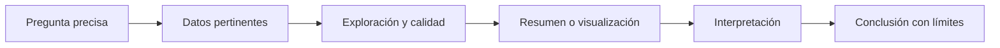
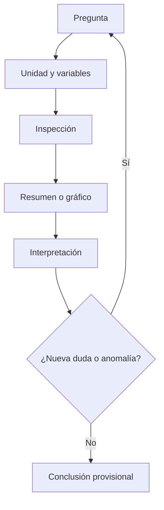

# Materia 1 — Análisis y Visualización de Datos

> **Idea rectora:** este capítulo es **acotado en alcance, profundo en explicación**. Desarrolla una sola materia —Análisis y Visualización de Datos— desde primeros principios y la conecta con la mentoría de jurisprudencia y su TP1. No intenta adelantar aprendizaje automático, NLP avanzado ni RAG.

Esta es la primera materia desarrollada por completo en la ruta de estudio. La podés estudiar sin abrir el notebook del grupo, los apuntes de clase ni otro archivo. Al final hay un apéndice opcional de trazabilidad para cuando quieras comparar esta explicación con los materiales de origen.

El objetivo no es que memorices una lista de gráficos. Es que aprendas a construir una cadena de razonamiento defendible:

```text
pregunta → datos adecuados → exploración → evidencia → conclusión limitada
```

En un proyecto como SAIJ, esa cadena importa más que cualquier biblioteca. Un gráfico prolijo puede estar respondiendo una pregunta mal planteada. Un promedio exacto puede resumir una población mezclada. Un pico temporal puede representar una carga administrativa y no actividad judicial. AVD te enseña a detectar esos problemas **antes** de convertirlos en conclusiones.

---

## 0. Cómo leer este capítulo

### 0.1 Propósito

Al terminar deberías poder:

1. explicar qué significa analizar datos y distinguir descripción, inferencia y predicción;
2. definir dataset, corpus, población, muestra, observación, unidad de análisis, variable, target y metadata;
3. clasificar variables por tipo y escala de medición;
4. elegir resúmenes y gráficos compatibles con cada variable;
5. conducir un EDA como un proceso iterativo de preguntas y comprobaciones;
6. reconocer problemas de calidad sin “limpiar por reflejo”;
7. interpretar centro, dispersión, cuantiles, formas de distribución y outliers;
8. distinguir análisis univariado, bivariado y multivariado;
9. hablar con precisión sobre asociación, correlación, confusión y causalidad;
10. transformar un gráfico en una afirmación con evidencia, límites y próximo paso;
11. explicar qué intenta establecer el TP1 de SAIJ antes de escribir código;
12. separar un resultado propio de un hallazgo informado por el notebook del grupo.

### 0.2 Convenciones de evidencia

Para no apropiarnos de conclusiones ajenas ni presentar supuestos como hechos, usaremos cuatro rótulos:

| Rótulo | Qué significa |
|---|---|
| **Teoría** | Concepto general de AVD que no depende del dataset SAIJ. |
| **Ejemplo ilustrativo** | Datos inventados para aprender; no describen el corpus real. |
| **Hallazgo del notebook del grupo — a reproducir** | Resultado informado por el trabajo de compañeros; Javier todavía debe volver a obtenerlo y validarlo. |
| **Hipótesis o decisión a validar** | Explicación plausible o criterio metodológico pendiente de comprobar. |

Esta separación es parte del método. En ciencia de datos, decir **cómo sabés algo** es tan importante como decir qué creés saber.

### 0.3 Método de estudio sugerido

Hacé cada bloque en cuatro pasadas:

1. **Intuición:** leé la explicación sin detenerte en fórmulas.
2. **Reconstrucción:** cerrá el texto y explicá el concepto con tus palabras.
3. **Transferencia:** inventá un ejemplo cotidiano y otro del corpus jurídico.
4. **Chequeo:** respondé las preguntas de pausa sin mirar.

No abras pandas durante la primera vuelta. Si no podés decidir qué representa una fila, qué querés medir o qué afirmación admitirían los datos, el código solamente automatiza la confusión.

> **Pausa inicial**
>
> Antes de seguir, completá oralmente: “El TP1 no busca entrenar el modelo final. Busca entender ________, detectar ________ y establecer si ________”.

---

## 1. Mapa mental: de una pregunta a una conclusión

### 1.1 La unidad mínima de un análisis

Un análisis no empieza con un archivo. Empieza con una **pregunta**. El archivo importa porque puede —o no— contener evidencia adecuada para responderla.

Tomemos una pregunta de la mentoría:

> ¿La composición de fueros cambia a través del tiempo?

La cadena de razonamiento podría ser:

1. **Pregunta:** ¿cambia la proporción de documentos de cada fuero por año?
2. **Datos:** necesitamos una fecha que represente el evento judicial y una etiqueta de fuero confiable.
3. **Exploración:** inspeccionamos formatos de fecha, faltantes, rango, duplicados, significado de cada reloj y calidad del target.
4. **Evidencia:** calculamos cantidades y proporciones por año, y visualizamos tendencias.
5. **Conclusión:** describimos el patrón observado en el corpus analizado, señalando cobertura, artefactos posibles y límites.

Fijate en dos detalles:

- La pregunta habla de **composición**, por lo que los porcentajes pueden ser más informativos que los conteos absolutos.
- Necesitamos saber qué significa “fecha”. Una fecha de carga al sistema no responde necesariamente cuándo ocurrió la decisión judicial.

### 1.2 Una conclusión nunca es más fuerte que sus eslabones

Podemos imaginar la cadena como una serie de filtros:



Si la pregunta es ambigua, no sabés qué medir. Si la unidad de análisis está mal definida, los conteos no tienen significado. Si la fecha representa otra cosa, la serie temporal cuenta otra historia. Si el gráfico usa una escala engañosa, la evidencia se deforma. Si la interpretación exagera, la conclusión deja de estar respaldada.

### 1.3 Pregunta descriptiva bien formulada

Una buena pregunta descriptiva suele especificar:

- **qué unidad** se cuenta o resume;
- **qué variable** interesa;
- **en qué conjunto** de datos;
- **según qué grupos** se compara;
- **en qué período** o cobertura;
- **con qué propósito** se interpreta.

Ejemplo débil:

> ¿Cómo están los fueros?

Ejemplo mejor:

> Entre los sumarios con `materia` interpretable del corpus analizado, ¿qué proporción corresponde a cada fuero y cuán concentrada está la distribución?

La segunda versión ya anticipa la unidad, el subconjunto, la variable y el tipo de resumen.

> **Recapitulación 1**
>
> - Preguntar viene antes que calcular.
> - La unidad de análisis define qué significa cada conteo.
> - Un campo solo sirve si su significado coincide con la pregunta.
> - Toda conclusión debe conservar las condiciones bajo las cuales se obtuvo.

---

## 2. Qué es analizar datos

### 2.1 Análisis como reducción con sentido

Un dataset puede tener cientos de miles de filas y decenas de columnas. Nadie puede leerlo completo registro por registro. Analizar implica **reducir esa complejidad sin borrar lo que importa**.

La reducción puede adoptar distintas formas:

- un conteo resume muchas observaciones en una cantidad;
- una proporción permite comparar grupos de distinto tamaño;
- una mediana resume una posición central;
- un histograma resume la forma de miles de valores;
- una tabla cruzada resume combinaciones de categorías;
- un gráfico temporal resume cómo cambia una medida.

La palabra clave es “con sentido”. Un promedio de códigos de provincia reduce datos, pero no tiene interpretación. Un único promedio de longitud puede ocultar que conviven sumarios y fallos con estructuras diferentes. Reducir bien requiere comprender la semántica.

### 2.2 Descriptivo, inferencial y predictivo

Estas tres orientaciones responden preguntas distintas.

| Orientación | Pregunta típica | Producto | Alcance prudente |
|---|---|---|---|
| **Descriptiva** | ¿Qué observamos en estos datos? | conteos, proporciones, distribuciones, gráficos | el conjunto efectivamente analizado |
| **Inferencial** | ¿Qué podemos decir sobre una población a partir de una muestra? | estimaciones, intervalos, tests | depende del diseño de muestreo y los supuestos |
| **Predictiva** | ¿Qué valor o clase estimaremos para un caso nuevo? | modelo y evaluación fuera de muestra | casos futuros comparables al entrenamiento |

#### Descriptivo

Si contás documentos por provincia dentro del corpus disponible, estás describiendo el corpus. No demostrás que esa distribución represente toda la actividad judicial argentina.

#### Inferencial

Si quisieras inferir desde una muestra a una población, necesitarías definir esa población y justificar el mecanismo de selección. Una muestra grande no se vuelve representativa por cantidad solamente. Un millón de registros sesgados sigue siendo una gran colección sesgada.

#### Predictivo

Si más adelante querés predecir `fuero` a partir del texto, necesitás target, features y una evaluación honesta en documentos no usados para entrenar. Esa ya es otra etapa. AVD aporta el diagnóstico que permite formularla, pero no la desarrolla.

### 2.3 ¿Dónde queda el TP1?

El TP1 es principalmente **descriptivo y exploratorio**. Puede producir hipótesis para modelado futuro —por ejemplo, que el vocabulario parece variar por fuero—, pero no prueba todavía que un clasificador generalizará bien.

La formulación correcta es:

> “La exploración muestra señales que justifican probar una tarea predictiva.”

No:

> “Vimos palabras distintas, entonces el fuero ya es predecible.”

Para sostener la segunda afirmación haría falta entrenar y evaluar modelos fuera de muestra, controlar fuga de información y analizar errores.

### 2.4 Error común: mezclar verbos

Los verbos orientan el nivel de evidencia:

- **observamos, describimos, comparamos:** apropiados para AVD;
- **estimamos, inferimos:** requieren marco inferencial;
- **predijimos, generaliza:** requieren evaluación predictiva;
- **causa, produce, genera:** requieren diseño causal o evidencia adicional.

> **Pausa 2**
>
> 1. Si CABA concentra muchos registros del corpus, ¿es una descripción o una inferencia sobre la justicia argentina?
> 2. Si una nube de palabras parece distinta por fuero, ¿es evidencia exploratoria o validación predictiva?
> 3. ¿Qué dato adicional necesitarías para interpretar una caída anual como caída real de actividad judicial?

---

## 3. Las piezas del problema: población, corpus, muestra y variables

### 3.1 Dataset y corpus

Un **dataset** es una colección organizada de datos. Puede ser tabular, relacional, geográfica, temporal, textual o una mezcla.

Un **corpus** es una colección de documentos usada como material de análisis lingüístico o documental. El corpus puede estar guardado dentro de un dataset tabular: una fila por documento, columnas de texto y columnas de metadata.

En SAIJ conviven ambos sentidos:

- llamamos **dataset** a la estructura de filas y columnas;
- llamamos **corpus** al conjunto de documentos jurídicos que queremos estudiar.

### 3.2 Población

La **población** es el conjunto total sobre el cual querríamos formular una conclusión.

Posibles poblaciones, que no son equivalentes:

1. todos los registros contenidos en una versión del dataset descargado;
2. todos los documentos registrados por SAIJ en cierto período;
3. toda la jurisprudencia argentina producida en ese período;
4. todos los documentos que un futuro sistema recibirá.

El corpus disponible puede cubrir razonablemente la primera y quizá parte de la segunda. No podemos asumir que representa la tercera. La cobertura institucional, geográfica, temporal y de digitalización puede diferir.

### 3.3 Muestra

Una **muestra** es un subconjunto de una población o colección de referencia.

Muestrear puede ser necesario por memoria o tiempo. Pero hay que conservar:

- el método de selección;
- la semilla aleatoria, si corresponde;
- la fracción tomada;
- la unidad muestreada;
- las comparaciones que verifican similitud con el conjunto de referencia;
- los grupos que podrían haber quedado con pocos casos.

**Hallazgo del notebook del grupo — a reproducir:** el trabajo informa haber usado aproximadamente el 50% del archivo, tomando una fracción aleatoria dentro de bloques por una limitación de memoria. También informa que comparó distribuciones para controlar representatividad operativa. Javier debe revisar el procedimiento y reproducir los chequeos; no alcanza con copiar la justificación.

### 3.4 Observación y unidad de análisis

Una **observación** es una instancia registrada: normalmente una fila, aunque no siempre.

La **unidad de análisis** es aquello sobre lo que se calcula e interpreta una medida. Puede ser:

- documento;
- sumario;
- fallo;
- expediente;
- combinación documento–descriptor;
- provincia–año;
- fuero–año.

La observación física y la unidad analítica pueden divergir. Si una fila contiene una lista de cinco descriptores y la “explotás” en cinco filas, la nueva tabla tiene cinco observaciones descriptor–documento, pero sigue representando un solo documento. Contar filas como documentos quintuplicaría ese caso.

### 3.5 Variable y feature

Una **variable** es una característica que puede tomar valores entre observaciones: provincia, fecha, longitud, tipo de registro.

Una **feature** es una variable usada como entrada de un modelo predictivo. En AVD solemos hablar de variables. “Feature” cobra sentido cuando definimos una tarea de modelado.

No toda variable debería ser feature:

- un identificador sirve para trazabilidad, no necesariamente para aprender patrones;
- una variable que revela el target produce fuga;
- una variable con cobertura desigual puede inducir sesgo;
- una fecha administrativa puede ser irrelevante para el fenómeno jurídico.

### 3.6 Target

El **target** es la variable que un modelo futuro intentaría predecir.

En la mentoría, el candidato es `fuero`. El notebook del grupo informa que no venía como columna lista y que se derivó de `materia`. Esa decisión tiene consecuencias:

1. `materia` deja de ser una feature válida para predecir `fuero`;
2. las reglas de normalización pasan a formar parte de la definición del target;
3. errores y ambigüedades de `materia` se convierten en ruido de etiqueta;
4. categorías compuestas obligan a decidir si la tarea es multiclase o multietiqueta;
5. la distribución final depende de las reglas aplicadas.

### 3.7 Metadata

La **metadata** describe al documento sin ser necesariamente su contenido principal. Ejemplos conceptuales:

- identificador;
- fecha;
- tribunal;
- provincia;
- tipo de registro;
- etiquetas de indexación;
- descriptores;
- fuente.

Metadata no significa “inofensiva”. Provincia, tribunal o descriptores pueden estar fuertemente asociados con el fuero. Son útiles para explorar, filtrar y citar, pero podrían ser features riesgosas.

### 3.8 Ejemplo trabajado: ¿qué estamos contando?

**Ejemplo ilustrativo.** Supongamos esta tabla:

| fila | id | tipo | provincia | materia | descriptores |
|---:|---|---|---|---|---|
| 1 | SU-01 | sumario | Córdoba | LABORAL | [despido, indemnización] |
| 2 | SU-02 | sumario | Córdoba | CIVIL | [daños] |
| 3 | FA-10 | fallo | Santa Fe | — | [contrato, daños, costas] |

Preguntas:

- Si la unidad es **documento**, hay 3.
- Si la unidad es **sumario**, hay 2.
- Si la unidad es **descriptor–documento**, hay 6.
- Si analizamos `materia`, el fallo no tiene valor. Eso puede ser estructural, no una pérdida accidental.

> **Recapitulación 3**
>
> Nunca escribas “hay N casos” sin poder completar “N unidades de tipo ________, después de aplicar ________”.

---

## 4. Tipos de variables y escalas de medición

### 4.1 El tipo estadístico no es el tipo de la computadora

Una columna puede aparecer como texto en el programa y, sin embargo, representar una fecha. Un código de provincia puede estar guardado como entero y seguir siendo categórico. El tipo técnico dice cómo se almacena; el tipo estadístico dice qué operaciones tienen sentido.

### 4.2 Variables categóricas

#### Nominales

Sus categorías no tienen orden inherente.

Ejemplos:

- provincia;
- tribunal;
- tipo de registro;
- fuero, si las ramas se tratan como categorías sin jerarquía.

Operaciones válidas:

- conteos y proporciones;
- moda;
- tablas de contingencia;
- comparación de composición;
- barras, puntos o heatmaps categóricos.

Operaciones inválidas:

- promedio de provincias;
- restar PENAL menos CIVIL;
- interpretar que un código 4 es el doble de un código 2.

#### Ordinales

Tienen orden, pero las distancias entre niveles no están garantizadas.

Ejemplo genérico: prioridad `baja < media < alta`. Sabemos qué viene antes, no que la distancia entre baja y media sea idéntica a la de media y alta.

En SAIJ, muchas variables centrales son nominales; no conviene inventar jerarquías jurídicas para volverlas ordinales.

### 4.3 Variables cuantitativas

#### Discretas

Surgen de contar y suelen tomar enteros:

- cantidad de documentos por fuero;
- número de descriptores por documento;
- cantidad de palabras, si tokenizamos;
- cantidad de documentos por año.

#### Continuas

Conceptualmente pueden tomar cualquier valor en un intervalo:

- duración;
- distancia;
- una medición física.

En este corpus, muchas medidas son conteos y no verdaderamente continuas. Aun así, con muchos valores se pueden analizar con herramientas similares.

### 4.4 Escalas de medición

Otra clasificación útil se enfoca en las operaciones permitidas.

| Escala | Qué conserva | Ejemplo | Operaciones razonables |
|---|---|---|---|
| **Nominal** | igualdad/diferencia | provincia | conteos, proporciones, moda |
| **Ordinal** | orden | prioridad baja/media/alta | lo anterior + posición/mediana con cautela |
| **Intervalo** | distancias iguales, cero arbitrario | año calendario | diferencias; no razones del tipo “el doble” |
| **Razón** | distancias y cero significativo | longitud en palabras | suma, media, cocientes, dispersión |

El año 2000 no es “el doble” del año 1000; su cero no representa ausencia de tiempo. En cambio, 200 palabras sí son el doble de 100 en conteo.

### 4.5 Fechas y tiempo

Las fechas merecen categoría propia porque permiten derivar:

- año, mes o día;
- intervalos entre eventos;
- orden temporal;
- estacionalidad;
- cohortes y períodos.

Pero antes hay una pregunta semántica: **¿fecha de qué?** En un sistema documental puede haber fecha del fallo, fecha de alta, fecha de modificación y timestamp técnico. Son relojes diferentes.

### 4.6 Texto, listas e identificadores

#### Texto libre

No se resume con media o mediana directamente. Primero se deriva una variable interpretable: longitud, cantidad de términos, presencia de una expresión o vector de frecuencias.

#### Listas o estructuras anidadas

Una lista de descriptores no es una categoría simple. Puede requerir analizar:

- cuántos elementos tiene;
- qué términos aparecen;
- qué co-ocurrencias existen;
- cuál es la unidad después de expandirla.

#### Identificadores

Un ID se parece a una variable nominal, pero su función es distinguir y trazar observaciones. Que sea numérico no habilita media, mediana ni correlación.

### 4.7 Por qué el tipo determina el resumen y el gráfico

| Pregunta | Tipo de variable | Resumen | Gráfico posible |
|---|---|---|---|
| ¿Cuántos documentos hay por fuero? | categórica | conteo/proporción | barras ordenadas |
| ¿Cómo se distribuye la longitud? | cuantitativa | mediana, cuantiles, IQR | histograma + boxplot |
| ¿Cómo cambia el volumen por año? | temporal + conteo | serie por año | línea o barras |
| ¿Cómo se asocian provincia y fuero? | dos categóricas | tabla cruzada, porcentajes condicionales | heatmap o barras apiladas |
| ¿Longitud y año se mueven juntas? | dos cuantitativas | correlación y análisis por período | dispersión/transparencia |
| ¿Qué campos faltan por tipo documental? | categóricas + indicador binario | tasa de faltantes por grupo | heatmap de cobertura |

### 4.8 Errores comunes

1. Confiar en `dtype` sin leer valores.
2. Tratar un código como magnitud.
3. Ordenar alfabéticamente una variable temporal.
4. Promediar categorías codificadas con números.
5. Graficar texto crudo sin definir qué aspecto del texto se mide.
6. Convertir ausencias estructurales en ceros, como si “no aplica” significara “ninguno”.

> **Pausa 4**
>
> Clasificá: `id-infojus`, `provincia`, `fecha`, cantidad de palabras, `materia`, lista de descriptores. Para cada una, decí una operación válida y una inválida.

---

## 5. EDA: razonamiento iterativo, no checklist mecánico

### 5.1 Qué es EDA

EDA significa **Análisis Exploratorio de Datos**. Su objetivo es entender qué se midió, cómo está organizado, qué problemas contiene, qué patrones aparecen y qué nuevas preguntas conviene hacer.

No es una sala de espera antes del “análisis verdadero”. Es donde se descubren las condiciones que vuelven válido o inválido todo lo posterior.

### 5.2 El ciclo exploratorio

Un ciclo típico es:

1. formular una pregunta;
2. elegir variables y unidad;
3. inspeccionar estructura y calidad;
4. calcular un resumen o crear un gráfico;
5. interpretar qué muestra y qué no;
6. detectar una anomalía, patrón o ambigüedad;
7. reformular la pregunta;
8. repetir.



La palabra **provisional** importa. En exploración, un patrón abre una línea de investigación; no se transforma automáticamente en ley general.

### 5.3 Ejemplo iterativo con fechas

1. Graficás documentos por año y aparece un pico enorme.
2. Preguntás: ¿es actividad judicial o carga documental?
3. Descubrís dos campos temporales.
4. Comparás fecha del documento con fecha de alta.
5. Revisás qué tipos documentales dominan el pico.
6. Ajustás la interpretación.

El primer gráfico no era inútil ni definitivo: era una **máquina de generar una mejor pregunta**.

### 5.4 Del panorama general al detalle

Una progresión sana:

#### Nivel 1: estructura

- dimensiones;
- nombres y significado de columnas;
- tipos técnicos;
- ejemplo de filas;
- unidad aparente.

#### Nivel 2: calidad

- faltantes;
- duplicados;
- categorías raras;
- rangos y fechas;
- mezcla de poblaciones;
- cobertura por subgrupo.

#### Nivel 3: distribución individual

- conteos, proporciones;
- centro y dispersión;
- forma, cola, extremos;
- categorías dominantes.

#### Nivel 4: relaciones

- cruces entre variables;
- comparaciones condicionales;
- patrones temporales y geográficos;
- posibles confusores.

#### Nivel 5: comunicación

- seleccionar hallazgos;
- comprobar robustez descriptiva;
- escribir límites;
- diseñar gráficos finales.

### 5.5 EDA no significa probar todo

Producir cien gráficos sin una pregunta no es exploración; es acumulación. El criterio para decidir el próximo paso es: **¿qué incertidumbre concreta reduce este cálculo?**

Ejemplo:

- Incertidumbre: no sabemos si los nulos de `tribunal` son errores.
- Próximo paso útil: tasa de cobertura de `tribunal` por tipo de registro.
- Próximo paso poco útil: una nube de palabras global.

### 5.6 Registro de decisiones

Durante el EDA anotá:

| Elemento | Ejemplo de registro |
|---|---|
| Pregunta | ¿Los faltantes dependen del tipo documental? |
| Unidad | documento antes de expandir descriptores |
| Hallazgo | la cobertura cambia fuertemente por tipo |
| Hipótesis | la ausencia puede ser estructural |
| Verificación | cruzar presencia del campo con prefijo/tipo |
| Decisión | no imputar hasta comprender el esquema |
| Límite | el tipo derivado del ID también debe validarse |

### 5.7 Error común: concluir al primer gráfico

Un gráfico puede sugerir que una provincia tiene más documentos. Todavía falta preguntar:

- ¿más conteo o más proporción dentro de un subconjunto?
- ¿hay duplicados?
- ¿la cobertura temporal es comparable?
- ¿se mezclan fallos y sumarios?
- ¿la provincia falta de manera diferencial?
- ¿el pico proviene de una carga masiva?

> **Checkpoint antes de estadística descriptiva**
>
> - [ ] Puedo nombrar la unidad de análisis.
> - [ ] Sé qué representa cada variable clave.
> - [ ] Distingo fecha judicial de fecha administrativa.
> - [ ] Sé qué subconjunto responde mi pregunta.
> - [ ] Tengo una razón para cada resumen o gráfico que produciría.

---

## 6. Calidad de datos: diagnosticar antes de corregir

### 6.1 Calidad “para qué”

La calidad no es una propiedad absoluta. Un campo puede ser suficiente para describir cobertura y, a la vez, inadecuado para entrenar un modelo. Una fila sin `materia` puede ser inútil para construir `fuero`, pero valiosa para estudiar fallos completos.

La pregunta no es solo “¿está sucio?”, sino:

> ¿Este dato es apto para esta pregunta, bajo esta unidad y este criterio?

### 6.2 Esquema

El **esquema** describe qué columnas existen, qué tipos esperan, qué restricciones deberían cumplir y cómo se relacionan.

Chequeos básicos:

- columnas esperadas y inesperadas;
- tipos técnicos;
- campos completamente vacíos;
- estructuras anidadas;
- identificadores únicos o repetidos;
- reglas por tipo documental;
- campos obligatorios según población.

Un dataset que mezcla varios esquemas en una sola tabla produce grandes zonas de nulos. Eso no significa necesariamente pérdida; puede significar que una columna aplica a un tipo y no a otro.

### 6.3 Valores faltantes

Conviene distinguir al menos cuatro casos:

| Tipo de ausencia | Significado | Ejemplo conceptual | Acción inicial |
|---|---|---|---|
| **Accidental** | el dato debía estar pero se perdió | sumario sin fecha por error | investigar origen e impacto |
| **Estructural** | el campo no aplica | campo exclusivo de fallo en un sumario | conservar como “no aplica” o separar poblaciones |
| **Informativa** | la ausencia aporta señal | ciertos tipos rara vez tienen descriptor | medir indicador y distribución por grupo |
| **Representación técnica** | existe pero quedó codificado raro | cadena vacía, `"null"`, lista vacía | normalizar representación |

#### Por qué imputar puede inventar

Si completás una provincia faltante con la moda, fabricás más casos de la provincia dominante. Si completás un texto inexistente con una cadena vacía y luego medís longitud, mezclás “sin documento” con “documento de longitud cero”.

Primero explicá por qué falta. Después decidí si excluir, imputar, separar o mantener.

### 6.4 Duplicados

Hay varios conceptos distintos:

- fila exactamente repetida;
- mismo ID con contenido idéntico;
- mismo ID con versiones diferentes;
- mismo texto bajo IDs distintos;
- repetición legítima por relación uno-a-muchos;
- duplicación introducida por una expansión o unión.

Antes de borrar, preguntá:

1. ¿qué define identidad en el dominio?
2. ¿puede haber versiones?
3. ¿qué columna tiene prioridad?
4. ¿el duplicado existía en origen o lo generó el pipeline?
5. ¿qué conteos se inflan si lo conservo?

### 6.5 Categorías inconsistentes

Ejemplos genéricos:

```text
LABORAL
Laboral
LAABORAL
LABORAL
PENAL.
```

Normalizar puede involucrar:

- mayúsculas/minúsculas;
- tildes;
- espacios y separadores;
- errores de tipeo;
- sinónimos;
- categorías compuestas;
- etiquetas transversales que no representan la categoría buscada.

Cada regla debe quedar visible. Si `fuero` se deriva de esta limpieza, cambiar una regla modifica el target y todos sus conteos.

### 6.6 Valores imposibles e improbables

Un valor **imposible** contradice una regla firme: una fecha que no se puede parsear, un conteo negativo, un ID vacío si es obligatorio.

Un valor **improbable** es raro pero posible: un documento muy antiguo, un texto extremadamente largo o una categoría con tres casos.

No los trates igual. Lo imposible suele requerir corrección o exclusión documentada. Lo improbable requiere diagnóstico.

### 6.7 Poblaciones documentales mezcladas

**Hallazgo del notebook del grupo — a reproducir:** el trabajo identifica tres tipos de registro mediante estructura y prefijos: sumarios, fallos y novedades. Informa que novedades y filas sin identificador fueron excluidas para la tarea de clasificación, mientras que sumarios y fallos se conservaron como poblaciones pertinentes.

Lo importante para aprender no es memorizar esa decisión, sino reconstruir su lógica:

1. mirar patrones de cobertura;
2. identificar grupos de filas con esquemas distintos;
3. inspeccionar ejemplos reales de cada grupo;
4. relacionar cada grupo con la pregunta del TP1;
5. justificar inclusión o exclusión por pertenencia y contenido, no por un umbral arbitrario de nulos.

### 6.8 Perfil de calidad recomendado

Para cada variable clave, construí una ficha conceptual:

| Variable | Rol | Cobertura global | Cobertura por tipo | Validez | Consistencia | Riesgo |
|---|---|---:|---:|---|---|---|
| `id-infojus` | identificación | a reproducir | a reproducir | patrón/prefijo | unicidad | filas sin contenido |
| `materia` | fuente del target | a reproducir | a reproducir | etiquetas válidas | typos/compuestas | target ruidoso |
| `texto` | contenido candidato | a reproducir | a reproducir | no vacío/markup | formato | mezcla de poblaciones |
| `fecha` | tiempo judicial candidato | a reproducir | a reproducir | parseable/rango | semántica | extremos y cobertura |
| `provincia` | metadata geográfica | a reproducir | a reproducir | catálogo | variantes | sesgo geográfico |

### 6.9 Errores comunes

1. Borrar toda columna con muchos nulos sin segmentar por tipo.
2. Completar ausencias estructurales con la moda.
3. Deduplicar por fila cuando la identidad real depende del ID o la versión.
4. Normalizar categorías sin conservar el valor original.
5. Declarar “error” todo valor raro.
6. Aplicar una regla de limpieza porque mejora un gráfico.
7. No informar cuántas observaciones se pierden en cada filtro.

> **Recapitulación 6**
>
> Limpiar no es embellecer la tabla. Es decidir qué representa el conjunto analizado. Toda limpieza cambia el universo de la conclusión.

---

## 7. Estadística descriptiva desde la intuición

### 7.1 Conteos y proporciones

El **conteo** responde cuántas unidades cumplen una condición.

La **proporción** responde qué parte del total representan:

$$
p = \frac{k}{n}
$$

donde:

- $p$ es la proporción;
- $k$ es la cantidad de observaciones con la característica;
- $n$ es la cantidad total de observaciones consideradas.

Para expresarla como porcentaje, multiplicamos por 100.

**Ejemplo ilustrativo.** Si 60 de 200 sumarios pertenecen a LABORAL:

$$
p = \frac{60}{200} = 0{,}30 = 30\%
$$

El denominador debe acompañar siempre la interpretación. “30% laboral” no significa lo mismo si el total incluye fallos sin `materia`, si solo incluye sumarios etiquetados o si corresponde a una provincia.

### 7.2 Media

La **media aritmética** reparte el total en partes iguales:

$$
\bar{x} = \frac{1}{n}\sum_{i=1}^{n} x_i
$$

Símbolos:

- $\bar{x}$: media de la muestra;
- $n$: cantidad de observaciones;
- $x_i$: valor de la observación $i$;
- $\sum$: suma de todos los valores desde $i=1$ hasta $i=n$.

**Intuición:** es el punto de equilibrio de los valores. Usa la magnitud de todos, por eso un extremo puede moverla mucho.

**Ejemplo ilustrativo de longitud:** 40, 50, 60, 70 y 280 palabras.

$$
\bar{x} = \frac{40+50+60+70+280}{5} = 100
$$

La media es 100, aunque cuatro de cinco documentos miden 70 palabras o menos.

### 7.3 Mediana

La **mediana** es el valor central después de ordenar.

En el ejemplo:

```text
40, 50, 60, 70, 280
```

La mediana es 60. Si el último documento tuviera 2.800 palabras, seguiría siendo 60. Por eso es robusta ante extremos.

Si hay cantidad par, se toma el promedio de los dos valores centrales. La mediana describe una **posición**, no el balance de magnitudes.

### 7.4 Moda

La **moda** es el valor o categoría más frecuente. Es especialmente útil para variables nominales.

Puede haber:

- una moda;
- varias modas;
- ninguna moda clara.

Decir que PENAL es la moda solo informa que es la categoría más frecuente; no dice cuánto domina. Necesitás el conteo y la proporción.

### 7.5 Rango

$$
R = x_{\max} - x_{\min}
$$

donde:

- $R$ es el rango;
- $x_{\max}$ es el máximo;
- $x_{\min}$ es el mínimo.

Es fácil de interpretar, pero depende de solo dos valores. Un único error puede inflarlo de manera enorme.

### 7.6 Varianza

La varianza muestral resume cuánto se alejan los datos de la media:

$$
s^2 = \frac{1}{n-1}\sum_{i=1}^{n}(x_i-\bar{x})^2
$$

Símbolos:

- $s^2$: varianza muestral;
- $n$: cantidad de observaciones;
- $x_i$: valor individual;
- $\bar{x}$: media muestral;
- $x_i-\bar{x}$: desvío de cada valor respecto de la media;
- el cuadrado evita que desvíos positivos y negativos se cancelen;
- $n-1$ es el denominador usado para estimar la varianza poblacional a partir de una muestra.

La varianza queda en unidades al cuadrado. Si medimos palabras, queda en palabras², poco intuitivo.

### 7.7 Desvío estándar

$$
s = \sqrt{s^2}
$$

El desvío estándar es la raíz de la varianza y vuelve a la unidad original. Un desvío alto indica valores más dispersos alrededor de la media.

No significa que todos los datos estén a exactamente un desvío. Tampoco es robusto a outliers, porque depende de la media y de distancias al cuadrado.

### 7.8 Cuantiles, cuartiles e IQR

Un **cuantil** indica el valor debajo del cual cae cierta proporción de observaciones ordenadas.

- $Q_1$: primer cuartil, cerca del percentil 25;
- $Q_2$: percentil 50, la mediana;
- $Q_3$: tercer cuartil, cerca del percentil 75.

El rango intercuartílico es:

$$
IQR = Q_3 - Q_1
$$

Describe el ancho del 50% central. Como no depende de máximos y mínimos, suele ser más robusto ante colas largas.

**Ejemplo ilustrativo.** Si $Q_1=50$, mediana $=75$ y $Q_3=110$ palabras:

- la mitad central tiene longitudes entre 50 y 110;
- $IQR=60$ palabras;
- no sabemos todavía si la distribución tiene una o varias modas;
- tampoco sabemos cuán larga es la cola superior.

### 7.9 Qué reportar según la forma

| Situación | Centro preferible | Dispersión preferible | Complemento |
|---|---|---|---|
| Distribución aproximadamente simétrica | media | desvío estándar | histograma |
| Asimetría o cola larga | mediana | IQR/cuantiles | histograma + boxplot |
| Categórica | moda + proporciones | concentración/entropía si hiciera falta | barras |
| Grupos muy desiguales | mediana y proporciones por grupo | IQR y tamaño de cada grupo | gráficos comparables |

“Preferible” no significa ocultar lo demás. Reportar media y mediana juntas puede revelar asimetría.

### 7.10 Ejemplo trabajado completo

**Ejemplo ilustrativo.** Longitudes de ocho sumarios:

```text
20, 40, 50, 60, 70, 80, 100, 380
```

- conteo: 8;
- mínimo: 20;
- máximo: 380;
- rango: 360;
- media: 100;
- mediana: 65;
- interpretación: la media supera bastante a la mediana por la cola derecha;
- recomendación: informar mediana, cuantiles e histograma, sin borrar automáticamente el documento de 380 palabras.

### 7.11 Errores comunes

1. Informar media sin tamaño de muestra ni dispersión.
2. Usar la media para categorías.
3. Llamar “promedio” sin aclarar media o mediana.
4. Interpretar el IQR como rango total.
5. Comparar desvíos sin considerar escalas o centros.
6. Redondear antes de calcular proporciones.
7. Usar porcentajes con denominadores diferentes sin decirlo.

> **Checkpoint 7**
>
> Si media = 100 y mediana = 65 para longitud, ¿qué sospechás? ¿Qué gráfico pedirías? ¿Eliminarías el máximo? La respuesta correcta empieza con “depende de…”.

---

## 8. Distribuciones: la película detrás de un resumen

### 8.1 Qué es una distribución

Una distribución describe qué valores toma una variable y con qué frecuencia. Dos conjuntos pueden compartir media y mediana, pero diferir en dispersión, forma, colas o cantidad de picos.

Por eso una sola cifra nunca cuenta toda la historia.

### 8.2 Simetría y asimetría

En una distribución aproximadamente simétrica, las colas se parecen y media/mediana suelen estar próximas.

En una distribución con **asimetría positiva** o sesgo a la derecha:

- la mayoría de los valores se concentra abajo;
- pocos valores muy altos forman una cola larga;
- la media suele quedar por encima de la mediana.

Las longitudes documentales suelen presentar este patrón: muchos textos moderados y unos pocos muy extensos. “Suele” no reemplaza medirlo en SAIJ.

### 8.3 Colas largas

Una cola larga significa que los valores extremos son poco frecuentes, pero pueden alejarse mucho del centro.

Consecuencias:

- la media y el desvío se vuelven sensibles;
- un histograma lineal puede comprimir la masa principal;
- percentiles altos, como P90 o P99, aportan información;
- una escala logarítmica puede ayudar, si se explica;
- los extremos no son automáticamente errores.

### 8.4 Multimodalidad

Una distribución **multimodal** tiene más de un pico. Puede indicar:

- poblaciones mezcladas;
- procesos distintos;
- categorías no separadas;
- mediciones en unidades diferentes;
- cortes temporales o institucionales.

Ejemplo: si la longitud tiene dos picos, quizá uno corresponde a sumarios y otro a fallos. Calcular una única media global ocultaría la estructura.

### 8.5 Desbalance de clases

Para un target categórico, la “distribución” es la frecuencia de cada clase. Hay **desbalance** cuando algunas clases tienen muchos más casos que otras.

Describirlo requiere:

- conteo por clase;
- proporción por clase;
- cantidad de clases;
- acumulación de las clases principales;
- tamaño de la cola minoritaria;
- cobertura antes y después de normalizar etiquetas.

El desbalance puede ser real en el corpus y seguir siendo problemático para modelado. Las dos cosas no se contradicen.

**Hallazgo del notebook del grupo — a reproducir:** el trabajo informa un desbalance extremo y una fuerte concentración en pocos fueros. No uses los porcentajes o umbrales del notebook como resultado propio hasta rehacer el target y los conteos.

### 8.6 Histograma: decisiones que cambian la lectura

Un histograma agrupa valores numéricos en intervalos o *bins*. La altura muestra cuántas observaciones caen en cada intervalo.

Problemas posibles:

- pocos bins ocultan multimodalidad;
- demasiados bins producen ruido;
- intervalos de ancho desigual requieren densidad, no conteo bruto;
- comparar grupos con tamaños distintos exige normalización o paneles;
- una cola extrema puede volver ilegible el centro.

La forma que ves es una combinación de datos y decisiones gráficas. Probá resoluciones razonables y comprobá que la interpretación no dependa de una sola.

### 8.7 Boxplot: resumen, no detector de errores

El boxplot representa aproximadamente:

- caja entre $Q_1$ y $Q_3$;
- línea de mediana;
- bigotes según una convención, a menudo 1,5 IQR;
- puntos fuera de los bigotes.

Esos puntos son **candidatos estadísticos a extremos**, no “datos falsos”. Un boxplot tampoco revela bien multimodalidad ni huecos.

### 8.8 Comparar distribuciones

Para comparar longitudes por fuero:

1. informá $n$ de cada grupo;
2. usá misma escala;
3. compará mediana e IQR;
4. mirá solapamiento, no solo centros;
5. considerá histogramas facetados o boxplots;
6. evitá un violinplot con grupos diminutos;
7. no atribuyas diferencias al fuero sin revisar tipo, período u otros confusores.

> **Recapitulación 8**
>
> La distribución es la forma completa. Centro, dispersión, cola y picos contestan preguntas distintas. El desbalance es la distribución de un target categórico.

---

## 9. Outliers: primero diagnosticar, después decidir

### 9.1 Qué es un outlier

Un outlier es una observación alejada del patrón principal según algún criterio. Puede ser:

1. error de carga;
2. error de transformación;
3. valor válido y raro;
4. miembro de otra población;
5. evento excepcional relevante;
6. señal de que la distribución elegida como referencia no es adecuada.

### 9.2 Regla de 1,5 IQR

Una convención común marca candidatos fuera de:

$$
L_{inf} = Q_1 - 1{,}5\,IQR
$$

$$
L_{sup} = Q_3 + 1{,}5\,IQR
$$

donde:

- $L_{inf}$ y $L_{sup}$ son límites inferior y superior;
- $Q_1$ y $Q_3$ son los cuartiles;
- $IQR$ es el rango intercuartílico;
- 1,5 es una convención, no una ley natural.

Superar el límite dice “revisar”, no “borrar”.

### 9.3 Diagnóstico en cinco preguntas

Para cada extremo:

1. **¿Es válido técnicamente?** ¿La fecha parsea? ¿La longitud se calculó bien?
2. **¿Es posible en el dominio?** ¿Puede existir un fallo de esa fecha?
3. **¿Pertenece a la misma población?** ¿Es sumario o fallo completo?
4. **¿Cambia la conclusión?** Compará análisis con y sin el caso, sin ocultarlo.
5. **¿Es el objeto de interés?** Si estudiás documentos excepcionalmente largos, eliminarlo destruye la pregunta.

### 9.4 Ejemplo legal

Un documento con 20.000 palabras podría ser:

- un fallo completo válido;
- un campo que concatenó varios documentos;
- markup contado como texto;
- una población distinta de los sumarios breves;
- un error de parsing.

La longitud sola no alcanza. Hay que inspeccionar tipo, ID, texto inicial, estructura y campos relacionados.

### 9.5 Análisis de sensibilidad

Una práctica honesta es informar:

- resumen con todos los valores válidos;
- resumen robusto —mediana/IQR—;
- resultado después de una exclusión justificada;
- cantidad y porcentaje excluidos;
- efecto sobre la conclusión.

Si una conclusión cambia por quitar tres casos válidos, esa fragilidad es un resultado importante.

### 9.6 Error común: confundir rareza con suciedad

Las clases jurídicas minoritarias no son errores por tener pocos documentos. Una fecha histórica extrema no es inválida por ser antigua. Un valor raro se evalúa con evidencia de dominio y procedencia.

> **Pausa 9**
>
> Encontrás 55 textos de más de 1.000 palabras. ¿Qué harías antes de excluirlos? Escribí al menos cuatro verificaciones y una forma de informar la decisión.

---

## 10. Análisis univariado, bivariado y multivariado

### 10.1 Univariado: una variable

Pregunta: ¿cómo se distribuye la longitud de `texto`?

Herramientas:

- conteo de valores válidos;
- media, mediana, cuantiles e IQR;
- histograma;
- boxplot;
- inspección de extremos.

Pregunta categórica: ¿cuántos documentos hay por fuero?

- conteos;
- proporciones;
- moda;
- barras ordenadas;
- concentración acumulada.

El análisis univariado establece la gramática básica de cada variable antes de cruzarla con otra.

### 10.2 Bivariado: relación entre dos variables

Casos típicos:

| Variables | Pregunta | Resumen/gráfico |
|---|---|---|
| cuantitativa + cuantitativa | ¿se mueven juntas? | dispersión, correlación |
| categórica + cuantitativa | ¿cambia la distribución por grupo? | resumen por grupo, boxplot/histogramas |
| categórica + categórica | ¿cambia la composición? | tabla cruzada, porcentajes condicionales, heatmap |
| tiempo + cuantitativa/conteo | ¿cómo evoluciona? | serie temporal |

Ejemplos SAIJ:

- provincia y fuero;
- tipo de registro y presencia de `texto`;
- fuero y longitud;
- año y cantidad de documentos.

### 10.3 Multivariado: controlar contexto

Agregamos una tercera o más variables para evitar una lectura simplista.

Ejemplo:

> La longitud parece variar por fuero.

Preguntas multivariadas:

- ¿sigue variando al separar sumarios y fallos?
- ¿cambia según período?
- ¿la provincia altera la composición?
- ¿los grupos tienen tamaños comparables?

Herramientas accesibles:

- tablas agrupadas por dos o tres dimensiones;
- paneles o *facets*;
- color con función clara;
- normalizaciones por fila o columna;
- comparaciones estratificadas.

### 10.4 Progresión recomendada

No empieces con un gráfico de cinco dimensiones. Avanzá así:

1. entender cada variable;
2. cruzar pares con pregunta explícita;
3. detectar posible confusor;
4. condicionar por ese confusor;
5. comparar si la relación persiste.

> **Checkpoint 10**
>
> Si provincia y fuero están asociados, y año también cambia según provincia, ¿alcanza con un único gráfico fuero–año? ¿Qué estratificaciones probarías?

---

## 11. Relaciones: asociación no es causalidad

### 11.1 Asociación

Dos variables están asociadas cuando conocer una cambia lo que esperamos de la otra. La asociación puede ser:

- positiva o negativa;
- lineal o no lineal;
- fuerte o débil;
- global o solo dentro de subgrupos;
- real o producida por mezcla, selección o medición.

### 11.2 Correlación

La correlación resume, en un número, cierto tipo de asociación entre variables numéricas. La correlación de Pearson se enfoca en relación lineal y toma valores entre -1 y 1:

- cerca de 1: relación lineal positiva fuerte;
- cerca de -1: relación lineal negativa fuerte;
- cerca de 0: poca relación **lineal**.

Una correlación cero no descarta una relación curva. Un valor alto no prueba causalidad. Los outliers pueden dominarla.

### 11.3 Relaciones categóricas

Provincia y fuero no se correlacionan con Pearson porque son categorías. Se analizan con:

- tabla de contingencia;
- conteos conjuntos;
- proporciones por fila: “dentro de cada provincia, composición por fuero”;
- proporciones por columna: “dentro de cada fuero, procedencia provincial”;
- heatmap o barras apiladas, cuidando grupos pequeños.

Normalizar por fila y por columna responde preguntas distintas. Siempre declaralo.

### 11.4 Confusión

Un **confusor** es una tercera variable asociada tanto con la supuesta causa como con el resultado, capaz de producir o distorsionar una relación.

Ejemplo ilustrativo:

- observamos textos más largos en un fuero;
- ese fuero contiene una proporción mayor de fallos completos;
- el tipo documental explica gran parte de la longitud;
- atribuir la diferencia al fuero sería apresurado.

### 11.5 Correlación no implica causalidad

Que dos variables cambien juntas admite varias explicaciones:

1. A causa B;
2. B causa A;
3. C causa A y B;
4. selección o medición induce la relación;
5. coincidencia;
6. ambas son tendencias temporales sin vínculo directo.

Con datos observacionales, una visualización suele establecer asociación, no causalidad.

### 11.6 Patrones temporales

Una serie temporal requiere distinguir:

- tendencia;
- cambios de cobertura;
- estacionalidad;
- cambios de definición;
- migraciones administrativas;
- períodos incompletos;
- autocorrelación;
- eventos externos.

**Hallazgo del notebook del grupo — a reproducir:** el trabajo distingue `fecha` del documento y fecha/timestamp de carga, e interpreta ciertos picos como posibles migraciones. Esta es una lección conceptual sólida: primero identificar qué reloj responde la pregunta. Los números y la explicación concreta deben reproducirse y contrastarse.

Una caída durante 2019–2020 no debe atribuirse automáticamente a la pandemia solo porque la historia resulta plausible. Puede formularse como hipótesis, pero requiere evidencia externa y controles de cobertura.

### 11.7 Patrones geográficos

Un mapa o conteo por provincia puede reflejar:

- volumen real de actividad;
- cobertura de la fuente;
- digitalización desigual;
- diferencias de clasificación;
- concentración institucional;
- faltantes diferenciales.

“Más registros” no equivale a “más litigios” sin conocer el proceso de generación del dato.

### 11.8 Paradoja de Simpson, sin formalismo excesivo

Una relación global puede desaparecer o invertirse al separar por grupos.

Ejemplo ilustrativo:

- globalmente, los textos de CIVIL parecen más largos que los de PENAL;
- al separar por tipo documental, dentro de sumarios y dentro de fallos ocurre lo contrario;
- la diferencia global provenía de la proporción distinta de tipos.

La lección: compará relaciones **marginales** —sin condicionar— con relaciones **condicionales** —dentro de grupos relevantes—.

> **Recapitulación 11**
>
> - Pearson sirve para asociación lineal numérica, no para categorías.
> - Una tabla cruzada cambia de sentido según su denominador.
> - Temporal y geográfico suelen mezclar fenómeno con cobertura.
> - Asociación abre preguntas; causalidad exige un argumento mucho más fuerte.

---

## 12. Gramática de visualización

### 12.1 Un gráfico es una traducción

Visualizar significa traducir variables a propiedades visuales:

- posición;
- longitud;
- color;
- tamaño;
- forma;
- panel;
- conexión temporal.

Una buena traducción conserva la relación que querés comunicar. La posición sobre un eje común suele ser más precisa que área, ángulo o volumen.

### 12.2 Secuencia de diseño

Antes de elegir biblioteca o estilo:

1. **Pregunta:** ¿qué quiero que el lector compare?
2. **Unidad:** ¿cada marca representa documento, grupo, año o proporción?
3. **Variable:** ¿es categórica, numérica, temporal o geográfica?
4. **Resumen:** ¿conteo, proporción, mediana, distribución, relación?
5. **Codificación:** ¿posición, longitud, color, panel?
6. **Escala:** ¿lineal, logarítmica, cero significativo, límites comunes?
7. **Orden:** ¿por valor, tiempo o jerarquía real?
8. **Etiquetas:** ¿se entiende unidad, universo y período?
9. **Incertidumbre:** ¿hay estimación que requiera intervalo o variabilidad?
10. **Interpretación:** ¿qué frase prudente permite escribir?

### 12.3 Tabla de selección

| Pregunta | Gráfico recomendado | Qué mirar | Riesgo frecuente |
|---|---|---|---|
| Comparar categorías | barras horizontales o puntos | magnitud, orden, concentración | demasiadas categorías, eje truncado |
| Ver una distribución numérica | histograma | picos, asimetría, cola | bins engañosos |
| Resumir distribuciones por grupo | boxplot | mediana, IQR, extremos | creer que puntos son errores |
| Ver forma por pocos grupos grandes | violinplot/histogramas | densidad y solapamiento | usarlo con n pequeño |
| Relacionar dos numéricas | scatterplot | forma, densidad, outliers | sobreposición, causalidad |
| Evolución temporal | línea o barras por período | tendencia, cortes, picos | unir períodos faltantes |
| Relacionar dos categóricas | heatmap o barras apiladas | composición condicional | no aclarar normalización |
| Mostrar faltantes por grupo | heatmap de cobertura | patrones estructurales | confundir ausencia con cero |
| Mostrar co-ocurrencia | matriz/heatmap o red pequeña | pares frecuentes | doble conteo y categorías raras |
| Mostrar estimación e incertidumbre | punto + intervalo | magnitud y rango | ocultar referencia o muestra |

### 12.4 Escalas honestas

#### Barras

La longitud representa magnitud; por eso el eje cuantitativo debe comenzar en cero casi siempre. Si una barra de 101 parece el doble de una de 100 por comenzar el eje en 99, el gráfico exagera.

#### Líneas

Una línea enfatiza variación. Puede usarse un rango acotado si se declara claramente, se conserva contexto y no se presenta la altura como magnitud total.

#### Logaritmos

Una escala logarítmica puede ser útil para colas largas o clases con diferencias de órdenes de magnitud. Debe rotularse y explicarse: distancias iguales representan razones multiplicativas, no diferencias aditivas.

### 12.5 Orden

- categorías nominales: ordenar por valor suele facilitar comparación;
- tiempo: orden cronológico;
- ordinales: respetar orden semántico;
- fueros: para un gráfico principal, ordenar por frecuencia; para comparar varios gráficos, conservar el mismo orden.

Orden alfabético sirve para búsqueda, no siempre para análisis.

### 12.6 Color

Usá color con función:

- resaltar una categoría;
- distinguir pocos grupos;
- codificar intensidad en una escala secuencial;
- representar desviación alrededor de un centro con escala divergente.

Evitá:

- un color distinto para cada una de treinta categorías;
- rojo/verde como único canal;
- arcoíris para magnitudes ordenadas;
- color decorativo que compite con el mensaje.

### 12.7 Etiquetas y contexto

Un gráfico debería permitir responder:

- ¿qué se contó?
- ¿sobre qué subconjunto?
- ¿en qué unidad?
- ¿en qué período?
- ¿qué filtros se aplicaron?
- ¿qué significa el color?
- ¿los valores son conteos o porcentajes?

Título descriptivo:

> Documentos por provincia

Título orientado a hallazgo, solo después de validarlo:

> La cobertura del corpus analizado se concentra en pocas jurisdicciones

Subtítulo metodológico:

> Proporción de documentos con provincia válida; muestra y reglas de limpieza a reproducir.

### 12.8 Incertidumbre

En AVD, muchas visualizaciones son descripciones del corpus y no necesitan intervalos inferenciales. Pero sí deben mostrar variabilidad descriptiva cuando corresponde:

- distribución completa, no solo media;
- tamaño de grupo;
- rango o cuantiles;
- sensibilidad a filtros;
- cobertura y faltantes.

Si el gráfico comunica una estimación de población, la incertidumbre inferencial debe incorporarse. Eso se desarrollará en otra parte de la materia, no es el centro del TP1 SAIJ.

### 12.9 Ejemplos de interpretación

#### Barras de fuero

Lectura débil:

> Penal es el mayor.

Lectura mejor:

> Dentro de los sumarios con target interpretable, pocas categorías concentran gran parte de los registros; esto describe un target desbalanceado y anticipa desafíos de evaluación.

Límite:

> La distribución depende de las reglas usadas para derivar `fuero` y de la cobertura del corpus.

#### Heatmap provincia–fuero

Lectura débil:

> Provincia predice fuero.

Lectura mejor:

> La composición por fuero varía entre provincias dentro del corpus, lo que sugiere asociación entre metadata geográfica y target.

Límite:

> La asociación puede reflejar cobertura institucional o temporal; no demuestra una relación causal ni garantiza generalización.

#### Serie temporal

Lectura débil:

> En 2013 hubo más justicia.

Lectura mejor:

> El volumen de registros cargados alcanza un pico en cierto período; hay que contrastar fecha judicial y fecha administrativa antes de interpretarlo como actividad.

### 12.10 Errores comunes

1. Elegir gráfico por costumbre y no por pregunta.
2. Usar torta con muchas categorías.
3. Comparar áreas o 3D.
4. Cortar eje de barras.
5. Mezclar conteos y porcentajes.
6. No mostrar denominadores.
7. Usar títulos causales para evidencia descriptiva.
8. Saturar con leyendas, colores y etiquetas.
9. Comunicar un hallazgo sin su filtro.
10. Mostrar todos los gráficos exploratorios en el reporte final.

> **Checkpoint de visualización**
>
> Para cada gráfico del TP1, escribí antes una oración: “El lector debe poder comparar ________ para responder ________”. Si no podés completarla, todavía no elegiste el gráfico.

---

## 13. Sesgo, representatividad y fuga

### 13.1 Sesgo de selección y muestreo

Un conjunto está sesgado si el proceso de inclusión favorece sistemáticamente ciertos casos.

Posibles fuentes:

- qué organismos aportan documentos;
- qué períodos fueron digitalizados;
- qué provincias tienen mejor cobertura;
- qué tipos de documento se conservan;
- qué filas caben en memoria;
- qué campos permiten derivar el target.

El muestreo aleatorio dentro de un archivo puede representar bien **ese archivo** y no resolver el sesgo con respecto a toda la jurisprudencia argentina.

### 13.2 Cobertura temporal

Preguntas necesarias:

- ¿todos los años están completos?
- ¿la fecha tiene el mismo significado en todo el período?
- ¿hubo cargas retrospectivas?
- ¿cambió el sistema de registro?
- ¿los años recientes están cerrados?
- ¿la composición de tipos documentales cambia?

### 13.3 Cobertura geográfica

Una provincia dominante puede reflejar concentración real, mejor digitalización o mayor integración con la fuente. Sin información del proceso de cobertura, el gráfico describe el corpus, no la realidad nacional completa.

### 13.4 Sesgo de medición

Ocurre cuando la variable registrada no representa de manera uniforme el concepto.

Ejemplos:

- `materia` puede combinar criterios o tener errores;
- `fecha` puede referir a eventos distintos;
- `provincia` puede representar tribunal, origen o jurisdicción según esquema;
- descriptores dependen del proceso de indexación humana.

### 13.5 Sesgo de supervivencia

Analizar solo documentos conservados, digitalizados y disponibles deja fuera los que no “sobrevivieron” al proceso de registro. El corpus visible puede ser una fracción sistemática del fenómeno.

### 13.6 Leakage o fuga de información

Hay fuga cuando una variable de entrada contiene información que no estaría legítimamente disponible o revela de manera directa/indirecta el target.

En SAIJ:

- si `fuero` se deriva de `materia`, usar `materia` como feature es fuga directa;
- descriptores creados por indexadores que conocían el caso pueden contener una señal muy cercana al target;
- provincia o tribunal pueden permitir atajos institucionales;
- una normalización aprendida usando todo el dataset puede filtrar información futura;
- duplicados entre entrenamiento y prueba producirían evaluación inflada.

En TP1 no entrenamos, pero debemos **advertir** estas rutas para no diseñar mal el paso siguiente.

### 13.7 Preguntas de representatividad

Antes de generalizar:

1. ¿Cuál es la población objetivo exacta?
2. ¿Cómo ingresó cada caso al corpus?
3. ¿Qué quedó fuera?
4. ¿La cobertura cambia por tiempo, geografía o institución?
5. ¿La muestra conserva subgrupos relevantes?
6. ¿Las exclusiones afectan de forma desigual a las clases?
7. ¿La conclusión dice “en el corpus” o “en Argentina”?

> **Recapitulación 13**
>
> Representatividad no se compra con muchas filas. Depende del proceso que produjo e incluyó los datos.

---

## 14. Texto como dato, al nivel de AVD

### 14.1 Qué hacemos y qué no hacemos aquí

En este capítulo tratamos texto como una fuente de variables descriptivas. Nos interesa:

- cobertura de campos textuales;
- longitud;
- vocabulario;
- términos frecuentes;
- stopwords;
- n-gramas;
- diferencias descriptivas entre grupos.

Dejamos para materias posteriores:

- modelado de lenguaje;
- clasificación supervisada;
- embeddings en profundidad;
- ajuste de modelos;
- búsqueda semántica;
- evaluación de RAG.

### 14.2 Elegir el campo textual

No elijas por nombre. Compará candidatos:

| Criterio | Pregunta |
|---|---|
| Cobertura | ¿qué porcentaje de la población tiene valor? |
| Longitud | ¿hay contenido suficiente para el objetivo? |
| Ruido | ¿contiene markup, IDs, encabezados repetidos? |
| Semántica | ¿describe hechos, decisión, título o etiqueta? |
| Población | ¿aplica a sumarios, fallos o ambos? |
| Riesgo | ¿es contenido genuino o metadata que delata el target? |

**Hallazgo del notebook del grupo — a reproducir:** se informa que `texto` ofrece un cuerpo narrativo más largo que `sumario`, `titulo` y `caratula` dentro del subconjunto estudiado, y se lo elige para ciertos análisis. Javier debe reproducir cobertura, definición de longitud y comparación; además debe verificar que los nombres de campo representan lo que el notebook asume.

### 14.3 Longitud documental

Podés medir:

- caracteres;
- palabras separadas por espacios;
- tokens según un tokenizador;
- oraciones;
- párrafos.

No son equivalentes. “Cantidad de palabras” depende de la regla de tokenización. Para comparar resultados, documentá:

- limpieza previa;
- tratamiento de markup;
- minúsculas;
- signos;
- números;
- campos vacíos;
- unidad de conteo.

La longitud ayuda a:

- comparar campos;
- detectar poblaciones;
- encontrar extremos;
- anticipar costos de procesamiento;
- evaluar si un texto aporta señal suficiente.

No prueba calidad semántica.

### 14.4 Vocabulario

El **vocabulario** es el conjunto de términos únicos bajo una regla de normalización.

Su tamaño depende de:

- cantidad de documentos;
- longitud;
- mayúsculas y tildes;
- variantes morfológicas;
- errores y markup;
- números e identificadores;
- tokenización.

Comparar vocabulario bruto entre un fuero grande y uno pequeño es injusto: más textos dan más oportunidades de encontrar palabras únicas.

### 14.5 Frecuencia de términos

La frecuencia responde cuántas veces aparece un término. Puede calcularse:

- por ocurrencias totales;
- por cantidad de documentos que lo contienen;
- globalmente;
- por fuero;
- normalizada por tamaño del grupo.

Una palabra puede ser frecuente y poco distintiva. “Sentencia” podría aparecer en muchos fueros. La frecuencia describe presencia, no capacidad predictiva.

### 14.6 Stopwords

Las **stopwords** son palabras muy frecuentes que, según el objetivo, aportan poca diferenciación: artículos, preposiciones y conectores.

Removerlas puede hacer visibles términos de contenido, pero no siempre es inocuo:

- negaciones como “no” pueden cambiar sentido;
- expresiones jurídicas dependen de palabras funcionales;
- la lista general de español puede no servir al dominio;
- términos jurídicos transversales no son stopwords lingüísticas, aunque sean poco distintivos.

Compará resultados con y sin stopwords. No presentes la remoción como una verdad universal.

### 14.7 N-gramas

Un **n-grama** es una secuencia de $n$ tokens consecutivos:

- unigrama: `daños`;
- bigrama: `daños perjuicios`;
- trigrama: `recurso extraordinario federal`.

Ventajas:

- preservan expresiones;
- dan contexto local;
- pueden distinguir lenguaje técnico.

Costos:

- vocabulario mucho mayor;
- más términos raros;
- sensibilidad a variantes;
- necesidad de normalizar con cuidado.

### 14.8 Distintivo no es causal ni predictivo todavía

Si ciertos términos aparecen más en LABORAL, podés decir:

> “En el corpus y bajo esta preparación, estos términos tienen mayor presencia relativa en documentos etiquetados como LABORAL.”

No podés concluir todavía:

> “El modelo clasificará bien casos laborales nuevos.”

Eso requiere evaluación predictiva.

### 14.9 Descriptores como metadata humana

El notebook del grupo trata `descriptores` como metadata de indexación y explora su relación con `materia`. Conceptualmente son valiosos para:

- describir temas;
- evaluar cobertura;
- estudiar co-ocurrencias;
- comparar términos elegidos y normalizados.

También son riesgosos como feature porque fueron generados con conocimiento experto del documento y podrían acercarse demasiado al target. En AVD corresponde documentar esa posibilidad, no resolverla por intuición.

### 14.10 Errores comunes en texto

1. Contar markup como vocabulario.
2. Comparar vocabulario sin controlar cantidad de textos.
3. Quitar todas las stopwords sin revisar negaciones.
4. Confundir frecuencia con distintividad.
5. Usar nube de palabras como evidencia cuantitativa principal.
6. Analizar fallos y sumarios juntos sin controlar tipo.
7. Tratar descriptores como texto libre.
8. Presentar un patrón léxico como rendimiento de modelo.

> **Checkpoint 14**
>
> Antes de contar palabras, deberías poder escribir: “Analizo el campo ________, en unidades de ________, sobre documentos de tipo ________, después de remover ________, para responder ________”.

---

## 15. Comunicación: del gráfico a una afirmación útil

### 15.1 Explorar y comunicar son tareas distintas

En exploración, hacés gráficos para vos: probás escalas, segmentaciones y preguntas. En comunicación, seleccionás solo lo necesario para que otra persona entienda un hallazgo y sus límites.

Un reporte final no es el depósito de todos los gráficos generados.

### 15.2 Estructura de una afirmación

Una afirmación analítica completa tiene cinco piezas:

1. **Universo:** sobre qué datos se habla;
2. **Patrón:** qué se observó;
3. **Evidencia:** qué resumen/gráfico lo respalda;
4. **Límite:** qué no permite concluir;
5. **Acción:** qué decisión o verificación sigue.

Plantilla:

> En **[universo]**, observamos **[patrón]**, respaldado por **[evidencia]**. Esto sugiere **[interpretación prudente]**, aunque **[límite]**. Por lo tanto, conviene **[acción]**.

### 15.3 Ejemplo trabajado

Versión incompleta:

> Hay desbalance.

Versión analítica:

> Entre los sumarios con `fuero` derivable bajo las reglas documentadas, pocas clases concentran la mayoría de los registros. Los conteos y proporciones ordenadas muestran una cola de clases pequeñas. Esto anticipa que una métrica global podría ocultar mal desempeño minoritario, aunque todavía no evalúa ningún modelo. El próximo paso es decidir el alcance de clases y conservar los tamaños por clase para una futura evaluación.

### 15.4 Separar evidencia de explicación

Evidencia:

> “El volumen de cargas presenta un pico en 2013.”

Explicación posible:

> “Podría corresponder a una migración masiva.”

Verificación:

> “Comparar fechas judiciales con fechas de alta y composición documental del pico.”

No saltees del primer renglón al segundo como si fueran equivalentes.

### 15.5 Título, anotación y pie

Un gráfico de comunicación puede incluir:

- título con el patrón validado;
- subtítulo con universo y filtros;
- anotación sobre pico o categoría;
- pie con fuente, unidad y advertencia;
- texto posterior con interpretación y próximo paso.

### 15.6 Conclusión accionable

“Accionable” no significa recomendar política pública con un EDA. Significa que el hallazgo guía una decisión siguiente.

Ejemplos:

- separar sumarios y fallos antes de medir faltantes;
- mantener ambos relojes y no usar timestamp como fecha judicial;
- conservar valor original y versión normalizada de `materia`;
- controlar provincia/tribunal como atajos potenciales;
- evaluar el texto elegido después de limpiar markup;
- no usar una clase con tres casos sin una decisión explícita.

### 15.7 Lista de control para una conclusión

- [ ] Nombra el subconjunto.
- [ ] Nombra la unidad.
- [ ] Distingue conteo de proporción.
- [ ] No usa causalidad sin diseño causal.
- [ ] Separa dato observado de explicación.
- [ ] Incluye limitación de cobertura.
- [ ] No presenta resultado del grupo como propio.
- [ ] Indica qué se debería verificar o decidir.

---

## 16. Aplicación detallada a SAIJ y conexión exacta con TP1

### 16.1 Qué intenta lograr el TP1

El TP1 busca construir un **diagnóstico exploratorio del corpus**. Antes del código, Javier debería poder contar esta historia metodológica:

1. recibimos una colección tabular de documentos y metadata;
2. verificamos qué representa cada fila y detectamos poblaciones documentales;
3. evaluamos esquema, nulos, IDs, categorías y fechas;
4. definimos qué subconjunto responde la futura tarea;
5. construimos de manera transparente el target candidato `fuero`;
6. describimos su distribución y ambigüedades;
7. analizamos cobertura geográfica y temporal;
8. seleccionamos y caracterizamos campos textuales;
9. exploramos términos y expresiones sin confundirlos con una validación predictiva;
10. comunicamos hallazgos, riesgos y decisiones para la curación posterior.

### 16.2 Qué informa el material del grupo

El notebook del equipo funciona como **roadmap y contexto**, no como prueba reproducida por Javier. Informa, entre otras cosas:

- un archivo original de gran tamaño, con cientos de miles de filas y decenas de columnas;
- una muestra operativa del 50% por limitación de memoria;
- coexistencia de sumarios, fallos y novedades;
- ausencia estructural de campos según el tipo documental;
- construcción de `fuero` a partir de `materia`;
- normalización de typos y protección de categorías compuestas;
- desbalance fuerte;
- concentración geográfica;
- diferencias entre fecha judicial y fecha de carga;
- co-ocurrencia de fueros;
- elección de un campo textual por cobertura y longitud;
- limpieza de markup;
- longitud asimétrica y cola larga;
- análisis de vocabulario, stopwords, n-gramas y términos distintivos;
- estudio de descriptores como metadata humana.

Cada punto es una **afirmación del notebook** hasta que Javier ejecute, revise y documente el análisis.

### 16.3 Matriz “pregunta → evidencia → riesgo → TP1”

| Pregunta | Evidencia descriptiva esperada | Riesgo de mala lectura | Qué debe producir Javier |
|---|---|---|---|
| ¿Qué representa una fila? | ejemplos + cobertura + patrón de ID | asumir homogeneidad | definición por tipo documental |
| ¿Qué campos aplican a cada tipo? | tasa de no nulos por tipo | llamar “pérdida” a un no-aplica | matriz de cobertura |
| ¿Qué se excluye? | conteos antes/después + ejemplos | borrar por porcentaje | regla de pertenencia y contenido |
| ¿Cómo se define `fuero`? | valores originales, normalizados y reglas | ocultar decisiones del target | diccionario y casos ambiguos |
| ¿Está desbalanceado? | conteos y proporciones | inferir desempeño de modelo | barras + acumulación + límite |
| ¿Hay sesgo geográfico? | conteos y composición condicional | equiparar registros con actividad | gráfico + nota de cobertura |
| ¿Hay patrón temporal? | serie por fecha judicial y carga | atribuir picos sin validar | comparación de relojes |
| ¿Co-ocurren fueros? | pares y proporciones multi-etiqueta | doble conteo/tokenización mala | matriz y regla para compuestos |
| ¿Qué texto conviene? | cobertura, longitud, ruido, semántica | elegir solo por mediana | tabla comparativa |
| ¿Qué palabras aparecen? | frecuencia con/sin stopwords | confundir frecuencia con señal | términos + interpretación |
| ¿Qué expresiones aparecen? | bigramas/trigramas | explosión de términos raros | top n-gramas con soporte |
| ¿Hay léxico diferencial? | medidas relativas por fuero | afirmar predicción | hipótesis para modelado futuro |
| ¿Sirven descriptores? | cobertura, frecuencia, asociación | leakage | ficha de utilidad y riesgo |

### 16.4 Antes de cargar datos: ficha del análisis

Completá esto por escrito:

```text
Problema descriptivo:
Unidad de análisis primaria:
Tipos documentales esperados:
Población que querríamos representar:
Colección realmente disponible:
Subconjunto del TP1:
Target futuro:
Fuente del target:
Campos textuales candidatos:
Metadata relevante:
Relojes temporales posibles:
Sesgos esperables:
Qué NO puede concluir el TP1:
```

### 16.5 Secuencia conceptual del TP1

#### Etapa A — Inspección estructural

Debés comprender:

- tamaño y forma;
- nombres y significado de columnas;
- tipos técnicos versus estadísticos;
- unidad aparente;
- campos anidados;
- patrones de ID.

Resultado esperado: un diccionario inicial y preguntas, no una limpieza definitiva.

#### Etapa B — Poblaciones y calidad

Debés comprender:

- qué tipos de registro conviven;
- qué campos son exclusivos o compartidos;
- qué nulos son estructurales;
- qué filas carecen de contenido;
- qué identificadores se repiten;
- qué categorías requieren normalización.

Resultado esperado: reglas de inclusión/exclusión justificadas y conteos de impacto.

#### Etapa C — Target `fuero`

Debés comprender:

- que target no viene “dado por naturaleza”;
- que se construye con reglas;
- que categorías compuestas pueden ser multietiqueta;
- que etiquetas transversales exigen decisión de dominio;
- que conservar valor original es obligatorio para auditar;
- que `materia` no podrá usarse luego como feature.

Resultado esperado: mapeo reproducible, cobertura del target y lista de ambigüedades.

#### Etapa D — Distribución y sesgos

Debés comprender:

- diferencia entre conteos y proporciones;
- desbalance y cola de clases;
- composición por provincia;
- dos relojes temporales;
- posible asociación entre metadata y target;
- diferencia entre cobertura del corpus y fenómeno judicial.

Resultado esperado: gráficos interpretados con límites.

#### Etapa E — Texto

Debés comprender:

- población textual analizada;
- campo elegido y por qué;
- limpieza de markup;
- definición de token/longitud;
- distribución de longitud;
- vocabulario condicionado por tamaño del grupo;
- efecto de stopwords;
- utilidad y costo de n-gramas;
- diferencia entre términos frecuentes y distintivos.

Resultado esperado: hipótesis lingüísticas, no un modelo.

#### Etapa F — Reporte

Debés producir una narrativa, no una galería:

1. qué datos había;
2. qué estructura se descubrió;
3. qué decisiones se tomaron;
4. qué patrones aparecen;
5. qué riesgos quedan;
6. qué debe resolver la materia siguiente.

### 16.6 Semáforo de afirmaciones

| Color | Tipo de frase | Ejemplo |
|---|---|---|
| Verde | descripción directa y reproducida | “En el subconjunto X, la mediana fue Y.” |
| Amarillo | interpretación plausible | “El pico podría reflejar una migración de carga.” |
| Rojo | afirmación no respaldada | “La pandemia causó la caída” o “el modelo generalizará”. |

### 16.7 Qué Javier debe reproducir, no copiar

1. dimensiones de la fuente descargada y versión;
2. tamaño y método exacto de la muestra;
3. conteos por tipo documental;
4. columnas eliminadas y razón individual;
5. cobertura por tipo;
6. reglas de normalización de `materia`;
7. conteos/proporciones de `fuero`;
8. distribución por provincia y reloj temporal;
9. casos que sostienen la interpretación de picos;
10. elección de campo textual;
11. distribución de longitud;
12. vocabulario y términos bajo preparación documentada;
13. análisis de descriptores;
14. conclusiones revisadas después de ver resultados propios.

### 16.8 Qué no debe afirmar todavía

- que el corpus representa toda la jurisprudencia argentina;
- que una provincia tiene más actividad porque tiene más registros;
- que la pandemia causó una caída sin evidencia adicional;
- que una clase minoritaria carece de importancia;
- que un término frecuente es predictivo;
- que el fuero puede predecirse bien sin evaluación fuera de muestra;
- que descriptores no generan leakage;
- que el 50% es representativo solo porque es grande;
- que todos los outliers son errores;
- que los resultados del grupo son resultados propios.

> **Checkpoint final antes de código**
>
> Podés empezar el TP1 propio cuando puedas explicar sin mirar:
>
> - por qué una tabla puede contener varias poblaciones;
> - por qué un nulo puede ser estructural;
> - cómo una regla de limpieza define el target;
> - por qué conteo y proporción responden distinto;
> - por qué fecha judicial y fecha de carga no son intercambiables;
> - por qué un patrón léxico no valida un clasificador;
> - qué conclusión concreta debería acompañar cada gráfico.

---

## 17. Ejercicios conceptuales progresivos — sin código

Intentá resolverlos en papel. No mires las respuestas hasta terminar.

### Ejercicio 1 — La pregunta antes del archivo

Reescribí esta pregunta para que sea analizable:

> “¿Qué pasa con los tribunales?”

Debe incluir unidad, subconjunto, variable de comparación y período o cobertura.

### Ejercicio 2 — Unidad de análisis

Un documento tiene cuatro descriptores y, después de expandir la lista, ocupa cuatro filas.

1. ¿Cuántos documentos hay?
2. ¿Cuántas unidades descriptor–documento hay?
3. ¿Qué error aparece si contás las filas expandidas como documentos?

### Ejercicio 3 — Población y corpus

El dataset contiene documentos que SAIJ pudo registrar y digitalizar. Explicá por qué una muestra aleatoria del 50% del archivo puede representar bien el archivo y aun así no representar toda la jurisprudencia argentina.

### Ejercicio 4 — Tipos y escalas

Clasificá cada variable y elegí un resumen válido:

- provincia;
- año del fallo;
- cantidad de palabras;
- `id-infojus`;
- prioridad hipotética baja/media/alta;
- lista de descriptores.

### Ejercicio 5 — Faltantes estructurales

`tribunal` aparece en fallos pero casi nunca en sumarios. La tasa global de faltantes es alta.

1. ¿Por qué la tasa global puede engañar?
2. ¿Qué tabla construirías?
3. ¿Imputarías el tribunal más frecuente?

### Ejercicio 6 — Target construido

`fuero` se deriva de `materia`, corrigiendo typos y separando etiquetas compuestas.

1. ¿Por qué `materia` no debería ser feature?
2. ¿Qué valores conservarías para auditar?
3. ¿Qué decisión conceptual exige `CIVIL COMERCIAL`?

### Ejercicio 7 — Centro y cola

Longitudes: 30, 40, 50, 60, 70, 350.

1. Calculá media y mediana.
2. ¿Cuál describe mejor el caso típico?
3. ¿Qué información adicional pedirías?

### Ejercicio 8 — IQR y outliers

Un boxplot marca como extremo un fallo muy largo.

1. ¿Qué significa realmente la marca?
2. Enumerá cuatro causas posibles.
3. ¿Cuándo conservarlo sería obligatorio?

### Ejercicio 9 — Multimodalidad

El histograma de longitud tiene dos picos claros. Proponé tres hipótesis y una comprobación para cada una.

### Ejercicio 10 — Desbalance

Una clase tiene 60% de los documentos y cinco clases comparten el 40% restante.

1. ¿Qué gráficos/resúmenes usarías?
2. ¿Qué podés afirmar en AVD?
3. ¿Qué no podés afirmar todavía sobre un modelo?

### Ejercicio 11 — Tabla categórica

Un heatmap provincia–fuero está normalizado por fila.

1. ¿Qué pregunta responde?
2. ¿Qué pregunta respondería normalizar por columna?
3. ¿Por qué los conteos siguen siendo necesarios?

### Ejercicio 12 — Dos relojes

Hay un pico en `timestamp` de carga, pero no en fecha del fallo.

1. ¿Cuál es la interpretación mínima?
2. ¿Qué hipótesis administrativa aparece?
3. ¿Qué sería una afirmación causal injustificada?

### Ejercicio 13 — Texto y stopwords

Sin stopwords dominan “de”, “la”, “que”. Al removerlas aparecen “ley”, “recurso”, “sentencia”.

1. ¿Qué aprendiste?
2. ¿Por qué no deberías eliminar automáticamente “no”?
3. ¿Frecuencia equivale a distintividad por fuero?

### Ejercicio 14 — De gráfico a claim

Escribí una afirmación completa para un gráfico que muestra concentración geográfica. Debe contener universo, evidencia, límite y acción siguiente.

### Ejercicio 15 — Crítica de conclusión

Evaluá esta frase:

> “Como los términos laborales y penales se ven distintos en las nubes de palabras, demostramos que el modelo predecirá el fuero con alta precisión.”

Identificá al menos cuatro saltos o problemas.

### Ejercicio 16 — Diseño mínimo de TP1

Sin código, dibujá una secuencia de ocho pasos desde la carga conceptual del corpus hasta el reporte. Para cada paso escribí una pregunta y una evidencia esperada.

---

## 18. Clave de respuestas razonadas

### Respuesta 1

Una versión posible:

> Entre los fallos con tribunal y fecha válidos del corpus analizado, ¿cómo se distribuye la cantidad de documentos por tipo de tribunal entre 2000 y 2020?

Es mejor porque define unidad —fallo—, subconjunto, variable y período. Otra formulación es válida si mantiene esos elementos.

### Respuesta 2

1. Hay un documento.
2. Hay cuatro pares descriptor–documento.
3. Contar filas como documentos infla el volumen y da más peso a documentos con más descriptores. El error no es técnico: cambia la unidad y sesga los conteos.

### Respuesta 3

La aleatoriedad opera dentro del marco de muestreo: el archivo. Si el archivo subcubre provincias, períodos o instituciones, la muestra heredará esa subcobertura. Un procedimiento puede ser representativo de su fuente y no de una población más amplia.

### Respuesta 4

- **Provincia:** categórica nominal; conteos/proporciones y moda.
- **Año:** temporal, escala de intervalo; conteos por año y diferencias temporales.
- **Cantidad de palabras:** cuantitativa discreta, escala de razón; mediana, cuantiles, media, dispersión.
- **ID:** identificador; unicidad y duplicados, no promedio.
- **Prioridad:** ordinal; conteos y orden, mediana posicional con cautela.
- **Lista de descriptores:** semiestructurada; cantidad por documento, frecuencias y co-ocurrencias después de definir la unidad.

### Respuesta 5

1. Mezcla tipos a los que el campo aplica con tipos a los que no aplica.
2. Una tabla tipo documental × presencia de tribunal, con conteos y proporciones dentro de cada tipo.
3. No. Imputar inventaría un tribunal para sumarios donde el campo quizá no corresponde y reforzaría la categoría dominante.

### Respuesta 6

1. Porque contiene la fuente con la que se construyó la respuesta; el modelo recibiría la solución o una aproximación directa.
2. Conservaría `materia_original`, una versión normalizada, la lista de tokens/etiquetas resultante, `fuero` final y la regla o versión del mapeo.
3. Decidir si el problema será multietiqueta, si se elige un fuero principal, si se crea una clase compuesta o si se excluye de un análisis particular. No hay respuesta automática: depende del objetivo y debe documentarse.

### Respuesta 7

La suma es 600; la media es $600/6=100$. La mediana es el promedio de los dos centrales, $(50+60)/2=55$. La mediana describe mejor la posición típica porque el 350 arrastra la media. Pediríamos cuantiles, IQR, histograma, tipo documental y validación del extremo. “Mejor” depende de la pregunta: si interesa carga total de procesamiento, la media y el valor extremo también importan.

### Respuesta 8

1. Significa que el valor cae fuera de los bigotes según una convención; no que sea falso.
2. Fallo completo válido, concatenación accidental, markup contado, error de parsing, población diferente o evento excepcional.
3. Si la pregunta estudia fallos largos, anomalías o costos máximos, conservarlo es central. También se conserva mientras no haya evidencia suficiente para excluirlo.

### Respuesta 9

Hipótesis y controles:

1. Sumarios y fallos mezclados → colorear o facetar por tipo.
2. Unidades o campos distintos → inspeccionar origen y regla de longitud.
3. Períodos con prácticas documentales diferentes → comparar histogramas por período.

También podrían existir idiomas, tribunales o procesos de carga distintos. La multimodalidad genera preguntas; no identifica por sí sola la causa.

### Respuesta 10

1. Barras ordenadas con conteos y porcentajes, más acumulación de clases principales.
2. Que el target observado está concentrado y cuál es el soporte de cada clase.
3. No podés afirmar accuracy, F1, capacidad de generalización ni clase más difícil. El desbalance anticipa riesgos, pero todavía no hay modelo evaluado.

### Respuesta 11

1. Dentro de cada provincia, qué proporción corresponde a cada fuero.
2. Dentro de cada fuero, de qué provincias provienen los documentos.
3. Un porcentaje extremo basado en dos casos no tiene la misma estabilidad descriptiva que uno basado en miles. Los conteos revelan soporte.

### Respuesta 12

1. El sistema registró muchas altas en ese período; eso no implica muchos fallos ocurridos entonces.
2. Puede haber una migración, digitalización o cambio administrativo.
3. “Ese año aumentó la actividad judicial por X” sería injustificado sin evidencia sobre fecha judicial, cobertura y evento externo.

### Respuesta 13

1. Las palabras funcionales dominaban el conteo bruto y su remoción hace visibles términos de contenido.
2. La negación cambia significado: “corresponde” y “no corresponde” no son equivalentes.
3. No. Un término puede ser frecuente en todos los fueros y no distinguir ninguno. Hay que comparar frecuencias relativas y distribución entre clases.

### Respuesta 14

Ejemplo:

> En los documentos con provincia válida del subconjunto analizado, las barras de conteo y proporción muestran concentración en pocas jurisdicciones. El patrón describe la cobertura del corpus, no necesariamente la actividad judicial nacional, porque el proceso de digitalización puede ser desigual. Conviene comparar cobertura por período y tipo documental antes de usar provincia en análisis posteriores.

Incluye universo, evidencia, límite y acción.

### Respuesta 15

Problemas:

1. una nube de palabras es una visualización imprecisa para comparar magnitudes;
2. no controla tamaño de clase ni frecuencia relativa;
3. puede reflejar leakage, markup o metadata;
4. diferencia exploratoria no equivale a rendimiento fuera de muestra;
5. no hay split, modelo, métrica ni análisis de errores;
6. “alta precisión” no está cuantificada;
7. clases parecidas o minoritarias podrían fallar aunque algunas se separen visualmente.

Conclusión prudente: el patrón léxico justifica probar una representación y un baseline en una etapa futura.

### Respuesta 16

Una secuencia válida:

1. definir pregunta y unidad;
2. inspeccionar esquema;
3. identificar poblaciones;
4. diagnosticar calidad;
5. definir subconjunto y target;
6. describir distribución, tiempo y geografía;
7. explorar campos textuales;
8. comunicar hallazgos y límites.

Cada paso debe asociarse a evidencia: ejemplos, tablas de cobertura, conteos antes/después, reglas, gráficos y conclusiones. El orden puede iterar; lo importante es no construir target ni interpretar gráficos antes de entender la estructura.

---

## 19. Autoevaluación final

Marcá solo lo que puedas explicar con un ejemplo nuevo, no lo que “te suena”.

### Fundamentos

- [ ] Distingo descripción, inferencia y predicción.
- [ ] Puedo formular una pregunta con unidad, universo y variables.
- [ ] Distingo dataset, corpus, población y muestra.
- [ ] Explico por qué una muestra grande puede no ser representativa.
- [ ] Distingo observación física y unidad analítica.

### Variables

- [ ] Clasifico nominal, ordinal, discreta, continua, fecha, texto, lista e ID.
- [ ] Distingo tipo técnico y estadístico.
- [ ] Elijo resúmenes compatibles con la escala.
- [ ] Explico target, feature y metadata.
- [ ] Detecto una ruta de leakage.

### EDA y calidad

- [ ] Explico EDA como ciclo iterativo.
- [ ] Distingo nulo accidental, estructural e informativo.
- [ ] Defino duplicado según unidad y dominio.
- [ ] No borro categorías raras sin diagnóstico.
- [ ] Documento impacto de filtros.
- [ ] Reconozco poblaciones documentales mezcladas.

### Descriptiva

- [ ] Calculo e interpreto conteo y proporción.
- [ ] Explico media y mediana desde la intuición.
- [ ] Explico rango, varianza, desvío, cuantiles e IQR.
- [ ] Elijo medidas robustas ante asimetría.
- [ ] Distingo distribución, cola larga, multimodalidad y desbalance.
- [ ] Trato outliers como casos a diagnosticar.

### Relaciones y visualización

- [ ] Distingo univariado, bivariado y multivariado.
- [ ] Sé analizar dos categóricas sin Pearson.
- [ ] Diferencio asociación, confusión y causalidad.
- [ ] Interpreto patrones temporales y geográficos con cautela.
- [ ] Elijo gráfico por pregunta.
- [ ] Uso escala, orden, color y etiquetas con función.
- [ ] Paso de gráfico a claim con evidencia y límites.

### SAIJ y TP1

- [ ] Explico por qué sumarios, fallos y novedades no deben mezclarse sin control.
- [ ] Explico por qué algunos nulos pueden ser estructurales.
- [ ] Explico cómo la limpieza de `materia` define `fuero`.
- [ ] Sé qué resultados del notebook del grupo debo reproducir.
- [ ] Distingo fecha judicial y fecha de carga.
- [ ] Puedo diseñar el análisis de desbalance.
- [ ] Comparo campos textuales por cobertura, longitud, ruido y semántica.
- [ ] Explico stopwords y n-gramas sin adelantar NLP profundo.
- [ ] No presento un patrón léxico como modelo validado.
- [ ] Puedo narrar el TP1 de principio a fin antes de programar.

---

## 20. Glosario esencial

| Término | Definición operativa |
|---|---|
| **Análisis descriptivo** | Resume lo observado en un conjunto de datos. |
| **Análisis inferencial** | Usa una muestra y supuestos para estimar una población. |
| **Análisis predictivo** | Estima valores o clases para casos no vistos. |
| **Asimetría** | Falta de simetría de una distribución; suele manifestarse en una cola más larga. |
| **Asociación** | Relación estadística entre variables sin implicar causalidad. |
| **Causalidad** | Relación en la que un cambio en una variable produce cambio en otra; requiere evidencia más fuerte que correlación. |
| **Confusor** | Variable relacionada con otras dos que distorsiona su asociación aparente. |
| **Corpus** | Colección de documentos usada para análisis. |
| **Cuantil** | Valor que deja debajo una proporción especificada de observaciones ordenadas. |
| **Dataset** | Colección estructurada de datos. |
| **Desbalance** | Distribución desigual de casos entre clases. |
| **Descriptor** | Metadata de indexación que resume un concepto asociado al documento. |
| **Desvío estándar** | Raíz de la varianza; dispersión en la unidad original. |
| **Distribución** | Valores posibles de una variable y frecuencia con que aparecen. |
| **Duplicado** | Registro repetido según una definición de identidad; depende de la unidad y el dominio. |
| **EDA** | Proceso iterativo de explorar estructura, calidad, distribuciones y relaciones. |
| **Feature** | Variable usada como entrada de un modelo. |
| **Fuga / leakage** | Uso de información que revela indebidamente el target o no estaría disponible de forma legítima. |
| **Histograma** | Gráfico que agrupa valores numéricos en intervalos. |
| **IQR** | $Q_3-Q_1$; ancho del 50% central. |
| **Media** | Suma de valores dividida por cantidad; sensible a extremos. |
| **Mediana** | Valor central de los datos ordenados; robusta a extremos. |
| **Metadata** | Información que describe origen, contexto o estructura de un documento. |
| **Moda** | Valor o categoría más frecuente. |
| **Muestra** | Subconjunto de una población o colección de referencia. |
| **Multimodalidad** | Presencia de más de un pico en una distribución. |
| **N-grama** | Secuencia contigua de $n$ tokens. |
| **Observación** | Instancia registrada, a menudo una fila. |
| **Outlier** | Observación alejada del patrón principal que requiere diagnóstico. |
| **Población** | Conjunto total sobre el que se desea concluir. |
| **Proporción** | Parte de un total: cantidad de interés dividida por total relevante. |
| **Rango** | Diferencia entre máximo y mínimo. |
| **Representatividad** | Grado en que los datos reflejan la población objetivo según su proceso de selección. |
| **Robusto** | Poco sensible a valores extremos o cambios razonables. |
| **Sesgo** | Distorsión sistemática introducida por selección, medición, cobertura o procesamiento. |
| **Stopword** | Palabra muy frecuente cuya utilidad depende del objetivo; su remoción no es automática. |
| **Target** | Variable que un modelo futuro intentará predecir. |
| **Token** | Unidad de texto definida por una regla de segmentación. |
| **Unidad de análisis** | Entidad sobre la que se calcula e interpreta una medida. |
| **Variable** | Característica que toma valores entre observaciones. |
| **Varianza** | Promedio ajustado de desvíos cuadrados respecto de la media. |

---

## 21. Puente a la Materia 2 — Análisis Exploratorio y Curación de Datos

El paso siguiente toma los hallazgos de AVD y los convierte en un dataset defendible.

AVD pregunta:

> ¿Qué tenemos, cómo se distribuye y qué problemas o patrones aparecen?

Exploración y Curación pregunta:

> ¿Qué reglas de inclusión, normalización, deduplicación y transformación necesitamos para que los datos sean aptos para un objetivo concreto?

Allí se profundizarán:

- tratamiento de faltantes según mecanismo y uso;
- normalización auditable de categorías;
- deduplicación por identidad documental;
- limpieza de texto sin destruir semántica;
- separación de capas crudas y curadas;
- controles de calidad reproducibles;
- preparación de datasets de entrenamiento y evaluación;
- prevención práctica de leakage.

La desarrollamos a continuación. El puente conceptual que conecta ambas materias es:

```text
AVD descubre y argumenta → Curación decide y transforma
```

Si terminás este capítulo pudiendo justificar cada pregunta, denominador, gráfico y límite del TP1, llegás a la curación con el problema correctamente planteado.

---


